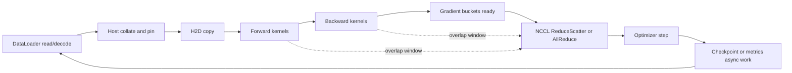
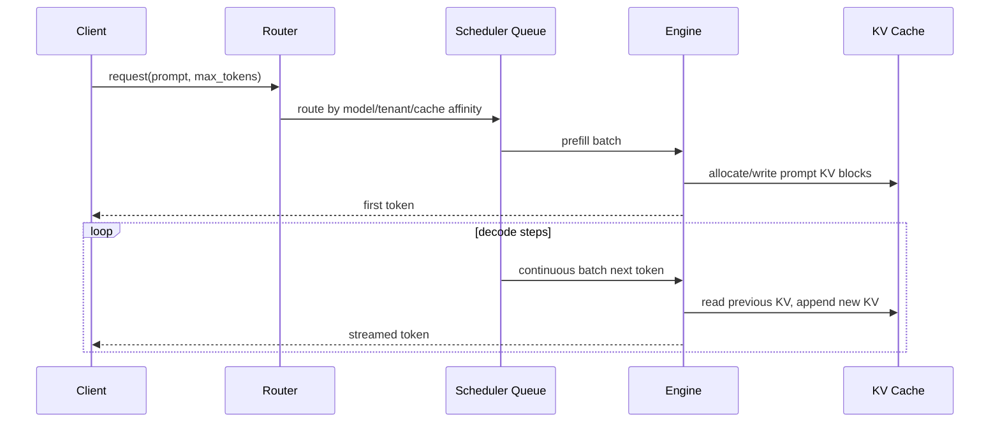
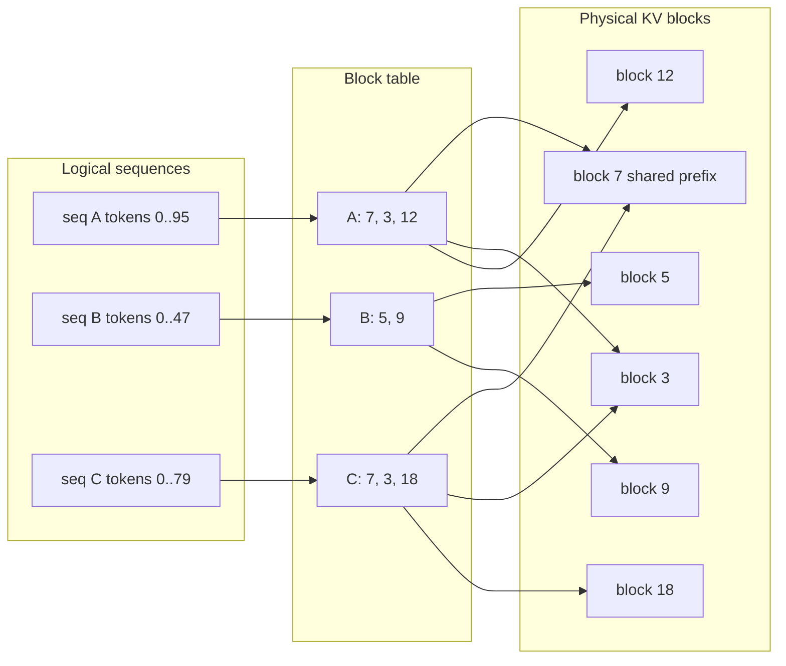
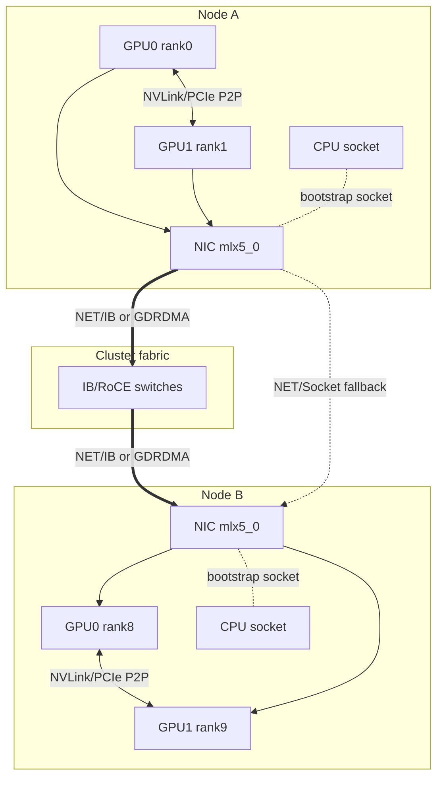
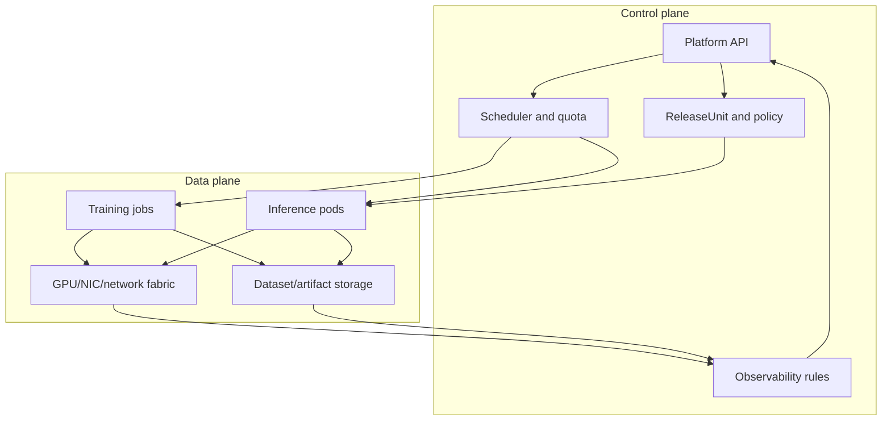

# 附录J：Mermaid 图表资产

> 本附录收集正文中可复用的 Mermaid 图表草稿。它们用于解释链路、瓶颈和责任边界，不替代正文中的指标、命令和事故证据。

## 训练 step critical path

用途：帮助读者把一次训练 step 拆成数据、计算、通信、优化器和 checkpoint 等可观测阶段，定位 GPU idle、NCCL tail 或 IO 抖动来自哪里。

对应章节：[第8章：数据并行、DDP 与 ZeRO/FSDP](../part3-training-infra/08-data-parallel.md)、[第10章：显存、Checkpoint 与恢复](../part3-training-infra/10-memory-checkpointing-and-recovery.md)、[第21章：可观测性与容量规划](../part7-reliability-security/21-observability-and-capacity.md)。

读图要点：先看关键路径上哪一段暴露在 step wall time 中，再看虚线 overlap 是否真的发生。NCCL kernel 长不一定等于网络慢，可能是某个 rank 晚进入 collective。

## 推理 prefill/decode

用途：说明在线推理里 TTFT、TPOT/ITL 和吞吐分别受 prefill、decode、调度和 KV Cache 影响，避免只用单次 forward latency 解释线上体验。

对应章节：[第14章：在线推理架构](../part5-serving-infra/14-online-inference-architecture.md)、[第15章：Batching、调度与 KV Cache](../part5-serving-infra/15-batching-scheduling-and-kv-cache.md)、[第16a章：vLLM Internals](../part5-serving-infra/16a-vllm-internals.md)。

读图要点：prefill 通常决定 TTFT，decode 循环决定 TPOT/ITL 和 tokens/s。路由如果打散 prefix cache 或让长 prompt 堆在同一队列，会同时影响首 token 和后续吞吐。

## KV cache block table

用途：展示 PagedAttention 类实现如何用 block table 把逻辑 token 序列映射到物理 KV block，从而减少连续大块显存分配和碎片。

对应章节：[第15章：Batching、调度与 KV Cache](../part5-serving-infra/15-batching-scheduling-and-kv-cache.md)、[第16a章：vLLM Internals](../part5-serving-infra/16a-vllm-internals.md)、[第17章：多租户与成本](../part5-serving-infra/17-multitenancy-and-cost.md)。

读图要点：逻辑上连续的上下文不要求物理上连续。共享 prefix、释放尾部 block、eviction 和租户限额都应围绕 block table 和物理 block 池观察。

## NCCL topology / transport

用途：把 NCCL 的拓扑选择、节点内 P2P、跨节点 RDMA/socket transport 和 bootstrap/control path 放在一张图里，辅助排查 NCCL timeout、socket fallback 和 rail 绑定错误。

对应章节：[第0d4章：NCCL Collectives 与网络诊断](../part0-foundations-of-systems/0d4-nccl-collectives-and-network-diagnostics.md)、[第5c章：RDMA、Collectives 与集群拓扑](../part2-systems-stack/05c-rdma-collectives-and-cluster-topology.md)、[第8章：数据并行、DDP 与 ZeRO/FSDP](../part3-training-infra/08-data-parallel.md)。

读图要点：数据面 transport 和 bootstrap/control path 可能不同。看到 `NET/Socket` fallback 时，优先查 HCA 可见性、GID、容器权限、net plugin 和 GPU/NIC/NUMA 绑定，而不是先改 `NCCL_ALGO`。

## 平台控制面/数据面

用途：区分 AI 平台中“声明目标和做决策”的控制面与“搬运数据和执行 workload”的数据面，方便讨论平台边界、责任归属和事故复盘。

对应章节：[第18章：容器与运行时](../part6-platform-and-orchestration/18-containers-and-runtime.md)、[第19章：Kubernetes for AI](../part6-platform-and-orchestration/19-kubernetes-for-ai.md)、[第20章：队列、配额与自动伸缩](../part6-platform-and-orchestration/20-queues-quotas-and-autoscaling.md)、[第24章：构建一个 AI 平台](../part8-advanced-and-capstone/24-build-an-ai-platform.md)。

读图要点：控制面负责 spec、准入、调度、发布状态和策略；数据面负责真实训练、推理、存储和网络流量。事故分析要同时问“决策是否正确”和“执行路径是否符合预期”。
