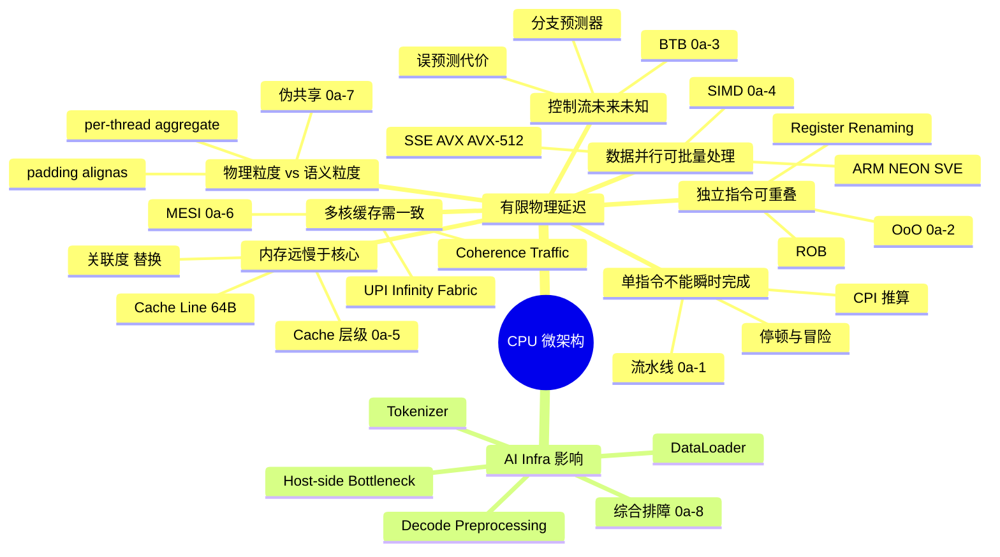
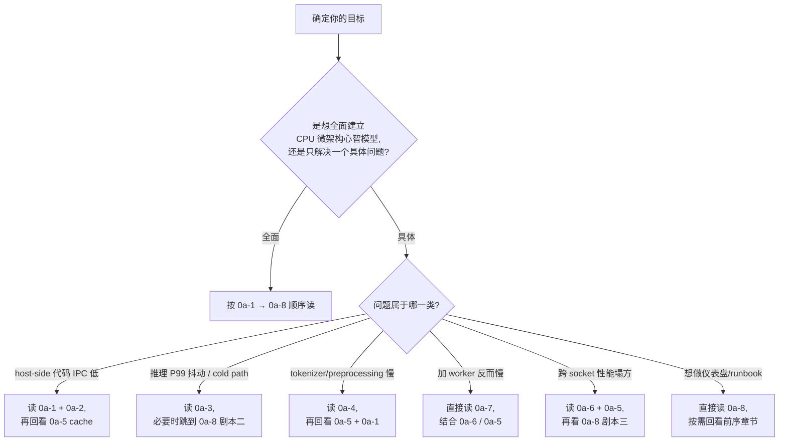

# 第 0a 章 · CPU 微架构总览

CPU 微架构不是"背 Intel/AMD 名词"。对 AI Infra 工程师来说，它回答的是：为什么 GPU 很忙时，训练仍会被 DataLoader、tokenizer、日志聚合、RPC 调度、采样器、压缩和解码前处理这些 host-side 代码拖住。

本章是 **Part 0a 系列的总览章**。它用第一性原理把 CPU 微架构的全部机制串成一张推导图，并指引你按需进入 0a-1 至 0a-8 八个独立深挖章。如果你只关心一个具体话题（比如"为什么 worker 加倍反而慢"），可以直接跳到对应深挖章；如果你要建立完整心智模型，按 0a-1 → 0a-8 顺序阅读即可。

## 0a.1 第一性原理拆解 + 学习大纲

### 拆 — 不可化简的问题

CPU 是有限的物理器件。它不能让一条指令在零时间内完成，也不能让一次内存访问在零时间内返回，更不能在程序还没执行到 `if` 时就确定未来一定走哪条路径。所有微架构机制，本质上都在回答同一个不可化简的问题：当计算、访存、控制流都存在物理延迟时，怎样让有限晶体管在多数时间里保持有用工作，而不是等待？

如果程序只有一条依赖链，例如 `x = (((a+b)*c)-d)`，CPU 很难并行；如果程序有很多互不依赖的操作，CPU 可以把它们重叠执行。于是第一个问题是"如何发现并利用指令级并行（Instruction Level Parallelism, ILP）"。流水线把取指、译码、执行、访存、写回切成不同工位，让多条指令像工厂流水一样重叠；但数据依赖、控制依赖、结构资源冲突会制造停顿。乱序执行（Out-of-Order, OoO）继续推进：只要语义上不破坏依赖，后面的指令可以先执行。寄存器重命名（register renaming）消除名字造成的假依赖，ROB（Reorder Buffer）保证最终仍按程序顺序提交，让异常和精确状态可恢复。

第二个问题是"如何减少等待内存"。CPU 核心每周期能发射多条 micro-op，但 DRAM 延迟常以数十到上百纳秒计，折算成几百个 cycle。Cache 利用局部性，把最近和相邻的数据放在离核心更近的位置；Cache line 通常是 64B，因为硬件认为你访问一个地址后很可能访问附近地址。多核以后，缓存不再只是"快不快"的问题，还变成"谁拥有最新值"的问题。MESI 协议用 Modified、Exclusive、Shared、Invalid 四种状态维护一致性，但一致性流量会消耗互连带宽。伪共享（false sharing）更隐蔽：两个线程改不同变量，但变量落在同一条 cache line 上，硬件只能按 line 维护一致性，于是互相把对方的缓存行打失效。

第三个问题是"如何提前做事而不做错太多"。分支预测假设控制流的未来可由历史模式估计；BTB（Branch Target Buffer）预测跳转目标，各类方向预测器预测 taken/not-taken。预测成功时流水线不断流，预测失败时要冲刷流水线、回滚 speculative work。AI 系统里很多热点不是矩阵乘，而是 tokenizer、JSON/protobuf 解析、batch 拼装、采样后处理、DataLoader 索引，这些代码常有大量分支、短循环和不规则内存访问。理解微架构，才能把"CPU 利用率 800%"翻译成可行动的问题：是分支错了、cache miss 多了、SIMD 没吃满，还是 coherence traffic 把多 worker 拖死了。

### 推 — 从这个问题如何推导出每个机制

从"单条指令存在延迟"推出流水线（详见 [0a-1](0a1-pipeline.md)）；从"流水线会遇到依赖"推出冒险检测、forwarding 和 stall；从"程序中存在可重排的独立指令"推出乱序执行（详见 [0a-2](0a2-out-of-order-execution.md)）；从"寄存器名字会制造不必要的读写冲突"推出 register renaming；从"乱序执行必须看起来像顺序执行"推出 ROB。接着，从"下一条指令地址不总是顺序地址"推出分支预测和 BTB（详见 [0a-3](0a3-branch-prediction.md)）；从"标量执行浪费数据并行机会"推出 SIMD（详见 [0a-4](0a4-simd.md)）；从"内存比执行单元慢很多"推出 L1/L2/L3 Cache（详见 [0a-5](0a5-cache-hierarchy.md)）；从"多核各有私有缓存"推出 MESI（详见 [0a-6](0a6-mesi-coherence.md)）；从"一致性以 cache line 为粒度"推出伪共享（详见 [0a-7](0a7-false-sharing.md)）。

AI Infra 的推导链还要多一层：GPU kernel 性能再好，也需要 CPU 准备数据、调度请求、执行控制面逻辑。DataLoader worker 解码图片、tokenizer 把字符串转 token、推理服务把请求拼 batch、训练框架做 rendezvous 和 checkpoint 元数据，这些都吃 CPU 微架构。如果 CPU 端的 cold path 被误预测拖慢，或者 16 个 worker 抢同一 cache line，GPU 会表现为 intermittently idle。此时增加 worker、增加线程池、把 pod CPU request 调高，不一定解决问题，甚至会让 L3 和 coherence 竞争更严重。正确的工程动作来自机制推导：先问热点在哪，再问瓶颈属于 pipeline、branch、SIMD、cache、coherence 中哪一类（详见综合 worked example [0a-8](0a8-cpu-worked-example.md)）。

### 绘 — 因果链路



### 导 — 读完本章你应该能回答

1. 为什么 5 段流水线的理想 CPI 接近 1，但真实程序经常高于 1？
2. OoO、register renaming、ROB 分别解决什么问题，为什么三者经常一起出现？
3. 一个分支误预测为什么会浪费十几个到几十个 cycle，AI 服务的 cold path 为什么容易受影响？
4. 判断一段 tokenizer 或 preprocessing 代码是否值得 SIMD 化，要看哪些数据形态和边界条件？
5. L1/L2/L3 的容量、延迟、共享范围如何影响 DataLoader worker 数量？
6. MESI 如何保证多核缓存一致，为什么一致性流量会在多 socket 机器上放大？
7. 如何从 `perf stat` 和 `perf c2c` 的现象推断 false sharing，而不是盲目加 worker？

### 边界、EvidenceBundle、CapacityLedger 与故障排除

**本章拥有的边界**：建立 CPU 微架构的机制地图、证据路径和容量决策入口；把流水线、OoO、分支、SIMD、Cache、MESI、false sharing 串成一个可排障的系统模型。**本章不负责**展开虚拟内存、page cache、PCIe DMA、GPU kernel、NCCL 或调度器业务语义；这些分别在 0b、Part 2 和后续训练/推理章节处理。控制路径从 PC/BTB/预测器到 decode/rename/retire；数据路径从 register/LSQ 到 L1/L2/LLC/DRAM/NUMA；失败路径分成四类：front-end 供不上、backend 等内存或端口、bad speculation 冲刷流水线、coherence/false sharing 让 cache line 在核心间迁移。

**CPU EvidenceBundle** 是所有 0a 章节共用的最小证据包：

```bash
perf stat -a -e cycles,instructions,branches,branch-misses,cache-references,cache-misses,LLC-loads,LLC-load-misses -- sleep 30
perf stat -a -e topdown-fe-bound,topdown-be-bound,topdown-bad-spec,topdown-retiring -- sleep 30
perf c2c record -ag -- sleep 30 && perf c2c report --stdio | head -80
```

如果运行环境不支持 Top-Down 事件，改用 `perf stat --topdown`、`toplev --level 2` 或厂商工具（VTune / AMD uProf）补齐同类证据。证据包必须和业务指标同窗采集：GPU SM util、MFU、HFU（Host Feeding Utilization，CPU 能否持续把 batch 喂给 GPU）、QPS、p50/p99、DataLoader queue depth。只看 CPU% 不足以做结论。

**CapacityLedger 决策规则**：先写出每个 socket 的预算，再决定 worker/thread 数量。

```text
CPU_headroom = physical_cores * target_IPC * freq
LLC_budget_per_worker = LLC_effective_capacity / active_workers_per_socket
coherence_budget = HITM_per_sec * avg_line_transfer_ns
host_feed_budget = batch_ready_deadline_ms - tokenizer_ms - decode_ms - scheduler_ms
```

经验阈值：`IPC < 1.0` 且 `topdown-be-bound > 50%` 先查 LLC/DRAM/NUMA；`branch-misses / branches > 5%` 或 `topdown-bad-spec > 10%` 先查 cold path；`perf c2c` 单条 line HITM 占比 > 5% 先查 false sharing；LLC miss rate > 30% 时不要继续加 worker，先缩 working set、分 NUMA 或改布局。

| 症状 | 证据 | 可能根因 | 动作 | Retest / 复测 |
|---|---|---|---|---|
| GPU util 掉、CPU% 高 | `perf stat` IPC < 1，`topdown-be-bound` 高，LLC miss 高 | DataLoader/tokenizer working set 溢出 LLC 或 NUMA 远端访问 | 降 worker/socket、绑 NUMA、改数据布局、分块 | 同样压测下 IPC > 1.2，LLC miss rate 下降 30%+，HFU/MFU 回升 |
| p99 抖动但 p50 正常 | `branch-misses` 与 `topdown-bad-spec` 在长尾请求升高 | cold path、schema fallback、短循环未收敛 | hot/cold path 分离，减少数据驱动分支，必要时 SIMD fast path | branch-miss rate 回到 < 3%，p99 回落且 p50 不退化 |
| 加线程吞吐下降 | `perf c2c` HITM 集中在少数 line，Remote HITM 高 | false sharing 或真共享 atomic | `alignas(64/128)`、thread-local reduce、分片计数、socket 亲和 | HITM 降到原值 < 10%，吞吐随线程数至少单调到容量拐点 |
| Retiring 高但吞吐不达标 | IPC 高、cache/branch 健康，SIMD counter 低 | 标量路径占主导，未向量化 | 开启编译器向量化报告，runtime dispatch AVX2/AVX-512/NEON/SVE | SIMD retired counter 上升，单位 CPU cycle 的处理元素数提升 |

## 0a.2 八个深挖章节导览

| 章节 | 标题 | 核心主题 | 何时优先读 |
|---|---|---|---|
| [0a-1](0a1-pipeline.md) | 流水线（Pipeline） | 5 段经典流水、深流水、冒险与 forwarding、CPI/IPC 推算、host-side 代码的真实 IPC | DataLoader / tokenizer / 控制面代码 IPC 偏低，想理解为什么 |
| [0a-2](0a2-out-of-order-execution.md) | 乱序执行、Register Renaming 与 ROB | OoO 引擎结构、ROB 容量、LSQ、退役吞吐、为什么指针追逐让 OoO 失效 | 想从 perf 里 ROB stall / backend bound 信号反推根因 |
| [0a-3](0a3-branch-prediction.md) | 分支预测 | BTB / RAS、2-bit 饱和计数器、GShare、TAGE、误预测代价、cold path 治理 | 推理服务 P99 抖动、长尾输入触发慢路径 |
| [0a-4](0a4-simd.md) | SIMD：SSE / AVX / AVX-512 | ISA 演进、AVX-512 频率降级、自动向量化、intrinsics、对齐惩罚、host-side preprocessing 收益表 | 决定是否手写 SIMD、tokenizer 加速可行性评估 |
| [0a-5](0a5-cache-hierarchy.md) | Cache 层级 | L1/L2/L3 延迟带宽、cache line 64B、关联度、替换策略、LLC slice、prefetcher | 数组 stride / NHWC 选型、worker 数量与 LLC 容量关系 |
| [0a-6](0a6-mesi-coherence.md) | MESI 一致性协议 | 四状态机、snoop vs directory、MOESI/MESIF、跨 socket UPI 流量 | 多线程 atomic 计数器吞吐崩盘、跨 socket 性能异常 |
| [0a-7](0a7-false-sharing.md) | 伪共享（False Sharing） | 物理粒度 vs 语义粒度、检测与修复、padding/alignas、per-thread + reduce | 加 worker 反而变慢、metric counter 写争用 |
| [0a-8](0a8-cpu-worked-example.md) | 综合 Worked Example：端到端排障 | Top-Down 方法论、三个完整剧本、工具栈对照、SOP、反模式速查 | 想要把 0a-1 ~ 0a-7 知识落到一份 on-call runbook |

## 0a.3 阅读路径建议



| 角色 | 推荐路径 | 估算时间 |
|---|---|---|
| 训练平台工程师 | 全顺序阅读 0a-1 → 0a-8 | 8-10 小时（含练习） |
| 推理 / serving 工程师 | 0a-3 → 0a-5 → 0a-7 → 0a-8 | 4-5 小时 |
| 算法工程师（关心 host 性能） | 0a-1 → 0a-4 → 0a-5 → 0a-8（剧本部分） | 4 小时 |
| SRE / on-call | 直接 0a-8，按报警类型回看对应章 | 2 小时打底，按需 |
| 编译器 / 框架开发 | 0a-1 → 0a-2 → 0a-4 → 0a-5 → 0a-6 | 7 小时 |

> [!NOTE]
> **本总览章不重复深挖内容**：流水线公式、MESI 状态机、perf 命令完整序列等都在对应深挖章里。这里只保留第一性原理推导链 + 章节导航。

> [!TIP]
> **读完所有 8 章后应能独立完成的事**：拿到一份 `perf stat` 输出，能在 5 分钟内判断瓶颈属于 Front-End Bound、Back-End Bound、Bad Speculation 还是 Retiring；并对照 0a-8 §0a-8.5 的 Top-Down 决策树给出下一步排查动作。

## 0a.4 与 Part 0 其他章的关系

CPU 微架构是 Part 0 的第一根基。它向后串联：

- [0b 内存、虚拟内存与 IO](0b-memory-virtual-memory-and-io.md)：从 cache miss 自然过渡到 TLB miss、page cache、NUMA、PCIe DMA。0a-5 + 0b 联读最直接。
- [0c 文件系统与存储内核](0c-filesystems-and-storage-internals.md)：checkpoint 写入、dataset 读取的 page cache 路径。
- [0d 网络协议栈基础](0d-network-stack-fundamentals.md)：网络收发涉及内核态切换、softirq、CPU 亲和，与 0a-6/0a-7 一致性主题相关。

CPU 微架构同时是 Part 1-8 全部章节的隐式底座。例如：

- Ch 7 单机训练的 MFU 计算依赖你能在 host 端把 CPU 不变成瓶颈
- Ch 8 数据并行的 NCCL 集合通信，host 端调度同样吃 CPU 微架构
- Ch 15 推理 batching 调度循环和 KV Cache 管理常见的 false sharing 在 0a-7 / 0a-8 详细讨论
- Ch 21 可观测性章节使用的 `perf` / DCGM 等工具，许多指标的物理含义在 0a 系列里建立

## 深度参考阅读（总览级）

- John L. Hennessy & David A. Patterson, *Computer Architecture: A Quantitative Approach*, 6th edition. 体系结构权威教科书，涵盖 ILP / Memory hierarchy / 多核一致性的完整量化分析。
- Randal E. Bryant & David R. O'Hallaron, *Computer Systems: A Programmer's Perspective (CSAPP)*, 3rd edition. 程序员视角的 CPU 微架构、Cache、并发与一致性，与本系列读法最契合。
- Agner Fog, *The Microarchitecture of Intel, AMD and VIA CPUs*. 逐代微架构细节，是优化指令选择和理解 perf 计数器最实用的参考。
- Intel® 64 and IA-32 Architectures Optimization Reference Manual. 官方优化手册，与 perf 指标对应最准。
- Brendan Gregg, *Systems Performance: Enterprise and the Cloud*, 2nd edition. 把 CPU 微架构知识嵌入到生产系统排障方法论的标杆。

> 各深挖章节末尾还有面向具体主题的进一步深读列表。本总览只列共用的 5 本基础参考。
