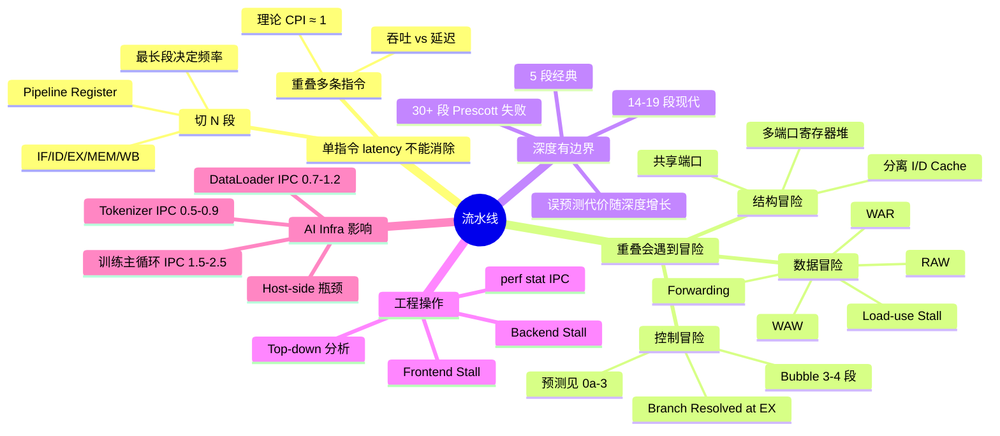
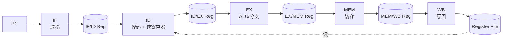
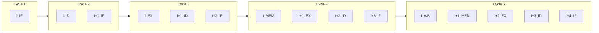
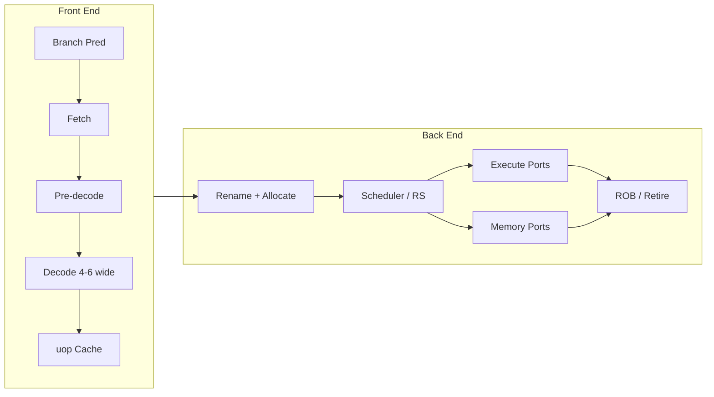
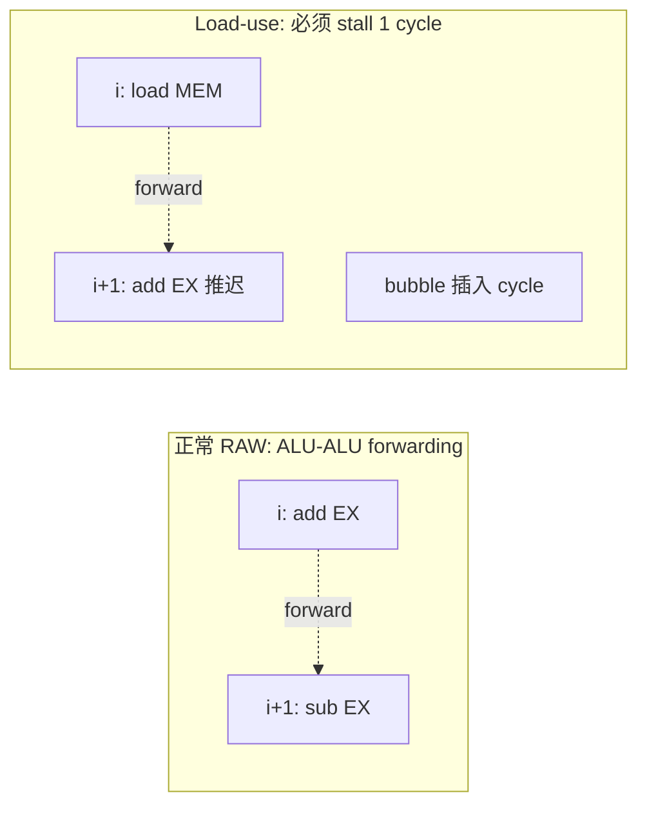
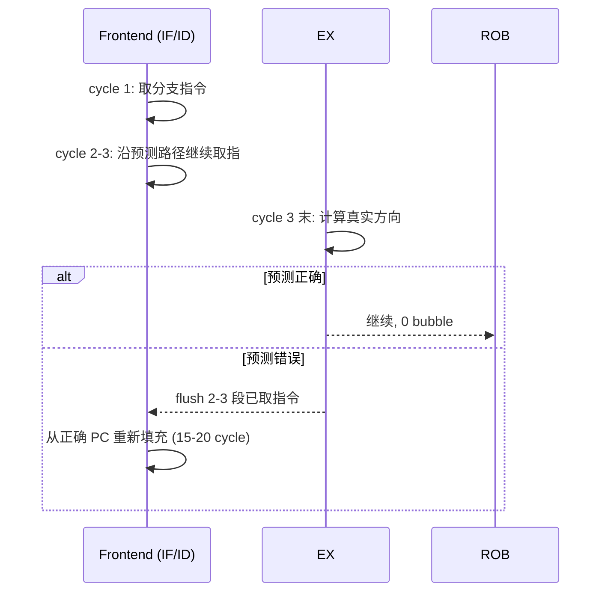
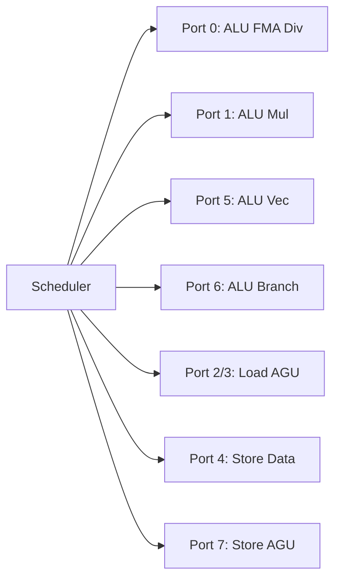
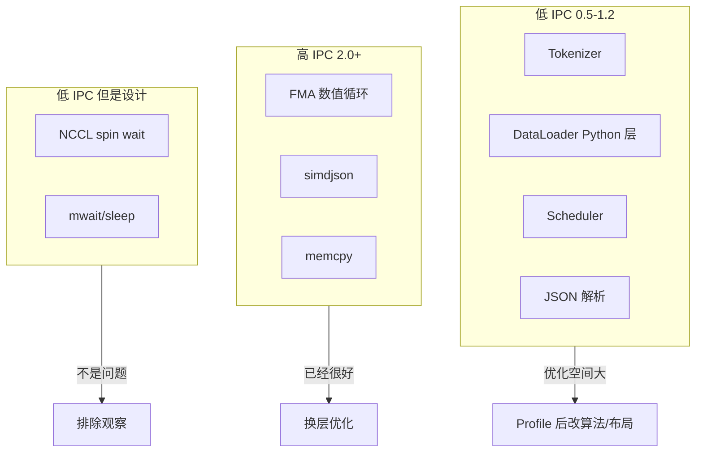
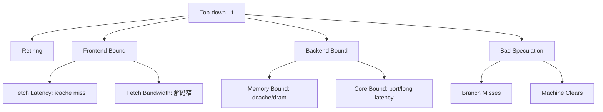

# 第 0a-1 章 · 流水线（Pipeline）

本章是 [§0a CPU 微架构](0a-cpu-microarchitecture.md) 总览的第一个深挖章。0a 总览章列出了 CPU 微架构所有机制如何串成一条排障链；本章把镜头拉近到第一个不可化简事实——**单条指令的 latency 不能被消除**——并回答一个具体问题：当 IF/ID/EX/MEM/WB 每一段都需要时间时，怎样让多条指令的"吞吐"接近每周期 1 条（CPI ≈ 1），并理解为什么真实程序——尤其是 AI Infra 的 host-side 代码——常常做不到？

本章不讨论分支预测的方向预测器细节（见 0a-3）、不深入乱序与寄存器重命名（见 0a-2），只把流水线本身的机制、冒险、forwarding、停顿、CPI/IPC 推算和 perf 工程操作讲透；并把它和 DataLoader、tokenizer、采样器这些现实 host-side 热点的 IPC 数据对照。

## 0a-1.1 第一性原理拆解 + 学习大纲

### 拆 — 不可化简的问题

CPU 是物理器件。一条指令从"从内存把字节取出来"到"把结果写回寄存器堆"，必须穿过取指、译码、读寄存器、ALU 计算（或访存）、写回这一连串组合逻辑和寄存器文件读写。在任何工艺下，这条路径都有最小可缩减的传播时延。如果硬件设计成"取一条、做一条、再取下一条"，那么时钟周期必须长得足够覆盖整条路径，IPC（instructions per cycle）最多 1，但频率被这条最长路径死死压住——这是单周期实现。

把同一条物理路径切成 N 段，每段加一个 pipeline register，让时钟周期只需覆盖最长那段，频率就能升 N 倍；同时让"取指"和"执行"在同一时间发生在不同指令上，吞吐量从"1 条/N 个周期"变成理论上的"1 条/周期"。这就是流水线（pipelining）唯一要回答的问题：**单条指令的 latency 既然不能消除，能不能让多条指令的不同阶段重叠，从而把吞吐提高 N 倍？**

但这个问题本身又派生出新问题。第一，指令之间常常**不独立**：第 i+1 条要用第 i 条刚算出来的结果；第二，**控制流不总是顺序**：分支结果要到 EX 段才知道，但 IF 段每个周期都得给出"下一条 PC"；第三，硬件资源**有限**：只有一个写端口、一个 ALU、一个内存端口时，多条指令同时进入会撞资源。这三类问题分别是数据冒险、控制冒险、结构冒险。流水线机制的所有"加料"——forwarding、stall、bubble、双端口寄存器堆、分离的 I-cache/D-cache——本质上都是为了在保留"重叠"收益的同时，把这三类冒险造成的损失尽量压低。

第四件不可化简的事是：**深度有边界**。把流水线切到 5 段就停下吗？现代 Skylake、Zen 主流水线深度 14-19 段，频率因此能拉到 4-5GHz；但每加深一段，分支误预测代价就多一个 cycle，前端 fetch 和译码消耗的能耗也增加。深流水的代价不是没有，只是被分支预测器、超标量发射、乱序窗口和大 cache 摊薄——而摊薄能力对"控制流可预测、数据局部性好"的代码有效，对 host-side AI 代码的"不规则字符流、长依赖链、跨线程同步"则失效。这就是 AI Infra 工程师必须懂流水线的原因：你的 tokenizer 看起来 CPU 利用率 100%，但 IPC 可能只有 0.6，绝大多数 cycle 在 stall 上。

### 推 — 从这个问题如何推导出每个机制

从"单指令延迟不能消除，但可以分段"推出**5 段经典流水线**：IF（取指）/ID（译码与读寄存器）/EX（执行或地址计算）/MEM（访存）/WB（写回）。从"每段 pipeline register 切割组合逻辑"推出**时钟周期由最长段决定，频率随段数变化**。

从"多条指令并行在不同段"会产生"i+1 用 i 的结果，但 i 还没 WB"的现象，推出**数据冒险**；从"等到 i 写回再让 i+1 读"会浪费 cycle，推出 **forwarding/bypass**——在 EX 输出端到 EX 输入端拉一条旁路线，让结果不必先经过寄存器堆；从"forwarding 也救不了 load-use（load 要到 MEM 末才出结果）"推出**至少 1 cycle bubble** 的 load-use stall。

从"分支结果在 EX 段才知道，但 IF 在更早就要选 PC"推出**控制冒险**；从"等待会让流水线空 3-4 段"推出**预测**与 **flush**（详见 0a-3）。从"两条指令同时要 MEM 端口"推出**结构冒险**，从而推出**分离 I-cache/D-cache、多端口寄存器堆、多个 ALU**。

从"段数越多频率越高，但单条延迟、误预测代价、能耗都增加"推出**最佳流水线深度**问题：5 段是教学经典，14-19 段是现代主流，30+ 段（Pentium 4 Prescott）已被证明得不偿失。从"理论 CPI ≈ 1，真实 CPI 受 stall 影响"推出 **CPI/IPC 推算公式**和**自顶向下分析（Top-down analysis）**：retiring / front-end bound / back-end bound / bad speculation 四象限。

最后从"AI Infra host-side 代码的 IPC 通常 0.5-1.2"推出本章的工程价值：tokenizer、DataLoader、Python loop 的低 IPC 不是因为"CPU 慢"，而是因为它们的指令依赖结构、内存访问模式、控制流复杂度，让流水线大量 stall。理解流水线，才能知道 perf 报告里 "frontend stall 35%, backend stall 50%" 是什么意思，才能选对优化策略。

### 绘 — 因果链路



### 导 — 读完本章你应该能回答

1. 把一条指令从单周期实现切成 5 段流水线，时钟频率和 CPI 各发生什么变化？为什么"理论 CPI = 1"对所有流水线深度都成立？
2. RAW、WAR、WAW 三种数据依赖中，哪些是真依赖、哪些是假依赖？流水线本身能解决哪些？乱序执行和寄存器重命名又解决哪些（见 0a-2）？
3. Forwarding/bypass 在 5 段流水线里画出来是什么样？为什么 load-use 即便有 forwarding 仍至少要插 1 cycle bubble？
4. 现代 14-19 段流水线为什么不直接做到 30 段？深度的边际收益和边际代价分别是什么？
5. 给定一段 perf stat 输出（cycles、instructions、frontend stall、backend stall、branch-misses），如何快速判断这段代码的瓶颈在 frontend、backend 还是 bad speculation？
6. 为什么 AI Infra 的 tokenizer 和 DataLoader 代码 IPC 经常只有 0.5-1.2，而训练主循环的 numerical kernel 反而能到 2.0+？这两类代码触发的流水线 stall 类型有何不同？
7. 给一个 worked example：tokenizer 热点 IPC = 0.7，frontend stall = 25%，backend stall = 55%。你的下一步排查动作是什么？

## 0a-1.2 5 段经典流水线：IF/ID/EX/MEM/WB

5 段流水线源自 MIPS R2000，今天仍是教学和嵌入式核心的标准模型，也是理解所有现代深流水的基线。每段做的事情如下：

| 段 | 名称 | 做什么 | 主要硬件 |
|---|---|---|---|
| IF | Instruction Fetch | 用 PC 从 I-cache 取一条指令，PC ← PC+4（或预测目标） | I-cache、PC、BTB |
| ID | Instruction Decode | 译码、读两个寄存器、立即数符号扩展、控制信号生成 | Decoder、Register File 读端口 |
| EX | Execute | ALU 计算、地址生成、分支条件判断 | ALU、移位器、分支比较器 |
| MEM | Memory Access | load 读 D-cache、store 写 D-cache，非访存指令空过 | D-cache、写缓冲 |
| WB | Write Back | 把结果写回寄存器堆 | Register File 写端口 |

每两段之间有一组 pipeline register（IF/ID、ID/EX、EX/MEM、MEM/WB），它们在每个时钟上升沿采样上一段的输出。这意味着：

- 单条指令的 latency 仍然是 5 个周期（从 IF 进入到 WB 完成）。
- 多条指令的 throughput 在理想情况下是 1 条/周期（CPI = 1）。
- 时钟周期由"最长一段"决定，通常是 EX 或 MEM。



把 5 条相邻指令排开，看每个 cycle 都在做什么：



填满流水线后（cycle 5 之后），每个 cycle 都有一条指令完成 WB——这就是 CPI = 1 的物理来源。

下表是经典的"5 段填充与 forwarding"周期表，假设没有冒险：

| Cycle | i | i+1 | i+2 | i+3 | i+4 |
|---:|---|---|---|---|---|
| 1 | IF | | | | |
| 2 | ID | IF | | | |
| 3 | EX | ID | IF | | |
| 4 | MEM | EX | ID | IF | |
| 5 | WB | MEM | EX | ID | IF |
| 6 | | WB | MEM | EX | ID |
| 7 | | | WB | MEM | EX |

> [!note]
> **理论 CPI = 1 的隐含假设**：每条指令在每段都恰好用 1 个周期，且不发生任何冒险。一旦某段需要 2 cycle（如 cache miss 让 MEM 段拉长 100 cycle），或者后续指令必须等待前序指令的结果，CPI 立刻 > 1。

## 0a-1.3 现代深流水：Skylake/Zen 14-19 段

教学讲完 5 段，工业界用 14-19 段。Intel Skylake 的主流水线大约 14-19 段（取决于路径分支），AMD Zen3/Zen4 在同量级，Apple M1 P-core 也在 14-16 段附近。Pentium 4 Prescott 一度做到 31 段，被证明是失败方向。

为什么深？两个直接收益：

1. **频率提升**：每段更短 → 时钟周期更短 → 频率更高。从 5 段到 14 段大致让频率从 1GHz 量级升到 4-5GHz。
2. **更细粒度的资源调度**：fetch、decode、rename、dispatch、execute、retire 各阶段可以独立优化（更宽的解码、更深的 ROB、更复杂的 scheduler），整体 IPC 同步提升。

为什么不更深？三个边际代价：

1. **分支误预测代价随深度线性增长**：5 段流水线误预测代价 ~3 cycle；14-19 段是 ~15-20 cycle；Prescott 31 段是 ~30+ cycle。AI 服务的 cold path、tokenizer 不规则分支会被放大。
2. **每段的 pipeline register、时钟分发、能耗增加**：晶体管利用率下降。
3. **填充和清空时间增加**：函数调用、上下文切换、中断等都要重新填满流水线。



Skylake 主要"段"概念上包括（顺序近似，实际有重叠和拆分）：

| 段大类 | 段数 | 关键作用 |
|---|---:|---|
| Fetch + 预解码 | 4-5 | 从 L1I 取 16-32B/cycle，识别指令边界 |
| Decode | 2-3 | x86 → uop，4-6 条/cycle |
| Rename + Allocate | 2 | 架构寄存器 → 物理寄存器，分配 ROB 项 |
| Scheduler + Dispatch | 1-2 | 操作数就绪后发往 8 个执行端口 |
| Execute | 1-多 | 大部分 ALU 1 cycle，乘法 3-5，除法 10-25，FMA 4-5 |
| Writeback + Retire | 2 | 结果写回，按程序顺序 commit |

> [!warn]
> **深流水的边际效用反转**：从 5 段 → 14 段，频率 + IPC 双升，能耗回报正；从 14 → 31 段，频率回报小、误预测放大、能耗暴涨。Prescott 是反面教材；现代设计稳定在 14-19 段，并把投资转向"更宽的乱序窗口"和"更聪明的预测器"。

> [!note]
> **AI Infra 含义**：你不能选择 CPU 的流水线深度，但可以选择"代码的流水线友好程度"。把不规则分支堆在热循环里，等于每次都让深流水帮你"误预测一次清空 18 cycle"。这就是为什么 0a-3 分支预测会特别强调 cold path。

## 0a-1.4 数据冒险：RAW/WAR/WAW + Forwarding/Bypass + 插泡

数据冒险（data hazard）有三类，按"读/写"组合分：

| 类型 | 全称 | 例子 | 是真依赖吗？ | 5 段流水线如何处理 |
|---|---|---|---|---|
| RAW | Read After Write | `add r1,r2,r3; sub r4,r1,r5` | 是（真依赖） | Forwarding，必要时 stall |
| WAR | Write After Read | `add r4,r1,r5; add r1,r2,r3` | 否（假依赖，名字冲突） | 顺序流水线天然无问题；OoO 需重命名 |
| WAW | Write After Write | `add r1,r2,r3; ...; add r1,r4,r5` | 否（假依赖） | 顺序流水线天然无问题；OoO 需重命名 |

顺序 5 段流水线只会遇到 RAW。WAR 和 WAW 是乱序执行才会暴露的"假依赖"，通过寄存器重命名消除（详见 0a-2）。

**Forwarding/Bypass** 的核心思想：i 的 EX 段产生结果后（cycle 3 末），不必等到 cycle 5 末 WB 写完寄存器堆，直接把结果通过一条旁路线送到 i+1 的 EX 段输入（cycle 4 初）。这样：

```text
i:   IF ID EX MEM WB
i+1:    IF ID EX  MEM WB
                ^
                EX 输入直接拿 i 的 EX 输出（forward）
```

ALU-to-ALU forwarding 完全消灭了"add 后立刻 add"这种 RAW 的 stall。但有一种 RAW 即使 forwarding 也救不了：

```text
i:   load r1, [p]    IF ID EX MEM WB
                                 ^结果 cycle 4 末才出
i+1: add r2, r1, 1   IF ID -- EX MEM WB
                              ^EX 输入 cycle 4 初要 r1
```

i 是 load，结果到 MEM 段末（cycle 4 末）才出来；i+1 在 cycle 4 初就要进 EX 段，时间上对不上。即便从 MEM 输出到下一条 EX 输入拉 forwarding 线，也得让 i+1 的 EX 推迟 1 cycle，于是必须**插一个 bubble**。



5 段流水线 forwarding 与 stall 表（典型场景）：

| 场景 | 距离 | 是否需要 stall | bubble 数 | 备注 |
|---|---|---|---:|---|
| ALU → ALU（i+1） | 1 | 否 | 0 | EX-to-EX forwarding |
| ALU → ALU（i+2） | 2 | 否 | 0 | 已经过了 WB，正常读寄存器 |
| Load → Use（i+1） | 1 | 是 | 1 | MEM-to-EX 只能下个 cycle |
| Load → Use（i+2） | 2 | 否 | 0 | MEM-to-EX forwarding 来得及 |
| Branch 比较 → IF（i+1） | 1 | 是 | 1-3 | 控制冒险，见 0a-1.5 |

> [!success]
> **编译器的 schedule 优化**：知道 load-use 会插 1 bubble，编译器会把 load 提前一两条指令，让中间塞一些独立工作。这就是 `gcc -O2` 和手写汇编经常出现的"load 后跟一个无关的 ALU"的原因。

> [!warn]
> **AI 代码的真实情况**：tokenizer 状态机 `state = table[state][input]` 是典型 load-use 链——下一次访存的地址依赖上一次 load 的结果，forwarding 帮不上忙，stall 累积。这种依赖链结构是 host-side IPC 低的核心原因之一。

## 0a-1.5 控制冒险：分支带来的流水线气泡

控制冒险来自分支。5 段流水线里，分支条件在 EX 段（cycle 3）才计算完毕；但 IF 段每个 cycle 都得给出"下一条 PC"。如果不预测，从分支进入 IF（cycle 1）到知道真实方向（cycle 3 末），中间 cycle 2、3 的 IF 已经取了"假定顺序执行"的两条指令——如果分支 taken，这两条要被冲掉，相当于 **2 cycle bubble**。

现代 14-19 段流水线分支决议在更深的 EX 段，误预测代价是 ~15-20 cycle。**这部分内容（BTB、方向预测器、误预测恢复）的深入展开见 0a-3 分支预测**，本章只点出问题与流水线视角的代价：

| 流水线深度 | 典型误预测 bubble | 估算 |
|---|---:|---|
| 5 段经典 | 2-3 | (depth - 2) ~ 3 cycle |
| 14-19 段 Skylake | 15-20 | depth - decode_steps |
| 31 段 Prescott | 30+ | 灾难级 |



> [!note]
> **为什么本章只点不深入**：流水线视角下，分支带来的冒险表现就是 bubble 数 = 流水线深度。详细的 BTB、TAGE、PRH 等预测器机制和工程指标 `branch-misses` 排查请见 0a-3。

## 0a-1.6 结构冒险：资源冲突

结构冒险（structural hazard）发生在两条指令同时需要同一个硬件资源。5 段流水线里典型例子：

1. **取指 + 访存撞内存端口**：MEM 段的 load/store 和 IF 段同时访问统一的 memory，单端口设计会冲突。
2. **写回 + 读寄存器撞寄存器堆端口**：WB 段写一个寄存器，同时 ID 段要读两个寄存器；单端口设计会撞。
3. **多个长延迟指令排队 ALU**：除法 25 cycle，正在做时另一条除法只能等。

经典解决方案：

| 冲突 | 解决 | 代价 |
|---|---|---|
| 取指/访存撞内存 | 哈佛架构：分离 I-cache 和 D-cache | 多一份 cache 控制器 |
| 写回/读取撞寄存器堆 | 多端口寄存器堆（2 读 1 写或更多） | 面积、功耗 |
| 长延迟独占 ALU | 独立的整数/浮点/乘除/向量执行单元 | 面积 |
| 多条 store 排队 | Store buffer | 内存模型复杂化 |

现代超标量 CPU 把"端口"概念抽象出来。Skylake 有 8 个 execution port，每个端口可执行某些 uop 类型；scheduler 的工作就是把就绪 uop 送到合适且空闲的端口，避免结构冒险。



> [!note]
> **AI Infra 视角的结构冒险**：少见但存在。例子是大量 store 把 store buffer 填满（典型场景：一段连续写大数组，超过 store buffer 容量），后续指令要等 store 退休，看起来像 "backend bound, store unit"。`perf stat -e cycle_activity.stalls_mem_any` 能看到。

## 0a-1.7 CPI 与 IPC 推算：理论值 vs 真实值

CPI（Cycles Per Instruction）和 IPC（Instructions Per Cycle）互为倒数：CPI = 1/IPC。理论 5 段流水线 CPI = 1.0；现代超标量 CPU 理论 CPI 可低至 0.2（4-6 wide 发射），但真实程序很难达到。

一阶估算公式：

```text
CPI = base_CPI 
    + load_use_rate    * load_use_penalty
    + branch_miss_rate * branch_miss_penalty
    + cache_miss_rate  * cache_miss_penalty
    + lock_contention_rate * lock_penalty
```

举几个真实数据（基于 Skylake/Zen3 在生产 LLM 训练/推理节点上的观测）：

| 工作负载 | 典型 IPC | CPI | 主要 stall 类型 |
|---|---:|---:|---|
| HPL（Linpack 浮点） | 2.5-3.5 | 0.3-0.4 | 几乎无 stall，FMA 流水线饱和 |
| ResNet 训练 GPU side（CUDA kernel） | N/A | N/A | GPU 不用 CPI 度量 |
| ResNet 训练 CPU side（PyTorch DataLoader） | 0.8-1.2 | 0.83-1.25 | backend bound, cache miss |
| LLM tokenizer（HuggingFace tokenizers） | 0.5-0.9 | 1.1-2.0 | load-use 链、frontend bound |
| LLM 推理服务（vLLM scheduler） | 0.7-1.3 | 0.77-1.43 | branch miss、lock contention |
| JSON parsing（simdjson） | 2.0-3.0 | 0.33-0.5 | SIMD 友好 |
| JSON parsing（标准库） | 0.5-1.0 | 1.0-2.0 | 长 load-use 链 |
| 训练主循环（NCCL allreduce 等待中 CPU 空转） | 0.2-0.4 | 2.5-5.0 | 大量 spin / mwait |

> [!success]
> **诊断节奏**：拿到 CPU 热点先看 IPC。IPC > 2.0：CPU 用得不错，优化空间在算法或更高层；IPC 1.0-2.0：常见区间，看具体 stall 类别再决定；IPC < 1.0：大概率有 backend stall（cache miss 或长依赖链），值得花时间排查。

举一个推算例子：某 tokenizer 热点统计如下：

- 总指令数 1×10^9
- 总周期数 1.6×10^9（IPC = 0.625, CPI = 1.6）
- branch-misses: 5×10^6
- cache-misses (L2): 2×10^6
- 假设：误预测代价 18 cycle，L2 miss 代价 14 cycle，base CPI 1.0

stall 贡献：

- branch: 5×10^6 × 18 / 1×10^9 = 0.09 cycle/instr
- cache: 2×10^6 × 14 / 1×10^9 = 0.028 cycle/instr
- 已知 stall: ~0.12 cycle/instr，但实测 CPI - base = 0.6 cycle/instr
- 结论：还有 ~0.48 cycle/instr 来自其他 stall（多半是 load-use 链或更深 cache miss）

工程含义：先优化分支只能省 0.09，先优化 L2 miss 只能省 0.028，**真正的金矿是那 0.48**。下一步应当用 Top-down 分析或 `perf record` 找具体热点指令。

> [!warn]
> **CPI 推算的边界**：现代 OoO CPU 会把 stall 和有用 work 重叠，公式只能给一阶量级；不要据此宣称"优化分支能省 X 秒"，应以 Top-down 或 A/B profiling 为准。

## 0a-1.8 AI Infra 视角：Host-side 代码的流水线表现

为什么 AI Infra 的 host-side 代码 IPC 经常只有 0.5-1.2？把上面那张表的几条放大看：

**Tokenizer（IPC 0.5-0.9）**：
- 状态机查表 `state = table[state][char]`：长 load-use 链，每次 load 的结果是下次 load 的地址，forwarding 帮不上忙，每次 stall 至少 4-12 cycle（L1/L2 hit 的 latency）。
- BPE merge 哈希查找：随机内存访问，cache miss 率高。
- 字节级分支：UTF-8 多字节判断、特殊字符 fallback，分支模式不规则，预测器学不到。
- 综合 stall 来源：backend bound (cache + memory) ~50%，frontend bound (icache miss) ~10%，bad speculation ~10%，retiring ~30%。

**DataLoader（IPC 0.7-1.2）**：
- 图片 decode：libjpeg/libpng 主要时间在 Huffman 解码（小循环但分支多）和 IDCT（数值密集，IPC 较高）。
- Python 层对象遍历：`for sample in batch`，PyObject 引用计数、类型检查、虚函数调用，分支密集。
- 跨 worker 队列：spin 或 lock，看起来 CPU 忙但 IPC 极低。
- 综合：算法主体 IPC 1.5-2.0，Python glue 拖低到 0.7-1.2。

**LLM 推理 Scheduler（IPC 0.7-1.3）**：
- 请求 batch 拼装：list/dict 遍历，分支多。
- KV cache block 分配：链表/树结构遍历，pointer chasing。
- 跨线程同步：mutex、原子操作、coherence traffic（见 0a-7、0a-8）。

**训练主循环（看起来 IPC 0.2-0.4）**：
- 大部分时间 CPU 在等 NCCL/CUDA：`ncclAllReduce` 内部 spin 等待 GPU 完成，或者 `cuStreamSynchronize` 阻塞。
- 这种"低 IPC"不是问题，是设计：CPU 故意让出资源。
- 排查时要排除这部分，否则会被假阳性带偏。



> [!success]
> **指导原则**：host-side 优化先看 IPC，再看 stall 分布。低 IPC + 高 backend stall → 改数据布局（cache 局部性、SoA、bucket）；低 IPC + 高 frontend stall → 减小代码热路径、用 PGO/LTO；低 IPC + 高 bad speculation → 改控制流（见 0a-3）。

## 0a-1.9 工程操作：用 perf stat 诊断流水线

Linux `perf stat` 提供从 cycles/instructions 到细粒度 stall 计数的全套观察。最常用的几个：

```bash
# 基础 IPC + 分支 + cache 概览
perf stat -e cycles,instructions,branches,branch-misses,cache-references,cache-misses \
  -- ./your_program

# 按 PID 持续采样
perf stat -p $(pgrep -f tokenizer) -I 1000 \
  -e cycles,instructions,branch-misses

# Top-down 4 象限（Intel）
perf stat -M TopdownL1 -- ./your_program

# 详细 frontend / backend stall（Intel SKL+）
perf stat -e cycle_activity.stalls_total,\
cycle_activity.stalls_mem_any,\
cycle_activity.stalls_l1d_miss,\
cycle_activity.stalls_l2_miss,\
cycle_activity.stalls_l3_miss,\
idq_uops_not_delivered.core,\
int_misc.recovery_cycles \
  -- ./your_program
```

perf 计数器到流水线现象的映射：

| perf 事件 | 对应流水线现象 | AI Infra 解读 |
|---|---|---|
| `cycles`、`instructions` | IPC = inst/cycles | 总览，先看这个 |
| `cycle_activity.stalls_total` | 流水线总 stall 周期 | 占 cycles 越高问题越大 |
| `cycle_activity.stalls_mem_any` | 因访存 stall 周期 | backend bound 主要部分 |
| `cycle_activity.stalls_l1d_miss` | L1D miss 引起的 stall | 工作集 > 32KB 信号 |
| `cycle_activity.stalls_l2_miss` | L2 miss 引起的 stall | 工作集 > 1MB 信号 |
| `cycle_activity.stalls_l3_miss` | L3 miss 引起的 stall | 触达 DRAM，最贵 |
| `idq_uops_not_delivered.core` | 前端没把 uop 送达 | frontend bound（icache、解码） |
| `int_misc.recovery_cycles` | 误预测恢复 cycle | bad speculation |
| `branch-misses` / `branches` | 分支误预测率 | > 3% 高，> 5% 严重 |
| `cache-misses` / `cache-references` | LLC miss 率 | > 10% 注意 |

Top-down 分析（Intel TMA / AMD PMC）把每个 cycle 归类到四象限：

| 象限 | 含义 | 排查方向 |
|---|---|---|
| Retiring | 流水线在做有用工作 | 已经很好；如果 IPC 仍低，可能是 SIMD 没用上或长依赖链 |
| Front-end Bound | 前端没把 uop 送进 backend | I-cache miss、uop cache miss、解码瓶颈 |
| Back-end Bound | 后端处理不过来 | 数据 cache miss、长延迟 ALU、port 冲突 |
| Bad Speculation | 误预测浪费 | 改控制流、用 likely/unlikely、PGO |



> [!note]
> **快速决策表**：Top-down 跑一次，看哪个象限占比最高。Frontend Bound > 20% 查 icache 和代码大小；Backend Bound > 50% 查 cache 和数据布局；Bad Speculation > 10% 查分支模式；Retiring > 70% 但 IPC < 2 → 可能 SIMD 没用上。

> [!danger]
> **容器/虚拟化里的 perf 限制**：Kubernetes pod 默认无 CAP_PERFMON，需要显式开放或用 `securityContext.capabilities.add: ["PERFMON"]`；`paranoid` 等级也要 ≤ 1。生产排障要事先准备好 debug pod，否则现场抓不到。

## 0a-1.10 Worked Example：tokenizer pipeline 性能调优

**场景**：LLM 推理服务（vLLM 类），CPU 是 Skylake-X 32 核，一个 pod 2 卡 A100，QPS 50，p99 latency 180ms。Profile 显示 tokenizer 占端到端 25%（45ms），是单一最大 host-side 热点。压测时 GPU 利用率只有 70%，预期可以更高。

**第一步：测 IPC 与 Top-down**：

```bash
perf stat -p $(pgrep -f tokenizer_worker) -I 1000 \
  -e cycles,instructions,branches,branch-misses
# 输出（10s 平均）：
# cycles:        82,400,000,000
# instructions:  51,500,000,000  (IPC = 0.625)
# branch-misses: 4.2% of branches

perf stat -M TopdownL1 -p $(pgrep -f tokenizer_worker) -- sleep 10
# 输出：
# Retiring:        28%
# Frontend Bound:  18%
# Backend Bound:   46%
# Bad Speculation: 8%
```

**判断**：IPC 0.625 偏低。Backend Bound 46% 主导，Bad Speculation 8% 不算特别高。优先查 backend，特别是访存。

**第二步：细分 backend**：

```bash
perf stat -p $(pgrep -f tokenizer_worker) -I 1000 \
  -e cycle_activity.stalls_l1d_miss,\
cycle_activity.stalls_l2_miss,\
cycle_activity.stalls_l3_miss
# 输出（占 cycles 比例）：
# L1D miss stall: 22%
# L2  miss stall: 14%
# L3  miss stall:  5%
```

**判断**：主要 stall 在 L1D/L2 miss。结合代码——是 BPE merge 哈希表（30MB）+ 状态查找表（4MB），都比 L1D 大很多，L1D miss 自然高。

**第三步：尝试三类修改并 A/B**：

| 修改 | IPC | tokenizer 时间 | 评价 |
|---|---:|---:|---|
| baseline | 0.625 | 45ms | - |
| 改用 pre-tokenize 缓存 + LRU | 0.71 | 38ms | 减少了热路径长度 |
| 对常用 token 做 perfect hash | 0.92 | 28ms | 直接命中，避开主表 |
| 把 worker batch 化（一次处理 32 个请求的字符流） | 1.05 | 22ms | 提高了局部性 |
| 三者叠加 + AVX2 字符分类 | 1.42 | 14ms | 累积效果 |

**第四步：复测端到端**：tokenizer 14ms，端到端 p99 降到 145ms，GPU 利用率提到 85%。

**复盘的推理链**：IPC 0.625 → Top-down 指向 backend memory → cache miss 验证 → 缩短热路径 + 提高局部性 + SIMD 字符分类 → IPC 提升到 1.42。整个过程没有改算法逻辑，只改了数据结构和访问模式。这就是流水线知识的工程价值——它让你**知道下一步该测什么、改什么**，而不是猜。

> [!success]
> **节奏**：测 IPC → Top-down 定象限 → 细分 stall → 假设 → 最小修改 → A/B → 复测。每一步都有 perf 输出做证据，避免"我觉得这里慢"式优化。

## 练习

### 0a-1-1（基础）：CPI 推算
某 tokenizer 热点每 1000 条指令有 30 次分支误预测（每次 17 cycle）、20 次 L2 miss（每次 14 cycle）、120 次 load-use stall（每次 1 cycle）；base CPI 0.9。估算总 CPI，并按 stall 贡献排序，说明优化优先级。

### 0a-1-2（基础）：识别冒险
对下列代码序列，标注每对相邻指令是否有 RAW/WAR/WAW 数据冒险，以及 5 段流水线是否需要插 bubble：
```
load r1, [p]
add  r2, r1, 1
sub  r3, r2, r4
load r4, [q]
mul  r5, r4, r3
```

### 0a-1-3（基础）：Forwarding 表
画出 5 段流水线的 forwarding 路径表（来源段 → 目标段），并说明哪些 RAW 距离能被 forwarding 完全消除、哪些必须 stall。

### 0a-1-4（进阶）：深度反算
某 CPU 主频 4.5GHz，平均误预测代价 18 cycle，分支占指令 15%，误预测率 4%。估算误预测对 CPI 的贡献，并说明若把流水线深度从 18 段降到 12 段，估算 CPI 改善多少（假设其他 stall 不变）。

### 0a-1-5（进阶）：Top-down 解读
拿到 perf TopdownL1 输出：Retiring 35%、Frontend Bound 12%、Backend Bound 38%、Bad Speculation 15%；IPC = 0.95。下一步排查方向是什么？为什么不该先优化 frontend？

### 0a-1-6（进阶）：load-use 链
解释为什么 `state = table[state][input]` 这种状态机在现代 OoO CPU 上仍然 IPC 低。提示：考虑乱序窗口能不能跨越 load 的依赖。如果把 `table` 改成 32x256 的 uint8（4KB），是否会有改善？

### 0a-1-7（设计）：DataLoader IPC 排查 Runbook
你被叫去看一个 IPC = 0.6 的 DataLoader worker。写一份 1 页 runbook，包括触发条件、采集命令、Top-down 解读、按象限分类的下一步动作、回滚方案。

### 0a-1-8（设计）：tokenizer 性能预算
你的推理服务端到端 p99 预算 200ms，其中 GPU decode 120ms，留给 host-side 80ms。tokenizer 当前 45ms。设计一个三阶段优化路径（缓存层、布局层、SIMD 层），每个阶段给出预期 IPC 与延迟改善，并说明 A/B 验证方案。

### 0a-1-9（设计）：跨深度对比
设计一个实验，在同一程序、同一 CPU 上分别测：（1）CPU 频率锁定 1GHz；（2）CPU 频率锁定 4GHz。预测 IPC 和绝对延迟会怎么变化。如果 IPC 在两个频率下不一样，可能的物理原因是什么？

### 0a-1-10（综合）：用流水线视角解读 NCCL spin
NCCL allreduce 在等待 GPU 时，CPU 端经常 spin（while loop polling 一个 flag）。`perf stat` 显示这段 IPC = 0.3。这个低 IPC 是问题吗？它对应 Top-down 哪个象限？为什么不应该优化它？如果一定要降低 spin 的 CPU 占用，可以怎么做？

## 深度参考阅读

1. John L. Hennessy, David A. Patterson, *Computer Architecture: A Quantitative Approach*, 6th ed. — Chapter 3 是流水线最权威的入门到深入。
2. David A. Patterson, John L. Hennessy, *Computer Organization and Design: The Hardware/Software Interface*. — MIPS 5 段流水线的标准教学路径。
3. Intel, *Intel 64 and IA-32 Architectures Optimization Reference Manual*. — Skylake/Ice Lake/Sapphire Rapids 微架构的执行端口、scheduler、ROB 容量参数。
4. AMD, *Software Optimization Guide for AMD EPYC Processors*. — Zen3/Zen4 微架构对照。
5. Agner Fog, *The microarchitecture of Intel, AMD and VIA CPUs*. — 实测的 instruction latency / throughput 表，工程必备。
6. Ahmad Yasin, *A Top-Down Method for Performance Analysis and Counter Architecture*. — Top-down 分析方法的原始论文，值得精读。
7. Brendan Gregg, *Systems Performance*, 2nd ed. — Chapter 6 CPU 章节有 `perf stat`、`perf top`、Top-down 的实战示例。
8. Linux `perf` 文档：`man perf-stat`、`man perf-record`，以及 `pmu-tools`（Andi Kleen）的 `toplev` 工具。
9. Daniel Lemire 等，simdjson 论文与代码 — SIMD 友好的 JSON 解析如何把 IPC 推到 2.5+，对照标准库 0.7 的差距。
10. HuggingFace `tokenizers` Rust 实现源码 — 阅读 BPE 主循环和 cache 设计，对照本章 worked example。
11. PyTorch `torch/utils/data/_utils/worker.py` — DataLoader worker 实现，配合 `perf stat` 看 IPC 分布。
12. Pentium 4 NetBurst 微架构论文与回顾文章 — 学习"为什么不要做 31 段流水线"的反面教材。
