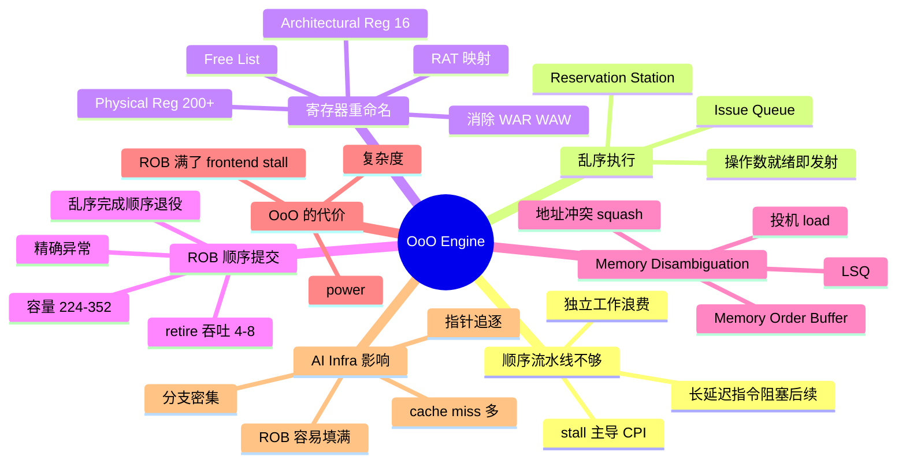
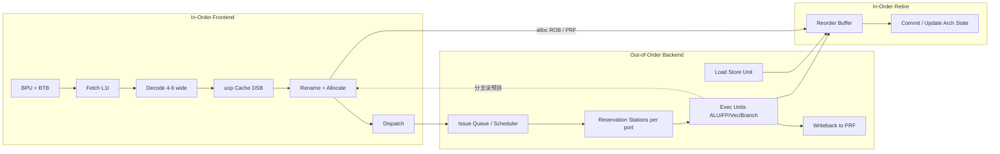
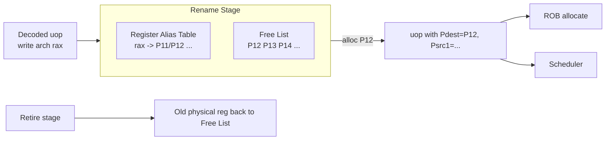
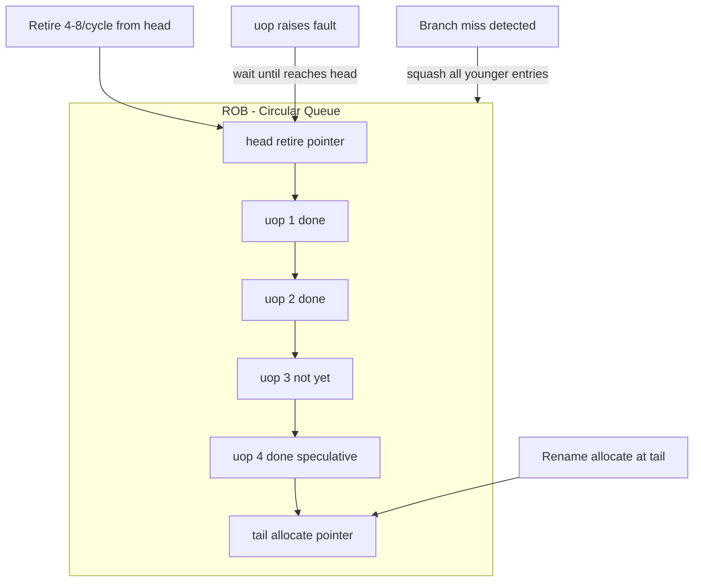
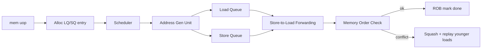
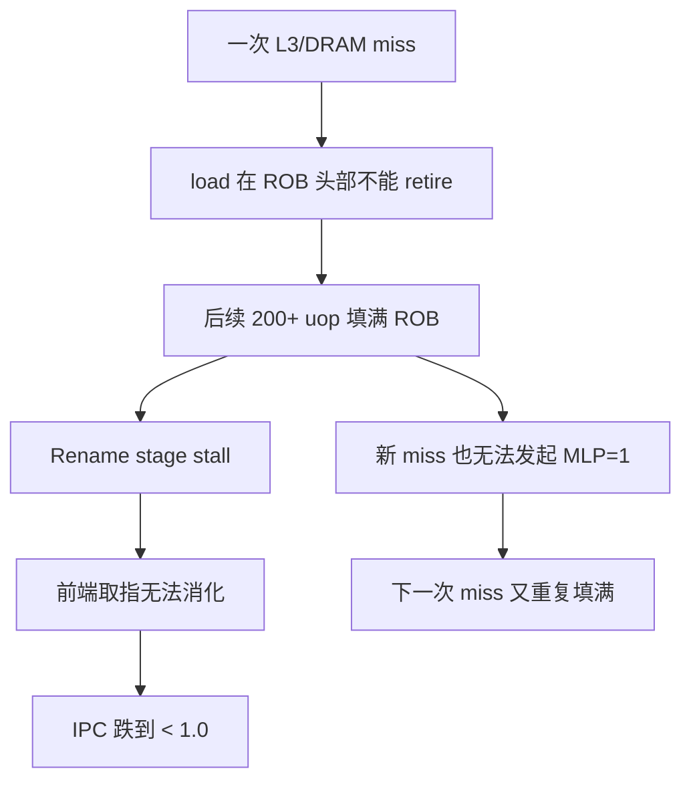

# 第 0a-2 章 · 乱序执行、寄存器重命名与 ROB

第 0a 章把 OoO（Out-of-Order Execution）放在 §0a.3 用一节带过：流水线只解决"阶段重叠"，OoO 解决"等待时别闲着"。但对 AI Infra 工程师来说，这个机制值得被单独拆开：现代服务器 CPU（Intel Sapphire Rapids、AMD Zen4、ARM Neoverse V2 等）的 ROB（Reorder Buffer）容量都在 224-352 之间，每个核心同时维持 90-110 个 in-flight loads。如果你写出来的 host-side LLM 服务代码让 ROB 平均只能装 30-50 条 in-flight uop，CPU 算力会被结构性浪费 70% 以上，而 `top` 看到的还是 100% 利用率。本章把 OoO 引擎完整剖开：frontend、rename、issue queue、reservation station、ROB、LSQ；并解释为什么"指针追逐 + 分支密集"的 Python/C++ 服务代码，是 OoO 最不喜欢的形状。

## 0a-2.1 第一性原理拆解 + 学习大纲

### 拆 — 不可化简的问题

OoO 不是"硬件偷懒帮你重排指令"。它是在回答一个不可化简的问题：当一条指令的 latency 远大于 1 cycle（典型 load 4-12 cycle，L2 miss 25 cycle，L3 miss 100+ cycle，DRAM miss 200-300 cycle，除法 20-40 cycle，gather 数十 cycle），而 CPU 每周期可以发射 4-8 条 uop 的时候，怎样让那些"和正在等待的指令无关"的后续工作不要白白闲置？顺序流水线在此刻只能 stall：因为它的硬件状态机是"指令必须按程序顺序进入 EX"。一旦某条 load miss，后面所有指令都要排在它后面排队，即使它们并不读这个 load 的结果。

这背后还有第二个不可化简的问题：程序文本中"先后写同一个寄存器"看起来像依赖，但很多时候只是符号复用。`r1 = a+b; ...; r1 = c+d` 在程序员眼里是同一个 `r1`，但语义上第二次写完全可以在第一次写之前完成（只要中间没人读 `r1`）。这种 WAW（Write-After-Write）和 WAR（Write-After-Read）依赖，被叫做"假依赖"或"name dependence"。如果硬件不消除它，OoO 的潜力会被架构寄存器数量（x86-64 只有 16 个 GPR）严格限制。

第三个不可化简的问题：乱序完成后，外界看到的状态必须仍然像顺序执行。否则中断、page fault、divide-by-zero、debug 单步都没法定位"刚才执行到哪了"，更没法精确回滚一个 speculative 分支。这就要求"执行可以乱序、提交必须顺序"，且需要一个集中数据结构，按程序顺序追踪每条已派遣但未提交的 uop——这就是 ROB。

### 推 — 从这个问题如何推导出每个机制

从"长延迟指令不该阻塞独立后续"推出 OoO scheduler：把 uop 放进 reservation station / issue queue，操作数就绪即发射。从"假依赖限制 ILP"推出寄存器重命名：用大得多的物理寄存器堆（PRF）+ Register Alias Table（RAT）+ Free List 管理映射。从"乱序完成 vs 精确异常"推出 ROB：分配时按顺序入队，提交时按顺序退役（retire）；speculative 结果先写到 PRF，但架构状态只在 retire 时更新。从"内存依赖在编译期不可静态判定（指针别名）"推出 Load/Store Queue + memory disambiguation predictor：load 可以在前面 store 的地址未知时投机执行，事后再检查冲突。从"speculative work 可能错"推出 branch recovery：分支误预测时清空 ROB 中所有 younger uop、回滚 RAT 映射。

AI Infra 视角再加一层推导：OoO 的"可挖出的并行度"上限被几个具体硬件资源卡死——ROB entry 数、PRF 大小、scheduler entry 数、LSQ size、physical register read port 数。当代码满足"分支密集 + 指针追逐 + cache miss 多 + 长依赖链"四个条件时，ROB 会被填满（fill），新 uop 无法进入，前端 stall。这不是"CPU 变慢"，而是"CPU 装不下足够的 in-flight 工作来吸收 miss latency"。所以判断 OoO 是否被你利用上，不能看 CPU%，要看 IPC、ROB occupancy、LSQ occupancy 这些 backend bound 指标。

### 绘 — 因果链路



### 导 — 读完本章你应该能回答

1. 顺序流水线遇到一次 L2 miss（约 25 cycle）会 stall 多少 cycle？OoO 在同样情况下能挖出多少额外有用工作，受什么硬件资源限制？
2. WAR、WAW、RAW 三种依赖中，哪些是"真依赖"，哪些可以被 register renaming 消除？为什么 RAW 不能消除？
3. ROB 容量为什么是 200+ 而不是 50 或 1000？再大或更小会遇到什么问题？
4. 没有 ROB 的乱序处理器在遇到 page fault 时会出什么问题？为什么"精确异常"是操作系统正确性的硬性要求？
5. Load/Store Queue 与 ROB 是什么关系？memory disambiguation predictor 在赌什么、赌错的代价是什么？
6. 一段"链表遍历 + 每个节点判断 if 后调函数"的 Python/C++ host 代码，为什么在现代 OoO CPU 上 IPC 经常只有 0.4-0.8？
7. 当你看到 `perf stat` 里 `uops_executed.thread / uops_retired.retire_slots > 1.5` 或 `cycles - uops_retired/4 > 0` 显著时，应该怀疑哪一类瓶颈？

## 0a-2.2 顺序流水线为什么不够：依赖链与 stall 主导

回到 §0a.2 的 5 段流水线模型。理想 CPI = 1，但只要有一条 load miss 到 L2（约 25 cycle）甚至 L3（约 80 cycle），后面 25-80 个 cycle 全部是 bubble。问题是：那 25 个 cycle 里，常常有大量后续指令的操作数其实是就绪的，只是因为它们排在 miss 的 load 后面，硬件不允许越过。

举一个具体例子。下面这段循环计算两个数组的加权和与最大值：

```c
for (int i = 0; i < n; i++) {
    float v = a[i] * w[i];      // 假设 a[i] cache miss
    sum += v;
    if (v > max) max = v;
    idx[i] = i * stride;        // 完全独立，不依赖 a[i]
    flags[i] = (v > 0);         // 依赖 v
}
```

顺序执行下，`a[i]` miss 的那一拍，`idx[i] = i * stride` 这条完全独立的指令也得等。OoO 处理器会立刻把 `idx[i] = i * stride` 拉到前面执行，甚至下一轮迭代的 `i+1` 部分也可以并行启动。这就是"用并行隐藏 miss latency"。

| 场景 | 顺序流水线 stall | OoO 可隐藏部分 | 残余 stall |
|---|---:|---|---:|
| 单次 L2 miss (25 cycle)，后续 30 条独立指令 | 25 cycle | scheduler 调度独立指令 | ~5 cycle |
| 单次 L3 miss (80 cycle)，后续 100 条独立指令 | 80 cycle | ROB 容纳 ~200 uop，全部隐藏 | ~10 cycle |
| 单次 L3 miss (80 cycle)，后续是依赖链 | 80 cycle | scheduler 找不到独立工作 | ~75 cycle |
| 双 L3 miss 连续，间隔 10 条独立指令 | 160 cycle | 两次 miss 可叠加（MLP=2） | ~85 cycle |

最后一行揭示了 Memory Level Parallelism（MLP）的关键：OoO 的真正价值不仅在隐藏单个 miss，而在并发发起多个 miss。L1D 的 MSHR（Miss Status Holding Register）和 LSQ 一起决定了你能同时持有多少 outstanding load。Sapphire Rapids 每核约 16-24 个 outstanding L1 miss，约 92-128 in-flight load——这是 host-side 性能的隐形上限。

> **callout · 工程边界**：`stall_cycles_backend` 占 cycles 的比例 > 50% 时，先怀疑 backend 资源耗尽（ROB/PRF/LSQ 满）而不是分支预测。`perf stat -e cycle_activity.stalls_l3_miss` 可以直接量化"等内存"的占比。

## 0a-2.3 OoO 引擎结构：Frontend / Backend / Issue Queue / Reservation Station

现代 OoO 处理器内部分两大块：In-Order Frontend（IF / Decode / Rename / Allocate / Dispatch）保证程序顺序进入；Out-of-Order Backend（Schedule / Execute / Writeback）允许乱序。两者通过 RAT、Free List、ROB、Issue Queue 等结构耦合。



Issue Queue（也叫 Scheduler）和 Reservation Station 在不同微架构里命名不同。Intel 自 Sandy Bridge 起用统一 scheduler（Unified RS，约 60-97 entry，Sapphire Rapids 约 97），AMD Zen 系列用按执行端口分组的多个 scheduler。功能上一致：等所有源操作数 ready 且对应执行端口空闲时，把 uop 发射到 EX。

| 资源 | 作用 | Sapphire Rapids 量级 | Zen4 量级 |
|---|---|---:|---:|
| ROB | 顺序追踪 in-flight uop | 512 | 320 |
| Integer PRF | 物理整数寄存器 | 280 | 224 |
| FP/Vec PRF | 物理向量寄存器 | 332 | 192 |
| Scheduler/RS | 等待发射的 uop | 97-205 | 100+ |
| Load Buffer | 未完成 load | 192 | 136 |
| Store Buffer | 未提交 store | 114 | 64 |
| Decode width | 每周期 decode uop | 6 | 4 |
| Retire width | 每周期 retire uop | 8 | 8 |

> **callout · 工程边界**：这些数字每代都在变。读 Intel 优化手册附录 B 或 AMD SOG 时，关注的是"哪个资源最先撞顶"，而不是死记数值。AI host code 通常先撞 ROB 或 Load Buffer。

## 0a-2.4 寄存器重命名：消除 WAW/WAR 假依赖

x86-64 架构上"程序员可见"的通用整数寄存器只有 16 个（RAX、RBX、…、R15），向量寄存器（YMM/ZMM）数量也有限。如果硬件按这些"架构寄存器"做依赖分析，下面这段代码：

```asm
; before rename
mov rax, [rdi]        ; A: load
add rax, 1            ; B: 依赖 A (RAW)
mov [rsi], rax        ; C: 依赖 B (RAW)
mov rax, [rdx]        ; D: 写 rax，看似依赖 A、B、C 的 rax (WAW + WAR)
add rax, 2            ; E: 依赖 D (RAW)
mov [r8], rax         ; F: 依赖 E
```

会被分析成"D 必须等 C 写完才能写 rax"。但语义上 D 跟 A/B/C 完全独立——只是名字撞车。Renamer 把每条写操作映射到一个新的物理寄存器：

```asm
; after rename (P0..PN 是物理寄存器编号)
mov P10, [rdi]        ; A
add P11, P10, 1       ; B
mov [rsi], P11        ; C
mov P12, [rdx]        ; D  <-- 新物理寄存器 P12，与 P10/P11 无关
add P13, P12, 2       ; E
mov [r8], P13         ; F
```

D-E-F 这条链与 A-B-C 完全独立，可以在 A miss 等待时并行执行。这是 OoO 能挖出 ILP 的核心。



RAT 维护"当前每个架构寄存器映射到哪个物理寄存器"。Free List 维护可用物理寄存器。一条写指令分配新物理寄存器、更新 RAT、把旧映射记入 ROB（用于回滚）；retire 时把"被替换出的旧物理寄存器"还回 Free List。如果 Free List 空了，rename stage 必须 stall——这是另一个常被忽略的 backend 资源瓶颈。

| 依赖类型 | 名称 | 例子 | 是否真依赖 | 能否被 rename 消除 |
|---|---|---|---|---|
| RAW | Read After Write | `add r1, r2; sub r3, r1` | 是 | 否（语义上必须） |
| WAR | Write After Read | `add r3, r1; mov r1, ...` | 否（假） | 是 |
| WAW | Write After Write | `mov r1, ...; mov r1, ...` | 否（假） | 是 |

> **callout · 工程边界**：寄存器分配紧的代码（编译器溢出到栈）会迫使更多 load/store，反而消耗 LSQ 资源；同时减少 OoO 可发现的并行度。`-O2` 与 `-O3` 之间，loop unroll 程度对 PRF pressure 影响很大，需要实测。

## 0a-2.5 Reorder Buffer (ROB)：保证精确异常 + 顺序提交

ROB 是 OoO 引擎的"中央簿记"。每条 uop 在 rename 后按程序顺序分配 ROB entry（包含 Pdest、原 RAT 映射、PC、异常状态等）。EX 完成时把结果标记为 ready，但不修改架构状态；只有当一条 uop 走到 ROB 队头且无异常时，retire 阶段才会：

1. 提交结果到架构状态（释放旧物理寄存器回 Free List）；
2. 提交 store 到 Store Buffer 的"可写出"区；
3. 推进 retire pointer。



为什么 ROB 容量典型在 224-352（Sapphire Rapids 已到 512）？由两个量决定：一是要能"装下足够 in-flight uop 来覆盖一次 L3/DRAM miss"——若 retire rate ≈ 4 uop/cycle，DRAM miss ≈ 200 cycle，则需要约 800 uop 的覆盖能力，但一次 miss 期间可能有多个其他独立 miss 同时进行（MLP），所以实际 ROB 不需要做到 1:1；二是 ROB 越大，retire 逻辑、associative wakeup、power、面积都会平方级增长。所以工业上选择"刚好覆盖 LLC miss + 部分 DRAM miss"的容量。

| ROB size | 覆盖能力 | 典型微架构 |
|---|---|---|
| 80 | 单次 L1 miss + 少量并行 | Atom / Cortex-A55 类 |
| 224-256 | 多次 L2/L3 miss 隐藏 | Zen3 / Cortex-X1 |
| 320-352 | 部分 DRAM miss 隐藏 | Zen4 / Apple M2 P-core |
| 512 | 大模型推理 host 路径 | Sapphire Rapids |

> **callout · 不要混淆层次**：ROB 顺序提交保证的是"架构状态精确"，不是"性能高"。性能来自乱序发射；正确性来自顺序退役。两者必须同时存在。

> **callout · 工程边界**：Retire width（4-8）是 IPC 上限的硬性顶。无论 ROB 多大、PRF 多深，每周期最多 retire 8 条 uop（在 Sapphire Rapids/Zen4 上）。所以"理论 IPC = retire width"，这是优化时不能再突破的物理边界。

## 0a-2.6 Memory Disambiguation 与 Load/Store Queue

寄存器依赖在 rename 阶段就能精确分析。但内存依赖不行：`store [rax], r1; load r2, [rbx]` 会不会冲突，取决于 `rax` 和 `rbx` 运行时是否相等。如果 OoO 处理器要等所有前序 store 的地址全部计算完成才能发射 load，OoO 收益会大打折扣（因为 load 通常是关键路径）。

解决方案是 Memory Disambiguation Predictor：硬件根据历史，预测"这条 load 大概率不会和前面那些未确定地址的 store 冲突"，于是允许 load 投机执行。Load Queue / Store Queue 配合 Memory Order Buffer（MOB）做事后检查：如果 store 地址解出后发现确实和已 speculatively 执行的 younger load 冲突，则 squash 该 load 及其依赖链，从 ROB 重新执行。



LSQ 还承担 store-to-load forwarding：当 load 地址命中 store buffer 中尚未提交的 store 时，直接从 store buffer 取值，不必等 store 写回 cache。但 forwarding 有"对齐和大小"约束，不满足时会触发 partial forwarding stall（典型 5-15 cycle 惩罚），常见于 union/byte-level 操作和某些 memcpy 模式。

| 现象 | 计数器 | 含义 | 优化方向 |
|---|---|---|---|
| Memory Order Machine Clear | `machine_clears.memory_ordering` | 别名预测错被 squash | 降低 store/load 别名密度 |
| 4K aliasing | `ld_blocks_partial.address_alias` | 地址低 12 位相同被误判为别名 | 调整 buffer 间距、padding |
| Partial forwarding | `ld_blocks.store_forward` | load 大小/对齐不匹配 store | 统一访问宽度、对齐 |
| Split load/store | `mem_inst_retired.split_loads` | 跨 cache line | 64B 对齐 hot data |

> **callout · AI 场景**：tokenizer / serializer 经常在同一 buffer 上做"小写 + 紧接小读"，是 memory ordering machine clear 的高发区。调试时优先看 `machine_clears.*` 是否异常高。

## 0a-2.7 OoO 的代价：power、复杂度、ROB 满了会怎么样

OoO 不是免费午餐。Renamer 是 N×M 的多端口 CAM，scheduler 是 wakeup × select 的 associative 结构，ROB 是宽端口循环队列，PRF 需要十几个读写端口。这些结构面积和功耗都按 entry² 量级增长——这就是为什么 ROB 不能无限做大。

更直接的工程后果是：当 ROB 满了，rename 必须 stall；Free List 空了，rename 也 stall；Load Buffer 满了，新 load 不能 dispatch；Scheduler 满了，dispatch stall。这些都表现为 frontend stall，但根因在 backend。`top` 看到的还是 100%，IPC 却降到 0.5。



这个反馈正是 host-side 服务代码 IPC 低的核心机制：长链表遍历时每个节点 deref 都可能 miss L2/L3，而 ROB 一旦被一次 miss 顶住，就无法再"提前发起下几个节点的 prefetch-style load"。MLP 退化为 1，性能塌缩。

| 现象 | 根因 | 计数器 |
|---|---|---|
| backend bound 高、ROB 满 | 长延迟 load 顶在头部 | `cycle_activity.stalls_total`、`resource_stalls.rob` |
| Rename stall | 物理寄存器/ROB/LSQ 用尽 | `resource_stalls.*` 系列 |
| Scheduler 满 | 大量 uop 等操作数 | `resource_stalls.rs`（Intel 旧）/`uops_executed.stall_cycles` |

> **callout · danger**：ROB 满 ≠ "工作做完了"。它意味着 CPU 已经无法通过乱序进一步隐藏延迟。增加线程不会让单核 ROB 变大，反而加剧 cache 竞争。正确动作是"减少前序 miss 的延迟"或"减少长依赖链"。

## 0a-2.8 AI Infra 视角：为什么 host-side LLM 服务代码 OoO 收益有限

把上面的机制对齐到真实 LLM 推理服务的 host 路径：

1. **Tokenizer**：BPE merge 是 hash 表查找 + 优先队列 pop。每次查找是一次指针 deref 到几乎随机的 hash bucket，紧接着分支判断"是否 merge"。L1D miss + branch miss 同时发生，ROB 容易被一次 miss 顶住。
2. **请求调度**：requests 通常是 `std::list<Request>` 或 Python list，遍历过程指针追逐严重，每个节点都 miss。
3. **Sampling**：top-k / top-p / temperature 是依赖链长但数据量小的操作，PRF 利用率不高，OoO 几乎挖不出并行。
4. **KV cache 元数据管理**：block table 查找、引用计数更新、free list 操作，都是"指针 + 分支 + 原子写"，ROB 利用率低且伴随 false sharing。
5. **gRPC / HTTP 解析**：状态机式解析，每个 byte 都有分支。BTB 命中率高，但 IPC 仍因状态依赖偏低。

| 代码模式 | OoO 友好度 | 原因 |
|---|---|---|
| 紧凑 SoA 数组 + 单 if | 高 | rename 出大量独立链 |
| 紧凑数组 + 复杂 inner branch | 中 | 分支预测决定 |
| 链表 / 树遍历 | 低 | 指针追逐，依赖链 |
| hash 表随机查 | 低 | miss + 分支双重打击 |
| 字符串状态机 | 低 | 每 byte 强依赖 |
| 跨线程原子计数 | 极低 | coherence + ROB serialization |

> **callout · success**：当你把"链表 of 对象"改成"struct-of-arrays + index"时，IPC 从 0.6 提升到 1.5+ 是常见结果。不需要 SIMD，光是恢复 OoO 可挖的并行就够了。

## 0a-2.9 工程操作：perf stat 解读 OoO 健康度

最低成本的 OoO 健康检查：

```bash
perf stat -e cycles,instructions,uops_issued.any,uops_retired.retire_slots,\
uops_executed.thread,cycle_activity.stalls_total,\
cycle_activity.stalls_l3_miss,resource_stalls.any \
  -- ./your_workload
```

关键比率：

| 指标 | 计算 | 健康范围（host 服务代码） | 异常含义 |
|---|---|---|---|
| IPC | `instructions / cycles` | 1.5-3.0 | <1.0 = backend 严重 stall |
| Retire slots utilization | `uops_retired.retire_slots / (cycles × retire_width)` | >0.5 | <0.3 = 大量 bubble |
| Speculation waste | `(uops_issued.any - uops_retired.retire_slots) / uops_issued.any` | <0.10 | >0.20 = 分支误预测多 |
| Backend bound | `cycle_activity.stalls_total / cycles` | <0.30 | >0.50 = ROB/PRF/LSQ 满 |
| L3-miss-bound | `cycle_activity.stalls_l3_miss / cycles` | <0.15 | >0.30 = 数据布局问题 |

更深入用 Intel TMA（Top-down Microarchitecture Analysis）：`perf stat --topdown -a` 会直接给出 Frontend Bound / Bad Speculation / Backend Bound（Memory + Core）/ Retiring 四象限分解。AI Infra 工程师值班时第一步就该看这个分解，再决定下一步用 `perf c2c`、`perf mem`、还是 `perf record -e branch-misses`。

> **callout · note**：`uops_executed.thread` 比 `uops_retired.*` 大说明有 speculative 工作被丢弃。比例显著时优先看 `br_misp_retired.all_branches` 和 `machine_clears.*`。

## 0a-2.10 Worked Example：把指针追逐的请求队列改成数组+索引

**现象**：某 LLM 推理服务的 batching scheduler 用 `std::list<Request*>` 维护 pending 队列。p99 latency 高，但 GPU 利用率只有 60%。`perf stat` 显示该热点 IPC = 0.55，retire slots utilization = 0.18，backend bound = 0.61，L3-miss-bound = 0.34。

**分析**：每次 `for (auto* r : pending)` 遍历都触发指针追逐。Request 对象通过 `new` 分散在堆上，相邻迭代访问的两个 Request 极少在同一 cache line。每个迭代里又有：

```cpp
for (auto* r : pending) {
    if (r->status == READY && r->prompt_len < max_batch_tokens) {
        if (r->lora_id != current_lora) continue;  // cold path
        candidates.push_back(r);
    }
}
```

每次 deref `r->status`、`r->prompt_len`、`r->lora_id` 都是 cache miss 候选。ROB 被第一个 miss 顶住，无法对下一个 Request 发起预取式 load，MLP 退化到 ~1。

**改造**：改成 SoA + 索引：

```cpp
struct PendingPool {
  std::vector<RequestId> id;
  std::vector<uint8_t>   status;        // 1B
  std::vector<uint16_t>  prompt_len;    // 2B
  std::vector<uint32_t>  lora_id;       // 4B
  // hot 字段紧凑排列，cold 字段（user metadata 等）分到 cold pool
};
```

遍历变成：

```cpp
for (size_t i = 0; i < pool.id.size(); i++) {
    if (pool.status[i] == READY && pool.prompt_len[i] < max_batch_tokens
        && pool.lora_id[i] == current_lora) {
        candidates.push_back(pool.id[i]);
    }
}
```

效果：访问连续，硬件 prefetcher 工作良好，单次 miss 不再阻塞后续迭代——OoO 可以在 ROB 里同时维持 30+ 个未来迭代的独立 load。复测：IPC 从 0.55 升到 1.92，backend bound 降到 0.22，L3-miss-bound 降到 0.08，p99 batching scheduler 时间从 1.8ms 降到 0.5ms，GPU 利用率回到 87%。

> **callout · success**：本例没有引入任何 SIMD、没有改算法、没有加线程，只改了数据布局。OoO + 硬件 prefetcher 自动把性能拉了 3.4 倍。这是 AI Infra 工程师最该掌握的"零成本性能"。

## 练习

### 练习 0a-2-1（基础）：rename 后的指令流

写出下面 6 条 x86 指令在 rename 后可以同时进入 scheduler 的最大数量，并指出哪些保留了真依赖：

```asm
mov rax, [rdi]
add rax, 1
mov [rsi], rax
mov rax, [rdx]
add rax, 2
mov [r8], rax
```

### 练习 0a-2-2（基础）：ROB 容量估算

某 CPU 平均 retire 率 3 uop/cycle，希望完全隐藏一次 200-cycle DRAM miss。理论上需要的最小 ROB 容量是多少？为什么实际工业 ROB 通常做到这个数字的 1.5-2 倍？

### 练习 0a-2-3（基础）：精确异常

如果一个 OoO 处理器没有 ROB，让所有指令完成即提交结果到架构寄存器，page fault 发生时 OS handler 看到的 RIP 和寄存器状态会有什么问题？为什么这会让 `mmap` + lazy paging 完全无法实现？

### 练习 0a-2-4（基础）：依赖类型识别

下面每对指令属于 RAW/WAR/WAW 哪种？哪些可被 rename 消除？
1. `add r1, r2` 后 `mov r2, r3`
2. `mov r1, [p]` 后 `add r1, 5`
3. `mov r1, 0` 后 `mov r1, 1`

### 练习 0a-2-5（进阶）：MLP 与 ROB

设 L3 miss = 100 cycle，每次 miss 之间有 20 条独立指令，ROB 大小 200。问理论上能并发持有多少个 in-flight L3 miss？如果 ROB 只有 80 呢？

### 练习 0a-2-6（进阶）：memory disambiguation 误判

构造一段 C 代码，使得 memory disambiguation predictor 持续猜错（machine_clears.memory_ordering 高），并说明如何用 `restrict` 或重排访问顺序来缓解。

### 练习 0a-2-7（进阶）：从 perf 输出诊断

某热点 `perf stat --topdown` 给出：Frontend Bound 8%，Bad Speculation 5%，Backend Bound 72%（Memory 60%、Core 12%），Retiring 15%。再看 `cycle_activity.stalls_l3_miss / cycles = 0.42`。请提出至少 3 个具体优化方向，并说明优先级。

### 练习 0a-2-8（设计）：OoO 友好的 KV block table

设计一个 vLLM 风格的 KV block table 数据结构，要求：(a) 块号查询 O(1)、(b) 遍历活跃 block 时 OoO 能挖出 ≥ 8 路 MLP、(c) 引用计数更新不引发 false sharing、(d) 与 page table 类似支持稀疏分配。给出关键字段布局、padding 策略和访问模式示意。

### 练习 0a-2-9（设计）：Tokenizer 改造方案

某 BPE tokenizer 实测 IPC 0.4，machine_clears.memory_ordering 高，branch-misses 也高。请给出一个 OoO-friendly 重构方案，覆盖：数据布局（vocab/merge 表）、批处理粒度、控制流降分支、SIMD 边界。

### 练习 0a-2-10（综合）：Runbook

写一页"OoO 健康检查 runbook"：触发条件、采集命令、判断阈值、3 种最常见根因（指针追逐 / hash 随机 / atomic 争抢）以及对应的最小修复方案与回滚预案。

## 深度参考阅读

1. John L. Hennessy, David A. Patterson, *Computer Architecture: A Quantitative Approach*，第 3 章"Instruction-Level Parallelism"。
2. R. M. Tomasulo, *An Efficient Algorithm for Exploiting Multiple Arithmetic Units*，1967，OoO 的奠基论文。
3. J. E. Smith, A. R. Pleszkun, *Implementation of Precise Interrupts in Pipelined Processors*，1985，ROB 的理论起点。
4. Intel, *Intel 64 and IA-32 Architectures Optimization Reference Manual*，附录 B "Microarchitecture"。
5. AMD, *Software Optimization Guide for AMD Family 19h Processors (Zen4)*。
6. WikiChip / Chips and Cheese 的 Sapphire Rapids、Zen4、Apple M2、Neoverse V2 微架构剖析。
7. Agner Fog, *The microarchitecture of Intel, AMD and VIA CPUs*，instruction tables。
8. Intel Top-down Microarchitecture Analysis Method（TMA），Ahmad Yasin 2014 论文 + perf 文档。
9. Brendan Gregg, *Systems Performance*，第 6 章 CPUs / 第 13 章 perf。
10. *vLLM* 与 *PyTorch* 源码中 host-side hot path（scheduler、block manager、tokenizer）的真实代码，结合本章模型阅读。
