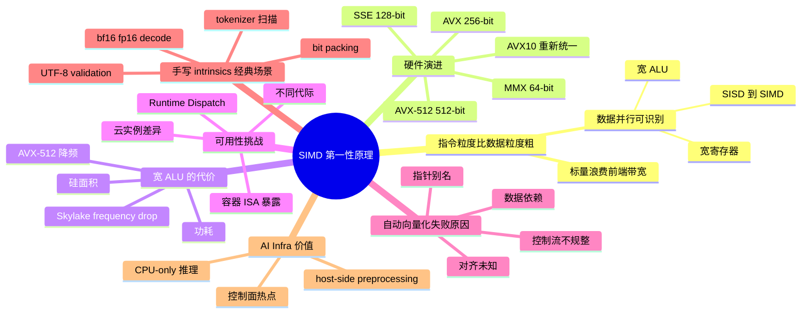
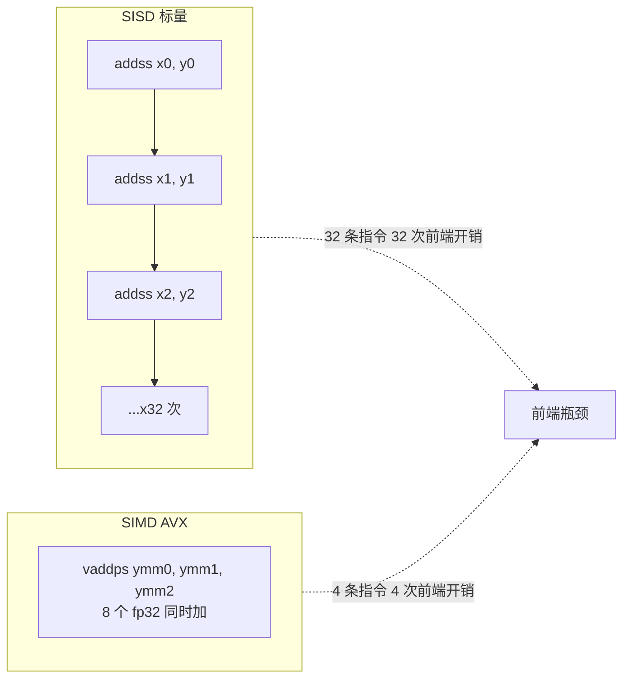
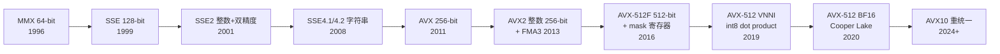
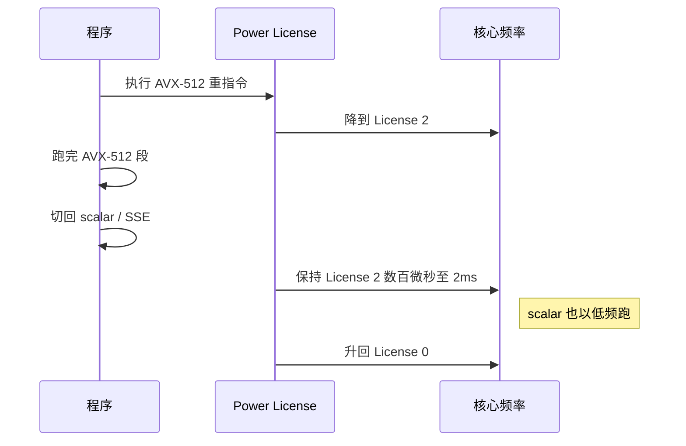
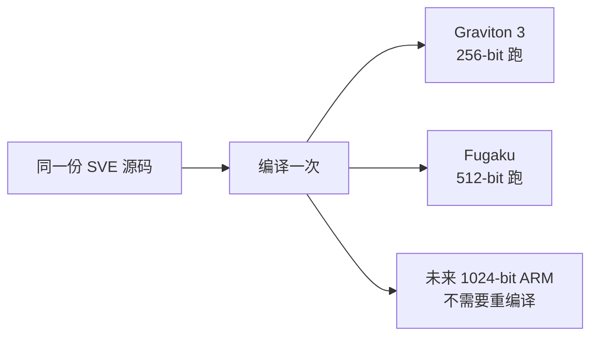
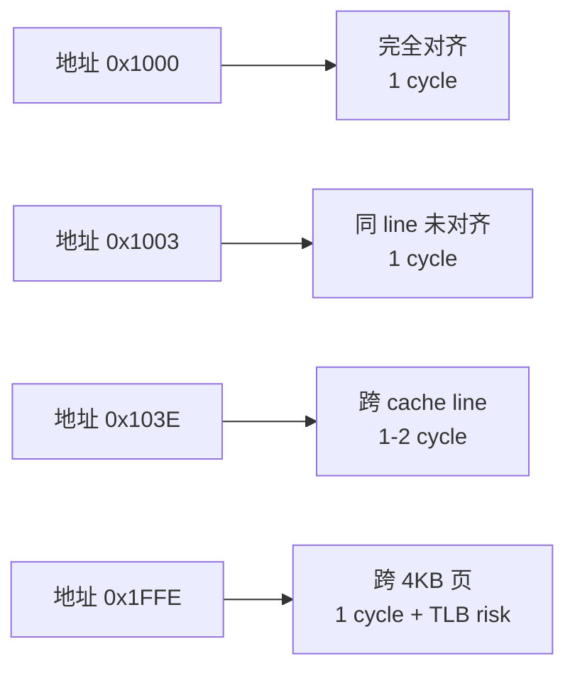

# 第 0a-4 章 · SIMD：SSE、AVX、AVX-512

第 0a 章的 [§0a.5](./0a-cpu-microarchitecture.md#0a5-simd-sseavxavx-512-与向量化判断) 用一节篇幅讲了 SIMD 的判断标准，但 AI Infra 的 host-side 热点（tokenizer、UTF-8 校验、bf16/fp16 解码、batch packing、采样后处理）几乎都是 SIMD 适用区。本章把视角拉到"指令集层面"：从 SISD 到 SIMD 为什么必然出现，x86 SSE/AVX/AVX-512 的演进取舍是什么，AVX-512 频率降级究竟该不该怕，编译器自动向量化为什么经常失败，以及在 GPU 时代 CPU SIMD 仍然不可替代的几个工程场景。

## 0a-4.1 第一性原理拆解 + 学习大纲

### 拆 — 不可化简的问题

先把 SIMD 这个名字放下。CPU 的核心矛盾在 [§0a.1](./0a-cpu-microarchitecture.md#0a1-第一性原理拆解--学习大纲) 已经说过：晶体管有限、延迟不可消除。但其中还有一个更具体的不可化简问题：当一段代码对一个连续数据数组反复执行同一个简单操作（"扫一段 byte 数组找非 ASCII"、"对一个 float 数组做 mask"、"对 logits 做 temperature scaling"），如果硬件还把每个元素当成独立的标量指令来取指、译码、发射、写回，那么**绝大多数前端带宽和译码资源都被浪费在重复的指令头部上，而不是数据上**。这种浪费不是因为算法不好，也不是因为 cache miss，而是因为**指令粒度比数据粒度粗**。

要消除这种浪费，唯一的办法是让一条指令在一个 cycle 内处理多个元素。这就是 SIMD（Single Instruction, Multiple Data）。它不是"额外的优化"，而是当数据并行可识别时的物理必然——只要硬件愿意把 ALU 加宽、寄存器加宽、load/store 端口加宽，编译器和程序员就能把"同一操作扫一段数组"的代码翻译成数倍快的指令流。

但 SIMD 不是免费的。寄存器变宽要付硅面积；执行单元变宽会产生更多热量、迫使在某些工艺上降频；未对齐的 load 会增加 cache 端口负担；控制流不规整时（每个元素走不同分支）SIMD 反而比标量慢。还有 ABI 兼容性问题：512-bit 寄存器在不同代际、不同云实例、不同操作系统调度策略下的可用性差异巨大。所以 SIMD 的不可化简问题是一个**约束最优化**：在数据并行可识别、控制流规整、对齐与边界处理可接受、硬件 ISA 可用的前提下，让宽 ALU 跑满；否则就退回标量或更窄向量。

AI Infra 的特殊性在于：很多人以为 GPU 时代 CPU SIMD 不重要了。这是**完全错误**的判断。LLM 推理服务里 tokenizer 的 byte-level 扫描、UTF-8 validation、JSON/protobuf 解析、bf16 ↔ fp32 解码、KV cache layout 转换、batch packing 中的长度排序与 padding、采样后处理（top-k、temperature、repetition penalty）、prefix tree 查找——所有这些都跑在 CPU 上，并且都是 SIMD 高度适用的形态。GPU 利用率掉到 60% 时，根因经常就是这些 host-side 热点没有向量化，或者向量化了但 runtime dispatch 选错了路径。

### 推 — 从这个问题如何推导出每个机制

从"指令粒度比数据粒度粗"推出 SIMD：让一条指令处理 N 个元素。从"N 越大单条指令收益越大"推出寄存器加宽：MMX 64-bit → SSE 128-bit → AVX 256-bit → AVX-512 512-bit。从"宽 ALU 功耗高"推出频率降级和 power license：Skylake 服务器 AVX-512 重指令会触发降频，影响整个 socket 而不仅是当前线程。从"不同代际不同 ISA 子集"推出 runtime dispatch：用 `cpuid` 检测 `avx2`、`avx512f`、`avx512bw`、`avx512vl` 后再选实现。

从"程序员手写 intrinsics 成本高"推出自动向量化：编译器分析循环、依赖、对齐和别名后自动生成 SIMD。但从"自动向量化对依赖、控制流、指针别名极其敏感"推出"必须懂得为什么编译器不向量化"：`-fopt-info-vec`、`-Rpass=loop-vectorize` 报告告诉你具体卡在哪里。从"某些热点形态自动向量化永远做不好"推出手写 intrinsics：tokenizer 字节扫描、UTF-8 状态机、bit packing、CRC、bf16 decode 都是经典手写场景。

从"未对齐 load 在老硬件上慢、新硬件上接近免费"推出"对齐策略要按目标 ISA 决定"。从"循环尾部不能整除向量宽度"推出主循环 + scalar tail（或 masked tail）。从"GPU 时代 CPU SIMD 仍重要"推出三个 AI Infra 场景：host-side preprocessing、CPU-only 推理（边缘、嵌入式、cold start）、CPU-side 控制面（router、tokenizer 服务、负载均衡）。

### 绘 — 因果链路



### 导 — 读完本章你应该能回答

1. 为什么"宽寄存器 + 宽 ALU"是数据并行场景下的物理必然，而不是可选优化？
2. 从 MMX 到 AVX-512 的寄存器宽度是怎么演进的，每一代解决了上一代什么具体问题？
3. AVX-512 频率降级是真的吗？什么场景下应该避免，什么场景下值得开？
4. 自动向量化为什么经常失败？哪些信号能告诉你编译器卡在哪里？
5. 哪些 AI Infra 热点适合手写 intrinsics 而不是依赖编译器？
6. 未对齐 load 在不同代际硬件上的代价差多少？什么时候必须强制对齐？
7. GPU 时代 CPU SIMD 在 LLM 推理服务里还能解决哪些 host-side 瓶颈？

## 0a-4.2 SISD vs SIMD：为什么标量浪费数据并行机会

经典 RISC/CISC 是 SISD（Single Instruction, Single Data）：一条指令处理一个标量元素。处理 32 个 fp32 加法需要 32 条 `addss` 指令，每条都要走完取指、译码、发射、执行、写回的全流水线。即使 OoO 能让多条独立加法并行执行（superscalar 4-wide 大约能让 4 条加法挤在同一 cycle），仍然有 8 个 cycle 才能完成。

SIMD 用一条 `vaddps` 指令在 ymm 寄存器里同时做 8 个 fp32 加法（AVX 256-bit），或在 zmm 寄存器里同时做 16 个 fp32 加法（AVX-512）。关键收益不是"加法变快了"——单条 SIMD 加法的延迟和单条标量加法接近——而是**前端开销摊薄**：取指、译码、register rename、发射、ROB 占用都按"一条指令"算，但有效工作是 8 倍或 16 倍。



| 场景 | SISD 指令数 | SIMD 指令数 (AVX2 256-bit) | SIMD 指令数 (AVX-512) | 前端开销节省 |
|---|---:|---:|---:|---|
| 32 个 fp32 加法 | 32 | 4 | 2 | 8x / 16x |
| 64 字节 byte 比较 | 64 | 2 | 1 | 32x / 64x |
| 1024 个 int8 mask | 1024 | 32 | 16 | 32x / 64x |
| 256 个 fp16 → fp32 转换 | 256 | 16 | 8 | 16x / 32x |

> [!NOTE]
> SIMD 不会让"单个元素"变快，它让"一组元素摊到一条指令上"。如果你的算法每次只处理一个元素（比如链表遍历），SIMD 就帮不上忙。这是判断一段代码是否值得 SIMD 化的第一标准。

工程边界：SIMD 收益的天花板是"前端 + 执行单元能跑满的吞吐"。如果热点已经被 cache miss 或 branch miss 主导，SIMD 化只是把闲置的流水线换成了同样闲置的宽流水线，吞吐不会涨。先用 [§0a.10](#0a-410-工程操作perf-stat-看-fp_arith_inst_retired--检查-simd-是否生效) 的 perf 命令确认前端没瓶颈，再做 SIMD 化决策。

## 0a-4.3 x86 SIMD 演进：MMX → SSE/SSE2/3/4 → AVX/AVX2 → AVX-512 → AVX10

x86 的 SIMD 演进跨越 30 年，每一代都解决了上一代的具体限制。

| 指令集 | 发布年份 | 寄存器宽度 | 寄存器名/数量 | 主要解决的问题 | 典型 AI Infra 用途 |
|---|---|---|---|---|---|
| MMX | 1996 | 64-bit | mm0-mm7（8 个，与 x87 共用） | 整数 SIMD，多媒体 | 已基本淘汰 |
| SSE | 1999 | 128-bit | xmm0-xmm7（独立寄存器） | 单精度浮点 SIMD | 兼容性 baseline |
| SSE2 | 2001 | 128-bit | xmm0-xmm15 | 双精度 + 整数 SIMD，替代 MMX | x86-64 强制可用 |
| SSE3/SSSE3 | 2004/2006 | 128-bit | xmm | 横向操作（hadd）、shuffle | 字节操作（pshufb）开始好用 |
| SSE4.1/4.2 | 2008 | 128-bit | xmm | 字符串处理（pcmpestri）、CRC32、blend | URL parsing、tokenizer 字符分类 |
| AVX | 2011 | 256-bit | ymm0-ymm15（低 128 兼容 xmm） | 寄存器加宽到 256-bit，3 操作数 VEX 编码 | 主流 fp32 batch 处理 |
| AVX2 | 2013 | 256-bit | ymm | 整数 SIMD 扩展到 256-bit、gather load | tokenizer 扫描、UTF-8 validation 主力 |
| FMA3 | 2013 | 256-bit | ymm | 融合乘加（a*b+c 单指令） | matmul kernel、预处理融合 |
| AVX-512 Foundation | 2016 (Skylake-X) | 512-bit | zmm0-zmm31（数量翻倍）、k0-k7 mask 寄存器 | 寄存器宽度翻倍、masked operation、32 个寄存器 | 高吞吐 preprocessing、bf16 decode |
| AVX-512 子集 | 2017+ | 512-bit | zmm | BW（byte/word）、DQ（double/quad）、VL（128/256 兼容）、VNNI（int8 dot product）、BF16 | 推理、量化、tokenizer |
| AVX10.1/10.2 | 2024+ | 256/512-bit 可选 | ymm/zmm | 重新统一 ISA，consumer 芯片只需 256-bit，server 可 512-bit | 解决"客户端没 AVX-512"碎片化 |



几个关键演进节点的工程含义：

- **SSE → SSE2 强制可用**：x86-64 ABI 把 SSE2 列为必备，任何现代 64-bit 程序都可以无脑用 SSE2 而不需要 runtime check。这是 ABI baseline。
- **AVX 引入 VEX 编码**：3 操作数指令格式（`vaddps ymm0, ymm1, ymm2`），不会破坏源寄存器。但需要 OS 支持（XSAVE 保存 ymm 状态）。
- **AVX2 加上 256-bit 整数**：之前 AVX 只有 256-bit 浮点，整数还是 128-bit。AVX2 是 byte-level 处理（tokenizer、UTF-8、字符串扫描）的真正起点。
- **AVX-512 Mask Register**：k0-k7 寄存器允许"按位 enable/disable" lane，写代码时不再需要为尾部单独写 scalar fallback，可以用 masked load/store。这是 AVX-512 最被低估的特性。
- **AVX-512 VNNI**：`vpdpbusd` 一条指令做 64 个 int8 乘加（4-element dot product × 16 lane），是 CPU 端 int8 量化推理的关键武器。Intel Sapphire Rapids 还加了 AMX（独立 tile 矩阵单元），把 CPU 端 GEMM 推到新量级。
- **AVX10 重新统一**：Intel 在 consumer 芯片（如 Alder Lake、Meteor Lake）上去掉了 AVX-512，引发开发者抱怨"碎片化"。AVX10 把 ISA 拆成 feature 而非寄存器宽度，consumer 256-bit + server 512-bit 都能享受新指令。

> [!IMPORTANT]
> 不要假设你的目标机器一定有 AVX-512。AWS、GCP、Azure 的不同实例代际差异极大；同一家云的不同 CPU 型号也可能没暴露 AVX-512。生产代码必须 runtime dispatch。

## 0a-4.4 AVX-512 的功耗陷阱：频率降级、Skylake 时代的 famous frequency drop

AVX-512 名声不好的根源是 Skylake-SP / Skylake-X 一代的"famous frequency drop"。问题机制是：

1. AVX-512 重指令（特别是 FMA、512-bit FP）的功耗远超普通指令。
2. CPU 用"power license"机制保护：执行 AVX-512 重指令时，整个 core（甚至整个 socket）会临时进入更低频率档位（License 2）。
3. 进入低频档位后，**即使热指令结束，也要等数百微秒到 ~2ms 才能升回最高频**。
4. 期间所有非 AVX-512 代码（scalar、SSE）也跑在降频后的频率上。

后果：如果一段代码只是**偶尔**用 AVX-512（比如某个不经常调用的 SIMD helper），可能让整个程序的标量代码慢 20-30%。这就是 Cloudflare、Travis Downs 等工程师当年大量讨论的"AVX-512 让我的服务器变慢"现象。



| 频率档位 | 触发条件 | 频率影响 | AI Infra 含义 |
|---|---|---|---|
| License 0 | scalar / SSE / 轻 AVX2 | 全速 | 默认状态 |
| License 1 | 重 AVX2 / 轻 AVX-512 | 略降（5-10%） | 多数推理热路径 |
| License 2 | 重 AVX-512 FMA | 显著降（10-25%） | 偶发 SIMD 反而拖累全局 |

但**这个问题在 Ice Lake (2019)、Sapphire Rapids (2023) 之后已经大幅缓解**。新一代 CPU：

- 降频幅度更小，从 25%+ 降到 5-10%。
- 升频更快，从毫秒级降到微秒级。
- 部分负载下完全不降频。

> [!WARNING]
> 决策原则：如果你的工作负载是 Skylake / Cascade Lake 一代的服务器（很多旧云实例），并且 AVX-512 调用比例低（< 10% cycles），保留 AVX2 路径可能更稳。如果是 Ice Lake / Sapphire Rapids / Granite Rapids 之后，并且热路径稳定使用 AVX-512，开销可以忽略。AVX10 出现后这个问题进一步弱化。

工程实践：

- 用 `perf stat -e core_power.lvl1_turbo_license,core_power.lvl2_turbo_license` 实测降频时间占比。
- 不要在 cold path（异常处理、debug 日志）里"顺手"用 AVX-512 helper。
- 把 AVX-512 集中在长循环里跑满，而不是零散点缀。
- 容器化时检查 BIOS / kernel 是否禁用了 AVX-512（部分云厂商默认关闭）。

## 0a-4.5 ARM NEON / SVE 简对比

ARM 服务器（Graviton、Ampere Altra、Apple Silicon）和移动端推理越来越重要，CPU SIMD 也必须跨架构理解。

| 特性 | x86 AVX2 | x86 AVX-512 | ARM NEON | ARM SVE / SVE2 |
|---|---|---|---|---|
| 寄存器宽度 | 256-bit 固定 | 512-bit 固定 | 128-bit 固定 | 128-2048-bit 可变（VLA） |
| Mask 寄存器 | 无（靠 blend） | k0-k7 | 无 | predicate registers p0-p15 |
| Gather/Scatter | gather only | gather + scatter | 无 | 有 |
| 编程模型 | 宽度感知 | 宽度感知 | 宽度感知 | Vector Length Agnostic（VLA） |
| 主要部署 | x86 服务器/桌面 | x86 服务器（部分） | 所有 ARMv8、Apple Silicon | Graviton 3/4、Fugaku、新 ARM 服务器 |

NEON 是"ARM 版的 SSE"：固定 128-bit、无 mask 寄存器、移动端通用。Apple Silicon（M 系列）只有 NEON，没有 SVE，但 M 系列的 4-wide NEON 加上极宽前端，吞吐惊人。

SVE（Scalable Vector Extension）是 ARM 的革命性设计：**寄存器宽度由硬件决定（128-2048 bit），程序写一次能在任意宽度上跑**。这叫 Vector Length Agnostic（VLA）编程：循环里用 `whilelt` 指令生成 predicate 自动处理尾部，不需要为不同宽度重新编译。AWS Graviton 3 是 256-bit SVE，Fugaku 超算是 512-bit SVE。



> [!NOTE]
> 跨架构 SIMD 的工程套路：用一层 portable SIMD 抽象（如 Google Highway、std::experimental::simd、Rust portable_simd），底层根据 target 特性 dispatch 到 NEON / SSE4 / AVX2 / AVX-512 / SVE。手写多套 intrinsics 维护成本极高，除非该热点真的足够热。

## 0a-4.6 自动向量化：编译器何时能、何时不能

理想情况下，编译器（GCC、Clang、ICC）会自动把循环向量化，程序员不需要写 intrinsics。但实际上自动向量化有四类常见失败原因。

| 失败类别 | 具体原因 | 编译器报告 | 解决方法 |
|---|---|---|---|
| 数据依赖 | 循环内有跨迭代依赖（如 `a[i] = a[i-1] + b[i]`） | "loop carried dependency" | 算法重写；scan 算法用 SIMD scan |
| 指针别名 | 函数参数 `float*` 不能确定是否重叠 | "may alias" | 加 `__restrict__`；显式拷贝 |
| 控制流 | 循环内有 `if/else`、`break`、`continue` | "control flow not simplifiable" | 转 mask、用 `select` 模式 |
| 对齐/边界 | 循环次数不是常量、对齐未知 | "alignment unknown" / "trip count not provable" | `__builtin_assume_aligned`、循环 unroll hint |
| 数据类型 | 复杂结构体、bit field、变长字符串 | "non-vectorizable type" | 改 SoA、拆字段 |
| 函数调用 | 循环内调用未内联函数 | "function call may have side effects" | 强制 inline、用 intrinsic |

启用编译器报告的 flag：

```text
gcc:   -fopt-info-vec -fopt-info-vec-missed
clang: -Rpass=loop-vectorize -Rpass-missed=loop-vectorize -Rpass-analysis=loop-vectorize
icc:   -qopt-report=5 -qopt-report-phase=vec
```

具体例子。一段看起来"应该能向量化"的代码：

```c
void scale_and_clip(float *out, const float *in, int n, float scale, float lo, float hi) {
  for (int i = 0; i < n; i++) {
    float v = in[i] * scale;
    if (v < lo) v = lo;
    if (v > hi) v = hi;
    out[i] = v;
  }
}
```

可能失败的地方：

1. `out` 和 `in` 可能 alias → 加 `__restrict__`。
2. `if` 控制流 → 编译器一般能转成 `min`/`max` mask，能向量化。
3. `n` 不是常量、不是 vector width 的整数倍 → 编译器会生成主循环 + scalar tail（或 masked tail）。

修正版：

```c
void scale_and_clip(float * __restrict__ out, const float * __restrict__ in,
                    int n, float scale, float lo, float hi) {
  for (int i = 0; i < n; i++) {
    float v = in[i] * scale;
    out[i] = v < lo ? lo : (v > hi ? hi : v);
  }
}
```

> [!TIP]
> 在 AI Infra 项目里，养成"提交前看一次 vectorization report"的习惯：把热点循环单独编译并打开报告，看哪些被向量化、哪些被 missed、原因是什么。这比读汇编效率高很多。

工程边界：自动向量化能解决 70% 的"数组扫描"形态，但对 tokenizer 状态机、UTF-8 validation、bit packing、bf16 decode 这类有 packing/unpacking、字节级 shuffle、状态依赖的代码几乎从不主动向量化。这些就是手写 intrinsics 的领域。

## 0a-4.7 Intrinsics 与手写：什么时候值得手写

intrinsics 是编译器内建函数，长得像 C 但映射到具体 SIMD 指令，例如 `_mm256_loadu_si256`、`_mm256_cmpeq_epi8`、`_mm256_movemask_epi8`。手写 intrinsics 的成本极高（可读性差、跨平台维护难、需要深入理解硬件），但有几类经典场景，**自动向量化做不到，手写能拿到 3-10x 加速**。

| 场景 | 为什么自动向量化做不到 | 手写收益 | 经典实现 |
|---|---|---|---|
| Tokenizer ASCII 快速扫描 | 找"第一个非 ASCII byte" 是状态依赖 + early exit | 3-5x | simdjson, Go runtime |
| UTF-8 Validation | 多状态字节模式匹配，需要 shuffle table | 5-10x | simdjson::validate_utf8 |
| JSON / Protobuf 解析 | 字符分类 + 位运算 + early exit 混合 | 2-4x | simdjson |
| bf16 / fp16 ↔ fp32 转换 | 位模式提取/拼接，标量代码无法表达 | 4-8x | OpenAI Triton CPU, llama.cpp |
| Int8 量化推理 dot product | 需要 VNNI 的 vpdpbusd 指令 | 5-15x | onednn, llama.cpp Q4_0 |
| Bit packing / unpacking | 字节级 shuffle + bit 操作 | 5-10x | bitshuffle, FastPFor |
| Hash function (xxhash, crc) | 需要硬件 CRC32 / pclmulqdq | 3-8x | xxhash, isa-l |
| SoftMax / LayerNorm CPU kernel | reduce + 广播模式编译器优化不充分 | 2-3x | oneDNN, MKL |

**Worked Example：tokenizer ASCII 快速路径** 见 [§0a-4.11](#0a-411-worked-example)。

工程边界：

- **永远保留 scalar fallback**：runtime dispatch 失败时必须能跑。
- **测试覆盖：边界（0、1、N-1、N、N+1 字节）、对齐、未对齐、特殊字节模式、错误输入**。
- **优先用成熟库**：simdjson、xxhash、isa-l、Highway、SLEEF；自己写之前先确认没有现成实现。
- **基准测试要看 percentile 而不是平均**：SIMD 路径常常 mean 快但 tail 受 cold cache、frequency transition 影响大。

> [!CAUTION]
> 手写 intrinsics 是债务。每一行 `_mm256_*` 都要在未来 5 年里跨 GCC、Clang、Intel SVML、AMD Zen、ARM 移植中维护。如果该热点不在 perf 前 10 名，先做算法优化和数据布局优化。

## 0a-4.8 内存对齐与未对齐 load 的代价

SIMD load 分两种：对齐 load（`_mm256_load_si256`，地址必须 32 字节对齐）和未对齐 load（`_mm256_loadu_si256`，任意地址）。历史上未对齐 load 慢得多（Nehalem 时代慢 2-3x），现代硬件已经接近免费。

| 硬件代际 | 对齐 load | 未对齐 load (对齐地址) | 未对齐 load (跨 cache line) | 工程含义 |
|---|---|---|---|---|
| Nehalem (2008) | 1 cycle | 1.5 cycle | 3-5 cycle | 必须强制对齐 |
| Sandy Bridge (2011) | 1 cycle | 1 cycle | 2 cycle | 跨 line 仍贵 |
| Haswell+ (2013+) | 1 cycle | 1 cycle | 1.2 cycle | 几乎无差别 |
| Skylake+ (2015+) | 1 cycle | 1 cycle | ~1 cycle | 完全免费 |
| ARM NEON | 1 cycle | 1 cycle | 极小开销 | 一向宽容 |

但有两个特殊情况仍然要注意：

1. **跨 4KB 页边界的未对齐 load**：即使现代硬件，也可能触发额外的 TLB 查询。如果热点数据接近页边界，可能突然慢 5-10%。
2. **Atomic SIMD load**：x86 没有原生 atomic 256-bit/512-bit load。如果你需要原子读取宽 SIMD 寄存器（极少见），未对齐会 silently 失去原子性。



工程实践：

- **新代码不必为对齐写复杂逻辑**。直接用 `loadu` / `storeu`，硬件已经免费。
- **大块数据分配仍建议对齐**：`posix_memalign`、`std::aligned_alloc`、`alignas(64)`。这不是为 load，而是为了避免跨 line 概率高的尾部 + 利于 streaming store。
- **Streaming store (`_mm256_stream_si256`)** 必须对齐，否则结果未定义。这是写大量数据绕过 cache 时的常用指令。

> [!NOTE]
> "对齐 vs 未对齐"是上一代优化指南的重点话题。在 2025 年，结论是：除非你跑 Nehalem/Westmere 古董，对齐已经不影响 SIMD 性能。但仍然按 64B 分配热点数组以避免 false sharing（见 [§0a.8](./0a-cpu-microarchitecture.md#0a8-伪共享dataloader-worker-counter-实例)）和利好预取。

## 0a-4.9 AI Infra 视角：为什么 GPU 时代 CPU SIMD 仍然重要

很多人以为 GPU 拿走了所有计算，CPU SIMD 不再重要。这是错的。LLM 推理服务里，host-side CPU 工作量经常占端到端延迟的 20-40%，并且全是 SIMD 适用形态。

| AI Infra 场景 | 是否 SIMD 友好 | 不向量化的代价 | 典型加速 |
|---|---|---|---|
| Tokenizer byte-level scan | 极友好 | 整个 prefill 多 5-10ms | 3-5x |
| UTF-8 / JSON validation | 极友好 | input pipeline 瓶颈 | 5-10x |
| Batch packing（按长度排序） | 中等 | batch size 利用率低 | 2-3x |
| KV cache layout transpose | 极友好 | host → device 拷贝慢 | 3-5x |
| bf16 / fp16 ↔ fp32 解码 | 极友好 | model load、save 慢 | 4-8x |
| 采样后处理（top-k, temperature） | 友好 | 每 token 多 us | 2-4x |
| Repetition penalty 扫描 | 中等 | 长 context 拖慢 decode | 2-3x |
| Prefix tree / trie 查找 | 不友好 | 自动 scalar | 极低 |
| CPU-only 推理（边缘、cold start） | 极友好 | 推理慢 5-10x | 5-15x（VNNI/AMX） |

具体场景拆解：

**1. host-side preprocessing 链路**。一个 vLLM 风格的推理服务从收到 HTTP 请求到第一个 token 输出，CPU 要做：

```text
HTTP parse → JSON validate → tokenize → request schedule
  → batch pack → host→device copy → GPU prefill → ...
```

前 5 步全在 CPU 上跑。如果 tokenizer 没有 SIMD ASCII 快速路径，长 prompt（10k token）可能多 10-20ms。这是 TTFT（Time To First Token）的纯增量。

**2. CPU-only inference 的边缘场景**。手机、IoT、embedded、cold start 的小模型推理（< 7B）经常没有 GPU。llama.cpp、ggml、ONNX Runtime CPU EP 都重度依赖 SIMD：AVX-512 VNNI / NEON dotprod / SVE 是 int8 量化推理的关键，性能差距通常在 5-15x。

**3. 控制面热点**。tokenizer 服务、router、prompt cache lookup、speculative decoding 的 verifier、guided decoding 的 grammar 检查——这些都是 CPU 密集的小模块，SIMD 化能直接降低控制面 CPU 占比，把核心让给真正的瓶颈。


> [!IMPORTANT]
> GPU 利用率只能告诉你"GPU 在不在工作"。要看端到端 TTFT、ITL（Inter-Token Latency）的 host-side 占比。如果 host-side 超过 20%，CPU SIMD 是高 ROI 优化方向。

## 0a-4.10 工程操作：perf stat 看 fp_arith_inst_retired.* / 检查 SIMD 是否生效

判断"我以为代码向量化了，到底向量化没有"——最直接的方法是 `perf stat` 看具体的 SIMD retired counter。

```bash
# Intel CPU 通用：看不同宽度浮点指令的 retired 数
perf stat -e \
  fp_arith_inst_retired.scalar_single,\
fp_arith_inst_retired.scalar_double,\
fp_arith_inst_retired.128b_packed_single,\
fp_arith_inst_retired.128b_packed_double,\
fp_arith_inst_retired.256b_packed_single,\
fp_arith_inst_retired.256b_packed_double,\
fp_arith_inst_retired.512b_packed_single,\
fp_arith_inst_retired.512b_packed_double \
  -- ./your_workload
```

输出会告诉你 scalar / 128-bit / 256-bit / 512-bit 各有多少条指令。如果你期望 AVX2 路径生效，但 256b counter 是 0，说明编译器或 dispatch 选错了路径。

整数 SIMD（更适合 tokenizer）的 counter（Skylake 后）：

```bash
perf stat -e uops_executed.x87,uops_dispatched_port.port_5 \
  -e cycle_activity.stalls_total \
  -- ./tokenizer_bench
```

也可以用 `perf record + perf annotate` 直接看汇编中的 `vpcmpeqb`、`vmovdqu`、`vpmovmskb` 等典型 SIMD 指令是否出现在热点函数。

| 检查项 | 命令 | 预期信号 |
|---|---|---|
| 浮点 SIMD 是否生效 | `fp_arith_inst_retired.*` | 256b/512b counter > 0 |
| 整数 SIMD 是否生效 | `perf annotate` 看 vp* 指令 | 热点行有 vpcmpeqb/vpshufb |
| AVX-512 频率降级 | `core_power.lvl1/lvl2_turbo_license` | License 2 占比低 |
| 自动向量化报告 | `gcc -fopt-info-vec` | 热点循环 vectorized |
| Runtime dispatch 选了哪条 | 加日志 + cpuid | 与预期 ISA 一致 |

> [!TIP]
> 在 CI 里加一个"SIMD smoke test"：跑一个固定 workload，断言 256b/512b counter 占比超过阈值。否则升级编译器、改了 build flag、依赖换了一个版本时，向量化路径可能 silently 退回 scalar，没人发现直到生产慢了。

## 0a-4.11 Worked Example

**场景**：实现 tokenizer 的 ASCII 快速路径——扫描一段 UTF-8 字节流，找到第一个非 ASCII 字节的位置（>= 0x80）。常见于 BPE tokenizer：如果整段都是 ASCII（英文、数字、标点），可以走超快路径直接 byte-level 切分；只要遇到非 ASCII（中文、emoji、特殊符号）就退回完整 UTF-8 处理。

**Scalar baseline**：

```c
size_t find_first_non_ascii_scalar(const uint8_t *data, size_t len) {
  for (size_t i = 0; i < len; i++) {
    if (data[i] & 0x80) return i;
  }
  return len;
}
```

每个 byte 一次 load + 一次 and + 一次 branch。1MB 字符串大约 1M 次循环。

**AVX2 SIMD 版本**：

```c
#include <immintrin.h>

size_t find_first_non_ascii_avx2(const uint8_t *data, size_t len) {
  size_t i = 0;
  // 主循环：每次 32 字节
  for (; i + 32 <= len; i += 32) {
    __m256i chunk = _mm256_loadu_si256((const __m256i *)(data + i));
    // 提取每个 byte 的最高位（>=0x80 即非 ASCII）
    int mask = _mm256_movemask_epi8(chunk);
    if (mask != 0) {
      // 找到第一个置位的 lane
      return i + __builtin_ctz(mask);
    }
  }
  // Scalar tail
  for (; i < len; i++) {
    if (data[i] & 0x80) return i;
  }
  return len;
}
```

**关键点**：

1. 一条 `vpmovmskb`（`_mm256_movemask_epi8`）把 32 个 byte 的最高位压缩成一个 32-bit mask，无需 compare 指令，因为 ASCII 检测就是看最高位。
2. `__builtin_ctz(mask)` 用一条 bit scan 指令找到第一个置位 lane。
3. Tail 不到 32 字节走 scalar，简单可靠。
4. 用 `loadu` 不强制对齐（现代硬件免费）。

**Benchmark 结果**（典型 Skylake/Zen3 量级，1MB 全 ASCII 输入）：

| 实现 | 时间 | 吞吐 | 加速比 |
|---|---:|---:|---:|
| Scalar | 1.20 ms | 870 MB/s | 1x |
| AVX2 32B | 0.32 ms | 3,250 MB/s | 3.7x |
| AVX-512 64B | 0.18 ms | 5,800 MB/s | 6.7x |

**生产代码补充**：

- Runtime dispatch：用 `__builtin_cpu_supports("avx2")` / `cpuid` 在初始化时选实现。
- 边界测试：长度 0、1、31、32、33、跨页边界、最后一个字节是非 ASCII、全非 ASCII。
- 当输入大概率是 ASCII（英文 prompt）时，这条快速路径直接节省 prefill 阶段 5-10ms；当输入大概率是非 ASCII（中文、日文 prompt）时，几乎立刻 early exit 退回完整路径，开销可忽略。

> [!NOTE]
> simdjson 的 UTF-8 validator 用类似思想，但加了状态机识别多字节序列的合法性，能在 1 cycle/byte 量级跑完整验证。如果你要做完整 UTF-8 validation 而不仅是 ASCII 检测，直接用 simdjson 的实现，不要重写。

工程边界：这个例子展示了"SIMD 化的最小可行单元"：明确数据形态（连续字节流）、明确判断逻辑（最高位检测）、明确 early exit 语义、明确 scalar fallback。如果你的热点能拆成这种形态，SIMD 化就是简单工程；如果拆不出来，先做算法重构。

## 练习

### 练习 0a-4-1（基础）：寄存器宽度计算

AVX-512 zmm 寄存器在以下数据类型下分别能装多少元素？bf16、fp16、fp32、int8、int16、int32、int64。

### 练习 0a-4-2（基础）：演进时间线

把 SSE2、AVX、AVX2、AVX-512F、AVX-512 VNNI、AVX-512 BF16、AMX 按发布年份排序，并写出每一代的"必要性"（即上一代解决不了的问题）。

### 练习 0a-4-3（基础）：自动向量化报告

写一个简单的循环（如 `out[i] = a[i] * b[i] + c[i]`），用 `clang -O3 -march=native -Rpass=loop-vectorize -Rpass-missed=loop-vectorize` 编译，记录报告。然后故意去掉 `__restrict__`，再编译一次，观察报告变化。

### 练习 0a-4-4（基础）：perf 检查 SIMD

写一段你怀疑没有向量化的代码，用 `perf stat -e fp_arith_inst_retired.scalar_single,fp_arith_inst_retired.256b_packed_single` 统计，判断主体跑在 scalar 还是 256-bit。

### 练习 0a-4-5（进阶）：AVX-512 频率降级实测

设计一个实验：一段长 scalar 循环混入少量 AVX-512 FMA 指令。用 `core_power.lvl2_turbo_license` 测量降频时间占比。在 Skylake-SP 和 Sapphire Rapids 上分别跑（或用 GCP n1 vs c3 实例对比），讨论结论。

### 练习 0a-4-6（进阶）：UTF-8 Validation

实现一个 SIMD UTF-8 validator（不需要从零写，可以读 simdjson 的实现并复述其状态机表）。说明它如何用 shuffle table 处理多字节序列。

### 练习 0a-4-7（进阶）：bf16 ↔ fp32 转换

bf16 是 fp32 的高 16 位。写一个 SIMD 函数把 16 个 bf16 转成 16 个 fp32（提示：把每个 16-bit 元素左移 16 位拼到 fp32 低位为 0）。用 AVX-512 实现，对比 scalar 性能。

### 练习 0a-4-8（设计）：tokenizer 端到端 SIMD 化

为一个 BPE tokenizer 设计完整的 SIMD 加速方案，至少覆盖：(1) ASCII 快速路径；(2) UTF-8 validation；(3) BPE merge 查找；(4) runtime dispatch；(5) 测试边界。说明每一步的预期加速比和工程风险。

### 练习 0a-4-9（设计）：跨架构 portable SIMD

你的服务要同时部署在 Intel Xeon (AVX-512)、AMD EPYC (AVX-512)、AWS Graviton 3 (SVE 256-bit)、Apple M3 (NEON)。设计一个 portable SIMD 抽象层，说明你会用哪个开源库（或自研），以及如何 dispatch。

### 练习 0a-4-10（设计）：CI SIMD 回归保护

在 CI 里加一个"SIMD 路径未退化"的回归保护：选一个 workload，跑 perf 采集 256b/512b counter，断言占比。给出阈值选择方法、断言失败的诊断 runbook、误报应对策略。

## 深度参考阅读

1. Intel, *Intel 64 and IA-32 Architectures Software Developer's Manual, Volume 1: Basic Architecture*（Chapter 14: Programming with SSE3, SSSE3, SSE4 and AESNI；Chapter 15: AVX；Chapter 16: AVX-512）。
2. Intel, *Intel Intrinsics Guide*（在线：intrinsics.intel.com，按指令查询用法和延迟）。
3. Agner Fog, *Optimizing software in C++* / *Instruction tables*（每代 Intel/AMD CPU 的延迟和吞吐表）。
4. Daniel Lemire et al., *simdjson: Parsing Gigabytes of JSON per Second*（VLDB 2019）；以及 simdjson GitHub 实现，特别是 UTF-8 validator。
5. Travis Downs 博客《Gathering Intel on Intel AVX-512 Transitions》，详细讲 AVX-512 频率降级机制。
6. Cloudflare Blog, *On the dangers of Intel's frequency scaling*（讨论 AVX-512 在生产中的代价）。
7. ARM, *Arm Architecture Reference Manual for A-profile Architecture*（NEON / SVE 章节）。
8. Google Highway 库（github.com/google/highway）：跨架构 portable SIMD，支持 SSE/AVX/NEON/SVE/RVV。
9. llama.cpp / ggml 项目源码：x86 AVX-512、ARM NEON、Apple Silicon 的真实 LLM 推理 SIMD 实现。
10. AMX：Intel, *Intel Advanced Matrix Extensions Programming Reference*；以及 oneDNN 中 AMX kernel 的实现。
11. AVX10：Intel, *Intel AVX10 Architecture Specification*（2024+）。
12. Wojciech Muła 博客 (0x80.pl)：大量 SIMD 字符串处理、bit packing、parsing 的工程文章。
