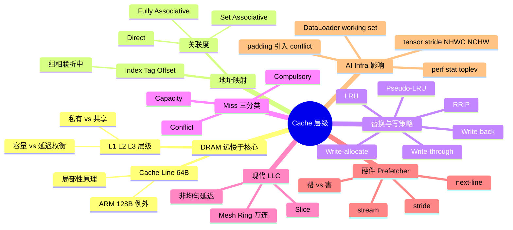
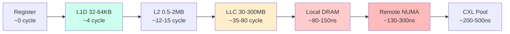
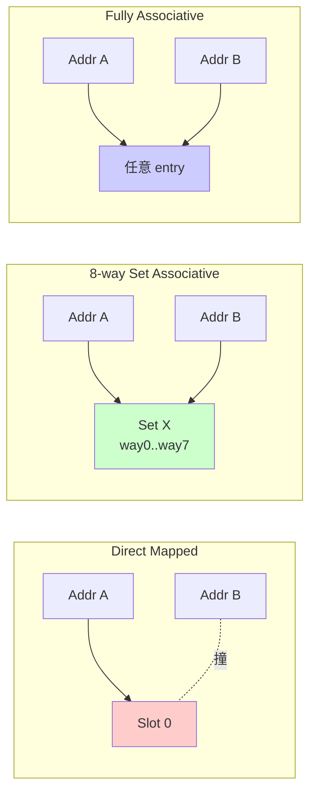
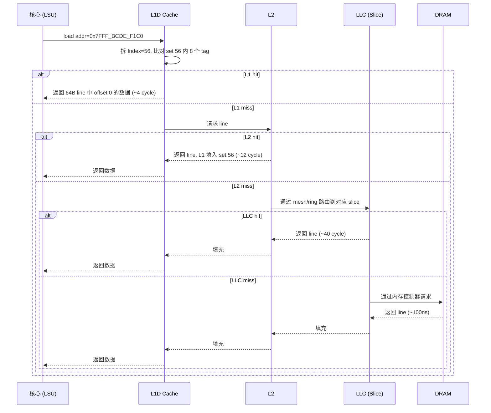
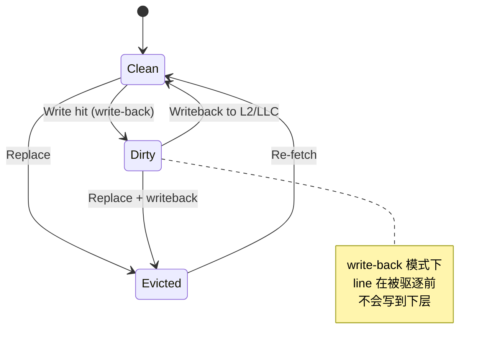
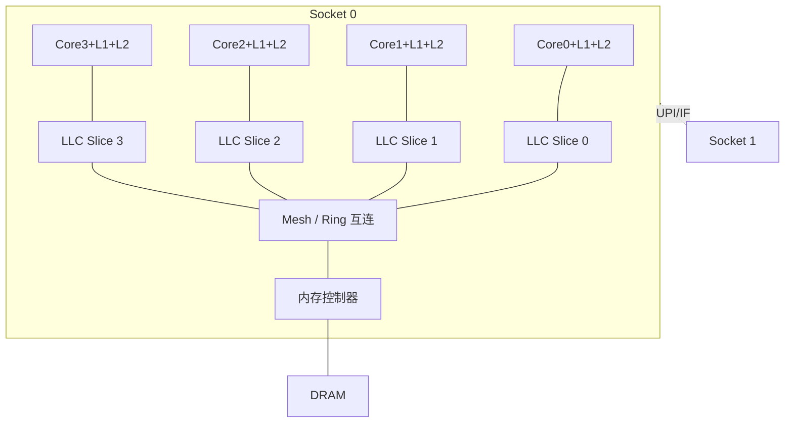
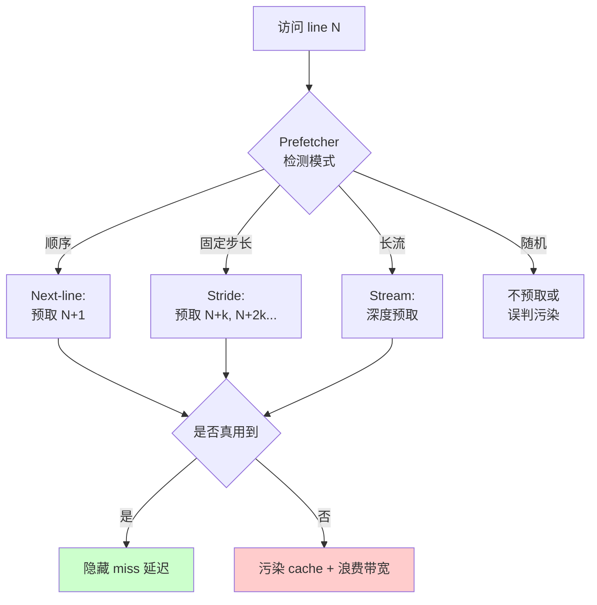

# 第 0a-5 章 · Cache 层级：L1、L2、L3、Cache Line 与关联度

Cache 是 AI Infra 工程师离 GPU 最远、却又最容易被忽视的微架构主题。CPU 上几乎所有"看起来用率很高、实际吞吐却上不去"的现象，最终都可以拆到 cache 层级、cache line、关联度、替换策略、写策略、prefetcher 这几件事。本章在 [§0a.6](./0a-cpu-microarchitecture.md) 的基础上，把 cache 层级展开成一条可排障的链路：从延迟悬崖、Cache Line、关联度、Index/Tag/Offset 计算、替换/写策略、三种 miss、LLC 切片、硬件 prefetcher，一路推到 DataLoader/tensor stride/padding 这种 AI 数据路径上的真实场景。

## 0a-5.1 第一性原理拆解 + 学习大纲

### 拆 — 不可化简的问题

DRAM 比 CPU 核心慢两个数量级。这不是工艺问题，是物理问题：DRAM 单元是电容，电容充放电需要时间；总线要路由到 socket 之外的内存控制器，传播也要时间；多核共享 DRAM 还要排队和仲裁。结论是：你不可能让一次 cache miss 在零时间内返回。但 CPU 流水线每 cycle 都要数据，矩阵化的 AI preprocessing 也要持续供给。所以问题不可化简地变成：当数据访问延迟远大于计算延迟时，怎样用一个小而快的中间存储，把"经常被访问的数据"和"未来会被访问的数据"提前放在离核心更近的地方？

只要承认"提前放"是有限资源（SRAM 比 DRAM 贵几十倍，面积上不可能做到 GB 级），就推出了第二个不可化简的问题：用什么粒度搬、放在哪里、谁先被踢出去？粒度太小（例如按 byte 搬），元数据开销吃掉所有收益；粒度太大（例如按 4KB 页搬），命中一次命中很多没用的字节，浪费带宽。所以工业界收敛到 64B（Apple Silicon 等少数 ARM 实现是 128B）。放在哪里则推出了关联度（associativity）：直接映射查得快但冲突惨，全相联无冲突但比对慢，组相联是工程折中。谁先被踢推出了替换策略：纯 LRU 硬件成本高，于是出现了 Pseudo-LRU、RRIP 这类近似算法。

第三个不可化简的问题来自"多个 worker、多张卡、多 socket 同时跑"。LLC（Last Level Cache）不再是单块 SRAM，而是切成多个 slice、用 mesh 或 ring 互连；每个核心访问 LLC 的延迟取决于地址 hash 落在哪个 slice、当前 slice 离它几跳。AI Infra 的 DataLoader 把图像 decode 放到 16-32 个 worker 时，看起来 CPU 利用率拉满，实际上每个 worker 的 working set 都在 LLC 里互相挤压，prefetcher 还会把"以为你要用的"数据提前拉进来加剧污染。如果再加上 NHWC 与 NCHW 这种 tensor stride 选择不当、padding 引入 conflict miss、batch 内字符串长度不对齐 cache line，你看到的就是 GPU idle、host CPU 100%、IPC 0.6 这种典型故障图。

### 推 — 从这个问题如何推导出每个机制

从"DRAM 慢"推出 cache；从"cache 容量有限"推出层级（L1 最快最小、L3 最慢最大）；从"按 byte 搬开销大"推出 cache line；从"line 必须能被 index 找到"推出 Index/Tag/Offset 三段式地址解码；从"index 冲突会反复驱逐"推出关联度；从"关联度太高比较电路太宽"推出组相联折中；从"满了要踢谁"推出 LRU、Pseudo-LRU、RRIP；从"写数据要不要立刻写穿到下层"推出 write-through / write-back；从"写 miss 要不要把 line 拉到本地"推出 write-allocate；从"miss 来源不同优化方法不同"推出 Compulsory / Capacity / Conflict 三分法。

进入多核以后，从"LLC 太大不可能做成单块 SRAM"推出 slice + 互连（mesh / ring）；从"互连有距离差异"推出 LLC 访问延迟不再均匀；从"前端只能按需取数据会浪费带宽"推出硬件 prefetcher（next-line、stride、stream）；从"prefetcher 也会预测错"推出"何时帮你何时害你"。AI 维度的推导链：从"tensor 是多维"推出 stride；从"stride 跨度可能远大于 cache line"推出顺序扫描和跨步扫描的 miss 比差异；从"卷积喜欢 channel-last"推出 NHWC 在 CPU/GPU 上的 cache 友好性；从"对齐到 2 的幂会撞到同一组"推出 padding 反而引入 conflict miss 的反直觉现象。

### 绘 — 因果链路



### 导 — 读完本章你应该能回答

1. 为什么 cache line 收敛到 64B，Apple Silicon 又为什么用 128B？
2. 一个 32KB、8-way、64B line 的 L1D，地址的 Index、Tag、Offset 各占几位？
3. 直接映射、组相联、全相联在 hit/miss 行为和硬件成本上的差别是什么？
4. RRIP 比 Pseudo-LRU 在 LLC 上的优势来自什么直觉？
5. write-back 和 write-allocate 解决的是什么问题，组合起来会有什么 corner case？
6. 三种 miss 各自对应什么优化手段，padding 为什么有时反而增加 miss？
7. 硬件 prefetcher 在 NHWC vs NCHW、随机 shuffle 数据上的行为差异如何排查？

## 0a-5.2 内存延迟悬崖：cycle 视角下的 L1/L2/L3/DRAM/远端 NUMA

CPU 核心一个 cycle 约 0.3-0.4ns（3GHz 时 0.33ns）。从这个时间尺度看，每一层存储的延迟都是一道"悬崖"：

| 存储层级 | 典型延迟（cycle） | 对应纳秒（3GHz） | 容量量级 | 共享范围 | AI Infra 含义 |
|---|---:|---:|---|---|---|
| 寄存器 | 0 | 0 | 数百 B | 单核私有 | 编译器/JIT 应充分利用 |
| L1D | 4-5 | ~1.3-1.7ns | 32-64KB/核 | 单核私有 | 热循环内层工作集 |
| L2 | 12-15 | ~4-5ns | 0.5-2MB/核 | 单核私有（多数 x86）| 中等数组、tile buffer |
| L3 / LLC | 35-80 | ~12-27ns | 数十至数百 MB/socket | 同 socket 多核共享 | DataLoader worker 间竞争 |
| 本地 DRAM | 80-150 | ~25-50ns | 数十 GB-TB | 同 NUMA node | 主要 working set 后端 |
| 远端 NUMA DRAM | 130-300 | ~40-100ns | 同上 | 跨 socket | 多 socket 训练节点常见瓶颈 |
| CXL / 远端 pool | 200-500+ | ~70-170ns+ | TB | 跨节点 | 新兴存储池化场景 |

> 工程边界：上表是 Intel Xeon Skylake/Ice Lake、AMD EPYC Milan/Genoa 这一代的工程量级，不同微架构、不同 BIOS 配置、不同 NUMA 拓扑都会偏移。实际值用 `lmbench`、`mlc`（Intel Memory Latency Checker）、`perf mem` 测得。

延迟悬崖意味着两件事。第一，相邻层之间的差距通常是 3-5x，但 L2 → L3 → DRAM 这一段是 3x 接着 2x，DRAM → 远端是 ~2x，所以"挤进 LLC"和"挤进本地 NUMA"是两条最值得守住的边界线。第二，CPU 的 OoO 窗口（ROB 大小常为 200-500 uop）在一定程度上能隐藏 L1/L2 延迟，但隐藏不了 DRAM 延迟——一个 100ns 的 DRAM miss 等于 ~300 cycle，比整个 ROB 还大，OoO 必然停顿。所以"减少 DRAM 访问次数"比"提高 IPC"更根本。

> 直觉锚点：训练 7B 模型时，单个 transformer layer 的权重 BF16 ~200MB，远超任何 CPU 的 LLC，所以 CPU 不可能 cache 住模型；但 DataLoader 的 batch shuffle index、字符串元数据、tokenizer 的 vocab 表（数十 MB）是可以挤进 LLC 的，这恰好是 CPU 侧 cache 优化的着力点。



## 0a-5.3 Cache Line：为什么是 64B

Cache line 是 cache 与下层存储交换数据的最小单位。读 1 byte 也会把它所在的 64B line 整条拉进来。这不是"硬件偷懒"，而是一系列权衡的最优点。

第一，**局部性原理**。程序访问内存有时间局部性（最近访问的不久会再被访问）和空间局部性（访问 a 后很可能访问 a+1、a+2）。对绝大多数代码，访问粒度从 1B 扩到 64B，命中率显著提升；继续扩到 128B、256B，边际收益变小，但浪费带宽和挤占容量的代价线性增长。

第二，**transfer granularity**。DRAM 的 burst 长度、互连协议（DDR4/5 一次 burst 8 beat × 8B = 64B）都按 64B 对齐设计，硬件就此收敛。

第三，**MESI 一致性的最小粒度**。线程间 false sharing 的故事在 [§0a.8](./0a-cpu-microarchitecture.md#0a8-伪共享dataloader-worker-counter-实例) 已经讲过：一致性消息按 line 发，line 越大伪共享风险越高。所以 64B 是"局部性收益已经饱和、伪共享代价尚未失控"的折中。

| 设计选择 | 优势 | 劣势 |
|---|---|---|
| 32B line | 伪共享更难触发；元数据更细粒度 | 硬件元数据开销大；prefetcher 命中率下降 |
| 64B line | 工业界默认 | 长期被验证为最佳折中 |
| 128B line（Apple M 系列、部分 ARM）| 顺序流式带宽更高；prefetcher 命中更广 | 伪共享风险加倍；padding 成本翻倍 |
| 4KB（操作系统页）| 适合 page table 和 IO | 太粗，不能做 cache line |

> Apple Silicon 用 128B cache line 的工程逻辑：M 系列定位是"少核、大向量、宽内存接口（统一内存架构）"，软件栈以 Metal/Accelerate 为主，跨核高频写共享的 server 风格代码相对少。所以把 line 拉到 128B 换更高的流式吞吐对它划得来。
>
> 但你把 server 代码（如 Linux 上跑 RocksDB、PyTorch DataLoader）跨平台移到 Apple Silicon 时，原本只在 64B 边界上不冲突的结构体，可能在 128B 边界上变成 false sharing。这就是为什么 folly、abseil、crossbeam 这些库的 cache padding 常量都做成了 64 或 128 的最大值。

> 工程边界：x86 上写 `alignas(64)` 看起来够，但跨 ARM/Apple 部署时建议用 `std::hardware_destructive_interference_size`（C++17）或一个常量 `kCacheLine = 128`，按最大 line size 对齐。

## 0a-5.4 关联度：直接映射、组相联、全相联

一条 cache line 在 cache 中能放在哪里？这是关联度回答的问题。

- **直接映射（Direct Mapped）**：每个 line 只有一个候选位置，由地址 index 唯一决定。查找快（一比一比对），但两个不同地址映射到同一位置会反复驱逐对方，称为 conflict miss。
- **N 路组相联（N-way Set Associative）**：cache 切成多个 set，每个 set 内有 N 个 way。地址 index 决定 set，N 个 way 之间用 LRU/Pseudo-LRU 决定谁被踢。N 越大，conflict miss 越少，但比对电路宽度（N 个 tag 同时比较）和功耗越大。
- **全相联（Fully Associative）**：任意 line 可放在任意位置。无 conflict miss，但 tag 比较需要扫描全部 entry，硬件成本只在小容量结构（TLB、victim cache）才划算。

| 关联度 | 典型结构 | 优势 | 劣势 |
|---|---|---|---|
| 1-way（直接映射）| 早期 L1 / 部分 micro-cache | 查找最快、面积最小 | conflict miss 严重 |
| 4-8 way | 现代 L1D | 工程最优点 | 比直接映射稍慢、稍贵 |
| 16-way | L2 | conflict miss 显著降低 | 比对宽度大 |
| 12-20 way | LLC（按 slice 计）| 容纳多核 working set | 实现复杂、需 hash |
| Fully | TLB、small victim cache | 无 conflict | 容量受限 |

> 直觉：32KB / 64B line / 8-way 的 L1D，set 数 = 32KB / 64B / 8 = 64 个 set。每个 set 内 8 个候选位置。如果有 9 个不同地址映射到同一 set，就必然 evict 至少一个。



> 工程边界：你看到 `perf stat` 里 L1D hit rate 高但 IPC 还是低，要怀疑是不是某个内层循环正好踩到 set 冲突——例如以 4096 字节步长扫描数组（步长是 set 数 × line size 的整数倍时，所有访问全部映射到同一个 set，等价于直接映射）。

## 0a-5.5 Index/Tag/Offset 计算 + 一个真实地址走完查询流程

地址被 cache 解码成三段：

```
| Tag (高位) | Index (中位) | Offset (低位) |
```

- **Offset**：在 line 内的字节位置。64B line → 6 位（2^6 = 64）。
- **Index**：选择哪个 set。set 数 = cache 容量 / (way × line size)。
- **Tag**：剩余高位，用于在 set 内的多个 way 之间唯一区分 line。

**例子**：64-bit 地址，32KB / 8-way / 64B 的 L1D。

- Offset = 6 位
- set 数 = 32 × 1024 / (8 × 64) = 64 → Index = 6 位
- Tag = 64 - 6 - 6 = 52 位

地址 `0x0000_7FFF_BCDE_F1C0`（按 64B 对齐）：

- 二进制末 6 位 = 000000 → Offset = 0
- 接下来 6 位 = `111000` → Index = 56（该地址映射到 set 56）
- 剩下高位 = Tag

下面是一次 load 的真实流程：



> 关键直觉：每一级 miss 都把延迟"放大一个数量级"。L1 miss → L2 是 ~3x；L2 miss → LLC 是 ~3x；LLC miss → DRAM 又是 ~3x。所以从外层往里看的 miss 率（MPKI, miss per kilo instruction）每降一级都很值钱。

## 0a-5.6 替换策略：LRU、Pseudo-LRU、RRIP

cache set 满了要踢谁？

- **True LRU**：维护精确访问顺序，踢最久未用的。N-way 需要 log2(N!) bit 状态，N=8 时 16 bit，N=16 时 44 bit，硬件成本随 N 急剧上升。
- **Pseudo-LRU（PLRU）**：用一棵二叉树近似，N-way 只需 N-1 bit。命中率略低于 True LRU，但硬件成本可控，是 L1/L2 的常见选择。
- **RRIP（Re-Reference Interval Prediction）**：每个 line 带一个 2-bit 的"再次使用预测距离"（RRPV）。新 line 默认 RRPV=2（远未来再用），命中时降到 0；需要驱逐时找 RRPV=3 的，找不到就把所有 RRPV+1 直到出现 3。变种 SRRIP/DRRIP/SHiP 在 LLC 上效果显著优于 LRU/PLRU。

为什么 LLC 要用 RRIP？因为 LLC 上有大量"流式扫描一次就不再用"的访问（DataLoader 顺序读 batch、模型权重一次扫完、日志写入），True LRU 会把这些 line 当成"最近用过"，反复挤掉真正高复用的 working set（vocab 表、shuffle index）。RRIP 通过"新 line 默认远未来再用"的设计，让流式数据快速被踢走，保护高复用数据。

| 策略 | 硬件成本 | 命中率（典型）| 抗扫描污染 | 用在哪 |
|---|---|---|---|---|
| Random | 极低 | 最差 | 中 | 仅做对照 |
| FIFO | 低 | 差 | 差 | 仅做对照 |
| True LRU | O(N log N) bit | 高 | 差 | 学术对照 |
| Pseudo-LRU | O(N) bit | 接近 LRU | 差 | L1/L2 |
| SRRIP | 2N bit | 接近或超过 LRU | 强 | LLC |
| DRRIP / SHiP | + 少量 set sampling | 进一步提升 | 最强 | 现代 LLC（Intel/AMD）|

> 工程含义：你在 LLC 上做 streaming scan 优化（例如 prefetch 远端 NVMe 数据时），不必担心 LRU 把 working set 全冲掉；现代 LLC 用 RRIP 类策略已经在硬件层做了部分抗污染。但如果你的 streaming 量超过 LLC 一个数量级（例如 100GB/s 顺序扫描），仍然会饱和 LLC 带宽，此时考虑 non-temporal store / streaming load 指令（`movnt*`）绕过 cache 直接写 DRAM。

## 0a-5.7 写策略：write-through vs write-back vs write-allocate

写数据时，cache 行为由两个独立维度决定：

**维度一：写 hit 时怎么处理。**
- **Write-through**：写 cache 的同时立即写下层。简化一致性，但带宽消耗大。
- **Write-back**：先只写 cache，标记 line 为 dirty，被驱逐时才写回下层。带宽友好，但需要额外的 dirty bit 和 writeback queue。

**维度二：写 miss 时要不要把 line 拉进来。**
- **Write-allocate**：write miss 时先把 line 从下层拉进 cache，再做写。后续连续写命中率高。
- **No-write-allocate**：write miss 时直接写下层，cache 不变。适合一次性写出。

现代 CPU L1D 几乎都是 **write-back + write-allocate**。理由：典型程序的写之后常有读（先 store 再 load 同一地址）或继续写（连续 store），write-back + write-allocate 把这两种模式都吸收在 cache 里，DRAM 写带宽得到保护。

| 组合 | 行为 | 适用场景 | corner case |
|---|---|---|---|
| Write-back + Write-allocate | 写命中只标 dirty；写 miss 拉 line 再写 | 通用 CPU L1/L2 | 大量"写一次永不读"的流式写会污染 cache |
| Write-through + No-write-allocate | 写直接到下层 | GPU 部分 cache、I/O 寄存器 | 带宽消耗大 |
| Write-back + No-write-allocate | 写命中只标 dirty；写 miss 直写下层 | 罕见 | 写命中和写 miss 行为不一致，软件难推理 |



> Corner case：streaming 写大数组（如把整个 batch 的 augmented 图像写到一块新 buffer）会触发大量 write-allocate，把无关 line 拉进 cache 又立刻被覆盖，浪费带宽并污染 cache。优化是用 non-temporal store（x86 `_mm_stream_si128` / `_mm256_stream_si256`），告诉硬件"这块写不要 allocate"。
>
> AI Infra 例子：DataLoader 把 decode 后的 tensor 写到 pinned memory、再 DMA 到 GPU，如果在 CPU 侧用普通 store，会污染 LLC；用 streaming store 可以让 LLC 留给真正的 working set。但要注意 streaming store 是弱序的，需要 `sfence` 配合后续 DMA 触发。

## 0a-5.8 三种 miss：Compulsory、Capacity、Conflict（3C 模型）

经典 3C 分类是 cache miss 优化的"病因诊断"：

| Miss 类型 | 病因 | 即使 cache 无穷大也会发生？ | 即使全相联也会发生？ | 优化手段 |
|---|---|---|---|---|
| **Compulsory（强制 / Cold）** | 第一次访问该 line | 是 | 是 | prefetch、tile/blocking、合并访问 |
| **Capacity（容量）** | working set > cache 容量 | 否 | 是 | 缩小 working set、tile/blocking、按热度分层 |
| **Conflict（冲突）** | 落在同一个 set 的 line 数 > way 数 | 否 | 否 | 改 stride、padding（注意双刃）、错峰访问 |

> 现代延伸：还有 **Coherence miss**（多核场景下被其他核 invalidate 导致），是 [§0a.8 false sharing](./0a-cpu-microarchitecture.md#0a8-伪共享dataloader-worker-counter-实例) 的物理来源。

**关键反直觉：padding 是双刃剑。** 
- 在 false sharing 场景，padding 把不同 thread 的写隔离到不同 line，**减少** coherence miss。
- 在矩阵布局场景，把 row size 从 4096 改成 4097（加 1 个元素 padding）可以**打破** 2 的幂步长，**减少** conflict miss。
- 但如果你把 row size 从 4093 改成 4096（"对齐到 2 的幂"），反而**引入** conflict miss——因为 4096 = 16 × 256 正好是某些 cache 的 set 周期。

> 经典案例：在 N-way set associative L1D 上，若数组 row 长度恰好是"set 数 × line size"的整数倍，按列扫描（stride = row size）会让所有列元素全部映射到同一个 set，导致 N+1 列就开始反复 evict。这就是为什么很多线性代数库（OpenBLAS / oneDNN / cuDNN）在分配 buffer 时主动 pad 到非 2 的幂。

## 0a-5.9 LLC 切片（Slice）+ Mesh / Ring 互连

现代 LLC 不是单块 SRAM。Intel Skylake/Ice Lake 把 LLC 切成多个 slice，每个核心绑一个 slice；地址通过 hash 函数（CBoH, CBox Hash）映射到具体 slice。AMD EPYC 的 LLC 按 CCX/CCD 切分，每个 CCD 有自己的 LLC slice。



含义：

1. **LLC 不再均匀**。Core 0 访问"映射到 Slice 3"的地址，要经过 mesh 的 3 跳，比访问 Slice 0 多十几个 cycle。
2. **多核负载不均会放大延迟**。如果某个 slice 是热点（hash 不幸把多个热数据映射到同一 slice），那个 slice 的 mesh 端口排队，所有访问该 slice 的核心都受影响。
3. **跨 socket 更贵**。socket 间 UPI（Intel）/ Infinity Fabric（AMD）延迟和带宽都是片内 mesh 的几分之一。

> AI Infra 影响：在双 socket 节点上跑 PyTorch DataLoader，如果 worker 没绑 NUMA，OS 调度可能把 worker 0 调到 socket 0，但它要读的 batch buffer 在 socket 1 的 DRAM 上，每次 LLC miss 都要跨 UPI。`numactl --cpunodebind=0 --membind=0` 把 worker 和它的内存都绑在同一 socket，直接消除这种隐性开销。

> 工程边界：Intel `pqos` / AMD `bpf` 工具可以采集每个 core 的 LLC 占用和 mesh 流量，但生产环境通常不开。一般用 `perf stat -e LLC-load-misses,LLC-store-misses,offcore_response.*` 间接判断。

## 0a-5.10 Hardware Prefetcher：stride、stream、next-line

CPU 不甘心只做"等 miss 才取"，于是有硬件 prefetcher 主动预测下一次要的数据并提前拉进来。常见类型：

| Prefetcher 类型 | 触发条件 | 行为 | 适合 | 不适合 |
|---|---|---|---|---|
| **Next-line** | 访问 line N | 自动拉 line N+1 | 顺序扫描、指令流 | 跨步访问、随机访问 |
| **Stride** | 检测到固定步长（如每次 +64B、+256B）| 沿步长继续拉 | tensor 行扫描、矩阵列扫描 | 步长不规则 |
| **Stream** | 检测到长距离顺序流 | 提前拉很多 line（深度 prefetch）| 大数组顺序处理 | 短对象、随机 |
| **Adjacent-line** | 访问 line N | 同时拉 N 的"伙伴 line"（128B pair）| 大对象 | 容易污染 cache |
| **Spatial / Temporal Memory Streaming** | 学习历史模式 | 预测复杂访问 | 重复访问模式 | 一次性扫描 |

prefetcher 何时**帮你**：working set 大于 L1 但模式规则（顺序、固定步长），prefetcher 把 L2/L3 的内容提前搬到 L1，hide 大部分延迟。

prefetcher 何时**害你**：
1. **随机访问**：prefetcher 检测不到模式，但仍然会偶尔做投机预取，把无关 line 拉进 cache，污染 working set。
2. **多 worker 竞争 LLC**：每个 worker 自己的 prefetcher 都在"乐观预取"，几个 worker 加起来的预取流量可能超过真实需求几倍，挤爆 LLC 带宽。
3. **跨页访问**：prefetcher 通常不跨 4KB 页边界（避免误触发 page walk），所以页边界附近的预取效果差。

> 工程操作：x86 上可以通过 BIOS（不灵活）或 MSR（`wrmsr 0x1A4`，需要 root）禁用各类 prefetcher 做对照实验。比较 prefetcher on/off 时的 IPC、L2-MPKI、LLC-MPKI、DRAM 带宽，能精确判断 prefetcher 是帮还是害。生产环境一般不动这个；调研性能问题时是利器。



> AI 例子：训练数据如果先 shuffle 再顺序读，shuffle 索引随机但 batch 内部顺序，prefetcher 在 batch 内有效；如果是 pure random sampling 每个 sample 都跳一次，prefetcher 持续踩空，不如批量 prefetch + 软件控制。

## 0a-5.11 AI Infra 视角：DataLoader、tensor stride、padding

把前面的机制套到 AI 数据路径上：

**DataLoader working set 与 LLC 竞争**

- 单 worker 解码图像的 working set ≈ image buffer + decode scratch + Python object overhead，通常 1-10MB。
- 16 worker × 5MB = 80MB，已经接近双路 Xeon Ice Lake 单 socket 60MB LLC 的容量。继续加 worker 不仅没新算力，还互相 evict 对方的热数据，LLC hit rate 断崖下降。
- 可观测信号：`perf stat -e LLC-load-misses,LLC-loads`，miss rate 从 20% 升到 50% 通常就是 LLC 容量打爆。

**tensor stride：NHWC vs NCHW**

- NCHW（PyTorch 默认）：内存布局是 `[N, C, H, W]`，访问 `(n, c, h, w)` 时 W 是最内层（连续），跨 channel 要跨 H×W × sizeof(float) 字节。
- NHWC（TensorFlow 默认、Apple Core ML 默认）：内存布局是 `[N, H, W, C]`，C 是最内层。

对 CPU 上的 conv 实现：
- 如果计算按 channel 内积（每输出像素累加所有输入 channel），NHWC 让 C 维连续，cache friendly，prefetcher 也能 stride。
- NCHW 在每个输出像素处要跨 H×W 跳 channel，stride 巨大，prefetcher 失效，每次 channel 切换都很可能 L2 miss。

> 工程结论：CPU inference / preprocessing 优先 NHWC（oneDNN、XNNPACK 都偏好）。GPU 上 Tensor Core 现代实现也倾向 NHWC（cuDNN 默认从 v8 起就是 NHWC for conv）。

**padding 引入 conflict miss 的真实场景**

```python
# 看似无害的对齐 padding
batch_tensor = torch.zeros(64, 3, 224, 224)  # 224 是 32 的整数倍
# 如果 row stride = 224*4 = 896B，按列扫描跨 H 步长 896*224 = 200704B ≈ 196KB
# 196KB / 64B(line) = 3136 cache line 步长
# 在 8-way × 64 set × 64B line = 32KB L1D 上
# set 周期 = 64 set × 64B = 4096B
# 200704 / 4096 = 49 余 0 → 全部映射到同一 set！
```

把 224 改成 225（或者 H 维 padding 1 行）就能打破 2 的幂步长。这是为什么 oneDNN 在内部为 conv 分配 buffer 时主动 pad 到非 2 的幂的原因。

## 0a-5.12 工程操作：perf stat 与 toplev

最常用的 cache 相关 perf 事件：

```bash
# L1D 层
perf stat -e L1-dcache-loads,L1-dcache-load-misses ./your-app

# LLC 层
perf stat -e LLC-loads,LLC-load-misses,LLC-stores,LLC-store-misses ./your-app

# 通用 cache reference
perf stat -e cache-references,cache-misses ./your-app

# DRAM 流量（uncore，机型相关）
perf stat -e uncore_imc/cas_count_read/,uncore_imc/cas_count_write/ -a -- sleep 10
```

判断标准（粗略）：

| 指标 | 健康 | 警戒 | 严重 |
|---|---|---|---|
| L1D miss rate | < 5% | 5-15% | > 15% |
| LLC miss rate | < 20% | 20-50% | > 50% |
| MPKI（miss / kilo instruction）| < 5 | 5-20 | > 20 |
| IPC | > 1.5 | 0.8-1.5 | < 0.8 |

更结构化的方法是 Top-down Microarchitecture Analysis（toplev / Intel VTune Microarchitecture Exploration）。它把 cycle 分成 4 大类：Frontend Bound、Bad Speculation、Backend Bound、Retiring。Cache miss 主要表现为 **Backend Bound → Memory Bound**，再细分到 L1/L2/L3/DRAM/Stores Bound。

```bash
# 安装 pmu-tools 后
toplev.py --level 3 -m -- ./your-app
```

> 看到 `Backend_Bound.Memory_Bound.L3_Bound > 30%` 基本就是 LLC 被打爆；`DRAM_Bound > 20%` 是 working set 已经溢出 LLC，要想办法分块。

## 0a-5.13 Worked Example：把 batch 内 stride 对齐到 cache line

**场景**：CPU 上做图像 augmentation，batch_size=64，每张 ResNet 输入 3×224×224 fp32。某个 augmentation 算子需要按 channel 扫描每个 pixel，做归一化和加噪声。

**初始实现**：tensor 是 NCHW、224×224 是 2 的整数倍组合。perf stat 显示 IPC 0.61，L1D miss rate 18%，LLC miss rate 32%；toplev 报 `L3_Bound 24%, DRAM_Bound 11%`。

**第一步定位**：按 channel 扫描时，每访问一个 pixel 要跨 224×224×4 = 200704B 跳到下一 channel，远超 cache line。NCHW 在按 channel 内积的算子下天然 cache 不友好。

**第二步**：把 tensor 转成 NHWC（一次性转换成本可摊到整个 augmentation pipeline）。改造后 IPC 升到 1.18，L1D miss rate 降到 6%，LLC miss rate 降到 14%。但 toplev 仍然有 `L1_Bound 9%`，说明还有进一步空间。

**第三步**：发现 H=224 = 32×7，row stride = 224×3×4 = 2688B，按 H 列扫描时 stride 2688B / 64B(line) = 42 line。在 32KB / 8-way / 64B L1D 上 set 周期 = 64 set × 64B = 4096B。2688 与 4096 的最大公约数 = 64，扫 64 行就回到同一 set。8-way 的 L1D 顶不住。

**第四步**：在 H 维 pad 到 226（或者直接用 oneDNN 的 blocked layout，把 channel 切成 8/16 一组，落到 SoA），破坏 2 的幂步长。改造后 L1D miss rate 降到 3%，LLC miss rate 降到 9%，IPC 升到 1.62，整段 augmentation throughput 提升 ~2.4×。

**第五步**（false sharing 检查）：`perf c2c report` 没有 HITM 热点，说明问题就是单线程 cache locality；不需要 padding 到 cache line 隔离。

> 总结：从 NCHW → NHWC 是布局选择；从 224 → 226 是 padding 选择；两者都属于"零成本/低成本"调整，但需要先用 perf stat + toplev 把瓶颈精确归类到 L1/L2/L3 哪一级，否则盲改 stride 容易往反方向走。

## 练习

### 练习 0a-5-1（基础）：延迟悬崖估算
某 CPU 主频 3.2GHz，L1=4 cycle，L2=14 cycle，LLC=60 cycle，DRAM=120ns。把这四个延迟换算成纳秒，并算 L1 → DRAM 的相对放大倍数。

### 练习 0a-5-2（基础）：Index/Tag/Offset
一个 256KB / 8-way / 64B line 的 L2，48-bit 物理地址。算 Offset、Index、Tag 各占多少位。

### 练习 0a-5-3（基础）：3C 分类
下面三种现象分别属于哪种 miss？(a) 程序首次启动；(b) working set 100MB 但 LLC 30MB；(c) 数组按 4096 字节步长扫描，4-way L1D。

### 练习 0a-5-4（基础）：Cache line 浪费
一个程序对 1 亿个对象做随机访问，每个对象 12B、对象间隔 64B（即每对象独占 1 line）。和顺序访问相比，DRAM 实际搬运量放大几倍？

### 练习 0a-5-5（基础）：写策略组合
你设计一个嵌入式 CPU 的 L1，访问模式是"写后立即读"很多但"流式写"也很多。从 write-through/write-back 和 write-allocate/no-write-allocate 四种组合中选一种，并说明理由。

### 练习 0a-5-6（进阶）：RRIP vs LRU
解释为什么 LLC 用 LRU 在"流式扫描 + 高复用 working set 共存"的场景表现差，RRIP 又是怎么改善的。

### 练习 0a-5-7（进阶）：Padding 双刃剑
给一个例子，说明加 padding **降低** miss rate；再给一个例子，说明加 padding **增加** miss rate。

### 练习 0a-5-8（进阶）：LLC slice 与 NUMA
双 socket Xeon 节点，64 个 worker 分散在两 socket。从 cache line 一致性、LLC slice、UPI 跨 socket 三个角度，分析 worker 为何有时反而比 32 worker 慢。给出至少两种缓解方案。

### 练习 0a-5-9（进阶）：Prefetcher 检测
设计一个实验，判断硬件 prefetcher 是否在你的工作负载上有效。需要的 perf 事件、对照组（开/关 prefetcher 怎么实现）、判定阈值都要列出。

### 练习 0a-5-10（设计）：DataLoader cache 容量预算
你要在 60MB LLC 的 socket 上跑 DataLoader，每个 worker 的 hot working set ~6MB（image buffer + Python objects + tokenizer state）。希望 LLC hit rate > 70%，最多能开几个 worker？再加什么手段可以扩展到更多 worker？

### 练习 0a-5-11（设计）：NHWC vs NCHW 选择
某 CPU inference pipeline 包含 conv（C 维内积）、batchnorm（按 channel）、ReLU（element-wise）、pooling（H/W 维）。从 cache locality 角度论证：哪些算子偏好 NHWC，哪些偏好 NCHW，整 pipeline 应该用哪个？

### 练习 0a-5-12（设计）：toplev 报告解读
toplev 输出 `Backend_Bound 62%, Memory_Bound 48%, L3_Bound 22%, DRAM_Bound 18%, L1_Bound 5%`。给出至少三个候选根因和对应的下一步采集/优化动作。

## 深度参考阅读

1. John L. Hennessy, David A. Patterson, *Computer Architecture: A Quantitative Approach*. 第 2 章是 cache 的经典教科书材料，含 3C 模型和量化分析。
2. Ulrich Drepper, *What Every Programmer Should Know About Memory*. 必读经典，第 3、5、6 节专门讲 cache、prefetching、NUMA。
3. Aamer Jaleel, et al. "High Performance Cache Replacement Using Re-Reference Interval Prediction (RRIP)." ISCA 2010. RRIP 原始论文。
4. Intel, *Intel 64 and IA-32 Architectures Optimization Reference Manual*. 各代 LLC slice、prefetcher 配置、MSR 控制都有详细说明。
5. Intel, *Memory Latency Checker (MLC) User Guide*. 测延迟悬崖的标准工具。
6. AMD, *Software Optimization Guide for AMD EPYC Processors*. CCX/CCD/Infinity Fabric 拓扑细节。
7. Brendan Gregg, *Systems Performance*. perf / toplev / 微架构事件的工程使用。
8. Andi Kleen, *pmu-tools / toplev*. Top-down 分析的开源实现，github.com/andikleen/pmu-tools。
9. Intel oneDNN / XNNPACK / oneAPI samples 源码，看工业界如何在 conv / GEMM 中处理 layout、padding、prefetch。
10. Linux 内核 `mm/slub.c`、`include/linux/cache.h`，工业级别的 cache-aware 数据结构实现参考。
11. PyTorch `aten/src/ATen/native/cpu/` 与 `c10/util/CacheAlignedPointer.h`，AI 框架内部的 cache padding 实践。
12. Stephen W. Keckler, et al. "GPUs and the Future of Parallel Computing." IEEE Micro, 2011. 对照 GPU 的 cache 设计差异。
