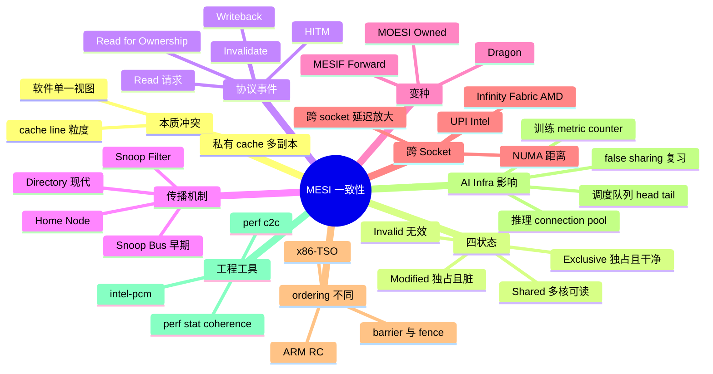
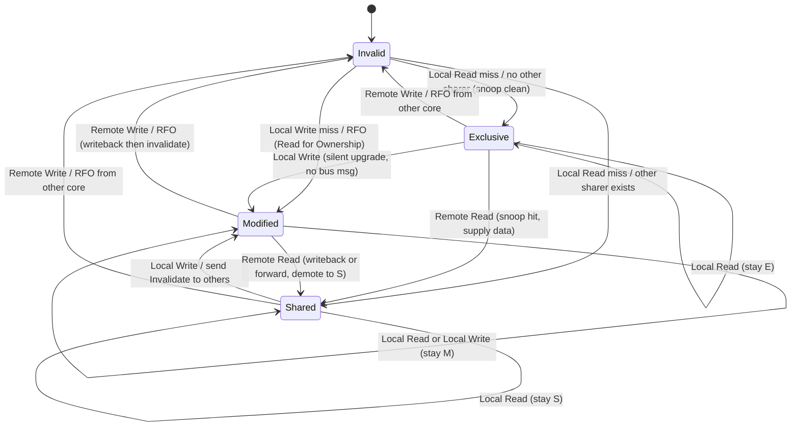
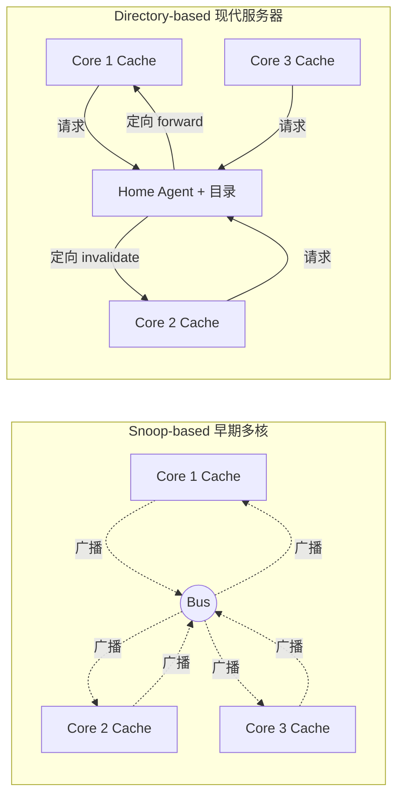
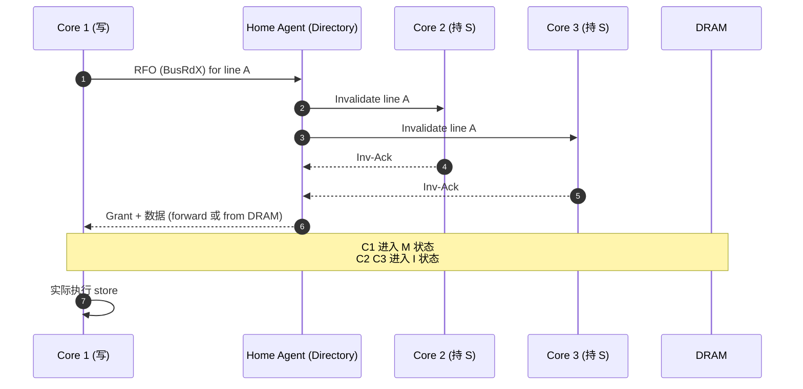
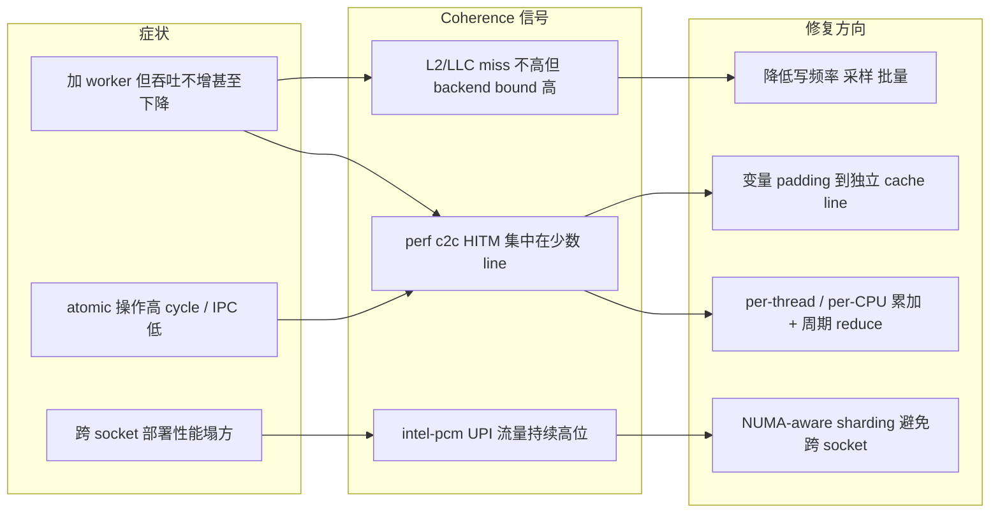

# 第 0a-6 章 · MESI 一致性协议

第 0a 章导览中的 MESI 一致性协议条目已经把 MESI 当作"一段表 + 一张状态机"匆匆带过。但在 AI Infra 真实负载里，cache coherence 不是教科书里的玩具：训练节点 64 核双 socket、推理服务上百 worker、调度器跨 NUMA 共享队列，coherence 流量经常成为 GPU idle、p99 抖动、扩容反向收益的根因。本章把 MESI 拆开重建，从"私有 cache + 共享内存"的本质冲突开始，逐一推出四状态、状态机、snoop 与 directory、MOESI/MESIF 变种、跨 socket 一致性流量代价，并给出 `perf c2c`、`intel-pcm` 这类工程工具的用法。

## 0a-6.1 第一性原理拆解 + 学习大纲

### 拆 — 不可化简的问题

多核 CPU 给每个 core 都配私有 cache（L1D、L2，部分平台还有私有 L3 slice），是为了让每条 load/store 不必每次都跑 30-100ns 去 DRAM。但软件模型仍然假设"内存只有一份"——一个变量 `x` 在所有线程眼里应该有一致的语义。这两件事必然冲突：如果 Core 0 的 L1 里有 `x=5` 的副本，Core 1 又把 `x` 改成 7 写进自己的 L1，那么 Core 0 下次读 `x` 看见什么？如果它读到旧的 5，软件世界的"共享内存"就是骗局；如果硬件每次都强制写回 DRAM 并广播失效，私有 cache 就失去意义。

所以不可化简的问题是：在物理上"内存有多份副本"的前提下，怎么让软件继续看到"内存只有一份"的抽象，且代价（带宽、延迟、晶体管）可承受？这个问题不能靠"取消 cache"或"取消共享"绕开——前者会把 CPU 带回 DRAM 时代，后者会让操作系统、运行时、消息队列、原子计数全部失效。它必须由硬件协议来解决，而且必须在 cache line 这个粒度上解决（更细则元数据爆炸，更粗则带宽爆炸）。MESI 就是这个问题的最小可行解：用 4 个状态记录"我手上这条 line 是不是最新、是不是别人也有"，用一组 bus 消息（read、read-for-ownership、invalidate、writeback）维护这些状态在所有 core 之间的不变式。

但 MESI 只是答案家族里的一个代表。它的工程含义在不同场景里会被放大或缩小：单 socket 8 核的桌面机，coherence 几乎免费；双 socket 64 核的训练节点，跨 socket invalidate 一次几百 ns；4 socket 的大型推理机，加上 directory 协议和 NUMA，写共享变量可能比读 DRAM 还慢。MOESI 加入 Owned 状态减少 writeback，MESIF 加入 Forward 状态减少同一 socket 内多路读的总线广播。这些变种不是"更高级的 MESI"，而是针对不同互连拓扑（snoop bus vs ring vs mesh vs directory）做的局部优化。

第二层不可化简的问题：cache coherence 不等于 memory ordering。MESI 保证"任意时刻，所有 core 对同一 line 的视图最终一致"，但它不规定"不同地址的写顺序在不同 core 看来是否一致"。x86-TSO 在硬件层加额外约束，让 store 不会被 reorder 到 load 之前（除了 store buffer 那一类例外）；ARM weak memory model 则把更多 ordering 责任丢给软件用 barrier/acquire-release 显式表达。AI Infra 工程师如果只懂 MESI 不懂 ordering，会写出"在 x86 上能跑、迁到 ARM Graviton 上偶发数据错乱"的代码。

### 推 — 从这个问题如何推导出每个机制

从"私有 cache 必然有多份副本"推出需要状态标记每份副本的有效性 → 推出 Invalid 状态。从"想避免每次写都广播"推出需要区分"我独占"和"大家共享" → 推出 Exclusive 与 Shared。从"想避免每次读都回 DRAM"推出 dirty 数据要能在 cache 里保留并由 cache 提供服务 → 推出 Modified。从"状态在事件下要确定地迁移"推出状态机；从"事件需要在 core 之间传播"推出 snoop bus 或 directory。

接着，从"snoop bus 在 core 数变多时广播流量爆炸"推出 directory-based protocol（每条 line 维护 sharer 列表，由 home node 仲裁），这就是现代多 socket、Mesh-on-die、CCX 里的常见做法。从"Modified 数据被远程读时立即写回 DRAM 浪费带宽"推出 MOESI 的 Owned：让"脏但被多核读"的 line 由某个 owner 直接 forward，不立即落 DRAM。从"Shared 状态下多核同时 miss 时多个 cache 同时回应造成总线竞争"推出 MESIF 的 Forward：在所有 sharer 中指定一个唯一 forwarder。

再往下，从"coherence 以 cache line 为粒度"推出 false sharing；从"跨 socket 一致性消息走 UPI/Infinity Fabric"推出 NUMA-aware 编程；从"coherence 只保证 per-line 一致"推出 memory ordering 仍需软件 barrier。AI Infra 推导链额外一层：训练 worker 多线程共享 metric counter、推理服务 connection pool 的 ref-count、调度器 work-stealing 队列的 head/tail 指针——这些路径如果每个 op 都触发 RFO，coherence 流量会和有用工作 1:1 增长，扩容反而变慢。

### 绘 — 因果链路



### 导 — 读完本章你应该能回答

1. 为什么 cache coherence 是"私有 cache + 共享内存"模型必须解决的不可化简问题，而不能由编译器或软件库解决？
2. MESI 四个状态的语义边界在哪里，Exclusive 和 Modified、Shared 和 Exclusive 的本质差别是什么？
3. 当一个变量从"只有 Core 0 读写"变成"Core 0 写、Core 1-31 都读"，cache line 会经历哪些状态转移和总线事件？
4. snoop-based 和 directory-based 协议在带宽、延迟、可扩展性上的取舍是什么？为什么现代多 socket 一定走 directory？
5. MOESI 的 Owned 和 MESIF 的 Forward 各自解决 MESI 的什么具体痛点？
6. 跨 socket 写一个 cache line 的代价大约是几个 ns 量级？为什么训练节点的 metric aggregator 在 32 核以上经常吞吐崩盘？
7. 如何用 `perf c2c` 定位 HITM 热点，再用 `intel-pcm` 验证 UPI 流量？
8. 为什么"修好了 false sharing"不等于"修好了所有 coherence 问题"，剩余路径里还可能藏着什么？

### 学习 checklist

- [ ] 能用一句话解释"为什么不能取消私有 cache，也不能取消共享内存"
- [ ] 能默写 MESI 四状态的语义表，并区分 E 和 M、E 和 S
- [ ] 能画出 MESI 完整状态机（含本地 read/write 与远程 read/write 触发）
- [ ] 能解释 snoop vs directory 的取舍，并指出当前主流服务器走哪种
- [ ] 能区分 MOESI 和 MESIF 的动机
- [ ] 能粗估"跨 socket invalidate"和"L3 命中"的延迟比，量级别错
- [ ] 会用 `perf c2c record/report` 找 HITM，并理解输出列含义

### 边界、EvidenceBundle、CapacityLedger 与故障排除

**本章拥有的边界**：解释硬件如何用 MESI/MOESI/MESIF 维护 cache line 一致性，以及 RFO、Invalidate、HITM、snoop/directory、UPI/Infinity Fabric 的代价。**本章不负责**单对象布局修复套路（0a-7）、普通容量 miss（0a-5）、语言内存模型完整语义；ordering 只讲到它和 coherence 的边界。控制路径是 local load/store/atomic -> cache controller -> directory/home agent -> snoop/invalidate；数据路径是 dirty line forward/writeback；失败路径是 RFO storm、Remote HITM、directory/home agent 拥塞、NUMA 跨 socket 放大。

**EvidenceBundle**：

```bash
perf stat -a -e cycles,instructions,cache-references,cache-misses,mem_load_l3_miss_retired.remote_hitm,mem_inst_retired.lock_loads -- sleep 30
perf c2c record -ag -- sleep 30
perf c2c report --stdio | head -100
```

跨 socket 机器再补 `pcm.x 1`、`pcm-memory.x 1` 或厂商等价工具，确认 UPI/Infinity Fabric 流量是否和 HITM 同步升高。

**CapacityLedger / 数值模型**：

```text
coherence_time_per_sec ~= HITM_per_sec * avg_HITM_latency_ns / 1e9
atomic_rfo_rate = atomic_updates_per_request * QPS
cross_socket_penalty ~= remote_HITM / total_HITM * avg_remote_transfer_ns
```

决策规则：`remote_hitm` 与 `lock_loads` 同量级时，atomic 是核心嫌疑；Remote HITM 占比 > 50% 时，先做 NUMA/亲和排查；单条 cache line HITM > 5% 时，转 0a-7 判断 true sharing 还是 false sharing。

| 症状 | 证据 | 根因 | 动作 | Retest / 复测 |
|---|---|---|---|---|
| 多 socket 上吞吐塌方 | Remote HITM 高，UPI/IF non-data 流量高 | dirty line 跨 socket 迁移 | socket-local shard、绑核绑内存、减少跨 socket writer | Remote HITM 降到 <20%，UPI 利用率回落 |
| atomic counter 成热点 | `mem_inst_retired.lock_loads` 高，HITM 指向 counter | 真共享 RMW | per-CPU/per-worker counter + 周期 reduce | lock_loads/request 降数量级，指标延迟可接受 |
| padding 后 HITM 还高 | HITM 仍集中同一变量 | 真共享，不是 false sharing | 改语义：分片、批处理、读复制 | HITM 分散或频率下降，语义一致 |
| ARM 上偶发错乱 | perf 不一定异常，复现依赖弱序 | 把 coherence 当 ordering 用，缺 acquire/release | 加正确 memory_order/barrier，补跨架构测试 | x86/ARM 压测均通过，性能回归有界 |

## 0a-6.2 为什么多核需要一致性：私有 cache + 共享内存的本质冲突

考虑最朴素的两核场景：Core 0 和 Core 1 各自有 32KB L1D，共享一块 DRAM。程序里有一个全局变量 `int x = 0`。Core 0 执行 `x = 5`，Core 1 几个 cycle 后执行 `int y = x`。软件期望 `y == 5`（在适当的同步下），因为程序员相信"内存只有一份"。

但硬件实际发生了什么？Core 0 的 store 大概率只命中自己的 L1，写入 store buffer，然后异步刷到 L1 cache line。如果没有任何 coherence 机制，Core 1 的 load 会从自己的 L1 找——找不到再到 L2、L3、最终 DRAM。即使最终回 DRAM，Core 0 那条 dirty line 可能还没 writeback，Core 1 读到的仍是 0。如果硬件强制 Core 0 每次 store 都同步写回 DRAM 再让 Core 1 重新拉，等于关闭了 cache，单次 store 从 1 cycle 变成 100ns，性能塌方。

> **note**：这就是 cache coherence 必须由硬件解决的根本原因。它不是性能优化、不是高级特性，而是"私有 cache + 共享内存"语义的承重墙。任何允许多核私有 cache 的架构，都必须在硬件层维护某种 coherence 协议，否则共享内存编程模型直接破产。

工程上还有第二层动机：很多并发原语依赖于"原子读-改-写"的可见性。例如 `lock cmpxchg` 的语义是"如果当前值等于 expected 就替换为 new"，如果两个 core 的 cache 里都有这条 line 的 stale 副本，cmpxchg 的"原子性"将无意义。MESI 协议保证 RMW 指令在执行期间持有该 line 的 Modified 状态（独占且脏），从而让原子语义在硬件上成立。

| 不一致带来的故障类型 | 示例场景 | 软件层观察 |
|---|---|---|
| Stale read | Core 1 读到 Core 0 已改写但未传播的旧值 | 计数器对不上、状态机错位 |
| Lost update | 两个 core 同时 RMW 同一变量，一边的修改丢失 | 引用计数泄漏、deadlock 或 double-free |
| Torn read | 多 byte 写在 line 边界被部分传播 | 8B 计数器读到高 4B 新、低 4B 旧 |
| 原子性破裂 | cmpxchg 在 stale 副本上"成功" | lock 互斥失效、并发数据结构损坏 |

> **warn**：硬件 coherence 不替代语言层的同步。MESI 保证"line 视图最终一致"，但不保证"不同 line 的写顺序在所有 core 看来一致"。后者是 memory ordering 的范畴，由 fence/barrier/acquire-release 控制（详见 §0a-6.9）。

## 0a-6.3 MESI 四状态详解

MESI 给每条 cache line 分配一个 2-bit 状态字段。四种状态在"独占 vs 共享"和"干净 vs 脏"两个维度上正交。

| 状态 | 缩写 | 独占性 | 与 DRAM 关系 | 其他核副本 | 典型来源 |
|---|---|---|---|---|---|
| Modified | M | 本核独占 | DRAM 是旧值 | 无（其他核必为 I） | 本核执行 store 命中 E，或拿到 RFO 后写入 |
| Exclusive | E | 本核独占 | DRAM 与 cache 一致 | 无 | 本核 read miss，且 snoop 显示无其他 sharer |
| Shared | S | 多核共享 | DRAM 一致（MESI 严格定义下） | 至少一个其他核为 S | 多核 read miss 同一 line |
| Invalid | I | 无效 | 无关系 | 任意 | 初始状态、被远程 invalidate、被驱逐 |

几个容易混的边界：

- **E 与 M 的差别**：都独占，但 E 表示"我还没改过"，DRAM 仍是最新；M 表示"我改过"，DRAM 已陈旧。E → M 不需要发任何总线消息（因为本核已独占），所以 E 是"快速 store"的关键状态。如果 read miss 时直接进入 S，后续每个 store 都要发 invalidate；进入 E 则可以静默升级为 M。
- **E 与 S 的差别**：都干净，但 E 独占、S 多核共享。从 I 加载时的关键判断是"snoop 时有没有其他 cache 已有此 line"——没有进 E、有则进 S。这个判断由 cache controller 在 read 总线事务上观察响应得出。
- **S 在严格 MESI 下"DRAM 是最新"**：因为 MESI 没有 Owned 状态，任何 dirty line 在被多核读取时必须先 writeback 再变 S，让 DRAM 成为权威源。MOESI 的 Owned 状态正是放松这一约束（见 §0a-6.6）。
- **I 不只是"没数据"**：也包括"数据被远程 invalidate"。被 invalidate 的 line 通常仍占着 cache 槽位，直到被驱逐或重新加载。

> **success**：把"独占性"和"干净度"作为两个独立维度去记 MESI，比死背状态名好。M=独占+脏，E=独占+净，S=共享+净，I=无效。MOESI 的 O 则是"共享+脏"，补全了第四个组合。

## 0a-6.4 MESI 状态转换的完整状态机

下面是包含本地操作（local read/write）和远程总线事件（remote read/write）触发的完整状态机。Local 表示本核 CPU 发出的请求，Remote 表示其他核发出的请求被本核 snoop 到。



把上图中的 transition 按"触发者 / 触发事件"展开成查表，便于排障时快速对照：

| 当前状态 | 触发 | 下一状态 | 总线事件 | 备注 |
|---|---|---|---|---|
| I | Local Read | E | BusRd, snoop clean | 无其他 sharer |
| I | Local Read | S | BusRd, snoop shared | 至少一个 sharer |
| I | Local Write | M | BusRdX (RFO) | 拿到独占所有权 |
| E | Local Read | E | 无 | 本核独占可静默 |
| E | Local Write | M | 无 | 关键加速点：E→M 静默 |
| E | Remote Read | S | snoop response, supply data | 由本核响应避免回 DRAM |
| E | Remote Write | I | snoop, invalidate | 让出所有权 |
| S | Local Read | S | 无 | 多核可读 |
| S | Local Write | M | BusUpgr (invalidate others) | 不需要重新拉数据 |
| S | Remote Read | S | snoop, 由 forwarder 或 DRAM 供数 | MESIF 在此处指定唯一 forwarder |
| S | Remote Write | I | snoop, invalidate | 失去副本 |
| M | Local Read | M | 无 | 独占且脏 |
| M | Local Write | M | 无 | 独占且脏 |
| M | Remote Read | S | writeback + supply (HITM) | 经典的 cache-to-cache transfer |
| M | Remote Write | I | writeback + invalidate | 让出脏数据再放弃 |

> **note**：上面表里出现的 BusRd / BusRdX / BusUpgr / Invalidate 是抽象总线消息名。Intel 实际用 Snoop 协议（QPI/UPI 上的 Home/Source Snoop 等子模式），AMD 用 MOESI + Probe。名字不同但语义对应。

> **warn**：E → M 是无总线消息的"静默升级"。这意味着如果一段代码先 read 一个全局变量、再 write，相比"先 write"少一次 RFO。但这只在 read miss 时进入 E（无其他 sharer）才成立——一旦其他核也 read 过它就退化为 S，第一次 write 就要 BusUpgr 把所有 sharer 失效掉。所以"全局只读配置"和"全局偶尔写指标"在 coherence 上是两种完全不同的负载。

### 工程边界

真实硬件比上图复杂得多：有 store buffer、write combining buffer、prefetcher、speculative load、L2/L3 inclusive vs non-inclusive 策略，每一项都会让某些 transition 走特殊快路径或慢路径。本章状态机用来建立"原理直觉"和"排障 mental model"——在解读 `perf c2c` 输出或 NUMA topology 影响时够用，但不要拿它去推断单条指令的精确周期。

## 0a-6.5 Snoop 总线 vs Directory-based

MESI 是状态机，但状态机要在 N 个 core 之间一致，必须有一种事件传播机制。两条主流路线：

**Snoop-based**：所有 cache 共享一条总线（或一组虚拟总线），任何 core 发出的 BusRd/BusRdX/Invalidate 被所有其他 core 监听。每个 cache controller 看到事件后查自己的状态，必要时响应（提供数据、降级、失效）。优点：实现简单，单 socket 8-16 核以下延迟低。缺点：广播流量随 core 数线性甚至更糟增长，总线带宽很快成瓶颈。早期多核（Pentium D、Core 2 Quad、早期 Opteron）都是 snoop。

**Directory-based**：每条 cache line 由一个 home node（通常按地址 hash 或 NUMA 归属决定）维护一个目录条目，记录"哪些 core 持有此 line、状态是什么"。任何请求先发给 home node，home node 查目录决定是否需要 forward 给某个 owner、向哪些 sharer 发 invalidate。优点：不广播，可扩展到几十几百核。缺点：多一跳延迟（请求 → home → owner → 请求方），目录元数据本身占面积和带宽。现代多 socket 服务器（Intel Skylake-SP 起的 Mesh、AMD EPYC 跨 CCX/CCD、ARM Neoverse 大型 SoC）都是 directory 或带 snoop filter 的混合。

| 维度 | Snoop-based | Directory-based |
|---|---|---|
| 广播策略 | 所有事件全网广播 | 点对点 + home 仲裁 |
| 可扩展核数 | 4-16 核 | 数十-数百核 |
| 单次 invalidate 延迟 | 低（一跳） | 高（多跳） |
| 总带宽消耗 | O(N) ~ O(N²) | 可控，约 O(sharer 数) |
| 元数据开销 | 低 | 每 line 一条目录条目 |
| 典型平台 | 旧多核 desktop、单 socket SMP | 多 socket 服务器、Mesh-on-die |
| AI Infra 现实 | 几乎不存在 | 训练/推理服务器全是这一类 |

许多现代实现还会用 **snoop filter**：在 home agent 旁加一个滤波器，记录哪些 line "明显没有 sharer"，避免不必要的 snoop。这是 snoop 与 directory 的折中。Intel 的 HA（Home Agent）和 CHA（Caching/Home Agent，Skylake-SP 起合并）就承担这个角色。



> **note**：从 AI Infra 视角，区分"snoop vs directory"的实操价值在于：directory 协议下，跨 socket 的写代价比单 socket 内高得多，因为消息至少要走一次 socket 互连（UPI/IF）+ home 仲裁。这直接决定了"一个高频写共享变量到底贵不贵"。

## 0a-6.6 变种：MOESI 与 MESIF 的动机

MESI 在某些场景下做无用功：

1. Modified line 被另一核 read 时，必须 writeback 到 DRAM 后才能降级为 Shared。但如果其他核接下来还会 read（典型的 producer-consumer），先写 DRAM 再读 DRAM 是浪费——cache-to-cache forward 就够了。
2. 同一条 Shared line 被 N 个核持有，新的 read miss 出现时，N 个 cache 同时收到 snoop，都可以提供数据，谁来响应？多个响应造成总线/网络竞争。

**MOESI**（AMD Opteron 起广泛使用）：在 MESI 上加一个 **Owned** 状态。语义是"本核持有最新值，DRAM 是旧值，但允许其他核以 Shared 状态共享我"。当 M 状态的 line 被 remote read 时，不必 writeback，直接 forward 给请求方并把自己降为 O，其他核为 S。Owned 拥有"提供数据并维护一致性"的责任，DRAM 仍是脏状态，直到 Owned 被驱逐才 writeback。

| MESI vs MOESI 行为差异 | MESI | MOESI |
|---|---|---|
| M line 被 remote read | writeback + 降为 S | 直接 forward + 降为 O，免一次 DRAM 写 |
| Producer-consumer 流量 | 每次 producer 写完都要 writeback | producer 持有 O，连续 forward 给 consumer |
| writeback 带宽占用 | 高 | 低 |
| 协议复杂度 | 简单 | 多一个状态 + Owner 选举 |

**MESIF**（Intel Nehalem 起在 QPI/UPI 平台使用）：在 MESI 上加一个 **Forward** 状态。语义是"我是 Shared，但我是被指定的 forwarder——多核 read miss 时由我响应，其他 S 状态的 cache 保持沉默"。Forward 解决的是"多个 sharer 同时响应"的总线争抢，本质是 Shared 的子集（"特殊的 S"）。

| MESIF 关键场景 | 没有 F | 有 F |
|---|---|---|
| 多核读同一只读表 | 多个 S cache 同时尝试响应，总线仲裁 | 唯一 F cache 响应，其余 S 沉默 |
| 数据脏 vs 净 | F 是干净的（DRAM 也是最新） | 同左 |
| 与 MOESI 关系 | 解决不同问题，可正交叠加（理论上 MOESIF） | 实际平台一般只挑一个 |

> **note**：MOESI 解决"M → S 时的 writeback 浪费"，MESIF 解决"S 多 sharer 时的响应竞争"。两者动机正交，但工业上 Intel 选 MESIF + 高带宽互连，AMD 选 MOESI + Infinity Fabric，路径不同。

> **warn**：从软件视角看，MOESI 和 MESIF 对 API、ordering、原子语义都是透明的，你不会在 C++/Rust 代码里看到"Owned"或"Forward"。但它们决定了同样的访问模式在 Intel 和 AMD 平台上的实际 coherence 流量差异，导致 perf 数据不能跨平台直接对比。

## 0a-6.7 一致性流量构成：RFO、Invalidate、HITM

`perf c2c`、`intel-pcm`、Linux PMU 事件名经常出现下面几个术语，理解它们直接对应到 §0a-6.4 的状态机。

| 事件 | 全名 | 触发情境 | 状态机对应 | 代价量级 |
|---|---|---|---|---|
| **RFO** | Read for Ownership | core 想写一条不在 M/E 状态的 line | I → M（带 BusRdX） | 跨 socket 时 100-300ns |
| **Invalidate** | Invalidate broadcast | core 想从 S 升 M，需把其他 sharer 失效 | S → M（带 BusUpgr） | snoop 路径 + ack 等待 |
| **HITM** | Hit Modified | snoop 时发现另一核以 M 持有 | M → S 或 M → I + 数据 forward | 最贵，跨 socket 可达 200-500ns |
| **HITM (clean)** | Hit Exclusive/Forward | snoop 命中 E 或 F，无需 writeback | E/F 提供数据 | 比 HITM 便宜，但比 L2 hit 贵 |
| **Writeback** | M line eviction | M line 被驱逐或被 demote | M → I（落 DRAM） | DRAM 写带宽 |

几个 AI Infra 视角的解读：

- **写共享 = RFO**。任何一次"写一个被多核读到 cache 里的变量"都意味着至少一次 RFO + N 次 invalidate ack。即使你用 `std::atomic` 写、即使你只写 1 个 byte，硬件也按整条 64B line 算。
- **HITM 是 false sharing 的特征事件**。`perf c2c report` 的 "HITM" 列是定位 false sharing 的金标准。如果某条 cache line 的 HITM 计数远高于其他，几乎一定是热点。
- **Writeback 不一定坏**。它只是把 dirty 数据落回 DRAM，本身不阻塞别人。但如果 writeback 频率高到吃满 DRAM 写带宽，会反过来阻塞其他读路径。
- **跨 socket 的 RFO/Invalidate/HITM 全部走 UPI/IF**。这是为什么"同一段代码在单 socket 跑得好、双 socket 跑崩"的硬件原因。

> **danger**：很多人把"原子操作慢"归咎于"原子指令本身贵"，其实 `lock add`、`xadd`、`cmpxchg` 在无争用时只比普通指令慢一点点。真正贵的是"争用时被迫做 RFO 和等 invalidate ack"，本质是 coherence 流量，而不是指令本身。



## 0a-6.8 跨 Socket 影响：UPI / Infinity Fabric

单 socket 内 coherence 走 ring/mesh on-die 互连，延迟通常在 10-30ns 量级，带宽极高。跨 socket 走 UPI（Intel）或 Infinity Fabric / xGMI（AMD）：

| 互连 | 厂商 | 单链路带宽（典型） | 跨 socket 延迟（典型） | 用于 |
|---|---|---|---|---|
| UPI 1.0/2.0/3.0 | Intel | 10.4-16+ GT/s × 多 lane | 80-150ns（含 home 仲裁） | 双/四 socket Xeon |
| Infinity Fabric (Inter-socket) | AMD EPYC | 18-36 GT/s | 100-200ns | 双 socket EPYC |
| xGMI | AMD MI 系列 GPU 互连 | 数百 GB/s 总带宽 | GPU 间 | 不在 CPU coherence 范围 |
| CXL.cache | 多厂商新协议 | PCIe Gen5/6 速率 | 早期实现约 ~150-300ns | 设备-CPU 一致性 |

跨 socket 一次 HITM 事务粗略要走："请求 core → 本 socket home → UPI → 远 socket home → 远 socket owner → 数据返回"，多跳累计延迟可达 200-500ns。比同 socket L3 hit（30-80ns）贵一个数量级。

| 操作 | 单 socket L3 hit | 同 socket 跨核 HITM | 跨 socket HITM |
|---|---|---|---|
| 延迟量级 | 30-80ns | 50-100ns | 200-500ns |
| 带宽消耗 | 片内 mesh | 片内 mesh | 占 UPI/IF 带宽 |
| 并发可扩展性 | 高 | 中 | 低，UPI 易饱和 |

`intel-pcm`（pcm-numa、pcm-memory）能直接看 UPI 流量分解。当 UPI utilization 持续超过 50%，且 HITM 集中在跨 socket 路径，几乎确定是跨 socket coherence 问题。

> **note**：现代训练/推理服务器普遍是 2 socket 或更多。如果一个共享变量被两个 socket 上的线程频繁写，相当于每次写都在 UPI 上跑一个完整握手。线程数从 16 加到 32（跨 socket）可能让吞吐反而下降——这就是 §0a-6.12 worked example 的根因之一。

## 0a-6.9 Memory Order vs Cache Coherence

这是最容易被混淆的两件事。Cache coherence 和 memory ordering 都是"多核共享内存正确性"的支柱，但解决不同问题。

| 维度 | Cache Coherence | Memory Ordering |
|---|---|---|
| 解决什么 | 同一地址的多份副本最终一致 | 不同地址的访问顺序在不同 core 上一致 |
| 协议主体 | MESI/MOESI/MESIF 等硬件协议 | x86-TSO / ARM RC / RISC-V RVWMO 等内存模型 |
| 谁负责 | 完全硬件 | 硬件 + 编译器 + 软件 barrier 共同 |
| 典型故障 | stale read、lost update | reorder 看见的"诡异"写顺序、初始化未发布 |
| 不解决另一个的问题 | 不规定多地址顺序 | 不规定单地址副本一致性 |

**x86-TSO**（Total Store Order，Intel/AMD x86）：所有 store 在所有 core 看来有相同的全局顺序，唯一例外是本核的 store 可能被本核自己的 load 跨越（store buffer forwarding）。所以 x86 上几乎不需要显式 barrier，除了 `MFENCE` 用于 store-load 顺序。这就是为什么很多 x86 代码看起来"没加 barrier 也能跑"。

**ARM/RISC-V Weak Memory Model**（Release Consistency 类）：硬件不保证不同地址的访问顺序，store 在不同 core 看来可能呈现不同顺序。需要 `dmb`、`acquire`/`release` 等显式 barrier。这意味着同一段无锁数据结构代码，在 x86 上对、在 ARM Graviton 上可能数据竞争。

> **danger**：把代码从 x86 训练机迁到 ARM Neoverse 推理机时，原本"看起来没问题"的无锁队列、ref-count、单例 init 路径会突然出问题。MESI 在两边都正确工作，但 memory ordering 不同。修复办法是用 C++ `std::atomic` 的 `memory_order_acquire/release` 显式表达，让编译器在 ARM 上自动插 barrier。

C++/Rust/Java 的 atomic 内存序模型（relaxed / acquire / release / acq_rel / seq_cst）就是把"对程序员承诺的 ordering"和"硬件实现的 ordering"解耦。relaxed 只要求 coherence（MESI 给的），seq_cst 要求最强 ordering（x86 几乎免费、ARM 需要全 barrier）。AI Infra 工程师在写跨平台基础库时务必区分。

## 0a-6.10 AI Infra 视角：哪里藏着 coherence 成本

把状态机和工具链落到真实负载，下面几个场景是高频踩坑点。

**训练 worker 共享 metric counter**。最经典的反模式：每个 batch 处理完都更新一个全局 `total_samples`、`total_loss`、`total_tokens` 的 atomic。32 个 worker × 每秒上千次更新 = 每秒数万次 RFO，全部在一条 cache line 上。修法：thread-local accumulator + 周期性 reduce（见 §0a-6.12）。

**推理服务的 connection pool / object pool**。pool 的 free list head 指针、ref-count、stats 经常被几十几百个线程高频读写。head 指针每次 push/pop 都触发 RFO。修法：per-CPU 子池、work-stealing、或减少 pool 操作频率（更长 lease）。

**调度器 work-stealing 队列**。Tokio/folly/Java ForkJoin 等都有 deque per worker。理想情况下大部分 push/pop 在本核 deque 上（不引发 coherence），只有 steal 时才跨核。但如果 deque 的 head 和 tail 在同一 cache line，且本核 push tail、其他核 steal head，会产生 false sharing。修法：head 和 tail 各自 padding 到独立 cache line（很多实现已默认这样做）。

**多 worker 共享 KV cache 元数据**（推理）。vLLM 等系统的 PagedAttention 把 KV cache 切块管理，元数据（block table、free list）如果被请求处理线程频繁读写，又是高频 coherence 路径。一般通过批量 reservation + per-request 局部状态降低争用。

**日志/trace 的全局 ring buffer 写指针**。所有线程往同一个 ring buffer 写，head 指针每次 advance 都 RFO。生产环境一般用 per-thread ring + 异步合并，或 lock-free 多生产者结构（每个生产者预留 slot）。

**Python GIL 下的"假并发"**。CPython 的 GIL 让 Python bytecode 实际单核执行，coherence 通常不是 Python 层瓶颈。但 C 扩展（NumPy、PyTorch、tokenizers）释放 GIL 后多线程跑 C 代码时，上面所有问题都可能出现。

| 场景 | 高频写变量 | coherence 风险 | 优化方向 |
|---|---|---|---|
| 训练 metric aggregator | total_samples / total_loss | M 状态在 N 核间反复迁移 | thread-local + 周期 reduce |
| 推理 connection pool | free list head | RFO + 跨 socket UPI | per-CPU pool / sharding |
| work-stealing 队列 | deque head/tail | 同 line 时 false sharing | head/tail padding |
| KV cache 元数据 | block free list | 多请求线程争用 | 批量预留 + 局部状态 |
| 全局日志 ring | write head | 所有线程 RFO 同一 line | per-thread ring + merge |

> **success**：识别 coherence 热点的通用思路：找出"被很多线程高频写、且不可避免共享"的变量，问能不能改成 per-thread/per-CPU + 异步合并。如果不能（如真正的全局原子计数），考虑降低写频率（采样、批量）。



## 0a-6.11 工程操作：perf c2c 与 intel-pcm

### perf c2c：找 HITM 热点

`perf c2c` 是 Linux perf 的 cache-to-cache 子命令，专门用来找 false sharing 和真共享热点。流程：

```bash
# 录制（root 权限或 perf_event_paranoid 调整）
sudo perf c2c record -ag -- sleep 30
# 等价：perf c2c record -ag -- ./your_workload

# 报告（stdio 模式便于在终端查看）
sudo perf c2c report --stdio | less

# 也可以分线程/CPU 看
sudo perf c2c report -NN -c pid,iaddr --stdio
```

输出重点字段：

| 字段 | 含义 | 排障关注点 |
|---|---|---|
| Total records | 该 line 的总采样数 | 越高越热 |
| LLC Load HITM | LLC 命中 + 来源是 Modified（HITM 事件） | false sharing 的核心指标 |
| Local HITM | 同 socket HITM | 同 socket false sharing |
| Remote HITM | 跨 socket HITM | 跨 socket coherence 风险 |
| Cacheline | line 物理地址 | 用于和符号对应 |
| Tot offset | line 内偏移分布 | 多个不同 offset 同 line 高频 → false sharing |
| Symbol / Object | 函数/数据符号 | 定位代码 |

判断 false sharing 的典型形态：同一条 cacheline 在多个不同 offset 上都有高 HITM 计数，且这些 offset 对应的符号是逻辑上独立的变量（不是同一个对象的不同字段被共享）。

### intel-pcm：看 UPI 与跨 socket 流量

```bash
# 看 NUMA 间内存流量
sudo pcm-numa.x 1

# 看 UPI 链路 utilization
sudo pcm.x 1

# 看具体内存控制器带宽
sudo pcm-memory.x 1
```

关注：UPI utilization 持续 > 30% 提示有显著跨 socket 流量；> 50% 接近饱和；UPI 上的 data vs non-data（snoop/coherence）流量比例失衡（non-data 占大头）则强烈暗示 coherence 主导，而非真正的数据移动。

| 工具 | 主要用途 | 输出关键 |
|---|---|---|
| perf c2c | cache line 级 HITM 定位 | Cacheline、HITM 计数、Symbol |
| perf stat -e cache-references,cache-misses,LLC-load-misses | 总体 cache 行为 | miss rate、绝对量 |
| intel-pcm pcm.x | socket 级 UPI、L3、energy | UPI util、L3 miss/s |
| pcm-numa.x | NUMA 间流量 | local vs remote 访问比例 |
| pcm-memory.x | 内存控制器带宽 | 读/写 GB/s |
| numastat -p $PID | 进程 NUMA 内存分布 | local/remote miss 数 |

> **warn**：`perf c2c` 本身有采样开销，长时间录制会显著放大目标程序的 latency。生产环境通常用 30-60 秒短窗口、限定 CPU 集合录制。

## 0a-6.12 Worked Example：训练 metric aggregator 在 32 核上崩盘

**现象**：某训练框架在 8 核小机器上实现的 metric 聚合：

```cpp
struct GlobalMetrics {
  std::atomic<uint64_t> total_samples{0};
  std::atomic<uint64_t> total_tokens{0};
  std::atomic<uint64_t> total_loss_x1000{0};
};
GlobalMetrics g_metrics;

// 每个 worker 在每个 batch 末尾调用
void on_batch_done(uint64_t samples, uint64_t tokens, double loss) {
  g_metrics.total_samples.fetch_add(samples, std::memory_order_relaxed);
  g_metrics.total_tokens.fetch_add(tokens, std::memory_order_relaxed);
  g_metrics.total_loss_x1000.fetch_add(uint64_t(loss * 1000),
                                       std::memory_order_relaxed);
}
```

8 核单 socket 跑得好好的。迁到双 socket 32 物理核（每 socket 16 核）的训练节点，并发 worker 数从 8 提到 32 后：吞吐不仅没线性增长，反而比 8 worker 时下降 30%。GPU utilization 从 92% 掉到 65%，nvidia-smi 显示周期性 idle。

**排障**：

第一步先确认是 host-side 瓶颈：

```bash
nvidia-smi dmon -s pucm
pidstat -t -p $(pgrep -f train.py) 1
perf stat -a -e cycles,instructions,branches,branch-misses,\
cache-references,cache-misses,LLC-load-misses,LLC-store-misses -- sleep 30
```

8 worker：IPC 1.4，cache miss rate 7%。32 worker：IPC 0.55，cache miss rate 28%，LLC-store-misses 暴涨。明显是 cache/coherence 而不是分支或 IO。

第二步用 `perf c2c` 定位：

```bash
sudo perf c2c record -ag -- sleep 30
sudo perf c2c report --stdio | head -100
```

报告显示一条 cacheline 占了全机 HITM 的 80% 以上，offset 0/8/16 三个位置都有高 HITM 计数，对应符号是 `g_metrics.total_samples`、`g_metrics.total_tokens`、`g_metrics.total_loss_x1000`——三个 atomic 加起来 24B，全部落在同一条 64B cache line 上。32 个 worker 跨两个 socket 高频 fetch_add，每次都触发 RFO + 跨 socket UPI 握手。

第三步用 `intel-pcm` 验证：

```bash
sudo pcm.x 1
```

UPI utilization 在 worker 启动后从 5% 飙到 60%，且 non-data 流量占大头。确认是跨 socket coherence 主导。

**修复**：thread-local accumulator + 周期 reduce。

```cpp
struct alignas(64) LocalMetrics {
  uint64_t samples{0};
  uint64_t tokens{0};
  uint64_t loss_x1000{0};
  char pad[64 - 24];
};
thread_local LocalMetrics t_metrics;

struct alignas(64) GlobalMetrics {
  std::atomic<uint64_t> total_samples{0};
  std::atomic<uint64_t> total_tokens{0};
  std::atomic<uint64_t> total_loss_x1000{0};
};
GlobalMetrics g_metrics;

constexpr uint64_t FLUSH_EVERY = 64;  // 每 64 个 batch 才 flush 一次
thread_local uint64_t batch_count = 0;

void on_batch_done(uint64_t samples, uint64_t tokens, double loss) {
  t_metrics.samples += samples;
  t_metrics.tokens += tokens;
  t_metrics.loss_x1000 += uint64_t(loss * 1000);
  if (++batch_count >= FLUSH_EVERY) {
    g_metrics.total_samples.fetch_add(t_metrics.samples,
                                      std::memory_order_relaxed);
    g_metrics.total_tokens.fetch_add(t_metrics.tokens,
                                     std::memory_order_relaxed);
    g_metrics.total_loss_x1000.fetch_add(t_metrics.loss_x1000,
                                         std::memory_order_relaxed);
    t_metrics = {};
    batch_count = 0;
  }
}
```

复测：32 worker 吞吐恢复并超过 8 worker 1.8 倍，IPC 回到 1.25，UPI utilization 降到 8%，`perf c2c` HITM 热点消失。

> **success**：这个修复有三个独立改动协同——thread-local 让 99% 的写不出本核 cache、padding 防止 LocalMetrics 自己内部 false sharing、降频 flush 让全局 atomic 的 RFO 频率降两个数量级。任何一项单独做都不够。

> **note**：如果不能改代码（如第三方库），降级方案是把高频写线程绑到同一 socket（`numactl --cpunodebind=0`）减少跨 socket UPI 流量。这能把 100% 损失收回 60-70%，但不如代码层修复彻底。

## 练习

### 0a-6-1（基础）：状态语义

判断下列说法对错并解释：(a) Exclusive 状态下，DRAM 与 cache 一致；(b) Shared 状态下可能 DRAM 是旧的；(c) Modified 状态被 remote read 后必须 writeback 到 DRAM；(d) Invalid 状态意味着该 line 已被驱逐。

### 0a-6-2（基础）：状态机推演

初始所有 cache 都为 I。事件序列：(1) Core 0 read X，(2) Core 1 read X，(3) Core 0 write X，(4) Core 2 read X。给出每一步后 X 在三个 core 上的 MESI 状态。

### 0a-6-3（基础）：RFO 计数

一个变量 Y 已在 Core 0/1/2 的 cache 中处于 S 状态。Core 0 执行 `Y = 5`。这一次 store 触发了多少条 invalidate 消息？最终 Y 在四个 core（含 Core 3）上的状态？

### 0a-6-4（进阶）：MOESI 优势量化

在 producer-consumer 场景（Core 0 持续写 X，Core 1 持续读 X），分别用 MESI 和 MOESI 描述每轮"写-读"循环涉及的总线消息和 DRAM 访问次数。说明 MOESI 节省了什么。

### 0a-6-5（进阶）：MESIF 适用场景

设计一个 8 核场景，使 MESIF 比 MESI 明显更快。描述变量、访问模式、为什么 Forward 状态减少了总线竞争。

### 0a-6-6（进阶）：跨 socket 代价估算

给定：单 socket L3 hit 60ns，跨 socket UPI 单跳 100ns，home agent 仲裁 30ns。估算一次"跨 socket HITM"的端到端延迟。如果一个全局 atomic counter 被两个 socket 上各 16 个线程以平均 10us 间隔更新，估算每秒 coherence 事件数和 UPI 流量量级。

### 0a-6-7（进阶）：perf c2c 解读

`perf c2c report` 输出某条 cacheline 的 LLC Load HITM = 12000，Local HITM = 2000，Remote HITM = 10000，offset 分布在 0/16/32/48 四处，对应符号是同一个 struct 的四个独立字段。这是真共享还是 false sharing？修复方向？

### 0a-6-8（设计）：高频指标聚合

为一个 64 worker 的推理服务设计 metric 聚合系统，要求：每个请求结束时记录 latency / status / model_id 三项；每秒导出一次到 Prometheus；尾延迟 p99 < 50us 不受指标系统影响。给出数据结构、聚合策略、跨 socket 考虑。

### 0a-6-9（设计）：跨平台无锁队列

设计一个 SPSC（单生产单消费）lock-free 队列，需要在 x86 和 ARM Graviton 上都正确。说明：(a) cache line 布局如何避免 false sharing；(b) head/tail 指针的内存序选择；(c) 在两个平台上分别会插入哪些硬件 barrier。

### 0a-6-10（设计）：runbook

把 §0a-6.12 的 worked example 浓缩成一页值班 runbook。包含：触发条件（吞吐/GPU util 阈值）、采集命令、判读阈值（IPC/HITM/UPI util 多少算异常）、可能根因分类（false sharing / 真共享 / NUMA 错配 / 跨 socket）、修复方向矩阵、回滚策略。

## 深度参考阅读

1. John L. Hennessy, David A. Patterson, *Computer Architecture: A Quantitative Approach*，Chapter 5 (Thread-Level Parallelism)。
2. David E. Culler, Jaswinder Pal Singh, *Parallel Computer Architecture: A Hardware/Software Approach*，特别是 snoop 与 directory 协议章节。
3. Sorin, Hill, Wood, *A Primer on Memory Consistency and Cache Coherence*（Synthesis Lectures），最权威的 MESI/MOESI/memory model 综合教材。
4. Intel, *Intel 64 and IA-32 Architectures Software Developer's Manual* Vol 3A，Chapter 11 (Memory Cache Control)；Vol 3A Chapter 8 (Multiple-Processor Management)。
5. AMD, *AMD64 Architecture Programmer's Manual* Vol 2，Chapter 7 (Memory System) 与 MOESI 详述。
6. Paul E. McKenney, *Is Parallel Programming Hard, And, If So, What Can You Do About It?*（perfbook），从 Linux kernel 视角讲 coherence 与 ordering。
7. Ulrich Drepper, *What Every Programmer Should Know About Memory*，section 3.3 (Cache Coherency Protocols)。
8. Linux `perf c2c` 文档与源码：`tools/perf/Documentation/perf-c2c.txt`。
9. Intel PCM 仓库：[https://github.com/intel/pcm](https://github.com/intel/pcm)，pcm-numa、pcm-memory 用法。
10. Russ Cox, *Hardware Memory Models* 与 *Programming Language Memory Models* 系列博客，跨架构 ordering 入门。
11. Herb Sutter, *atomic Weapons: The C++ Memory Model and Modern Hardware*（CppCon 演讲），C++ 视角的 atomic 与 ordering。
12. CXL Consortium, *CXL Specification 3.0/3.1*，CXL.cache 一致性扩展，理解 device-CPU coherence 未来。
