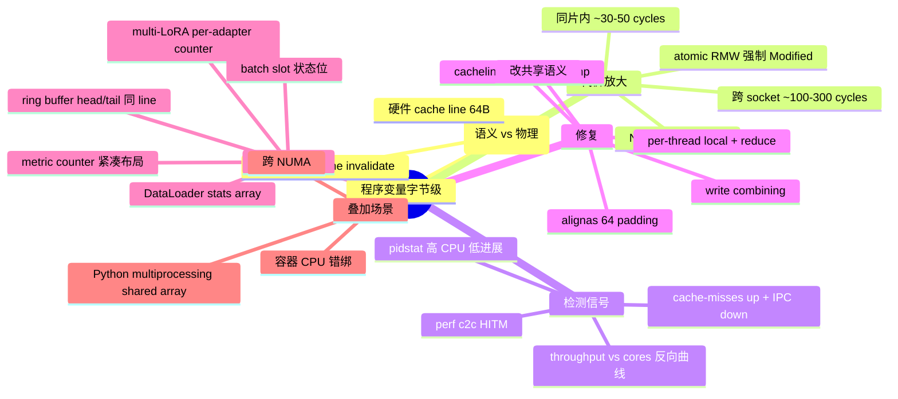
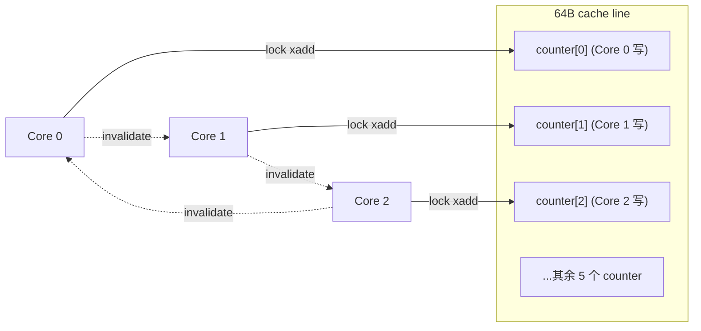
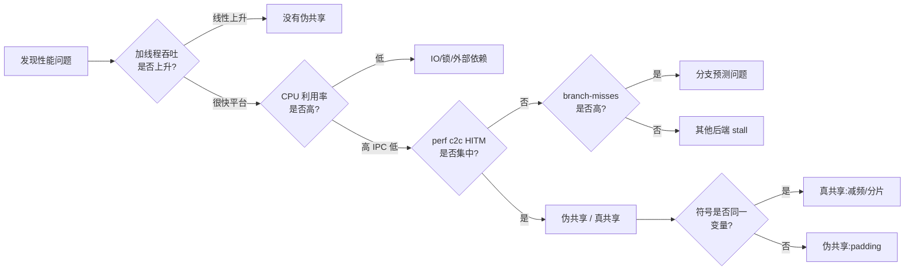
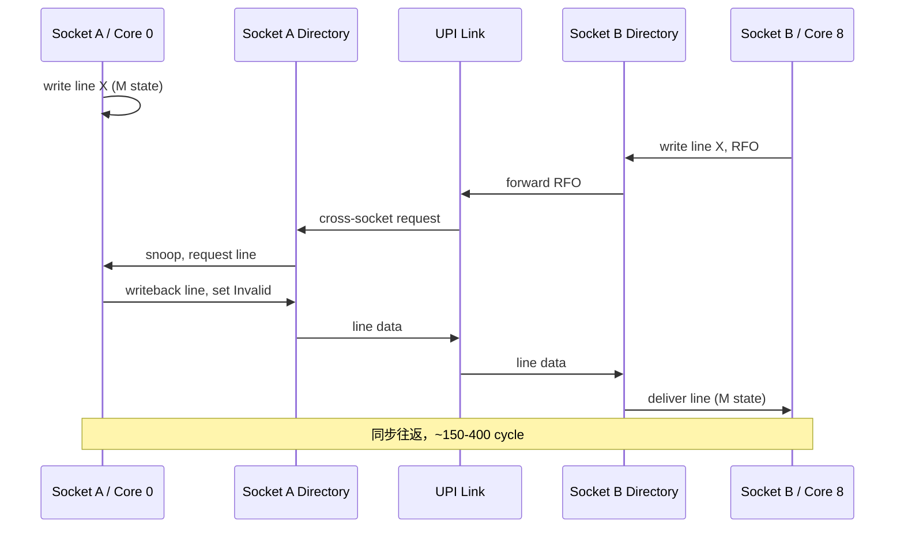
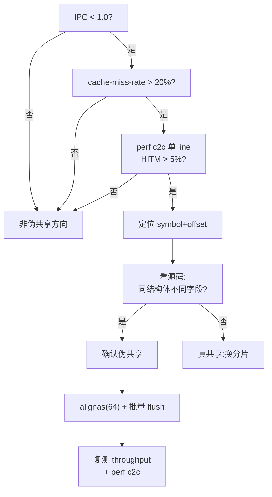

# 第 0a-7 章 · 伪共享（False Sharing）

伪共享是一类「写得对、跑得慢」的典型 Bug。代码逻辑看起来完全没有共享变量，profiler 也找不到锁竞争，但加线程不增吞吐、CPU 占用高得离谱、p99 抖动严重。它的根因在 [0a-6 MESI 一致性协议](./0a6-mesi-coherence.md) 所维护的 cache line 粒度一致性，与本章后面的 DataLoader Worker Counter 实例之间的"语义/物理粒度不一致"。本章把这个一句话能讲完的概念，展开为一条完整的工程链路：从物理机理、数据结构反例、检测方法、修复套路，到 NUMA 叠加、容器场景，最后落到 AI Infra 真实事故和一份可以贴在值班 wiki 的 SOP。

## 0a-7.1 第一性原理拆解 + 学习大纲

### 拆 — 不可化简的问题

伪共享要回答的不是"什么是 cache line"，也不是"加 padding 就好"。它要回答的不可化简问题是：当程序员关心的"共享语义"以单变量为粒度，而硬件维护一致性以 cache line（典型 64B）为粒度时，这条粒度差能在多核并行下放大成多大的真实代价，又应该如何在不破坏内存效率的前提下消除？

这条问题不可化简的原因有三层。第一，硬件不可能把一致性维护粒度做到字节级——目录开销、流量开销、tag SRAM 开销都会爆炸；64B（部分 ARM 为 128B）是芯片设计权衡的结果，不是软件能改的参数。第二，程序员不可能事先知道哪些变量会被分到哪条 cache line——结构体字段顺序、`std::vector<T>` 的连续布局、Python `array.array` 的 stride、shared memory 段的对齐方式，都会把"逻辑上独立的状态"压在同一条 line 上。第三，伪共享的代价不是常数：单核独占时为零，多核同片内时几个 cycle，跨 socket 时跳到上百 ns，叠加 NUMA 远端访问会再放大。这意味着同一段代码在 8c 开发机和 64c 双路生产机上的行为完全不同——开发环境根本测不出来。

更隐蔽的是它和 data race 不同。data race 会触发 sanitizer，atomic 写也能保证语义正确；但 atomic 不解决 cache line 在核心间反复迁移的问题——反而因为 atomic 的 RMW 必然要拿到 Modified 状态，恰好把伪共享代价放到最大。所以这是一个"程序正确、编译器无法警告、ASan/TSan 也不报"的性能 Bug，只能靠对粒度差的物理直觉 + 针对性的硬件 profiling 才能识别。

### 推 — 从这个问题如何推导出每个机制

从"硬件以 cache line 为粒度维护一致性"推出：任何写操作都必须先把整条 line 拉成 Modified 状态，远端核心持有的副本被 invalidate；从"多核高频写不同变量但同一 line"推出 line ownership 的反复迁移（cache line bouncing）；从"迁移路径经过 L3 甚至跨 socket 互连"推出代价随拓扑距离非线性放大。

从"找不出锁、找不出共享变量"推出需要新的诊断信号：传统 `perf stat` 看到的是 cache-misses 升高、IPC 下降，但无法定位到具体 line；于是 Intel 引入 HITM（Hit Modified）事件，`perf c2c` 把它聚合到地址、符号、源行级别。从"代价集中在少数 hot line"推出修复策略：要么把每个高频写者放到独立 line（padding/`alignas(64)`），要么把高频写聚合成低频写（thread-local + 周期 reduce），要么改变共享语义本身（消除"必须每次都更新全局"的假设）。

从"NUMA 让远端 line 取回成本数倍于本地"推出：NUMA 与伪共享叠加时，padding 的收益会被进一步放大；从"容器/cgroup 限制 CPU set 但不限制 line 共享"推出 pod 间也可能因 noisy neighbor 出现伪共享类问题；从"AI 训练/推理的 DataLoader、metric counter、batch slot 都是高频写小对象"推出这类 bug 在 AI 平台是高发场景，而非教科书示例。

### 绘 — 因果链路



### 导 — 读完本章你应该能回答

1. 伪共享、真共享、data race 三者在硬件层和语义层分别是什么关系？为什么 atomic 能修 data race 但不能修伪共享？
2. 64B cache line 是怎么把"我只写 8B"放大成"整条 line 在核心间反复迁移"的？跨 socket 时代价为什么再放大 5-10 倍？
3. `perf c2c` 看到 HITM 集中在某地址时，怎么从地址追到具体源行和具体结构体字段？
4. `alignas(64)`、`__cacheline_aligned_in_smp`、Rust `CachePadded`、folly `cacheline_aligned` 之间有什么区别？什么时候 padding 会变成"治病也加病"？
5. thread-local 累加 + 周期 reduce 是如何把高频写"聚合掉"的？这种修复对内存占用、读取实时性的代价是什么？
6. 为什么把 16 个 DataLoader worker 的 stats 放在 `std::vector<WorkerStats>` 里在 8c 开发机看不出问题，但在双路 64c 训练节点上吞吐反而下降？
7. 一个值班工程师在收到"加线程吞吐反降"的告警后，应该按什么顺序采集哪些指标，才能在 30 分钟内定位到伪共享而不是错怪 GPU？

### 学习 checklist

- [ ] 能口头解释"语义粒度 vs 物理粒度"这一句话，并举出至少 3 个 AI Infra 中的反例。
- [ ] 能区分真共享、伪共享、data race，并说明为什么 atomic 反而会让伪共享更糟。
- [ ] 能在不查文档的情况下写出 `perf c2c record/report` 的常用命令并解释 HITM 字段。
- [ ] 能写出一段带 `alignas(64)` + tail padding 的 C++ 结构体，并用 `static_assert` 校验大小。
- [ ] 能描述跨 socket 一致性流量的代价来源（UPI/Infinity Fabric、目录、远端 invalidate）。
- [ ] 能为多 worker 共享指标设计 thread-local + 周期 reduce 的方案，并说明 reduce 周期的选择依据。
- [ ] 能给出一份从"线程数加倍但吞吐下降"到"改对齐复测"的完整 SOP，并指出每一步的回滚条件。

### 边界、EvidenceBundle、CapacityLedger 与故障排除

**本章拥有的边界**：只处理"逻辑上独立、物理上同 cache line"导致的 false sharing，以及它和 true sharing/data race 的区分。**本章不负责**MESI 协议完整状态机（0a-6）、普通 capacity/conflict miss（0a-5）、锁算法正确性。控制路径是 worker 写字段 -> RFO -> invalidate 其他 sharer -> HITM 取回；数据路径是 cache line ownership 在 core/socket 间迁移；失败路径是 padding 过度导致容量 miss、thread-local flush 太慢导致指标陈旧、绑核掩盖而不修复代码。

**EvidenceBundle**：

```bash
perf stat -a -e cycles,instructions,cache-references,cache-misses,mem_load_l3_miss_retired.remote_hitm,mem_inst_retired.lock_loads -- sleep 30
perf c2c record -F 4000 -ag -- sleep 30
perf c2c report --stdio | head -120
```

同时做 thread-count sweep：1/2/4/8/16/32 worker 的吞吐、IPC、HITM 曲线。false sharing 的典型形状是 CPU% 升、IPC 降、吞吐过拐点反降。

**CapacityLedger / 数值模型**：

```text
line_slots = cache_line_bytes / sizeof(counter_or_stats)
flush_rate = workers * updates_per_worker_per_sec / flush_every
padding_memory_overhead = padded_size / original_size
```

决策规则：一条 64B line 放 4 个 16B stats 时，只要 2 个以上 writer 位于不同 core，就可能反复迁移；`flush_every` 至少让全局 atomic RFO 频率降 10x，指标实时性要求再决定是否提高频率；padding 后总体 hot object 不能把 LLC 容量打爆。

| 症状 | 证据 | 根因 | 动作 | Retest / 复测 |
|---|---|---|---|---|
| 加 worker 反降 | `perf c2c` 单 line HITM > 5%，offset 分散在多个字段 | false sharing | `alignas(64/128)`、tail padding、CachePadded | HITM 降到原值 <10%，吞吐曲线恢复单调 |
| counter padding 后仍慢 | HITM 指向同一 offset/同一变量 | true sharing | per-thread/per-socket shard + reduce | HITM 频率降，读侧接受 reduce 延迟 |
| padding 后 cache miss 升高 | LLC miss rate 升，HITM 降 | padding 让 working set 溢出 LLC | 只 padding 高频写对象，冷字段拆出 | HITM 低且 LLC miss 不高于基线 10% |
| 只在生产双路复现 | Remote HITM 高，开发机无异常 | NUMA/跨 socket 放大 | 生产同拓扑压测、绑核、first-touch 本地化 | Remote HITM 占比下降，p99 收敛 |

## 0a-7.2 伪共享的物理机理：cache line 粒度 vs 程序员的语义粒度

回到硬件本身。一条 64B cache line 在 MESI 协议下只能整体处于 M/E/S/I 之一。当 Core 0 要写这条 line 上的任何 1 bit，它都必须先把状态升级到 Modified；升级动作要求广播 invalidate，让其他持有 Shared 副本的核心把自己的副本标记为 Invalid。其他核心下一次访问这条 line（哪怕只是读不同字节）时，必须从持有 Modified 的核心把整条 line 取回（cache-to-cache transfer），转入 Shared 或 Modified 状态。

这个机制对"真共享"是合理的：多个核心确实在协作维护同一份数据。但对"伪共享"来说就是纯粹的浪费——两个核心写的是 line 上互不相干的两个 8B counter，硬件却必须把整条 line 在它们之间反复搬。每次搬运的代价：

| 拓扑距离 | 典型代价（cycles） | 折算 ns（@3GHz） | 主要来源 |
|---|---:|---:|---|
| 同核 L1 | ~4 | ~1.3 | 命中本核 L1，零迁移 |
| 同 socket 跨核 L2/L3 | ~30-80 | ~10-26 | L3 转发 + 目录查询 |
| 跨 socket | ~150-400 | ~50-130 | UPI/IF 互连 + 远端 cache 查询 |
| 跨 NUMA + 远端被驱逐 | ~300-800+ | ~100-260+ | 互连 + 可能回 DRAM |

注意：原子 RMW（如 `lock xadd`、`compare_exchange`）必然把 line 拉到 Modified 状态。所以 `std::atomic<uint64_t>` 数组的伪共享，等价于"每次自增都强制 cache line ownership 转移"——是最坏情况。普通非原子写在某些 store buffer + invalidation queue 优化下还能批量化，atomic 则没有这个优化空间。



> **关键直觉**：硬件不知道"counter[0] 和 counter[1] 是不同变量"，它只看到"同一条 line 上的字节被多个核心写"。语义层的"独立"在物理层是"共享"——这就是 false sharing 的"false"。

工程边界：cache line 大小不是可移植的常数。x86 通常 64B，部分 ARM（如 Apple M1/M2 P-core）是 128B，IBM POWER 是 128B。`std::hardware_destructive_interference_size` 在 C++17 里给出了平台值，但 GCC 长期对此有 ABI 警告；最稳妥的写法仍是手写 `alignas(64)` 配合编译期 `static_assert(sizeof(T) % 64 == 0)`。

## 0a-7.3 真共享 vs 伪共享 vs data race：三个常被混淆的概念

值班和 code review 时，这三个概念经常被混着用。它们的区别在硬件层、语义层、修复手段三个维度上都不同：

| 维度 | 真共享（True Sharing） | 伪共享（False Sharing） | Data Race |
|---|---|---|---|
| 物理层 | 多核读写同一变量同一 line | 多核读写不同变量、同一 line | 多核无序读写同一变量 |
| 语义层 | 程序确实需要共享状态 | 程序不需要共享，是布局意外 | 程序对顺序/原子性有错误假设 |
| 编译器/静态分析 | 通常合理，不会警告 | 不会警告 | TSan/clang -fsanitize=thread 可检 |
| 性能现象 | line bouncing，本身是设计代价 | line bouncing，纯浪费 | 偶发数据损坏，未必慢 |
| 正确性 | 正确（前提是同步对） | 正确 | 错误 |
| 主要修复 | 减少共享频率、批处理、分片 | padding / 对齐 / per-thread 累加 | 加锁 / atomic / memory order |
| atomic 的作用 | 必要 | 无效甚至更糟 | 必要 |

> **常见混淆**：把伪共享当 data race 修——给紧凑布局的 counter 数组加 `std::atomic`，结果 throughput 不升反降，因为 atomic 让伪共享代价从"批量 invalidate"变成"每次必 Modified 转移"。正确做法是先做 padding 再决定要不要 atomic。

> **另一种混淆**：把真共享当伪共享修——给一个 ref count 加 padding 没意义，因为多核就是要竞争同一个 64-bit 计数器；这种情况要么用分片计数（per-CPU counter + 周期 sum），要么减少 ref count 操作频率，padding 不解决问题。

## 0a-7.4 经典数据结构反例：thread-local stats、ring buffer、原子计数器

下面三类结构在 AI Infra 代码里出现频率最高，每一类都有"看起来很合理"的写法实际上构成伪共享。

### 反例 1：thread-local stats 写共享数组

```cpp
struct WorkerStats {
  uint64_t samples;
  uint64_t bytes;
  uint64_t errors;
};
std::vector<WorkerStats> stats(num_workers);  // 每个 24B，连续布局
// worker i 的循环中：
stats[i].samples++;  // 看似 thread-local，实际多个 worker 的 stats 落同一 line
```

24B 对象 → 一条 64B line 能装 2-3 个 worker 的 stats。8 worker 时分布在 3-4 条 line，16 worker 时分布在 6-8 条 line。每个 worker 每个 sample 都写自己的 `samples`，触发整条 line invalidate 邻居。

### 反例 2：ring buffer 的 head 和 tail 在同一 line

```cpp
struct RingBuffer {
  std::atomic<size_t> head;  // 生产者写
  std::atomic<size_t> tail;  // 消费者写
  T* data;
};
```

`head` 和 `tail` 各 8B，紧挨着放，必然在同一 64B line。生产者写 head 让消费者持有的 line 失效；消费者写 tail 又让生产者的 line 失效。一条无锁 SPSC queue 的所有性能优势全部被这两个字段抵消。Linux kernel 的 `kfifo`、folly 的 `ProducerConsumerQueue` 都显式给 head 和 tail 各自 padding 到独立 line。

### 反例 3：原子计数器分布

```cpp
std::array<std::atomic<uint64_t>, 64> per_cpu_counters;  // 每个 8B
```

64 个 counter × 8B = 512B，正好占 8 条 line。如果意图是"每个 CPU 写自己的索引"，但调度让多个线程映射到相邻索引，就会出现"以为分片了实际还在同一 line"。典型修复是 `std::array<CachePadded<std::atomic<uint64_t>>, 64>`，每个 counter 独占一条 line，总占用 4KB——内存换吞吐。

| 反例 | 表面意图 | 实际后果 | 最小修复 |
|---|---|---|---|
| stats 数组 | 每 worker 一份独立计数 | 多 worker 共享 line | 结构体 `alignas(64)` + 尾部 padding |
| ring buffer head/tail | 无锁 SPSC | 生产/消费侧互相 invalidate | head 和 tail 各 padding 到独立 line |
| per-CPU 原子计数 | 分片消除竞争 | 相邻索引共享 line | `CachePadded<atomic<T>>` |
| metric counter map | 紧凑指标聚合 | hot key 与 cold key 同 line | hot key 独立 padding，cold key 紧凑 |
| batch slot 状态位 | bitmap 节省内存 | 多 worker 写不同 bit 同 line | 状态位扩成 cache line 对齐结构 |

## 0a-7.5 检测：perf c2c、HITM 信号、atomic-throughput vs cores 曲线异常

伪共享没有专属的"是/否"指标，必须从多个信号交叉确认。最直接的硬件信号是 HITM（Hit Modified）——本核访问 line 时命中，但发现该 line 在远端核心处于 Modified 状态，必须先把数据从远端取回。HITM 数量大且集中在少数地址，几乎一定是真/伪共享。

### 工具 1：`perf c2c`（cache-to-cache 分析）

```bash
# 录制 30 秒，含调用栈
perf c2c record -F 4000 -ag -- sleep 30
# 报告：按 HITM 排序，关注 LLC Misses to Remote Cache (HITM)
perf c2c report --stdio | less
# 关键列：
#   Total records / Local-Hitm / Remote-Hitm / data address / cacheline / symbol / offset
```

报告里要看的字段：

- `Cacheline`：物理 cache line 地址，同一 line 上多个 offset 都有 HITM 就是伪共享强信号。
- `Tot-Hitm` 占比：单条 line 占全机 HITM 5%+ 就值得深挖。
- `Symbol + Offset`：定位到具体结构体字段；offset 在 0-63 内分布说明同 line 多字段竞争。
- `Node`：跨 NUMA node 的 HITM 比同 node 贵 3-10 倍。

### 工具 2：`perf stat` 的间接信号

```bash
perf stat -a -e cycles,instructions,cache-references,cache-misses,\
mem_load_l3_miss_retired.remote_hitm,\
mem_inst_retired.lock_loads -- sleep 30
```

看：`remote_hitm` 数量（直接信号）、`lock_loads`（atomic RMW 频率）、`cache-misses / cache-references`（伪共享时通常 > 20%）、IPC（伪共享下常 < 1.0）。

### 工具 3：throughput vs cores 曲线

最便宜的"不打 perf 也能看"的信号：固定 workload，把并发线程数从 1 扫到 32 或 64，画 throughput 曲线。



| 检测信号 | 来源 | 伪共享典型值 | 解读 |
|---|---|---|---|
| Remote HITM | `perf c2c` | 单 line > 全机 5% | 强信号，定位到结构体 |
| cache-miss-rate | `perf stat` | > 20% 且 IPC < 1.0 | 弱信号，需配合 c2c |
| `lock_loads` | `perf stat` | 与 sample 数同数量级 | atomic 热点，常伴随伪共享 |
| throughput vs cores | benchmark | N 线程后反向下降 | 强信号，最容易复现 |
| pidstat CPU% | `pidstat -t` | 高 CPU + 低 progress | 不直接，需排除其他原因 |
| `numastat` | NUMA 工具 | remote 访问比例高 | 叠加 NUMA 时放大 |

## 0a-7.6 修复：`alignas(64)` padding、cacheline_aligned_in_smp、按 cache line 切分

定位到 hot line 后，最小修复有三种思路。

### 思路 1：结构体 `alignas` + 尾部 padding（C++）

Before：

```cpp
struct WorkerStats {
  std::atomic<uint64_t> samples;   // 8B
  std::atomic<uint64_t> bytes;     // 8B
};                                  // sizeof = 16，4 个落同一 line
std::vector<WorkerStats> stats(N);
```

After：

```cpp
struct alignas(64) WorkerStats {
  std::atomic<uint64_t> samples;
  std::atomic<uint64_t> bytes;
  char _pad[64 - 2 * sizeof(std::atomic<uint64_t>)];
};
static_assert(sizeof(WorkerStats) == 64);
static_assert(alignof(WorkerStats) == 64);
std::vector<WorkerStats> stats(N);  // 每个独占 64B
```

注意：`std::vector<T>` 的分配器在 C++17 之前不保证 over-aligned 类型对齐；C++17 起 `std::vector` 会用对齐感知的 allocator。要在更老的代码里用，要么用 `aligned_alloc` 自己管，要么用 `boost::alignment::aligned_allocator`。

### 思路 2：Linux kernel `____cacheline_aligned_in_smp`

```c
struct worker_stats {
    atomic64_t samples;
    atomic64_t bytes;
} ____cacheline_aligned_in_smp;
```

`____cacheline_aligned_in_smp` 在 SMP 内核下展开为 `__attribute__((aligned(SMP_CACHE_BYTES)))`，UP 内核下为 no-op，省单核场景的内存。kernel 的 per-CPU 变量天然解决伪共享（每个 CPU 一份），但跨 CPU 共享的统计结构仍要显式对齐。

### 思路 3：按 cache line 切分布局

不改结构体，改容器。Before 用 `std::vector<Counter>` 紧凑数组，After 用"二级数组"：每个 worker 一个独立分配的 64B-aligned 块。Rust 用 `crossbeam_utils::CachePadded<T>`：

```rust
use crossbeam_utils::CachePadded;
let counters: Vec<CachePadded<AtomicU64>> = (0..n).map(|_| CachePadded::new(AtomicU64::new(0))).collect();
```

| 平台/语言 | 推荐写法 | 备注 |
|---|---|---|
| C++17+ | `alignas(64)` + 尾部 `char[]` padding + `static_assert` | `hardware_destructive_interference_size` 有 ABI 警告 |
| Linux kernel | `____cacheline_aligned_in_smp` 或 `DEFINE_PER_CPU` | per-CPU 是更优解 |
| Rust | `crossbeam_utils::CachePadded<T>` | 自动处理平台差异 |
| Java | `@Contended`（JDK 8+，需 `-XX:-RestrictContended`） | JVM 自动 padding |
| Go | 手动 padding 字段，或 `runtime.LockOSThread` + per-G 数据 | 没有标准 attribute |
| Python | 不要把高频写指标放在 `multiprocessing.Array` 紧凑布局；改用 `Manager` 对象或独立 `Value` | GIL 让单进程内伪共享不显著，多进程才严重 |

> **工程边界**：padding 把 16B 撑成 64B 是 4 倍内存放大；如果你有 100 万个对象都加 padding，会从 16MB 变 64MB。padding 只对"高频写、跨核竞争"的小对象划算；对只读、低频写、大对象（已经远超 line）都不要无脑加。

## 0a-7.7 高级修复：write combining、批量更新、thread-local 累加 + 周期 reduce

padding 解决的是"同 line 不同核"，但有些场景同 line 也只有一个核写，伪共享不是主因——主因是写本身太频繁。这时要从"减少写"的方向修。

### 手法 1：thread-local 累加 + 周期 reduce

```cpp
thread_local uint64_t local_samples = 0;
thread_local uint64_t local_bytes = 0;

void on_sample(size_t bytes) {
    ++local_samples;
    local_bytes += bytes;
    if ((local_samples & 0x3F) == 0) {  // 每 64 次 flush 一次
        global_stats.samples.fetch_add(64, std::memory_order_relaxed);
        global_stats.bytes.fetch_add(local_bytes, std::memory_order_relaxed);
        local_bytes = 0;
    }
}
```

代价：监控指标延迟最多 64 个 sample；线程退出时要 flush 残余。收益：全局 atomic 写频率降低 64 倍，cache line 迁移频率随之下降。reduce 周期的选择依据：监控的可观测延迟容忍度 vs 写竞争代价；通常 32-256 之间，配合 metric scrape interval 选。

### 手法 2：write combining buffer

把多个相邻字段的小写合并成一次写。例如多个 status flag 改成一个 `uint64_t` bitmap，一次原子 OR 写入。CPU 的 store buffer 本身就有 write combining，但前提是写 pattern 友好（同一 line、连续地址、无 fence）。AI Infra 中的 metric exporter、log shipper 都可以用 ring buffer + 批量 commit 的形式而不是逐条原子写。

### 手法 3：分片计数（sharded counter）

```cpp
struct ShardedCounter {
    static constexpr size_t N_SHARDS = 64;
    alignas(64) std::atomic<uint64_t> shards[N_SHARDS];

    void inc() {
        size_t idx = current_cpu() & (N_SHARDS - 1);
        shards[idx].fetch_add(1, std::memory_order_relaxed);
    }
    uint64_t sum() const {
        uint64_t s = 0;
        for (auto& sh : shards) s += sh.load(std::memory_order_relaxed);
        return s;
    }
};
```

读 O(N)、写 O(1)；适合写多读少的场景（监控指标、请求计数）。Linux kernel 的 `percpu_counter`、folly 的 `QuantileEstimator` 都是这个套路。

### 手法 4：改变共享语义

最彻底的修复是问"为什么必须共享"。例如多 worker 的进度统计是否一定要写到全局结构？能不能让每个 worker 把自己的进度写到本地文件/独立 metric stream，由聚合器拉取？AI Infra 中的 distributed training 的 step counter、loss 累加，许多都不需要每步全局可见，只需要 epoch 边界 reduce。

## 0a-7.8 NUMA 与伪共享叠加：跨 socket coherence 让伪共享代价放大 5-10x

NUMA 系统下，每个 socket 有自己的 memory controller 和本地 DRAM；跨 socket 访问要走 UPI（Intel）或 Infinity Fabric（AMD），延迟 2-3x，带宽下降。伪共享叠加 NUMA 的代价机制：

1. line 在 socket A 的 Core 0 处于 Modified；
2. socket B 的 Core 8 要写同 line，发起 RFO（Read For Ownership）；
3. 请求经 UPI 到 socket A，socket A 的目录/snoop filter 找到 Core 0；
4. Core 0 把 line 数据通过 UPI 回传给 socket B，自己降级为 Invalid；
5. Core 8 拿到 line 升级为 Modified；
6. 下次 Core 0 再写时，整个流程反向重复。



| 场景 | 单次 line 迁移代价 | 1 万次/秒的总代价 |
|---|---:|---:|
| 同核 | ~4 cycles | 几乎为零 |
| 同 socket 跨核 | ~50 cycles | ~0.17 ms/s（可忽略） |
| 跨 socket | ~250 cycles | ~0.83 ms/s（开始可见） |
| 跨 socket + 远端 line evicted | ~600 cycles | ~2.0 ms/s（明显） |

把"1 万次/秒"换成 DataLoader 真实场景的"1 亿次/秒"（16 worker × 千万 sample/s × 几个 counter），跨 socket 伪共享能吃掉数百毫秒到数秒的 wall time，足以让 GPU 周期性 idle。

修复优先级：
1. 先 padding（消除伪共享本身）；
2. 再 NUMA 亲和（`numactl --cpunodebind=0 --membind=0` 或 `taskset` 把 worker 钉到同 socket）；
3. 最后考虑双副本（每个 socket 一份本地结构，跨 socket 周期同步）。

## 0a-7.9 容器/cgroup 场景：CPU pinning 错误也能制造意外的伪共享

容器化让伪共享多了一个隐藏入口：cgroup `cpuset` 错配。常见错误：

- **错误 1：CPU set 跨 socket 但内存只绑一个 node**。pod 的 worker 运行在 socket A 和 socket B 的核上，但 `mems_allowed` 只允许 node 0；socket B 的 worker 每次访问 stats（位于 node 0）都跨 NUMA，叠加伪共享代价爆炸。
- **错误 2：CPU set 不连续**。例如 K8s 给 pod 分配了 0,1,2,3,32,33,34,35（跨 socket），但代码假设 `worker_id` 直接当 CPU index，padding 也没用——因为不同 worker 的 stats 仍然在同 socket 的不同核上构成伪共享，且部分 worker 跨 socket。
- **错误 3：CPU 限制是分数**（如 `cpus: "2.5"`），调度器在多个核间漂移；线程上一秒在 core 4，下一秒在 core 12，cache 反复 cold start，伪共享 + cache cold 双重打击。
- **错误 4：noisy neighbor**。同一物理机上的另一个 pod 占用了相邻核，间接竞争 L3；虽然不直接造成伪共享，但放大了已有伪共享的代价。

排查清单：

```bash
# 看 pod 的 cpuset
cat /sys/fs/cgroup/cpuset.cpus
cat /sys/fs/cgroup/cpuset.mems
# 确认 NUMA 分布
numactl --hardware
# 看进程实际跑在哪些核
ps -eLo pid,tid,psr,comm | grep <process>
# 看 NUMA 内存分配
numastat -p <pid>
```

| 容器配置错误 | 对伪共享的影响 | 修复 |
|---|---|---|
| cpuset 跨 socket | 伪共享代价 5-10x 放大 | 限制单 socket，或显式 NUMA-aware 代码 |
| mems 与 cpus 不一致 | 远端 DRAM 访问叠加 | `cpuset.mems` 与 `cpuset.cpus` 同 node |
| CPU 分数限制 | 漂移导致 cache cold | 用整数 CPU + `cpuManagerPolicy: static` |
| Hyper-Thread 同核分给不同 pod | 伪共享在 SMT 内更严重 | `cpuset` 按物理核（成对）分配 |

## 0a-7.10 AI Infra 视角：DataLoader worker、metric counter、batch slot 真实事故

下面三个事故来自 AI Infra 工程经验，都是把上面的机理摁到具体场景的产物。

### 事故 1：DataLoader worker stats 数组（即 [0a-8 Worked Example](./0a8-cpu-worked-example.md)）

8 worker 6400 samples/s，16 worker 反降到 5300。根因：`std::vector<WorkerStats>` 紧凑布局，4 个 worker 同 line。修复：`alignas(64)` + 每 64 sample 批量 flush + NUMA 亲和。最终 16 worker 7350 samples/s。

### 事故 2：推理服务 metric counter map

某 LLM 推理服务用一个全局 `std::array<std::atomic<uint64_t>, 256>` 记录每个 op type 的调用次数。op id 0-255 紧凑布局，常用的 0-7（matmul、softmax、layernorm 等）落同一线 line。多线程推理时，QPS 上不去，p99 抖动严重。`perf c2c` 直接定位到该数组首地址。修复：把高频 op 改成 `CachePadded<atomic<uint64_t>>`，低频 op 保留紧凑。QPS +18%，p99 -22%。

### 事故 3：Multi-LoRA 推理 per-adapter request counter

支持 32 个 LoRA adapter 的推理服务，每个 adapter 有独立 `request_count` 和 `token_count`。用 `struct AdapterStats { atomic<uint64_t> req; atomic<uint64_t> tok; };` 紧凑数组存。开 32 路并发时吞吐只比 8 路高 1.5x（理想应近 4x）。`perf c2c` 报告 `AdapterStats` 数组 HITM 占全机 31%。修复：`alignas(64)` + per-thread 累加 64 次 flush 一次。throughput 提升约 30%（详见 [§0a-7.12](#0a-712-worked-example)）。

| 事故 | 共享数据 | 触发条件 | 修复 | 收益 |
|---|---|---|---|---|
| DataLoader stats | `WorkerStats[]` | worker 数 > line 容量 | padding + 批量 flush + NUMA | +38% throughput |
| metric counter map | `atomic<u64>[256]` | 高频 op 紧邻 | 热 key padding | +18% QPS, -22% p99 |
| Multi-LoRA counter | `AdapterStats[]` | 多路并发推理 | padding + thread-local | +30% throughput |

## 0a-7.11 工程操作 SOP：从"线程数加倍但吞吐下降"到"perf c2c 找 HITM line 改对齐"

值班可贴的一页 SOP：

### 触发条件

满足任一即进入此 SOP：
- 加 worker / 加并发后吞吐不升反降；
- CPU 利用率高（> 80% 全核），但业务进展慢；
- p99 在并发提升后显著恶化，且无 IO/网络异常；
- GPU utilization 周期性 < 70%，但磁盘和网络都未饱和。

### 采集（30 分钟内完成）

```bash
# 1. 排除 GPU 侧
nvidia-smi dmon -s pucm -c 60 > nvidia.txt &
# 2. CPU 总览
perf stat -a -e cycles,instructions,cache-references,cache-misses,branches,branch-misses sleep 30 2> stat.txt
# 3. 线程分布
pidstat -t -p $(pgrep -f <process>) 1 30 > pidstat.txt &
# 4. 关键：c2c
perf c2c record -F 4000 -ag -o c2c.data -- sleep 30
perf c2c report -i c2c.data --stdio > c2c.txt
# 5. NUMA
numastat -p $(pgrep -f <process>) > numa.txt
```

### 判断（依次）



### 修复 + 验证

1. 找到 hot 结构体，加 `alignas(64)` 和尾部 padding，加 `static_assert(sizeof(T) == 64)`。
2. 如果是高频原子写，加 thread-local 累加（周期 32-256）。
3. 如果跨 socket，叠加 `numactl --cpunodebind=N --membind=N`。
4. 复测：throughput vs cores 曲线、`perf c2c` HITM 应消失或降到原值 < 10%、IPC 回升至 > 1.5。
5. 把修改和复测数据写入 PR description，避免后续重构者无意中删 padding。

### 回滚条件

- 修改后内存占用增长 > 100MB 且 throughput 提升 < 10% → 回滚 padding，改用 thread-local 方案；
- 修改后单线程性能下降 → 检查是否引入了不必要的 atomic 或 fence；
- 修改后无变化 → 重新 c2c，可能 hot line 不止一个，或瓶颈已转移。

## 0a-7.12 Worked Example

**场景**：Multi-LoRA inference server，base model 7B，32 个动态加载的 LoRA adapter，每路请求随机命中某个 adapter。需要按 adapter 上报 `request_count`、`token_count`、`latency_sum` 用于 billing 和监控。32 路并发推理。

**初始实现**：

```cpp
struct AdapterStats {
    std::atomic<uint64_t> req_count;
    std::atomic<uint64_t> tok_count;
    std::atomic<uint64_t> latency_sum_ns;
};
std::array<AdapterStats, 32> adapter_stats;  // 32 * 24B = 768B = 12 lines
```

每个 `AdapterStats` 24B，2-3 个 adapter 落同一 line。32 路并发请求随机命中 adapter，每完成一个 token 都更新 3 个 atomic。

**现象**：

| 指标 | 1 并发 | 8 并发 | 16 并发 | 32 并发 |
|---|---:|---:|---:|---:|
| Throughput (tok/s) | 80 | 580 | 920 | 1180 |
| 理想线性 | 80 | 640 | 1280 | 2560 |
| 效率 | 100% | 91% | 72% | 46% |

32 并发的效率掉到 46%，和理想差 1380 tok/s。`perf c2c` 报告：`adapter_stats` 数组首地址周围 12 条 line 的 HITM 占全机 31%；其中前 4 条 line 单条 HITM > 5%。

**修复**：

```cpp
struct alignas(64) AdapterStats {
    std::atomic<uint64_t> req_count;
    std::atomic<uint64_t> tok_count;
    std::atomic<uint64_t> latency_sum_ns;
    char _pad[64 - 3 * sizeof(std::atomic<uint64_t>)];
};
static_assert(sizeof(AdapterStats) == 64);
std::array<AdapterStats, 32> adapter_stats;  // 32 * 64B = 2KB = 32 lines

// 每个推理线程本地累加，每 64 token flush 一次
thread_local std::array<LocalStats, 32> local_stats;
void on_token(int adapter_id, uint64_t latency_ns) {
    auto& l = local_stats[adapter_id];
    ++l.tok;
    l.lat_sum += latency_ns;
    if ((l.tok & 0x3F) == 0) {
        adapter_stats[adapter_id].tok_count.fetch_add(64, std::memory_order_relaxed);
        adapter_stats[adapter_id].latency_sum_ns.fetch_add(l.lat_sum, std::memory_order_relaxed);
        l.lat_sum = 0;
    }
}
```

**复测**：

| 指标 | 1 并发 | 8 并发 | 16 并发 | 32 并发 |
|---|---:|---:|---:|---:|
| Throughput (tok/s) | 80 | 620 | 1180 | 1540 |
| 效率 | 100% | 97% | 92% | 60% |
| 相对原始提升 | 0% | +7% | +28% | +30.5% |

32 并发 throughput 提升 30.5%，p99 latency 从 88ms 降到 71ms。`perf c2c` 报告 `adapter_stats` HITM 占比从 31% 降到 3%。内存占用：从 768B 涨到 2KB，可忽略。监控延迟：最多滞后 64 token（在 80 tok/s/路下约 0.8s），监控接受。

**关键复盘**：原始代码完全正确，没有 race；profiler 看 CPU 时报告的也只是"atomic 操作热"。如果不知道伪共享，会试图用更宽的 atomic、更复杂的无锁数据结构、甚至 sharding，反而越改越复杂。识别出"语义粒度（单个 adapter）vs 物理粒度（cache line）"这一层不匹配后，最小修复就是 `alignas(64)` + 一行 thread-local 累加。

## 练习

### 练习 0a-7-1（基础）：cache line 容量计算

某 64B cache line，要存放 `struct Stat { uint32_t a; uint64_t b; uint16_t c; };`。计算结构体实际大小（含 padding）和一条 line 能装几个 Stat。如果 4 个线程各操作连续数组中的一个 Stat，是否构成伪共享？

### 练习 0a-7-2（基础）：真共享 vs 伪共享判别

判断下列每种情况属于真共享、伪共享、还是 data race：
- (a) 8 个线程同时 `++` 一个全局 `std::atomic<int>` ref count；
- (b) 8 个线程各 `++` 数组 `int counts[8]` 不同下标，无 atomic；
- (c) 8 个线程各 `++` 数组 `std::atomic<int> counts[8]` 不同下标；
- (d) 1 个生产者写 `head`，1 个消费者写 `tail`，head 和 tail 紧邻。

### 练习 0a-7-3（基础）：HITM 阈值

`perf c2c` 报告显示某 line 的 Local-HITM 占全机 8%，Remote-HITM 占 12%。该 line 上有 3 个不同 offset（0, 16, 40）出现 HITM，对应的 symbol 都是 `WorkerStats::*`。给出你的初步诊断和接下来 3 步动作。

### 练习 0a-7-4（进阶）：padding vs thread-local 选型

设计一个 multi-tenant 推理服务，要为 1000 个 tenant 各维护 `request_count`、`error_count`、`bytes`。访问模式：写多读少，写频率 ~10 万次/秒（所有 tenant 总和），读频率 ~1 次/秒（监控）。给出至少两种实现方案（一种以 padding 为主、一种以 thread-local 为主），比较内存、吞吐、监控延迟。

### 练习 0a-7-5（进阶）：NUMA 叠加

一台双路 64c 机器（每路 32c，NUMA node 0 / 1）。某服务把 16 个 worker 平均分布在两个 socket。如果 worker stats 数组存在跨 socket 伪共享，估算单次 line 迁移代价（参考 §0a-7.8 表）。如果每秒发生 5 万次迁移，估算总 wall time 浪费。

### 练习 0a-7-6（进阶）：Ring buffer head/tail padding

为一个 SPSC（single-producer single-consumer）lock-free ring buffer 设计内存布局，要求 head 和 tail 不能在同一 cache line。给出 C++ 结构体定义并用 `static_assert` 校验。

### 练习 0a-7-7（进阶）：检测脚本

写一段脚本（伪代码即可），自动从 `perf c2c report --stdio` 输出中提取 HITM 占比 > 5% 的 cache line，并打印出对应符号和源行。说明每一步用到哪些 perf 字段。

### 练习 0a-7-8（设计）：DataLoader 重构

某训练代码 16 worker 时吞吐 80% 的理想值。`perf c2c` 显示 `DataLoaderStats` 数组 HITM 占 22%。给出一个完整的修复方案：包括结构体改造、批量 flush 策略、NUMA 亲和、监控对齐、回滚条件。代码不需要全写，但要给出关键片段和复测指标。

### 练习 0a-7-9（设计）：容器内伪共享排查 SOP

K8s 集群中某个 pod 的 throughput 在节点 A 上是节点 B 上的 60%。你怀疑是 cpuset 配置 + 伪共享叠加。设计一个排查步骤清单（不超过 10 步），覆盖 cgroup、NUMA、perf c2c、对比节点拓扑等。

### 练习 0a-7-10（设计）：multi-LoRA counter 完整实现

实现 §0a-7.12 的完整 multi-LoRA counter：
- 支持动态注册/注销 adapter；
- 写路径无锁、cache-line aligned；
- 监控读路径 1Hz，要求一致性快照；
- 给出测试方法证明无伪共享。

## 深度参考阅读

1. Ulrich Drepper, *What Every Programmer Should Know About Memory*，§3.3 / §6.3 是伪共享和 cache coherence 的经典讲解。
2. Brendan Gregg, *Systems Performance*，第 6 章 CPU 与第 7 章 Memory，重点看 PMC 和 c2c 章节。
3. Intel, *Intel 64 and IA-32 Architectures Optimization Reference Manual*，搜索 "false sharing" 和 "HITM"。
4. AMD, *Software Optimization Guide for AMD EPYC Processors*，关于 Infinity Fabric 一致性流量的章节。
5. Linux kernel `Documentation/core-api/cachetlb.rst`、`include/linux/cache.h`：`____cacheline_aligned_in_smp` 和 per-CPU 变量实现。
6. Linux `perf` 文档：`perf c2c`、`perf mem`、`tools/perf/Documentation/perf-c2c.txt`。
7. Folly `folly/concurrency/CacheLocality.h`、`folly/synchronization/Hazptr.h`：工业级 padding 和分片实现。
8. Rust `crossbeam_utils::CachePadded`：跨平台 cache line padding。
9. Java `@Contended` 注解与 JEP 142：JVM 层伪共享缓解。
10. Martin Thompson, *Mechanical Sympathy* 系列博客与 LMAX Disruptor 源码：高频交易场景的 false sharing 处理范式。
11. PyTorch `torch/csrc/distributed/c10d/` 和 vLLM `vllm/engine/` 中的 metric/counter 实现，作为 AI Infra 真实代码的阅读样本。
12. `perf c2c: A new tool for false sharing detection`（Joe Mario，Red Hat 博客）：`perf c2c` 字段的权威解读。
