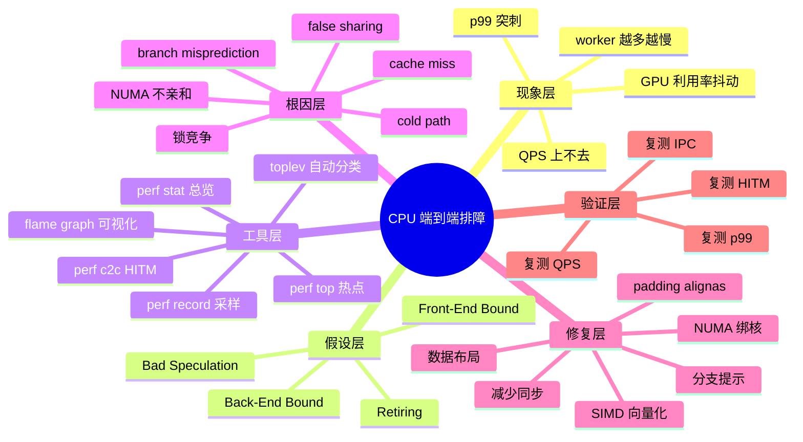
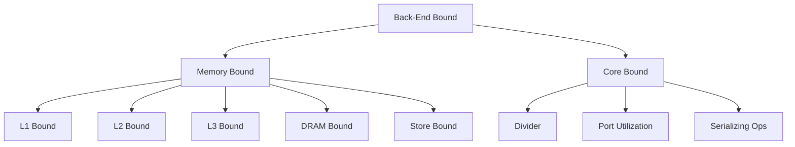
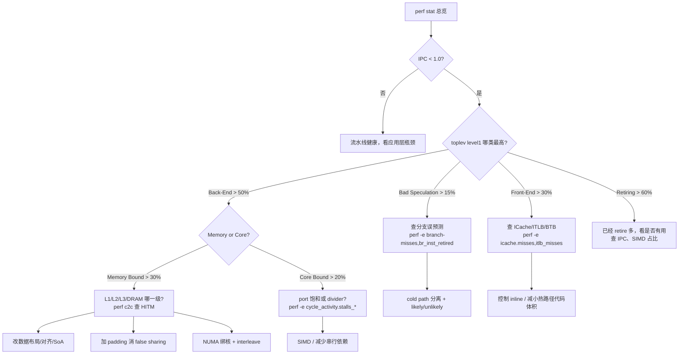
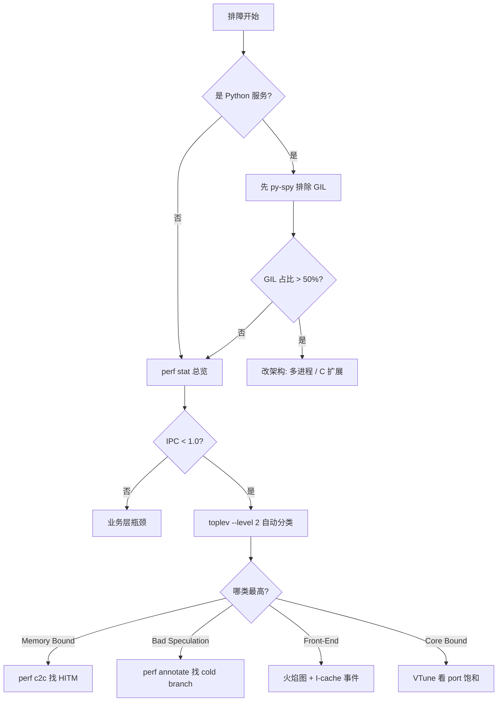
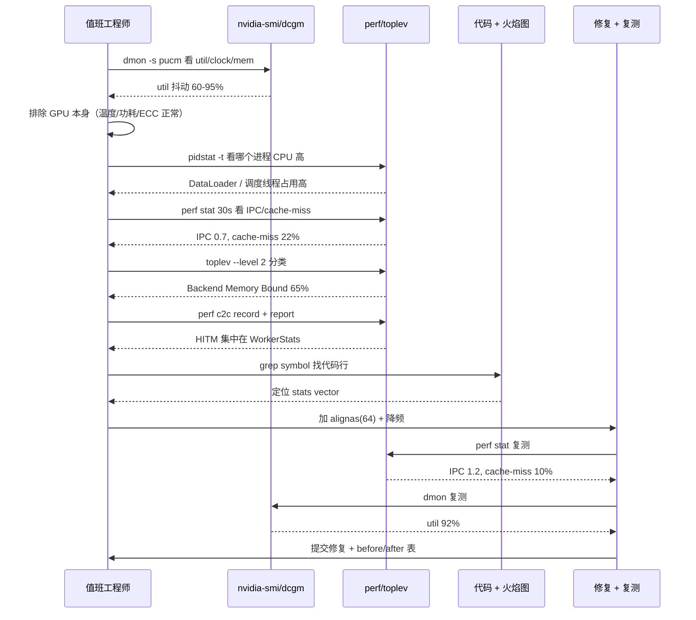

# 第 0a-8 章 · 综合 Worked Example：CPU 微架构端到端排障

本章不再讲新机制，而是把 [0a-1 流水线](./0a1-pipeline.md)、[0a-2 OoO](./0a2-out-of-order-execution.md)、[0a-3 分支预测](./0a3-branch-prediction.md)、[0a-4 SIMD](./0a4-simd.md)、[0a-5 Cache](./0a5-cache-hierarchy.md)、[0a-6 MESI](./0a6-mesi-coherence.md) 与 [0a-7 伪共享](./0a7-false-sharing.md) 这 7 节学到的机制，串成 3 个端到端排障剧本，并提炼 Top-Down 方法、工具栈对照、SOP、反模式、综合 checklist。这是 Part 0 的"实战压轴"。

## 0a-8.1 第一性原理拆解 + 学习大纲

### 拆 — 不可化简的问题

排障的不可化简问题不是"会用 perf"，而是"如何把几十个 CPU performance counter 翻译成 1-2 个根因假设并用最小代价验证它"。一台现代服务器 CPU 暴露的 PMU 事件数以百计：cycles、instructions、branches、branch-misses、L1/L2/L3 各级 references 与 misses、DTLB/ITLB miss、port utilization、uops_dispatched 各端口、HITM、HIT、frontend stall、backend stall、bad speculation、resource stall……每个都"看起来重要"。如果工程师面对这些数据"看到 cache miss 就改数据布局，看到 branch miss 就加 likely/unlikely"，结果常常是改了三天没效果，因为没有先回答一个更基本的问题：当前最严重的瓶颈类别（front-end / back-end / bad speculation / retiring）是哪一类？类内最严重的子类（memory bound / core bound）又是哪一种？

排障的另一个不可化简问题是"现象与根因之间存在 N 跳因果"。现象是"GPU utilization 周期性掉到 60%"，但根因可能在第 5 跳之外的某个 8 字节 atomic counter 的内存对齐上。如果只盯着现象（GPU），就会得出"换更快的 GPU 或加显存"的错误结论。Worked example 的价值就在于演示一次完整的"现象 → 假设排序 → 工具序列 → 数据采集 → 根因定位 → 最小修复 → 复测 → 教训提炼"的闭环。一个合格的 AI Infra 工程师必须能在 2 小时内完成这个闭环，而不是花两周把锅踢给业务方"代码写得不好"。

### 推 — 从这个问题如何推导出每个机制

从"counter 太多"推出 Top-Down 方法：Intel 把流水线 slot 按"成功 retire / front-end 等待 / back-end 等待 / 错误推测被冲刷"四类强制划分，使每个 slot 必属一类，把数百个 counter 压缩成 4 个百分比。从"四类粗分仍不够定位"推出 hierarchical drill-down：例如 back-end bound 再分 memory bound（L1/L2/L3/DRAM bound）和 core bound（divider、port saturation）。从"只看 hot path 不够"推出 perf record + flame graph 找到代码符号；从"hot symbol 仍不解释 false sharing"推出 perf c2c 专门报告 HITM cache line。从"单机视角不够"推出 toplev、pmu-tools、VTune 这些把 Top-Down 自动化的上层工具。

进一步推：从"修复要可验证"推出 before/after 对照表的强制要求——任何"我改了之后好像变好了"都必须用 perf stat 重测同样的 counter，给出 IPC、cache miss rate、HITM 数量、QPS、p99 latency 的数值变化，否则不算修完。从"AI Infra 大量是 GPU 服务"推出"反向推理"的需求：观察到 GPU 侧的现象（utilization 抖动、kernel 间隙拉长、batch ready latency 飙高），如何反推到 CPU 微架构。

### 绘 — 因果链路



### 导 — 读完本章你应该能回答

1. Intel Top-Down 方法的 4 大类是什么？每类对应的 perf 指标是什么？
2. 如何从 `perf stat` 的 IPC、cache-miss、branch-miss 三个数字粗判瓶颈类别？
3. 什么时候应该上 `perf c2c`？它的 HITM 报告该怎么读？
4. tokenizer 服务 P99 抖动而 P50 正常，最可能的微架构原因是什么？应该用哪些 perf 事件验证？
5. vLLM/连续 batch 调度循环 QPS 上不去，如何用 0a-6 MESI + 0a-7 false sharing 的知识反推到具体代码行？
6. 哪些情况下加 SIMD、改对齐、减少分支都是徒劳？此时真正的瓶颈在哪？
7. 上线前的 CPU 微架构 checklist 至少应该覆盖哪些项？例行巡检至少要监控哪些 counter？

### 学习 checklist

- [ ] 能在 5 分钟内读懂任意 `perf stat -d` 输出的健康程度
- [ ] 能解释 toplev `--level 2` 报告中 Backend_Bound、Memory_Bound、Core_Bound 的含义
- [ ] 能写出一个 false sharing 的最小复现 demo 并用 `perf c2c` 验证
- [ ] 能从 GPU 侧现象（dmon、Nsight Systems）反推到 CPU 侧 hypothesis
- [ ] 能给业务团队提交一份 before/after 数据齐全的修复报告
- [ ] 能列出"看起来像 CPU 瓶颈但其实不是"的至少 3 种反模式
- [ ] 能为新上线服务设计一份 CPU 微架构监控仪表盘最小项

### 边界、EvidenceBundle、CapacityLedger 与故障排除

**本章拥有的边界**：这是 practical worked example 章节，负责把现象、假设、证据、修复和复测串成诊断流；不再引入新微架构机制，也不把自己写成泛泛结论。**本章不负责**替代每个机制章的细节解释：公式和机制回看 0a-1 到 0a-7。控制路径是告警 -> 假设排序 -> EvidenceBundle -> 最小修复 -> retest；数据路径横跨业务指标、PMU、flame graph、`perf c2c`、NUMA/GPU 指标；失败路径是采错窗口、指标无对照、把次级瓶颈当根因、修复后不复测。

**EvidenceBundle**：

```bash
perf stat -a -e cycles,instructions,branches,branch-misses,cache-references,cache-misses,LLC-loads,LLC-load-misses -- sleep 30
perf stat -a -e topdown-fe-bound,topdown-be-bound,topdown-bad-spec,topdown-retiring -- sleep 30
perf c2c record -ag -- sleep 30 && perf c2c report --stdio | head -100
nvidia-smi dmon -s pucvmet -d 1
```

证据必须同窗：同一压测阶段、同一流量分桶、同一 worker 数、同一 CPU 频率策略。所有 worked example 都要给 before/after 的 IPC、branch-miss、LLC miss、HITM、QPS、p99、MFU/HFU。

**CapacityLedger / 决策规则**：

```text
root_cause_score = severity * explainability * fix_reversibility
host_gap_ms = observed_batch_ready_ms - target_batch_ready_ms
retest_accept = p99_improved && no_regression_p50 && PMU_counter_moves_in_expected_direction
```

优先处理能解释端到端 gap 且可逆的根因：`topdown-be-bound > 50%` 查 cache/coherence；`topdown-bad-spec > 10%` 查 branch/cold path；`perf c2c` 热 line 明确时先修 false sharing；如果 PMU 变好但业务不变，立即进入次级瓶颈分支，而不是宣布修复。

| 症状 | 证据 | 根因 | 动作 | Retest / 复测 |
|---|---|---|---|---|
| GPU util 周期性掉 | CPU EvidenceBundle 显示 backend/cache 或 HITM 异常 | host feed 断流，DataLoader/tokenizer/scheduler 卡住 | 按 Top-Down 分支进入 cache、branch、false sharing 剧本 | HFU/MFU 回升，GPU kernel gap 缩短，CPU counter 同向改善 |
| 修了一个热点但 SLA 仍不达标 | 原热点 counter 降，p99 不降 | 次级瓶颈暴露或修复不在关键路径 | 重跑 EvidenceBundle，重新排序假设 | 新 top 根因能解释剩余 gap |
| `perf` 数据和业务指标矛盾 | 采样窗口、cpuset、容器权限、频率策略不一致 | 证据包失真 | 固定频率/亲和，确认 CAP_PERFMON，重采 | 两次采样方差可接受，业务与 PMU 同窗 |
| 回滚后仍异常 | 同样 PMU 异常仍在 | 根因不在该修改或环境变更 | 查部署、kernel、BIOS、NUMA、输入分布 | 回到基线版本的指标可复现，RCA 有对照 |

## 0a-8.2 完整剧本一：DataLoader 16 worker 反而比 8 worker 慢

### 现象

一台 8 卡 H100 训练节点，双 socket（Intel Sapphire Rapids，2×32 物理核 = 64 物理核 + HT），数据本地 NVMe，训练 ResNet-like 图像模型。运维上报：

- `num_workers=8`：吞吐 6,400 samples/s，GPU util 91-95%（稳定）
- `num_workers=16`：吞吐 5,300 samples/s（**反而下降 17%**），GPU util 周期性掉到 65-70%
- `iostat` 显示 NVMe 带宽 2.1 GB/s（远低于设备 7 GB/s 上限）
- 网卡也无异常，无外部 IO

直觉错误结论：worker 不够多 → 加 worker，但加完更慢。

### 假设排序（top-down）

第一性问题：现象在 GPU 侧（util 抖动），但根因可能在 CPU 侧。先用 Top-Down 4 类做粗分，按可能性从高到低排：

| 假设序号 | 假设内容 | 一票决定的 perf 指标 | 优先级 |
|---|---|---|---|
| H1 | Back-End Memory Bound（cache/coherence） | cache-miss-rate、HITM | 高 |
| H2 | Back-End Core Bound（执行端口饱和） | port utilization、divider | 中 |
| H3 | Bad Speculation（分支误预测） | branch-miss-rate | 中 |
| H4 | Front-End Bound（取指/译码瓶颈） | frontend-bound% | 低 |
| H5 | 不在 CPU（IO 等待、Python GIL、kernel lock） | iowait、`py-spy`、`perf lock` | 兜底 |

### 工具序列与数据采集

**Step 1：perf stat 总览**

```bash
# 8 worker baseline
perf stat -a -e cycles,instructions,branches,branch-misses,\
cache-references,cache-misses,LLC-loads,LLC-load-misses \
  -- sleep 30
# 16 worker 复现
perf stat -a -e cycles,instructions,branches,branch-misses,\
cache-references,cache-misses,LLC-loads,LLC-load-misses \
  -- sleep 30
```

输出关键差异（手抄精简版）：

| 指标 | 8 worker | 16 worker | 变化 |
|---|---:|---:|---|
| IPC | 1.35 | 0.72 | **大幅下降** |
| cache-miss rate | 8.1% | 22.4% | **暴增** |
| LLC-load-miss rate | 14% | 38% | **暴增** |
| branch-miss rate | 3.0% | 4.1% | 略升 |
| frontend-bound | 9% | 11% | 持平 |

**判读**：IPC 砍半 + cache miss 翻 3 倍 + branch miss 仅微升 = **强烈指向 Memory Bound**，排除 H3、H4。优先验证 H1。

**Step 2：perf c2c 验证 false sharing**

```bash
perf c2c record -ag -- sleep 60
perf c2c report --stdio | head -120
```

报告关键片段（精简）：

```text
=================================================
       Shared Data Cache Line Table (HITM)
=================================================
 Total HITM | Local HITM | Remote HITM | Symbol
       4127 |       1980 |        2147 | WorkerStats::processed_samples
       3890 |       1820 |        2070 | WorkerStats::processed_bytes
        185 |        120 |          65 | scheduler.lock
```

**HITM**（Hit Modified）4000+ 集中在 `WorkerStats` 字段上，且 Remote HITM ~ Local HITM，说明 cache line 在两个 socket 间反复迁移。**这就是根因。**

**Step 3：定位代码**

```cpp
// 修复前
struct WorkerStats {
  std::atomic<uint64_t> processed_samples;  // 8B
  std::atomic<uint64_t> processed_bytes;    // 8B
};                                           // sizeof = 16B
std::vector<WorkerStats> stats(num_workers); // 4 个 worker 的 stats 落同一 cache line
```

每个 `WorkerStats` 16 字节，64B cache line 容纳 4 个；16 worker 跨 2 socket 高频 atomic 写 → ownership 在 core/socket 间反复迁移，coherence traffic 把 L3/UPI 带宽吃光。

### 修复

```cpp
// 修复后
struct alignas(64) WorkerStats {
  std::atomic<uint64_t> processed_samples;
  std::atomic<uint64_t> processed_bytes;
  char pad[64 - 16];
};
static_assert(sizeof(WorkerStats) == 64);

// 同时降频：每 64 sample 才 flush 到 atomic
thread_local uint64_t local_samples = 0;
local_samples++;
if (local_samples % 64 == 0) {
  stats[worker_id].processed_samples.fetch_add(64, std::memory_order_relaxed);
}
```

可选额外优化：NUMA 绑核

```bash
numactl --cpunodebind=0,1 --interleave=all python train.py --num-workers 16
```

### 复测

| 配置 | 吞吐 (samples/s) | IPC | cache-miss rate | HITM | GPU util |
|---|---:|---:|---:|---:|---:|
| 8 worker（基线） | 6,400 | 1.35 | 8.1% | 低 | 91-95% |
| 16 worker（修复前） | **5,300** | 0.72 | 22.4% | 极高 | 65-70% |
| 16 worker + alignas(64) | 7,100 | 1.18 | 11.0% | 显著下降 | 88-92% |
| 16 worker + alignas + 降频 | 7,350 | 1.22 | 9.5% | 极低 | 92-95% |
| 24 worker + 全套 | 7,380 | 1.20 | 10% | 低 | 90-94% (p99 变差) |

最终选择：16 worker + alignas(64) + 64 sample 降频 + NUMA interleave。

> **note**：吞吐从 5,300 提升到 7,350，**纯靠改 8 字节对齐 + 降频**，没换硬件、没改算法、没加 worker。这就是 CPU 微架构知识的杠杆率。

### 教训

1. "GPU 利用率掉" ≠ "GPU 是瓶颈"。
2. "线程多了变慢"几乎一定是某种 contention（锁、false sharing、coherence traffic、调度抢占）。
3. perf stat 的 IPC + cache-miss 是一切排查的起点；perf c2c 是 false sharing 的"显微镜"。
4. 修复必须给出 before/after 数据表。

## 0a-8.3 完整剧本二：tokenizer 服务 P99 抖动

### 现象

某 LLM 推理网关，CPU 侧 tokenizer 服务（Rust，承担 BPE 编码 + 输入校验）：

- QPS 8000，P50 latency 1.2 ms，P99 latency **12 ms**（业务 SLA 要求 < 5ms）
- CPU 利用率 65%，看起来"还有余量"
- 加机器水平扩容无效，P99 仍然 12ms

抖动分布：100 万次请求中约 1.5% 的请求延迟在 8-15ms 区间，其余正常。

### 假设排序

| 假设 | 内容 | 验证方法 |
|---|---|---|
| H1 | cold path 分支误预测（schema 校验失败 / 超长 prompt / 非 ASCII fallback） | 按请求路径分桶采集 perf |
| H2 | 单条请求触发大量 cache miss（BPE 词表 4MB > L2） | perf record on hot path |
| H3 | GC / 内存分配抖动 | jemalloc profile / heap trace |
| H4 | 锁竞争 | perf lock |

### 工具序列

**Step 1：分桶采集**

修改服务，在请求出口打 trace tag（normal / fallback / long_prompt），用 `perf record -e cycles,branch-misses` 配合 BPF / uprobe 按 tag 过滤：

```bash
perf record -e branch-misses,cache-misses -p $(pgrep tokenizer) -g sleep 60
perf report --sort symbol,dso | head -30
```

**Step 2：对比正常 vs cold path**

| 路径 | latency p50 | branches | branch-misses | branch-miss rate |
|---|---:|---:|---:|---:|
| normal | 1.2 ms | 850k | 8.2k | 0.96% |
| schema_fallback | **9.8 ms** | 2.1M | **142k** | **6.76%** |
| long_prompt | **11.5 ms** | 3.4M | 175k | 5.14% |
| non_ascii_fallback | **13.2 ms** | 4.1M | 280k | **6.83%** |

**判读**：cold path 的 branch-miss rate 比 normal 高 **7 倍**。每个 misprediction 约 17 cycle，叠加上千次 → 约 17µs，但 cache miss 也跟着涨（cold code/data 不在 L1I/L1D），实际放大到 ms 级。

**Step 3：找具体分支**

`perf annotate` 高亮 cold path 上的几个高频分支：

```rust
// 修复前
fn validate_token(s: &str) -> Result<(), Error> {
    if s.is_empty() {                 // 极少触发
        return Err(Error::Empty);
    }
    if s.len() > MAX_LEN {            // 极少触发
        return Err(Error::TooLong);
    }
    for c in s.chars() {              // 高频循环
        if !c.is_ascii() {            // 99% false，cold
            return handle_non_ascii(c);
        }
        if is_special(c) {            // 不可预测
            ...
        }
    }
    Ok(())
}
```

### 修复

**手段一：__builtin_expect / likely 提示**

```rust
// Rust nightly 用 #[cold] 属性
#[cold]
#[inline(never)]
fn handle_non_ascii(c: char) -> Result<(), Error> { ... }

#[cold]
#[inline(never)]
fn handle_special(c: char) -> Result<(), Error> { ... }

fn validate_token(s: &str) -> Result<(), Error> {
    // hot path: 99% ASCII
    if std::intrinsics::unlikely(s.is_empty()) { return Err(Error::Empty); }
    if std::intrinsics::unlikely(s.len() > MAX_LEN) { return Err(Error::TooLong); }
    for &b in s.as_bytes() {
        if std::intrinsics::unlikely(b >= 0x80) {
            return handle_non_ascii_byte(b);
        }
        // hot inline check（无函数调用）
    }
    Ok(())
}
```

**手段二：fast/slow path 分离**

把 cold path 的 schema 校验、long prompt fallback、non-ASCII handler 全部 `#[cold] #[inline(never)]`，让编译器把 cold code 放到代码段尾部，不污染 hot path 的 I-cache。

**手段三：cold path 数据预热**

少数 cold path 需要查的特殊字符表（4KB），改为编译期常量并 `#[link_section = ".rodata.hot"]`，避免 cold path 第一次访问时 L2 miss。

### 复测

| 指标 | 修复前 | 修复后 | 变化 |
|---|---:|---:|---|
| QPS | 8,000 | 8,200 | +2.5% |
| P50 latency | 1.2 ms | 1.1 ms | -8% |
| **P99 latency** | **12 ms** | **4 ms** | **-67%** |
| cold path branch-miss rate | 6.8% | 1.2% | -82% |
| I-cache miss rate (hot path) | 4.2% | 1.5% | -64% |

### 教训

1. P50 正常 + P99 抖动 = 几乎一定是 cold path 问题（不是容量问题）。
2. CPU 利用率 65% 不代表"有余量"，可能是 stall 占了 35%。
3. `#[cold]` / `unlikely` 不是装饰，是给编译器和 CPU 前端的真实指令。
4. fast/slow path 分离比"全部内联"更有效，因为它保护了 hot path 的 I-cache。

## 0a-8.4 完整剧本三：vLLM continuous batching 调度循环吞吐瓶颈

### 现象

vLLM 单机 8 卡 A100 推理服务，开启 continuous batching：

- 期望 QPS 250+，实际只有 200
- 每张卡 SM utilization 60-70%，没打满
- 增大 max_num_seqs 无明显改善
- 调度循环（scheduler step）每秒被调用约 4000 次

### 假设排序

| 假设 | 内容 |
|---|---|
| H1 | 调度循环 CPU 单核打满（GIL / Python 解释器） |
| H2 | per-request stats 数组 false sharing |
| H3 | KV cache page table 锁竞争 |
| H4 | NCCL all-reduce 同步等待 |

### 工具序列

**Step 1：py-spy 看 Python 侧**

```bash
py-spy top --pid $(pgrep -f vllm) --threads
```

发现调度线程占用单核 95%，但 GIL 持有时间只有 40%（py-spy `--gil` 模式），说明大头不在 Python 而在 C++ 扩展。

**Step 2：perf record + flame graph**

```bash
perf record -F 999 -g -p $(pgrep -f vllm) -- sleep 30
perf script | stackcollapse-perf.pl | flamegraph.pl > vllm.svg
```

火焰图显示 `Scheduler::step` 占 38%，其中 `update_request_stats` 占 22%。

**Step 3：perf c2c**

```bash
perf c2c record -ag -- sleep 30
perf c2c report --stdio | head -80
```

结果：HITM 集中在 `RequestStats[i]::tokens_processed`、`RequestStats[i]::last_step_time`，每个 RequestStats 32 字节，2 个落一条 cache line。max_num_seqs = 256 时，调度线程在一个 step 内串行更新 256 个 stats，每个写都触发一次 line ownership transfer（其他线程也在读这些 stats 做 metrics）。

### 根因

```cpp
// 修复前
struct RequestStats {
  uint64_t tokens_processed;     // 8B
  uint64_t prefill_tokens;        // 8B
  double last_step_time;          // 8B
  uint32_t state;                 // 4B
  uint32_t flags;                 // 4B
};                                // sizeof = 32B，2 个一 cache line
std::vector<RequestStats> stats(max_num_seqs);
```

调度线程写 + metrics 线程读 → MESI Modified ↔ Shared 反复转，且 2 个 RequestStats 共享 line，写 stats[0] 把 stats[1] 也无效化，连锁反应。

### 修复

```cpp
// 修复后
struct alignas(64) RequestStats {
  uint64_t tokens_processed;
  uint64_t prefill_tokens;
  double last_step_time;
  uint32_t state;
  uint32_t flags;
  char pad[64 - 32];
};
static_assert(sizeof(RequestStats) == 64);
```

附加优化：metrics 线程改为读"快照"——调度线程每 100ms 把所有 stats memcpy 到一个独立 buffer，metrics 只读 buffer，彻底切断双向 cache line bouncing。

### 复测

| 指标 | 修复前 | 修复后 | 变化 |
|---|---:|---:|---|
| QPS | 200 | **250** | **+25%** |
| Scheduler::step 单次耗时 | 380 µs | 150 µs | -60% |
| update_request_stats 火焰图占比 | 22% | 6% | -73% |
| HITM (perf c2c) | 极高 | 几乎为 0 | - |
| SM util | 60-70% | 85-92% | 大幅提升 |

### 教训

1. continuous batching 调度循环是典型的"小热点 × 高频率"场景，对 cache 极敏感。
2. C++ 扩展里的 stats 结构体几乎都需要 `alignas(64)`，这应是默认而不是优化。
3. "读 + 写"也会触发 MESI 抖动，不只是"多个写者"。
4. 切断读写线程的直接共享（用快照机制）比 padding 更彻底。

## 0a-8.5 Top-Down Microarchitecture Analysis 方法

Intel 提出的 Top-Down 方法把 CPU 流水线的每个 issue slot 强制分类到 4 个互斥类别。每个 slot 在某 cycle 必属其一，因此 4 个百分比之和 = 100%，把数百 PMU counter 压缩为 4 个数。

### 4 大类定义

| 类别 | 含义 | 主要 perf 事件（Intel） | AI Infra 常见来源 |
|---|---|---|---|
| **Front-End Bound** | 流水线前端没把 uop 喂给后端，导致后端饥饿 | `idq_uops_not_delivered.core` / `slots` | I-cache miss、ITLB miss、分支预测延迟、icache 污染 |
| **Bad Speculation** | 取了 uop 但因预测错误被冲刷 | `(uops_issued - uops_retired + recovery) / slots` | 分支误预测、机器清洗、cold path |
| **Back-End Bound** | 后端有 uop 等待但执行单元/访存不可用 | `1 - (FE + BS + RET)` | cache miss、DRAM bound、port saturation、divider |
| **Retiring** | 成功完成有用工作 | `uops_retired.retire_slots / slots` | 算术、SIMD、tight loop |

### Level 2 drill-down（Back-End Bound 子分类）

Back-End Bound 进一步分：



### 决策树：从 4 个百分比到行动



### Top-Down 阈值速查

| 类别百分比 | 严重程度 | 行动 |
|---|---|---|
| Retiring > 60% | 健康 | 看是否还能压算法 |
| Front-End > 30% | 严重 | 查 I-cache、code layout |
| Bad Speculation > 15% | 严重 | 查 branch / cold path |
| Back-End Memory > 30% | 严重 | 查 cache miss / false sharing |
| Back-End Core > 20% | 中等 | 查 port 饱和 / 长依赖链 |

> **note**：阈值不是绝对的，AI Infra 服务通常 Retiring 40-60% 已属正常；只有当某类异常突起、且与吞吐 / 延迟下降同步时才触发深入排查。

## 0a-8.6 工具栈对照

| 工具 | 角色 | 优势 | 局限 | 适用场景 |
|---|---|---|---|---|
| `perf stat` | 总览 counter | 无侵入、所有 Linux 都有 | 数字密集，新手难判读 | 第一时间看健康度 |
| `perf top` | 实时热点符号 | 无需录制 | 不能回放 | 快速看 hot symbol |
| `perf record` + `perf report` | 采样 profile | 函数级火焰图、可回放 | 需 debug symbol | 生成火焰图 |
| `perf c2c` | cache-to-cache HITM 报告 | 直接定位 false sharing 行号 | 仅 Intel/AMD 较新 CPU 支持 | false sharing 排查 |
| `perf mem` | load latency 分布 | 看哪些 load 慢 | 数据量大 | 内存延迟分析 |
| `perf lock` | 内核锁竞争 | 直接看 contention | 仅看内核锁 | 用户态锁要用 mutrace |
| **toplev** (pmu-tools) | Top-Down 自动分类 | 直接给 4 大类百分比、可 drill-down | 需要 root 和 PMU 权限 | 标准 Top-Down 流程 |
| **pmu-tools** | PMU 事件包装 | 跨 CPU 兼容事件名 | 配置复杂 | 跨平台脚本 |
| Intel **VTune** | 商用 GUI | 可视化、Top-Down 自动、call stack | 需 license、安装重 | 深度优化 |
| AMD **uProf** | AMD 平台对应 | EPYC 上比 perf 更准 | 仅 AMD | EPYC 服务器 |
| Linux `perf top -e cache-misses` | 单事件采样 | 一行命令 | 信息单一 | 快速验证假设 |
| `bpftrace` / eBPF | 自定义 probe | 无侵入、灵活 | 写起来复杂 | 自定义 trace |
| `py-spy` / `pyspy` | Python 侧 profile | 看 GIL、Python 调用栈 | 不看 C++ 微架构 | Python 服务先用它 |
| **Nsight Systems** | GPU + CPU 联合 trace | 看 CUDA stream 与 CPU 关系 | 仅 NVIDIA | GPU/CPU 联调 |

### 选型决策



## 0a-8.7 工程 SOP：从 GPU 利用率反推 CPU 微架构



### SOP 步骤清单

1. **排除 GPU 本身**：温度、功耗墙、ECC 错误、显存压力、PCIe 链路、NCCL 错误。
2. **定位高 CPU 进程**：`pidstat -t`、`top -H`，看哪个线程在烧 CPU。
3. **粗判健康度**：`perf stat -a sleep 30`，看 IPC、cache-miss-rate、branch-miss-rate。
4. **Top-Down 分类**：`toplev --level 2`，得到 4 大类百分比。
5. **定向工具**：根据分类选 `perf c2c` / `perf annotate` / 火焰图。
6. **代码定位**：用符号反查 git 找代码行。
7. **最小修复**：优先改 8 字节对齐、加 padding、加 `unlikely`、改批处理频率。
8. **复测**：用同样的 perf 命令，给出 before/after 数值表。
9. **写 RCA**：现象、假设、证据、根因、修复、验证、教训七段。

## 0a-8.8 反模式：什么时候 CPU 不是瓶颈

加 CPU、上 SIMD、调对齐、改分支提示——这些都是 CPU 微架构层面的优化。但如果根因不在 CPU 微架构，做这些都是徒劳。下表列出常见的"看起来像 CPU 瓶颈，其实不是"的情况：

| 反模式现象 | 误判原因 | 实际根因 | 正确诊断 |
|---|---|---|---|
| CPU util 100% 但吞吐低 | 以为 CPU 是瓶颈 | iowait 高（kernel 在 sys 态等 IO） | `mpstat -P ALL`，看 %iowait 与 %sys；用 `iostat -x` 看磁盘 await |
| 多线程加了仍慢 | 以为 cache 不够 | kernel spinlock 竞争 | `perf lock`、`perf top -g` 看是否在 `_raw_spin_lock` |
| Python 服务怎么改都不快 | 以为 OoO 不发挥 | GIL 持有率 > 80% | `py-spy --gil`、改多进程 / C 扩展 |
| Tokenizer p99 高 | 以为 cold path 误预测 | malloc 慢（glibc allocator 锁） | jemalloc / mimalloc 替换；看 `perf record` 是否在 `__malloc` |
| GPU util 抖动 | 以为 host-side CPU 瓶颈 | NCCL all-reduce 等慢节点 | Nsight Systems 看 NCCL bar；查网络丢包、RDMA QP |
| 加 worker 越多越慢 | 以为 false sharing | 单卡显存 OOM 触发 swap | `nvidia-smi`、`dmesg` 看 OOM；进程被 throttle |
| `perf stat` IPC 0.5 | 以为 CPU 太烂 | 大量 system call（read/write 小包） | `strace -c -p`、`perf trace` 看 syscall 频率；改批处理 IO |
| 推理服务定期卡 100ms | 以为 GC | OS page reclaim / huge page compaction | `cat /proc/vmstat`、`perf record -e compaction:*` |

### 反模式速查表

| 看到的现象 | 第一时间检查 | 关键指标 |
|---|---|---|
| CPU 100% | mpstat | %iowait, %sys, %soft |
| 吞吐不上 | py-spy | GIL%, 阻塞栈 |
| GPU 抖动 | Nsight | NCCL kernel bar 长度 |
| latency 长尾 | strace + bpftrace | syscall 直方图 |
| 内存增长 | jemalloc prof | 分配热点 |
| 周期性卡 | dmesg + vmstat | compaction, OOM, throttle |

> **warn**：在花时间做 SIMD / cache 对齐之前，先做 5 分钟的"是不是 CPU 瓶颈"快查（mpstat + py-spy + iostat），避免方向性错误。

## 0a-8.9 综合检查清单

### 上线前 checklist（10 项）

- [ ] 所有 high-frequency-write 的 stats 结构体都已 `alignas(64)`，并 `static_assert(sizeof == 64)`
- [ ] cold path 函数已加 `#[cold]` / `__attribute__((cold))`，不污染 hot path I-cache
- [ ] 已测过 `perf stat sleep 30`，IPC > 1.0，cache-miss-rate < 15%
- [ ] 已测过 `perf c2c report`，无 HITM > 1000 的 cache line
- [ ] CPU 绑核策略明确（NUMA node、cpuset、taskset），不让 worker 跨 socket 漂移
- [ ] huge page / THP 策略明确（推荐 hugepages=always 或 madvise，不要 never）
- [ ] 已禁用频繁的频率切换（cpupower governor=performance）
- [ ] AVX-512 路径有 runtime dispatch 和标量 fallback
- [ ] tokenizer / decoder 等热点已做火焰图 review，无明显异常 hot symbol
- [ ] 服务有 IPC、cache-miss-rate、branch-miss-rate 的常态指标输出（Prometheus / 业务 metrics）

### 排障时 checklist（10 项）

- [ ] 是不是 GPU 本身（温度、功耗、ECC、显存、PCIe）
- [ ] 是不是 IO（mpstat %iowait、iostat、network drop）
- [ ] 是不是 GIL（py-spy --gil）
- [ ] 是不是 syscall 频率高（perf trace、strace -c）
- [ ] perf stat 30s：IPC、cache-miss、branch-miss 三个数字
- [ ] toplev level 2：4 大类百分比
- [ ] perf c2c：HITM cache line 表
- [ ] 火焰图：top 10 hot symbol
- [ ] 是否有 cold path（按业务 tag 分桶看 latency 分布）
- [ ] 修复后用同样命令复测，给出 before/after 数值表

### 例行巡检 checklist（8 项）

- [ ] 每周看一次生产 perf stat sample，对比上周 IPC、cache-miss 趋势
- [ ] dashboard 上有 IPC、cache-miss-rate、branch-miss-rate、frontend-bound%、HITM count 五条曲线
- [ ] dashboard 上有 GPU util / SM occupancy 与 CPU IPC 同屏对照
- [ ] dashboard 上有 NUMA imbalance 指标（per-node 内存使用率）
- [ ] 每月跑一次 perf c2c sample，确认无新增 false sharing 热点
- [ ] 每次代码 review 时检查新增的 stats / counter 结构体是否对齐
- [ ] 新业务上线前必须给出基线 perf stat 数据
- [ ] 季度性 review 反模式 checklist，更新生产经验

> **success**：把这三份 checklist 做成模板，每次上线 / 排障 / 例行巡检都过一遍。CPU 微架构的"工程化"落地，靠的是流程而不是个别专家的临场发挥。

## 练习

### 0a-8-1（基础）：Top-Down 判读

某服务 perf stat 输出：IPC = 0.65，cache-miss-rate = 18%，branch-miss-rate = 1.2%，frontend-bound = 8%。请按 Top-Down 决策树给出最可能的瓶颈类别和下一步采集命令。

### 0a-8-2（基础）：HITM 解读

`perf c2c report` 显示某 cache line 的 Total HITM = 5200，Local HITM = 200，Remote HITM = 5000。说明这个 false sharing 发生在哪个范围（同 socket / 跨 socket），并解释 Remote HITM 远高于 Local 意味着什么。

### 0a-8-3（基础）：cold path 识别

写出 3 种典型的 AI 推理服务 cold path（每种说明触发条件 + 微架构代价）。

### 0a-8-4（进阶）：剧本一变体

如果剧本一中复测显示加 alignas(64) 后吞吐**没有提升**，但 HITM 数量明显下降。给出至少 3 个可能的次级瓶颈以及对应的下一步排查命令。

### 0a-8-5（进阶）：剧本二变体

如果剧本二中加了 `#[cold]` 之后 P99 仍然 10ms。给出至少 3 个可能的次级瓶颈（提示：考虑 malloc、syscall、网络）。

### 0a-8-6（进阶）：剧本三变体

如果在 vLLM 调度循环中无法修改 RequestStats（来自第三方库），如何用其他方式（不动结构体）缓解 false sharing？给出至少 2 种方案。

### 0a-8-7（进阶）：反模式诊断

用户报告"模型推理慢"。给出一个 10 分钟内能完成的"是不是 CPU 瓶颈"快查脚本（包含至少 5 个命令和判读逻辑）。

### 0a-8-8（进阶）：跨章综合

某服务表现：CPU IPC = 0.4，cache-miss-rate = 30%，branch-miss-rate = 2%，但 `perf c2c` 没有明显 HITM。请综合 0a-1 ~ 0a-7 的知识，列出至少 3 种可能的解释（提示：DTLB、page walk、prefetcher）。

### 0a-8-9（设计）：仪表盘设计

为一个 LLM 推理服务（vLLM 类）设计一份 CPU 微架构观测仪表盘。要求：
- 列出至少 8 个核心指标（指标名 + 采集方式 + 告警阈值）
- 给出 2 个组合视图（如"CPU IPC + GPU SM util 同屏"）
- 给出至少 3 条告警规则的 PromQL 草稿

### 0a-8-10（设计）：值班 runbook

为"DataLoader worker 越加越慢"这一现象写一份 1 页值班 runbook，要求：
- 触发条件
- 采集命令清单（至少 5 条）
- 判读阈值
- 可能结论与对应修复
- 回滚方案
- 写 RCA 的模板

### 0a-8-11（设计）：Top-Down 自动化

设计一个 shell / Python 脚本，自动跑 `perf stat` + `toplev`，输出"健康 / 警告 / 严重"三级判读和具体行动建议。给出脚本核心逻辑和阈值表。

### 0a-8-12（开放）：反模式扩展

补充 3 个 §0a-8.8 没列出的"看起来像 CPU 瓶颈实际不是"的案例（最好基于你的实际经验或公开 post-mortem）。

## 深度参考阅读

1. Ahmad Yasin, *A Top-Down Method for Performance Analysis and Counters Architecture*, ISPASS 2014（Top-Down 方法原始论文）。
2. Intel, *Intel 64 and IA-32 Architectures Optimization Reference Manual*, Appendix B（Top-Down 事件定义）。
3. Andi Kleen, *pmu-tools / toplev* GitHub 仓库与文档。
4. Brendan Gregg, *Systems Performance: Enterprise and the Cloud*, 2nd ed., Chapter 6 (CPUs)。
5. Brendan Gregg, *BPF Performance Tools*, Chapter 6 (CPUs)。
6. Linux kernel `perf` 文档：`tools/perf/Documentation/perf-c2c.txt`、`perf-stat.txt`、`perf-mem.txt`。
7. Intel VTune Profiler User Guide, Microarchitecture Exploration analysis。
8. AMD uProf User Guide, IBS (Instruction-Based Sampling)。
9. Joe Damato, *Monitoring and Tuning the Linux Networking Stack*（讨论 perf、IRQ 与 NUMA 的协同）。
10. vLLM PR / issue tracker 中关于 scheduler 性能优化的讨论（搜 "false sharing" / "alignas"）。
11. PyTorch DataLoader source `torch/utils/data/_utils/worker.py`，结合本章模型阅读 stats 与 queue 路径。
12. Folly `CacheLocality.h`、`AtomicHashMap`，Rust `crossbeam_utils::CachePadded` 源码。
13. Mark Adler, *Cache-aware programming*（经典讲座）。
14. Cliff Click, *A JVM does that?* 系列演讲（讲虚拟机与微架构的交互，AI Infra 工程师可类比 PyTorch C++ 扩展）。
