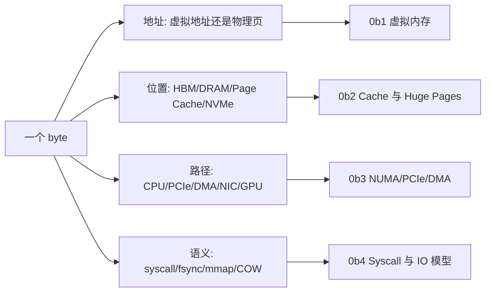

# 第 0b 章：内存、虚拟内存与 IO 导览

> **本章已拆分为独立子章**：原来的 0b 同时覆盖虚拟内存、页表/TLB、Page Cache、Huge Pages、NUMA、syscall/io_uring、PCIe、DMA、pinned memory 和 H2D 排障，单页过宽。现在 0b 保留为导览章，详细内容拆到 0b1-0b4。

## 1. 为什么要拆分 0b

AI 系统里的训练与推理并不是“GPU 在算”这么简单。程序看到的是连续、私有、可随意分配的地址空间，硬件拥有的却是分散、共享、有限、分层且速度差异巨大的物理资源。这个主题至少包含四条独立主线：

- 虚拟地址怎样变成物理地址，页表、TLB、page fault、`mmap`、fork/COW 如何影响大模型权重和 DataLoader；
- Page Cache、脏页回写、`fsync`、THP/HugeTLB 如何影响 dataset 读取、checkpoint 尾延迟和大数组地址转换；
- NUMA、PCIe topology、DMA、IOMMU、pinned memory、`cudaMemcpyAsync` 如何影响 H2D、GPUDirect 和 GPU/NIC locality；
- syscall、context switch、`epoll`、`io_uring` 如何影响 dataset service、模型网关、日志和高并发控制面。

这些都属于“内存、虚拟内存与 IO”，但排障入口不同。拆开之后，每个子章都能围绕一个更可操作的问题展开。

## 2. 拆分后的阅读路径

| 子章 | 主题 | 你应该在什么时候读 |
|------|------|--------------------|
| [0b1 虚拟内存、页表、TLB 与 Page Fault](./0b1-virtual-memory-page-tables-and-tlb.md) | 虚拟地址、物理页、页表、TLB、minor/major fault、`mmap`、fork/COW、RSS/PSS | 你要理解进程地址空间、模型权重 mmap、DataLoader fork 和 page fault |
| [0b2 Page Cache、脏页回写与 Huge Pages](./0b2-page-cache-writeback-and-huge-pages.md) | Page Cache、dirty page、`fsync`、`vm.dirty_ratio`、THP、HugeTLB、TLB 压力 | 你要排查 dataset 第二轮变快、checkpoint 突然卡住、大数组 TLB miss |
| [0b3 NUMA、PCIe、DMA 与 Pinned Memory](./0b3-numa-pcie-dma-and-pinned-memory.md) | NUMA first-touch、CPU/GPU/NIC locality、PCIe lane/topology、DMA、IOMMU、pinned memory、H2D | 你要排查同机不同 GPU/H2D 带宽差异、GPUDirect 绕路或 DataLoader 亲和问题 |
| [0b4 Syscall、Epoll、io_uring 与 IO 服务模型](./0b4-syscall-epoll-io-uring-and-service-io.md) | 用户态/内核态、syscall、context switch、blocking IO、`epoll`、`io_uring`、dataset service | 你要设计高并发服务、dataset server、日志采集或低开销异步 IO |

## 3. 总框架：每个 byte 都有地址、位置、路径和语义

第 0b 章的核心不是背 Linux 名词，而是建立一个习惯：**看到训练或推理里“慢”“抖”“OOM”“第二轮更快”“H2D 上不去”，先问这个 byte 现在在哪里、通过什么地址被访问、是否经过内核、是否能被设备 DMA，以及是否被错误 NUMA / Page Cache / dirty writeback 放大。**

## 4. 和相邻章节的关系

- 0a 讲 CPU 微架构，0b 接上内存、地址转换和 IO 边界。
- 0c 会继续展开文件系统与存储内核，0b2 只讲 Page Cache / writeback 的系统基础。
- 0d 会继续展开网络协议栈，0b4 只讲 syscall 和事件 IO 模型。
- 第 5 章会把这些基础放回 AI Infra 的数据搬运链路；0b 是它的操作系统基础。

## 5. 快速自测

1. 为什么进程看到连续地址，不代表物理内存连续？
2. Dataset 第二轮读取变快，可能来自 Page Cache，怎样验证？
3. `write()` 返回了，为什么 checkpoint 仍然可能没有真正落盘？
4. `pin_memory=True` 为什么能提高 H2D，但过量 pinned memory 又会伤害系统？
5. 同一台 8 GPU 机器上，为什么 GPU0 和 GPU7 的 H2D 或 RDMA 路径可能不同？
