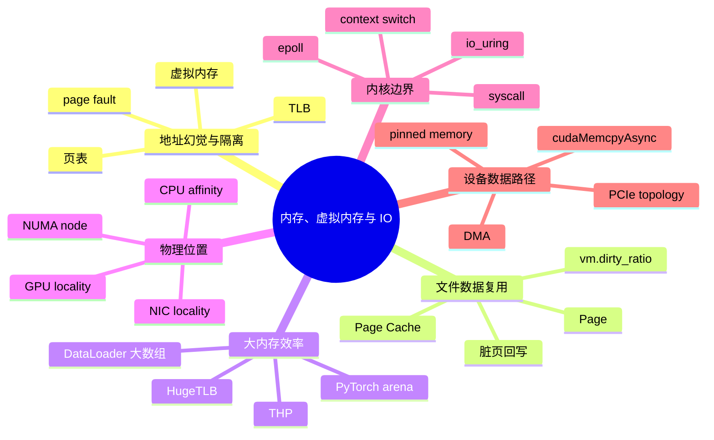
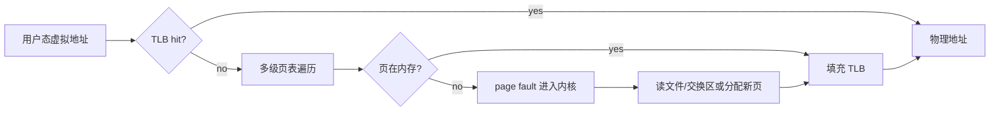
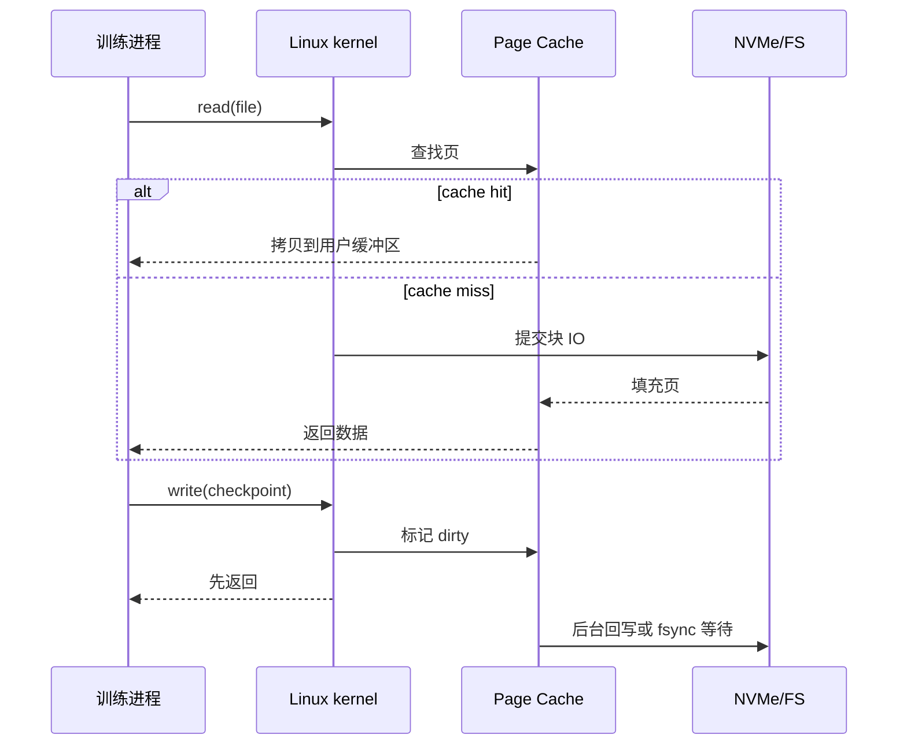
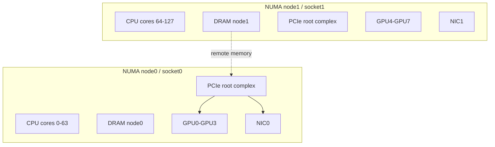
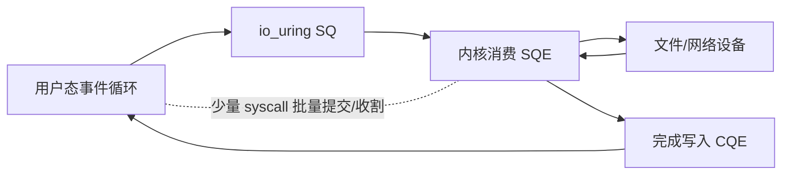
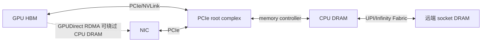

# 第 0b 章：内存、虚拟内存与 IO

## §0b.1 第一性原理拆解 + 学习大纲

### 拆 — 不可化简的问题

AI 系统里的训练与推理并不是“GPU 在算”这么简单。GPU 每秒可以消耗数百 GB 甚至数 TB 的数据，但数据必须先从磁盘、Page Cache、用户态缓冲区、CPU 内存、PCIe/NVLink、网卡或别的 GPU 走到它能访问的位置。不可化简的问题是：**程序看到的是连续、私有、可随意分配的地址空间，硬件拥有的却是分散、共享、有限、分层且速度差异巨大的物理资源；系统必须在正确性、隔离、吞吐、延迟和可回收性之间做动态映射。**

如果没有虚拟内存，每个进程都要知道真实物理地址，进程之间无法可靠隔离，`mmap` 大模型权重、fork DataLoader worker、共享内存队列都会变成危险操作。如果没有 Page Cache，每次读 dataset shard 都必须真的打到磁盘，训练吞吐会被 NVMe 或网络存储抖动拖住。如果没有 DMA 和 pinned memory，GPU 拷贝必须让 CPU 逐字节搬运，`cudaMemcpyAsync` 也无法真正异步。如果不理解 NUMA，8 张 GPU 的机器上可能出现“GPU0 绑定在 socket0，DataLoader 却在 socket1 分配内存”的反直觉慢路径。内存与 IO 的核心不是背术语，而是判断每一个 byte 的所有权、位置、迁移路径和阻塞点。

### 推 — 从这个问题如何推导出每个机制

第一步，进程需要一个稳定的地址幻觉，于是有虚拟内存；虚拟地址要落到物理页，于是有页表；页表查询太慢，于是有 TLB；TLB miss 会把一次普通 load 变成页表遍历甚至 page fault。第二步，磁盘与网络存储比 DRAM 慢几个数量级，于是内核把文件页缓存到内存里形成 Page Cache；写入不能每次同步落盘，于是有脏页、后台回写和 `vm.dirty_ratio`，但这也让 checkpoint 写入出现“前面很快，最后突然卡住”的行为。第三步，4 KiB 页在大数组、PyTorch allocator arena、embedding table 上会制造大量页表项和 TLB 压力，于是有 Transparent Huge Pages（THP）和显式 HugeTLB；前者自动但可能引入延迟尖峰，后者可控但需要预留。

第四步，现代服务器不是一块均匀内存，而是多个 NUMA node：每个 CPU socket 连接自己的 DRAM、PCIe root complex、GPU 和 NIC。远端内存访问可能多 30-80 ns，跨 socket PCIe 路径也会降低 H2D 或 RDMA 吞吐，因此要理解 `numactl`、CPU affinity、GPU locality 与 DataLoader worker 的关系。第五步，应用做 IO 必须进入内核态，syscall 与 context switch 有固定成本；高并发连接需要 `epoll`，高吞吐异步文件或网络 IO 可以用 `io_uring` 降低提交和完成路径的开销。第六步，设备之间真正搬数据靠 PCIe、DMA 和 IOMMU：lane 数、PCIe 代际、拓扑、ACS、switch、root complex 决定了 GPU、NIC、CPU 内存之间的可达性和瓶颈。最后，CUDA 的 pinned memory 把用户页锁住，使 DMA 能稳定访问；`cudaMemcpyAsync` 只有在 pinned host buffer 与 stream 配合时才有机会与计算重叠。

### 绘 — 因果链路



### 导 — 读完本章你应该能回答

1. 为什么进程看到的连续地址并不等于连续物理内存？TLB miss 会如何影响 AI workload？
2. Dataset 读取“第二轮更快”通常是 Page Cache 还是模型变快？如何验证？
3. `vm.dirty_ratio` 为什么会影响 checkpoint 的尾延迟，而不是只影响磁盘工具？
4. THP 与显式 HugeTLB 分别适合哪些大内存场景？什么时候会带来延迟尖峰？
5. 为什么同一张 GPU 的 H2D 带宽会因为 CPU core、NUMA node、pinned memory 设置不同而变化？
6. `epoll`、`io_uring`、普通 blocking syscall 分别解决什么 IO 成本？
7. 看到 PCIe topology 图时，如何判断 GPU、NIC、CPU 内存之间的数据路径是否绕远？

## §0b.2 物理 / 虚拟内存 / 页表 / TLB

物理内存是 DRAM 上真实存在的页框（page frame），虚拟内存是进程看到的地址空间。Linux 常用 4 KiB page，把虚拟页号通过多级页表映射到物理页框。x86-64 常见 4 级或 5 级页表；一次 TLB miss 可能触发硬件 page walk，访问多级页表，代价从几 ns 的 L1 hit 放大到数十到数百 ns。若页不存在，还会进入内核处理 minor/major page fault：minor fault 只建立映射，major fault 需要从磁盘或远端存储取页。



AI 场景里，`mmap` safetensors、NumPy memmap、dataset index、shared memory queue 都依赖这个机制。`fork` DataLoader worker 后的 copy-on-write 也靠页表标记实现：父子进程先共享物理页，写入时才复制。工程边界是：虚拟内存让“大地址空间”可用，但不保证“物理内存足够”；RSS、PSS、page fault、TLB miss 要分开看，不能只看 Python 对象大小。

## §0b.3 Page / Page Cache / 脏页回写 / `vm.dirty_ratio`

Page Cache 是 Linux 用空闲内存缓存文件内容的机制。第一次读 dataset shard 可能被 NVMe、NFS、对象存储网关限制；第二次读如果命中 Page Cache，会接近内存速度。`free` 里看到的 `buff/cache` 不是浪费，而是可回收缓存。写文件时，`write()` 通常只是把用户数据拷到 Page Cache 并标记 dirty，后台线程再回写到存储；`fsync()`、内存压力或 dirty page 超阈值会迫使同步等待。



关键参数包括 `vm.dirty_ratio`、`vm.dirty_background_ratio`、`vm.dirty_bytes`、`vm.dirty_background_bytes`。例如 512 GiB 内存机器上 `dirty_ratio=20` 允许约 102 GiB 脏页，checkpoint 前半段可能以 DRAM 速度返回，随后突然被回写限速。工程边界：Page Cache 适合复用读和顺序写缓冲，但不能当作持久化完成信号；需要恢复语义时必须理解 `fsync()`、rename 原子性和文件系统行为，详见 [§0c](0c-filesystems-and-storage-internals.md)。

## §0b.4 Huge Pages：THP vs explicit

4 KiB page 对小对象友好，但对几十 GB tensor、embedding table、DataLoader 预取数组会带来页表膨胀。2 MiB huge page 能把 512 个 4 KiB 页合并为一个页表项，降低 TLB miss 和 page walk。Transparent Huge Pages（THP）由内核自动尝试合并，配置常见为 `always`、`madvise`、`never`；显式 HugeTLB 需要预留 huge page 池，通过 `hugetlbfs` 或应用参数使用。

| 机制 | 优点 | 风险 | AI 场景 |
|---|---:|---:|---|
| THP `always` | 无需改应用，可能降低 TLB miss | compaction 带来延迟尖峰 | 离线训练可尝试 |
| THP `madvise` | 应用标记后才使用 | 依赖 allocator 支持 | 大数组、arena 更可控 |
| HugeTLB | 预留、确定性强 | 配额固定，碎片与运维复杂 | 数据库、通信缓冲、低延迟服务 |

PyTorch CPU allocator、Jemalloc arena、NumPy 大数组是否真正落在 huge page 上，需要结合 `/proc/<pid>/smaps` 的 `AnonHugePages`、`perf stat -e dTLB-load-misses` 判断。工程边界：Huge Pages 解决的是地址转换压力，不解决内存带宽不足；如果瓶颈是 PCIe、磁盘或 Python GIL，开启 THP 不会神奇变快。

## §0b.5 NUMA：node 亲和、`numactl`、GPU pinning

NUMA（Non-Uniform Memory Access）表示 CPU 访问本地 DRAM 与远端 socket DRAM 的延迟、带宽不同。双路服务器常见布局是 socket0 连接一组 PCIe root ports、GPU、NIC，socket1 连接另一组。Linux 默认 first-touch：哪个 CPU core 首次写页，页就倾向分配在哪个 NUMA node。DataLoader worker 若跑在 node1，却给挂在 node0 的 GPU 准备 batch，会让 H2D 经过 UPI/QPI 跨 socket。



常用命令：`numactl -H` 看 node，`lscpu -e=CPU,NODE` 看 core 归属，`nvidia-smi topo -m` 看 GPU/NIC/CPU 距离，`numactl --cpunodebind=0 --membind=0 python train.py` 固定分配。工程边界：亲和不是越紧越好；DataLoader、通信线程、tokenizer、主训练进程争同一批 core 会互相干扰。先按 GPU locality 分组，再用 profiling 验证。

## §0b.6 用户态 / 内核态 / syscall：context switch、`io_uring` / `epoll`

用户态不能直接操作磁盘、网卡、页表和调度器，必须通过 syscall 进入内核态。一次 syscall 本身通常是百 ns 到数 us 量级；若阻塞 IO、调度切换、cache/TLB 污染叠加，尾延迟会更高。AI 平台 control plane 的 HTTP/gRPC、模型服务的 socket、dataset server、日志采集都受 syscall 模型影响。

`epoll` 解决的是大量 fd 的 readiness 通知：一个线程可以等待成千上万个连接，适合网络服务。`io_uring` 通过 submission queue / completion queue 让应用批量提交 IO，减少 syscall 次数，并支持更统一的异步文件与网络路径。普通 blocking IO 简单但线程多；`epoll` 适合事件驱动网络；`io_uring` 适合需要批量、异步、低开销提交的高吞吐路径。



工程边界：`io_uring` 不是自动加速器。若文件系统、驱动、buffer 生命周期、direct IO 对齐没有配好，收益会被拷贝和锁抵消。控制面优先用成熟 runtime；数据面再评估 `io_uring`、SPDK、RDMA 或专用 dataset service。

## §0b.7 PCIe：lane / 代际、topology、GPU↔NIC↔CPU 路径

PCIe 用 lane 聚合带宽，常见 GPU 是 x16，NIC 可能是 x16 或 x8。理论单向带宽约为：

| 代际 | x8 单向 | x16 单向 | 常见意义 |
|---|---:|---:|---|
| PCIe 3.0 | ~7.9 GB/s | ~15.8 GB/s | 老平台 GPU H2D 易受限 |
| PCIe 4.0 | ~15.8 GB/s | ~31.5 GB/s | A100 PCIe 常见 |
| PCIe 5.0 | ~31.5 GB/s | ~63.0 GB/s | H100/H200、400G/800G NIC |
| PCIe 6.0 | ~64 GB/s | ~128 GB/s | 新平台，注意生态成熟度 |

延迟通常不是 GB/s 表能解释的：跨 PCIe switch、跨 root complex、跨 CPU socket、IOMMU 映射都会增加路径成本。`nvidia-smi topo -m` 中 `PIX`、`PXB`、`PHB`、`SYS` 表示不同距离；`SYS` 常意味着跨 NUMA 或 socket。GPU↔NIC 的 RDMA 若不在同一 root complex 下，可能绕 CPU interconnect，AllReduce 带宽打折。



工程边界：PCIe 表格只给理论上限。实际 H2D 还受 pinned memory、NUMA、batch size、copy engine、并发 stream、IOMMU 和电源状态影响；网络训练还要叠加 NCCL 拓扑选择。

## §0b.8 DMA、page-locked memory、`cudaMemcpyAsync`

DMA（Direct Memory Access）允许设备在 CPU 不逐字节参与的情况下读写内存。问题是虚拟页可能被换出或迁移，设备不能在传输中途发现物理地址变了，所以 CUDA 的 pinned/page-locked memory 会把 host buffer 锁在物理内存里，并建立设备可用的映射。PyTorch `DataLoader(pin_memory=True)` 会把 batch 放入 pinned host memory，使 H2D 拷贝更接近 PCIe 上限。

`cudaMemcpyAsync` 的“Async”有前提：host buffer 要 pinned，拷贝要在 CUDA stream 上提交，后续 kernel 与 copy engine 有可重叠空间。如果 pageable memory 被传入，runtime 可能先拷到临时 pinned staging buffer，调用点仍会同步一段时间。工程边界：pinned memory 不可无限开；锁页会降低系统可回收内存，过量会影响 Page Cache 和其他进程。训练服务通常要限制 prefetch factor、worker 数、batch 大小和 pinned 池容量。

## §0b.9 Worked example：H2D 带宽上不去

某 8×A100 PCIe 4.0 机器，理论每张卡 x16 H2D 单向上限约 31.5 GB/s。训练团队报告 GPU utilization 只有 55%-65%，step time 1.42 s，其中 forward/backward 约 0.95 s，剩余时间散在 batch 准备和 H2D。代码里每 step 把约 6.4 GiB token、mask、label 从 CPU 拷到 GPU，按理论上限 H2D 应接近 0.20-0.25 s；实测 `torch.cuda.Event` 包住 `.to(device, non_blocking=True)` 后，单卡 H2D 约 0.62 s，折算只有 10.3 GB/s。

第一步验证是否真的异步。检查 DataLoader：

```bash
python - <<'PY'
print(loader.pin_memory, loader.num_workers, loader.prefetch_factor)
PY
```

发现 `pin_memory=False`，虽然训练代码写了 `non_blocking=True`，但 pageable host memory 让 CUDA runtime 先做 staging copy。把 DataLoader 改为 `pin_memory=True` 后，H2D 从 0.62 s 降到 0.36 s，带宽约 17.8 GB/s，仍明显低于 PCIe 4.0 x16 的合理区间。此时说明第一个瓶颈成立但不是全部。

第二步看拓扑和 NUMA：

```bash
nvidia-smi topo -m
numactl -H
lscpu -e=CPU,NODE | head
ps -L -o pid,tid,psr,comm -p $(pgrep -f train.py | head -1)
```

拓扑显示 GPU0-GPU3 靠近 NUMA node0，GPU4-GPU7 靠近 node1；但进程由调度器随机跑，DataLoader worker 大多落在 node1，rank0-rank3 绑定 GPU0-GPU3。再用 `numastat -p <pid>` 看到 rank0 的匿名内存约 72% 在 node1。由于 Linux first-touch，worker 在 node1 解码和 collate batch 时首次写入页，pinned 后这些页仍在 node1；GPU0 从 node0 PCIe root complex 拉取 host memory，需要跨 socket interconnect，H2D 带宽被压到 18 GB/s 左右。

第三步按 locality 重启。对 rank0-rank3 使用：

```bash
CUDA_VISIBLE_DEVICES=0,1,2,3 numactl --cpunodebind=0 --membind=0 \
  torchrun --nproc_per_node=4 train.py --pin-memory true
```

对 rank4-rank7 使用 node1，或在 launcher 中按 GPU id 设置 CPU set。复测后，单卡 H2D 为 0.24-0.28 s，折算 23-27 GB/s；step time 从 1.42 s 降到 1.09 s，GPU utilization 提升到 82%-88%。剩余差距来自 batch size 不总是足够大、copy 与 kernel 重叠不完全、PCIe switch 上多卡并发共享上行带宽。

推理链总结：`non_blocking=True` 只是 API 意图，不保证异步；必须先有 pinned host memory。pinned memory 只保证页不迁移，不保证页在正确 NUMA node；first-touch 决定物理位置。PCIe 理论带宽只在“本地 NUMA + pinned + 足够大块 + copy engine 有空间”时接近。这个案例的修复不是盲目加 worker，而是把 DataLoader、pinned pool、rank、GPU、CPU node 作为一条数据路径一起约束。

## 练习

### 练习 1（基础）：虚拟地址翻译

解释一次用户态 load 从虚拟地址到物理地址可能经历的路径，并说明 TLB hit、TLB miss、minor page fault、major page fault 的差异。

### 练习 2（基础）：Page Cache 判断

设计 3 条 Linux 命令，判断 dataset 第二轮读取变快是否来自 Page Cache，而不是训练代码优化。

### 练习 3（基础）：dirty page 估算

一台 256 GiB 内存机器，`vm.dirty_ratio=20`。粗略估算最多允许多少 GiB 脏页，并说明这对 80 GiB checkpoint 写入有什么影响。

### 练习 4（基础）：THP 观察

给出查看 THP 当前策略、某进程 `AnonHugePages`、TLB miss 的命令。

### 练习 5（基础）：NUMA locality

用 `numactl -H`、`lscpu`、`nvidia-smi topo -m` 判断 GPU2 更适合绑定哪个 NUMA node。

### 练习 6（基础）：PCIe 带宽

PCIe 4.0 x16 单向理论约 31.5 GB/s。若 8 GiB H2D 用时 0.50 s，折算带宽是多少？可能有哪些原因？

### 练习 7（进阶）：fork 与 copy-on-write

解释 DataLoader worker 使用 `fork` 后，父进程大对象何时会共享、何时会复制。为什么“读共享、写复制”仍可能造成 RSS 误判？

### 练习 8（进阶）：`io_uring` 适用性

为 dataset service 判断是否值得引入 `io_uring`：列出至少 4 个前提条件和 3 个不适合的信号。

### 练习 9（进阶）：Pinned memory 副作用

说明 pinned memory 如何提高 H2D，同时列出过量 pinned memory 对 Page Cache、系统回收、其他租户的影响。

### 练习 10（进阶）：Topology 推理

假设 GPU 与 NIC 在 `nvidia-smi topo -m` 中显示 `SYS`，推断 GPUDirect RDMA 可能遇到什么问题，并给出排查命令。

### 练习 11（设计）：8 GPU DataLoader 亲和方案

为双路 8 GPU 机器设计 rank、CPU core、NUMA memory、DataLoader worker 的绑定策略，说明如何避免跨 socket H2D。

### 练习 12（设计）：Checkpoint 写入策略

设计一个 400 GiB checkpoint 写入方案，要求说明 Page Cache、dirty ratio、临时文件、rename、fsync 的取舍。

### 练习 13（设计）：低延迟推理 IO

为一个在线推理服务设计网络 IO 模型：blocking thread pool、`epoll`、`io_uring` 三选一或组合，并说明为什么。

## 深度参考阅读

- Linux kernel documentation: `Documentation/admin-guide/mm/`，尤其是 HugeTLB、THP、NUMA memory policy、dirty page writeback。
- Intel 64 and IA-32 Architectures Optimization Reference Manual：TLB、page walk、NUMA 与内存层级优化。
- AMD64 Architecture Programmer's Manual：虚拟内存、页表、IOMMU 与系统架构背景。
- NVIDIA CUDA C Programming Guide：Pinned memory、asynchronous copy、streams、copy engine。
- NVIDIA GPUDirect RDMA documentation：GPU、NIC、PCIe topology 与 peer-to-peer 约束。
- Brendan Gregg, *Systems Performance*：内存、文件系统、IO、CPU profiling 的工程方法。
- man pages: `mmap(2)`、`madvise(2)`、`mlock(2)`、`io_uring_setup(2)`、`epoll(7)`、`numactl(8)`。
