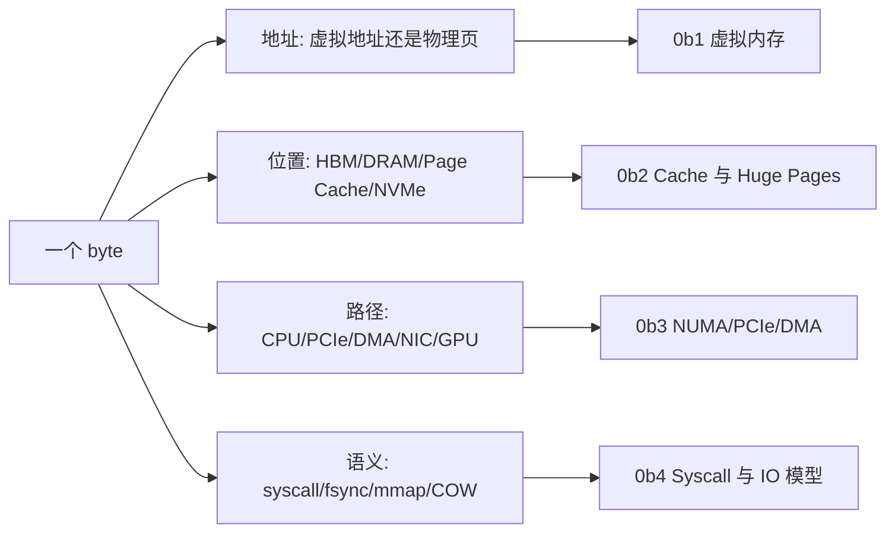

# 第 0b 章：内存、虚拟内存与 IO 导览

> **本章已拆分为独立子章**：原来的 0b 同时覆盖虚拟内存、页表/TLB、Page Cache、Huge Pages、NUMA、syscall/io_uring、PCIe、DMA、pinned memory 和 H2D 排障，单页过宽。现在 0b 保留为导览章，详细内容拆到 0b1-0b4。

## 1. 第一性原理拆解 + 学习大纲

### 拆 — 不可化简的问题

AI Infra 的“内存与 IO”不是一条单独的慢路径，而是一组共享资源边界：进程用虚拟地址访问数据，内核用 Page Cache 和页表把文件、匿名页、设备映射组织起来，CPU socket、PCIe root complex、GPU、NIC、NVMe 和服务线程又决定 byte 真正经过哪里。不可化简的问题是：**每个 byte 都要同时满足地址正确、位置合适、路径可达、语义可靠、容量不超账；任意一项缺证据，性能结论都可能是错的。**

因此本章族不按 Linux 名词堆砌，而按排障入口组织：page-fault storm 先看虚拟内存与 mmap；dataset 第二轮变快、checkpoint 后半段卡住和 huge page misses 先看 Page Cache / writeback / THP；H2D stalls、NUMA locality 和 RDMA fallback 先看拓扑、DMA 与 pinned memory；service IO latency 先看 syscall、`epoll`、`io_uring`、backpressure 和队列。

### 推 — 从这个问题如何推导出章节边界

从“进程看到的地址不是物理地址”推出 0b1；从“文件页会被 DRAM 缓存且写入会延迟落盘”推出 0b2；从“设备 DMA 要求页稳定且拓扑近”推出 0b3；从“服务要通过 syscall 向内核请求 IO 且要管理并发”推出 0b4。每个子章都必须给出同一类产物：路径解释、EvidenceBundle、CapacityLedger、故障表、retest 标准。

### 导 — 读完本章族你应该能回答

1. 一个慢 batch 是在 page fault、Page Cache miss、dirty writeback、H2D、NUMA 远端内存、RDMA fallback，还是服务 IO 队列上等待？
2. 每类问题需要采哪些证据，哪些指标只是旁证？
3. 容量模型里哪些量必须提前预算，例如 hot file working set、dirty bytes、pinned footprint、H2D 带宽和 syscall rate？
4. 改完配置后用什么 retest criteria 判断“修复成立”，而不是只看一次吞吐变好？

## 2. 为什么要拆分 0b

AI 系统里的训练与推理并不是“GPU 在算”这么简单。程序看到的是连续、私有、可随意分配的地址空间，硬件拥有的却是分散、共享、有限、分层且速度差异巨大的物理资源。这个主题至少包含四条独立主线：

- 虚拟地址怎样变成物理地址，页表、TLB、page fault、`mmap`、fork/COW 如何影响大模型权重和 DataLoader；
- Page Cache、脏页回写、`fsync`、THP/HugeTLB 如何影响 dataset 读取、checkpoint 尾延迟和大数组地址转换；
- NUMA、PCIe topology、DMA、IOMMU、pinned memory、`cudaMemcpyAsync` 如何影响 H2D、GPUDirect 和 GPU/NIC locality；
- syscall、context switch、`epoll`、`io_uring` 如何影响 dataset service、模型网关、日志和高并发控制面。

这些都属于“内存、虚拟内存与 IO”，但排障入口不同。拆开之后，每个子章都能围绕一个更可操作的问题展开。

## 3. 拆分后的阅读路径

| 子章 | 主题 | 你应该在什么时候读 |
|------|------|--------------------|
| [0b1 虚拟内存、页表、TLB 与 Page Fault](./0b1-virtual-memory-page-tables-and-tlb.md) | 虚拟地址、物理页、页表、TLB、minor/major fault、`mmap`、fork/COW、RSS/PSS | 你要理解进程地址空间、模型权重 mmap、DataLoader fork 和 page fault |
| [0b2 Page Cache、脏页回写与 Huge Pages](./0b2-page-cache-writeback-and-huge-pages.md) | Page Cache、dirty page、`fsync`、`vm.dirty_ratio`、THP、HugeTLB、TLB 压力 | 你要排查 dataset 第二轮变快、checkpoint 突然卡住、大数组 TLB miss |
| [0b3 NUMA、PCIe、DMA 与 Pinned Memory](./0b3-numa-pcie-dma-and-pinned-memory.md) | NUMA first-touch、CPU/GPU/NIC locality、PCIe lane/topology、DMA、IOMMU、pinned memory、H2D | 你要排查同机不同 GPU/H2D 带宽差异、GPUDirect 绕路或 DataLoader 亲和问题 |
| [0b4 Syscall、Epoll、io_uring 与 IO 服务模型](./0b4-syscall-epoll-io-uring-and-service-io.md) | 用户态/内核态、syscall、context switch、blocking IO、`epoll`、`io_uring`、dataset service | 你要设计高并发服务、dataset server、日志采集或低开销异步 IO |

## 4. 章节边界和证据入口

| 问题入口 | 负责章节 | EvidenceBundle 必含 | CapacityLedger 或 decision rule | retest criteria |
|----------|----------|--------------------|----------------------------------|-----------------|
| page-fault storm、mmap 冷启动、COW RSS 暴涨 | 0b1 | `minor-faults`、`major-faults`、`smaps_rollup`、`VmPTE`、mmap warmup timeline | `t_warmup >= cold_bytes / read_bw + major_faults * fault_cost`；服务 readiness 后 major fault threshold 应为 0 | 预热后请求窗口内 `major-faults` 不再增长，PSS/Private_Dirty 稳定 |
| page cache 命中假象、dirty writeback、checkpoint、huge page misses | 0b2 | `Cached`、`Active(file)`、`Dirty`、`Writeback`、`iostat await`、dTLB miss、THP 指标 | `dirty_bytes <= write_bw * allowed_tail_seconds`；`hot_file_set <= MemAvailable - anon - pinned - kernel_reserve` | cold/warm benchmark 分开；`fsync` p95 达标；dTLB miss 下降且 p99 不恶化 |
| H2D stalls、NUMA locality、pinned memory、RDMA fallback | 0b3 | `nvidia-smi topo -m`、`numastat`、CUDA timeline、PCIe `LnkSta`、memlock、GDRDMA benchmark | `pinned_footprint ~= ranks * workers * prefetch * batch_bytes * buffers`；`H2D_bw_required = bytes_per_step / copy_budget` | H2D 带宽进入链路合理区间，copy/compute overlap 可见，near GPU/NIC RDMA 快于 far 组合 |
| service IO latency、`epoll` busy loop、`io_uring` 误用 | 0b4 | syscall profile、context switches、fd/socket 队列、event loop lag、pending bytes、CQ depth | `syscall_rate ~= throughput / chunk_size`；`queue_bytes <= tenants * per_tenant_limit` | 慢客户端压测下 p99/p999、event loop lag、pending bytes 和 reject/cancel counter 均在 threshold 内 |

## 5. 总框架：每个 byte 都有地址、位置、路径和语义

第 0b 章的核心不是背 Linux 名词，而是建立一个习惯：**看到训练或推理里“慢”“抖”“OOM”“第二轮更快”“H2D 上不去”，先问这个 byte 现在在哪里、通过什么地址被访问、是否经过内核、是否能被设备 DMA，以及是否被错误 NUMA / Page Cache / dirty writeback 放大。**

## 6. 和相邻章节的关系

- 0a 讲 CPU 微架构，0b 接上内存、地址转换和 IO 边界。
- 0c 会继续展开文件系统与存储内核，0b2 只讲 Page Cache / writeback 的系统基础。
- 0d 会继续展开网络协议栈，0b4 只讲 syscall 和事件 IO 模型。
- 第 5 章会把这些基础放回 AI Infra 的数据搬运链路；0b 是它的操作系统基础。

## 7. 快速自测

1. 为什么进程看到连续地址，不代表物理内存连续？
2. Dataset 第二轮读取变快，可能来自 Page Cache，怎样验证？
3. `write()` 返回了，为什么 checkpoint 仍然可能没有真正落盘？
4. `pin_memory=True` 为什么能提高 H2D，但过量 pinned memory 又会伤害系统？
5. 同一台 8 GPU 机器上，为什么 GPU0 和 GPU7 的 H2D 或 RDMA 路径可能不同？
