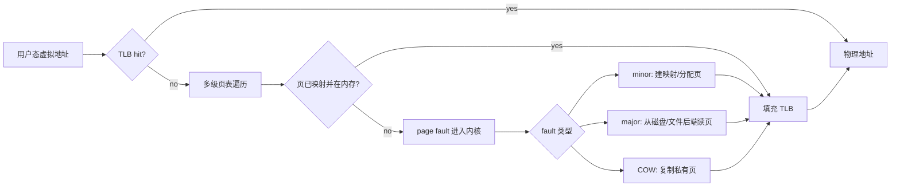
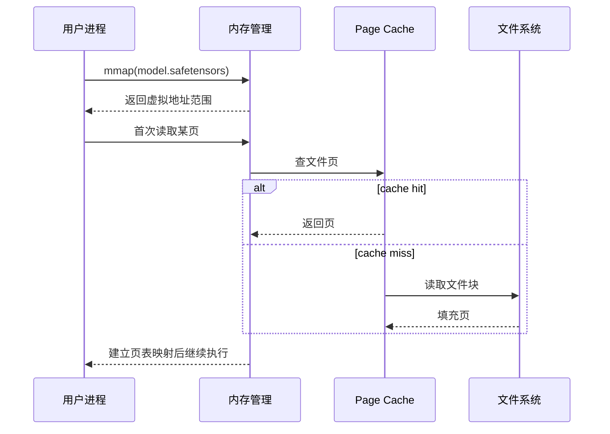
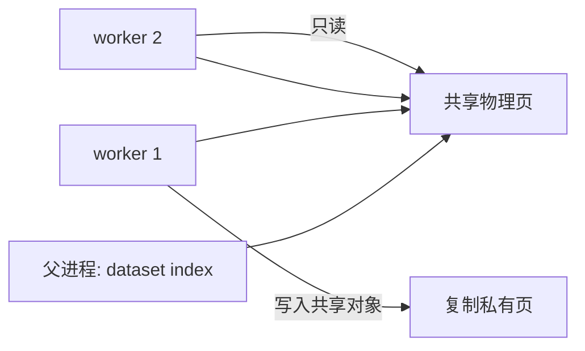
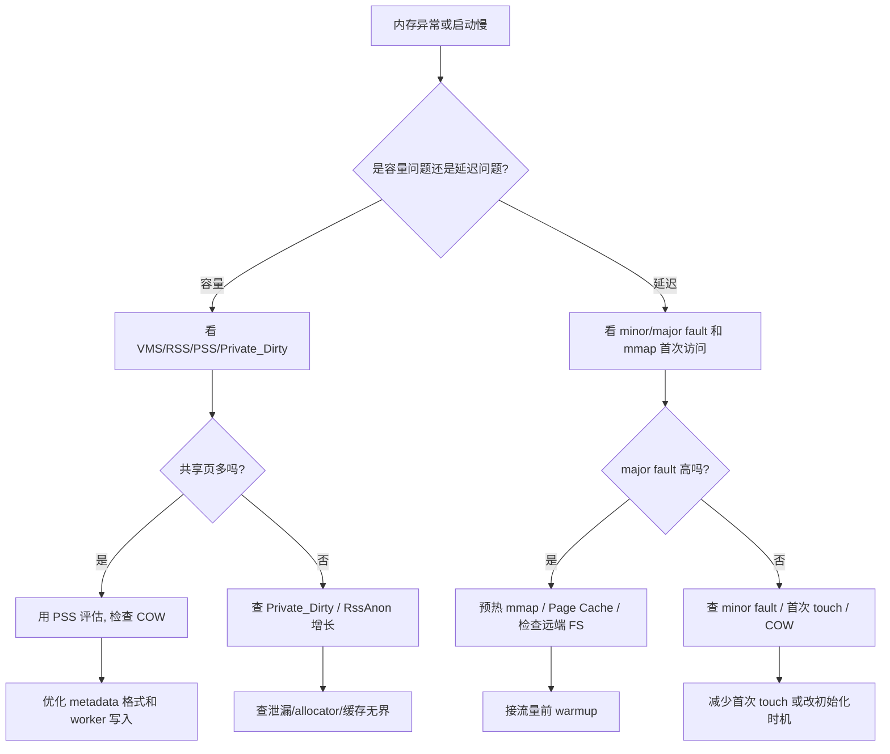

# 第 0b1 章：虚拟内存、页表、TLB 与 Page Fault

> **关联章节**：本章是 [第 0b 章](./0b-memory-virtual-memory-and-io.md) 的虚拟内存拆分篇。Page Cache 与 dirty writeback 见 [0b2](./0b2-page-cache-writeback-and-huge-pages.md)，NUMA / PCIe / pinned memory 见 [0b3](./0b3-numa-pcie-dma-and-pinned-memory.md)。

## 1. 第一性原理拆解 + 学习大纲

### 拆 — 不可化简的问题

AI 程序看到的是一个很大的、连续的、私有的地址空间，但机器真实拥有的是有限 DRAM、分散物理页、共享缓存、设备地址窗口和文件后端。不可化简的问题是：**操作系统必须让每个进程相信自己独占一片连续内存，同时又要把这些虚拟地址动态映射到真实物理页、文件页或设备映射，并在隔离、性能和可回收性之间保持正确。**

如果没有虚拟内存，多个训练进程不能安全共存，`mmap` 大模型权重不能按需映射，DataLoader `fork` 后不能通过 copy-on-write 共享父进程对象，CUDA / RDMA 也无法把用户态 buffer 稳定地注册给设备。虚拟内存提供了强抽象，但它也引入代价：TLB miss、page walk、minor fault、major fault、COW 复制、RSS 误判和地址空间碎片都会出现在 AI workload 的性能现场。

### 推 — 从这个问题如何推导出每个机制

从“进程需要私有地址空间”推出虚拟地址；从“虚拟地址要访问真实 DRAM”推出页表；从“每次 load 都查页表太慢”推出 TLB；从“页可能还没映射或不在内存”推出 page fault；从“文件可以像内存一样访问”推出 `mmap`；从“fork 后复制整个父进程太贵”推出 copy-on-write。

这些机制互相牵制。`mmap` safetensors 可以让模型权重按页加载，但第一次访问会产生 page fault；DataLoader `fork` 可以共享父进程只读对象，但 worker 写入会触发 COW；TLB 可以缓存地址翻译，但 4 KiB 页面对几十 GB tensor 会产生大量页表项和 TLB 压力。

### 绘 — 因果链路



### 导 — 读完本章你应该能回答

1. 虚拟地址、物理地址、页表、TLB、page fault 分别解决什么问题？
2. TLB hit、TLB miss、minor fault、major fault 的延迟量级为什么差很多？
3. `mmap` 模型权重为什么能降低启动峰值内存，却可能把冷启动延迟推迟到首次访问？
4. DataLoader `fork` 后哪些页会共享，哪些写入会触发 COW？
5. RSS、PSS、VMS 为什么不能混用？为什么“看起来占了很多内存”未必代表真实独占？

## 2. 虚拟内存：地址空间是幻觉，但这个幻觉很有用

每个 Linux 进程都有自己的虚拟地址空间。用户程序里看到的指针，例如 `0x7f...`，不是 DRAM 上的真实地址，而是虚拟地址。CPU 访问内存时，MMU 会把虚拟地址翻译成物理地址。

| 概念 | 含义 | AI 场景 |
|------|------|---------|
| 虚拟地址 | 进程看到的地址 | Python 对象、tensor storage、mmap 文件 |
| 物理页框 | DRAM 中真实 4 KiB 页框 | RSS 真正落在内存的部分 |
| 页表 | 虚拟页到物理页的映射 | 大进程有大量页表内存 |
| VMA | 一段连续虚拟地址区域 | heap、stack、mmap 权重、shared memory |
| MMU | 硬件地址翻译单元 | 每次 load/store 都依赖它 |

虚拟内存带来四个关键能力：

- **隔离**：一个训练进程不能随便写另一个进程的内存。
- **稀疏地址空间**：进程可以拥有很大的虚拟地址范围，不必一次分配物理内存。
- **文件映射**：`mmap` 可以把文件映射到地址空间，用 load 指令触发读取。
- **共享与 COW**：多个进程可以共享同一物理页，写入时再复制。

工程边界：虚拟地址连续不等于物理页连续。一个 20 GiB tensor 在虚拟地址上连续，但底层可能由大量 4 KiB 物理页组成；设备 DMA、TLB、NUMA locality 都会受真实物理布局影响。

### 2.1 一个进程地址空间里通常有什么

用 `cat /proc/<pid>/maps` 可以看到进程的虚拟内存区域。一个训练进程通常包含：

| 区域 | 常见来源 | AI 场景 |
|------|----------|---------|
| text / rodata | Python 解释器、动态库、CUDA/cuDNN/NCCL so | 代码段和只读数据，多个进程可共享 |
| heap | glibc / jemalloc / Python allocator | Python 对象、metadata、临时 buffer |
| stack | 每个线程的栈 | DataLoader worker、RPC 线程、runtime 线程 |
| anonymous mmap | 大块匿名内存 | PyTorch CPU tensor、allocator arena、shared queue |
| file-backed mmap | 文件映射 | safetensors、NumPy memmap、dataset index |
| shared memory | `/dev/shm`、POSIX shm | DataLoader IPC、进程间队列 |
| device mapping | driver 映射区域 | CUDA driver、NIC、GPU BAR、注册内存 |

示例命令：

```bash
cat /proc/<pid>/maps | head -40
pmap -x <pid> | sort -k3 -n | tail -20
cat /proc/<pid>/smaps_rollup
```

`maps` 告诉你“地址空间里有哪些区域”；`smaps` 告诉你这些区域实际占了多少 RSS、PSS、Private、Shared。排查内存时要把二者结合：一个 140 GB 的 mmap 权重文件可能让 VMS 很大，但如果只访问了少量页，RSS 不一定大；反过来，一个看似不大的 Python dict 可能分散在大量小页上，fork 后很容易 COW。

### 2.2 物理页、文件页、匿名页、共享页

Linux 的页不只一种。理解页的来源，比只看“用了多少内存”更有价值。

| 页类型 | 后端 | 典型字段 | 回收方式 | AI 场景 |
|--------|------|----------|----------|---------|
| Anonymous page | 无文件后端 | `RssAnon` | 可 swap 或丢弃后重建取决于场景 | Python heap、CPU tensor |
| File-backed page | 文件 | `RssFile` | 干净页可直接丢弃，需要时重读文件 | mmap 权重、dataset shard |
| Shared memory page | tmpfs/shm | `RssShmem` | 取决于 tmpfs/shm 生命周期 | DataLoader queue、IPC |
| Private dirty page | 进程私有且被写过 | `Private_Dirty` | 不能直接丢弃 | COW 后的 worker 私有页 |
| Shared clean page | 多进程共享且未写 | `Shared_Clean` | 可丢弃或共享 | 动态库、只读 mmap |

这解释了一个常见误判：`nvidia-smi` 之外的 CPU 内存看起来很大，不一定都是“泄漏”。如果大部分是 `RssFile` 或 `Shared_Clean`，它可能是可回收文件缓存或共享映射；如果 `Private_Dirty` 持续增长，就更像真实独占内存增长。

## 3. 页表与 TLB：普通 load 背后的隐藏成本

Linux 常用 4 KiB page。虚拟地址被拆成虚拟页号和页内偏移，页表记录虚拟页号到物理页框的映射。x86-64 常见 4 级或 5 级页表，TLB miss 时硬件 page walker 可能访问多级页表。

| 情况 | 大致含义 | 性能影响 |
|------|----------|----------|
| TLB hit | 地址翻译在 TLB 里 | 很快，通常不是瓶颈 |
| TLB miss + 页表在 cache | 需要 page walk | 数十 ns 级 |
| TLB miss + 页表不在 cache | page walk 还要访问内存 | 可到百 ns 级 |
| minor fault | 页存在或可分配，但还没建映射 | 进入内核，微秒级常见 |
| major fault | 需要从磁盘/远端后端读页 | 可到 ms 级或更高 |

AI workload 里常见 TLB 压力来源：

- 大 embedding table 随机访问；
- 巨大 NumPy / PyTorch CPU tensor；
- 大规模 dataset index 或 memmap；
- 多进程 DataLoader 共享大量 VMA；
- 小页导致页表项数量膨胀。

观察命令：

```bash
perf stat -e dTLB-loads,dTLB-load-misses,iTLB-load-misses -p <pid> -- sleep 10
grep -E 'VmSize|VmRSS|VmPTE|RssAnon|RssFile|RssShmem' /proc/<pid>/status
cat /proc/<pid>/smaps_rollup
```

`VmPTE` 可以提醒你页表本身的内存开销。一个很大的进程，即使业务 tensor 没有增长，也可能因为映射数量和页表增长消耗更多内核内存。

### 3.1 以 4 KiB 页理解地址拆分

以 4 KiB 页为例，页内偏移占 12 bit。一个虚拟地址可以粗略拆成：

```text
virtual address = virtual page number + page offset
page offset     = 低 12 bit
VPN             = 高位，用于查页表
```

页表项不只保存物理页框号，还保存权限和状态：

| 页表项信息 | 作用 | 工程含义 |
|------------|------|----------|
| present | 页是否当前可访问 | 不 present 会触发 page fault |
| read/write | 是否可写 | COW 会先标只读，写入时 fault |
| user/supervisor | 用户态是否可访问 | 隔离内核内存 |
| dirty | 页是否被写过 | 回写和 COW 诊断相关 |
| accessed | 页是否被访问过 | 回收算法参考 |
| executable / NX | 是否可执行 | 安全隔离 |
| physical frame number | 物理页框号 | 真正访问 DRAM 的位置 |

当你看到“写入触发 page fault”时，不一定是页不存在；也可能是页表项被故意标成只读，用于 COW 或保护。

### 3.2 多级页表为什么存在

如果每个进程都为整个 48-bit 或 57-bit 虚拟地址空间准备一张平铺页表，页表会巨大到不可接受。多级页表让没有使用的地址范围不占下级页表。


这套结构节省内存，但 TLB miss 时要访问多级页表。如果页表项本身不在 cache 中，page walk 会触发多次内存访问。对大数组随机访问来说，实际慢点可能不是数据本身，而是地址翻译和页表访问。

### 3.3 TLB 层级与 shootdown

现代 CPU 通常有多级 TLB，例如 L1 dTLB、L2/STLB。TLB 是每核或每组核心的硬件缓存。TLB 命中时地址翻译很快；TLB miss 才需要 page walk。

还有一个容易忽略的成本：TLB shootdown。当内核修改某个进程的页表映射，例如 `munmap`、权限变化、COW、内存回收，其他 CPU 核上可能缓存了旧 TLB 项，内核需要让它们失效。多线程、多进程、大量 mmap/munmap 的程序会看到 shootdown 开销。

观察线索：

```bash
perf stat -e dTLB-load-misses,dTLB-store-misses,dtlb_load_misses.walk_completed -p <pid> -- sleep 10
perf stat -e tlb:tlb_flush -a -- sleep 10  # 事件名依内核而异
```

不同平台事件名不同，`perf list | grep -i tlb` 先确认可用事件。

### 3.4 什么时候 TLB 是真瓶颈

TLB miss 高不一定就是主要瓶颈，要结合 workload：

| 场景 | 是否容易 TLB-bound | 原因 |
|------|-------------------|------|
| 大 batch 连续 GEMM | 通常不明显 | 数据访问连续，GPU 侧为主 |
| CPU embedding / feature lookup | 容易 | 大表随机访问，页跨度大 |
| 巨大 Python object graph | 容易 | 小对象分散，cache/TLB 都差 |
| NumPy memmap 随机采样 | 容易 | 文件页随机 fault + TLB miss |
| 顺序读取大 shard | 不一定 | readahead 和 Page Cache 可缓解 |

优化方向：

- 用连续数组替代 Python object graph；
- 用 columnar / binary 格式替代大量小对象；
- 对大数组评估 Huge Pages，详见 0b2；
- 减少随机访问跨度；
- 分批处理，让访问局部性更强。

## 4. Page Fault：不是所有 fault 都是错误

Page fault 只是“当前访问的虚拟页无法直接完成翻译”。它可能是正常机制，也可能是性能问题。

| 类型 | 发生原因 | 是否需要磁盘 IO | 常见场景 |
|------|----------|----------------|----------|
| Minor fault | 页已在内存或需要新分配，只是没建映射 | 否 | 首次触碰匿名页、COW 分配 |
| Major fault | 页不在内存，需要从文件/磁盘读入 | 是 | mmap 大文件首次访问、内存压力后重读 |
| COW fault | 共享只读页被写入，需要复制 | 否，但要分配/拷贝 | fork 后 worker 修改父进程对象 |
| Protection fault | 权限不允许 | 不一定 | 写只读映射、越界 bug |

查看进程 fault：

```bash
pidstat -r -p <pid> 1
perf stat -e page-faults,minor-faults,major-faults -p <pid> -- sleep 30
cat /proc/<pid>/stat
```

训练启动慢时，如果 major fault 很高，可能是 mmap 权重或 dataset index 正在从文件系统拉页；如果 minor fault 很高，可能是大数组首次 touch、COW 或 allocator arena 初始化。

### 4.1 Minor fault 的几种常见来源

Minor fault 不读磁盘，但仍要进内核，数量多时也会影响启动和尾延迟。

| 来源 | 解释 | 例子 |
|------|------|------|
| demand-zero page | 首次写匿名页，内核分配清零页 | 初始化大 CPU tensor |
| file page 已在 Page Cache | 文件页已在内存，只需建立映射 | mmap 权重第二次启动 |
| COW | 写共享页，复制私有页 | fork worker 修改父对象 |
| stack growth | 线程栈按需增长 | 大量线程或深递归 |
| lazy allocation | allocator 申请虚拟地址但未触碰物理页 | `malloc` 后首次写入 |

### 4.2 Major fault 的几种常见来源

Major fault 需要等待 IO，因此更容易造成明显延迟。

| 来源 | 解释 | 例子 |
|------|------|------|
| mmap 文件首次访问 | 文件页不在 Page Cache | 首次加载 safetensors |
| 内存压力后重读 | 文件页被回收 | 多租户节点上权重被挤出 |
| swap in | 匿名页被换出 | CPU 内存压力严重 |
| 远端 FS / FUSE 后端 | fault 触发远端读取 | 对象存储 FUSE mount |

AI 线上推理要特别警惕 major fault：请求路径中一次 major fault 就可能把 p99 拉高几个数量级。生产服务应在接流量前 warmup 权重页、tokenizer、索引和关键 mmap 区域。

### 4.3 Fault 观测容易踩的坑

- `perf stat page-faults` 包含 minor + major，先拆开看。
- `pidstat -r` 中 `minflt/s` 很高不一定是坏事，启动期首次 touch 会很高。
- 容器里看到的内存指标可能经过 cgroup 限制，宿主机 Page Cache 压力也要看。
- macOS / Linux / WSL 行为不同，本教程默认 Linux。
- mmap 文件的 IO 可能体现在 page fault 上，而不是显式 `read()` syscall 上。

建议记录：

```bash
pidstat -r -p <pid> 1
perf stat -e minor-faults,major-faults,page-faults -p <pid> -- sleep 30
grep -E 'pgfault|pgmajfault' /sys/fs/cgroup/<group>/memory.stat 2>/dev/null || true
```

## 5. mmap：把文件变成地址空间

`mmap` 让文件内容映射到进程地址空间。访问映射区时，如果页不在内存，内核会把对应文件页读入 Page Cache 并建立映射。



优点：

- 不必一次把整个文件读进用户态 buffer；
- 多进程可以共享同一文件页；
- OS 可以按需加载和回收；
- 权重文件、dataset index、NumPy memmap 都能受益。

风险：

- 首次访问延迟变成 page fault，可能污染在线冷启动；
- 随机访问大文件会触发大量小读；
- 内存压力下页被回收，后续访问再次 major fault；
- 映射不等于 pin，设备 DMA 仍需要注册/锁页。

### 5.1 mmap 权重加载的两种策略

大模型权重加载常见两种策略：

| 策略 | 做法 | 优点 | 风险 |
|------|------|------|------|
| eager read | 启动时显式读完整权重到用户态 buffer | 延迟集中在启动期，接流量后更稳定 | 启动峰值内存高，拷贝多 |
| mmap lazy | 映射文件，访问时按页 fault | 启动初始 RSS 低，多进程共享方便 | 首次访问延迟分散到请求或 warmup |

生产推理通常不希望第一个真实用户请求承担 major fault。即使用 mmap，也应做 warmup：

```bash
# 粗暴预热文件页，适合离线验证，不等于应用访问全部路径
vmtouch -t model.safetensors

# 没有 vmtouch 时可顺序读一遍
dd if=model.safetensors of=/dev/null bs=64M status=progress
```

应用内更可靠：按模型实际访问路径做一次 dummy forward / prefill / decode，让权重、kernel、CUDA Graph、allocator 都进入稳态。

### 5.2 mmap 与 Page Cache 的关系

mmap 文件页通常通过 Page Cache 管理。多个进程 mmap 同一个只读权重文件时，可以共享相同物理文件页。这是模型服务多 worker 的重要优化。

但共享成立有条件：

- 映射同一个文件内容；
- 页是 clean file-backed；
- 没有写入触发私有副本；
- 文件没有被替换成另一个 inode；
- 容器 / mount namespace 没让路径指向不同后端。

发布模型时要小心“覆盖写原文件”。更稳的方式是内容哈希路径 + 原子切换引用：

```text
models/
  sha256-abc.../model.safetensors
  sha256-def.../model.safetensors
  current -> sha256-def...
```

这样旧进程继续持有旧 inode，新进程加载新 inode，避免 mmap 文件被原地修改。

### 5.3 mmap 不等于零拷贝到 GPU

mmap 只是让 CPU 进程以地址访问文件页。把权重放到 GPU HBM 仍然需要 H2D 或 GDS 等路径。普通路径通常是：

```text
file page in Page Cache
  -> CPU addressable memory
  -> cudaMemcpy / framework loader
  -> GPU HBM
```

如果目标是减少 CPU bounce buffer 或走更直接的数据路径，要进入 0b3 / 第 5b 的 DMA、pinned memory、GDS 讨论。不要把 mmap 和 GPU zero-copy 混为一谈。

## 6. fork 与 Copy-on-Write：DataLoader 的隐形内存账

Linux `fork()` 后，子进程不会立刻复制父进程所有物理页。父子进程先共享同一批物理页，页表被标记为只读；任一方写入时触发 COW fault，内核复制一份私有页。



DataLoader 场景：

- 父进程加载巨大 Python list / dict，fork worker 后只读，初始看似省内存；
- worker 如果修改对象、打乱列表、缓存字段，可能触发 COW；
- Python 小对象分散在许多页上，改一个引用计数也可能导致整页复制；
- RSS 会把共享页在每个进程里都计入，看起来“总 RSS 爆炸”，PSS 更接近按比例分摊。

观察：

```bash
smem -p -P 'python|train'
cat /proc/<pid>/smaps_rollup | egrep 'Rss|Pss|Private|Shared'
```

工程建议：

- 大型 dataset metadata 尽量用不可变、连续、mmap 友好的格式；
- worker 内避免修改父进程大对象；
- Linux 上评估 `fork` vs `spawn` 的内存/启动权衡；
- 用 PSS 而不是简单 RSS 评估共享内存。

### 6.1 Python 引用计数也可能破坏共享

CPython 对象有引用计数。某些看似“只读遍历”的操作，也可能更新对象头的引用计数或触发缓存字段变化，从而让所在页变 dirty。一个页是 4 KiB，页里可能塞了很多小对象；改动一个对象头，整页对该 worker 变成私有页。

因此，大型 metadata 不适合用嵌套 Python list/dict 长期驻留在父进程再 fork。更适合：

- NumPy array / Arrow / memory-mapped binary；
- 只读字符串池和 offset table；
- dataset manifest 文件；
- worker 内按 shard 加载局部 metadata；
- `spawn` 模式下显式初始化，避免 COW 误判。

### 6.2 fork、spawn、forkserver 的取舍

| 启动方式 | 优点 | 风险 | 适合场景 |
|----------|------|------|----------|
| fork | 启动快，初始共享父进程页 | COW 隐蔽，和 CUDA runtime 混用有风险 | Linux DataLoader，父对象只读且未初始化 CUDA |
| spawn | 子进程重新导入和初始化 | 启动慢，占用更显式 | 跨平台、CUDA 安全性更好 |
| forkserver | 通过干净 server fork | 配置复杂 | 避免从复杂父进程 fork |

PyTorch 场景里，不建议在已经初始化 CUDA context 后随意 fork worker。DataLoader 的 worker 通常处理 CPU 数据路径，GPU 工作留在主进程或 rank 进程。

### 6.3 COW 实验：判断 worker 是否复制了父对象

可以做一个简化实验：

```python
import os, time, multiprocessing as mp

big = bytearray(4 * 1024 * 1024 * 1024)  # 4 GiB

def worker(write):
    if write:
        for i in range(0, len(big), 4096):
            big[i] = 1
    time.sleep(300)

if __name__ == "__main__":
    p = mp.Process(target=worker, args=(False,))
    p.start()
    print("parent", os.getpid(), "child", p.pid)
    time.sleep(300)
```

先观察只读 worker 的 PSS/RSS，再把 `write=True`。你会看到 RSS 表面可能都很大，但 PSS 和 Private_Dirty 才能反映真实复制。

```bash
cat /proc/<parent>/smaps_rollup
cat /proc/<child>/smaps_rollup
```

### 6.4 DataLoader 设计建议

| 问题 | 低质量做法 | 更稳做法 |
|------|------------|----------|
| 巨大样本列表 | 父进程 Python list 存所有路径和 metadata | manifest + mmap offset table |
| worker 修改状态 | worker 写父对象缓存字段 | worker 本地 cache 或只读结构 |
| 随机读取小文件 | 每个 worker 大量 open/stat | shard + offset |
| 内存观测 | 累加所有 worker RSS | 看 PSS、Private_Dirty、cgroup |
| CUDA 初始化 | 父进程 init CUDA 后 fork | rank 进程中初始化，worker 只做 CPU |

## 7. 内存指标判读：VMS、RSS、PSS、USS

| 指标 | 含义 | 什么时候有用 |
|------|------|--------------|
| VMS / VmSize | 虚拟地址空间大小 | 看 mmap / address reservation，不代表实际占用 |
| RSS / VmRSS | 当前驻留物理内存总量 | 看进程工作集，但会重复计算共享页 |
| PSS | 按共享比例分摊后的 RSS | 多进程共享权重/DataLoader 时更真实 |
| USS / Private | 进程独占内存 | 判断真实泄漏 |
| RssFile | file-backed 驻留页 | mmap 权重、Page Cache 映射 |
| RssAnon | 匿名驻留页 | heap、tensor、COW 私有页 |
| VmPTE | 页表占用 | 大 VMA / 小页映射压力 |

排查顺序：

```bash
cat /proc/<pid>/status | egrep 'VmSize|VmRSS|VmPTE|RssAnon|RssFile|RssShmem'
cat /proc/<pid>/smaps_rollup
smem -p -P 'python|train'
```

容器环境还要看 cgroup：

```bash
cat /sys/fs/cgroup/<group>/memory.current
cat /sys/fs/cgroup/<group>/memory.stat | egrep 'anon|file|kernel_stack|pagetables|pgfault|pgmajfault'
```

常见结论：

- VMS 大、RSS 小：可能只是 mmap 或地址预留；
- RSS 大、PSS 小：大量共享页，不一定是泄漏；
- Private_Dirty 持续涨：更像真实独占增长；
- RssFile 大：可能是 mmap 权重或文件页；
- VmPTE 大：页表开销值得关注，可能需要 huge page / 减少 VMA。

## 8. Worked Example：mmap 权重冷启动 p99 尖刺

现象：一个推理服务使用 mmap 加载 70B 权重。进程启动很快，健康检查通过，但第一批线上请求 p99 高达 8 秒，之后稳定在 500 ms。GPU 时间线显示首请求前 CPU 侧等待明显，GPU 并没有持续计算。

假设：

1. 权重 mmap 后没有实际触碰；
2. 首请求触发大量 major fault；
3. Page Cache 首次填充慢；
4. 后续请求命中 Page Cache，所以恢复正常。

验证：

```bash
pidstat -r -p <pid> 1
perf stat -e minor-faults,major-faults,page-faults -p <pid> -- sleep 30
cat /proc/<pid>/smaps_rollup | egrep 'RssFile|RssAnon|Pss|Private'
```

压测首请求期间看到 `majflt/s` 飙升，`RssFile` 快速增长。说明问题不是模型算法突然慢，而是 mmap 文件页首次 fault。

修复：

- 发布后、接流量前执行 dummy prefill/decode；
- 预热权重文件页；
- 对关键索引和 tokenizer 做应用级 warmup；
- readiness probe 只在 warmup 完成后通过；
- 多副本滚动发布时限制并发 warmup，避免打爆文件系统。

验收：

- 首请求 major fault 接近 0；
- `RssFile` 在接流量前达到预期；
- p99 首轮和稳态差距缩小；
- 文件系统读吞吐没有因所有副本同时 warmup 出现尖刺。

## 9. Worked Example：DataLoader worker RSS 看起来爆炸

现象：父进程加载 12 GiB dataset metadata，启动 16 个 fork worker 后，`ps` 显示每个 worker RSS 都接近 12 GiB，团队以为内存要 192 GiB。

验证：

```bash
smem -p -P 'train.py'
cat /proc/<worker>/smaps_rollup | egrep 'Rss|Pss|Shared|Private'
```

发现初始 PSS 每个 worker 只有约 800 MiB，大部分是 `Shared_Clean`。这说明 RSS 重复计算共享页。运行 30 分钟后，PSS 增长到每 worker 4 GiB，`Private_Dirty` 增长明显。检查代码发现 worker 会向 metadata 对象写入 decode cache，触发 COW。

修复：

- metadata 改为只读 mmap offset table；
- worker cache 改成本地小 LRU，不写父对象；
- 大对象从 Python dict 改为 Arrow/NumPy memmap；
- 监控 PSS 和 Private_Dirty，而不是简单 RSS。

结果：每 worker PSS 稳定在 1 GiB 内，节点不再 OOM。

## 10. 排障 SOP



最小命令组：

```bash
pid=<pid>
cat /proc/$pid/status | egrep 'VmSize|VmRSS|VmPTE|RssAnon|RssFile|RssShmem'
cat /proc/$pid/smaps_rollup
pidstat -r -p $pid 1
perf stat -e minor-faults,major-faults,dTLB-load-misses -p $pid -- sleep 30
```

## 11. Checklist

- [ ] 是否区分了 VMS、RSS、PSS、RssFile、RssAnon？
- [ ] mmap 权重首次访问是否会造成在线冷启动尖刺？
- [ ] DataLoader worker 是否触发了大量 COW？
- [ ] 是否用 `perf` 或 `pidstat` 看过 minor/major fault？
- [ ] 大 CPU tensor / index 是否存在 TLB miss 压力？
- [ ] 是否需要 huge page 优化应放到 0b2 再判断？
- [ ] 是否看过 `VmPTE` 判断页表本身开销？
- [ ] 是否区分 file-backed mmap 与 anonymous heap？
- [ ] 生产服务是否在 readiness 前完成 mmap warmup？
- [ ] 多 worker 内存是否用 PSS 而不是 RSS 评估？

## 12. 练习

1. 解释一次用户态 load 从虚拟地址到物理地址可能经历的路径。
2. 区分 TLB hit、TLB miss、minor fault、major fault。
3. 设计 3 条命令判断 mmap 权重冷启动是否受 major fault 影响。
4. 解释 DataLoader fork 后“读共享、写复制”为何会造成 RSS 误判。
5. 给出一个适合 mmap 的 dataset index 格式设计，并说明它为什么比 Python dict 更适合多 worker。
6. 用 `smaps_rollup` 判断一个进程的 20 GiB RSS 中有多少是 file-backed、anonymous、shared、private。
7. 设计一个模型服务发布流程，要求 mmap 权重不会把首个用户请求变成 major fault。
8. 解释为什么 `VmSize=200GB` 不代表进程真的占用了 200GB DRAM。
9. 说明 COW fault 和 protection fault 的共同点与区别。
10. 为 DataLoader metadata 设计一套“fork 友好”的只读数据结构。
