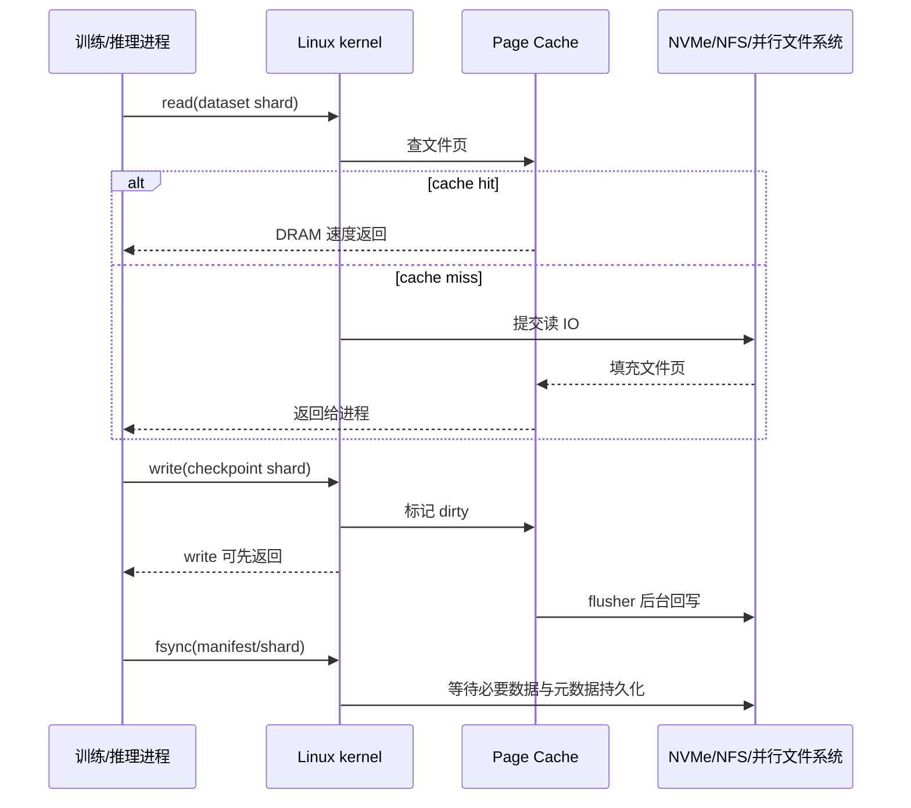

# 第 0b2 章：Page Cache、脏页回写与 Huge Pages

> **关联章节**：本章是 [第 0b 章](./0b-memory-virtual-memory-and-io.md) 的 Page Cache 与大页拆分篇。虚拟地址、page fault 和 TLB 基础见 [0b1](./0b1-virtual-memory-page-tables-and-tlb.md)，文件系统内部机制见 [0c](./0c-filesystems-and-storage-internals.md)，NUMA、PCIe、DMA 与 pinned memory 见 [0b3](./0b3-numa-pcie-dma-and-pinned-memory.md)。

## 1. 第一性原理拆解 + 学习大纲

### 拆 — 不可化简的问题

磁盘、网络文件系统和对象存储远慢于 DRAM，但训练和推理会反复读取 dataset shard、模型权重、tokenizer、索引、embedding table、feature cache 和 checkpoint。不可化简的问题是：

**内核必须用 DRAM 缓存文件数据来吸收慢存储的延迟，同时又要把写入安全地回写到持久介质；这套机制提升平均吞吐，但会制造缓存命中假象、dirty page 尾延迟、回写抖动和恢复语义陷阱。**

大页问题来自另一侧：4 KiB page 对通用系统友好，但大数组、大 mmap 文件、CPU embedding、KV cache 索引和 serving arena 会产生大量页表项和 TLB miss。Huge Pages 能减少地址转换成本，但 THP 的自动合并、拆分和内存 compaction 也可能带来延迟尖峰。

### 推 — 从这个问题如何推导出每个机制

从“读文件可能重复”推出 Page Cache；从“顺序读可以提前猜”推出 readahead；从“多个作业共享同一台机器”推出 Page Cache 污染与回收；从“写入不能每次同步落盘”推出 dirty page 和后台回写；从“恢复逻辑不能看到半成品”推出 `fsync()`、`rename()` 和 manifest 协议；从“大内存映射导致 TLB 压力”推出 THP、HugeTLB 和 allocator 策略。

### 绘 — 因果链路



### 导 — 读完本章你应该能回答

1. 为什么 dataset 第二轮读取变快通常是 Page Cache，而不是模型或 DataLoader 变快？
2. Page Cache、应用级缓存、对象存储客户端缓存分别解决什么问题？
3. `write()` 返回和数据真正持久化有什么区别？
4. `vm.dirty_ratio` 为什么会让 checkpoint 前半段很快、后半段突然卡住？
5. checkpoint 为什么需要临时文件、manifest、`rename()` 和父目录 `fsync()`？
6. THP `always`、`madvise`、`never` 和 HugeTLB 分别适合什么场景？
7. Huge Pages 解决 TLB 压力，不解决哪些内存和 IO 问题？

## 2. Page Cache：空闲内存不是浪费

Linux 会用空闲 DRAM 缓存文件页。`free -h` 里 `buff/cache` 不是浪费，而是可回收缓存。训练读取 dataset 时，第一轮可能受 NVMe、NFS、并行文件系统或对象存储 gateway 限制；第二轮如果命中 Page Cache，会接近内存速度。

关键点是：Page Cache 缓存的是“文件内容对应的页”，不是 Python object、样本解码结果、token tensor 或 GPU tensor。它能让“再读同一个文件 byte range”变快，但不能替代 dataset index、样本级 cache、tokenization cache 或业务版本控制。

| 现象 | 可能原因 | 验证方式 |
|------|----------|----------|
| 第二轮 epoch 明显更快 | Page Cache 命中 | 对比 drop cache 前后吞吐、看 major fault 和存储读带宽 |
| 首次模型加载慢，重启进程后快 | 权重文件仍在 Page Cache | `vmtouch` / `mincore` / 读带宽对比 |
| 多作业互相影响读性能 | Page Cache 被污染或被内存压力回收 | `sar -B`、`pgscan/pgsteal`、`Active(file)`/`Inactive(file)` |
| synthetic data 很快，真实数据慢 | synthetic 绕过了文件 IO 路径 | 切真实 dataset profile，并记录存储与 page fault |
| `mmap` 数据集第一次访问卡顿 | page fault 触发按需读入 | `perf stat` 看 major fault，`sar -B` 看 fault/reclaim |

常用观察：

```bash
free -h
vmstat 1
sar -B 1
pidstat -r -p <pid> 1
cat /proc/meminfo | egrep 'Cached|Dirty|Writeback|Active\(file\)|Inactive\(file\)'
```

### 2.1 文件页、匿名页和 buffer/cache 术语

Linux 内存大致可以先分成两类：

| 类型 | 典型来源 | 是否容易回收 | AI 场景 |
|------|----------|--------------|---------|
| Anonymous page | heap、stack、匿名 mmap | 需要 swap 或释放进程内存 | Python 对象、CPU tensor、allocator arena |
| File-backed page | 文件 `read()` 或 `mmap` | 干净页可直接丢弃，脏页需先回写 | dataset shard、权重文件、checkpoint |
| Slab / kernel memory | inode、dentry、网络、驱动结构 | 依类型而定 | 大量小文件会放大 inode/dentry cache |
| Page table | 地址转换结构 | 随映射规模增长 | 大 mmap、大进程地址空间 |

`buffer cache` 和 `page cache` 在现代 Linux 里经常被一起讨论。你在 `free -h` 看到的 `buff/cache` 不是一个单独的应用缓存池，而是包含文件页、block buffer、部分 slab 等可回收内存。排障时不要只看 `free` 列，要看 `available`、`Cached`、`Active(file)`、`Inactive(file)`、`Dirty` 和 `Writeback`。

```bash
grep -E 'MemAvailable|Cached|Buffers|Active\(file\)|Inactive\(file\)|SReclaimable|Dirty|Writeback' /proc/meminfo
```

判断方向：

- `Cached` 很高、存储读带宽很低、第二轮快：大概率 Page Cache 命中；
- `Active(file)` 高、`Inactive(file)` 快速下降：文件页正在被访问或回收；
- `SReclaimable` 很高：可能是 inode/dentry/slab，而不是纯文件数据；
- `Dirty` 和 `Writeback` 高：写路径正在积压，读变慢可能是存储队列被回写占满。

### 2.2 `read()` 路径：cache hit、cache miss 与 readahead

一次普通 `read(fd, buf, len)` 可以拆成：

```text
用户态 read()
  -> 内核按文件 offset 找 Page Cache
  -> 命中: copy_to_user()
  -> 未命中: 提交 block/filesystem IO
  -> IO 完成后填充 Page Cache
  -> copy_to_user()
```

顺序读时，内核会做 readahead：当它发现进程按顺序访问文件，就提前把后续页读进 Page Cache。训练读取 tar shard、Parquet row group、WebDataset shard、safetensors 权重文件时，如果访问模式足够顺序，readahead 可以把存储吞吐打满；如果样本访问随机、文件很碎、压缩块很小或多个 worker 交错 seek，readahead 效果会下降。

可调和可观测工具：

```bash
blockdev --getra /dev/nvme0n1
lsblk -o NAME,RA,SIZE,TYPE,MOUNTPOINT
cat /sys/block/nvme0n1/queue/read_ahead_kb
```

应用可以给内核提示：

```c
posix_fadvise(fd, 0, 0, POSIX_FADV_SEQUENTIAL);
posix_fadvise(fd, 0, 0, POSIX_FADV_RANDOM);
posix_fadvise(fd, offset, length, POSIX_FADV_WILLNEED);
posix_fadvise(fd, offset, length, POSIX_FADV_DONTNEED);
```

这些提示不是强制命令。`SEQUENTIAL` 和 `WILLNEED` 帮助预读；`RANDOM` 可以避免错误预读；`DONTNEED` 常用于大顺序扫描结束后降低 Page Cache 污染。平台层做 dataset reader 时，应该让访问模式和 fadvise 策略一致：顺序 shard 用顺序提示，随机小文件不要假装顺序流。

### 2.3 `mmap` 路径：page fault 不是异常，而是加载机制

`mmap` 文件后，进程拿到的是一段虚拟地址范围。第一次访问某个尚未在内存里的文件页时，CPU 触发 page fault，内核再把对应文件页读进 Page Cache，并把虚拟地址映射到物理页。这里的 page fault 是正常加载路径。

```text
mmap(file)
  -> 只建立虚拟地址范围
访问 addr
  -> page fault
  -> 查 Page Cache / 提交 IO
  -> 建 PTE
  -> 指令重试
```

适合 `mmap` 的场景：

- 大文件随机读，应用希望由内核按需加载；
- 权重文件或索引文件有固定布局；
- 多进程共享同一文件映射，减少重复拷贝；
- 读取代码能处理访问时延，而不是把所有延迟堆到 `mmap()` 调用处。

不适合盲目 `mmap` 的场景：

- 访问模式高度随机且工作集远大于内存，major fault 会成为主瓶颈；
- 延迟敏感服务在请求路径第一次触碰冷页；
- 网络文件系统上 page fault 延迟不稳定；
- 需要精确控制 IO 并发、重试、超时和 backpressure。

观察 `mmap` 冷页：

```bash
perf stat -e page-faults,minor-faults,major-faults -p <pid> -- sleep 10
sar -B 1
grep -E 'Rss|Pss|Shared_Clean|Private_Clean|Referenced' /proc/<pid>/smaps_rollup
```

major fault 代表需要从存储读取；minor fault 通常代表页已经在内存中，只需要建立映射或处理 COW。二者差别直接影响 dataset reader 和 serving warmup 的解释。

### 2.4 Page Cache 回收：inactive、active、refault

Page Cache 不是无限缓存。内核会把文件页放在 active/inactive LRU 类似结构中，内存压力来时优先回收不常用的干净 file page。脏 file page 不能直接丢弃，必须先进入 writeback。

简化模型：

```text
冷文件页 -> Inactive(file)
重复访问 -> Active(file)
内存压力 -> scan inactive
干净页 -> reclaim
脏页 -> writeback 后 reclaim
刚被回收又被访问 -> refault
```

排查多作业互相污染 Page Cache 时，重点看：

```bash
grep -E 'pgscan|pgsteal|workingset_refault|workingset_activate|pgmajfault' /proc/vmstat
sar -B 1
```

如果 `workingset_refault_file` 或 major fault 增长明显，同时存储读带宽升高，说明工作集可能大于可用 Page Cache，或者另一个作业正在把你的热文件页挤掉。此时盲目增加 DataLoader worker 可能更糟，因为更多并发只会制造更多随机读和缓存竞争。

### 2.5 Page Cache 与 direct IO 的边界

Buffered IO 经过 Page Cache；direct IO 试图绕过 Page Cache，直接在用户 buffer 和存储之间传输。数据库、部分 checkpoint writer 或高性能存储客户端可能使用 `O_DIRECT`，避免污染 Page Cache 或减少一次拷贝。

| 模式 | 优点 | 成本 | 适用场景 |
|------|------|------|----------|
| Buffered IO | 简单、自动缓存、readahead/writeback | 可能污染缓存，写入延迟被推迟 | dataset 顺序读、普通权重加载 |
| Direct IO | 减少缓存污染，延迟更贴近真实存储 | 对齐要求、应用要管理缓存和并发 | 数据库、特定 checkpoint、benchmark |
| `mmap` | 按需加载，多进程共享自然 | page fault 延迟隐蔽 | 大索引、权重映射、只读共享数据 |

排查时要先确认路径。否则你可能用 Page Cache 的假设解释一个 direct IO 程序，或者用 direct IO benchmark 评估 buffered dataset reader。

```bash
strace -f -e trace=openat,read,pread64,mmap,fcntl -p <pid>
lsof -p <pid> | head
```

## 3. Dataset 读取案例：第二轮 epoch 变快

现象：一个图像训练任务第一轮 epoch 需要 42 分钟，第二轮只要 18 分钟。团队以为是 DataLoader worker warmup 或模型 kernel autotune，但 GPU 利用率第一轮低、第二轮高。

验证步骤：

```bash
free -h
cat /proc/meminfo | egrep 'Cached|Active\(file\)|Inactive\(file\)'
iostat -xz 1
perf stat -e major-faults,minor-faults -p <pid> -- sleep 30
```

典型结果：

| 指标 | 第一轮 | 第二轮 | 解释 |
|------|--------|--------|------|
| 存储读带宽 | 3.5 GiB/s | 200 MiB/s | 第二轮大部分命中 Page Cache |
| major faults | 持续增长 | 接近 0 | 冷文件页已经在内存 |
| `Cached` | 持续上升 | 稳定高位 | dataset shard 被缓存 |
| GPU 利用率 | 55% | 92% | 第一轮被 IO 喂数限制 |

更严谨的对比需要控制变量。单机实验可以在测试环境执行：

```bash
sync
echo 3 | sudo tee /proc/sys/vm/drop_caches
```

不要在生产训练机随便 drop cache，这会影响同机所有作业。更好的方式是用新机器、隔离 cgroup、不同 dataset 副本或冷启动窗口做对比。

工程结论：

- 如果第二轮快来自 Page Cache，不能把它当成真实冷启动吞吐；
- benchmark 应分别报告 cold-cache 和 warm-cache；
- dataset 存储容量规划要按 cold-cache 能力设计；
- 多租户机器需要控制 cache 污染，尤其是大顺序扫描任务；
- serving warmup 要显式预热权重和索引，不能依赖“碰巧还在 Page Cache”。

## 4. 多作业污染 Page Cache：不是谁读得多谁就该赢

Page Cache 是全机资源。两个训练作业在同一台机器上运行时，一个大顺序扫描可能把另一个作业的热 shard 或权重文件挤掉。症状经常表现为“明明数据在本地 NVMe，偶尔 batch latency 还是很高”。

排查路径：

```bash
grep -E 'MemAvailable|Cached|Active\(file\)|Inactive\(file\)' /proc/meminfo
grep -E 'pgscan|pgsteal|workingset_refault|pgmajfault' /proc/vmstat
iostat -xz 1
pidstat -d -r 1
```

判断：

- `pgscan`、`pgsteal` 增长快：内核正在回收页；
- `workingset_refault_file` 增长快：刚回收的文件页又被访问，说明缓存工作集被挤压；
- `iostat` 读带宽和 `await` 同时升高：回收到冷页后重新读存储；
- 某个 job `pidstat -d` 读 IO 明显高于其他 job：可能是污染源。

治理手段：

| 手段 | 作用 | 注意 |
|------|------|------|
| 数据分片本地化 | 减少跨 job 读取同一盘 | 需要调度器知道数据位置 |
| 顺序扫描后 `POSIX_FADV_DONTNEED` | 降低一次性扫描污染 | 只适合不会马上复用的数据 |
| 限制并发 worker | 降低随机读和缓存 churn | 需要和 GPU 利用率一起调 |
| per-job cache 目录 | 把业务缓存从 Page Cache 策略中分离 | 仍然占用底层文件页 |
| 冷热分层 | 热索引/小文件放本地 NVMe | 需要版本和淘汰策略 |

不要把 Page Cache 当成租户隔离机制。它缺少作业级命中率、优先级和硬配额语义。平台要做稳定性，应该在调度、数据布局、应用 cache 和存储 QoS 上共同处理。

## 5. 脏页回写：`write()` 快不等于落盘快

`write()` 通常把用户数据拷到 Page Cache 并标记 dirty，然后返回。后台 flusher 线程再把 dirty page 回写到存储。`fsync()`、`fdatasync()`、文件关闭、内存压力、dirty 超阈值都可能触发等待。

写路径简化如下：

```text
write(fd, buf)
  -> copy_from_user 到 Page Cache
  -> 标记 page dirty
  -> 返回给应用

后台:
  dirty page 到达阈值或过期
  -> flusher 提交 writeback
  -> 存储完成
  -> page 从 Dirty 变为 clean

fsync(fd):
  -> 等待该文件必要 dirty data 和元数据落盘
  -> 返回后应用才有持久化语义
```

关键参数：

| 参数 | 含义 | 工程建议 |
|------|------|----------|
| `vm.dirty_background_ratio` | 后台开始回写的内存比例 | 大内存机器上比例可能过大 |
| `vm.dirty_ratio` | 进程可能被强制同步回写的上限 | checkpoint 机器建议用 bytes 更可控 |
| `vm.dirty_background_bytes` | 用字节指定后台阈值 | 适合固定平台基线 |
| `vm.dirty_bytes` | 用字节指定强制阈值 | 控制最坏 dirty 积压 |
| `dirty_expire_centisecs` | 脏页多久后应被写回 | 太大可能制造长尾，太小会增加写放大 |
| `dirty_writeback_centisecs` | flusher 周期 | 影响后台回写节奏 |

例子：512 GiB 内存机器上，`dirty_ratio=20` 理论允许约 102 GiB 脏页。一个 80 GiB checkpoint 可能先以 DRAM 速度写入，看起来非常快；当 dirty 接近阈值或 `fsync()` 到来时，进程突然等待真实存储吞吐。

```bash
sysctl vm.dirty_ratio vm.dirty_background_ratio vm.dirty_bytes vm.dirty_background_bytes
sysctl vm.dirty_expire_centisecs vm.dirty_writeback_centisecs
watch -n1 "grep -E 'Dirty|Writeback' /proc/meminfo"
iostat -xz 1
```

### 5.1 dirty page 生命周期

一个 checkpoint shard 从应用 buffer 到持久介质，至少经历这些状态：

```text
用户态 buffer
  -> Page Cache dirty page
  -> writeback in-flight
  -> storage volatile cache / device queue
  -> persistent media
```

其中每一段都可能让“看起来写完”和“真的可恢复”产生差异：

- `write()` 返回：只说明内核接收了数据，通常不代表持久化；
- `close()` 返回：不等于可靠 checkpoint 协议，错误处理也容易被忽略；
- `fsync()` 返回：针对文件数据和必要元数据提供更强语义；
- `rename()` 原子：保证目录项切换原子，不保证新文件内容已经落盘；
- 父目录 `fsync()`：保证 rename 这个目录项更新在崩溃后可见。

这部分文件系统细节会在 0c 展开。本章要记住的是：dirty writeback 决定 checkpoint 的尾延迟，`fsync` 决定恢复语义是否可信。

### 5.2 `balance_dirty_pages`：为什么应用会突然被 throttle

当 dirty page 积压超过阈值，内核不能继续让进程无限把 DRAM 填成脏页。`balance_dirty_pages` 会让正在写的进程放慢，等待后台 writeback 追上。于是日志里常见这样的形态：

```text
0-70 GiB: write() 很快，吞吐像内存
70-90 GiB: Dirty 接近阈值
90 GiB 后: 训练进程被 throttle，吞吐掉到真实存储速度
fsync(): 再等待剩余 dirty/writeback
```

这不是“最后几个文件更慢”，而是前面把债务记在 Page Cache，后面集中还。

观测：

```bash
grep -E 'nr_dirty|nr_writeback|nr_writeback_temp|pgpgout|pgmajfault' /proc/vmstat
watch -n1 "grep -E 'Dirty|Writeback|WritebackTmp' /proc/meminfo"
iostat -xz 1
```

如果你看到 `Dirty` 快速上涨、`Writeback` 持续不低、磁盘 `util` 接近 100%、`await` 升高，说明回写已经变成系统瓶颈。此时继续提高 checkpoint 并发只会扩大积压。

### 5.3 ratio 与 bytes：大内存机器上不要只用比例

`dirty_ratio=20` 在 64 GiB 机器上约 12.8 GiB，在 1 TiB 机器上约 204 GiB。比例参数在大内存训练节点上会把 dirty 积压放得太大，导致回写长尾和故障恢复窗口都变长。

更可控的做法是用 bytes：

```bash
sudo sysctl vm.dirty_background_bytes=$((8 * 1024 * 1024 * 1024))
sudo sysctl vm.dirty_bytes=$((24 * 1024 * 1024 * 1024))
```

这不是通用推荐值，只是说明量级。合理值要根据存储吞吐、checkpoint 大小、允许的 step time 尖刺和同机作业数量决定。一个实用估算：

```text
允许回写尾延迟 <= dirty_bytes / 稳态写吞吐
```

如果节点实际稳定写吞吐是 3 GiB/s，而你允许 checkpoint 尾部最多多等 8 秒，那么 dirty 上限不应远高于 24 GiB。否则延迟债务必然在某个时间点出现。

### 5.4 容器与 cgroup：看起来是同一个内核，账却不总是直观

容器共享宿主机 Page Cache 和 writeback 机制。即使进程在容器里，文件页仍然属于宿主机内核管理；不同 cgroup、不同内核版本和不同文件系统上的 memory/writeback 记账细节会影响你看到的指标。

排障时同时看容器和宿主机：

```bash
cat /sys/fs/cgroup/memory.current
cat /sys/fs/cgroup/memory.stat | egrep 'file|anon|inactive_file|active_file|dirty|writeback'
cat /proc/meminfo | egrep 'Cached|Dirty|Writeback'
```

常见误判：

- 容器内 `free -h` 看起来还有内存，但 cgroup `memory.max` 已经接近；
- 宿主机 Page Cache 被其他 job 挤压，单个容器指标看不出污染源；
- checkpoint 写入让宿主机 `Dirty` 升高，影响同机读任务；
- 容器 memory limit 太紧，导致 file cache 无法形成稳定工作集。

平台层要把宿主机指标、cgroup 指标和作业指标放在同一张时间线上，否则很容易把全机回写抖动误判成单个训练脚本问题。

## 6. Checkpoint 写入语义：临时文件、`fsync`、`rename`

正确 checkpoint 不只是“写完几个文件”。恢复逻辑不能看到半成品，也不能把某个 rank 的新 shard 和另一个 rank 的旧 shard 混在一起。常见协议：

```text
for each rank:
  write checkpoint.step.tmp/rank-00023.tmp
  fsync(rank shard)
  rename rank-00023.tmp -> rank-00023.bin

coordinator:
  write manifest.step.tmp
  fsync(manifest.step.tmp)
  rename manifest.step.tmp -> manifest.step.json
  fsync(checkpoint directory)
  update latest.tmp
  fsync(latest.tmp)
  rename latest.tmp -> latest
  fsync(checkpoint directory)
```

manifest 至少应该包含：

| 字段 | 作用 |
|------|------|
| step / global_step | 恢复点身份 |
| rank 数量和 shard 列表 | 防止缺 shard |
| 每个 shard 的 size / checksum | 防止截断或混入旧文件 |
| 模型、优化器、scheduler 版本 | 防止代码和状态不匹配 |
| 写入完成时间和 producer id | 排查多 job 覆盖 |

### 6.1 为什么只写 `latest` 不够

很多系统会用 `latest` 指向最新 checkpoint。如果多个 rank 同时写，或者 coordinator 在 rank 完成前更新 `latest`，恢复进程可能读到半成品。

危险协议：

```text
rank0 写 shard
rank1 写 shard
rank2 还没写完
latest -> step-1000
恢复进程看到 latest，开始读取 step-1000
```

安全协议要让 `latest` 只指向已经通过 manifest 校验的 step。恢复逻辑也不能只相信目录名，要读取 manifest 并校验 shard 数量、大小、checksum 和训练配置。

### 6.2 崩溃矩阵

| 崩溃点 | 目录里可能看到什么 | 恢复策略 |
|--------|--------------------|----------|
| shard tmp 写到一半 | `rank-00001.tmp` | 忽略 tmp，清理或后台 GC |
| shard 已 rename，manifest 未提交 | 完整 shard，但无 manifest | 不作为可恢复 checkpoint |
| manifest tmp 写完但未 rename | `manifest.step.tmp` | 忽略 tmp |
| manifest rename 后父目录未 fsync | 崩溃后目录项可能丢失 | 使用上一个完成 checkpoint |
| latest 更新前崩溃 | 新 step 存在但 latest 指旧 step | 可由扫描器补录，但在线恢复用 latest |
| latest 更新后崩溃 | latest 指向新 manifest | 校验 manifest 后恢复 |

核心原则：恢复路径只消费“已提交 manifest”，不从临时文件和目录猜测状态。

### 6.3 checkpoint storm：所有 job 同时写就是集群级抖动

如果 200 个训练 job 都每 30 分钟 checkpoint，一旦它们从同一调度周期启动，就会形成 checkpoint storm。单机 dirty page、共享文件系统 metadata server、对象存储 gateway、网络链路都会同时被打满。

缓解手段：

| 手段 | 解决的问题 | 代价 |
|------|------------|------|
| checkpoint jitter | 避免整点同时写 | 恢复点间隔不再完全一致 |
| token bucket | 控制集群同时写入量 | 需要平台调度器参与 |
| 分 rank 限速 | 避免单 job 打满节点 IO | checkpoint wall time 可能变长但更稳定 |
| 本地落盘后异步归档 | 把训练阻塞从远端存储解耦 | 本地盘容量和故障域要设计 |
| 分层保留策略 | 减少长期 checkpoint 数量 | 恢复点选择变少 |

对训练平台来说，稳定的 45 秒 checkpoint 往往比偶尔 15 秒、偶尔 5 分钟更好，因为它让调度、SLO 和故障恢复都可预测。

## 7. Huge Pages：降低地址转换压力

4 KiB page 面对几十 GB 大数组会产生大量页表项。2 MiB huge page 可以减少 TLB miss 和 page walk。这里要和 0b1 的 TLB 基础衔接：Huge Pages 不让内存访问“跳过 DRAM”，它只减少虚拟地址到物理地址转换的开销。

| page size | 覆盖 1 GiB 内存需要的页数 | 典型影响 |
|-----------|--------------------------|----------|
| 4 KiB | 262144 | 页表大，TLB 覆盖范围小 |
| 2 MiB | 512 | TLB 覆盖范围大幅增加 |
| 1 GiB | 1 | 极低页表压力，但分配和预留更苛刻 |

观察：

```bash
cat /sys/kernel/mm/transparent_hugepage/enabled
cat /sys/kernel/mm/transparent_hugepage/defrag
grep -E 'AnonHugePages|ShmemPmdMapped|FilePmdMapped' /proc/<pid>/smaps_rollup
perf stat -e dTLB-loads,dTLB-load-misses -p <pid> -- sleep 10
```

### 7.1 THP：自动大页不是免费午餐

Transparent Huge Pages 会尝试把合适的 4 KiB 页合并成 2 MiB 页，或者在 fault 时直接分配 huge page。常见模式：

| 模式 | 含义 | 适合 | 不适合 |
|------|------|------|------|
| `always` | 尽量自动使用 THP | 全量小型嵌入式 / 桌面工作负载 | **大内存 GPU 节点（≥128GB）、训练任务、推理服务、所有要求 P99 稳定的场景** |
| `madvise` | 只有应用标记区域才使用 THP | **AI / 训练 / 推理生产节点的推荐默认值**：allocator、PyTorch arena、CUDA pinned 区域显式申请 | — |
| `never` | 禁用 THP | 严格低延迟（≤ 1ms p99）服务、内存碎片极敏感环境 | 长期吞吐型批处理 |

`defrag` 控制 THP 分配时是否做内存整理。内存 compaction 可能让单次分配或 page fault 等待更久，从而制造 p99/p999 延迟尖刺。

> [!DANGER]
> **不要在大内存 GPU 节点上盲目设 `always`。** 512GB+ 内存的训练/推理节点上，THP `always` 配合 `defrag=always` / `madvise` 模式时，`khugepaged` 后台合并 + page fault 路径上的 sync compaction 会触发 100ms-1s 量级的 stall，直接表现为 training step time 抖动、推理 P99 飙高。生产 AI 平台的实际经验：**默认 `madvise` + `defrag=defer+madvise` 是最安全的起点**，再由应用对明确的大连续区域显式 `madvise(MADV_HUGEPAGE)`。

> [!WARNING]
> **诊断 THP 引起的卡顿**：观察 `/proc/vmstat` 的 `compact_stall`、`compact_fail`、`thp_collapse_alloc_failed`、`thp_split_page` 计数随时间的增量；同时把 `khugepaged` 的 CPU 占用纳入监控。如果训练 step 延迟 spike 与 `compact_stall` 增长强相关，应立刻把 `enabled` 切到 `madvise`、`defrag` 切到 `defer+madvise` 或 `never`。

> [!TIP]
> **真正需要确定性大页的场景用 HugeTLB（`hugetlbfs`）而不是 THP**：`hugetlbfs` 由管理员预留固定数量的 2 MiB / 1 GiB 页，应用通过 `mmap(... MAP_HUGETLB)` 或 `shmget(... SHM_HUGETLB)` 显式申请。这条路径完全绕开 `khugepaged` 和 compaction，没有运行时合并/拆分的延迟尖峰。代价是预留的内存被永久 lock 住，不能再被普通 4 KiB 分配使用。

```bash
cat /sys/kernel/mm/transparent_hugepage/enabled
cat /sys/kernel/mm/transparent_hugepage/defrag
cat /sys/kernel/mm/transparent_hugepage/khugepaged/pages_collapsed
```

`khugepaged` 是后台扫描并合并 huge page 的线程。它能提升长期吞吐，但扫描、合并和拆分也会消耗 CPU。排障时要把 THP 状态变化和请求延迟放在同一时间线看。

### 7.2 `madvise(MADV_HUGEPAGE)`：把策略交给应用标记

`madvise` 模式常用于折中：系统默认不激进合并，应用只对明确的大连续内存区域请求 THP。

```c
void *p = mmap(NULL, length, PROT_READ | PROT_WRITE,
               MAP_PRIVATE | MAP_ANONYMOUS, -1, 0);
madvise(p, length, MADV_HUGEPAGE);
```

适合标记的区域：

- 大 batch 预处理 buffer；
- CPU 侧 embedding table 或 feature table；
- serving 进程长期存在的大 arena；
- 大只读索引或模型辅助结构；
- 确认访问局部性好、生命周期长的匿名内存。

不适合标记的区域：

- 大量短生命周期小对象；
- 内存布局碎片化严重的 heap；
- 请求路径临时 buffer；
- 工作集经常被回收或 split 的区域。

Python/ML 框架通常不会让你直接对每个 tensor 调 `madvise`，但 allocator、runtime、C++ extension 或服务框架可以在大 arena 层做这件事。是否值得做，要用 TLB miss 和 p99 latency 证明。

### 7.3 HugeTLB：预留带来确定性，也带来容量约束

HugeTLB 是显式预留的大页池。它比 THP 更确定，因为页面预先保留，不依赖运行时 compaction；代价是运维复杂，预留过多会减少普通内存。

查看和配置：

```bash
grep -i huge /proc/meminfo
sysctl vm.nr_hugepages
mount | grep hugetlbfs
```

典型使用方式：

```bash
sudo sysctl vm.nr_hugepages=4096
sudo mkdir -p /mnt/huge
sudo mount -t hugetlbfs none /mnt/huge
```

4096 个 2 MiB huge page 约等于 8 GiB。这个池子不是普通 Page Cache 可以随便借用的内存，预留太多会让系统在普通分配、文件缓存和容器调度上更紧张。

适合 HugeTLB 的场景：

- 数据库 buffer pool；
- 低延迟服务的长期大内存 arena；
- DPDK/RDMA 等明确要求 pinned/hugepage 的用户态 IO；
- 少数通信缓冲或共享内存区域；
- 能接受固定容量规划的 CPU 侧大数组。

不适合 HugeTLB 的场景：

- 动态大小、不确定生命周期的普通训练张量；
- 依赖 Page Cache 的 dataset 读取；
- GPU HBM 内部访问；
- 内存紧张且作业频繁变化的多租户节点。

### 7.4 Huge Pages 的收益如何证明

不要因为“模型很大”就打开 huge page。要先证明瓶颈在地址转换，而不是 IO、内存带宽、锁竞争、Python overhead 或 GPU 同步。

测量路径：

```bash
perf stat -e cycles,instructions,dTLB-loads,dTLB-load-misses,dtlb_load_misses.walk_completed -p <pid> -- sleep 30
grep -E 'AnonHugePages|FilePmdMapped|ShmemPmdMapped|THPeligible' /proc/<pid>/smaps_rollup
```

如果启用 huge page 后：

- dTLB miss rate 明显下降；
- CPU cycles 或请求 p99 下降；
- `AnonHugePages` 上升；
- 没有新增 compaction 延迟尖刺；

才说明它对你的 workload 有意义。若只看到 `AnonHugePages` 增加，但吞吐和延迟没变，说明原瓶颈不在 TLB。

## 8. Worked Example：checkpoint 后半段突然卡住

现象：8 卡训练每 30 分钟写一次 120 GiB checkpoint。日志显示前 70 GiB 写入只用 8 秒，后 50 GiB 卡了 55 秒，期间所有 rank 等待 checkpoint 完成，GPU 利用率掉到 0。

排查：

```bash
watch -n1 "grep -E 'Dirty|Writeback' /proc/meminfo"
iostat -xz 1
sysctl vm.dirty_ratio vm.dirty_background_ratio vm.dirty_bytes vm.dirty_background_bytes
grep -E 'nr_dirty|nr_writeback|pgpgout' /proc/vmstat
```

发现：

| 指标 | 现象 | 解释 |
|------|------|------|
| `Dirty` | 从 5 GiB 快速涨到 90 GiB | 前半段只是写入 Page Cache |
| `Writeback` | 长时间保持高位 | flusher 正在追赶 |
| NVMe / 文件系统吞吐 | 稳态 2.2 GiB/s | 真实落盘能力低于瞬时写入 |
| GPU 利用率 | checkpoint 期间掉到 0 | 所有 rank 被同步点阻塞 |

前半段快只是写入 Page Cache，不是真实落盘。后半段卡住是 dirty 阈值和 `fsync()` 把延迟债务集中暴露。

修复：

1. 每 rank 写独立 shard，减少锁和单文件扩展争用；
2. `vm.dirty_background_bytes` 设到 8 GiB，`vm.dirty_bytes` 设到 24 GiB；
3. checkpoint writer 做并发限制，避免 8 个 rank 同时打满同一设备；
4. 使用 `tmp -> fsync -> rename -> manifest -> fsync dir -> latest` 协议；
5. 本地 NVMe 完成后后台归档到对象存储；
6. 集群层给 checkpoint 加 jitter，避免多 job 同时写。

验收：

| 指标 | 修复前 | 修复后 |
|------|--------|--------|
| checkpoint wall time | 63 秒 | 31 秒 |
| 最大 Dirty | 90 GiB | 24 GiB |
| step time p99 | 高且不稳定 | 可预测 |
| 恢复校验 | 依赖目录扫描 | 依赖 manifest checksum |

## 9. Worked Example：THP 打开后 serving p99 变差

现象：CPU serving 服务加载 80 GiB embedding 和若干索引后，开启 THP `always`，平均吞吐提升 4%，但 p99 从 35 ms 增加到 120 ms，偶尔出现 500 ms 尖刺。

排查：

```bash
cat /sys/kernel/mm/transparent_hugepage/enabled
cat /sys/kernel/mm/transparent_hugepage/defrag
grep -E 'compact|thp|pgscan' /proc/vmstat
perf stat -e dTLB-loads,dTLB-load-misses -p <pid> -- sleep 30
grep -E 'AnonHugePages|THPeligible' /proc/<pid>/smaps_rollup
```

判断：

- dTLB miss 确实下降，说明 THP 有收益；
- p99 尖刺和 compaction / huge page fault 时间相关；
- 服务请求路径会触碰新分配的大内存区域；
- `always` 策略过于激进。

修复：

- 把系统 THP 调成 `madvise`；
- 服务启动阶段预分配并触碰大 arena；
- 只对长期大数组 `MADV_HUGEPAGE`；
- 请求路径避免首次触碰冷页；
- 如果仍需确定性，评估 HugeTLB 预留，但限制容量。

工程结论：THP 是吞吐和尾延迟的权衡。训练批处理可以更积极，在线服务要用 p99/p999 证明策略。

## 10. 观测 SOP：读慢、写卡、大页抖

遇到“数据读取慢”：

```text
1. 看存储读带宽和 await
2. 看 major faults 是否增长
3. 看 Cached / Active(file) / Inactive(file)
4. 看是否有其他 job 引发 pgscan/pgsteal/refault
5. 区分 cold-cache benchmark 和 warm-cache benchmark
```

遇到“checkpoint 后半段卡住”：

```text
1. 看 Dirty / Writeback 是否快速上涨
2. 看 dirty_ratio 是否在大内存机器上过大
3. 看 iostat util/await 是否打满
4. 看 fsync 等待点和 manifest 提交点
5. 降低 dirty bytes、限并发、错峰、异步归档
```

遇到“THP 后延迟抖”：

```text
1. 看 THP enabled/defrag/khugepaged
2. 看 dTLB miss 是否真下降
3. 看 compaction 和 page fault 是否对应 p99
4. 从 always 改 madvise，启动期预热大 arena
5. 必要时用 HugeTLB 换确定性
```

## 11. Checklist

- [ ] 是否区分读缓存命中和真实存储吞吐？
- [ ] benchmark 是否分别报告 cold-cache 与 warm-cache？
- [ ] 是否监控 `Dirty`、`Writeback`、`pgmajfault`、`workingset_refault_file`？
- [ ] checkpoint 是否有原子提交协议和 manifest 校验？
- [ ] 是否用字节阈值而不是比例阈值控制大内存机器上的 dirty page？
- [ ] 多 job checkpoint 是否有 jitter、限速或 token bucket？
- [ ] Page Cache 污染是否用调度、数据布局和 fadvise 共同治理？
- [ ] THP 策略是否符合低延迟或离线训练目标？
- [ ] 是否用 `perf` 验证 TLB miss，而不是盲目开 huge page？
- [ ] HugeTLB 预留是否纳入普通内存、Page Cache 和容器容量规划？

## 12. 练习

1. 设计 5 条命令判断 dataset 第二轮读取变快是否来自 Page Cache，并说明每条命令能排除什么误判。
2. 一台 256 GiB 内存机器 `vm.dirty_ratio=20`，估算 dirty 上限，并解释对 80 GiB checkpoint 的影响。
3. 把 `dirty_ratio` 改成 `dirty_bytes` 的规划题：存储稳定写吞吐 4 GiB/s，允许额外回写等待不超过 10 秒，给出 dirty 上限建议。
4. 写出一个多 rank checkpoint 原子提交协议，要求恢复路径不能看到半成品。
5. 设计一个 checkpoint storm 缓解方案，包含 job 侧、节点侧和集群侧手段。
6. 给出查看 THP 当前策略、某进程 `AnonHugePages`、TLB miss、compaction 指标的命令。
7. 说明 Page Cache、应用级 cache 和对象存储 cache 的差别。
8. 给一个场景说明为什么 THP 提升平均吞吐，却可能恶化 p99。
9. 判断 direct IO benchmark 为什么不能直接代表 buffered dataset reader 的性能。
10. 为一个 100 GiB mmap 索引服务设计启动预热和 p99 验收流程。
