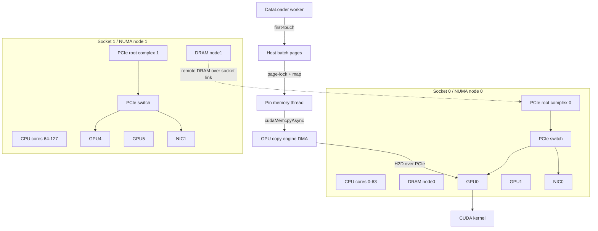

# 第 0b3 章：NUMA、PCIe、DMA 与 Pinned Memory

> **关联章节**：本章是 [第 0b 章](./0b-memory-virtual-memory-and-io.md) 的设备数据路径拆分篇。Page Cache / Dirty Writeback / Huge Pages 见 [0b2](./0b2-page-cache-writeback-and-huge-pages.md)，文件系统和存储栈见 [0c](./0c-filesystems-and-storage-internals.md)，后续第 5b 章会从 AI 数据搬运链路继续展开 Host-Device IO、通信和存储直连。

## 1. 第一性原理拆解 + 学习大纲

### 拆 — 不可化简的问题

单机 AI 服务器看起来像“一台机器插了多张 GPU”，但硬件真实形状不是一个均匀池子。它通常由多个 CPU socket、多个 NUMA node、多个 PCIe root complex、PCIe switch、GPU、NIC、NVMe、IOMMU 和内核页管理共同组成。不可化简的问题是：

**数据必须同时满足“离使用者近、物理页稳定、设备可寻址、拓扑路径不绕远、软件调度不打破 locality”，才可能接近硬件标称带宽。任意一环错位，都会把 H2D、D2H、GPU-GPU、GPU-NIC、GPU-NVMe 路径变成跨 socket、bounce buffer、IOMMU miss、page pinning 等待或同步拷贝。**

这和纯 CPU 内存优化不同。CPU cache miss 主要问“这个 core 访问的 cache line 在哪里”；设备数据路径还要同时问 CPU worker、host page、GPU、NIC、NVMe、root complex、IOMMU、pinned buffer 和 CUDA stream 是否落在同一条合理路径上。

Pinned memory 和 DMA 是这条链路的核心。GPU 不应该让 CPU 逐字节把 batch 写进显存，而应由 DMA engine 直接在 host memory 与 device memory 之间搬运。DMA 要求参与传输的物理页在传输期间不能被换出、迁移或重新映射，所以需要 page-locked / pinned memory。`non_blocking=True` 只是告诉框架“可以尝试异步提交”，真正成立还需要 pinned buffer、正确 stream、可用 copy engine、没有隐式同步、NUMA locality 和足够大的传输粒度。

### 推 — 从这个问题如何推导出每个机制

从“内存访问距离不均匀”推出 NUMA；从“Linux 必须决定页放在哪里”推出 first-touch 和 memory policy；从“设备挂在树上”推出 PCIe topology；从“设备要直接搬内存”推出 DMA；从“设备访问内存也要隔离”推出 IOMMU；从“普通匿名页会移动或换出”推出 pinned memory；从“GPU 与 NIC/NVMe 之间不应绕 host DRAM”推出 GPUDirect RDMA 和 GPUDirect Storage 的 locality 要求。

### 绘 — 从 batch 到 GPU kernel 的路径



### 导 — 读完本章你应该能回答

1. NUMA first-touch、CPU affinity、memory policy 为什么会影响 DataLoader 和 H2D？
2. `nvidia-smi topo -m` 里的 PIX、PXB、PHB、SYS、NV# 大致代表什么距离？
3. DMA、IOMMU、IOVA、pinned memory 分别解决什么问题？
4. PyTorch `pin_memory=True`、`non_blocking=True`、stream 和 copy engine 需要满足哪些条件才有 overlap？
5. pinned memory 为什么可能挤压 Page Cache？
6. GPUDirect RDMA 为什么关心 GPU/NIC locality？

## 2. NUMA：内存不是均匀池

NUMA（Non-Uniform Memory Access）指 CPU 访问不同内存 node 的成本不同。双路服务器中，每个 socket 直接连接一组 DRAM channel。socket0 访问 node0 是本地访问；socket0 访问 node1 要经过 UPI、Infinity Fabric 或类似 socket interconnect。远端访问能工作，但延迟更高、带宽更低，还会占用跨 socket 链路。

AI 任务对 NUMA 敏感，是因为它同时有大量 CPU 端数据准备和设备端 DMA：DataLoader worker 读取、解压、tokenize、augment、collate；pin memory thread 把 batch 转成 pinned buffer；GPU copy engine 从 host memory 通过 PCIe 拉到显存；NCCL 或 RDMA 线程经 NIC 收发梯度、参数或 KV cache。

如果这些线程、内存页、GPU 和 NIC 分布在不同 socket，单个 batch 会走一条很长的路：

```text
worker on socket1
  -> first-touch pages on NUMA node1
  -> GPU0 under socket0 root complex
  -> DMA reads node1 DRAM over socket interconnect
  -> PCIe H2D to GPU0
```

这条路径通常仍然正确，但它消耗远端内存带宽和 socket 间链路。训练 profile 上表现为 GPU 空转、H2D 时间偏高、CPU 利用率不低但吞吐上不去。

### 2.1 first-touch：谁先写，页就倾向在哪

Linux 默认 NUMA 策略通常是 local allocation：进程在哪个 CPU 上首次触碰匿名页，内核就倾向在该 CPU 所属 node 分配物理页。这里“触碰”最关键的是写入，因为 `malloc()` 只是分配虚拟地址范围，不一定马上分配物理页。

一个简化例子：

```python
import numpy as np

# 这一步通常只拿到虚拟地址，不一定分配全部物理页。
x = np.empty((1024, 1024, 1024), dtype=np.uint8)

# 哪个 CPU 执行这次写入，哪些页就可能 first-touch 到它所在的 NUMA node。
x.fill(1)
```

DataLoader 中常见的 first-touch 点包括：

- 解码图片后写入 numpy array；
- tokenizer 写入 token id buffer；
- `collate_fn` 创建并填充 batch tensor；
- `torch.stack()` 产生新的 CPU tensor；
- pin memory thread 把 pageable batch 复制到 pinned batch。

注意最后一项：如果 worker 先在 node1 生成 pageable batch，pin memory thread 又在 node0 复制到新的 pinned buffer，那么最终 H2D 源页可能在 node0；如果 pinning 发生在 worker 侧或复用 worker 创建的 pinned buffer，则 first-touch 位置可能不同。不要只凭代码推断，要用 `numastat`、`numa_maps` 和 profile 验证。

### 2.2 CPU affinity：线程在哪里运行

CPU affinity 控制线程可在哪些 CPU 上运行。它不直接迁移已有内存页，但会影响未来 first-touch、CPU cache locality、DataLoader worker 分布和通信线程调度。

常用命令：

```bash
lscpu -e=CPU,NODE,SOCKET,CORE
numactl -H
taskset -pc <pid>
ps -L -o pid,tid,psr,comm -p <pid>
```

绑定整个进程到 node0 CPU：

```bash
numactl --cpunodebind=0 python train.py
```

绑定到具体 CPU 列表：

```bash
taskset -c 0-31 python train.py
```

对分布式训练，工程上更常见的是按 rank 分组：

```bash
CUDA_VISIBLE_DEVICES=0,1,2,3 \
numactl --cpunodebind=0 --membind=0 \
torchrun --nproc_per_node=4 train.py

CUDA_VISIBLE_DEVICES=4,5,6,7 \
numactl --cpunodebind=1 --membind=1 \
torchrun --nproc_per_node=4 train.py
```

这只是示意。真实部署通常由 launcher 或调度器按本机拓扑生成每个 rank 的 CPU set、memory node、GPU 和 NIC。

### 2.3 memory policy：页应该从哪里分配

CPU affinity 决定线程在哪里跑；memory policy 决定内存从哪里分配。二者相关，但不是一回事。

| 策略 | 命令示例 | 含义 | 风险 |
|------|----------|------|------|
| local 默认 | 无 | 在运行 CPU 附近分配 | 线程漂移会打乱 locality |
| membind | `numactl --membind=0` | 只从 node0 分配 | node0 不足时可能失败或强压回收 |
| preferred | `numactl --preferred=0` | 优先 node0，不足可退让 | 更温和，但 locality 不绝对 |
| interleave | `numactl --interleave=0,1` | 页分散到多个 node | 大顺序 CPU 带宽可能好，H2D locality 通常差 |

查看某进程实际页分布：

```bash
numastat -p <pid>
grep -E 'N[0-9]+=' /proc/<pid>/numa_maps | head
```

`numastat -p` 能快速看进程私有页和文件页在各 node 的分布。`/proc/<pid>/numa_maps` 更细，可以看到每个 VMA 的 policy、页数和 node 分布。排查 DataLoader 时，建议在训练稳定阶段采样，而不是只看启动瞬间。

### 2.4 rank、DataLoader worker 与 NUMA 绑定

一个 rank 不只是一个 Python 主进程，还包含 DataLoader worker、pin memory thread、OpenMP/MKL/oneDNN 线程、NCCL 通信线程、日志和 checkpoint 线程。

这些线程默认可能被 OS 调度到任意 CPU。`num_workers=16` 在双路机器上可能一半 worker 跑到远端 socket，导致 batch 页跨 node。对单机 8 GPU 的常见策略是：

| 资源组 | GPU | CPU node | memory node | NIC rail | DataLoader worker |
|--------|-----|----------|-------------|----------|-------------------|
| group0 | GPU0-GPU3 | node0 cores | node0 | NIC0 | 只在 node0 cores |
| group1 | GPU4-GPU7 | node1 cores | node1 | NIC1 | 只在 node1 cores |

如果每个 rank 一个 GPU，可以让 launcher 给每个 rank 分配更小的 CPU set：rank0-GPU0 用 node0 的一段 cores，rank4-GPU4 用 node1 的一段 cores，原则是不要跨 socket，也不要让多个 rank 抢同一小段 CPU。

PyTorch 原生 DataLoader 没有一个通用参数能把每个 worker 直接绑到指定 CPU set。可以在 `worker_init_fn` 中调用 `os.sched_setaffinity(0, cpus)`，也可以由外层 launcher/cgroup/cpuset 约束整个 rank 及其子进程。生产中要给 NCCL、IO 和 checkpoint 线程留下余量。

自动 NUMA balancing 可以查看：

```bash
cat /proc/sys/kernel/numa_balancing
```

它不能替代显式绑定：GPU DMA 不等价于 CPU load/store，短生命周期 batch 还没迁移就可能传完，pinned 页也不能随意迁移。

## 3. PCIe topology：设备挂在哪里，比设备型号更先决定路径

PCIe 是点对点分层互连。CPU socket 内的 root complex 连接若干 root port，下面可以接 GPU、NIC、NVMe 或 PCIe switch。switch 再向下挂多个 endpoint。树形结构决定两个 endpoint 之间的路径。

简化层级：

```text
CPU socket
  -> PCIe root complex
    -> root port / host bridge
      -> PCIe switch
        -> GPU
        -> NIC
        -> NVMe
```

关键区别是：同一 switch 下的 GPU 和 NIC 路径短，可能支持 P2P；不同 root complex 可能要回到 CPU host bridge；不同 socket 通常要跨 socket interconnect；NVLink 是 GPU-GPU 互连，不等价于 GPU-NIC 或 GPU-NVMe 路径。

### 3.1 Link Gen / Width：理论上限先算清楚

PCIe 带宽由代际和 lane 数决定。常见有效单向带宽近似如下：

| 代际 | x4 | x8 | x16 | 常见意义 |
|------|----|----|-----|----------|
| PCIe 3.0 | ~3.9 GB/s | ~7.9 GB/s | ~15.8 GB/s | 旧 GPU/NVMe 平台 |
| PCIe 4.0 | ~7.9 GB/s | ~15.8 GB/s | ~31.5 GB/s | A100 PCIe、ConnectX-6 常见 |
| PCIe 5.0 | ~15.8 GB/s | ~31.5 GB/s | ~63.0 GB/s | H100/H200 PCIe、400G/800G NIC |
| PCIe 6.0 | ~32 GB/s | ~64 GB/s | ~128 GB/s | 新平台，注意设备与 BIOS 支持 |

这些是链路层有效负载近似，不是应用端一定能拿到的数。H2D 实测低于理论上限，可能来自链路降级、远端 NUMA、copy size 太小、pageable staging、默认 stream 同步、copy engine 排队、switch 上行共享或 IOMMU/驱动路径不理想。

查看 GPU PCIe 状态：

```bash
nvidia-smi -q -d PCI
nvidia-smi -q | egrep -i 'PCI|Link Gen|Link Width'
```

查看具体 BDF：

```bash
nvidia-smi --query-gpu=index,pci.bus_id,name --format=csv
lspci -vv -s <bus:dev.func> | egrep 'LnkCap|LnkSta|DevCtl|ACS'
```

`LnkCap` 是能力上限，`LnkSta` 是当前协商状态。排障时要看 `LnkSta`，因为插槽、电缆、BIOS、retimer、设备降级都可能让实际宽度或代际低于标称。

### 3.2 `nvidia-smi topo -m` 的距离直觉

`nvidia-smi topo -m` 给出 GPU、NIC、CPU affinity 的拓扑摘要。常见标记可以按距离粗略理解：

| 标记 | 粗略含义 | 工程直觉 |
|------|----------|----------|
| PIX | 经过最多一个 PCIe bridge，通常同 switch 近距离 | 近，P2P/GDR 更可能好 |
| PXB | 跨多个 PCIe bridge/switch | 中，可能共享上行 |
| PHB | 跨 PCIe host bridge/root complex | 较远，P2P 可能受限 |
| NODE | 跨 host bridge，但仍在同 NUMA node | 比 SYS 好，仍需验证 |
| SYS | 跨 NUMA node/socket | 远，通信和 H2D 常要避免 |
| NV# | GPU 间有 NVLink，数字表示链路数量或等级 | 只说明 GPU-GPU，不说明 GPU-NIC |

示例输出的读法：

```text
        GPU0    GPU1    GPU4    mlx5_0  mlx5_1  CPU Affinity  NUMA Affinity
GPU0    X       NV4     SYS     PIX     SYS     0-63          0
GPU1    NV4     X       SYS     PIX     SYS     0-63          0
GPU4    SYS     SYS     X       SYS     PIX     64-127        1
mlx5_0  PIX     PIX     SYS     X       SYS
mlx5_1  SYS     SYS     PIX     SYS     X
```

这个拓扑暗示：

- GPU0/GPU1 更适合走 mlx5_0；
- GPU4 更适合走 mlx5_1；
- GPU0 到 GPU4 虽然可能有 NCCL 路径，但跨 socket；
- 让 rank0 使用 GPU0 却绑定 mlx5_1，可能导致 GDRDMA 跨 socket 或 fallback。

### 3.3 root complex、switch、ACS 与 P2P

PCIe Peer-to-Peer 指一个 endpoint 可以直接访问另一个 endpoint 的 BAR 或 memory window，而不必把数据先搬到 host DRAM 再搬到目标设备。GPU-GPU P2P、GPU-NIC GPUDirect RDMA、GPU-NVMe GPUDirect Storage 都和这个能力相关。

P2P 受 switch peer routing、ACS、IOMMU、设备 BAR/ATS/PRI/PASID、内核、NVIDIA 驱动、OFED/rdma-core 和文件系统/存储客户端共同影响。ACS 的目的主要是隔离和访问控制，在虚拟化、多租户或安全敏感环境中可能把 peer traffic redirect 到上游，导致看似同 switch 的设备无法真正 P2P。不要为了一个 benchmark 盲目关闭 ACS/IOMMU；这会影响隔离、安全和运维边界。

NVLink/NVSwitch 只解决 GPU-GPU fabric，不自动改善 H2D、GPU-NIC 或 GPU-NVMe。GPU 间显示 `NV#` 时，仍要单独看 NIC/NVMe 在 PCIe 树上的位置。

## 4. DMA、IOMMU 与 pinned memory：设备访问内存的完整路径

DMA（Direct Memory Access）让设备直接读写内存。H2D 时，GPU copy engine 从 host memory 读取并写入 device memory；D2H 时反过来。CPU 的角色是准备数据、建立映射、提交命令和处理完成事件，而不是执行每个字节的复制。

一个 H2D async copy 的抽象路径：

```text
应用持有 CPU tensor
  -> 确认/创建 pinned host pages
  -> CUDA driver 注册页并建立 DMA/IOMMU 映射
  -> cudaMemcpyAsync 提交 copy descriptor 到 stream
  -> GPU copy engine 按 IOVA/物理映射读取 host pages
  -> PCIe transaction 到 GPU
  -> stream 中后续 kernel 等待 copy 完成
```

### 4.1 pageable memory 为什么麻烦

普通 pageable memory 的页可能尚未实际分配，也可能被换出、迁移、回收或重新映射，物理页也通常不连续。

DMA 不能接受“传到一半源页消失”。因此驱动面对 pageable memory 时，通常需要额外处理。常见路径是：

```text
pageable host buffer
  -> driver 分配 pinned staging buffer
  -> CPU memcpy pageable -> pinned staging
  -> DMA pinned staging -> GPU
```

这个路径能保证正确性，但多了一次 CPU copy，且 `cudaMemcpyAsync` 可能为了 staging 或页处理而同步阻塞。PyTorch 的 `non_blocking=True` 只是允许在条件满足时不阻塞 host，源 buffer 是否 pinned 是关键条件。

### 4.2 pinned/page-locked memory 做了什么

Pinned memory 又叫 page-locked memory。它做的事情可以拆开看：

1. 分配或注册一段 host virtual address；
2. fault in 对应物理页，确保页真实在 RAM 中；
3. 增加页 pin 引用，使其不能被换出或迁移；
4. 为设备建立 DMA 映射，可能经过 IOMMU 生成 IOVA；
5. 在传输结束或 buffer 释放时解除映射和 pin。

CUDA 中 `cudaHostAlloc()` 直接分配 pinned host memory，`cudaHostRegister()` 把已有 host memory 注册为 pinned。PyTorch 的 `pin_memory=True` 和 `tensor.pin_memory()` 本质也是为 H2D 创建更适合 DMA 的 host buffer。Pinned memory 的收益不是“内存本身更快”，而是避免 pageable staging，并让 DMA 可以稳定、异步地访问 host pages。

### 4.3 IOMMU：隔离、地址转换与开销

IOMMU 位于设备 DMA 和物理内存之间。设备发出 IOVA，IOMMU 查表后转成物理地址，并检查权限。它防止设备随意 DMA 到任意物理内存，支持虚拟化和非连续物理页映射，也带来 DMA mapping、IOTLB miss 和 P2P 限制等成本。`iommu=pt` 等 passthrough 模式可能降低转换开销，但会改变隔离属性。

观察 IOMMU 开关和内核参数：

```bash
cat /proc/cmdline
dmesg | egrep -i 'iommu|dmar|amd-vi' | tail -50
find /sys/kernel/iommu_groups -maxdepth 2 -type l | head
```

不要把 IOMMU 简化成“开了就慢，关了就快”。现代平台很多路径在 IOMMU 开启下仍能接近线速；真正要验证的是目标 workload、设备组合和安全要求。

### 4.4 pinned memory 的副作用：锁页不是免费资源

Pinned memory 不能被内核回收，会挤压 Page Cache，增加匿名内存压力，让 compaction 更难，并在多租户中伤害同机其他 job。频繁注册/注销 pinned memory 本身也有成本。

常见限制：

```bash
ulimit -l
cat /proc/<pid>/limits | grep -i locked
cat /sys/fs/cgroup/memory.max 2>/dev/null
cat /sys/fs/cgroup/memory.current 2>/dev/null
```

在容器或 systemd service 中，还可能受 `LimitMEMLOCK`、cgroup memory、Kubernetes securityContext、NVIDIA runtime 配置影响。RDMA 注册内存也会消耗类似资源。平台 SOP 应把 pinned memory 与 Page Cache、dataset reader、checkpoint buffer、NCCL buffer 一起做容量预算。

一个粗略估算：

```text
pinned footprint ~= num_ranks
                   * num_workers_per_rank
                   * prefetch_factor
                   * batch_size_per_worker_bytes
                   * safety_factor
```

PyTorch DataLoader 的实际 footprint 还受 collate、队列、persistent worker、pin memory thread、batch 内对象结构影响。估算只能帮助发现数量级错误，最终仍要看 RSS、locked memory、Page Cache 和吞吐。

## 5. PyTorch H2D：`pin_memory`、`non_blocking`、stream 与 overlap

PyTorch 中最常见写法：

```python
loader = DataLoader(
    dataset,
    batch_size=...,
    num_workers=8,
    pin_memory=True,
    persistent_workers=True,
)

for batch in loader:
    batch = batch.to("cuda", non_blocking=True)
    output = model(batch)
```

这段代码只是最低门槛。要让 H2D 与计算 overlap，需要理解 PyTorch、CUDA stream 和 copy engine 的互动。

### 5.1 DataLoader pinning 路径

典型 DataLoader 多进程路径：

```text
worker process
  -> dataset read/decode/transform
  -> collate_fn builds CPU batch
  -> send batch to main process queue
main process pin_memory thread
  -> copy CPU tensor into pinned memory
training loop
  -> batch.to(cuda, non_blocking=True)
```

注意这里有两次可能的 CPU 端移动：

- worker 到 main process 的 IPC/共享内存路径；
- pageable CPU tensor 到 pinned tensor 的 copy。

`pin_memory=True` 优化的是 host-to-device copy 条件，不自动解决 dataset 读取、解码或 collate 的 CPU 瓶颈。若 CPU preprocessing 已经打满，开启 pinning 可能只把瓶颈从 H2D 转移到 CPU copy 或 worker 队列。

### 5.2 `non_blocking=True` 成立条件

`tensor.to("cuda", non_blocking=True)` 要真正减少 host 阻塞，通常需要源 tensor 在 pinned memory、copy 被提交到 CUDA stream、后续 kernel 有正确 stream 依赖、没有 `.item()` / `torch.cuda.synchronize()` 等隐式同步、copy size 足够大，并且 GPU 有可用 async copy engine。

反例：

```python
for batch in loader:
    batch = batch.to("cuda", non_blocking=True)
    torch.cuda.synchronize()  # 这里把异步收益清掉
    output = model(batch)
```

另一个反例：

```python
loss = model(batch).loss
print(loss.item())  # 每 step 都把 GPU 结果同步回 CPU
```

这类同步会让 timeline 上的 H2D、kernel、D2H 重新串行化。

### 5.3 stream overlap 的正确形状

要让“下一批 H2D”和“当前批计算”重叠，常见做法是使用单独 copy stream，并用 event 建立依赖。

```python
import torch

copy_stream = torch.cuda.Stream()
prefetched = None

def move_to_cuda(batch):
    return batch.to("cuda", non_blocking=True)

iterator = iter(loader)

with torch.cuda.stream(copy_stream):
    prefetched = move_to_cuda(next(iterator))

for cpu_batch in iterator:
    torch.cuda.current_stream().wait_stream(copy_stream)
    batch = prefetched

    with torch.cuda.stream(copy_stream):
        prefetched = move_to_cuda(cpu_batch)

    output = model(batch)
    loss = criterion(output)
    loss.backward()
```

这个例子省略了最后一个 prefetched batch 的处理和复杂 batch 结构递归搬运，只展示依赖关系。核心是 copy stream 搬下一批，compute stream 计算当前批，并且循环中不做全局同步。

### 5.4 copy engine 与 overlap 的硬件边界

GPU 通常有独立 copy engine，但数量和能力取决于型号与模式。H2D 与 kernel overlap 需要 copy engine 和 compute engine 资源独立；多个 stream 不保证无限并行，最终仍会排队到有限 engine；P2P、NVLink copy、D2H logging、checkpoint offload、MIG、虚拟化或 MPS 都可能改变可见 overlap。

用 Nsight Systems 看 timeline，比只看 Python 计时可靠。CPU 计时可能只测到提交时间，不代表 DMA 完成时间。

CUDA event 计时示例：

```python
start = torch.cuda.Event(enable_timing=True)
end = torch.cuda.Event(enable_timing=True)

start.record()
batch_gpu = batch_cpu.to("cuda", non_blocking=True)
end.record()
end.synchronize()
print("H2D ms", start.elapsed_time(end))
```

如果要测 overlap，不要只测单次 copy。要看完整 step timeline 中 copy 是否被计算遮住，以及 GPU 是否仍有空洞。

小 tensor 也会让 H2D 上不去。大量碎 tensor 会产生大量 copy 提交、Python 递归和短 DMA。collate 阶段应尽量合并成连续 tensor，固定 shape 可预分配 staging buffer，变长数据用 padding/bucketing 减少碎片。

## 6. GPUDirect RDMA、NIC/NVMe locality 与 fallback

GPUDirect RDMA 让 RDMA NIC 直接读写 GPU memory，减少 `GPU memory -> host pinned buffer -> NIC` 的 bounce path。它典型用于 NCCL over InfiniBand/RoCE、GPU-aware MPI 和定制 KV cache 传输。它不是一个单独开关，而是驱动、拓扑、IOMMU、NIC/GPU 能力和通信库共同成立的结果。

### 6.1 GDRDMA 成立条件

常见条件包括：GPU 和 NIC 支持 GDRDMA，NVIDIA 驱动、CUDA、OFED/rdma-core 版本匹配，`nvidia_peermem` 已加载，GPU/NIC PCIe topology 足够近，IOMMU/ACS/BIOS 允许所需 peer mapping，应用或 NCCL/UCX/MPI 真正使用 CUDA buffer 且没有 fallback 到 host staging。

基础检查：

```bash
lsmod | grep nvidia_peermem
nvidia-smi topo -m
ibv_devinfo
ibstat
```

带 CUDA buffer 的 RDMA benchmark：

```bash
ib_write_bw -d <mlx5_dev> --use_cuda=<gpu_id> <server>
ib_read_bw  -d <mlx5_dev> --use_cuda=<gpu_id> <server>
```

NCCL 相关观察：

```bash
NCCL_DEBUG=INFO NCCL_DEBUG_SUBSYS=INIT,NET,GRAPH torchrun ...
```

不同 NCCL/OFED/CUDA 版本日志字段会变化，不要只依赖某个字符串。更稳的方式是结合拓扑、模块、带 CUDA buffer benchmark、NCCL timeline 和网络计数器。

### 6.2 locality：GPU/NIC/NVMe 要按 rail 成组

多 rail 机器中，NIC 往往按 socket 或 PCIe switch 分布。调度器应该把 rank、GPU、CPU core set、NUMA memory node、NIC/RDMA device、network rail、local NVMe 作为一个资源组。如果 rank 使用 GPU0 却绑定 mlx5_1，路径可能跨 socket；即使 GDRDMA 不 fallback，跨 socket P2P 也会降低吞吐、增加 p99。

UCX/MPI/NCCL 常有选择 NIC 的环境变量或配置。示例：

```bash
export NCCL_SOCKET_IFNAME=eth0
export NCCL_IB_HCA=mlx5_0
export UCX_NET_DEVICES=mlx5_0:1
```

这些变量必须和实际拓扑匹配。硬编码 `mlx5_0` 在异构机型或设备枚举变化后容易错。

同样的 locality 直觉适用于 GPU-NVMe：GPUDirect Storage 或存储客户端直达 GPU memory 时，也要看 GPU 与 NVMe 是否靠近同一 root complex/switch，IO size、对齐、IOMMU、文件系统和驱动是否导致 fallback。

## 7. Worked Example：H2D 带宽上不去

### 7.1 现象

一台双路 8×A100 PCIe 4.0 机器，GPU 每张标称 PCIe 4.0 x16，理论单向约 31.5 GB/s。训练每 step 单卡需要搬 6.4 GiB 输入特征，Nsight Systems 显示 H2D 大约 0.62 s，折算只有：

```text
6.4 GiB / 0.62 s ~= 10.3 GiB/s
```

症状是 GPU utilization 只有 55%-65%，CPU DataLoader worker 很忙，`nvidia-smi dmon` 显示 PCIe RX 不稳定，开了 `non_blocking=True` 但 timeline 仍像串行。

### 7.2 第一轮假设：没有 pinned memory

先看 DataLoader 配置：

```python
print(loader.num_workers, loader.pin_memory, loader.prefetch_factor)
```

发现 `pin_memory=False`，意味着 batch 在 pageable host memory 中，H2D 可能经过 driver staging。修改：

```python
loader = DataLoader(
    dataset,
    batch_size=batch_size,
    num_workers=8,
    pin_memory=True,
    persistent_workers=True,
    prefetch_factor=2,
)

for batch in loader:
    batch = batch.to("cuda", non_blocking=True)
```

复测后 H2D 从 0.62 s 降到 0.36 s，带宽从 10.3 GiB/s 提升到 17.8 GiB/s，但仍低于 PCIe 4.0 x16 合理区间。

### 7.3 第二轮假设：NUMA first-touch 错位

采拓扑：

```bash
nvidia-smi topo -m
numactl -H
lscpu -e=CPU,NODE,SOCKET,CORE
```

摘要显示 GPU0-GPU3 靠 NUMA node0，GPU4-GPU7 靠 NUMA node1。

看进程页分布：

```bash
numastat -p <pid>
grep -E 'N0=|N1=' /proc/<pid>/numa_maps | head -20
ps -L -o pid,tid,psr,comm -p <pid> | head -40
```

发现 rank0 使用 GPU0，但大量 worker 在 CPU 80-110 上运行，batch 页主要在 node1。即使 pinning 开启，GPU0 的 DMA 源仍多是远端 node1 DRAM。

修正 launcher，把 GPU0-GPU3 的 rank 约束在 node0：

```bash
CUDA_VISIBLE_DEVICES=0,1,2,3 \
numactl --cpunodebind=0 --membind=0 \
torchrun --nproc_per_node=4 train.py
```

GPU4-GPU7 另起一组：

```bash
CUDA_VISIBLE_DEVICES=4,5,6,7 \
numactl --cpunodebind=1 --membind=1 \
torchrun --nproc_per_node=4 train.py
```

如果必须单个 `torchrun --nproc_per_node=8`，则让内部 rank 根据 `LOCAL_RANK` 设置 CPU affinity，并由 cgroup/cpuset 限制子进程。

复测后 H2D 从 0.36 s 降到 0.24-0.28 s，约 23-27 GiB/s，GPU utilization 提升到 82%-88%。

### 7.4 第三轮假设：没有真正 overlap

Timeline 仍显示每 step 先 H2D 后 compute。代码里发现：

```python
batch = batch.to("cuda", non_blocking=True)
output = model(batch)
torch.cuda.synchronize()
```

同步用于早期调试，后来忘记删除。删除每 step 同步，并引入 copy stream prefetch 后，timeline 显示下一批 H2D 被当前批部分计算遮住。

最终可见 H2D 时间仍约 0.25 s，但 step wall time 下降 12%-18%，GPU 空洞明显减少。这个案例中，`pin_memory=True` 解决 pageable staging，NUMA 绑定解决远端 DRAM，stream 修正解决串行化。

## 8. Worked Example：GDRDMA 跨 socket 或 fallback

### 8.1 现象

同一批 8 GPU 机器，跨节点 all-reduce 吞吐低于预期。单机 GPU-GPU NVLink 正常，网络端口也能跑满普通 host memory RDMA benchmark，但 NCCL 多机训练慢。

`NCCL_DEBUG=INFO NCCL_DEBUG_SUBSYS=INIT,NET,GRAPH torchrun ...` 显示使用 IB/RDMA，但吞吐仍低。团队怀疑网络交换机拥塞。

### 8.2 采拓扑：GPU 和 NIC 绑定错 rail

执行 `nvidia-smi topo -m`、`ibdev2netdev`、`numactl -H` 后看到：

```text
        GPU0  GPU1  GPU4  mlx5_0  mlx5_1
GPU0    X     NV4   SYS   PIX     SYS
GPU1    NV4   X     SYS   PIX     SYS
GPU4    SYS   SYS   X     SYS     PIX
mlx5_0  PIX   PIX   SYS   X       SYS
mlx5_1  SYS   SYS   PIX   SYS     X
```

launcher 却统一设置 `NCCL_IB_HCA=mlx5_1`，于是 GPU0-GPU3 的 rank 都使用远端 socket 的 NIC。路径变成：

```text
GPU0 under socket0
  -> cross socket
  -> mlx5_1 under socket1
  -> network
```

### 8.3 验证是否 fallback

先检查 `lsmod | grep nvidia_peermem` 和 `dmesg | egrep -i 'nvidia_peermem|peer|rdma'`，再用 per GPU/per NIC 的 CUDA buffer benchmark：

```bash
ib_write_bw -d mlx5_0 --use_cuda=0 <peer>
ib_write_bw -d mlx5_1 --use_cuda=0 <peer>
ib_write_bw -d mlx5_1 --use_cuda=4 <peer>
```

结果：

| GPU/NIC | topology | 吞吐 | 现象 |
|---------|----------|------|------|
| GPU0 + mlx5_0 | PIX | 接近预期 | GDRDMA 正常 |
| GPU0 + mlx5_1 | SYS | 明显下降 | 跨 socket 或 fallback |
| GPU4 + mlx5_1 | PIX | 接近预期 | GDRDMA 正常 |

同时看 CPU 内存带宽和 PCIe 计数器，GPU0+mlx5_1 时 host DRAM 带宽上升，说明至少部分路径可能经过 host staging 或跨 socket 转发。

### 8.4 修正：rank/GPU/NIC 成组

按 local rank 设置 NIC：

```bash
case "$LOCAL_RANK" in
  0|1|2|3) export NCCL_IB_HCA=mlx5_0 ;;
  4|5|6|7) export NCCL_IB_HCA=mlx5_1 ;;
esac
```

更好的做法是在调度层生成 rankfile 或环境变量，把 rank0-rank3 绑定到 GPU0-GPU3、node0、mlx5_0，把 rank4-rank7 绑定到 GPU4-GPU7、node1、mlx5_1。复测后，多机 all-reduce 吞吐恢复到预期区间，step p95 收敛。结论不是“网络交换机慢”，而是 GPU/NIC rail 绑定破坏了 locality。

## 9. 观测 SOP：从拓扑到 timeline

遇到 H2D 慢、GPU 空转或 RDMA 吞吐异常，不要先改 batch size。先把事实链路采全。

### 9.1 静态拓扑采集

```bash
hostname
lscpu -e=CPU,NODE,SOCKET,CORE
numactl -H
nvidia-smi topo -m
nvidia-smi --query-gpu=index,pci.bus_id,name --format=csv
ibdev2netdev 2>/dev/null || true
lspci -tv
```

记录 GPU 到 CPU NUMA affinity、GPU 到 NIC 的 PIX/PXB/PHB/NODE/SYS、GPU-GPU 距离、NIC 端口/HCA/NUMA node，以及 NVMe 与 GPU 是否同 root complex 或同 socket。

### 9.2 PCIe 链路状态

```bash
nvidia-smi -q -d PCI
nvidia-smi -q | egrep -i 'Link Gen|Link Width|Bus Id'
lspci -vv -s <gpu-bdf> | egrep 'LnkCap|LnkSta|ACS'
lspci -vv -s <nic-bdf> | egrep 'LnkCap|LnkSta|ACS'
```

判断 `LnkSta` 是否达到 `LnkCap` 期望，x16 是否降到 x8/x4，Gen5 是否降到 Gen4/Gen3，是否存在 ACS redirect，多个设备是否共享同一 switch 上行。

### 9.3 进程 NUMA 与 CPU 绑定

```bash
taskset -pc <pid>
ps -L -o pid,tid,psr,comm -p <pid> | head -80
numastat -p <pid>
grep -E 'N0=|N1=|policy' /proc/<pid>/numa_maps | head -40
```

判断 rank 主线程和 DataLoader worker 是否在目标 socket，pinned/collate 后的匿名页主要在哪个 node，是否有 interleave policy 打散 batch 页。

### 9.4 pinned memory、Page Cache 与容量

```bash
ulimit -l
cat /proc/<pid>/limits | grep -i locked
grep -E 'MemAvailable|Cached|Active\(file\)|Inactive\(file\)|Unevictable|Mlocked' /proc/meminfo
cat /sys/fs/cgroup/memory.current 2>/dev/null
cat /sys/fs/cgroup/memory.max 2>/dev/null
```

判断 memlock 是否足够，`Mlocked/Unevictable` 是否异常高，Page Cache 是否被 pinned footprint 挤掉，cgroup memory 是否接近上限，`prefetch_factor * workers * ranks` 是否过大。

### 9.5 CUDA timeline 与真实 H2D

```bash
nsys profile -t cuda,nvtx,osrt,cudnn,cublas -o trace python train.py
```

看 timeline：H2D 是否来自 pinned memory，是否在 copy engine 上排队，是否与 kernel overlap，是否有 `cudaDeviceSynchronize`、`cudaStreamSynchronize`、`.item()` 或 D2H 日志导致每 step 同步，小 copy 是否过多。

用 CUDA event 测单段，用 Nsight Systems 看整体。二者回答的问题不同。

### 9.6 RDMA/GDRDMA 采证

```bash
lsmod | grep nvidia_peermem
ibv_devinfo
ibstat
ibdev2netdev
nvidia-smi topo -m
NCCL_DEBUG=INFO NCCL_DEBUG_SUBSYS=INIT,NET,GRAPH torchrun ...
```

带 CUDA buffer 分组合测：

```bash
ib_write_bw -d <near_hca> --use_cuda=<near_gpu> <server>
ib_write_bw -d <far_hca>  --use_cuda=<near_gpu> <server>
```

判断 near GPU/NIC 是否明显快于 far GPU/NIC，peermem 是否加载，NCCL/UCX/MPI 是否选到预期 HCA，host DRAM 带宽是否异常升高，fallback 是否只发生在特定 GPU/NIC 组合。

## 10. 常见误区

| 误区 | 为什么错 | 正确做法 |
|------|----------|----------|
| `non_blocking=True` 就一定异步 | pageable memory、默认 stream、隐式同步都会破坏异步 | 检查 pinned、stream、timeline |
| `pin_memory=True` 越大越好 | pinned 页不可回收，会挤压 Page Cache 和其他 job | 做 footprint 预算 |
| GPU 有 NVLink 就不用看 PCIe | H2D、NIC、NVMe 仍走 PCIe/root complex | 分别看 GPU-GPU 与 GPU-IO |
| CPU 绑得越紧越好 | DataLoader、NCCL、IO、checkpoint 都要 CPU | 按资源组留余量 |
| `nvidia-smi topo` 显示近就一定 P2P | ACS/IOMMU/驱动/BIOS 仍可能限制 | 用实际 P2P/GDR benchmark 验证 |
| 关闭 IOMMU 一定是正确优化 | 可能破坏隔离、安全和虚拟化 | 先量化开销，再按平台策略决策 |
| H2D 低就是 PCIe 坏了 | first-touch、pageable staging、小 copy、同步更常见 | 按 SOP 分层排查 |

## 11. Checklist

- [ ] 是否保存本机 `nvidia-smi topo -m`、`numactl -H`、`lscpu -e`？
- [ ] GPU/NIC/NVMe 的 NUMA node、BDF、Link Gen/Width 是否记录？
- [ ] rank 是否绑定到靠近目标 GPU 的 CPU set、memory node 和 NIC rail？
- [ ] DataLoader worker 是否继承或显式设置了正确 CPU affinity？
- [ ] batch first-touch 是否发生在目标 NUMA node？
- [ ] `pin_memory=True` 是否开启，并确认 memlock/cgroup 允许？
- [ ] pinned footprint 是否按 ranks、workers、prefetch、batch size 估算？
- [ ] Page Cache 是否还有足够空间容纳热 dataset shard 或权重文件？
- [ ] `non_blocking=True` 是否只用于 pinned source，并用 timeline 验证？
- [ ] H2D 是否使用独立 copy stream 与 compute stream overlap？
- [ ] 训练循环是否没有每 step 的 `torch.cuda.synchronize()`、`.item()`、同步 logging？
- [ ] 是否用 CUDA event 测真实 copy 时间，而不是只测 CPU 提交时间？
- [ ] PCIe `LnkSta` 是否达到预期 Gen 和 Width？
- [ ] 是否检查 ACS/IOMMU 对 P2P/GDRDMA 的影响？
- [ ] `nvidia_peermem` 是否加载，并用 CUDA buffer RDMA benchmark 验证？
- [ ] NCCL/UCX/MPI 是否选到靠近当前 GPU 的 HCA？
- [ ] 变更绑定策略后是否把规则固化到 launcher 或调度器？

## 12. 练习

1. 用 `numactl -H`、`lscpu -e=CPU,NODE,SOCKET,CORE`、`nvidia-smi topo -m` 判断 GPU2 应该绑定哪个 CPU node、memory node 和 NIC。写出你的推理链。
2. PCIe 4.0 x16 单向理论约 31.5 GB/s。8 GiB H2D 用时 0.50 s，折算带宽是多少？列出至少 6 个可能原因，并说明每个原因用什么命令验证。
3. 写一个最小 PyTorch benchmark，对比 pageable CPU tensor、pinned CPU tensor、`non_blocking=True/False` 的 H2D 时间。要求使用 CUDA event，而不是只用 `time.time()`。
4. 解释 first-touch 如何影响 `np.empty()`、`torch.empty()`、`torch.stack()` 和 DataLoader `collate_fn`。哪个步骤最可能真正分配物理页？
5. 为双路 8 GPU、2 张 NIC 的机器设计 rank/GPU/CPU/memory/NIC 绑定表。假设 GPU0-GPU3 靠 node0+mlx5_0，GPU4-GPU7 靠 node1+mlx5_1。
6. 假设 `pin_memory=True` 后 H2D 变快，但 dataset 第二轮读取变慢。用 Page Cache 和 pinned footprint 解释可能原因，并给出观测命令。
7. `nvidia-smi topo -m` 显示 GPU0 到 mlx5_0 为 PIX，GPU0 到 mlx5_1 为 SYS。设计一个 `ib_write_bw --use_cuda` 实验验证 GDRDMA locality。
8. 解释 ACS 和 IOMMU 为什么可能影响 P2P。为什么不能在生产多租户机器上为了性能随意关闭它们？
9. 找一个训练循环中的隐式同步点，例如 `.item()`、同步 logging、D2H metric copy 或 `torch.cuda.synchronize()`，说明它如何破坏 H2D/compute overlap。
10. 设计一个上线 SOP，要求新机型入池前必须产出拓扑表、H2D benchmark、GDRDMA benchmark、NCCL benchmark 和 launcher 绑定规则。
