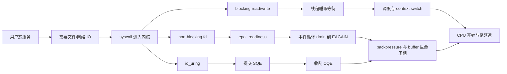
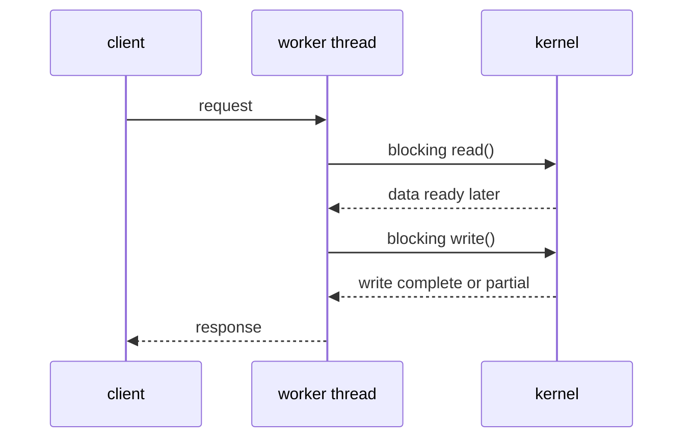
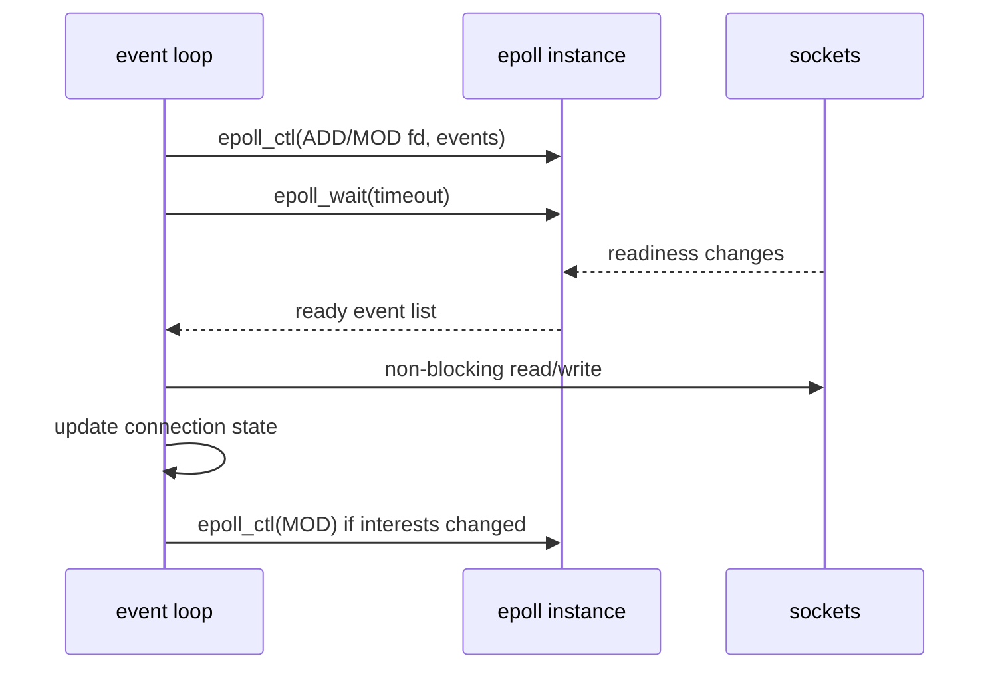
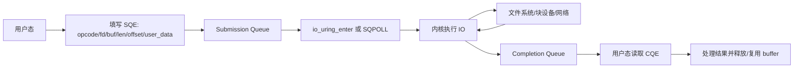
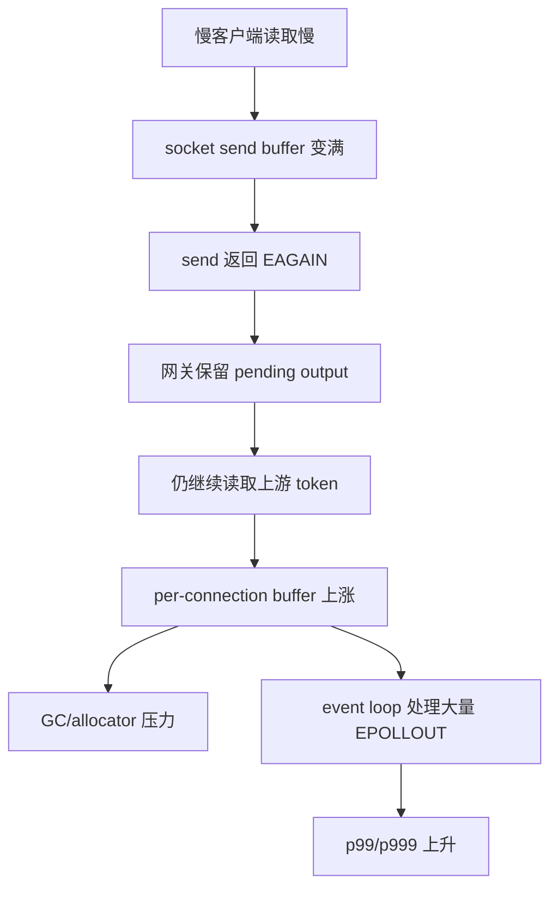

# 第 0b4 章：Syscall、Epoll、io_uring 与 IO 服务模型

> **关联章节**：本章是 [第 0b 章](./0b-memory-virtual-memory-and-io.html) 的用户态/内核态与服务 IO 模型拆分篇。Page Cache、dirty page 和 Huge Pages 见 [0b2](./0b2-page-cache-writeback-and-huge-pages.html)，NUMA、PCIe、DMA 与 pinned memory 见 [0b3](./0b3-numa-pcie-dma-and-pinned-memory.html)，文件系统内部机制见 [0c](./0c-filesystems-and-storage-internals.html)，网络协议栈见 [0d](./0d-network-stack-fundamentals.html)。

## 1. 第一性原理拆解 + 学习大纲

### 拆 — 不可化简的问题

用户态程序不能直接操作磁盘、网卡、页表、调度器和中断控制器。不可化简的问题是：

**AI Infra 服务要同时处理大量 socket、文件、日志、对象存储代理、模型请求和训练数据流，但真正拥有 IO 权限的是内核；每次从用户态进入内核都有固定成本，阻塞等待还会触发调度、上下文切换、cache/TLB 污染和尾延迟扩散。**

这个问题在低 QPS 控制面里不明显，因为一次请求的业务逻辑、数据库访问或网络 RTT 会掩盖 syscall 成本。但在高并发模型网关、dataset service、日志 agent、sidecar proxy、token streaming 服务里，服务可能每秒执行几十万到几百万次小 `read()`、`write()`、`recv()`、`send()`、`epoll_wait()` 或 `futex()`。固定成本被放大后，CPU 并没有花在模型推理、压缩、解析或加密上，而是花在跨越边界、唤醒线程、搬运小 buffer、重复注册 fd、扫描队列和处理无效事件上。

更重要的是，IO 慢不是一个单点慢。慢磁盘、慢客户端、慢对象存储、慢网络、慢日志后端都会把等待传导到线程池、事件循环、buffer 池和队列。没有 backpressure 时，服务看起来还在接收请求，实际只是在堆积内存和排队延迟。

### 推 — 从这个问题如何推导出每个机制

从“用户态必须请求内核服务”推出 syscall；从“syscall 有固定成本”推出批量化、缓存、减少小 IO；从“阻塞等待会浪费线程”推出 non-blocking fd 和事件循环；从“很多 fd 需要通知”推出 `select`、`poll` 和 `epoll`；从“readiness 只告诉你可读可写，真正 IO 仍要自己做”推出 `EAGAIN`、level-trigger、edge-trigger 和 drain loop；从“提交和完成都希望批量化”推出 `io_uring` 的 SQ/CQ/SQE/CQE；从“内核路径、文件系统、驱动和 buffer 管理不总是统一”推出 registered buffers/files、fixed buffers、SQPOLL、feature probing 和 fallback。

最后，从“服务不是 benchmark”推出工程选择：dataset service、model gateway、log agent 和 control plane 不应该盲目追逐同一个 IO 模型。IO 模型要和连接数、IO 粒度、CPU 工作、内核版本、文件系统、存储设备、慢客户端策略和团队调试能力一起判断。

### 绘 — 机制链路总图



### 导 — 读完本章你应该能回答

1. syscall 为什么不是“免费函数调用”，context switch 为什么会影响 p99/p999？
2. blocking thread pool、`epoll` readiness、`io_uring` completion 的核心差异是什么？
3. non-blocking fd 为什么必须处理 `EAGAIN`，level-trigger 和 edge-trigger 分别容易踩什么坑？
4. `io_uring` 的 SQ、CQ、SQE、CQE、registered buffers/files、fixed buffers、SQPOLL 各解决什么问题？
5. 为什么 `io_uring` 不是自动加速器，什么时候它会不如成熟 `epoll`/async runtime？
6. 慢客户端如何拖垮模型网关，如何用 backpressure、限速和隔离保护事件循环？
7. dataset service、model gateway、log agent 应该如何选择 IO 模型？
8. 如何用 `strace`、`perf`、`pidstat`、`ss`、`iostat` 和 `/proc` 建立证据，而不是凭感觉换架构？

## 2. 用户态、内核态与 syscall：边界为什么存在

CPU 用特权级隔离用户程序和内核。应用进程运行在用户态，只能访问自己的虚拟地址空间和普通指令；内核运行在更高特权级，可以管理页表、调度线程、控制设备、处理中断、维护文件系统和网络协议栈。

syscall 是用户态请求内核服务的受控入口。它不是普通函数调用，因为它要切换执行特权级，进入内核定义好的入口，保存必要寄存器，检查参数和权限，把用户指针转换为内核可安全访问的对象，再执行具体内核逻辑。

| 用户动作 | 常见 syscall | 内核实际做的事 | AI Infra 场景 |
|----------|--------------|----------------|---------------|
| 打开文件 | `openat` | 路径解析、权限检查、创建 file 对象 | 读取 dataset shard、权重文件 |
| 读文件 | `read`, `pread64` | 查 Page Cache、可能提交 block IO、copy_to_user | dataset service、checkpoint reader |
| 写文件 | `write`, `pwrite64` | copy_from_user、更新 Page Cache 或 direct IO | log agent、checkpoint writer |
| 网络收发 | `accept4`, `recvfrom`, `sendto` | 协议栈、socket buffer、拥塞控制 | model gateway、streaming token |
| 内存映射 | `mmap`, `munmap`, `madvise` | 建 VMA、处理 page fault 策略 | 权重 mmap、索引文件 |
| 等事件 | `epoll_wait`, `io_uring_enter` | 挂起/唤醒、事件队列处理 | 高并发事件循环 |
| 同步线程 | `futex` | 用户态锁竞争失败后的睡眠/唤醒 | runtime、线程池、队列 |

一次 syscall 的成本通常远小于一次网络 RTT 或磁盘 IO，但它有固定开销。小 IO 把固定开销暴露出来：每读 4 KiB 调一次 syscall，比每读 1 MiB 调一次 syscall 更容易把 CPU 消耗在边界切换和复制上。

### 2.1 syscall 的成本来源

syscall 成本不是一个单独数字，它由几类成本叠加：

- 入口/出口成本：从用户态切到内核态，再返回用户态。
- 参数检查：fd 是否有效、buffer 指针是否合法、长度是否溢出、权限是否允许。
- 内核对象查找：fd table、file object、socket、inode、VMA、cred 等。
- 数据复制：`read()` 把数据 copy_to_user，`write()` 把数据 copy_from_user。
- 安全与隔离开销：现代 CPU 和内核会为缓解侧信道、保护地址空间付出额外成本。
- 调度交互：如果 syscall 不能立刻完成，线程可能睡眠，之后被唤醒。
- cache/TLB 影响：进入内核路径、唤醒另一个线程、迁移 CPU 都可能破坏热数据。

对于服务端程序，真正危险的不是平均 syscall 成本，而是 syscall 进入阻塞路径后引发的排队和尾延迟。例如 `send()` 在 socket send buffer 满时会阻塞；`read()` 在磁盘冷 miss 时会等 IO；`accept()` 在没有连接时会睡眠；`fsync()` 可能等大量脏页和元数据落盘。

### 2.2 context switch：不是“换个函数继续跑”

context switch 是调度器把 CPU 从一个可运行线程切到另一个线程。它要保存/恢复寄存器、更新调度状态、切换地址空间或线程上下文，并让 CPU 的 cache、TLB、branch predictor 面对另一段工作集。

可以把线程状态先简化成：

```text
running -> syscall 阻塞 -> sleeping
设备/网络/定时器完成 -> runnable
调度器选择它 -> running
```

如果每个请求都用一个阻塞线程，慢 IO 会让大量线程进入 sleeping/runnable 循环。线程数越多，调度器要管理的实体越多，锁竞争和 `futex` 唤醒越多，CPU 也越容易在不同工作集之间来回切换。p50 可能仍然好看，但 p99/p999 会被偶发等待、唤醒抖动和队列堆积放大。

观察 context switch：

```bash
pidstat -w -p <pid> 1
perf stat -e context-switches,cpu-migrations,task-clock -p <pid> -- sleep 10
cat /proc/<pid>/status | egrep 'voluntary_ctxt_switches|nonvoluntary_ctxt_switches|Threads'
```

解释时要区分：

- voluntary context switch：线程主动睡眠，常见于阻塞 IO、锁等待、条件变量等待。
- nonvoluntary context switch：线程被抢占，常见于 CPU 争用或调度片耗尽。
- cpu migrations：线程迁移 CPU，可能让 cache locality 变差。

### 2.3 小 IO 为什么会把固定成本放大

假设一个 dataset service 每秒给 worker 发送 2 GiB 数据。如果它用 4 KiB chunk，每秒需要约 524288 次 `read()` 或 `send()` 级别操作；如果改成 256 KiB chunk，每秒约 8192 次。吞吐相同，但 syscall 次数差 64 倍。

这不是说所有 buffer 都应该无限大。过大的 buffer 会增加排队延迟、内存占用和慢客户端伤害。工程上要找的是批量化、延迟和 backpressure 的平衡：

| IO 粒度 | 好处 | 风险 | 常见判断 |
|---------|------|------|----------|
| 4 KiB | 延迟细、内存小 | syscall 过多，吞吐差 | 随机元数据、小 record |
| 64 KiB | 常见折中 | 仍需观察 syscall 占比 | HTTP body、日志批次 |
| 256 KiB-1 MiB | 吞吐好，syscall 少 | 慢客户端占 buffer 更久 | dataset shard、checkpoint 流 |
| 多 MiB | 适合顺序大块 | 队列和内存压力大 | 本地 NVMe 大块预取 |

观测 syscall 分布：

```bash
strace -c -p <pid>
strace -f -ttT -e trace=read,write,recvfrom,sendto,epoll_wait -p <pid>
perf trace -p <pid> --duration 10
```

`strace` 会显著扰动高 QPS 进程，生产环境要短时间采样或在压测环境复现。高频路径更适合用 `perf stat`、eBPF 工具或运行时自带 metrics。

## 3. Blocking IO 与线程池：最容易写，也最容易被慢端拖住

blocking IO 的模型很直接：调用 `read()` 时没有数据就等，调用 `write()` 时写不进去就等，调用 `accept()` 时没有新连接就等。为了让多个请求并发，应用通常配一个线程池，或者每个连接一个线程。



### 3.1 blocking thread pool 的优点

blocking 不是落后，它是一个很强的默认选择：编程模型简单，和大多数同步库兼容，调试堆栈直观；对低并发控制面、后台任务、管理 API、批量离线导入脚本，blocking thread pool 往往是更好的工程选择。优化这类服务通常先看数据库、对象存储、索引和锁，而不是先换 `epoll` 或 `io_uring`。

### 3.2 blocking thread pool 的风险

blocking 模型的问题来自“等待占住线程”。线程本身有栈内存、调度成本和 runtime 元数据；线程池满了以后，新请求只能排队。慢客户端、慢磁盘、慢对象存储、慢 DNS、慢日志后端都可能占满线程池。

| 风险 | 现象 | 根因 | 处理方向 |
|------|------|------|----------|
| 线程池耗尽 | 活跃线程满，新请求排队 | 慢 IO 占住 worker | 分离线程池、超时、限流 |
| context switch 高 | CPU 使用率高但业务吞吐不涨 | 大量睡眠/唤醒 | 降并发、改 async、批量化 |
| 栈内存膨胀 | RSS 随连接数上涨 | 每连接线程或大线程池 | 限制线程数、调小栈、事件化 |
| head-of-line blocking | 快请求被慢请求挡住 | 同一队列混合不同耗时 | 队列隔离、优先级 |
| backpressure 模糊 | 内存队列越积越多 | 只排队不拒绝 | bounded queue、429/503 |

blocking 模型里最常见的错误是把所有工作塞进一个共享线程池：接收请求、读对象存储、写响应、压缩、日志、鉴权、metrics export 全用同一个 pool。任何一个后端慢都会扩散到全服务。

### 3.3 线程池模型的基本 SOP

如果选择 blocking thread pool，应至少有这些边界：每个外部依赖有超时，每个队列有上限，慢路径和快路径隔离，队列满时明确拒绝或降级，并记录 queue wait、dependency wait、write wait。观察时用 `pidstat -wt -p <pid> 1`、`ps -L -p <pid>` 和 runtime thread dump 看线程在等 socket、磁盘、锁，还是在做 CPU 工作。

## 4. Non-blocking fd、EAGAIN 与事件循环

non-blocking fd 的语义是：如果操作不能立刻完成，不要让线程睡眠，而是立刻返回 `-1` 并设置 `errno=EAGAIN` 或 `EWOULDBLOCK`。应用随后把 fd 交给事件通知机制，等内核告诉它“现在可能可读/可写”。

```c
int flags = fcntl(fd, F_GETFL, 0);
fcntl(fd, F_SETFL, flags | O_NONBLOCK);
```

读 non-blocking socket 的核心循环：

```c
for (;;) {
    ssize_t n = read(fd, buf, sizeof(buf));
    if (n > 0) {
        consume(buf, n);
        continue;
    }
    if (n == 0) {
        close(fd);
        break;
    }
    if (errno == EAGAIN || errno == EWOULDBLOCK) {
        wait_for_readiness(fd);
        break;
    }
    handle_error(errno);
    break;
}
```

这段代码里最重要的是：`EAGAIN` 不是异常故障，而是“现在没有更多数据”。non-blocking 代码必须把 partial read、partial write、连接关闭、错误和再次等待都建模清楚。

### 4.1 partial write 是慢客户端的入口

`write(fd, buf, len)` 返回 `n < len` 是合法情况。它说明只写入了一部分，剩余数据要挂在连接状态里，等 socket 可写后继续写。对模型网关和 streaming token 服务，这就是 buffer 生命周期管理的核心。

错误写法：

```text
生成响应 -> 一次 write -> 假设全部写完 -> 释放 buffer
```

正确模型：

```text
生成响应 chunk
  -> 尝试 write
  -> 写完: 释放 chunk
  -> 部分写: 保存 remaining slice
  -> EAGAIN: 注册 EPOLLOUT，等待继续写
  -> 超过连接级 pending bytes: 触发 backpressure 或断开
```

如果忽略 partial write，轻则响应截断，重则 use-after-free 或数据串线。高级语言 runtime 会隐藏部分细节，但它仍然必须在内部维护 per-connection output buffer。

### 4.2 事件循环不能做 CPU 重活

事件循环的职责是快速处理 readiness、收发少量数据、推进状态机、把 CPU 重活派发出去。它不适合做大 JSON 解析、gzip/zstd 压缩、tokenizer、复杂鉴权、同步数据库调用或模型推理。

事件循环做 CPU 重活会产生两类问题：

- 其他 fd 即使 ready，也要等这个 CPU 工作完成才能被处理。
- `epoll_wait()` 调用频率下降，连接层 timeout、心跳、写缓冲释放都变迟。

常见拆分原则：accept、read、write、短 header 解析和状态机推进可以留在 loop；大 body JSON、压缩/解压、tokenizer、同步对象存储 SDK 和复杂鉴权应移到 bounded worker pool 或专用 pipeline；metrics 计数可以在 loop 内做，但 export 不能阻塞。

## 5. epoll：readiness 事件模型

`epoll` 解决的是“大量 fd 中哪些现在可能可读/可写”的通知问题。它不替你读写数据，也不保证一次事件后 `read()` 一定能读到完整业务消息。它只告诉你 readiness。

基本链路：



### 5.1 `select`、`poll`、`epoll` 的动机差异

`select` 和 `poll` 都能等多个 fd，但大量连接下每次等待都要传入 fd 集合，内核仍要扫描，用户态/内核态之间也要搬运较多状态。`epoll` 把“关注哪些 fd”保存在内核 epoll instance 里，事件发生时把 ready fd 放入就绪队列，应用用 `epoll_wait()` 取一批事件。它减少的是 fd 扫描和重复传集合的成本；真正收发数据仍然需要 syscall，连接状态、buffer、timeout、错误和 backpressure 仍归应用管理。

### 5.2 Level-trigger 与 edge-trigger

`epoll` 常用两种触发方式：

| 模式 | 语义 | 优点 | 常见坑 |
|------|------|------|--------|
| Level-trigger (LT) | 只要条件仍满足，就会反复通知 | 容易写，对漏读更宽容 | 没消费完会不断唤醒 |
| Edge-trigger (ET) | 状态从不 ready 变为 ready 时通知 | 唤醒少，适合高性能循环 | 必须读/写到 `EAGAIN` |

LT 更像“水位还高就一直提醒”；ET 更像“水位刚越线时提醒一次”。ET 下如果收到可读事件后只读一小块，没有 drain 到 `EAGAIN`，剩余数据可能不会再次触发事件，连接就会卡住。

ET 读循环原则：

```text
收到 EPOLLIN
  -> while read() > 0: 消费所有当前可读数据
  -> read() == 0: peer closed
  -> errno == EAGAIN: drain 完成，回到 epoll_wait
  -> 其他错误: close
```

写循环原则：

```text
有 pending output
  -> while pending not empty:
       write()
       写完一段: 释放对应 buffer
       partial: 更新 offset
       EAGAIN: 保留 EPOLLOUT interest，退出
  -> pending empty: 移除 EPOLLOUT interest
```

### 5.3 epoll 适合和不适合什么

多线程事件循环还要处理 fd ownership：可以让每个 loop 拥有自己的 fd 集合，也可以用 `EPOLLONESHOT` 防止多个 worker 同时处理同一个 fd，用 `SO_REUSEPORT` 或 `EPOLLEXCLUSIVE` 降低 accept 惊群。成熟网络库通常已经处理了这些细节。

适合：大量长连接或 streaming 连接，单连接 IO 不大但连接数多，可以把 CPU 重活隔离到 worker pool，需要精细控制 per-connection buffer 和 backpressure，或已经使用 nginx、Envoy、Netty、Tokio、libuv 这类成熟 async runtime。不适合直接解决：本地磁盘异步读写的 completion 语义、大量 CPU 解析或压缩、对象存储吞吐不足、文件系统写回抖动、应用层协议设计导致的小包过多。

## 6. Readiness vs Completion：`epoll` 和 `io_uring` 的分水岭

readiness 和 completion 的区别是本章的主线。

| 模型 | 内核告诉你什么 | 应用还要做什么 | 典型 API | 风险 |
|------|----------------|----------------|----------|------|
| blocking | 调用完成后返回 | 等待期间线程阻塞 | `read`, `write` | 线程池耗尽 |
| readiness | fd 现在可能可读/可写 | 自己调用 read/write，直到 `EAGAIN` | `epoll` | 状态机和 drain loop |
| completion | 你提交的这次 IO 已完成 | 处理结果、释放或复用 buffer | `io_uring` | buffer 生命周期和支持边界 |

readiness 更像“门口现在可能有人，你去开门”；completion 更像“你提交的订单完成了，来取结果”。这两个模型对应用状态管理的要求不同：

- readiness 下，buffer 常在应用读写时才决定，事件是 fd 级别。
- completion 下，buffer 往往在提交 SQE 时就绑定，完成事件是操作级别。
- readiness 下，一个事件可能对应多个业务消息，也可能读到一半。
- completion 下，一个 CQE 对应一个提交过的操作，但结果可能是短读、短写或错误。

对网络服务而言，readiness 很自然，因为 socket 的可读/可写状态频繁变化，应用协议解析也通常需要状态机。对高吞吐文件 IO 而言，completion 更自然，因为应用可以提前提交一批明确 offset/length/buffer 的读写。

## 7. io_uring：SQ/CQ/SQE/CQE 与批量提交

`io_uring` 是 Linux 的异步 IO 接口。它的核心思想是用两个共享 ring buffer 降低提交和完成路径上的 syscall 与复制成本：

- Submission Queue (SQ)：用户态放入要执行的操作。
- Submission Queue Entry (SQE)：一次操作的描述，例如读哪个 fd、offset、buffer、长度。
- Completion Queue (CQ)：内核放入完成结果。
- Completion Queue Entry (CQE)：一次操作的结果，例如返回字节数或错误码。



### 7.1 io_uring 的收益来自哪里

`io_uring` 可能带来的收益主要有：

- 批量提交：一次 `io_uring_enter()` 提交多个 SQE。
- 批量完成：一次收割多个 CQE。
- 减少用户态/内核态往返：热路径更多通过共享 ring 交换状态。
- 文件 IO completion 化：本地 NVMe 大量 `pread`/`pwrite` 可以自然 pipeline。
- 支持固定资源：registered files/buffers 减少重复查找、pin 和引用成本。
- 支持更丰富操作：读写、accept、connect、send、recv、timeout、splice 等可组合。

一次操作的生命周期可以压缩成：`io_uring_setup()` 建 ring，用户态填写 SQE，提交后内核执行 IO，完成后写 CQE，应用用 CQE 的 `res` 和 `user_data` 找回请求上下文并释放或复用 buffer。收益成立的前提是：单机有足够 IO 并发或 syscall 压力，后端能并行处理请求，应用能提前准备 buffer，请求粒度和队列深度合理，内核/文件系统/运行环境支持目标 opcode。

### 7.2 Registered files、registered buffers 与 fixed buffers

每次普通 IO 都要通过 fd 找到 file object，通过用户指针处理内存页。`io_uring` 提供注册机制，把常用资源提前告诉内核：

| 机制 | 做什么 | 可能收益 | 成本/风险 |
|------|--------|----------|-----------|
| registered files | 提前注册 fd table | 减少每次 fd 查找和引用成本 | fd 生命周期更复杂 |
| registered buffers | 提前注册用户 buffer | 减少重复 pin/检查成本 | 占用 locked memory，NUMA 更敏感 |
| fixed buffers | SQE 使用 buffer index | 提交更轻，适合 buffer pool | buffer 不能提前释放或移动 |
| buffer selection | 内核从 buffer group 选 buffer | 网络 recv 场景少分配 | 状态管理更复杂 |

fixed buffer 的核心约束是生命周期：提交 SQE 后，到对应 CQE 返回前，buffer 不能被释放、复用给其他请求、移动或修改为不兼容状态。否则会出现数据损坏或难以复现的竞态。

对 dataset service，fixed buffers 可能适合“固定大小读 buffer pool + 顺序读 shard + 网络发送”的 pipeline。对模型网关，如果响应大小高度可变且上游生成速度不稳定，buffer selection 和应用层 output queue 的设计会比 API 选择更重要。

### 7.3 SQPOLL：少一次 syscall，但多一个内核轮询线程

`IORING_SETUP_SQPOLL` 会让内核创建 SQ poll thread，轮询 SQ 中的新提交。用户态在某些情况下可以不调用 `io_uring_enter()` 就让内核看到 SQE，从而减少 syscall。

它的代价也很明确：

- SQ poll thread 会消耗 CPU，即使负载不高也可能忙等。
- 需要关注 CPU 亲和性和 NUMA locality。
- 对容器/权限/内核配置有要求。
- 低 QPS 服务可能因为轮询浪费 CPU。
- 多 ring、多进程时可能制造额外调度和隔离问题。

SQPOLL 更像高吞吐专用工具，不是默认开关。适合在压测证明提交 syscall 是瓶颈、CPU 预算充足、ring 和 IO worker 亲和性清楚的服务中评估。

### 7.4 内核、文件系统和 opcode 支持边界

`io_uring` 是接口族，不是一个所有操作都等价支持的魔法层。实际行为受这些因素影响：

- Linux 内核版本：不同版本支持的 opcode、flags、bug fix 和安全限制不同。
- 文件系统：ext4、xfs、btrfs、overlayfs、网络文件系统对异步 direct/buffered IO 的行为不同。
- 存储设备：NVMe 多队列更容易受益，慢 SATA 或远端存储可能受益有限。
- buffered vs direct IO：某些路径可能退化为 worker thread 执行，仍有调度成本。
- 容器和权限：locked memory、SQPOLL、注册资源可能受 cgroup、rlimit、seccomp 影响。
- 语言 runtime：封装库是否真的走 `io_uring`，还是 fallback 到线程池。

上线前要做 feature probing 和 fallback，不要只看“编译通过”。压测环境也要和生产内核、文件系统、容器安全策略尽量一致。

可查：

```bash
uname -a
grep -E 'Seccomp|CapEff|CapPrm' /proc/<pid>/status
ulimit -l
mount | egrep ' /data | /var |overlay|xfs|ext4|nfs'
cat /proc/sys/kernel/io_uring_disabled 2>/dev/null || true
```

### 7.5 io_uring 不是自动加速器

`io_uring` 不会自动解决这些瓶颈：

- 对象存储服务端慢或网络拥塞。
- 文件格式导致大量随机小读。
- 解压、JSON、protobuf、tokenization 占 CPU。
- Page Cache miss 和存储队列已满。
- 慢客户端导致 output buffer 积压。
- 应用没有 backpressure，只是把排队从线程池搬到 ring 和内存。
- runtime 封装内部仍然用线程池执行 blocking 操作。

判断是否值得引入 `io_uring`，先问：

1. `strace -c` 或 eBPF 是否显示 `read`/`write`/`pread`/`pwrite` syscall 次数极高？
2. CPU profile 是否有明显 syscall、fd 查找、copy、调度开销？
3. IO 后端是否还有队列深度可用？
4. 业务是否能接受更复杂的 buffer 生命周期和 fallback 测试？
5. 改大 chunk、批量协议、缓存、压缩格式后，问题是否仍存在？

如果答案不清楚，先不要上 `io_uring`。它会把问题从“同步调用慢”变成“异步状态机、buffer 池和完成队列难以解释”。

## 8. Backpressure、buffer 生命周期与慢客户端

服务 IO 的核心不是“尽快读写”，而是“在下游变慢时不要无限吸收压力”。backpressure 是把容量边界显式化：队列多大、buffer 多大、连接 pending bytes 多大、每租户多少并发、写不出去多久就断开。

### 8.1 buffer 生命周期

无论 `epoll` 还是 `io_uring`，buffer 都有生命周期：

```text
free -> reserved -> filling -> submitted/writing -> completed/acknowledged -> free
```

常见错误：

- `write()` partial 后释放完整响应 buffer。
- `io_uring` SQE 提交后复用 fixed buffer。
- 慢客户端 pending output 无上限。
- 日志 agent 发送失败时无限缓存日志。
- 事件循环把大 buffer 长时间挂在连接上，导致 RSS 随慢连接线性增长。

基本规则：

- 每个连接有 output buffer 上限。
- 每个租户有总 pending bytes 上限。
- 每个服务进程有全局 buffer pool 上限。
- buffer 从提交到完成期间必须有明确 owner。
- 超过水位后要停止读取上游、降级、拒绝或断开。

### 8.2 慢客户端对模型网关的伤害

模型网关经常同时面对两种速度：

- 上游模型生成 token 或大响应的速度。
- 下游客户端读取 HTTP/SSE/gRPC stream 的速度。

如果客户端很慢，socket send buffer 会变满。此时网关继续从模型后端读取 token，只会把 token 堆在网关内存里。慢连接足够多时，网关内存上涨、GC 压力增加、事件循环忙于处理 `EPOLLOUT`、快客户端也被拖慢。

防线：

- per-connection pending bytes 上限。
- per-request deadline 和 idle write timeout。
- 下游慢时暂停读取上游，或向上游取消请求。
- streaming chunk 合并，避免每 token 一次 syscall。
- 快慢请求队列隔离，避免慢客户端占满全局 buffer。
- 关键路径日志异步且 bounded，日志后端慢不能阻塞响应。

### 8.3 事件循环与 CPU 重活的隔离

事件循环必须有一个硬约束：单次 callback 不能长期占用 loop。可以用这些指标判断是否出问题：

- event loop lag 或 tick delay 上升。
- `epoll_wait` 平均睡眠时间变短，但请求延迟变长。
- CPU profile 显示 loop thread 在 JSON、compression、regex、tokenizer、TLS 大块加解密。
- socket ready 事件堆积，但 worker pool 也满。

修复顺序：

1. 把 CPU 重活移到 bounded worker pool。
2. 给 worker queue 设置上限和超时。
3. 对大 body/大响应做分块和流式处理。
4. 避免在 loop thread 调用同步 SDK。
5. 把 per-connection 状态更新保持为 O(1) 或小常数。

## 9. AI Infra 服务的 IO 模型选择

没有一个 IO 模型适合所有服务。选择时先看业务面：

- 连接数：几十、几千、几十万？
- IO 粒度：小消息、大文件、streaming token、批量日志？
- 后端：本地 NVMe、NFS、对象存储、远端模型服务、数据库？
- CPU 工作：解析、压缩、加密、tokenization、模型推理？
- 延迟目标：控制面秒级、在线网关毫秒级、训练数据吞吐优先？
- 团队能力：是否能维护复杂 async 状态机和内核兼容性？

### 9.1 Dataset service

dataset service 常见形态：

- 给训练 worker 提供 shard 或样本。
- 从本地 NVMe、NFS、并行文件系统或对象存储读取。
- 可能做 manifest 查询、权限检查、解压、重组、限速和缓存。
- 单次响应可能是 4 MiB 到数百 MiB。

推荐判断：并发低、每次响应大、代码简单优先时 blocking thread pool 足够；连接多、需要流式输出和限速时用 `epoll`/async runtime；本地 NVMe、大量 offset read、希望 pipeline 队列深度时评估 `io_uring`；瓶颈是对象存储 RTT、解压 CPU 或大量小文件随机读时，先优化缓存、格式、shard 和 CPU pipeline。

实践路径：

1. 把数据格式改成大 shard，减少小文件和小 syscall。
2. 建立应用级 backpressure：每 worker、每租户、全局 in-flight bytes。
3. profile Page Cache miss、存储吞吐、syscall 次数、CPU 解压。
4. 如果本地文件 IO 提交路径成为瓶颈，再评估 `io_uring`。

### 9.2 Model gateway

model gateway 的主要矛盾通常是连接数、流式输出、慢客户端和上游模型延迟，而不是本地磁盘 IO。

推荐用成熟 async runtime 或 proxy 内核，例如 Envoy/nginx/Netty/Tokio；连接层使用 non-blocking + readiness 模型；CPU 重活不要放在 event loop；每连接 output buffer、每租户 pending bytes、上游请求数都要有上限；SSE/gRPC streaming 要处理客户端断开、半关闭、超时和取消上游。`io_uring` 可能用于特定网络路径，但多数模型网关首先要解决的是 backpressure、协议 batching、TLS、上游调度和慢客户端，而不是把 socket API 换成 `io_uring`。

### 9.3 Log agent

log agent 的特点是持续写、批量 flush、下游可能慢、丢弃策略要明确。

推荐把重点放在 bounded queue、本地 spool 上限、`fsync` 策略、远端批量发送、压缩、重试和丢弃策略。下游慢时，不能无限占用内存；要按优先级丢弃 debug 日志或采样。如果本地 spool 有大量小写，先做 batch，再评估 `io_uring` 或 direct IO。

### 9.4 Control plane / metadata service

控制面服务通常瓶颈在数据库、锁、缓存一致性、序列化和权限逻辑。除非连接数极高，否则 blocking thread pool 或标准 async web framework 足够。过早引入 `io_uring` 会增加部署和调试复杂度。

## 10. Worked Example：慢客户端拖垮模型网关

### 10.1 现象

一个模型网关支持 SSE token streaming。压测时 p50 正常，p99 在几分钟后逐步升高，RSS 持续上涨，最终触发 OOM 或重启。后端模型服务 GPU 利用率没有明显下降，但网关 CPU 和内存异常。

采样发现：

```text
connections: 50000
slow clients: 2000
gateway RSS: 2 GiB -> 18 GiB
event loop lag: 5 ms -> 800 ms
send EAGAIN rate: rising
upstream tokens still being read
```

### 10.2 机制链路



根因不是 `epoll` 慢，而是 backpressure 缺失。网关在下游写不出去时，没有暂停上游读取，也没有连接级 pending bytes 上限。事件循环被大量可写重试和 buffer 管理占满，快客户端也受影响。

### 10.3 观测命令

```bash
ss -tinp 'sport = :443' | head -80
ss -s
pidstat -r -w -p <gateway_pid> 1
perf stat -e context-switches,cpu-migrations,task-clock -p <gateway_pid> -- sleep 10
strace -f -e trace=sendto,recvfrom,epoll_wait -p <gateway_pid> -ttT
```

应用 metrics 应补齐：

- per-connection pending bytes histogram。
- per-tenant pending bytes。
- `send EAGAIN` 次数。
- upstream paused count。
- downstream write timeout count。
- event loop lag。
- dropped/cancelled stream count。

### 10.4 修复

先做保护，再做优化：

1. 设置 per-connection pending bytes 上限，例如 1-8 MiB，超过后暂停上游或断开。
2. 设置 per-tenant pending bytes 和 stream 数上限。
3. 下游 `EAGAIN` 后不要继续无限读上游 token；向上游施加 backpressure 或取消。
4. 合并小 token chunk，例如按 10-50 ms 或字节阈值 flush，减少 `send()` 次数。
5. event loop 只推进状态机；压缩、复杂日志、鉴权刷新移出 loop。
6. 对慢客户端设置 idle write timeout。

验证目标：

```text
RSS 达到稳定水位
event loop lag 恢复
send EAGAIN 不再导致 pending bytes 无限增长
快客户端 p99 不被慢客户端显著影响
上游模型请求能在下游取消时及时停止
```

## 11. Worked Example：小 IO syscall 过多，是否值得 io_uring

### 11.1 现象

一个 dataset service 从本地 NVMe 读取样本。训练 worker 报告数据供给不足，GPU 利用率周期性掉到 40%-60%。服务 CPU 很高，但 NVMe 带宽只有设备能力的 25%。团队考虑把所有读路径迁到 `io_uring`。

采样：

```bash
strace -c -p <pid>
```

输出摘要：

```text
% time     seconds  usecs/call     calls syscall
 38.00      4.2          3      1400000 pread64
 20.00      2.2          2      1100000 sendto
 12.00      1.3          8       160000 epoll_wait
 10.00      1.1          4       250000 futex
```

每次 `pread64` 平均 4-16 KiB，大量样本跨多个小文件，服务还对每个 record 单独发送小 chunk。

### 11.2 第一轮判断：先问是不是 API 问题

这里有 `io_uring` 可能受益的信号：本地 NVMe、syscall 次数高、`pread64` 很多、设备带宽没打满。但还不能直接迁移，因为小 IO 的根因可能是数据格式和协议。

先检查：

```bash
iostat -x 1
pidstat -d -p <pid> 1
perf stat -e syscalls:sys_enter_pread64,syscalls:sys_enter_sendto,context-switches -p <pid> -- sleep 10
ls -lh <dataset_dir> | head
find <dataset_dir> -type f | wc -l
```

如果文件数量巨大、平均文件很小、每个样本单独读写，那么换 `io_uring` 只是让小 IO 更异步，不会改变文件格式导致的寻址和元数据成本。

### 11.3 修复顺序

推荐顺序：

1. 把小文件打包成 shard，按 offset/length 建索引。
2. 把读取粒度从 4-16 KiB 提到 256 KiB 或 1 MiB 的预取窗口。
3. 对网络响应做 chunk 合并，避免每个 record 一次 `send()`。
4. 建立 bounded prefetch queue，避免 worker 慢时无限读磁盘。
5. 再测 syscall、NVMe 队列深度、CPU profile。
6. 如果 `pread64`/`pwrite64` 仍是主要 CPU 成本，再引入 `io_uring` 批量提交。

### 11.4 什么时候值得 io_uring

迁移条件可以写成 checklist：

- 本地或低延迟块设备能承受较高队列深度。
- 读写 offset/length 已经批量化，不再是大量碎小文件元数据问题。
- syscall 提交/完成路径在 profile 里占明显比例。
- 应用有固定或可控 buffer pool。
- 业务能处理 completion 顺序和提交顺序不同。
- 有 kernel/filesystem feature probing 和 fallback。
- 压测证明同等业务语义下吞吐或 CPU/GB 明显改善。

不适合信号：

- 数据来自对象存储，主要等待远端 RTT。
- CPU 时间花在解压、解析、tokenization。
- 后端磁盘已经满带宽或高 util。
- 团队无法接受 buffer 生命周期复杂度。
- 容器环境禁用或限制 `io_uring` 关键能力。

### 11.5 可能的 io_uring pipeline

```text
free fixed buffers
  -> submit N read SQEs for shard offsets
  -> reap CQEs
  -> enqueue filled buffers to response stage
  -> send or copy to network output queue
  -> downstream ack/write complete
  -> return buffers to pool
```

注意这个 pipeline 有两个 backpressure 点：

- read side：free buffers 不足时停止提交读 SQE。
- write side：客户端慢时停止消耗 filled buffers，进而让 read side 停止预取。

如果没有这两个水位，`io_uring` 只会更快地把磁盘数据搬到内存队列里，把内存打爆。

## 12. 观测 SOP：从现象到 IO 模型判断

### 12.1 第一步：确认服务在等什么

先把 CPU、线程、网络、磁盘放在同一张图里看：

```bash
top -H -p <pid>
pidstat -u -r -d -w -p <pid> 1
vmstat 1
ss -s
iostat -x 1
```

判断：CPU 满但磁盘/网络不忙时看 CPU 重活、锁、syscall 和复制；CPU 不满但线程多、context switch 高时看 blocking 等待；磁盘 util/await 高时看 IO 粒度、Page Cache 和队列深度；send-q 高时看慢客户端；RSS 持续涨时看 pending buffers 和队列上限。

### 12.2 第二步：看 syscall 形态

```bash
strace -c -p <pid>
perf stat -e context-switches,cpu-migrations,task-clock -p <pid> -- sleep 10
perf stat -e syscalls:sys_enter_read,syscalls:sys_enter_write,syscalls:sys_enter_recvfrom,syscalls:sys_enter_sendto -p <pid> -- sleep 10
```

关注 `read/write/recv/send` 次数、单次 syscall 时间、`epoll_wait` 是否频繁立刻返回、`futex` 是否很多，以及 context switch 是否和 QPS 同步上涨。

### 12.3 第三步：看 fd 与 socket 队列

```bash
ls /proc/<pid>/fd | wc -l
ss -tanp | grep <pid> | head
ss -tinp 'sport = :<port>' | head -80
cat /proc/net/sockstat
```

关注连接数是否超过容量、send-q/recv-q 是否堆积、是否有大量 CLOSE_WAIT、是否有慢 ESTAB 连接占 buffer，以及 fd 是否泄漏。

### 12.4 第四步：看 event loop lag 和应用队列

系统命令看不到全部应用状态。服务必须暴露 event loop lag、ready events per tick、callback duration、worker queue depth、per-connection pending bytes、per-tenant in-flight bytes、rejected/cancelled/timeout/dropped counters、buffer pool used/free。没有这些 metrics 时，换 IO 模型会变成猜谜；`io_uring` 的 CQE 也只会告诉你操作完成，不会解释业务队列为什么越积越多。

### 12.5 第五步：形成决策

把证据映射到动作：

| 证据 | 优先动作 |
|------|----------|
| 线程多、voluntary cs 高、线程栈显示 IO 等待 | 限制线程池、隔离慢依赖、考虑 async |
| syscall 次数高、小 read/write 多 | 增大 chunk、批量协议、再评估 `io_uring` |
| event loop lag 高、CPU profile 在解析/压缩 | CPU 重活移出 loop |
| send-q 高、pending bytes 高 | 慢客户端 backpressure、write timeout |
| NVMe 未打满但 `pread` 提交成本高 | 批量预取，评估 `io_uring` |
| 磁盘 await 高、util 高 | 存储瓶颈，优化格式、缓存、队列深度 |
| 对象存储 RTT 高 | 连接池、range 合并、缓存、并发控制 |

## 13. 设计清单

- [ ] 是否知道瓶颈在 syscall、context switch、CPU、存储、网络还是下游？
- [ ] 是否记录 queue wait、handler time、dependency time、write time？
- [ ] blocking thread pool 是否有上限、超时和拒绝策略？
- [ ] 慢依赖是否和快路径隔离？
- [ ] non-blocking fd 是否完整处理 `EAGAIN`、partial read/write、close、error，并在 edge-trigger `epoll` 下 drain 到 `EAGAIN`？
- [ ] `EPOLLOUT` 是否只在有 pending output 时启用？
- [ ] 事件循环里是否有压缩、解析、tokenization 或同步 SDK？
- [ ] 每连接、每租户、全局 pending bytes 是否有上限？
- [ ] buffer 从提交到完成期间 owner 是否明确？
- [ ] `io_uring` 是否验证了内核、文件系统、opcode、容器权限、fallback、fixed buffer 生命周期和 SQPOLL CPU 预算？
- [ ] dataset service 是否先解决小文件、小 chunk 和格式问题？
- [ ] model gateway 是否处理慢客户端取消上游？
- [ ] log agent 是否有 bounded queue、spool 上限和丢弃策略？
- [ ] 压测是否覆盖慢客户端、慢磁盘、慢对象存储和下游故障？

## 14. 练习

1. 解释 syscall 和普通函数调用的差异，并列出至少 4 类 syscall 成本来源。
2. 比较 blocking thread pool、`epoll` readiness 和 `io_uring` completion：它们分别告诉应用什么、应用还要管理什么、适合什么服务。
3. 写出 non-blocking `read()` 循环伪代码，正确处理 `n > 0`、`n == 0`、`EAGAIN` 和错误，并解释 LT/ET 的差异。
4. 一个模型网关有 5 万个 SSE 连接，其中 5% 是慢客户端。设计 per-connection、per-tenant 和 upstream backpressure 策略。
5. 一个 dataset service 每秒 `pread64` 100 万次，每次 8 KiB。先提出 5 个不需要 `io_uring` 的优化，再说明什么时候引入 `io_uring`。
6. 设计一个 log agent 的 IO 模型，说明 bounded queue、磁盘 spool、远端发送、重试、丢弃策略，并给出判断 context switch/syscall/磁盘/慢客户端瓶颈的命令。
7. 解释 registered buffers、fixed buffers 和 SQPOLL 的收益与风险。为什么 completion 返回前不能复用 buffer，为什么低 QPS 服务开启 SQPOLL 可能更差？
