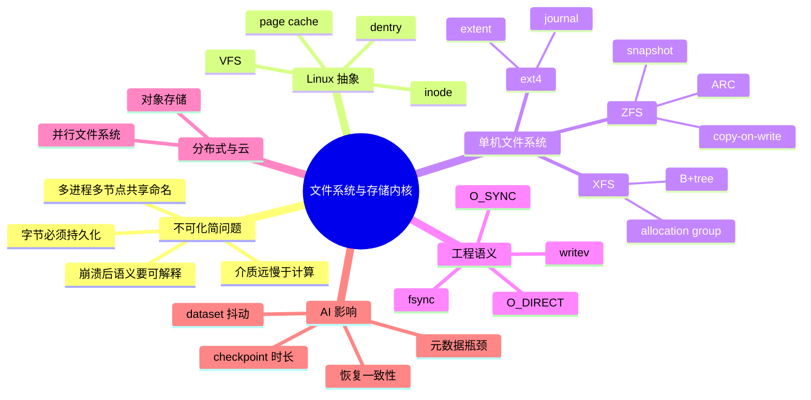
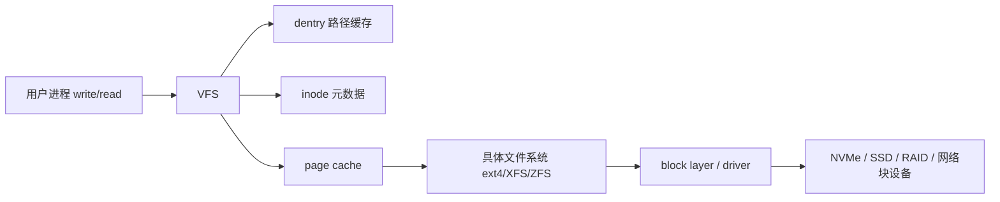
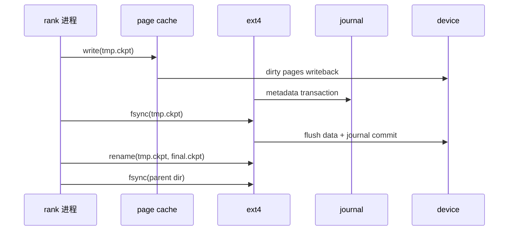
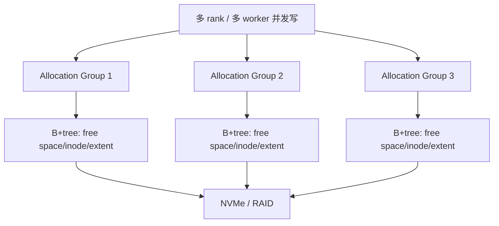
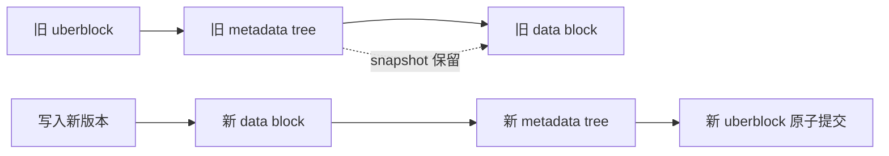
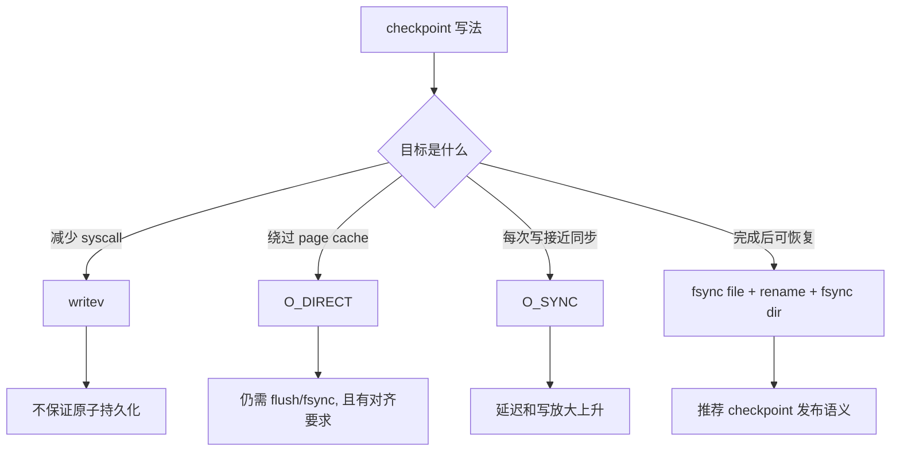
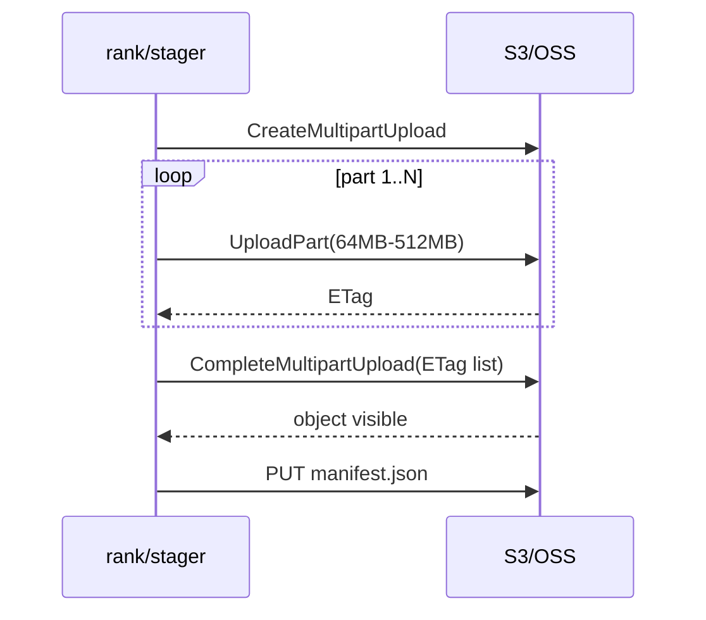
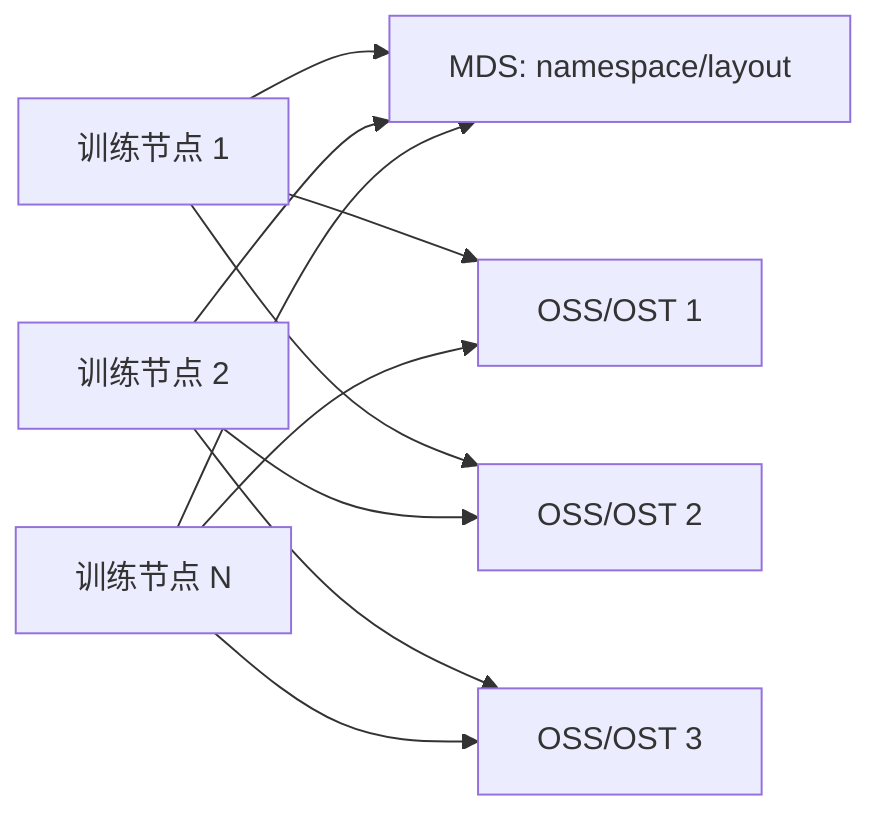

# 第 0c 章 文件系统与存储内核

## 0c.1 第一性原理拆解 + 学习大纲

### 拆 — 不可化简的问题

训练系统最终要把字节放到某个持久介质上，再在未来以可验证的方式读回来。去掉 ext4、XFS、ZFS、S3、Lustre 这些名字后，剩下的不可化简问题只有三个：第一，存储介质远慢于 CPU/GPU，单次访问有毫秒到微秒级延迟，而训练 step 可能只给数据管道几十毫秒预算；第二，机器会崩溃、进程会被 kill、网络会抖动，系统必须说明“哪些字节已经可靠存在，哪些只是看起来写过”；第三，多个 worker、多个节点、多个租户会同时访问同一批文件，命名、缓存、一致性、权限和元数据更新都必须被协调。

AI 平台工程师遇到的很多问题本质上都是这三个问题的投影。checkpoint 写入慢，不只是磁盘带宽低，还可能是 page cache 堆积、journal 提交、rename 语义、对象存储 multipart 收尾、并行文件系统 stripe 配置共同作用；dataset 读取抖，不只是“网络盘慢”，还可能是小文件导致 MDS 被打爆、随机读取导致 IOPS 饱和、压缩格式破坏预取、缓存层命中率不稳定；对象存储便宜而容量大，但它不是 POSIX 文件系统，目录列表、原子 rename、append、fsync 都不能照搬本地文件语义。

因此本章不是背文件系统名词，而是建立一条工程判断链：一个 AI workload 到底需要吞吐、延迟、IOPS、一致性、快照、压缩、容量、成本里的哪几项？这些需求落到 Linux 内核路径后，VFS、inode、dentry、page cache、block layer、具体文件系统和远端协议各自承担什么责任？当 checkpoint 或 dataset 出问题时，应该从应用写法、内核缓存、文件系统策略、设备能力、网络路径和服务端元数据六层里哪一层开始排查？

### 推 — 从这个问题如何推导出每个机制

如果用户进程直接理解每一种文件系统，应用会被 ext4、XFS、ZFS、NFS、FUSE、对象存储网关拖入不同 API，所以 Linux 需要 VFS 提供统一抽象；统一抽象仍然要找到“文件是谁、名字在哪里、数据块在哪里”，于是有 inode 表示对象、有 dentry 缓存路径解析、有 superblock 表示挂载实例。设备太慢，于是内核用 page cache 把最近读写过的页留在内存中，并把写入先变成脏页，再异步回写；但异步回写意味着崩溃窗口，于是有 journal、copy-on-write、fsync、barrier 等机制把“性能”和“崩溃后一致性”做成可调边界。

大文件需要连续布局，否则每个 checkpoint 都会变成海量 block map 查找，所以 ext4 用 extent 描述连续区间，XFS 用 B+tree 管理 allocation group 和 metadata，ZFS 用 copy-on-write tree 把每次修改变成新块提交。并发写需要降低全局锁和元数据争用，因此 XFS 常用于大文件、多线程、多目录并发写场景；数据仓库需要快照、校验、压缩和 clone，因此 ZFS 更像“文件系统 + 卷管理 + 数据完整性层”。当单机盘不够时，系统把数据拆到多个服务端：Lustre、GPFS、BeeGFS、WekaFS 用 MDS 管元数据、OSS/NSD/storage node 管数据，通过 stripe 把带宽叠加起来。

最后，云上容量和成本把对象存储推到中心位置。S3/OSS 暴露的是 HTTP object API，不是 byte-addressable POSIX file；它擅长大对象、顺序流、生命周期管理和跨 AZ 持久性，不擅长频繁 rename、append、小文件随机更新和强目录语义。AI Infra 的文件系统判断，必须从“这个 workload 的 IO 形状”反推，而不是从“哪个系统名气大”开始。

### 绘 — 因果链路



### 导 — 读完本章你应该能回答

1. 为什么 `write()` 返回成功不等于 checkpoint 已经安全落盘？
2. 为什么 page cache 能让 dataset 读取变快，也能让 benchmark 误判真实吞吐？
3. ext4、XFS、ZFS 在 journal、metadata、copy-on-write 和快照语义上分别牺牲了什么、换来了什么？
4. `fsync`、`O_DIRECT`、`O_SYNC`、`writev` 分别解决什么问题，又各自制造什么性能或一致性陷阱？
5. 为什么 S3/OSS 适合保存 checkpoint 归档和 dataset shard，却不能被简单当成本地 POSIX 文件系统？
6. 并行文件系统里的 MDS、OSS、stripe 如何决定大规模训练读取吞吐和小文件性能？
7. 给定 800GB checkpoint、8 个 rank、若干盘或对象存储带宽，如何估算写入时间和崩溃后的恢复风险？

## 0c.2 VFS、inode、dentry、page cache 与文件系统关系

Linux 把“打开路径、读写字节、同步数据”拆成多层。VFS 是系统调用入口后的统一接口，`open/read/write/fsync/rename` 先进入 VFS，再转到具体文件系统实现。inode 是文件对象的身份，记录权限、大小、mtime、block 映射等元数据；dentry 是“路径名到 inode”的缓存，解决 `/data/train/shard-001.tar` 这种字符串解析成本；page cache 是以页为单位的内存缓存，承接 buffered IO 的读缓存和写缓存。



工程边界：`write()` 默认只是把数据复制到 page cache 并标记为 dirty，不保证设备已经完成写入。`drop_caches` 能改变读测试结果，但不能代表生产运行；`stat/open` 很多时是在打 dentry/inode cache，而不是读磁盘。排查时先区分数据路径和元数据路径：大 shard 顺序读通常卡带宽，小文件百万级 `open/stat` 通常卡 dentry/inode/MDS。

## 0c.3 ext4：journal 模式、extent、checkpoint 大文件写放大

ext4 是通用 Linux 文件系统，胜在成熟、默认工具链完整、恢复行为可预期。它用 journal 保护元数据一致性，常见模式包括 `data=ordered`、`data=writeback`、`data=journal`。`ordered` 是默认常用折中：数据块先写出，再提交相关元数据 journal，避免崩溃后元数据指向未初始化数据；`writeback` 更快但崩溃窗口更难解释；`journal` 把数据也写入 journal，一致性强但写放大明显。

extent 用一个区间描述一段连续块，避免大文件用成千上万 block pointer。对 100GB 以上 checkpoint，extent 能减少元数据规模，但 checkpoint 工程仍会遇到写放大：应用写临时文件、page cache 脏页回写、journal 提交元数据、最后 `rename()` 替换路径。如果每个 rank 都写小碎片，目录项和 inode 更新会变多；如果每步都 `fsync` 整个目录和文件，延迟会被 journal commit 周期放大。



工程边界：ext4 适合单机通用训练节点和中等并发 checkpoint，但不是并发元数据更新的天花板。大 checkpoint 推荐“写临时文件 -> `fsync(file)` -> `rename` -> `fsync(parent dir)`”；只 `rename` 不同步目录，在掉电场景下不能严格说明新名字一定持久存在。

## 0c.4 XFS：B+tree、并发写优势、AI 场景常用原因

XFS 从设计上偏向大文件、大目录和高并发。它把空间拆成 allocation group，不同 CPU 可以在不同 AG 上分配块，降低全局锁竞争；inode、free space、extent 等元数据大量使用 B+tree 管理，适合大规模目录和大文件 extent 查询。很多云 GPU 镜像和高性能本地 NVMe 数据盘会选择 XFS，因为训练节点常见模式是多个 DataLoader worker、多个 rank、多个日志和 checkpoint 流同时写。



XFS 的优势不是让单个同步小写神奇变快，而是在大文件连续分配、并发元数据操作、在线扩容、direct IO 等场景里更稳。AI 平台常把 `/local_nvme` 格式化成 XFS，用作 dataset cache、临时 checkpoint staging、shuffle spill。工程边界：XFS 没有 ZFS 那样内建快照和端到端校验；崩溃一致性仍依赖正确 `fsync`；如果底层是网络块设备或云盘，瓶颈可能在虚拟化层和远端复制，不在 XFS。

## 0c.5 ZFS：copy-on-write、ARC、snapshot、压缩、dataset 仓库适配

ZFS 把文件系统、卷管理、校验、压缩、快照整合在一起。它的核心是 copy-on-write：修改不覆盖旧块，而是写新块，再原子切换上层指针。这让快照天然廉价，也让崩溃恢复不依赖传统 journal replay。ARC 是 ZFS 的内存缓存，能缓存数据和元数据；配合 L2ARC、压缩和 recordsize 调整，ZFS 很适合长期 dataset 仓库、特征仓库、实验制品归档。



ZFS 的代价是写入路径更复杂，内存需求更高，和 Linux page cache 的关系也不同。压缩能让文本、JSON、parquet metadata、未压满的 tensor shard 节省容量并提升有效带宽，但对已压缩 tar、jpg、zstd shard 未必有效。工程边界：ZFS 适合“读多写少、需要快照和校验”的数据仓库；对极限低延迟同步写，必须评估 SLOG、recordsize、sync 策略和内存 ARC 占用，避免和训练进程抢内存。

## 0c.6 文件系统对比表

| 系统 | 吞吐 | 延迟 | 一致性机制 | 快照 | AI 场景适配 | 工程边界 |
|---|---:|---:|---|---|---|---|
| ext4 | 中高 | 低 | journal | 依赖 LVM/外部 | 通用本地盘、单机 checkpoint | 高并发大目录不如 XFS |
| XFS | 高 | 低 | metadata journal | 依赖外部 | 本地 NVMe cache、多 rank 并发写 | 无内建端到端校验/压缩 |
| ZFS | 中高 | 中 | copy-on-write + checksum | 内建 | dataset 仓库、可回滚制品 | 内存占用高，调参复杂 |
| S3/OSS | 高总吞吐 | 高 | object PUT 完成语义 | 版本化 | checkpoint 归档、dataset shard 分发 | 非 POSIX，rename/list/append 语义不同 |
| Lustre/GPFS/BeeGFS/WekaFS | 很高 | 中 | 分布式元数据/锁/日志 | 依产品 | 多节点训练共享 dataset | MDS 和网络拓扑会成为瓶颈 |

## 0c.7 fsync / O_DIRECT / O_SYNC / writev：checkpoint 工程语义陷阱

`fsync(fd)` 的目标是把该文件的数据和必要元数据推到持久介质；但如果通过临时文件 `rename` 成最终文件，还要 `fsync` 父目录，否则目录项持久性没有被明确要求。`O_SYNC` 让每次写更接近同步完成，语义简单但吞吐会显著下降，800GB checkpoint 不应轻易逐块同步。`O_DIRECT` 尝试绕过 page cache，减少双缓存和脏页抖动，但要求 buffer、offset、length 对齐，并且不等于自动持久化，仍要关心 flush/FUA/fsync。`writev` 把多个 buffer 聚合成一次 syscall，降低 CPU 开销，但它不把多段写变成事务。



工程边界：checkpoint 库要明确“成功返回”的含义。若只是为了速度，可以先写本地 NVMe staging，再异步上传对象存储；若返回后调度器可能立即删除旧 checkpoint，则必须完成可恢复发布语义。

## 0c.8 IOPS / 带宽 / 延迟；顺序 vs 随机；AI workload 模式

带宽是每秒传多少字节，IOPS 是每秒多少次 IO，延迟是一次 IO 从提交到完成多久。大 checkpoint 是典型顺序大写，主要看带宽、flush 成本和写放大；WebDataset、tar shard、Parquet 大 row group 是顺序读，适合预取；海量小图片、小 JSON、小 embedding 文件是随机读和元数据混合负载，常先打满 IOPS 或 MDS；训练日志和指标是小 append，容易被 `fsync` 周期影响。

一个简单估算：单盘 3GB/s 顺序写，800GB 理论最短约 267 秒；如果实际只有 1.2GB/s，时间约 667 秒。随机 4KB 读即使有 200k IOPS，也只有约 781MB/s，而且还没算路径解析和用户态解码。工程边界：AI 数据格式应优先把小样本聚合成 64MB-1GB shard，让存储看到顺序流；不要用“fio 顺序读峰值”推断百万小文件训练吞吐。

## 0c.9 对象存储（S3 / OSS）：HTTP REST 语义、最终一致性、列表/分片上传、与 POSIX 差异

对象存储的基本对象是 bucket/key/value。`PUT key` 写入完整对象，`GET key` 读取对象或 range，`LIST prefix` 枚举前缀，multipart upload 把大对象拆成多个 part 上传后再 complete。它的协议是 HTTP REST，强项是容量、跨副本持久性、生命周期策略、跨区域复制和总吞吐；弱项是 POSIX 语义：没有真正目录、没有原子覆盖目录树、没有通用 append、`rename` 通常是 copy+delete，`fsync` 没有本地文件意义。



现代对象存储对新对象读写一致性已比早期更强，但跨区域复制、缓存网关、第三方 S3 兼容实现、`LIST` 可见性和失败重试仍需按具体产品验证。工程边界：推荐用 manifest 发布 dataset/checkpoint 版本：先上传 immutable shards，再上传小 manifest 指向完整版本；消费者只读 manifest 中列出的对象，不把 `LIST prefix` 当事务边界。

## 0c.10 并行文件系统：Lustre / GPFS / BeeGFS / WekaFS

并行文件系统把元数据和数据路径拆开。MDS 管文件名、目录、权限、layout；OSS/OST 或 storage node 存数据块；客户端根据 layout 把一个大文件 stripe 到多个目标上。stripe count 越大，大文件带宽越容易叠加，但小文件和随机读未必受益，甚至会增加元数据和网络开销。GPFS/Spectrum Scale 偏企业级一致性和策略管理，Lustre 在 HPC 中常见，BeeGFS 部署相对轻，WekaFS 偏 NVMe + 云原生高性能形态。



训练 dataset 的契合度取决于形状：少量大 shard、每个 worker 顺序 range 读取，非常适合 stripe；千万小文件会把 MDS 打成瓶颈，应先打包或引入本地 cache。工程边界：并行文件系统不是“无限快目录”。上线前要压测 `stat/open`、单文件顺序读、多文件并发读、checkpoint 并发写和故障恢复；stripe 参数应按文件大小和客户端数量配置，而不是全局一个默认值。

## 0c.11 Worked example：800GB checkpoint 在不同 FS 上的写入时长 + 一致性影响

假设一次训练保存 800GB checkpoint，由 8 个 data-parallel rank 各写 100GB shard。机器有 4 块本地 NVMe，单块稳定顺序写 3.0GB/s，XFS 挂载在 RAID0 或应用层分散目录后有效写带宽按 9.0GB/s 估；ext4 单文件系统在同一 RAID 上考虑 journal、脏页回写和并发目录更新后按 6.5GB/s 估；ZFS 开启 `lz4`，tensor 数据压缩比只有 1.05:1，有效设备写入约 762GB，但 copy-on-write metadata 和校验让有效吞吐按 5.5GB/s 估；对象存储通过 16 路 multipart upload，每路 350MB/s，聚合 5.6GB/s，但 complete、manifest、重试预留 45 秒；Lustre stripe 到 8 个 OST，每个 OST 1.5GB/s，客户端和网络折损后聚合 9.5GB/s。

可以先用命令建立基线：

```bash
fio --name=ckpt --directory=/mnt/train_ckpt --rw=write --bs=4m \
  --size=100g --numjobs=8 --iodepth=8 --direct=0 --group_reporting

iostat -x 1
pidstat -d 1
cat /proc/meminfo | egrep 'Dirty|Writeback'
```

粗算写入时间：ext4 为 `800 / 6.5 = 123` 秒，加上 `fsync` 和目录同步可能到 140-180 秒；XFS 为 `800 / 9.0 = 89` 秒，若 8 个 rank 分散到不同目录、避免单目录锁热点，可能稳定在 100-120 秒；ZFS 为 `762 / 5.5 = 139` 秒，再看 ARC 压力和 sync 策略，可能 150-210 秒，但换来快照和校验；对象存储为 `800 / 5.6 = 143` 秒，加 45 秒后约 188 秒，若某个 part 失败重传 512MB，额外约 1-3 秒，但尾延迟可能更高；Lustre 为 `800 / 9.5 = 84` 秒，若 MDS 只处理 8 个大文件和一个 manifest，表现很好，若每个 rank 写几千个小文件，则可能完全变成 MDS 问题。

一致性影响比时长更关键。推荐 checkpoint 发布协议是：每个 rank 写 `step_1000/rank_003.tmp`；写完后 `fsync(file)`；同一文件系统内 `rename` 为 `rank_003.bin`；`fsync(step_1000 directory)`；最后 rank0 写 `manifest.tmp`，内容包含 rank 文件名、大小、sha256、训练 step、优化器状态版本；再 `fsync`、`rename manifest.json`、`fsync(parent dir)`。恢复程序只承认存在 `manifest.json` 且所有 shard 校验匹配的版本。这样即使在 800GB 写到 790GB 时节点掉电，也只会留下未发布的 tmp 文件，而不会把半截 checkpoint 当成可恢复版本。

对象存储上没有 POSIX `rename`，所以协议要改成 immutable key：`ckpt/step-1000/rank-003.part` 上传完成后不覆盖；所有 rank 成功后再 `PUT ckpt/step-1000/manifest.json`。恢复端只从 manifest 进入，不用 `LIST ckpt/step-1000/` 判断完整性。并行文件系统上则要关注 stripe：对 100GB shard，可设置较大的 stripe count，例如 4 或 8；对 manifest 和日志小文件，不要盲目大 stripe。工程推理链是：先用 checkpoint 大小除以可持续写带宽得到下限；再加同步、元数据、压缩、网络尾延迟；最后用发布协议定义“成功”。如果只优化前两项却没有 manifest 和目录同步，训练看似快了，故障恢复时可能损失数小时计算。

## 练习

### 练习 0c-1（基础）：VFS 路径

画出 `open("/data/a.bin") -> read()` 经过 VFS、dentry、inode、page cache、具体文件系统的路径，并说明每层缓存的对象是什么。

### 练习 0c-2（基础）：write 成功的含义

解释 buffered `write()` 返回成功、`fsync()` 返回成功、`rename()` 返回成功三者在崩溃恢复语义上的差别。

### 练习 0c-3（基础）：ext4 journal

比较 `data=ordered` 与 `data=journal` 对 checkpoint 写入性能和一致性的影响。

### 练习 0c-4（基础）：XFS 适配

为什么多个 rank 同时写大文件时，XFS 往往比传统单一全局结构的文件系统更稳？

### 练习 0c-5（基础）：对象存储语义

列出 4 个 S3/OSS 与 POSIX 文件系统不同的语义，并说明其中哪个最容易破坏 checkpoint 发布。

### 练习 0c-6（基础）：IOPS 换算

一个设备 4KB 随机读 100k IOPS，理论字节吞吐是多少？它能否代表 1GB shard 顺序读性能？

### 练习 0c-7（进阶）：page cache 误判

设计一个实验，证明第二次读取 dataset 变快是 page cache 命中，而不是底层存储变快。

### 练习 0c-8（进阶）：O_DIRECT 取舍

checkpoint 写入使用 `O_DIRECT` 可能减少哪些问题？又会引入哪些对齐、吞吐和持久化语义问题？

### 练习 0c-9（进阶）：小文件瓶颈

一个 dataset 有 2000 万张小图片，放在 Lustre 上训练抖动严重。给出至少 3 个改造方向。

### 练习 0c-10（进阶）：ZFS dataset 仓库

为一个 200TB 多版本 dataset 仓库选择 ZFS 参数时，你会重点评估哪些指标和风险？

### 练习 0c-11（设计）：checkpoint 发布协议

设计一个支持 16 rank、每 rank 50GB 的 checkpoint 发布协议，要求进程崩溃后不会把半成品暴露给恢复程序。

### 练习 0c-12（设计）：混合存储架构

为 64 GPU 训练集群设计“对象存储 + 本地 NVMe cache + 并行文件系统”的分层方案，说明每层放什么数据。

### 练习 0c-13（设计）：stripe 策略

给定 1GB、100GB、2KB 三类文件，分别为并行文件系统设置 stripe 策略，并解释原因。

### 练习 0c-14（设计）：200TB checkpoint 仓库文件系统选型

为一个 200TB 的 checkpoint 仓库（覆盖 8 个训练任务、每天 6 次全量 checkpoint、保留 14 天滚动窗口、3 个团队共用）做文件系统选型。给定 6 个维度的需求权重：

| 维度 | 权重 | 业务诉求 |
|---|---:|---|
| 持续吞吐 | 0.25 | 8 任务并发写，目标 ≥ 12 GB/s 聚合 |
| 尾延迟 | 0.10 | 单 rank `fsync` p99 < 5 s |
| 一致性 | 0.20 | manifest + rename 必须可靠 |
| 快照/版本 | 0.15 | 故障回滚要 ≤ 30 分钟出快照 |
| 容量成本 | 0.20 | TCO ≤ $0.05 / GB·月 |
| 运维复杂度 | 0.10 | 团队不能新招 HPC 专人 |

要求：

1. 用加权决策表对 ext4 / XFS / ZFS / Lustre / WekaFS 五个候选打分（每项 1-5 分，给出打分理由）
2. 给出最终推荐与简要架构（含元数据、数据、归档分层）
3. 说明在哪三种业务条件变化下你会换选（例如：单 checkpoint 体积翻倍、需求里加入"GPU 直挂 RDMA 读取"、TCO 上限砍半到 $0.025）

## 深度参考阅读

- Linux kernel documentation: VFS, page cache, writeback, direct IO, block layer。
- `man 2 open`, `man 2 fsync`, `man 2 rename`, `man 2 writev`。
- ext4 documentation: journaling modes, extents, delayed allocation, barriers。
- XFS documentation: allocation groups, delayed allocation, metadata journaling, repair tools。
- OpenZFS documentation: copy-on-write, ARC, snapshots, checksums, recordsize, compression。
- Amazon S3 / Alibaba Cloud OSS documentation: multipart upload, consistency model, object versioning, lifecycle policy。
- Lustre manual: MDS/MDT, OSS/OST, striping, changelog, recovery。
- IBM Spectrum Scale / BeeGFS / Weka documentation: metadata architecture, client cache, failure domains, tuning guides。
- Brendan Gregg, *Systems Performance*: 文件系统、磁盘、延迟与 Linux tracing 方法。
- Martin Kleppmann, *Designing Data-Intensive Applications*: 复制、一致性、存储语义与故障模型。
