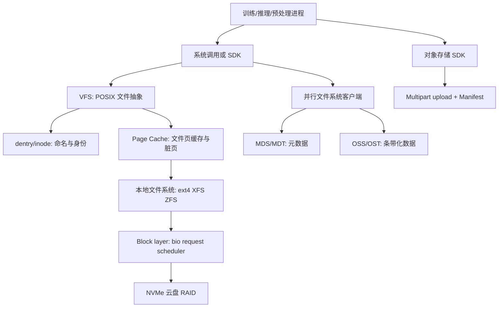

# 第 0c 章 文件系统与存储内核导览

> **定位**：本章是 0c 系列的导览。详细机制拆到 0c1-0c4；这里只建立问题地图、阅读顺序和排障入口。Page Cache 的内存侧细节见 [0b2](0b2-page-cache-writeback-and-huge-pages.md)。

## 1. 为什么 AI Infra 必须懂存储语义

训练系统最终处理的是字节。
字节来自 dataset、权重、索引、tokenizer、embedding table、日志和 checkpoint。
这些字节要在慢速、会故障、被共享的介质上存在。
因此存储问题不是“磁盘够不够快”这么简单。

不可化简的问题有三个。

1. **介质慢**：GPU step 以毫秒计，DRAM 以纳秒计，NVMe 以微秒计，网络文件系统和对象存储常进入毫秒级。
2. **机器会失败**：进程、内核、节点、电源、远端服务都可能在任意系统调用边界失败。
3. **命名空间共享**：多 worker、多 rank、多租户同时 `open/stat/read/write/rename/list`，元数据和数据路径都可能成为瓶颈。

## 2. 0c 系列拆分

| 子章 | 主题 | 你会学到什么 |
|---|---|---|
| [0c1](0c1-vfs-inode-dentry-and-block-layer.md) | VFS、inode/dentry、Page Cache 边界、block layer | 一次 `open/read/write` 如何穿过内核，以及如何解读 `fio`、`iostat` |
| [0c2](0c2-local-filesystems-ext4-xfs-zfs.md) | ext4、XFS、ZFS | journal、extent、delayed allocation、AG/B+tree、CoW、ARC、snapshot 与 AI 选型 |
| [0c3](0c3-storage-semantics-fsync-direct-io-and-checkpoints.md) | fsync、Direct IO、文件 IO API、checkpoint | `write`、`fsync`、`rename`、父目录 `fsync`、`O_DIRECT`、`io_uring` 的语义边界 |
| [0c4](0c4-object-storage-parallel-filesystems-and-dataset-io.md) | 对象存储、并行文件系统、Dataset IO | multipart、manifest、LIST、rename 差异、MDS/OSS/stripe、小文件治理 |

## 3. 一张总图



## 4. 先描述 IO 形状

| workload | 主要 IO 形状 | 首要风险 | 优先阅读 |
|---|---|---|---|
| checkpoint | 大文件顺序写 + 原子发布 | 半成品暴露、`fsync` 尾延迟 | 0c3，再读 0c2 |
| WebDataset / tar shard | 大块顺序读 | 带宽、预读、worker 分片 | 0c1、0c4 |
| 小图片目录 | 海量 `open/stat/read/close` | dentry/inode/MDS/IOPS | 0c1、0c4 |
| safetensors 权重加载 | 大文件顺序读或 `mmap` fault | Page Cache 误判、NUMA | 0c1、0b2 |
| 对象存储 dataset | Range GET + 本地 cache | LIST、重试、manifest 语义 | 0c4 |

## 5. 常见误判

- `write()` 返回快，不代表设备写得快；可能只是 Page Cache 吸收了脏页。
- 第二轮 epoch 快，不代表 dataset 格式好；可能只是 Page Cache 或客户端 cache 命中。
- `fio --direct=0` 的高吞吐，不代表真实设备持续写入能力。
- 对象存储的 key 不是 POSIX inode，`rename` 通常是 copy/delete 或应用层模拟。
- 并行文件系统的大带宽不代表小文件 `stat` 快；MDS 可能先被打满。

## 6. 排障入口

```bash
findmnt -T /mnt/dataset -o TARGET,SOURCE,FSTYPE,OPTIONS
pidstat -d -p <pid> 1
iostat -x 1
grep -E 'Cached|Dirty|Writeback|SReclaimable' /proc/meminfo
df -ih /mnt/dataset
```

## 7. 读法建议

1. 先读 0c1，把 Linux 文件 IO 链路和可观测对象建立起来。
2. 再读 0c2，理解本地文件系统为什么不是只差一个名字。
3. 如果你负责训练恢复、checkpoint 或模型发布，重点读 0c3。
4. 如果你负责 dataset 平台、对象存储或共享集群，重点读 0c4。

## 8. 本系列总 checklist

- 是否把 workload 拆成吞吐、IOPS、延迟、元数据、一致性和成本？
- 是否区分数据路径和元数据路径？
- 是否分别做 cold-cache 和 warm-cache benchmark？
- 是否明确 `write()`、`fsync()`、`rename()`、manifest 的发布边界？
- 是否避免把对象存储当作完全 POSIX 文件系统？
- 是否为百万小文件设计 shard、索引和本地 cache？
- 是否记录文件系统类型、挂载选项、stripe、设备队列和 benchmark 参数？

## 9. 练习

1. 画出一个 DataLoader worker 读取图片时经过的 VFS、dentry、inode、Page Cache 和存储后端。
2. 解释 checkpoint 为什么通常要先写临时文件，再发布 manifest。
3. 给一个现象：GPU idle、磁盘吞吐低、`open()` 慢。判断更像数据路径问题还是元数据路径问题。
4. 给一个现象：`fio --direct=0` 很快，`--direct=1` 慢。说明可能原因。
5. 给一个对象存储 dataset，设计一个不依赖 LIST 正确性的读取入口。
