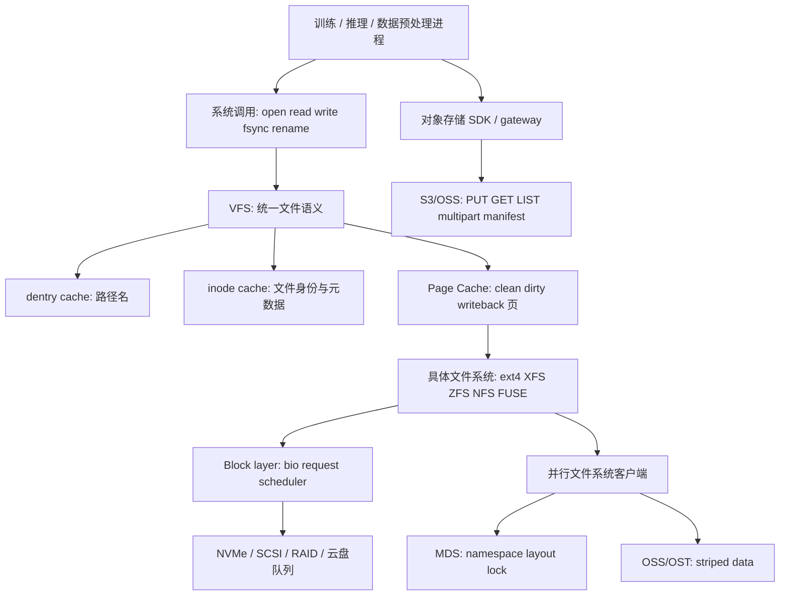
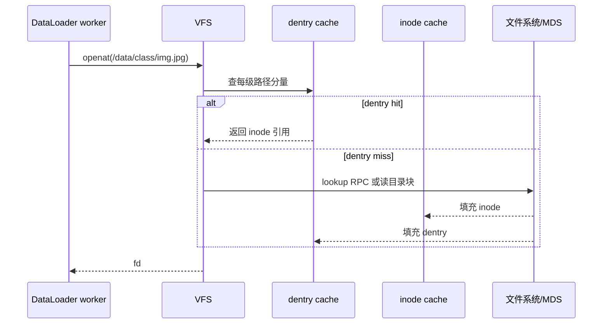
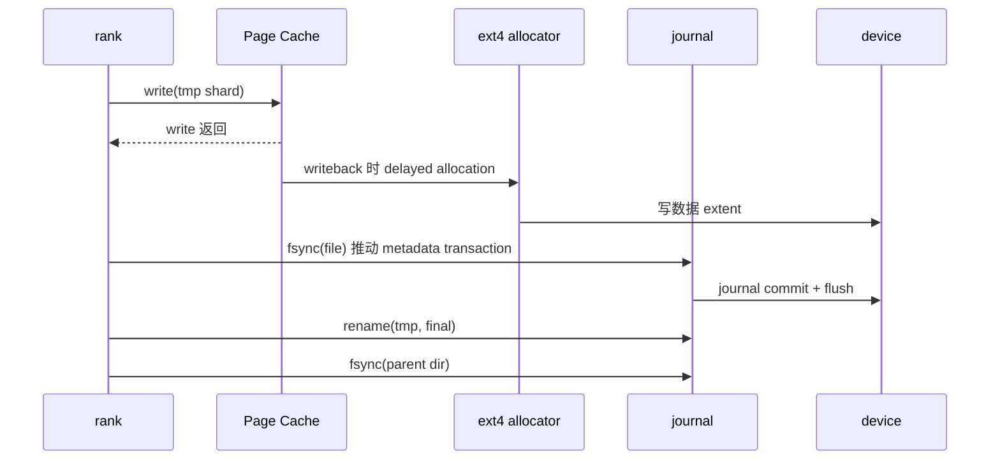
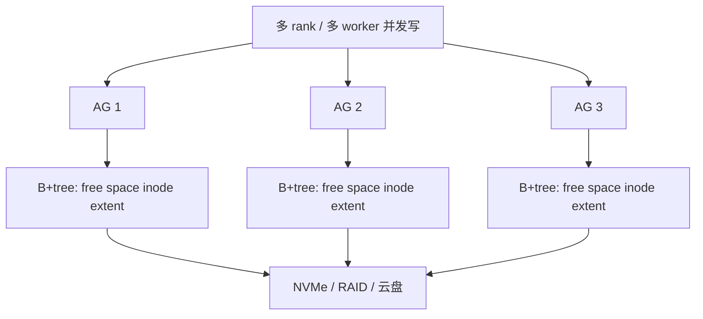
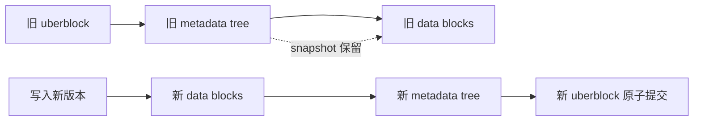
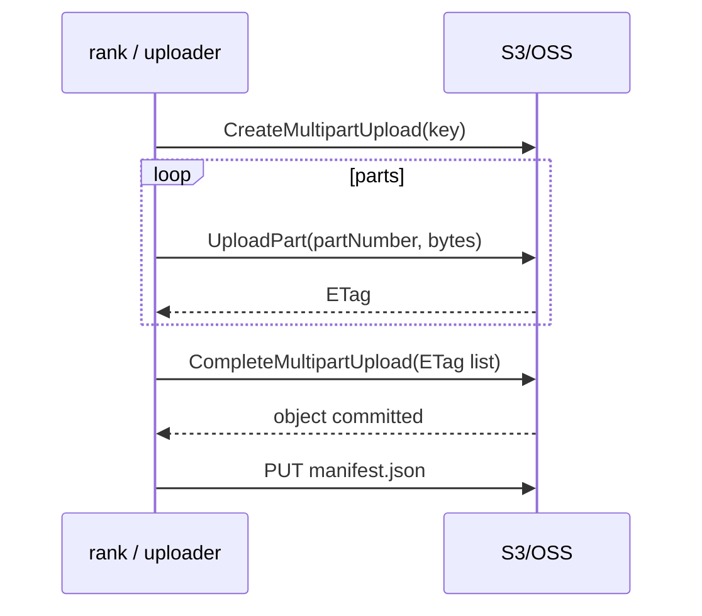
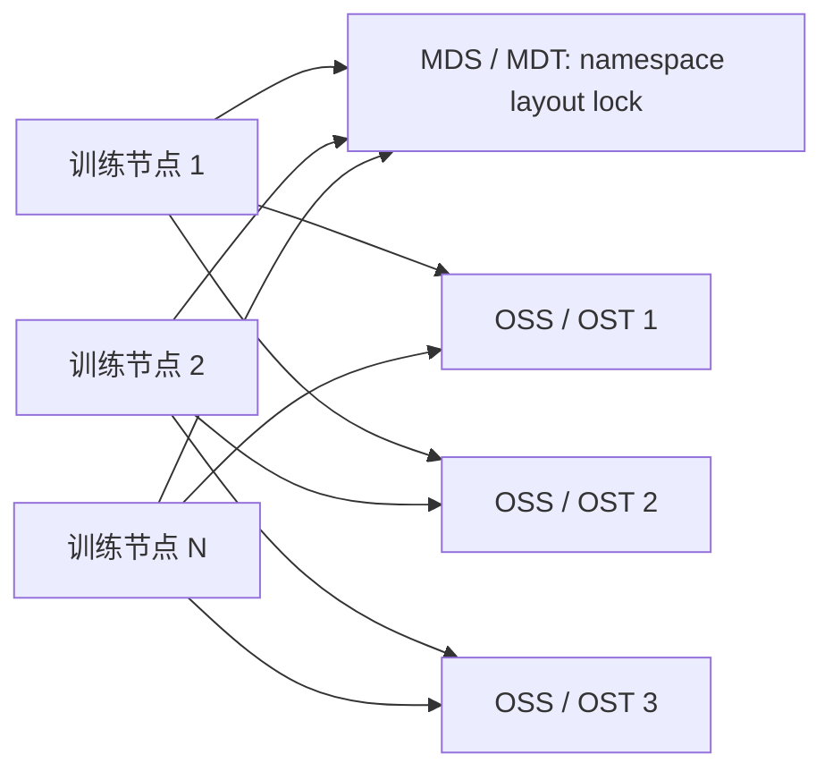

# 第 0c 章 文件系统与存储内核

> **关联章节**：0b2 解释 Page Cache、脏页回写和 Huge Pages；本章站在文件系统与存储内核视角，继续追问 VFS 如何把路径、inode、page cache、文件系统、block layer、设备队列、对象存储和并行文件系统连成一条可观测的 IO 链路。

## 1. 第一性原理拆解 + 学习大纲

### 拆 — 不可化简的问题

训练系统最终要把字节放到某个持久介质上，再在未来以可验证的方式读回来。去掉 ext4、XFS、ZFS、S3、Lustre 这些名字后，剩下的不可化简问题只有三个：

1. **介质远慢于计算**：GPU step 可能只有几十到几百毫秒预算，NVMe 单次访问是微秒级，网络文件系统和对象存储经常进入毫秒级。
2. **机器会在任意边界失败**：进程可能在 `write()` 之后、`fsync()` 之前、`rename()` 之后、父目录落盘之前崩溃。
3. **命名空间被共享**：多个 worker、rank、节点和租户会同时 `open/stat/read/write/rename/list`，数据路径和元数据路径都可能成为瓶颈。

AI Infra 中常见的“存储慢”通常不是单点问题。checkpoint 写入慢，可能同时包含 page cache 脏页堆积、journal commit、block queue 饱和、NVMe queue depth 不足、对象存储 multipart 收尾、并行文件系统 stripe 不合适和 manifest 发布协议不清。dataset 读取抖动，可能是小文件让 dentry/inode cache 或远端 MDS 被打爆，也可能是随机读取让 IOPS 先到顶，还可能是 second epoch 命中 Page Cache 导致 benchmark 误判。

本章的目标不是背文件系统名词，而是建立判断链：一个 AI workload 到底需要吞吐、延迟、IOPS、一致性、快照、校验、容量、成本中的哪几项？这些需求落到 Linux 后，VFS、inode、dentry、page cache、writeback、block layer、具体文件系统和远端协议各自承担什么责任？当训练抖动或恢复失败时，应从哪一层开始观测？

### 推 — 从这个问题如何推导出每个机制

如果每个应用都直接理解 ext4、XFS、ZFS、NFS、FUSE、对象存储网关和并行文件系统，应用会被不同语义拖垮，所以 Linux 需要 VFS 统一 `open/read/write/fsync/rename` 等系统调用。统一抽象仍然要回答“路径名指向谁”，于是需要 dentry 缓存路径解析；要回答“文件对象是什么”，于是需要 inode 记录元数据和块映射；要回答“文件系统实例在哪里”，于是需要 superblock 和 mount。

设备太慢，于是内核用 Page Cache 缓存文件页。读路径上，Page Cache 吸收重复读取和顺序预读；写路径上，buffered `write()` 先把用户数据复制成 dirty page，再由 writeback 异步提交。这个设计提高吞吐，也制造了边界：`write()` 成功不是持久化成功，第二轮读取变快也不代表底层存储变快。0b2 关注 Page Cache 本身；本章关注 Page Cache 如何穿过 VFS、文件系统、block layer 和设备或远端存储。

异步写会制造崩溃窗口，于是文件系统提供 journal、copy-on-write、barrier、flush、`fsync()` 和 `rename()` 语义。大文件需要少量元数据描述连续布局，于是 ext4 用 extent，XFS 用 B+tree 管理 allocation group 和 extent，ZFS 用 copy-on-write tree 提交新版本。多节点共享容量时，系统把元数据和数据拆到不同服务端，于是有 MDS、OSS/OST、stripe、client cache 和分布式锁。云上容量和成本把对象存储推到中心位置，但对象存储是 key/value HTTP API，不是 POSIX 文件系统。

### 绘 — 机制链路



### 导 — 读完本章你应该能回答

1. 为什么 `write()` 返回成功不等于 checkpoint 已经安全落盘？
2. VFS、inode、dentry、Page Cache 的边界分别是什么，和 0b2 的 Page Cache 章节如何衔接？
3. block layer、IO scheduler、NVMe queue depth 为什么会改变 `fio` 结果？
4. ext4、XFS、ZFS 的一致性机制、元数据结构和 AI 选型差异是什么？
5. `fsync`、`rename`、父目录 `fsync` 如何共同定义 checkpoint 发布语义？
6. `O_DIRECT`、`O_SYNC`、`writev`、`preadv2`、`io_uring` 分别解决什么边界问题？
7. 为什么百万小文件训练会抖动，为什么大 shard 通常更适合训练？
8. 为什么对象存储不能直接当成本地 POSIX 文件系统，manifest 为什么是发布边界？
9. 并行文件系统里的 MDS、OSS/OST、stripe 和 client cache 如何决定大规模训练吞吐？
10. 给定 800GB checkpoint 和多种存储后端，如何估算时长、同步成本和恢复风险？

## 2. AI IO 形状：先描述 workload，再谈文件系统

文件系统选型前，先把 workload 描述成 IO 形状。名字相同的“训练读取”可能完全不同：读取 512MB tar shard 是顺序大读；随机打开 2000 万张 JPEG 是元数据 + 小随机读；读取 parquet row group 是较大块顺序读加 CPU 解码；加载 safetensors 权重可能是少量大文件顺序读，也可能是 `mmap` 后按层触发 page fault。

| workload | 典型 IO 形状 | 主瓶颈 | 更好的表达 |
|---|---|---|---|
| 大模型 checkpoint | 少量 10GB-200GB 大文件顺序写 | 持续带宽、flush、发布语义 | rank shard + manifest + 临时文件 |
| WebDataset / tar shard | 64MB-1GB shard 顺序读 | 预读、网络吞吐、解码 CPU | worker 按 shard 切分 |
| 小图片目录 | 海量 `open/stat/read/close` | dentry/inode、MDS、IOPS | 打包 shard、本地 cache、索引文件 |
| embedding / feature cache | 随机 range read 或 mmap fault | p99 延迟、Page Cache 命中率 | 分块索引、冷热分层 |
| metrics / logs | 小 append + 周期 flush | `fsync` 频率、目录项更新 | 批量 flush，异步上传 |
| 数据预处理 shuffle | 大量临时文件和 spill | inode、目录热点、写放大 | 分桶目录、顺序 spill、清理 SOP |

三组指标不要混用：带宽是每秒字节数，IOPS 是每秒 IO 次数，延迟是一次 IO 的完成时间。随机 4KB 读达到 200k IOPS，换算也只有约 781MB/s；3GB/s 顺序写不说明小文件 `open()` 能快。AI 平台排障时，第一步是判断“数据路径瓶颈”还是“元数据路径瓶颈”。

```bash
# 观察进程级 IO：读写速率、延迟不直接给出，但能看到是否在做 IO
pidstat -d -p <pid> 1

# 观察系统块设备：利用率、队列、await、请求合并
 iostat -x 1

# 观察文件系统类型与挂载选项
findmnt -T /mnt/dataset -o TARGET,SOURCE,FSTYPE,OPTIONS

# 观察目录项规模
find /mnt/dataset -maxdepth 2 -type f | head
```

判断原则：如果 GPU idle 伴随磁盘吞吐接近上限，是数据带宽问题；如果磁盘吞吐不高但 `open/stat` 很慢，常是元数据或远端 MDS；如果 first epoch 慢、second epoch 快，是 Page Cache 或客户端缓存；如果 checkpoint 前半段快后半段卡，是 dirty writeback、设备队列或 `fsync` 收尾。

## 3. VFS、superblock、inode、dentry：路径不是字符串查找那么简单

VFS 是 Linux 内核里的统一文件系统接口。用户态调用 `openat()` 后，内核不是直接读磁盘目录块，而是沿着 mount namespace、dentry cache、inode cache 和具体文件系统操作函数解析路径。VFS 的价值是让应用用同一组系统调用访问 ext4、XFS、NFS、FUSE 或 overlayfs，但统一 API 不代表底层语义完全一样。

核心对象可以这样理解：

| 对象 | 表示什么 | 典型缓存 | AI 场景信号 |
|---|---|---|---|
| superblock | 一个挂载的文件系统实例 | 文件系统全局状态 | 同一路径换挂载点后行为变了 |
| mount | namespace 中的挂载关系 | mount cache | 容器内外路径语义不同 |
| dentry | 路径分量到 inode 的映射 | dentry cache | 百万小文件 `stat` 依赖缓存热度 |
| inode | 文件对象身份和元数据 | inode cache | inode 耗尽、目录元数据热点 |
| file | 进程打开文件后的状态 | fd table | offset、flags、权限影响 IO |

路径解析的成本来自每一级目录。`/datasets/imagenet/train/n01440764/xxx.jpeg` 至少要查多个 dentry；若缓存未命中，本地文件系统要读目录块，网络文件系统要发 RPC，并行文件系统要问 MDS。百万小文件训练抖动，本质上经常是“每个样本都走一遍路径解析 + inode 获取 + 小文件读”。



常用观测：

```bash
# dentry/inode slab 是否异常大
slabtop -o | egrep 'dentry|inode|xfs_inode|ext4_inode'

# inode 使用情况，注意 inode 耗尽会表现为有空间但不能建文件
df -ih

# 单目录文件数和热点目录
find /mnt/dataset -xdev -type f | wc -l
find /mnt/dataset -xdev -maxdepth 2 -type d -exec sh -c 'printf "%s " "$1"; find "$1" -maxdepth 1 -type f | wc -l' sh {} \; | sort -nr -k2 | head
```

工程边界：VFS 统一了接口，不统一性能和故障语义。`rename()` 在同一 POSIX 文件系统内可以是原子命名切换；跨 mount rename 会变成失败或 copy/delete；对象存储网关可能模拟 rename，但那不是同一个崩溃语义。

## 4. Page Cache 与 0b2 的边界：缓存命中、脏页、回写和文件系统提交

0b2 已经解释 Page Cache 如何缓存文件页、如何产生 dirty page、如何触发 writeback。本章只补充它和文件系统的接口边界：Page Cache 负责缓存“文件 offset 到页”的内容，具体文件系统负责把这些页映射到块、extent、对象或远端 RPC；block layer 负责把写入组织成设备请求；设备或远端系统负责真正持久化。

一次 buffered `read()` 的简化路径：

```text
read(fd, buf, len)
  -> VFS 根据 fd 找 file/inode
  -> 查 Page Cache: inode + page index
  -> 命中: copy_to_user
  -> 未命中: 文件系统把 offset 映射到 block / extent / remote object
  -> block layer 或网络客户端提交 IO
  -> IO 完成后填充 Page Cache
  -> copy_to_user
```

一次 buffered `write()` 的简化路径：

```text
write(fd, buf, len)
  -> VFS 权限与范围检查
  -> 将用户 buffer 拷贝到 Page Cache page
  -> 标记 dirty，更新 inode size/mtime 等内存态元数据
  -> write 返回
  -> 后台 writeback 写数据块
  -> fsync 或周期提交推动必要元数据与 flush
```

这解释了两个常见现象。第一，`write()` 很快不代表磁盘快，可能只是 DRAM 吸收了写入；真正成本在后续 writeback 或 `fsync()`。第二，第二轮 epoch 变快不代表数据格式被优化，可能只是 first epoch 把文件页放进 Page Cache。benchmark 必须区分 warm cache 和 cold cache。

```bash
# Page Cache 与 writeback 观测
free -h
grep -E 'Cached|Active\(file\)|Inactive\(file\)|Dirty|Writeback|SReclaimable' /proc/meminfo
vmstat 1
sar -B 1

# 只在测试机谨慎使用；生产上 drop_caches 会影响其他任务
sync
echo 3 | sudo tee /proc/sys/vm/drop_caches
```

Page Cache 不是应用缓存。它缓存字节页，不缓存解码后的 PIL image、token tensor、numpy array、GPU tensor 或业务索引。它也不是对象存储客户端缓存的替代品：对象存储 SDK 的连接池、range GET、重试和本地落盘 cache 仍要单独设计。

## 5. Block layer、IO scheduler 与 NVMe queue：fio 结果为什么会变

当文件系统决定要读写某些块后，请求会进入 block layer。block layer 把文件系统提交的 bio 合并、排序、调度，交给设备驱动。老式 HDD 需要电梯算法减少寻道；现代 SSD/NVMe 更关注并发队列、请求大小、队列深度、CPU 亲和性和中断处理。云盘还会叠加虚拟化、网络和远端复制。

关键概念：

| 概念 | 含义 | 对 `fio` 的影响 |
|---|---|---|
| request size | 每次 IO 字节数，如 4k、128k、4m | 大块更接近带宽，小块更接近 IOPS |
| queue depth / iodepth | 同时挂起的 IO 数 | NVMe 需要足够并发才能打满 |
| numjobs | 并发 job 数 | 模拟多个 worker/rank，但会引入调度竞争 |
| direct=0/1 | 是否绕过 Page Cache | `direct=0` 容易测到内存和回写 |
| scheduler | none、mq-deadline、bfq 等 | NVMe 常见 none 或 mq-deadline |
| flush/FUA | 强制设备提交易失缓存 | 决定 fsync 尾延迟 |

NVMe 的优势来自多队列。每个 queue 可以挂很多 command，多个 CPU core 可以并行提交。若 `fio --iodepth=1 --numjobs=1`，可能测不到设备峰值；若 iodepth 过高，吞吐上升但 p99 延迟变差，训练数据读取可能被尾延迟拖住。

```bash
# 设备队列与调度器
lsblk -o NAME,TYPE,SIZE,ROTA,SCHED,MOUNTPOINT
cat /sys/block/nvme0n1/queue/scheduler
cat /sys/block/nvme0n1/queue/nr_requests
cat /sys/block/nvme0n1/queue/read_ahead_kb

# NVMe 设备信息，需安装 nvme-cli
sudo nvme list
sudo nvme id-ctrl /dev/nvme0 | egrep 'sqes|cqes|nn|mdts'
```

`iostat -x` 的几个字段常被误读：`%util` 接近 100% 表示设备几乎一直有请求，不等于带宽一定满；`await` 包含排队和服务时间；`aqu-sz` 是平均队列长度；`r/s`、`w/s` 是 IOPS；`rkB/s`、`wkB/s` 是吞吐。AI 训练抖动时，`await` 和 `aqu-sz` 比平均吞吐更能解释 p99。

```bash
# 顺序大读：更接近 dataset shard 读取
fio --name=seqread --filename=/mnt/nvme/test.bin --rw=read --bs=4m \
  --size=64g --iodepth=16 --direct=1 --numjobs=1 --group_reporting

# 随机小读：更接近小文件内部随机块，不包含 open/stat 元数据成本
fio --name=randread --filename=/mnt/nvme/test.bin --rw=randread --bs=4k \
  --size=64g --iodepth=64 --direct=1 --numjobs=4 --group_reporting

# buffered checkpoint 写：会经过 Page Cache，适合观察 dirty/writeback
fio --name=ckpt-buffered --directory=/mnt/ckpt --rw=write --bs=4m \
  --size=20g --numjobs=8 --iodepth=8 --direct=0 --group_reporting

# direct checkpoint 写：更贴近设备吞吐，但不等于真实框架语义
fio --name=ckpt-direct --directory=/mnt/ckpt --rw=write --bs=4m \
  --size=20g --numjobs=8 --iodepth=8 --direct=1 --group_reporting
```

解释 fio 时要先问四件事：是否 direct IO；是否预分配或覆盖已有文件；文件系统是否参与元数据分配；测试数据是否超过内存；是否包含 `fsync` 或 flush。没有这些条件，单个“GB/s 数字”很容易误导容量规划。

## 6. ext4：journal、extent、delayed allocation 与 checkpoint

ext4 是通用 Linux 文件系统，成熟、默认工具链完整、恢复行为可预期。它用 journal 保护元数据一致性，常见数据模式包括 `data=ordered`、`data=writeback`、`data=journal`。多数系统使用 `ordered`：数据块先写出，再提交相关元数据 journal，避免崩溃后元数据指向未初始化数据。`writeback` 可能更快，但崩溃窗口更难解释；`journal` 连数据也写 journal，一致性更强但写放大明显。

extent 是 ext4 对大文件性能的关键。旧式 block pointer 需要记录大量离散块；extent 用“起始块 + 长度”描述连续区间。100GB checkpoint 如果布局连续，元数据规模很小；如果文件系统碎片严重或并发小写很多，extent 会变碎，metadata 查找和分配成本上升。

ext4 还会做 delayed allocation：buffered write 先进入 Page Cache，不立即决定物理块，等 writeback 时再批量分配。这通常提升连续性，但也扩大了“看起来已经写了，实际还没分配块”的窗口。`fsync()` 会迫使相关 dirty page、分配和 journal transaction 收敛，因此尾延迟可能很大。



AI 选择建议：ext4 适合单机通用盘、中等并发 checkpoint、简单数据 cache 和对运维保守的环境。它不是高并发大目录和多客户端共享的上限。如果 workload 是 64 个 worker 同时在一个目录创建大量小文件，问题不是换一个 mount option 就能解决，而是要改目录分片或文件格式。

常用观测：

```bash
findmnt -T /mnt/ckpt -o FSTYPE,OPTIONS
sudo tune2fs -l /dev/<dev> | egrep 'Filesystem features|Default mount options|Journal'
sudo dumpe2fs -h /dev/<dev> | egrep 'Block size|Inode count|Free inodes'
filefrag -v /mnt/ckpt/step_1000/rank_000.bin | head -40
```

`filefrag` 可以粗看 extent 数量。大 checkpoint 如果有大量 extent，不一定是 bug，但说明分配不连续，可能来自空间碎片、并发写或 thin-provisioned 后端。

## 7. XFS：allocation group、B+tree、并发元数据和 direct IO

XFS 从设计上偏向大文件、大目录和高并发。它把磁盘空间拆成多个 allocation group，不同 CPU 可以在不同 AG 上分配 inode 和 extent，减少全局锁竞争。free space、inode、extent 等元数据大量用 B+tree 管理，适合大文件 extent 查找、大目录和并发分配。



很多 GPU 节点把本地 NVMe 格式化成 XFS，用作 `/local_nvme`、dataset cache、临时 checkpoint staging、shuffle spill 和容器 image layer。它的优势不是让单个同步小写变得神奇快，而是在多线程、多目录、大文件连续分配和 direct IO 场景中更稳定。

XFS 也有 metadata journal，但它不提供 ZFS 那种端到端校验、压缩和内建快照。崩溃后一致性仍然依赖应用正确使用 `fsync()`、`rename()` 和父目录 `fsync()`。如果底层是云盘，XFS 只能优化客户端文件系统路径，不能消除远端复制、限流和虚拟化队列。

常用观测：

```bash
findmnt -T /local_nvme -o FSTYPE,OPTIONS
xfs_info /local_nvme
xfs_spaceman -c 'freesp -s' /local_nvme | head
filefrag -v /local_nvme/ckpt/rank_000.bin | head -40
```

AI 选择建议：本地 NVMe cache 和多 rank checkpoint staging 优先考虑 XFS；单机简单场景 ext4 也足够；需要快照、校验、压缩和 dataset 版本化时看 ZFS 或对象存储；跨节点共享训练数据时不要把 XFS 当分布式文件系统。

## 8. ZFS：copy-on-write、ARC、checksum、snapshot 与 dataset 仓库

ZFS 把文件系统、卷管理、校验、压缩、快照整合在一起。它的核心是 copy-on-write：修改不覆盖旧块，而是写新块，再原子提交新的根指针。旧块可被 snapshot 保留，因此快照和 clone 很便宜。每个块有 checksum，上层指针记录下层块校验，读回时可以发现静默损坏。



ARC 是 ZFS 的内存缓存，缓存数据和元数据。它和 Linux 普通 Page Cache 的关系不同：ZFS 在 Linux 上有自己的 ARC 管理逻辑。对 AI 训练节点，这意味着 ZFS 可能和 Python、DataLoader、CPU tensor、Page Cache、GPU driver pinned memory 争 DRAM。dataset 仓库上这通常值得；训练热路径上必须限制 ARC 或隔离角色。

ZFS 的压缩经常有正收益。文本、JSON、CSV、部分 parquet metadata、稀疏 tensor、未压满的 float shard 可能获得更高有效带宽；JPEG、zstd tar、已经压缩的 safetensors 通常收益小。`recordsize` 影响读写放大：大顺序文件可用较大 recordsize；小随机读或数据库式 workload 需要谨慎。

常用观测：

```bash
zpool status
zpool iostat -v 1
zfs get compression,compressratio,recordsize,sync,atime <pool/dataset>
arc_summary | head -80
```

AI 选择建议：ZFS 适合 100TB 级 dataset 仓库、需要快照回滚的特征仓库、长期实验制品和校验敏感归档。对极限低延迟同步写，要评估 SLOG、`sync` 策略、recordsize 和 ARC 上限。不要把 ZFS 的快照便利误读成训练热路径一定更快。

## 9. fsync、rename、父目录 fsync：崩溃一致性不是口头承诺

`write()` 返回成功通常只说明用户数据已经进入内核缓冲或被 direct IO 接收，不说明掉电后还能读回。`fsync(fd)` 的目标是把该文件的数据和必要元数据推到持久介质。`rename(old, new)` 在同一 POSIX 文件系统内提供命名原子性：崩溃恢复后通常看到旧名字或新名字之一，不应看到半个名字。但新目录项本身是否持久，还需要同步父目录。

推荐的 POSIX checkpoint 发布协议：

```text
每个 rank:
  open step_1000/rank_003.tmp
  write checkpoint bytes
  fsync(tmp fd)
  close(tmp fd)
  rename(rank_003.tmp, rank_003.bin)
  fsync(step_1000 directory fd)

rank0:
  write manifest.tmp: step、文件名、大小、sha256、格式版本
  fsync(manifest.tmp fd)
  rename(manifest.tmp, manifest.json)
  fsync(step_1000 directory fd)
  fsync(parent checkpoint directory fd)  # 需要发布新 step 目录时
```

恢复程序只承认 `manifest.json` 存在且所有 shard 大小和校验匹配的版本。它不扫描 tmp 文件，不从目录里“猜最新完整版本”，也不把 mtime 当事务边界。

```c
/* 关键语义示意，省略错误处理和短写处理 */
int fd = open("rank_003.tmp", O_WRONLY | O_CREAT | O_TRUNC, 0644);
write_all(fd, buf, len);
fsync(fd);
close(fd);
rename("rank_003.tmp", "rank_003.bin");
int dfd = open(".", O_RDONLY | O_DIRECTORY);
fsync(dfd);
close(dfd);
```

常见错误：

| 错误 | 后果 |
|---|---|
| 只 `write()` 不 `fsync()` | 掉电后文件可能是旧内容、空洞或缺尾部 |
| `fsync(file)` 后不 `rename()` | 消费者可能看到半成品路径 |
| `rename()` 后不 `fsync(parent dir)` | 新名字的持久性边界不清 |
| 覆盖旧 checkpoint | 恢复时可能旧版本被破坏，新版本也不完整 |
| manifest 先写 | 消费者可能看到还没上传完的 shard |

工程边界：不同文件系统和挂载选项在细节上有差别，网络文件系统和 FUSE 网关更要验证。SOP 是写一个 crash consistency 测试：循环写临时文件、fsync、rename、目录 fsync，在虚拟机或测试节点强制断电/重启，检查恢复程序是否永远只接受完整版本。

## 10. O_DIRECT、O_SYNC、writev、preadv2、io_uring：文件 IO API 的边界

`O_DIRECT` 试图绕过 Page Cache，减少双缓存、缓存污染和 dirty writeback 抖动。它不保证数据已经持久化，也不自动解决设备 flush。它还带来对齐要求：用户 buffer、文件 offset、长度通常要按块大小或设备要求对齐。训练框架若用 `O_DIRECT` 写 checkpoint，需要自己处理缓冲池、并发、短写、错误重试和最终 `fsync()`。

`O_SYNC` 或 `O_DSYNC` 让每次 `write()` 更接近同步语义，适合少量关键日志，不适合 800GB checkpoint 逐块写。把每个 4MB block 都变成同步写，会把设备 flush 和 journal commit 成本放大到无法接受。更好的做法是大块顺序写，结束时一次明确 `fsync()`，再通过 manifest 发布。

`writev()` 和 `pwritev()` 把多个 buffer 聚合成一次 syscall，降低用户态到内核态切换和小 buffer 拼接成本。它不提供事务语义；部分写仍需处理。`preadv2()` / `pwritev2()` 增加了 flags，例如 `RWF_NOWAIT`、`RWF_DSYNC`、`RWF_SYNC`、`RWF_APPEND`，但具体支持依赖内核和文件系统。`RWF_NOWAIT` 失败返回并不代表数据不存在，只代表不能不等待地完成。

`io_uring` 提供异步提交和完成队列，能降低高并发 IO 的 syscall 成本，让应用更精确地控制队列深度。它不是“自动更快”的开关：如果瓶颈是 MDS、对象存储尾延迟、设备 flush 或小文件解码 CPU，换成 `io_uring` 不会改变根因。它适合需要大量并发 `pread`、批量写 checkpoint shard、或构建高性能本地 cache 的场景。

| API / flag | 解决的问题 | 不解决的问题 | AI 使用边界 |
|---|---|---|---|
| `O_DIRECT` | 绕过 Page Cache，减少污染 | 不等于持久化；需要对齐 | checkpoint staging、数据库式 cache |
| `O_SYNC` | 每次写同步边界更强 | 吞吐和 p99 可能崩 | 小关键元数据，不适合大 checkpoint |
| `writev` | 聚合 buffer，减少 syscall | 不保证事务和全写 | tensor 分片头尾聚合 |
| `preadv2` | 带 flags 的向量读 | 支持矩阵复杂 | 高性能 reader 的局部优化 |
| `io_uring` | 异步队列、批量 submit/complete | 不改变后端物理瓶颈 | 本地 NVMe cache、异步预取 |

观测边界：

```bash
# 看应用到底用了哪些系统调用和 flags
strace -f -e trace=openat,read,write,pread64,pwrite64,readv,writev,fsync,fdatasync,rename,io_uring_setup,io_uring_enter -p <pid>

# 看 fd flags，lsof 只能给部分信息，必要时读 /proc
ls -l /proc/<pid>/fd
cat /proc/<pid>/fdinfo/<fd>
```

## 11. 对象存储：multipart、manifest、LIST 与 rename 差异

对象存储的基本对象是 bucket/key/value。`PUT key` 写完整对象，`GET key` 读对象或 range，`LIST prefix` 枚举 key 前缀，multipart upload 把大对象拆成多个 part 上传，最后 `CompleteMultipartUpload` 提交对象。它擅长容量、跨副本持久性、生命周期、跨区域复制和高总吞吐；它不提供本地 POSIX 文件系统的全部语义。



重要差异：

| POSIX 习惯 | 对象存储现实 | 工程改写 |
|---|---|---|
| 目录是实体 | prefix 是 key 命名约定 | 目录 marker 不作为事务 |
| `rename(tmp, final)` 原子发布 | 通常是 copy + delete 或网关模拟 | immutable key + manifest |
| append 文件尾部 | 多数对象需要写新对象 | 日志切 segment，checkpoint 写新 key |
| `fsync()` | HTTP API 没有同等本地语义 | 以 PUT/Complete 返回、ETag、校验为证据 |
| `LIST` 判断完整性 | LIST 不是事务提交协议 | 消费者只从 manifest 进入 |

multipart 参数会影响吞吐和失败成本。part 太小，请求数和元数据开销大；part 太大，失败重传成本高，尾延迟变差。常见工程区间是 64MB 到 512MB part，并发数按客户端 CPU、网络、服务端限流和单连接吞吐调节。800GB checkpoint 用 256MB part 约 3200 个 part；若 16 路并发，每路约 200 个 part，重试和 Complete 时间必须计入发布时长。

推荐对象存储 checkpoint 协议：

```text
ckpt/run-42/step-1000/rank-000.bin     # immutable shard
ckpt/run-42/step-1000/rank-001.bin
ckpt/run-42/step-1000/manifest.json    # 最后 PUT，小对象
ckpt/run-42/latest.json                # 可选指针，也用条件写或版本控制
```

`manifest.json` 包含 step、rank 数、每个 shard 的 key、size、checksum、训练代码版本、模型格式版本。恢复端只读 `latest.json` 或指定 step 的 manifest，再按 manifest 下载 shard。不要让恢复端 `LIST ckpt/run-42/step-1000/` 后自行判断完整性。

对象存储适合 checkpoint 归档、dataset shard 分发、跨区域复制和生命周期降冷；不适合频繁 rename、append、小文件随机更新和强 POSIX 目录语义。若必须通过 s3fs、goofys、FUSE 网关挂载为文件系统，要把它当兼容层而不是等价 POSIX 后端，并单独测试 `rename/fsync/list` 语义。

## 12. 并行文件系统：MDS、OSS/OST、stripe、client cache

并行文件系统把 namespace 和数据路径拆开。MDS/MDT 负责目录、权限、inode、layout、锁；OSS/OST 或 storage node 负责数据块；客户端根据 layout 把一个大文件 stripe 到多个目标。Lustre 常见于 HPC，IBM Spectrum Scale/GPFS 强在企业策略和一致性，BeeGFS 部署较轻，WekaFS 偏 NVMe + 云原生高性能形态。



stripe count 越大，大文件越容易叠加多个 OST 的带宽；但小文件盲目大 stripe 会增加 layout 和锁成本。100GB checkpoint shard 可以 stripe 到 4 或 8 个 OST；2KB manifest 和日志不应大 stripe；1GB dataset shard 要看客户端数和 OST 数。并行文件系统不是“无限快目录”，MDS 仍然可能被 `stat/open/readdir/create/unlink` 打满。

client cache 也会改变观测。第二次读取变快可能是 Linux Page Cache，也可能是并行文件系统客户端缓存或服务端缓存；多节点读取同一批 shard 时，热点可能出现在客户端网卡、交换机、OSS、MDS 或锁管理。需要从客户端和服务端同时看指标。

常用命令因产品不同而异：

```bash
# Lustre 示例
lfs df -h /lustre
lfs getstripe /lustre/datasets/shard-000.tar
lfs setstripe -c 4 -S 16M /lustre/ckpt/step_1000
lctl get_param osc.*.stats | head
lctl get_param mdc.*.stats | head

# 通用客户端观测
findmnt -T /lustre -o FSTYPE,OPTIONS
pidstat -d -p <pid> 1
iostat -x 1
```

AI 设计建议：并行文件系统适合多节点共享少量大 shard、共享 checkpoint staging、高速 scratch 和需要 POSIX 语义的训练工作区。千万小文件应先打包，或者引入本地 NVMe cache。上线前必须分别压测单文件顺序读、多文件并发读、百万级 `stat/open`、多 rank checkpoint 写、`fsync/rename` 和故障恢复。

## 13. 小文件、MDS 与目录热点：为什么训练会抖

小文件问题不是“文件小”这么简单，而是每个样本都可能触发路径解析、权限检查、inode 获取、目录项缓存、文件打开关闭、少量数据读取和用户态解码。即使每张图片只有 40KB，存储看到的也不是连续 40KB 流，而是一串元数据和小随机 IO。

目录热点来自大量 worker 同时访问同一个目录。单目录下几百万文件会让 readdir、lookup、create、unlink 和缓存失效成本变高；并行文件系统上还会把请求集中到一个或少数 MDS/MDT。容器 overlayfs、FUSE、对象存储挂载层会进一步放大路径解析成本。

```bash
# 估算目录 fanout
find /data/train -xdev -type f | wc -l
find /data/train -xdev -type d | wc -l

# 抽样看 open/stat 是否频繁
strace -f -c -e trace=openat,newfstatat,statx,read,close -p <pid>

# 看 dentry/inode slab 压力
slabtop -o | egrep 'dentry|inode'
```

改造方向：

1. 把小文件打包成 WebDataset tar、TFRecord、RecordIO、Parquet、LMDB 或自定义 shard。
2. 每个 shard 64MB-1GB，按 worker/rank 分配，减少跨 worker 随机抢同一文件。
3. 使用本地 NVMe cache，把对象存储或并行文件系统中的 shard staged 到本地。
4. 目录分片，例如按 hash 前两位分桶，避免单目录 create/unlink 热点。
5. 把样本索引、大小、offset 和 checksum 放入 manifest/index，减少训练热路径 `LIST` 和 `stat`。
6. 对不可避免的小文件，限制 DataLoader 并发，避免用更多 worker 把 MDS 打得更慢。

## 14. 文件系统与存储后端对比：AI 选型视角

| 系统 | 吞吐 | 延迟 | 一致性机制 | 快照/校验 | AI 场景适配 | 主要边界 |
|---|---:|---:|---|---|---|---|
| ext4 | 中高 | 低 | metadata journal | 依赖外部 | 通用本地盘、单机 checkpoint | 高并发大目录不如 XFS |
| XFS | 高 | 低 | metadata journal | 依赖外部 | 本地 NVMe cache、多 rank 写 | 无内建端到端校验/压缩 |
| ZFS | 中高 | 中 | copy-on-write | 内建快照、checksum、压缩 | dataset 仓库、可回滚制品 | 内存占用和调参复杂 |
| NFS | 中 | 中高 | 服务端语义 | 依后端 | 小集群共享配置和轻量数据 | 单服务端和元数据瓶颈 |
| S3/OSS | 高总吞吐 | 高 | object PUT/Complete | 版本化、生命周期 | checkpoint 归档、dataset shard | 非 POSIX，rename/list/append 不同 |
| Lustre/GPFS/BeeGFS/WekaFS | 很高 | 中 | 分布式锁/日志/元数据 | 依产品 | 多节点共享高速数据 | MDS、网络和运维复杂度 |

保守选择链：单机本地 scratch 用 XFS 或 ext4；需要 dataset 版本、快照和校验的仓库看 ZFS 或对象存储；多节点共享高速 POSIX 工作区看并行文件系统；长期归档和跨区域分发用对象存储；千万小文件先改数据格式，不先买更贵存储。

## 15. Worked example：百万小文件训练抖动

现象：一个图像训练任务有 1200 万张 JPEG，平均 55KB，目录按类别组织，放在 Lustre 上。64 个 GPU、每 GPU 8 个 DataLoader worker，总计 512 个 worker。训练开始后 GPU 利用率在 35%-95% 之间剧烈波动，`iostat` 显示客户端吞吐只有 1.2GB/s，远低于 Lustre 标称 80GB/s。

第一轮排查不要先调 batch size，而是先确认 IO 形状：512 个 worker 每秒各打开几十个文件，意味着全局可能有数万次 `open/stat/close`。每个样本都要路径解析、MDS lookup、inode 获取、小读、close。吞吐不高但训练慢，正符合元数据瓶颈。

观测步骤：

```bash
# 1. 看训练进程 syscall 组成
strace -f -c -e trace=openat,newfstatat,statx,read,close -p <pid>

# 2. 看客户端 Page Cache 与 dentry/inode
sar -B 1
slabtop -o | egrep 'dentry|inode'

# 3. 看 Lustre layout 与 MDS/OSC 统计
lfs getstripe /lustre/imagenet/train | head
lctl get_param mdc.*.stats | head -80
lctl get_param osc.*.stats | head -80

# 4. 用 fio 对比数据带宽，不把它当小文件结论
fio --name=seqread --directory=/lustre/test --rw=read --bs=4m \
  --size=64g --numjobs=16 --iodepth=8 --direct=1 --group_reporting
```

解释：如果顺序 `fio` 能到几十 GB/s，而训练只有 1.2GB/s，瓶颈不是 OST 数据带宽；如果 `strace -c` 中 `openat/newfstatat` 占用高，MDS 指标增长快，说明训练热路径被元数据支配。增加 DataLoader worker 只会增加 MDS 排队，GPU 利用率可能更差。

改造方案：把 JPEG 按随机顺序打包成 512MB tar shard，每个 shard 附 index，manifest 记录 shard key、样本数、checksum。训练时每个 rank 拿不同 shard，worker 在 shard 内顺序读。第一阶段把 shard 从 Lustre 或对象存储 staged 到本地 NVMe；第二阶段从本地 XFS 顺序读取。保留原始小文件作为冷归档，不放在训练热路径。

粗算收益：原始格式每个样本至少一次 open 和一次小读；batch 需要频繁跨目录 lookup。打包后，512MB shard 平均包含约 9500 张 55KB 图片，单个 shard 只需一次 open 和连续读，MDS 请求数量下降约四个数量级。GPU 抖动从元数据尾延迟转成顺序读和解码 CPU，后者更容易用 prefetch 和 worker pinning 优化。

SOP 结论：百万小文件训练抖动时，先证明是元数据瓶颈，再改格式；不要用顺序读峰值证明存储没问题，也不要用盲目加 worker 掩盖 MDS 排队。

## 16. Worked example：800GB checkpoint 发布语义与对象存储归档

假设一次训练保存 800GB checkpoint，由 8 个 data-parallel rank 各写 100GB shard。机器有 4 块本地 NVMe，单块稳定顺序写 3.0GB/s；本地 XFS 聚合有效写带宽按 9.0GB/s 估；ext4 同一 RAID 上考虑 journal、脏页回写和目录更新后按 6.5GB/s 估；ZFS 开启 `lz4`，tensor 压缩比只有 1.05:1，有效设备写入约 762GB，但 CoW metadata 和 checksum 后有效吞吐按 5.5GB/s 估；对象存储通过 16 路 multipart upload，每路 350MB/s，聚合 5.6GB/s，complete、manifest 和重试预留 45 秒；Lustre stripe 到 8 个 OST，每个 OST 1.5GB/s，客户端和网络折损后聚合 9.5GB/s。

| 后端 | 估算吞吐 | 粗算时间 | 额外成本 | 一致性风险 |
|---|---:|---:|---|---|
| ext4 | 6.5GB/s | 123 秒，常见 140-180 秒 | journal、fsync、目录同步 | 忘记目录 fsync |
| XFS | 9.0GB/s | 89 秒，常见 100-120 秒 | 目录热点、云盘复制 | 仍依赖发布协议 |
| ZFS | 5.5GB/s | 139 秒，常见 150-210 秒 | CoW、checksum、ARC | sync 策略和内存争用 |
| S3/OSS | 5.6GB/s | 143 秒 + 45 秒 | multipart complete、重试 | 不能依赖 rename/list |
| Lustre | 9.5GB/s | 84 秒 | stripe、网络、MDS | 小文件会转成元数据问题 |

本地发布协议：每个 rank 写 `step_1000/rank_003.tmp`，写完 `fsync(file)`，同文件系统内 `rename` 为 `rank_003.bin`，`fsync(step_1000 directory)`。rank0 最后写 `manifest.tmp`，内容包含 rank 文件名、大小、sha256、训练 step、优化器状态版本；再 `fsync`、`rename manifest.json`、`fsync(step_1000 directory)`。恢复程序只承认 manifest 存在且所有 shard 校验匹配的版本。

对象存储归档协议不能照搬 rename。每个 rank 或 stager 上传 immutable key：`ckpt/run-42/step-1000/rank-003.bin`。所有 shard 完成 multipart 后，rank0 或协调器 `PUT ckpt/run-42/step-1000/manifest.json`。可选的 `latest.json` 也应是小对象覆盖或版本化对象，恢复端要能指定 step，不应只依赖 latest。

```bash
# 本地 checkpoint 写基线
fio --name=ckpt --directory=/mnt/train_ckpt --rw=write --bs=4m \
  --size=100g --numjobs=8 --iodepth=8 --direct=0 --group_reporting

# 观察回写与设备队列
grep -E 'Dirty|Writeback' /proc/meminfo
iostat -x 1
pidstat -d 1

# 对象存储上传建议观察客户端日志中的 part 重试、Complete 耗时和 ETag/checksum
```

结论：checkpoint 的性能公式不是只有 `size / bandwidth`。还要加 `fsync`、journal、metadata、flush、multipart complete、重试和 manifest 发布。真正的成功条件是恢复程序能验证地读回完整版本，而不是写函数返回了 800GB 字节数。

## 17. 观测 SOP：从症状到层级定位

### 17.1 训练读取慢或 GPU idle

1. 记录症状：GPU 利用率、step time p50/p99、DataLoader wait、样本/s。
2. 判断 cold cache 还是 warm cache：对比 first epoch、second epoch、drop cache 后结果。
3. 判断数据路径还是元数据路径：看吞吐是否高、`open/stat` 是否频繁、MDS 指标是否上涨。
4. 看客户端内存：Page Cache、dentry/inode slab、major fault、reclaim。
5. 看设备或网络：`iostat -x`、网卡吞吐、并行文件系统客户端统计、对象存储请求 p99。
6. 给出改造：shard、local cache、prefetch、目录分片、降低 worker 并发或更换后端。

```bash
nvidia-smi dmon -s pucvmt 1
pidstat -d -r -p <pid> 1
sar -B 1
grep -E 'Cached|Dirty|Writeback|SReclaimable|Active\(file\)|Inactive\(file\)' /proc/meminfo
iostat -x 1
strace -f -c -e trace=openat,newfstatat,statx,read,close -p <pid>
```

### 17.2 checkpoint 写入慢或 `fsync` 卡住

1. 拆分写入阶段：用户态序列化、buffered write、writeback、`fsync`、rename、manifest、归档上传。
2. 看 dirty page 是否堆积：`Dirty`、`Writeback`、`vmstat` 的 `bo`。
3. 看设备队列：`await`、`aqu-sz`、`%util`、写吞吐。
4. 看文件系统：extent 碎片、journal commit、目录热点、挂载选项。
5. 看发布协议：是否 `fsync(file)`、`rename`、`fsync(parent dir)`；对象存储是否 manifest 最后提交。
6. 给出改造：本地 NVMe staging、rank shard、批量 fsync、manifest、异步归档、限速避免影响训练读。

```bash
grep -E 'Dirty|Writeback' /proc/meminfo
vmstat 1
iostat -x 1
pidstat -d -p <pid> 1
filefrag -v /mnt/ckpt/step_1000/rank_000.bin | head -40
findmnt -T /mnt/ckpt -o FSTYPE,OPTIONS
```

### 17.3 对象存储归档慢或恢复失败

1. 记录每个 part 大小、并发数、重试次数、Complete 耗时。
2. 区分上传数据慢、Complete 慢、LIST 慢、manifest 可见性慢。
3. 检查恢复端是否从 manifest 进入，而不是 LIST prefix。
4. 检查 checksum：本地 sha256、对象 ETag 或服务端 checksum 语义是否一致。
5. 对归档加 lifecycle 和版本化，避免 latest 覆盖导致无法回滚。

```bash
# 示例：具体命令取决于云厂商 CLI
aws s3api list-multipart-uploads --bucket <bucket> --prefix ckpt/run-42/
aws s3api head-object --bucket <bucket> --key ckpt/run-42/step-1000/manifest.json
aws s3api list-objects-v2 --bucket <bucket> --prefix ckpt/run-42/step-1000/ --max-keys 5
```

### 17.4 并行文件系统 MDS 热点

1. 看目录结构和文件数，确认是否单目录热点。
2. 对比大文件顺序读 fio 与真实训练吞吐。
3. 采集 MDS/OST 客户端统计，确认 lookup、getattr、open 是否异常。
4. 调整 stripe 只解决大文件带宽，不解决小文件元数据风暴。
5. 优先打包 shard 或本地 cache，再考虑扩 MDS 或改目录分片。

```bash
find /lustre/dataset -maxdepth 2 -type f | wc -l
lfs getstripe /lustre/dataset | head
lctl get_param mdc.*.stats | head -100
lctl get_param osc.*.stats | head -100
```

## 18. Checklist：设计和上线前逐项确认

### 18.1 Dataset

- 数据是否被组织成适合顺序读的 shard，而不是训练热路径百万小文件？
- shard 大小是否在 64MB-1GB 的可预取范围内？
- manifest 是否记录 key、size、checksum、样本数和版本？
- DataLoader worker 是否按 shard 切分，避免所有 worker 抢同一目录？
- 是否区分 cold cache、warm Page Cache、本地 NVMe cache 和对象存储客户端 cache？
- 是否有 first epoch、second epoch、drop cache 后的可重复基准？

### 18.2 Checkpoint

- 是否写临时文件而不是直接覆盖最终路径？
- 是否处理短写、错误返回和 ENOSPC？
- 是否 `fsync(file)` 后再 `rename()`？
- 是否 `fsync(parent dir)`？
- manifest 是否最后发布，恢复程序是否只从 manifest 进入？
- 对象存储是否使用 immutable key + manifest，而不是 rename/list？
- 是否记录每个 shard 的 size、checksum、rank、step、格式版本？
- 是否测试过进程崩溃、节点重启、上传中断和恢复扫描？

### 18.3 文件系统与设备

- 本地 NVMe 是 ext4 还是 XFS，挂载选项是否记录？
- 是否知道底层是物理盘、RAID、云盘还是网络块设备？
- `fio` 是否分别覆盖 buffered/direct、顺序/随机、读/写、fsync 场景？
- 是否观察 `iostat -x` 的 `await`、`aqu-sz`、IOPS 和吞吐，而不是只看 `%util`？
- 是否检查 inode 使用量和目录热点？
- ZFS 是否设置 ARC 上限、recordsize、compression 和 snapshot 策略？
- 并行文件系统是否按文件大小设置 stripe，而不是全局固定？

## 19. 练习

### 练习 0c-1（基础）：VFS 路径

画出 `open("/data/a.bin") -> read()` 经过 VFS、dentry、inode、Page Cache、具体文件系统和 block layer 的路径，并说明每层缓存的对象是什么。

### 练习 0c-2（基础）：write 成功的含义

解释 buffered `write()` 返回成功、`fsync()` 返回成功、`rename()` 返回成功、父目录 `fsync()` 返回成功四者在崩溃恢复语义上的差别。

### 练习 0c-3（基础）：fio 解读

同一块 NVMe 上，`fio --direct=0` 顺序写 20GB 得到 12GB/s，`--direct=1` 得到 3GB/s。解释为什么前者可能测到 Page Cache，而不是设备真实持续写入。

### 练习 0c-4（基础）：IOPS 换算

一个设备 4KB 随机读 100k IOPS，理论字节吞吐是多少？它能否代表 1GB shard 顺序读性能？为什么？

### 练习 0c-5（基础）：ext4 journal

比较 `data=ordered`、`data=writeback` 和 `data=journal` 对 checkpoint 写入性能和崩溃后一致性的影响。

### 练习 0c-6（基础）：XFS 适配

为什么多个 rank 同时写大文件时，XFS 的 allocation group 和 B+tree 设计通常更稳？它不解决哪些问题？

### 练习 0c-7（基础）：对象存储语义

列出 5 个 S3/OSS 与 POSIX 文件系统不同的语义，并说明其中哪个最容易破坏 checkpoint 发布。

### 练习 0c-8（进阶）：Page Cache 误判

设计一个实验，证明第二次读取 dataset 变快是 Page Cache 或客户端缓存命中，而不是底层存储变快。要求包含 cold/warm 两组结果和至少三个系统指标。

### 练习 0c-9（进阶）：`O_DIRECT` 取舍

checkpoint 写入使用 `O_DIRECT` 可能减少哪些问题？又会引入哪些对齐、吞吐、短写和持久化语义问题？

### 练习 0c-10（进阶）：小文件瓶颈

一个 dataset 有 2000 万张小图片，放在 Lustre 上训练抖动严重。给出至少 3 个观测命令和 4 个改造方向。

### 练习 0c-11（进阶）：ZFS dataset 仓库

为一个 200TB 多版本 dataset 仓库选择 ZFS 参数时，你会重点评估哪些指标和风险？请覆盖 ARC、recordsize、compression、snapshot、scrub 和训练节点内存争用。

### 练习 0c-12（设计）：checkpoint 发布协议

设计一个支持 16 rank、每 rank 50GB 的 checkpoint 发布协议，要求进程崩溃、节点掉电和恢复扫描时不会把半成品暴露给恢复程序。

### 练习 0c-13（设计）：混合存储架构

为 64 GPU 训练集群设计“对象存储 + 本地 NVMe cache + 并行文件系统”的分层方案，说明每层放什么数据、谁负责 manifest、如何清理缓存。

### 练习 0c-14（设计）：stripe 策略

给定 1GB、100GB、2KB 三类文件，分别为并行文件系统设置 stripe count 和 stripe size，并解释原因。

### 练习 0c-15（设计）：200TB checkpoint 仓库文件系统选型

为一个 200TB checkpoint 仓库做文件系统选型：8 个训练任务、每天 6 次全量 checkpoint、保留 14 天滚动窗口、3 个团队共用。需求权重如下：持续吞吐 0.25，尾延迟 0.10，一致性 0.20，快照/版本 0.15，容量成本 0.20，运维复杂度 0.10。

要求：

1. 用加权决策表对 ext4、XFS、ZFS、Lustre、WekaFS 五个候选打分，每项 1-5 分，并给出理由。
2. 给出最终推荐与简要架构，包含元数据、热数据、冷归档和恢复入口。
3. 说明在哪三种业务条件变化下你会换选，例如单 checkpoint 体积翻倍、加入 GPU 直挂 RDMA 读取、TCO 上限砍半。

## 20. 深度参考阅读

- Linux kernel documentation: VFS, page cache, writeback, direct IO, block layer, io_uring。
- `man 2 open`, `man 2 fsync`, `man 2 rename`, `man 2 writev`, `man 2 preadv2`, `man 7 io_uring`。
- ext4 documentation: journaling modes, extents, delayed allocation, barriers。
- XFS documentation: allocation groups, delayed allocation, metadata journaling, repair tools。
- OpenZFS documentation: copy-on-write, ARC, snapshots, checksums, recordsize, compression。
- Amazon S3 / Alibaba Cloud OSS documentation: multipart upload, consistency model, object versioning, lifecycle policy。
- Lustre manual: MDS/MDT, OSS/OST, striping, changelog, recovery。
- IBM Spectrum Scale / BeeGFS / Weka documentation: metadata architecture, client cache, failure domains, tuning guides。
- Brendan Gregg, *Systems Performance*: 文件系统、磁盘、延迟与 Linux tracing 方法。
- Martin Kleppmann, *Designing Data-Intensive Applications*: 复制、一致性、存储语义与故障模型。
