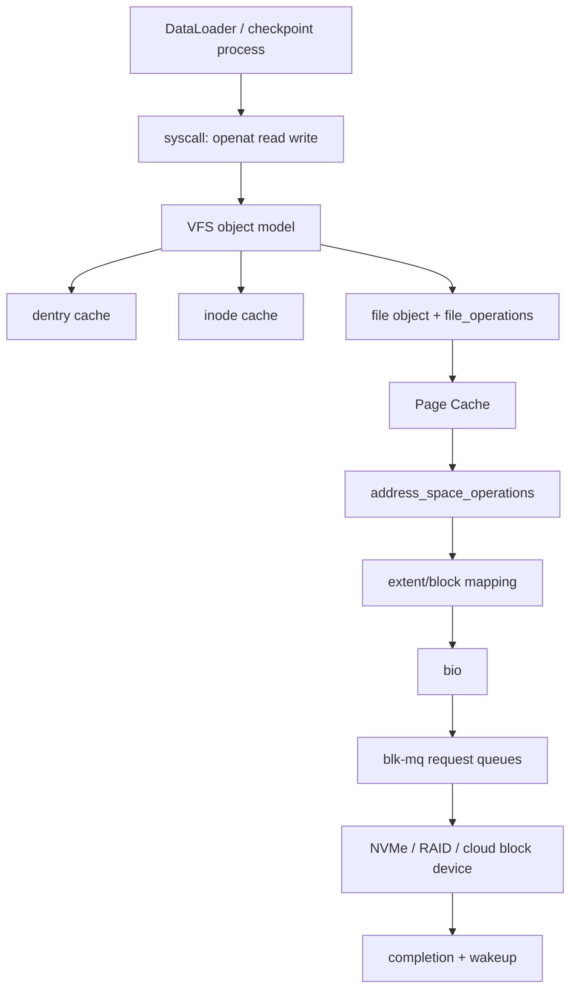

# 第 0c1 章 VFS、inode/dentry 与 Block Layer

> **关联章节**：本章承接 [0b2](0b2-page-cache-writeback-and-huge-pages.md) 的 Page Cache 讨论，向下连接具体文件系统和设备队列；本地文件系统见 [0c2](0c2-local-filesystems-ext4-xfs-zfs.md)，持久化语义见 [0c3](0c3-storage-semantics-fsync-direct-io-and-checkpoints.md)。

## 1. 第一性原理拆解 + 学习地图

### 拆：不可化简的问题

应用把文件系统看成路径、fd 和字节流。
内核必须同时处理命名、权限、缓存、块映射、排队、完成通知和错误传播。
AI workload 又把这些问题放大：DataLoader 会并发 `open/stat/read`，checkpoint 会产生大顺序写，权重加载会触发 `mmap` fault，容器 overlay 会改变路径解析成本。

### 推：从问题推出机制

- 多种文件系统要共享系统调用，所以需要 VFS 把差异封装在对象和操作表后面。
- 路径名不是文件身份，所以需要 dentry 缓存路径分量，inode 保存对象身份和元数据。
- 重复读取不能每次下盘，所以需要 Page Cache 缓存 inode + offset 对应的文件页。
- 块设备不能被每个文件系统直接驱动，所以需要 block layer、bio、request、blk-mq 和设备队列。
- 性能诊断必须分层，否则会把 dentry miss、Page Cache miss、IO scheduler 排队和 NVMe 饱和混成一个“磁盘慢”。

### 概念先说清楚

VFS（Virtual File System）不是某一种文件系统，而是 Linux 内核给所有文件系统套上的统一对象模型。应用看到的是 `openat()`、`read()`、`write()`、`mmap()` 和 fd；VFS 看到的是 superblock、mount、dentry、inode、file、address_space 这些对象，以及每个具体文件系统挂上来的操作表。ext4、XFS、ZFS、NFS、FUSE 和 overlayfs 可以表现出同一套系统调用接口，靠的就是 VFS 把“通用路径”和“具体文件系统实现”分开。

inode 是文件对象的身份，不是文件名。它保存权限、大小、时间戳、link count、block mapping 等元数据，并连接到具体文件系统的实现。dentry 是路径分量到 inode 的解析结果，也可以缓存“这个名字不存在”的 negative lookup。`/data/a.jpg` 这条路径会经过多个 dentry；最终指到的 inode 才是文件身份。一个 inode 可以有多个 hard link，所以“路径删除了”不等于“数据立刻消失”，只要 link count 或打开的 file object 还在，空间就可能继续被占用。

Block Layer 是文件系统之下、块设备之上的排队和请求抽象。文件系统决定逻辑 offset 对应哪些块，Page Cache 决定哪些页已经在内存，Block Layer 则把缺失页或写回页转成 bio/request，排进 blk-mq 队列，再交给 NVMe、云盘、RAID 或远端块设备。也就是说，VFS 解决“名字和对象”，Page Cache 解决“文件页是否在内存”，Block Layer 解决“块 IO 如何排队到设备”。把这三层边界分清楚，才不会把 `open/stat` 元数据慢、Page Cache miss、设备队列饱和和远端文件系统 RPC 慢混成一个笼统的“磁盘慢”。

### 绘：一次读取的端到端路径



### 导：本章读完后能做什么

1. 解释 `openat()` 为什么可能比 `read()` 更贵。
2. 区分 superblock、mount、dentry、inode、file、address_space 和 page。
3. 判断小文件慢是 VFS 元数据、Page Cache、块设备还是远端文件系统导致。
4. 用 `fio` 构造接近训练 workload 的测试，而不是只跑默认吞吐。
5. 用 `slabtop`、`pidstat`、`iostat`、`blktrace` 或 eBPF 建立分层证据。

## 2. VFS 的最小模型

VFS 是 Linux 文件 IO 的统一对象模型。
它让应用用同一组系统调用访问 ext4、XFS、ZFS、NFS、FUSE、overlayfs、tmpfs 和 procfs。
统一 API 不代表统一性能，也不代表统一持久化语义。

VFS 的核心价值是把“路径到文件对象”的过程拆成一组可缓存对象。
路径解析得到 dentry。
dentry 指向 inode 或记录 negative lookup。
inode 绑定具体文件系统的操作。
进程打开后得到 file object，file object 保存 offset、flags、引用计数和操作表。

| VFS 对象 | 近似含义 | 典型缓存 | miss 代价 | AI 诊断信号 |
|---|---|---|---|---|
| superblock | 一个已挂载文件系统实例 | superblock cache | mount 或远端协商 | `findmnt`、挂载参数不一致 |
| mount | namespace 中的挂载点 | mount tree | 路径跨挂载点 | 容器内外路径表现不同 |
| dentry | 名字到 inode 的解析结果 | dentry slab | 目录块读取或 lookup RPC | `open/stat` 慢、MDS busy |
| inode | 文件身份和元数据 | inode slab | inode 读取或远端 getattr | inode slab 膨胀、`df -ih` 紧张 |
| file | 打开后的进程视图 | fd table | `open` 分配 | fd 泄漏、`lsof` 爆炸 |
| page/folio | 文件页缓存 | Page Cache | 设备或网络读取 | first epoch 慢、cache hit 后变快 |
| request | 块层请求 | blk-mq | 设备排队 | `iostat await/aqu-sz` 升高 |

## 3. superblock、mount、inode、dentry、file

superblock 表示一个挂载实例。
同一块设备可以用不同参数挂载，VFS 通过 superblock 保存文件系统级状态。
容器里常见的 overlayfs 会把 lowerdir、upperdir 和 workdir 组合成新的可见层，因此同一条应用路径可能不直接对应宿主机上的一个普通目录。

mount 把 superblock 接到路径树上。
路径解析遇到 mount point 时会切换到另一个 superblock。
这解释了为什么容器里 `/data` 和宿主机 `/data` 的文件系统类型、inode number、挂载参数可能不同。

inode 是对象身份，不是路径。
一个 inode 可以被多个 hard link 命名。
删除路径只是减少 link count；只要还有进程持有 file object，数据块仍可能存在。
训练任务写临时 checkpoint 后忘记关闭 fd，会出现 `df` 空间不降但目录里看不到大文件的现象。

Dentry 是路径解析缓存。
positive dentry 指向 inode。
negative dentry 记录“这个名字不存在”，避免反复访问目录或远端 MDS。
海量随机文件名会挤压 dentry cache，使目录遍历和 `stat()` 变成系统级噪声源。

file object 是每次 `open()` 的结果。
两个进程打开同一个 inode，会得到不同 file object，各自保存 offset 和 flags。
`dup()` 共享 file object，所以也共享 offset。
这在多线程读取同一个 fd 时会制造非预期的 offset 竞争。

## 4. 路径解析为什么会慢

路径 `/mnt/dataset/imagenet/train/n01440764/img001.jpg` 不是一次哈希查找。
内核要逐级处理 `/`、`mnt`、`dataset`、`imagenet`、`train`、`n01440764`、`img001.jpg`。
每个分量都可能命中 dentry cache，也可能触发目录块读取或远端 lookup。

路径解析的隐藏成本包括：

- mount namespace 查找：容器和宿主机可能走不同挂载树。
- 权限检查：每级目录都要校验 execute 权限。
- symlink 展开：符号链接可能引入额外路径解析和循环检测。
- automount：访问某个路径分量可能触发挂载。
- network lookup：NFS、Lustre、GPFS、FUSE 对 dentry miss 的代价远高于本地内存命中。

命令观测：

```bash
namei -l /mnt/dataset/imagenet/train/n01440764/img001.jpg
findmnt -T /mnt/dataset -o TARGET,SOURCE,FSTYPE,OPTIONS
strace -f -tt -e trace=openat,newfstatat,read,close -p <pid>
slabtop -o | egrep 'dentry|inode|xfs_inode|ext4_inode'
```

判断方法：如果 `strace` 看到大量 `openat/newfstatat`，但 `iostat` 吞吐很低、MDS 或客户端 CPU 很高，问题多半在元数据路径。
如果 `read()` 阻塞且 `iostat` `r/s`、`await`、`aqu-sz` 同时升高，问题更接近数据路径或设备队列。

## 5. open/read/write 的路径

`openat()` 的关键路径：

```text
openat(dirfd, path, flags)
  -> resolve dirfd and mount namespace
  -> namei walks each path component
  -> dentry hit: reuse cached result
  -> dentry miss: call filesystem lookup
  -> permission and LSM checks
  -> allocate file object
  -> install fd into process fd table
```

`read()` 的 buffered 路径：

```text
read(fd, user_buf, len)
  -> file object gives inode and current offset
  -> Page Cache lookup by inode + offset
  -> hit: copy page to user buffer
  -> miss: filesystem maps offset to blocks or remote object
  -> submit bio/request or network RPC
  -> fill Page Cache
  -> copy to user buffer and advance offset
```

`write()` 的 buffered 路径：

```text
write(fd, user_buf, len)
  -> copy user bytes into Page Cache pages
  -> mark pages dirty
  -> update inode size/mtime in memory
  -> return before device persistence unless sync flag applies
  -> background writeback or fsync later submits IO
```

这个路径解释了三个常见误判。
第一，`write()` 快可能只是脏页吸收。
第二，第二轮读取快可能只是 Page Cache 命中。
第三，`read()` 慢不一定是磁盘慢，可能是路径解析或 inode 获取慢。

## 6. Page Cache 与 0b2 的边界

0b2 关注 Page Cache 的内存侧：文件页、dirty page、writeback、reclaim、cgroup 和 huge page。
本章关注 Page Cache 在文件 IO 链路中的位置：它位于 VFS/file object 与具体文件系统之间。

Page Cache 的 key 可以近似理解为 `(address_space, file offset)`。
对普通文件，address_space 通常挂在 inode 上。
这意味着同一文件被多个进程打开时，buffered read 共享缓存。
这也意味着 benchmark 如果不控制 cache 状态，很容易测到内存复制，而不是设备 IO。

观测命令：

```bash
free -h
grep -E 'Cached|Active\(file\)|Inactive\(file\)|Dirty|Writeback|SReclaimable' /proc/meminfo
vmstat 1
pidstat -d -p <pid> 1
```

冷缓存测试可以重启 job、换文件名、扩大数据集到内存之外，或在专用测试机上 drop cache。
不要在共享训练节点随意执行 `echo 3 > /proc/sys/vm/drop_caches`，它会影响同机其他任务。

## 7. Direct IO 与 Page Cache 的分工

`O_DIRECT` 尝试绕过 Page Cache，直接在用户缓冲区和设备之间传输。
它适合想避免双重缓存、控制 IO 并发、或写大 checkpoint 的场景。
它不自动保证持久化；是否落到稳定介质仍要看 `fsync()`、设备 cache 和文件系统语义。

Direct IO 的代价是对齐和短 IO 管理。
许多文件系统要求 buffer 地址、长度、offset 与块大小或设备逻辑扇区对齐。
不对齐时可能失败，也可能退化为 buffered IO，取决于内核和文件系统。
训练框架里如果每个 tensor 分片都发小 Direct IO，可能比 buffered IO 更差。

## 8. Block layer 和 blk-mq

文件系统最终会把读写映射成 bio。
bio 描述一组块设备扇区和内存页。
block layer 把 bio 合并、调度、转换成 request。
现代 Linux 的 blk-mq 为多核和多队列设备设计，每个 CPU 可以拥有软件提交队列，硬件队列对应 NVMe submission queue。

| 层 | 看到的信息 | 不知道的信息 | 可观测指标 |
|---|---|---|---|
| VFS | fd、inode、offset | 设备队列细节 | syscall latency |
| 文件系统 | extent、block、journal | 应用语义 | fragmentation、metadata IO |
| block layer | sector、size、rw flag | 文件名、tensor 名 | `iostat`、`blktrace` |
| NVMe | command queue | 文件系统结构 | queue depth、completion latency |

常用 scheduler：

- `none`：常用于 NVMe，尽量少做调度。
- `mq-deadline`：控制读写延迟，适合需要稳定尾延迟的块设备。
- `bfq`：偏交互公平性，训练吞吐场景不一定合适。

查看队列：

```bash
lsblk -o NAME,TYPE,SIZE,FSTYPE,MOUNTPOINTS,ROTA,SCHED
cat /sys/block/nvme0n1/queue/scheduler
cat /sys/block/nvme0n1/queue/nr_requests
cat /sys/block/nvme0n1/queue/read_ahead_kb
```

## 9. fio：不要只跑一个默认测试

`fio` 是构造 IO 形状的工具，不是替你定义 workload 的工具。
训练读取要区分小文件 open/read、tar shard 顺序读、随机样本 mmap、大 checkpoint 写和多进程混合。

顺序读 shard：

```bash
fio --name=seq-read --directory=/mnt/dataset \
  --rw=read --bs=1m --size=64g --numjobs=4 --iodepth=16 \
  --direct=1 --ioengine=libaio --group_reporting
```

随机 4K 读设备能力：

```bash
fio --name=rand4k --filename=/mnt/dataset/fio.bin \
  --rw=randread --bs=4k --size=32g --numjobs=8 --iodepth=64 \
  --direct=1 --ioengine=libaio --runtime=120 --time_based --group_reporting
```

buffered 读缓存效应：

```bash
fio --name=warm-cache --filename=/mnt/dataset/fio.bin \
  --rw=read --bs=1m --size=32g --numjobs=1 --iodepth=1 \
  --direct=0 --ioengine=sync --group_reporting
```

解释结果时至少看 `bw`、`iops`、`clat percentiles`、`iodepth` 分布和 CPU 使用。
如果 `direct=0` 远高于 `direct=1`，不要立刻得出设备很快的结论。
如果 `iodepth=1` 慢而 `iodepth=32` 快，说明设备需要并发填满队列，但训练 worker 是否能提供这样的并发要另测。

## 10. 命令观测：从 syscall 到设备

先看进程是否真的在做 IO：

```bash
pidstat -d -p <pid> 1
cat /proc/<pid>/io
lsof -p <pid> | head
```

再看系统和设备：

```bash
iostat -x 1
sar -d 1
vmstat 1
dmesg -T | egrep -i 'nvme|blk|io error|timeout'
```

再看文件系统和缓存：

```bash
df -hT /mnt/dataset
df -ih /mnt/dataset
stat -f -c 'type=%T bsize=%S blocks=%b files=%c' /mnt/dataset
slabtop -o | egrep 'dentry|inode'
```

需要更细时可以用 eBPF 或 perf：

```bash
perf trace -p <pid> --event 'syscalls:sys_enter_openat,syscalls:sys_exit_openat'
# 如果安装了 bcc/bpftrace，可按环境使用 opensnoop、fileslower、biolatency、biosnoop。
```

## 11. Mini case：小文件 DataLoader 抖动

现象：8 卡训练，GPU utilization 在 35% 到 95% 间跳动。
数据集是 1200 万张 JPEG，目录按类别分层，单文件 20KB 到 300KB。
节点本地 NVMe 没满，`iostat` 平均吞吐只有 300MB/s。

第一轮观测：

```bash
strace -f -c -e trace=openat,newfstatat,read,close -p <loader_pid>
pidstat -d -p <loader_pid> 1
iostat -x 1
slabtop -o | egrep 'dentry|inode'
```

结果：`openat/newfstatat` 次数远高于 `read()`，单次 `read()` 很短；`iostat` 的 `r/s` 高但 `rkB/s` 不高；`slabtop` 里 dentry 和 inode 频繁增长；GPU idle 峰值对应 DataLoader 等待 batch。

结论：瓶颈不是顺序带宽，而是小文件元数据和随机小 IO。
修复方向不是换一个更大的顺序读带宽，而是改变 IO 形状。

可选方案：

- 把图片打成 tar/WebDataset shard，每个 shard 256MB 到 2GB。
- 每个 worker 读取不同 shard，减少跨 worker 抢同一目录。
- 预生成 index，训练时不递归 `listdir/stat`。
- 在节点本地 SSD 做只读 cache，cache key 用 dataset version + shard id。
- 对共享文件系统，避免所有 rank 同时扫同一目录树。

## 12. Worked example：设计一个 fio 对照实验

目标：判断训练慢是 Page Cache warmup、设备队列还是小文件元数据。
设计三组实验。

| 实验 | 命令形状 | 回答的问题 |
|---|---|---|
| 顺序 Direct IO | `rw=read bs=1m direct=1 iodepth=16` | 后端最大顺序读能力 |
| buffered 二次读 | `direct=0` 连跑两次 | Page Cache 能否解释加速 |
| 小文件脚本 | Python 多进程 `open/read/close` | 元数据和短读成本 |

小文件脚本不需要复杂：

```python
from pathlib import Path
from concurrent.futures import ThreadPoolExecutor

files = list(Path('/mnt/dataset').glob('**/*.jpg'))[:200000]

def one(p):
    with open(p, 'rb') as f:
        return len(f.read(4096))

with ThreadPoolExecutor(max_workers=32) as ex:
    print(sum(ex.map(one, files)))
```

如果顺序 Direct IO 达到 5GB/s，而小文件脚本只有 80MB/s，瓶颈是 IO 形状。
如果两者都慢且 `iostat await` 高，瓶颈更接近设备或远端存储。
如果第二次 buffered 读显著变快，训练首轮和后续 epoch 要分开评估。

## 13. SOP：从症状定位层级

1. 固定现象：GPU idle、step time、batch wait、checkpoint duration 或 load latency。
2. 确认文件系统：`findmnt -T`、`df -hT`、挂载参数、是否 overlay/FUSE/网络文件系统。
3. 看进程 IO：`pidstat -d`、`/proc/<pid>/io`、`strace -c`。
4. 分离元数据和数据：统计 `open/stat` 次数、平均文件大小、目录 fanout。
5. 分离缓存和设备：cold/warm 两组测试，`direct=0/1` 两组测试。
6. 看设备队列：`iostat -x` 的 `r/s w/s rkB/s wkB/s await aqu-sz util`。
7. 看内核缓存：`/proc/meminfo`、`slabtop`、dirty/writeback。
8. 只改一个变量：worker 数、shard 大小、`prefetch_factor`、`numjobs`、`iodepth`、本地 cache。
9. 把结果写成表格，记录命令、参数、数据集版本和机器型号。

## 14. Checklist

- 是否区分路径解析、inode 获取、Page Cache 命中和设备 IO？
- 是否知道当前路径所在的真实文件系统和挂载参数？
- 是否测过 cold cache 与 warm cache？
- 是否避免用 `fio direct=0` 代表设备能力？
- 是否把小文件问题转化为 shard、index 或本地 cache 问题？
- 是否观察过 dentry/inode slab、fd 数和目录 fanout？
- 是否把 `iodepth` 和训练 worker 并发对应起来？
- 是否记录 `iostat` 延迟分位或至少持续观察 `await/aqu-sz`？

## 15. 练习

1. 画出 `openat('/mnt/a/b/c.jpg')` 的路径解析过程，标出每一级可能的 dentry miss。
2. 解释同一个文件被两个进程 buffered read 时为什么能共享 Page Cache。
3. 给出一个 `fio` 命令，模拟 4 个 worker 顺序读取 1MB shard block。
4. 看到 `write()` 很快但 `Dirty` 持续上升，应如何解释？
5. 设计一个实验，证明 DataLoader 慢来自小文件元数据而不是设备顺序带宽。
