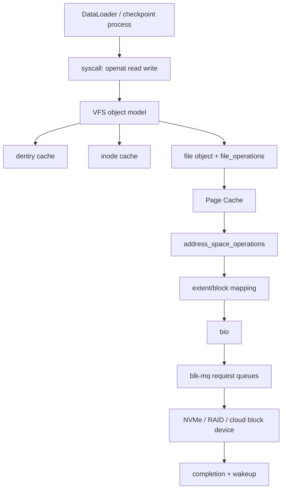

# 第 0c1 章 VFS、inode/dentry 与 Block Layer

> **关联章节**：本章承接 [0b2](0b2-page-cache-writeback-and-huge-pages.md) 的 Page Cache 讨论，向下连接具体文件系统和设备队列；本地文件系统见 [0c2](0c2-local-filesystems-ext4-xfs-zfs.md)，持久化语义见 [0c3](0c3-storage-semantics-fsync-direct-io-and-checkpoints.md)。

## 1. 第一性原理拆解 + 学习地图

### 拆：不可化简的问题

应用把文件系统看成路径、fd 和字节流。
内核必须同时处理命名、权限、缓存、块映射、排队、完成通知和错误传播。
AI workload 又把这些问题放大：DataLoader 会并发 `open/stat/read`，checkpoint 会产生大顺序写，权重加载会触发 `mmap` fault，容器 overlay 会改变路径解析成本。

### 推：从问题推出机制

- 多种文件系统要共享系统调用，所以需要 VFS 把差异封装在对象和操作表后面。
- 路径名不是文件身份，所以需要 dentry 缓存路径分量，inode 保存对象身份和元数据。
- 重复读取不能每次下盘，所以需要 Page Cache 缓存 inode + offset 对应的文件页。
- 块设备不能被每个文件系统直接驱动，所以需要 block layer、bio、request、blk-mq 和设备队列。
- 性能诊断必须分层，否则会把 dentry miss、Page Cache miss、IO scheduler 排队和 NVMe 饱和混成一个“磁盘慢”。

### 概念先说清楚

VFS（Virtual File System）不是某一种文件系统，而是 Linux 内核给所有文件系统套上的统一对象模型。应用看到的是 `openat()`、`read()`、`write()`、`mmap()` 和 fd；VFS 看到的是 superblock、mount、dentry、inode、file、address_space 这些对象，以及每个具体文件系统挂上来的操作表。ext4、XFS、ZFS、NFS、FUSE 和 overlayfs 可以表现出同一套系统调用接口，靠的就是 VFS 把“通用路径”和“具体文件系统实现”分开。

inode 是文件对象的身份，不是文件名。它保存权限、大小、时间戳、link count、block mapping 等元数据，并连接到具体文件系统的实现。dentry 是路径分量到 inode 的解析结果，也可以缓存“这个名字不存在”的 negative lookup。`/data/a.jpg` 这条路径会经过多个 dentry；最终指到的 inode 才是文件身份。一个 inode 可以有多个 hard link，所以“路径删除了”不等于“数据立刻消失”，只要 link count 或打开的 file object 还在，空间就可能继续被占用。

Block Layer 是文件系统之下、块设备之上的排队和请求抽象。文件系统决定逻辑 offset 对应哪些块，Page Cache 决定哪些页已经在内存，Block Layer 则把缺失页或写回页转成 bio/request，排进 blk-mq 队列，再交给 NVMe、云盘、RAID 或远端块设备。也就是说，VFS 解决“名字和对象”，Page Cache 解决“文件页是否在内存”，Block Layer 解决“块 IO 如何排队到设备”。把这三层边界分清楚，才不会把 `open/stat` 元数据慢、Page Cache miss、设备队列饱和和远端文件系统 RPC 慢混成一个笼统的“磁盘慢”。

### 绘：一次读取的端到端路径



### 导：本章读完后能做什么

1. 解释 `openat()` 为什么可能比 `read()` 更贵。
2. 区分 superblock、mount、dentry、inode、file、address_space 和 page。
3. 判断小文件慢是 VFS 元数据、Page Cache、块设备还是远端文件系统导致。
4. 用 `fio` 构造接近训练 workload 的测试，而不是只跑默认吞吐。
5. 用 `slabtop`、`pidstat`、`iostat`、`blktrace` 或 eBPF 建立分层证据。

## 2. VFS 的最小模型

VFS 是 Linux 文件 IO 的统一对象模型。
它让应用用同一组系统调用访问 ext4、XFS、ZFS、NFS、FUSE、overlayfs、tmpfs 和 procfs。
统一 API 不代表统一性能，也不代表统一持久化语义。

VFS 的核心价值是把“路径到文件对象”的过程拆成一组可缓存对象。
路径解析得到 dentry。
dentry 指向 inode 或记录 negative lookup。
inode 绑定具体文件系统的操作。
进程打开后得到 file object，file object 保存 offset、flags、引用计数和操作表。

| VFS 对象 | 近似含义 | 典型缓存 | miss 代价 | AI 诊断信号 |
|---|---|---|---|---|
| superblock | 一个已挂载文件系统实例 | superblock cache | mount 或远端协商 | `findmnt`、挂载参数不一致 |
| mount | namespace 中的挂载点 | mount tree | 路径跨挂载点 | 容器内外路径表现不同 |
| dentry | 名字到 inode 的解析结果 | dentry slab | 目录块读取或 lookup RPC | `open/stat` 慢、MDS busy |
| inode | 文件身份和元数据 | inode slab | inode 读取或远端 getattr | inode slab 膨胀、`df -ih` 紧张 |
| file | 打开后的进程视图 | fd table | `open` 分配 | fd 泄漏、`lsof` 爆炸 |
| page/folio | 文件页缓存 | Page Cache | 设备或网络读取 | first epoch 慢、cache hit 后变快 |
| request | 块层请求 | blk-mq | 设备排队 | `iostat await/aqu-sz` 升高 |

### 2.1 对象之间的指针：从 fd 到设备的链路

VFS 的对象不是孤立的，它们通过指针组成一棵带 cache 的图。理解这张图，"为什么 ext4 能和 NFS 共享 syscall"和"open 路径上每一步在做什么"才不再是黑盒。

简化的指针关系：

```text
task_struct
  └─ files_struct
       └─ fd_array[fd] ──→ struct file
                              ├─ f_path.dentry ──→ struct dentry
                              │                       ├─ d_inode ──→ struct inode
                              │                       │                ├─ i_sb ──→ struct super_block
                              │                       │                │            ├─ s_type ──→ struct file_system_type ("ext4"/"xfs"/"nfs")
                              │                       │                │            ├─ s_op ──→ super_operations
                              │                       │                │            └─ s_bdev ──→ struct block_device
                              │                       │                ├─ i_op ──→ inode_operations
                              │                       │                ├─ i_fop ──→ file_operations
                              │                       │                └─ i_mapping ──→ struct address_space
                              │                       │                                   ├─ a_ops ──→ address_space_operations
                              │                       │                                   └─ i_pages (xarray of pages)
                              │                       └─ d_parent ──→ 上一级 dentry
                              ├─ f_path.mnt ──→ struct vfsmount
                              ├─ f_op ──→ file_operations (从 inode->i_fop 复制而来)
                              ├─ f_pos (current offset)
                              └─ private_data (FS-specific 状态)
```

几个关键点：

- **`fd` 只是数组下标**，真正的状态在 `struct file`。`dup()` 让两个 fd 指向同一个 `file`，所以共享 offset；两次独立的 `open()` 创建两个 `file`，offset 独立。
- **`dentry` 是路径分量缓存**，挂在全局 dentry hash 上，可以被多个 `file` 通过 `f_path.dentry` 引用。
- **`inode` 是文件身份**，hard link 让多个 dentry 指向同一个 inode；`unlink` 减少 `i_nlink`，归零后 `iput` 触发 FS 释放磁盘空间。
- **`address_space` 是文件页缓存的索引**，挂在 inode 上（普通文件）或 block_device 上（裸块设备读写）。Page Cache 的 lookup 是 `(address_space, offset)` 这两个 key。
- **`super_block`** 是一次 mount 的全局状态，所有该 mount 上的 inode 都通过 `i_sb` 指向同一个 super_block；它持有 `file_system_type` 决定具体 FS 实现。

### 2.2 操作表：VFS 的虚函数 dispatch

VFS 之所以能让 `read()` 同时跑在 ext4、XFS、NFS 上，靠的是**操作表**——每个 VFS 对象上挂一组函数指针，具体 FS 在 mount 时填进去。这是纯 C 写法的"虚函数"。

主要操作表：

| 操作表 | 挂在哪 | 关键方法 | 谁实现 |
|---|---|---|---|
| `super_operations` | super_block | `alloc_inode`、`destroy_inode`、`sync_fs`、`statfs` | 具体 FS（ext4/xfs/nfs） |
| `inode_operations` | inode | `lookup`、`create`、`link`、`unlink`、`rename`、`mkdir`、`getattr`、`setattr` | 具体 FS |
| `file_operations` | inode（`i_fop`），open 时复制到 file（`f_op`） | `read_iter`、`write_iter`、`mmap`、`fsync`、`unlocked_ioctl`、`splice_*` | 具体 FS |
| `address_space_operations` | address_space | `readpage`/`read_folio`、`writepage`、`writepages`、`direct_IO`、`migrate_folio` | 具体 FS |
| `dentry_operations` | dentry | `d_revalidate`（NFS 用）、`d_hash`、`d_compare`、`d_release` | 具体 FS（本地 FS 通常用默认） |
| `vm_operations_struct` | mmap 出来的 vma | `fault`、`map_pages`、`page_mkwrite` | 通过 `file_operations.mmap` 注册 |

dispatch 实例：`read(fd, buf, n)` 的核心几行（简化）：

```c
ssize_t ksys_read(unsigned int fd, char __user *buf, size_t count) {
    struct file *f = fdget_pos(fd).file;
    return vfs_read(f, buf, count, &f->f_pos);
}

ssize_t vfs_read(struct file *file, char __user *buf, size_t count, loff_t *pos) {
    if (file->f_op->read_iter)        // ← 这一行是 dispatch
        return new_sync_read(file, buf, count, pos);
    if (file->f_op->read)
        return file->f_op->read(file, buf, count, pos);
    return -EINVAL;
}
```

`file->f_op` 在 `open` 时从 `inode->i_fop` 复制而来；`inode->i_fop` 是 ext4/XFS/NFS 在分配 inode 时填的（ext4 用 `ext4_file_operations`，XFS 用 `xfs_file_operations`）。所以同一行 `read(fd, ...)` 会跳到完全不同的实现，但调用者无感。

这套机制对 AI infra 工程师的意义：

- **看到性能差异时，先想是哪一层的 ops 在生效**。比如 NFS 的 `read_iter` 会发 RPC，本地 ext4 走 Page Cache lookup——同样的 syscall，路径完全不同。
- **`address_space_operations.direct_IO`** 是 Direct IO 的实际入口；某 FS 不实现这个方法 = `O_DIRECT` 不可用。
- **FUSE 的实现就是把所有 ops 转发到用户态 daemon**——这就是 FUSE 的 2-5× 延迟惩罚的来源（每次 ops 调用要 user/kernel round-trip 一次）。
- **overlayfs 不是真正存数据的 FS**，它的 ops 把 read 转发到 lowerdir 对应文件、write 转发到 upperdir——容器镜像的层叠就是这套 dispatch 实现的。

## 3. superblock、mount、inode、dentry、file

superblock 表示一个挂载实例。
同一块设备可以用不同参数挂载，VFS 通过 superblock 保存文件系统级状态。
容器里常见的 overlayfs 会把 lowerdir、upperdir 和 workdir 组合成新的可见层，因此同一条应用路径可能不直接对应宿主机上的一个普通目录。

mount 把 superblock 接到路径树上。
路径解析遇到 mount point 时会切换到另一个 superblock。
这解释了为什么容器里 `/data` 和宿主机 `/data` 的文件系统类型、inode number、挂载参数可能不同。

inode 是对象身份，不是路径。
一个 inode 可以被多个 hard link 命名。
删除路径只是减少 link count；只要还有进程持有 file object，数据块仍可能存在。
训练任务写临时 checkpoint 后忘记关闭 fd，会出现 `df` 空间不降但目录里看不到大文件的现象。诊断命令：

```bash
lsof +L1                 # 列出 link count=0 但仍被打开的文件
ls -l /proc/<pid>/fd/    # 直接看进程持有的 fd，对应 inode 是否还存活
```

Dentry 是路径解析缓存。
positive dentry 指向 inode。
negative dentry 记录“这个名字不存在”，避免反复访问目录或远端 MDS。
海量随机文件名会挤压 dentry cache，使目录遍历和 `stat()` 变成系统级噪声源。

file object 是每次 `open()` 的结果。
两个进程打开同一个 inode，会得到不同 file object，各自保存 offset 和 flags。
`dup()` 共享 file object，所以也共享 offset。
这在多线程读取同一个 fd 时会制造非预期的 offset 竞争。

## 4. 路径解析为什么会慢

路径 `/mnt/dataset/imagenet/train/n01440764/img001.jpg` 不是一次哈希查找。
内核要逐级处理 `/`、`mnt`、`dataset`、`imagenet`、`train`、`n01440764`、`img001.jpg`。
每个分量都可能命中 dentry cache，也可能触发目录块读取或远端 lookup。

路径解析的隐藏成本包括：

- mount namespace 查找：容器和宿主机可能走不同挂载树。
- 权限检查：每级目录都要校验 execute 权限。
- symlink 展开：符号链接可能引入额外路径解析和循环检测。
- automount：访问某个路径分量可能触发挂载。
- network lookup：NFS、Lustre、GPFS、FUSE 对 dentry miss 的代价远高于本地内存命中。

命令观测：

```bash
namei -l /mnt/dataset/imagenet/train/n01440764/img001.jpg
findmnt -T /mnt/dataset -o TARGET,SOURCE,FSTYPE,OPTIONS
strace -f -tt -e trace=openat,newfstatat,read,close -p <pid>
slabtop -o | egrep 'dentry|inode|xfs_inode|ext4_inode'
```

判断方法：如果 `strace` 看到大量 `openat/newfstatat`，但 `iostat` 吞吐很低、MDS 或客户端 CPU 很高，问题多半在元数据路径。
如果 `read()` 阻塞且 `iostat` `r/s`、`await`、`aqu-sz` 同时升高，问题更接近数据路径或设备队列。

### 4.1 解析的内部状态机：nameidata、RCU walk vs ref walk

内核做路径解析时维护一个 `nameidata` 结构，保存当前位置（`path` = dentry + vfsmount）、剩余字符串、解析模式、引用计数等。解析逐分量推进，每一步都是"在当前 dentry 下查找下一个名字"。

Linux 在 2008 年（2.6.38）引入两种 walk 模式，两者的代价差距是路径解析性能的核心：

**RCU walk（lockless 快路径）**：

- 不拿 dentry 引用计数、不持锁，纯靠 RCU 读侧保护。
- 每一步：在 dentry hash 中查 `(parent, name)`，若命中就直接前进。
- 整个解析全程不写任何 cache line（hot dentry 完全只读访问），多核并发解析同一路径几乎零干扰。
- 限制：只能在所有分量都命中 dentry cache 时成立；遇到 `d_revalidate`（NFS 需要校验缓存有效性）、需要慢路径的 mount point、symlink 展开都会 **drop out of RCU walk**，转 ref walk 重做。

**Ref walk（引用计数慢路径）**：

- 每一步对 dentry 调 `dget`（原子加引用），下一步进入前对前一个 dentry 调 `dput`。
- 必要时拿 `parent->d_lock` 做 lookup。
- 可以调用 FS 的 `inode_operations.lookup`（dentry miss 时去读目录块或发 RPC）。
- 代价：每个 dentry 一次原子操作，**多核并发解析同一目录** 会在 dentry 引用计数上 ping-pong 缓存行，scaling 不好。

这就是为什么"all-warm 的 dentry cache"和"刚 drop_caches 的 dentry cache"性能差距远大于一个 disk read：前者全程 RCU walk + 0 原子操作，后者每分量都是 `dget`/`dput` + 可能的 lookup RPC。

`stat()` 风暴（DataLoader 的小文件场景）的真正代价在这——不是磁盘慢，是路径解析全程走 ref walk，多核 worker 在公共目录的 dentry 引用计数上互相打。

### 4.2 LOOKUP_* 标志：解析模式

`nameidata` 的 `flags` 决定解析行为，常见标志：

| 标志 | 含义 | 触发场景 |
|---|---|---|
| `LOOKUP_RCU` | 当前在 RCU walk 中 | 默认尝试，失败回退 |
| `LOOKUP_FOLLOW` | 最后一个分量是 symlink 时跟随 | `open(path)` 默认开 |
| `LOOKUP_DIRECTORY` | 路径必须是目录 | `opendir` 风格调用 |
| `LOOKUP_OPEN` / `LOOKUP_CREATE` / `LOOKUP_EXCL` | open 路径专用 | 配合 `O_CREAT`/`O_EXCL` |
| `LOOKUP_PARENT` | 只解析到父目录，最后一个分量留给调用者处理 | `unlink`、`rename` |
| `LOOKUP_BENEATH` / `LOOKUP_IN_ROOT` | `openat2(2)` 引入，限制不许"逃出" `dirfd` | 容器、安全沙箱 |
| `LOOKUP_NO_SYMLINKS` | 不跟随任何 symlink | 安全场景，防止 symlink 攻击 |

`openat2(2)` + `RESOLVE_*`（`RESOLVE_BENEATH`、`RESOLVE_NO_MAGICLINKS`、`RESOLVE_NO_XDEV` 等）是现代容器运行时和需要严格沙箱的服务用的接口——比 `openat()` 更精细控制 walk 行为。AI 训练平台多租户场景下，这是防止 symlink 越权访问别人 dataset 的现代方案。

### 4.3 mount point 与 symlink：fast path 退出点

普通分量在 dentry hash 命中是 RCU walk fast path。但解析路径上遇到这些情况会拖慢或退出 RCU：

- **mount point 跨越**：解析到一个 mount 的根，要切换到另一个 super_block。`__follow_mount_rcu` 处理大多数情况能保持在 RCU；但跨越 automount（按需挂载）必须退出 RCU 走 ref walk。
- **symlink 展开**：读 symlink 内容（`inode->i_link` 缓存或 FS 的 `get_link`）后，把内容拼到当前路径前继续解析。短 symlink 可在 RCU 内处理；需要 IO 读 symlink 内容的，退出 RCU。
- **`d_revalidate` 返回非缓存有效**：NFS 等远端 FS 在 dentry cache 命中时仍要校验"远端是否还在"，发现失效就退出 RCU 重 lookup。
- **挂载点是 FUSE**：FUSE 的 `dentry_operations.d_revalidate` 通常要 round-trip 用户态——这是 FUSE 路径解析慢的额外原因，叠加在 ops dispatch 慢之上。

诊断："`open` 突然变慢" 在共享 FS 上经常是 dentry cache 失效率上升导致 RCU walk 退出率上升；不是磁盘 IO 出问题。可以用 `perf stat -e 'fs:*' -p <pid>` 或 `bpftrace` hook `lookup_slow`、`__d_lookup_rcu` 看比例。

## 5. open/read/write 的路径

`openat()` 的关键路径：

```text
openat(dirfd, path, flags)
  -> resolve dirfd and mount namespace
  -> namei walks each path component
  -> dentry hit: reuse cached result
  -> dentry miss: call filesystem lookup
  -> permission and LSM checks
  -> allocate file object
  -> install fd into process fd table
```

`read()` 的 buffered 路径：

```text
read(fd, user_buf, len)
  -> file object gives inode and current offset
  -> Page Cache lookup by inode + offset
  -> hit: copy page to user buffer
  -> miss: filesystem maps offset to blocks or remote object
  -> submit bio/request or network RPC
  -> fill Page Cache
  -> copy to user buffer and advance offset
```

`write()` 的 buffered 路径：

```text
write(fd, user_buf, len)
  -> copy user bytes into Page Cache pages
  -> mark pages dirty
  -> update inode size/mtime in memory
  -> return before device persistence unless sync flag applies
  -> background writeback or fsync later submits IO
```

这个路径解释了三个常见误判。
第一，`write()` 快可能只是脏页吸收。
第二，第二轮读取快可能只是 Page Cache 命中。
第三，`read()` 慢不一定是磁盘慢，可能是路径解析或 inode 获取慢。

## 6. Page Cache 与 0b2 的边界

0b2 关注 Page Cache 的内存侧：文件页、dirty page、writeback、reclaim、cgroup 和 huge page。
本章关注 Page Cache 在文件 IO 链路中的位置：它位于 VFS/file object 与具体文件系统之间。

Page Cache 的 key 可以近似理解为 `(address_space, file offset)`。
对普通文件，address_space 通常挂在 inode 上。
这意味着同一文件被多个进程打开时，buffered read 共享缓存。
这也意味着 benchmark 如果不控制 cache 状态，很容易测到内存复制，而不是设备 IO。

观测命令：

```bash
free -h
grep -E 'Cached|Active\(file\)|Inactive\(file\)|Dirty|Writeback|SReclaimable' /proc/meminfo
vmstat 1
pidstat -d -p <pid> 1
```

冷缓存测试可以重启 job、换文件名、扩大数据集到内存之外，或在专用测试机上 drop cache。
不要在共享训练节点随意执行 `echo 3 > /proc/sys/vm/drop_caches`，它会影响同机其他任务。

应用侧主动管理 Page Cache 的两个常用接口：

- `posix_fadvise(fd, off, len, ADVISE)`：`POSIX_FADV_SEQUENTIAL` 提示扩大 readahead 窗口；`POSIX_FADV_DONTNEED` 主动驱逐已读完的范围（一次扫过的 dataset shard 用完就丢，避免污染 cache 影响热数据）。
- `readahead(fd, off, len)`：显式触发预读，常用于训练前 warmup 已知热文件（小型权重、tokenizer、index）。
- `mmap` + `madvise(MADV_WILLNEED / MADV_DONTNEED / MADV_HUGEPAGE)`：同等思路用于 `mmap` 路径，safetensors 走 `mmap` 时这一组很常用。

注意 `POSIX_FADV_DONTNEED` 不会等 dirty 页 writeback；如果在写路径调用，可能丢掉脏页内容到 disk 的提示效果。dataset 这种只读场景才安全使用。

## 7. Direct IO 与 Page Cache 的分工

`O_DIRECT` 尝试绕过 Page Cache，直接在用户缓冲区和设备之间传输。
它适合想避免双重缓存、控制 IO 并发、或写大 checkpoint 的场景。
它不自动保证持久化；是否落到稳定介质仍要看 `fsync()`、设备 cache 和文件系统语义。

Direct IO 的代价是对齐和短 IO 管理。
许多文件系统要求 buffer 地址、长度、offset 与设备逻辑扇区或文件系统块对齐。
**主流 ext4/XFS 在 Linux 上对不对齐的请求直接返回 `EINVAL`，不会"自动退化为 buffered IO"**——这是高频误传。NFS 在某些客户端实现上会退化，但本地 FS 不会，应用必须自己处理对齐。
训练框架里如果每个 tensor 分片都发小 Direct IO，可能比 buffered IO 更差。

Linux 6.1+ 提供 `statx(STATX_DIOALIGN)` 让应用查询某个文件支持的最小 Direct IO 对齐；老内核只能用经验值（NVMe 通常 512B 或 4KB 逻辑扇区，文件系统块通常 4KB）。

```bash
xfs_io -r -c 'statx -r' /mnt/data/some.bin | grep -i dio   # 5.x+ XFS 也可走 xfs_io
```

## 8. Block layer 和 blk-mq

文件系统最终会把读写映射成 bio。
bio 描述一组块设备扇区和内存页。
block layer 把 bio 合并、调度、转换成 request。
现代 Linux 的 blk-mq 为多核和多队列设备设计，每个 CPU 可以拥有软件提交队列，硬件队列对应 NVMe submission queue。

| 层 | 看到的信息 | 不知道的信息 | 可观测指标 |
|---|---|---|---|
| VFS | fd、inode、offset | 设备队列细节 | syscall latency |
| 文件系统 | extent、block、journal | 应用语义 | fragmentation、metadata IO |
| block layer | sector、size、rw flag | 文件名、tensor 名 | `iostat`、`blktrace` |
| NVMe | command queue | 文件系统结构 | queue depth、completion latency |

常用 scheduler：

- `none`：常用于 NVMe，尽量少做调度。数据中心 NVMe + 单租户训练节点几乎一律 `none`。
- `mq-deadline`：控制读写延迟，适合需要稳定尾延迟的块设备。
- `bfq`：偏交互公平性，训练吞吐场景不一定合适。

NVMe 关键参数（理解后再调）：

- 单设备硬件队列：典型 64-128 个 submission queue，每 queue depth 上限 1024。`io_uring` + `none` scheduler 可以打满。
- NVMe namespace：一块 NVMe 物理设备可暴露多个 namespace（`/dev/nvme0n1`、`/dev/nvme0n2`），用于多租户隔离或不同 sector 大小（512B vs 4KB）。`nvme list` 查看。
- `io_poll`（`/sys/block/nvme0n1/queue/io_poll`）：内核轮询完成而非中断，能降微秒级延迟，但吃 CPU；通常只在 latency-critical 路径打开。
- NVMe-oF（NVMe over Fabrics，TCP/RDMA）：训练存储节点把本地 NVMe 暴露给计算节点，看起来像本地块设备但走网络；调诊时记得它不是真本地。

查看队列：

```bash
lsblk -o NAME,TYPE,SIZE,FSTYPE,MOUNTPOINTS,ROTA,SCHED
cat /sys/block/nvme0n1/queue/scheduler
cat /sys/block/nvme0n1/queue/nr_requests
cat /sys/block/nvme0n1/queue/read_ahead_kb
cat /sys/block/nvme0n1/queue/io_poll
nvme list
nvme id-ctrl /dev/nvme0 | egrep 'mn|fr|nn|sqes|cqes'
```

### 8.1 bio 结构：block layer 的 IO 单位

`bio`（block IO）是 block layer 的基本单位，由文件系统在 writeback 或 read miss 时构造，描述"对哪些 sector 做读/写、数据来自/去往哪些内存页"。

简化的 bio 结构：

```c
struct bio {
    struct bio          *bi_next;          // 同一 request 内链表
    struct block_device *bi_bdev;          // 目标设备
    blk_opf_t           bi_opf;            // op (READ/WRITE) + flags (REQ_SYNC/REQ_FUA/REQ_PREFLUSH)
    struct bvec_iter    bi_iter;           // 当前进度（sector、size、bvec_idx、bvec_offset）
    unsigned short      bi_vcnt;           // bi_io_vec 数组长度
    struct bio_vec      *bi_io_vec;        // 数据描述：(page, offset, len) 数组
    bio_end_io_t        *bi_end_io;        // 完成回调
    void                *bi_private;       // FS 私有上下文（用于 endio）
};

struct bio_vec {
    struct page *bv_page;
    unsigned int bv_len;
    unsigned int bv_offset;
};
```

关键设计：

- **`bi_io_vec` 是 scatter-gather 列表**：一次 bio 可以涵盖多个**不连续的内存页**对应**连续的磁盘 sector**。这是为什么 Page Cache 的 dirty 页（来自 4KB 页框，但物理上分散）能高效写到磁盘的连续区段。
- **`bi_iter` 是游标**：bio 在 split / 部分完成后，`bi_iter` 推进，剩下未完成的部分继续走。`bio_split` / `bio_chain` 让 block layer 能把一个超大 bio 切成设备能接受的尺寸。
- **flags 表达语义**：`REQ_SYNC` 提示是同步请求（fsync 路径），调度器优先；`REQ_FUA` 是 Force Unit Access（参考 0c3 §13.5）；`REQ_PREFLUSH` 让设备先 FLUSH 旧数据再处理这条 bio。
- **`bi_end_io` 是回调链**：FS 用这个回调更新 inode 元数据、唤醒等待者、推进 fsync——bio 完成不是 polling 的，是回调驱动的。

### 8.2 bio → request：plug 合并

bio 不直接交给设备，要先合并成 `request`。`request` 是设备能直接接受的工作单位（NVMe submission queue 里的一条 SQE 通常对应一个 request）。

合并发生在两个层面：

**进程级 plug（`blk_start_plug` / `blk_finish_plug`）**：

- 内核在很多 IO 入口（`writeback`、`submit_bio`、ext4/XFS 的 commit 路径）会包一对 `blk_start_plug ... blk_finish_plug`。中间提交的 bio 暂存在当前 task 的 plug list 里，**不立刻派发**。
- `blk_finish_plug` 时，把 plug list 里相邻 sector 的 bio 合并成更大的 request。
- 这是为什么"writeback 时一次性涌出的几百 KB 脏页"在 `iostat` 上看是几个大 IO，而不是几百个 4KB IO——plug 把它们合了。
- 应用看不见 plug，但理解它能解释"为什么单线程 fsync 之后那一瞬间设备 util 突然到 100%"。

**调度器合并（front merge / back merge）**：

- request 进入 blk-mq 软件队列后，调度器（如 `mq-deadline`）还有一次合并机会：新来的 request 起始 sector 接在某个已有 request 末尾（back merge）或前面（front merge），可以合并。
- `none` 调度器跳过这一步，直接派发——NVMe 上推荐 `none` 的理由就是设备本身就能并行处理大量 small request，CPU 上做 merge 只是浪费。

合并的硬约束是 `max_sectors_kb`、`max_segments`（一个 request 最多多少 bio_vec）、`max_segment_size`，可在 `/sys/block/nvme0n1/queue/` 看。

### 8.3 blk-mq 两层队列

老版 single-queue block layer 有一个全局 lock，多核 IO 在 lock 上排队——NVMe 几百万 IOPS 时立刻成为瓶颈。**blk-mq（multi-queue block layer，3.13+，5.0 起强制）** 用两层队列消除这个 lock：

```text
应用 → submit_bio
                    ↓
   ┌────── 软件队列 (per-CPU, struct blk_mq_ctx) ──────┐
   │  CPU0 ctx │  CPU1 ctx │  CPU2 ctx │ ... │  CPU63 ctx
   └─────────────────┬─────────────────────────────────┘
                     ↓ (调度器在此合并/重排，none scheduler 直通)
   ┌────── 硬件队列 (per-hctx, struct blk_mq_hw_ctx) ──┐
   │  hctx0 │  hctx1 │  ... │  hctxN
   │   ↓        ↓             ↓
   │  NVMe SQ0  NVMe SQ1     NVMe SQN  (硬件 submission queue)
   └──────────────────────────────────────────────────┘
                     ↓
                  设备处理
                     ↓
                NVMe CQ (per-queue completion)
                     ↓ IRQ → softirq → bio_endio 链
```

- **软件队列**是 per-CPU 的，提交 IO 的 CPU 直接放进自己的 ctx——零锁竞争。
- **硬件队列**数量取决于设备能力（NVMe 通常 64-128 个）。kernel 维护 software-to-hardware queue 的 mapping，通常按 CPU NUMA / IRQ affinity 分配。
- **派发**：软件队列的 request 被批量推到对应硬件队列；驱动（NVMe）从硬件队列读 request，构造 NVMe command 写入 NVMe SQ doorbell，触发设备 fetch。
- **完成**：NVMe 设备完成 IO 后写 CQ，触发中断到指定 CPU（IRQ affinity 决定）。中断处理函数把 completion 标记进 hctx，调度 softirq 跑 `bio_endio` 回调链——这一步把 IO 结果传回 FS 和应用。

这套设计的几个直接含义：

- **NUMA 亲和很重要**：如果 IO 提交 CPU 和 NVMe IRQ CPU 跨 NUMA，request 在 NUMA 间反复迁移，吞吐打折。`/proc/interrupts` 看 nvme IRQ 分布，必要时 `irqbalance` 或手动 affinity。
- **`io_poll` 跳过中断**：高 IOPS 场景下中断本身是开销，开 `io_poll` 让提交 CPU 轮询硬件 CQ——延迟低、IOPS 高，但吃满 CPU。
- **`iostat -x` 的 `aqu-sz`** 是软件 + 硬件队列里 request 总数；NVMe 单设备健康吞吐下这个数字到几百是正常的（多硬件队列各自有几条 in-flight）。
- **多盘合一**：md raid、device-mapper、LVM 在 blk-mq 上叠加自己的 mq stack，形成多级队列；调诊时要清楚"看到的 `iostat`"是哪一层。

### 8.4 完成路径：从设备中断到应用唤醒

写一次 fsync 的完整后续是这样：

```text
NVMe 把数据写到 NAND → CQ 写完成项 → MSI-X 触发 IRQ → 落到指定 CPU
  → kernel IRQ handler (nvme_irq) 标记 hctx 上对应 request 完成
  → 调度 softirq (BLOCK_SOFTIRQ)
  → softirq 上下文跑 blk_complete_request → bio_endio
  → bio_endio 走 FS 注册的 end_io 回调链：
       ext4: ext4_end_bio 更新 extent 状态、唤醒 fsync waiter
       XFS:  xfs_end_io 推进 ioend、可能 commit log
  → 唤醒等在 fsync() 里的进程
  → fsync 返回到用户态
```

这条路径上每一段都可能成为延迟来源：IRQ 调度延迟、softirq 排队（`/proc/softirqs` 看 BLOCK 列）、FS endio 回调里的工作量、最后唤醒的调度延迟。

诊断工具：

- `bpftrace -e 'tracepoint:block:block_rq_complete { @[args->dev] = hist(args->nr_sector); }'` 看每设备完成 IO 的 size 分布。
- `perf record -e block:block_rq_issue,block:block_rq_complete` 配合 `perf script` 算 issue 到 complete 的时间。
- `blktrace` 给最完整的视图：bio queue → merge → issue → complete 每一步的时间戳。

## 8.5 GPUDirect Storage 与 cuFile

传统数据路径是 `NVMe → DMA → CPU 内存（Page Cache 或用户 buffer）→ cudaMemcpy → GPU 显存`，至少经过一次 CPU bounce。
**GPUDirect Storage（GDS）** 让 NVMe（或 NFSoRDMA、Lustre with GDS）直接 DMA 到 GPU 显存，绕过 CPU 内存。
应用接口是 NVIDIA `cuFile` API（`cuFileRead`/`cuFileWrite`），底层依赖 `nvidia-fs` 内核模块、对齐的 Direct IO，以及 NIC/NVMe 与 GPU 在同一 PCIe switch 或同一 NUMA。

适合场景：

- 大模型权重 cold load：百 GB 级 safetensors 一次性加载到 GPU，绕 CPU 能省内存带宽和 NUMA 抖动。
- 视频/医疗影像等高带宽 dataset：CPU 解码不是瓶颈时收益明显。
- 训练 checkpoint 直读：从 NVMe shard 直接还原到 GPU 优化器状态。

不适合：

- 小文件随机读：每次 cuFile 都要走 Direct IO 路径，对齐要求严格，小请求收益不抵元数据开销。
- 需要 CPU 解码（JPEG decode、tokenize）：数据必须先到 CPU 才能算，GDS 没意义。

诊断和拓扑见 [0d3c](0d3-rdma-roce-infiniband-and-gpudirect.md)。常见现象：未配 GDS 时 `nvidia-smi dmon` 显示 PCIe RX 流量集中在 GPU0，CPU 内存带宽被打满；配置正确后 `gdscheck -p` 报告 supported，且 `iostat` 上看不到对应 page-in 流量。

## 9. fio：不要只跑一个默认测试

`fio` 是构造 IO 形状的工具，不是替你定义 workload 的工具。
训练读取要区分小文件 open/read、tar shard 顺序读、随机样本 mmap、大 checkpoint 写和多进程混合。

顺序读 shard：

```bash
fio --name=seq-read --directory=/mnt/dataset \
  --rw=read --bs=1m --size=64g --numjobs=4 --iodepth=16 \
  --direct=1 --ioengine=libaio --group_reporting
```

随机 4K 读设备能力：

```bash
fio --name=rand4k --filename=/mnt/dataset/fio.bin \
  --rw=randread --bs=4k --size=32g --numjobs=8 --iodepth=64 \
  --direct=1 --ioengine=libaio --runtime=120 --time_based --group_reporting
```

buffered 读缓存效应：

```bash
fio --name=warm-cache --filename=/mnt/dataset/fio.bin \
  --rw=read --bs=1m --size=32g --numjobs=1 --iodepth=1 \
  --direct=0 --ioengine=sync --group_reporting
```

解释结果时至少看 `bw`、`iops`、`clat percentiles`、`iodepth` 分布和 CPU 使用。
如果 `direct=0` 远高于 `direct=1`，不要立刻得出设备很快的结论。
如果 `iodepth=1` 慢而 `iodepth=32` 快，说明设备需要并发填满队列，但训练 worker 是否能提供这样的并发要另测。

参考数字（用作"是否合理"的锚点，不是规格表）：

| 介质 | 顺序读 BW | 4K 随机读 IOPS | 4K 随机读延迟 p50 |
|---|---|---|---|
| 数据中心 NVMe Gen4（如 PM9A3、CD7） | 5-7 GB/s | 800k-1.5M | 60-100 μs |
| 数据中心 NVMe Gen5 | 10-14 GB/s | 1.5M-2.5M | 50-80 μs |
| AWS EBS gp3（默认） | 0.125 GB/s（需调 throughput 上限 1 GB/s） | 3k（需调 IOPS 上限 16k） | 1-3 ms |
| AWS EBS io2 Block Express | 4 GB/s | 256k | <1 ms |
| NFSv4 over 100GbE（典型） | 5-10 GB/s | 受 server 元数据限制 | 200-500 μs |
| Lustre over 200Gb HDR（聚合） | 取决于 OST 数 | 每 client 受 RPC 限制 | 300 μs-2 ms |
| S3 GET（同区域） | 单连接 ~100 MB/s，高并发 ~每实例数 GB/s | — | 30 ms（p50）/ 150 ms（p99） |

如果你测出的本地 NVMe 顺序读只有 1-2 GB/s，先怀疑挂载参数、CPU 亲和、PCIe lane 数、`iostat %util` 是否真到 100%，而不是默认设备坏了。

## 10. 命令观测：从 syscall 到设备

先看进程是否真的在做 IO：

```bash
pidstat -d -p <pid> 1
cat /proc/<pid>/io
lsof -p <pid> | head
```

再看系统和设备：

```bash
iostat -x 1
sar -d 1
vmstat 1
dmesg -T | egrep -i 'nvme|blk|io error|timeout'
```

再看文件系统和缓存：

```bash
df -hT /mnt/dataset
df -ih /mnt/dataset
stat -f -c 'type=%T bsize=%S blocks=%b files=%c' /mnt/dataset
slabtop -o | egrep 'dentry|inode'
```

需要更细时可以用 eBPF 或 perf：

```bash
perf trace -p <pid> --event 'syscalls:sys_enter_openat,syscalls:sys_exit_openat'
# 如果安装了 bcc/bpftrace，可按环境使用 opensnoop、fileslower、biolatency、biosnoop。
```

## 11. Mini case：小文件 DataLoader 抖动

现象：8 卡训练，GPU utilization 在 35% 到 95% 间跳动。
数据集是 1200 万张 JPEG，目录按类别分层，单文件 20KB 到 300KB。
节点本地 NVMe 没满，`iostat` 平均吞吐只有 300MB/s。

第一轮观测：

```bash
strace -f -c -e trace=openat,newfstatat,read,close -p <loader_pid>
pidstat -d -p <loader_pid> 1
iostat -x 1
slabtop -o | egrep 'dentry|inode'
```

结果：`openat/newfstatat` 次数远高于 `read()`，单次 `read()` 很短；`iostat` 的 `r/s` 高但 `rkB/s` 不高；`slabtop` 里 dentry 和 inode 频繁增长；GPU idle 峰值对应 DataLoader 等待 batch。

结论：瓶颈不是顺序带宽，而是小文件元数据和随机小 IO。
修复方向不是换一个更大的顺序读带宽，而是改变 IO 形状。

可选方案：

- 把图片打成 tar/WebDataset shard，每个 shard 256MB 到 2GB。
- 每个 worker 读取不同 shard，减少跨 worker 抢同一目录。
- 预生成 index，训练时不递归 `listdir/stat`。
- 在节点本地 SSD 做只读 cache，cache key 用 dataset version + shard id。
- 对共享文件系统，避免所有 rank 同时扫同一目录树。

## 12. Worked example：设计一个 fio 对照实验

目标：判断训练慢是 Page Cache warmup、设备队列还是小文件元数据。
设计三组实验。

| 实验 | 命令形状 | 回答的问题 |
|---|---|---|
| 顺序 Direct IO | `rw=read bs=1m direct=1 iodepth=16` | 后端最大顺序读能力 |
| buffered 二次读 | `direct=0` 连跑两次 | Page Cache 能否解释加速 |
| 小文件脚本 | Python 多进程 `open/read/close` | 元数据和短读成本 |

小文件脚本不需要复杂：

```python
from pathlib import Path
from concurrent.futures import ThreadPoolExecutor

files = list(Path('/mnt/dataset').glob('**/*.jpg'))[:200000]

def one(p):
    with open(p, 'rb') as f:
        return len(f.read(4096))

with ThreadPoolExecutor(max_workers=32) as ex:
    print(sum(ex.map(one, files)))
```

如果顺序 Direct IO 达到 5GB/s，而小文件脚本只有 80MB/s，瓶颈是 IO 形状。
如果两者都慢且 `iostat await` 高，瓶颈更接近设备或远端存储。
如果第二次 buffered 读显著变快，训练首轮和后续 epoch 要分开评估。

## 13. SOP：从症状定位层级

1. 固定现象：GPU idle、step time、batch wait、checkpoint duration 或 load latency。
2. 确认文件系统：`findmnt -T`、`df -hT`、挂载参数、是否 overlay/FUSE/网络文件系统。
3. 看进程 IO：`pidstat -d`、`/proc/<pid>/io`、`strace -c`。
4. 分离元数据和数据：统计 `open/stat` 次数、平均文件大小、目录 fanout。
5. 分离缓存和设备：cold/warm 两组测试，`direct=0/1` 两组测试。
6. 看设备队列：`iostat -x` 的 `r/s w/s rkB/s wkB/s await aqu-sz util`。
7. 看内核缓存：`/proc/meminfo`、`slabtop`、dirty/writeback。
8. 只改一个变量：worker 数、shard 大小、`prefetch_factor`、`numjobs`、`iodepth`、本地 cache。
9. 把结果写成表格，记录命令、参数、数据集版本和机器型号。

## 14. Checklist

- 是否区分路径解析、inode 获取、Page Cache 命中和设备 IO？
- 是否知道当前路径所在的真实文件系统和挂载参数？
- 是否测过 cold cache 与 warm cache？
- 是否避免用 `fio direct=0` 代表设备能力？
- 是否把小文件问题转化为 shard、index 或本地 cache 问题？
- 是否观察过 dentry/inode slab、fd 数和目录 fanout？
- 是否把 `iodepth` 和训练 worker 并发对应起来？
- 是否记录 `iostat` 延迟分位或至少持续观察 `await/aqu-sz`？

## 15. 练习

1. 画出 `openat('/mnt/a/b/c.jpg')` 的路径解析过程，标出每一级可能的 dentry miss。
2. 解释同一个文件被两个进程 buffered read 时为什么能共享 Page Cache。
3. 给出一个 `fio` 命令，模拟 4 个 worker 顺序读取 1MB shard block。
4. 看到 `write()` 很快但 `Dirty` 持续上升，应如何解释？
5. 设计一个实验，证明 DataLoader 慢来自小文件元数据而不是设备顺序带宽。
