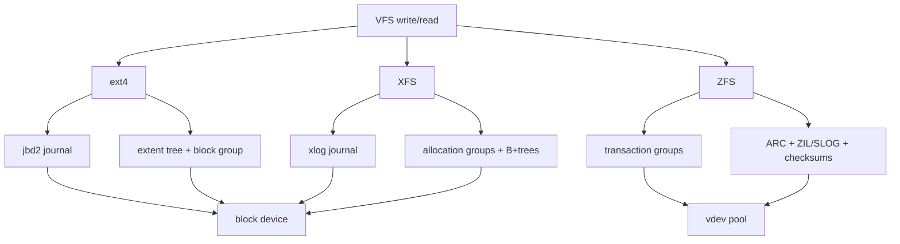

# 第 0c2 章 本地文件系统：ext4、XFS、ZFS

> **关联章节**：本章从 [0c1](0c1-vfs-inode-dentry-and-block-layer.md) 的 VFS 和 block layer 往下看具体文件系统。持久化协议见 [0c3](0c3-storage-semantics-fsync-direct-io-and-checkpoints.md)，对象存储和并行文件系统见 [0c4](0c4-object-storage-parallel-filesystems-and-dataset-io.md)。

## 1. 第一性原理拆解 + 学习地图

### 拆：不可化简的问题

本地文件系统要把 inode、目录、extent、空闲空间、journal、校验和、快照等元数据组织到块设备上。
它必须在吞吐、延迟、崩溃恢复、空间效率、碎片、管理成本之间取舍。
AI Infra 关心的不是“哪个文件系统最快”，而是 workload 的 IO 形状和文件系统机制是否匹配。

### 推：从问题推出机制

- 崩溃后不能把目录树变成随机字节，所以 ext4 和 XFS 需要 journal 保护元数据更新。
- 大文件不能逐块索引，所以现代文件系统使用 extent 或 B+tree 描述连续范围。
- 多核并发写不能全局锁一把，所以 XFS 用 allocation group 分散元数据竞争。
- 快照和端到端校验需要写新块而不是覆盖旧块，所以 ZFS 使用 CoW transaction group。
- Dataset、checkpoint、权重加载有不同形状，因此选型必须按场景讨论。

### 绘：同一 VFS 请求在三个文件系统里的落点



### 导：本章读完后能做什么

1. 说明 ext4、XFS、ZFS 的机制差异，而不是只背名字。
2. 判断 checkpoint、dataset cache、模型权重盘分别偏向哪类文件系统。
3. 理解 journal、delayed allocation、extent、CoW、ARC、ZIL/SLOG 对性能和语义的影响。
4. 用 `findmnt`、`xfs_info`、`tune2fs`、`zpool`、`zfs` 观察真实配置。
5. 给 AI 集群制定本地盘格式化、挂载和验收 checklist。

## 2. 文件系统共同要解决什么

本地文件系统至少要维护五类状态。

| 状态 | 内容 | 失败风险 | 性能风险 |
|---|---|---|---|
| 命名 | 目录项、link count | rename/unlink 后目录不一致 | 大目录 lookup 慢 |
| 身份 | inode、权限、大小、时间戳 | inode 泄漏或错误引用 | inode cache 压力 |
| 空间 | free block、extent、bitmap/B+tree | 重复分配或空间丢失 | 碎片、分配锁竞争 |
| 数据 | file block contents | torn write、旧数据暴露 | 随机 IO、写放大 |
| 恢复 | journal、log、checkpoint | crash 后 replay 失败 | sync latency、log tail |

AI 任务常把“普通文件系统设计点”推到极端。
checkpoint 是少量大文件、同步发布、失败恢复敏感。
dataset cache 是大量读、多进程共享、命名稳定。
预处理临时目录是大量创建、rename、删除，元数据压力高。
模型权重加载是大文件顺序读或 `mmap`，Page Cache 行为明显。

## 3. ext4：稳健默认值

ext4 是很多 Linux 发行版的默认文件系统。
它使用 extent 管理大文件，使用 jbd2 journal 记录元数据事务。

ext4 的三种 journal 模式区别要分清：

| 模式 | journal 内容 | 数据写顺序 | 风险 |
|---|---|---|---|
| `data=journal` | 元数据 + 用户数据全部进 journal | 先 journal 后落最终位置 | 写两次，吞吐最差，但崩溃恢复最强 |
| `data=ordered`（默认） | 仅元数据进 journal | 用户数据先于元数据 commit 落盘 | 文件不会指向未初始化旧块；但 `write()` 后 crash，文件内容仍可能丢，需要 `fsync()` |
| `data=writeback` | 仅元数据进 journal | 用户数据写顺序不保证 | crash 后已分配但未写完的块可能暴露旧用户数据（包括别人删掉的敏感内容），训练场景一般不用 |

`data=ordered` 的承诺范围必须精确：它只保证"crash 后已经出现在目录里的新文件不会指向未初始化的磁盘块"。它不保证 `write()` 已落盘，不保证文件大小是最终值，更不保证父目录的命名更新可见——这些都仍要靠 `fsync(file)` 和 `fsync(parent_dir)`。

ext4 现代特性，配 AI workload 值得知道：

- **`fast_commit`**（5.10+，`-O fast_commit` 格式化）：把 fsync 路径从"写完整 journal transaction"简化为"只 log 受影响 inode 的 delta"，对 fsync-heavy 的 checkpoint workload 实测可降 fsync p99 数倍。新盘建议开启。
- **`bigalloc`**（cluster 分配，格式化时 `-C 65536` 等）：以 cluster 为分配单位减少 bitmap 压力，对超大单文件友好；但小文件浪费空间，dataset 目录不要无脑开。
- **`inline_data`**：很小的文件（< ~60 字节）数据存在 inode 内，省一次 IO；元数据极小文件场景有用。

ext4 的优势：

- 部署广，工具成熟，默认行为保守。
- 对中小规模本地盘、系统盘、普通数据目录足够稳定。
- `fsck`、resize、quota 等运维经验丰富。
- 对单机训练 cache、临时目录、通用 checkpoint 目录通常可用。

ext4 的限制：

- 极高并发大目录和多线程分配下，扩展性不如 XFS 的 AG 设计。
- journal commit 和 barrier 配置会影响 `fsync()` 尾延迟。
- 大量小文件会被 inode、目录索引、dentry cache 和 Page Cache 共同限制。
- 云盘或 RAID 下如果底层 flush 语义弱，ext4 无法单独提供端到端保护。

常用观测：

```bash
findmnt -T /mnt/local -o TARGET,SOURCE,FSTYPE,OPTIONS
tune2fs -l /dev/nvme0n1p1 | egrep 'Filesystem features|Block size|Inode count|Journal'
dumpe2fs -h /dev/nvme0n1p1 | egrep 'Filesystem state|Errors behavior|Journal size'
cat /proc/fs/ext4/*/mb_groups 2>/dev/null | head
```

### 3.1 盘上结构：block group

ext4 把整个分区切成多个 **block group**（典型 128MB/group，由 block size × blocks-per-group 决定）。每个 group 内布局固定：

```text
[ superblock backup | GDT | reserved GDT | block bitmap | inode bitmap | inode table | data blocks ]
```

- **superblock**：FS 全局元数据（block size、inode count、feature flags、UUID 等）。group 0 有主 superblock，部分 group 保留备份（`sparse_super` 模式只在 0、1 和 3/5/7 的幂次 group 备份），`fsck` 在主 superblock 损坏时用备份恢复。
- **GDT（Group Descriptor Table）**：所有 group 的描述符表，每个描述符记录该 group 的 bitmap 和 inode table 位置、空闲块数、空闲 inode 数等。
- **block bitmap / inode bitmap**：单个 group 内 block 和 inode 的位图，每个 bit 表示一个 block / inode 是否被占用。
- **inode table**：连续存放该 group 的 inode 结构（默认 256 字节/inode）。inode 总数在 `mkfs.ext4` 时定死，不可在线扩展——这是"`df -ih` 报 100% 但 `df -h` 还很空"的根因。

block group 的设计目的是**局部性**：分配新 inode 时优先放在父目录所在 group，分配新 data block 时优先放在 inode 所在 group，减少寻道。在 SSD 上局部性收益不大，但 group 仍然是分配并发的天然分区。

### 3.2 inode 与 extent tree

ext4 的 inode 不再像 ext2/ext3 用"12 个直接指针 + 间接/二级/三级指针"——那个结构对大文件极不友好（10GB 文件要遍历多级间接块）。ext4 改用 **extent tree**：

- inode 内 60 字节空间存 1 个 extent header + 最多 4 个 extent 条目（每个 extent 描述一段连续 block：起始 logical block、起始 physical block、长度）。
- 文件超过 4 个 extent 时，inode 内存的是 4 个 index 节点，指向树第二层的 extent block（每个 extent block 也是 4KB，能放更多 extent）。最多 5 层。
- 一个 extent 最长 32768 个 block（128MB，4KB 块）；理论上一个 inode 可寻址到 16TB，足够单文件需要。

这是为什么 ext4 大文件性能比 ext3 好得多：连续写一个 100GB 文件，inode 内只需要 ~800 个 extent 条目（远小于"逐块指针"的 2500 万个），元数据和 block mapping 查询都简化了。

### 3.3 HTree 目录索引

普通目录是顺序的"目录项数组"，`stat` 一个文件要线性扫描——5 万文件的目录里 `lookup` 一次平均扫 2.5 万项。ext4 默认开启 `dir_index` 特性，用 **HTree**（hash 树）索引目录项：

- 文件名先 hash（MD4/Half-MD4），用 hash 值在 B+tree-like 结构里定位目录块。
- 单次 lookup 复杂度从 O(N) 降到 O(log N)。
- 副作用：**`readdir` 顺序变成 hash 顺序**，不是文件名字典序也不是创建顺序。依赖 readdir 顺序的脚本会失效。

百万级小文件单目录在 ext4 + dir_index 下仍可工作，但 dentry cache 压力、glibc readdir 缓冲区、应用层 sort 成本会成为新瓶颈。AI dataset 仍应分目录或打 shard。

### 3.4 jbd2 journal：commit 与 checkpoint

ext4 的 journal 由 **jbd2**（Journaling Block Device 2）驱动，是一个独立的 ring-buffer 结构（默认 128MB 或更小），位置可以在主 FS 内（默认）或独立设备上（`-J device=...`）。

journal 的工作流程是 **commit-checkpoint 两阶段**：

1. **transaction 累积**：所有元数据修改（inode、bitmap、目录项）先写到内存中的 running transaction。多个 syscall 的修改可能合并到同一个 transaction。
2. **commit**：达到时间阈值（默认 5s，`commit=` 挂载选项可调）或空间阈值时，jbd2 把 transaction 的所有元数据块写到 journal ring。先写 descriptor block，然后数据块，最后写 commit block——commit block 是 transaction 完整性的标记。`data=ordered` 模式下，相关用户数据块要先写到最终位置才能写 commit block。
3. **checkpoint**：commit 之后，jbd2 在后台把元数据从 journal 里的副本写到最终 inode/bitmap 位置。完成后 journal 中那段空间可以回收。
4. **crash 恢复**：mount 时扫 journal，重放所有有 commit block 的 transaction，丢弃没 commit 的——这就是为什么 commit block 的存在与否决定 transaction 是否生效。

`fsync(file)` 的实际工作：

- 等该文件的所有 dirty 数据写到最终位置（`data=ordered` 下还要等"先于元数据"的承诺兑现）。
- **强制触发一次 jbd2 commit**——所以 fsync 延迟下限是 jbd2 commit 周期里的设备 flush 成本，不只是这一个文件的字节量。
- 这解释了为什么"多个 rank 同时 fsync 不同文件" ext4 会序列化：它们等的是同一个 journal commit。

`fast_commit` 优化的就是这一步：对常见场景（fsync 单个文件 inode 更新）跳过完整 transaction，只 log 该 inode 的 delta，commit 路径短得多。

## 4. XFS：并发和大文件友好

XFS 的核心直觉是把文件系统划分为多个 allocation group。
每个 AG 有自己的空闲空间和 inode 管理结构，减少全局锁竞争。
它广泛使用 B+tree 管理 extent、free space、inode btree 和反向映射等结构。
在大文件、并发写、海量容量、在线增长场景下，XFS 通常是强候选。

XFS 的优势：

- 多线程分配和大文件吞吐稳定。
- 对大容量文件系统和在线扩容友好。
- 延迟分配能把小写合并成更好的 extent。
- 对 checkpoint、shard cache、日志归档这类大文件场景表现常很稳。

XFS 的注意点：

- 小文件性能不靠文件系统名称解决，目录布局和 shard 格式仍然关键。
- `fsync()` 延迟受 log、设备 flush、dirty writeback 和并发影响。
- 格式化参数如 `reflink`、`crc`、`ftype` 会影响功能和兼容性。
- 容器 overlayfs 通常要求底层 XFS `ftype=1`。
- log size 默认按 AG 数推断；多并发大文件 + 频繁 fsync 的 checkpoint 场景，log 太小会成为序列化瓶颈。`xfs_info` 看 `log` 段，必要时用 `mkfs.xfs -l size=2g` 重格。

XFS **reflink**（5.x 内核 + `mkfs.xfs -m reflink=1`，新版默认开启）是 AI infra 容易忽略的利器：

- `cp --reflink=always src dst` 是 metadata-only 的 CoW clone，TB 级 checkpoint 也是毫秒返回。
- 用法举例：训练 step N 写完 `ckpt-N/`，立刻 `cp --reflink -r ckpt-N ckpt-N.scratch` 给评测/转换流程慢慢用，主训练继续推进；scratch 写入时才发生实际块拷贝。
- 异步上传到对象存储前先 reflink 一份冻结，避免被下一轮 checkpoint 覆盖。
- 限制：reflink 只在同一文件系统内有效，跨 mount 仍然要走 `copy_file_range` fallback 或全量复制。

常用观测：

```bash
xfs_info /mnt/local
xfs_db -r -c 'sb 0' -c 'p agcount blocksize sectsize' /dev/nvme0n1p1
xfs_spaceman -c 'freesp -s' /mnt/local 2>/dev/null | head
xfs_io -c 'stat' /mnt/local/some-file
```

### 4.1 盘上结构：Allocation Group

XFS 把分区切成 **Allocation Group**（AG），默认 4 个或按容量自动选（每 AG 上限 1TB）。每个 AG 是一个**几乎独立的小文件系统**——有自己的空闲空间索引、inode 索引和锁。多核分配可以同时操作不同 AG，这是 XFS 高并发吞吐的根本来源。

每个 AG 头部：

```text
[ AG superblock | AGF (free space hdr) | AGI (inode hdr) | AGFL (free list) | per-AG B+trees... | data ]
```

每个 AG 内有四棵核心 B+tree：

- **free space by offset**（`bnobt`）：按 block 起始位置组织的空闲段树，用于按位置寻找邻近空闲段（局部性分配）。
- **free space by size**（`cntbt`）：按空闲段长度组织的树，用于按大小寻找最合适的空闲段（best-fit 分配大文件）。
- **inode B+tree**（`inobt`）：跟踪已分配 inode chunk（每 chunk 64 个 inode）。
- **free inode B+tree**（`finobt`，可选）：单独跟踪有空闲位的 inode chunk，加速分配。

inode 在 XFS 里**动态分配**：不像 ext4 在 mkfs 时定死 inode 数，XFS 按需分配 inode chunk。所以 XFS 几乎不会"inode 满"，磁盘空间用完才是上限。

### 4.2 extent 与 B+tree 文件映射

XFS 的 extent 描述方式和 ext4 类似（offset, block, length 三元组），但组织更激进：

- inode 默认 512 字节（可调到 256B/1KB/2KB），其中 fork area 可存 ~19 个 extent（具体看 inode 大小和是否有 attr fork）。
- 超过 inline 容量时，extent 列表本身变成一棵 **B+tree**，inode 内只存树根。
- 单 extent 最长 8M block（4KB 块时 32GB），单文件理论上限 8EB。
- 这让 XFS 在"少量超大文件"场景下元数据极轻：1TB checkpoint 文件可能只占几个 extent，inode 直接装下。

碎片场景下 extent 树会膨胀。`xfs_bmap -v file` 可以看 extent 数量，超过几千就值得 `xfs_fsr` 在线 defrag 或重写文件。

### 4.3 Delayed allocation 实际怎么做

`write()` 进入 page cache 时，XFS **不分配物理 block**，只在内存里登记一个 "delalloc reservation"：从 AG 空间统计里预扣这部分，但不动 B+tree。

到 writeback 时（dirty 触发或 fsync）：

- XFS 看 dirty 范围有多大，从空闲空间 B+tree 里一次找到**最合适的连续段**——可能是几个 GB 的一整段，写入是顺序的，extent 数极少。
- 如果中间没有 fsync 或内存压力，多次小 `write` 会被合并成一次大分配。这是 XFS 顺序大文件吞吐的关键。

代价：

- 文件大小在 `write` 后立即可见（更新 inode 内存视图），但**实际占用空间未确定**——`du` 可能比 `ls -l` 报的小。
- crash 在 fsync 前发生，已 `write` 的字节既没在 journal 也没在最终位置——文件大小可能被记录但内容是任意的（在 ext4 ordered 模式下也类似）。这又一次说明：发布协议靠 fsync，不是 write 返回。

### 4.4 xlog：物理 redo log

XFS 的 **xlog** 和 ext4 jbd2 是**完全不同的设计**：

- jbd2 是"逻辑+物理混合"的 journal，记录元数据块的内容副本。
- xlog 是**纯物理 redo log**，记录的是"对某个元数据块的某个偏移做某种修改"。空间效率更高（不复制整块），但 replay 时必须把记录按顺序重放到对应位置。

xlog 是一个 ring buffer（默认大小由 AG 数推断，典型 32MB-2GB），结构：

```text
[ log record | log record | log record ... ] (循环写)
```

每个 log record 包含若干 transaction 的 redo 项，以及 LSN（Log Sequence Number）。XFS 的 transaction commit 流程：

1. 在内存里构造 transaction，登记所有元数据修改。
2. 把修改作为 log items 写入 in-core log buffer（CIL，Committed Item List）。
3. CIL 满或显式 force 时，flush 到磁盘 xlog ring。
4. **本地修改的元数据块（AIL，Active Item List）异步写到最终位置**——和 jbd2 的 checkpoint 类似，但 xlog 用 LSN 跟踪，最终位置写完后那段 log 空间可回收（"log tail"前进）。

`fsync(file)` 在 XFS 上的工作：

- flush 该文件 dirty 数据（如果是 delalloc，先做实际分配 + 写盘）。
- force xlog 到包含该 inode 修改的 LSN——这一步把多个并发 fsync **合并**：如果两个 rank fsync 不同文件，但它们对应的 log items LSN 相近，一次 log force 同时让两者 durable。
- 这就是 XFS 在高并发 fsync 场景下经常比 ext4 表现更稳的机制原因。

xlog 满 → "log space exhausted" → 整个 FS 暂停写直到 AIL 推进。所以 fsync-heavy + log size 偏小的 checkpoint workload 会突然 stall——`xfs_info` 看 log size，必要时重格扩大。

## 5. ZFS：CoW、校验和和数据管理

ZFS 不是传统意义上“文件系统 + 外部卷管理”的组合。
它把存储池、vdev、文件系统、快照、校验和、压缩、ARC 缓存、ZIL/SLOG 等能力放在一个系统里。
ZFS 的核心是 CoW：修改不会原地覆盖旧块，而是写新块，再原子更新指针树。

ZFS 的优势：

- 端到端校验和能发现静默数据损坏。
- 快照、clone、send/receive 适合数据版本和回滚。
- 压缩常能提升文本、日志、部分 tensor metadata 的有效吞吐。
- ARC 对重复读取明显有帮助。

ZFS 的代价：

- CoW 会带来写放大和碎片，尤其是随机覆盖写。
- ARC 会与 Linux Page Cache 争内存，需要明确内存上限（`zfs_arc_max`）。
- 同步写依赖 ZIL，低延迟 sync workload 可能需要合适的 SLOG（专用低延迟 NVMe）。
- 运维复杂度高于 ext4/XFS，不适合作为不了解团队的默认选择。

`recordsize` 是 ZFS 上最容易调错的旋钮：

- 默认 128KB。一次写一个 record 是 CoW 单位，所以"读 4KB 修改 4KB 写回"实际会读改写 128KB——随机覆盖写场景写放大 32×。
- checkpoint 大文件顺序写：调到 1M 提升吞吐，元数据少。
- 数据库/向量索引随机覆盖：调到 16K-32K 接近实际 block 大小。
- dataset shard（只读）：1M 安全，命中 ARC 时 record 大小不影响。
- 调整 `recordsize` 对**已存在的文件无效**，只对之后新建的文件生效；切换前要 `cp` 一份。

压缩选择（CPU vs 压缩率）：

| 算法 | 压缩比（文本） | 单核解压 | 单核压缩 | 适用 |
|---|---|---|---|---|
| `lz4`（默认推荐） | ~2× | ~3-5 GB/s | ~500 MB/s | 通用，开了几乎无副作用 |
| `zstd-1` | ~2.5× | ~1.5 GB/s | ~400 MB/s | CPU 富裕、想多省一点空间 |
| `zstd-3` | ~2.8× | ~1.2 GB/s | ~150 MB/s | 冷数据、归档 |
| `zstd-19` | ~3.5× | ~1 GB/s | ~5 MB/s | 几乎不写、读密集 |

二进制权重（safetensors fp16/bf16）压缩率通常 < 1.05×，开 `lz4` 几乎无收益但也几乎无代价；`zstd` 高级别会拖慢写入。

### 5.1 层级模型：pool → vdev → device

ZFS 的术语和 ext4/XFS 不一样，因为它把卷管理和文件系统融为一体：

```text
pool (zpool)
 ├── vdev: mirror      → device A, device B
 ├── vdev: raidz2      → device C..H
 ├── special vdev      → device I (元数据加速)
 ├── log vdev (SLOG)   → device J (sync 写加速)
 └── cache vdev (L2ARC)→ device K (读缓存扩展)

dataset (文件系统) — 在 pool 上挂载，独立 quota/recordsize/compression
zvol (块设备) — 在 pool 上虚拟出块设备，给 VM/iSCSI 用
```

**核心设计**：写入会被 ZFS 在 vdev 之间做 **dynamic striping**（不是 RAID0，是按可用空间比例）；不同 vdev 类型决定冗余策略；pool 整体容量是各 vdev 容量之和。

vdev 类型决定写放大和故障域：

| vdev 类型 | 容量 | 冗余 | 写性能 | 适合 |
|---|---|---|---|---|
| stripe（单盘） | 100% | 无 | 高 | 临时数据，不允许丢 |
| mirror（2 盘镜像） | 50% | 1 盘容错 | 高 | 元数据/小文件密集 |
| raidz1（3+ 盘 RAID5 风格） | (N-1)/N | 1 盘容错 | 受最慢盘限制 | 容量优先、读多写少 |
| raidz2（4+ 盘 RAID6 风格） | (N-2)/N | 2 盘容错 | 同上 | 大容量归档 |
| draid（分布式备件） | 类似 raidz | 同上 + 快速重建 | 大集群 | 几十盘以上 |

注意：raidz 不是 RAID5，**stripe 大小是变长的**（按 record 大小动态切），所以传统 RAID5 写洞问题不存在，但小 IO 性能远不如 mirror。

### 5.2 一切是 CoW：block pointer 与 Merkle tree

ZFS 没有"原地修改"。每次 write 都分配新 block，然后链式更新所有指向它的指针，一直到 pool 顶端的 **uberblock**。这意味着：

- 任何修改在 uberblock 切换前都不可见，crash 在中途的状态自动是"旧版本完整"。
- 整个 pool 的元数据是一棵 Merkle tree——每个 block pointer 不仅记录子节点位置，还记录子节点的 **checksum**（默认 fletcher4，可选 sha256/blake3）。读取时校验，损坏立刻能发现，配合冗余可自动修复。

block pointer 结构（简化）：

```text
struct blkptr {
    DVA[3]   // Data Virtual Address，最多 3 个副本（ditto blocks）
    logical_size, physical_size
    checksum_type, compression_type
    birth_txg   // 出生于哪个 transaction group
    fill_count  // 子树下有多少非空 block
    checksum[4] // 256-bit checksum of pointed block
}
```

DVA 包含 (vdev id, offset)，最多 3 个副本意味着即便单 vdev 内也可以多副本——这就是为什么 ZFS 元数据默认存 2 份（`copies=2`），关键元数据（uberblock 路径上的）甚至 3 份。

uberblock 本身在每个 leaf device 的固定位置存 **128 个副本**（4 个 label × 32 个 uberblock 槽），写入是循环覆盖最旧的——掉电时永远有完整旧版本可用。`zdb -uuu pool` 可以看所有 uberblock。

### 5.3 transaction group commit 与写入路径

ZFS 把所有写聚合成 **transaction group（TXG）**：

1. 当前 open TXG 接收所有 `write()`：数据进入 ARC dirty buffer，登记到 TXG 的修改集。这一步**不写盘**。
2. 触发条件（默认 5 秒、TXG 累计 dirty 达阈值、或显式 sync）：当前 TXG 进入 **quiescing** 状态，停止接收新写，并行的下一个 TXG open。
3. **syncing**：这个 TXG 的所有 dirty block 分配新位置、计算 checksum、写盘；元数据 indirect block 自下而上重新生成（CoW 路径）；最后写新 uberblock，原子切换 pool 状态。
4. 完成后 TXG 关闭，dirty 数据从 ARC 中标记为 clean。

正常 TXG 周期 5 秒。这意味着**异步写**的视角下，"write 返回"和"实际落盘"之间最多差 5 秒——crash 会丢这部分。

**同步写**（`O_SYNC`、`fsync`、`O_DSYNC`、NFS sync）走 **ZIL（ZFS Intent Log）** 路径：

1. write 在更新 ARC 的同时，把 redo 记录写到 ZIL：包含足够信息让 crash 后能重建这次 write 的效果。
2. ZIL 写入完成才返回 `fsync()` 成功。下一次 TXG commit 才把数据真正落到 pool 主存储。
3. crash 后 mount 时，ZFS 扫 ZIL 把还没进入 TXG 的同步写 replay 到 pool。
4. ZIL **平时不读**，只在 crash 后读。所以 ZIL 设备只关心写延迟，读性能无所谓。

没有专用 SLOG 时，ZIL 写在主 pool 上（占用同样的 vdev），这是 raidz pool 同步写慢的核心原因——每次 fsync 要等慢 raidz 写完。**SLOG（Separate Intent Log）** 是专用的低延迟设备（通常是 PLP NVMe 或 Optane），把 ZIL 路径加速。

`sync=disabled` 直接跳过 ZIL，让所有"同步写"实质变成异步——fsync 几乎免费，但 crash 丢最近 5 秒所有写入，**绝不要**用于 checkpoint。

### 5.4 ARC：MRU + MFU + ghost

ZFS 不用 Linux Page Cache，而是自己管理 **ARC（Adaptive Replacement Cache）**。结构是四个链表：

```text
MRU (Most Recently Used)  — 最近一次访问的 block
MFU (Most Frequently Used) — 多次访问的 block
MRU ghost  — 已被驱逐的 MRU 元数据（只记 key，不存数据）
MFU ghost  — 已被驱逐的 MFU 元数据
```

工作原理：

- 新读入的 block 进 MRU。
- MRU 中再次被访问的 block 升级到 MFU。
- 内存压力时按某个比例从 MRU 和 MFU 各驱逐一些到对应 ghost 列表。
- 如果驱逐的 block 很快又被命中，ARC 知道"这个 list 我驱逐得太狠了"，自动调整 MRU/MFU 边界比例。

这比传统 LRU 抗"大顺序扫描污染"——一次性扫过的 dataset shard 进 MRU 但不会升级到 MFU，热数据更安全。但代价是 ARC 完全不和 Linux Page Cache 协作，**ARC + Page Cache + 训练框架显存** 三者必须一起规划内存预算。常见做法：

```bash
# /etc/modprobe.d/zfs.conf
options zfs zfs_arc_max=68719476736   # 64 GiB 上限
options zfs zfs_arc_meta_limit_percent=50  # 元数据可占一半 ARC
```

**L2ARC** 是 ARC 的二级 cache，存在专门的 SSD 上。被 ARC 驱逐的 block 可以下沉到 L2ARC，下次访问从 L2ARC 读取（仍快于主 pool）。注意：L2ARC 不是持久的，重启会清；且每个 L2ARC 条目要 70 字节 ARC header——4TB L2ARC 可能吃掉 3-4GB 内存做索引，这是常见配错。

### 5.5 dataset、snapshot 与 send/receive 的实现

dataset 是 ZFS 在 pool 上的逻辑切分单位——每个 dataset 有独立的 `recordsize`、`compression`、quota、ACL 等属性。dataset 在树状继承结构下管理（`pool/users/alice/proj1`）。

**snapshot** 因为 CoW 几乎免费：

- 创建 snapshot 只是记录一个 TXG number（"在这个时间点冻结"）。
- 之后新写入的 block 因为 CoW 不会覆盖旧 block，旧 block 被 snapshot 引用，引用计数让它不被释放。
- 创建快照 O(1)；空间消耗仅来自后续被修改的部分。
- TB 级 dataset 创建快照 < 1 秒。

**clone** 是从 snapshot 派生的可写 dataset，共享所有未修改 block，写入触发 CoW——和 XFS reflink 思想一样，但粒度是整个 dataset。

**`zfs send | zfs recv`**：把 snapshot 序列化成流，包含完整数据或自上次 snapshot 的增量。增量 send 是 AI 平台跨机房同步 dataset 的常用手段——一次全量 send，之后每天增量 send，目标端永远有完整副本。比 rsync 强在它直接读 metadata 找出"哪些 block 在两个 snapshot 之间变化"，不扫描整个目录树。

### 5.6 一次 fsync 在 ZFS 上的完整路径

把上面拼起来，`fsync(file)` 的内部步骤：

1. 确保 file 的所有 dirty block 在 ARC 中已进入当前 TXG 的 dirty list。
2. 为每个 dirty block 在 ZIL 写一条 redo log（如果是 large block 走 indirect mode，只写 block pointer，等 TXG 时数据从 ARC 直接进 pool）。
3. ZIL log 写到 SLOG（如有）或主 pool，等 device flush 完成。
4. 返回 `fsync()` 成功。
5. 之后 TXG commit 异步把数据进入 pool 主存储；ZIL 中对应记录在 TXG commit 后失效。

所以 ZFS 同步写延迟由**ZIL/SLOG 设备的写 + flush 延迟**决定，和 pool 主存储的速度无关。这是 raidz + SLOG 组合的核心价值：raidz 提供大容量+冗余，SLOG 提供低延迟同步。

### 5.7 ZFS 的运维代价（再强调）

上面这些机制都不是免费的：

- ARC 是用户态进程之外的内存消耗，不显示在 `free -h` 的 `available`，要看 `arc_summary` 或 `/proc/spl/kstat/zfs/arcstats`。
- TXG 周期内的 dirty data 上限（`zfs_dirty_data_max`）决定内存压力下的写入抖动。
- `zpool scrub` 必须周期跑（典型每月一次），verify 整个 Merkle tree——大池子可能跑几天，影响生产 IO。
- 升级内核要确认 ZoL/OpenZFS 版本兼容；ZFS 不在主线 Linux，是外部模块。
- 团队没有 ZFS 经验时强行用，常见结果是配置错（recordsize、ARC、SLOG 选错）抹平所有理论优势。


常用观测：

```bash
zpool status
zpool list -v
zfs list -o name,used,avail,refer,compressratio,mountpoint
zfs get recordsize,compression,atime,primarycache,logbias <pool/dataset>
arcstat 1 5 2>/dev/null || true
```

## 6. Journal、log、CoW 的语义差异

ext4 和 XFS 都有 journal/log，但它们主要保护元数据一致性。
它们不把所有用户数据都默认写入 journal。
因此应用如果需要“文件内容已经到稳定存储”，仍要使用 `fsync()` 或正确的同步协议。

ZFS 的 CoW 让元数据树更新天然避免很多原地覆盖风险。
同步写通过 ZIL 记录意图，之后再由 transaction group 汇总写入主存储池。
这不意味着所有写都没有延迟，也不意味着忽略 `fsync()` 就能得到应用级发布语义。

| 机制 | 保护重点 | 对 checkpoint 的含义 | 常见误解 |
|---|---|---|---|
| ext4 jbd2 | 元数据事务 | `rename` 元数据可恢复，文件数据仍需 sync | `write` 返回等于落盘 |
| XFS log | 元数据 log | 大文件并发写好，发布仍需文件和目录 sync | XFS 不需要 `fsync` |
| ZFS CoW | 指针树一致性和校验 | 快照强，sync 写延迟看 ZIL/SLOG | CoW 自动解决应用协议 |

## 7. Delayed allocation、extent 和碎片

Delayed allocation 会推迟真实块分配，等待内核看到更多写入后再分配更连续的 extent。
这对大顺序写有利，因为文件系统能把许多小 write 合并成大 extent。
但它也意味着 `write()` 返回时，文件还没有获得最终物理块。
如果 crash 发生在 `fsync()` 前，应用不能假设文件内容完整。

Extent 是“从逻辑 offset 到物理连续块范围”的映射。
大 checkpoint 如果被许多 rank 交错写到同一目录，或在空间接近满盘时写入，extent 会更碎。
碎片会让顺序读变成更多随机请求。

检查碎片和 extent：

```bash
filefrag -v /mnt/local/checkpoints/ckpt_001/model.safetensors | head -40
xfs_bmap -v /mnt/local/checkpoints/ckpt_001/model.safetensors 2>/dev/null | head
stat -c 'size=%s blocks=%b blksize=%o' /mnt/local/checkpoints/ckpt_001/model.safetensors
```

## 7.5 SSD 持续写的 SLC cache 悬崖

消费级和部分入门企业级 NVMe（QLC/TLC + SLC cache）有一个 senior 必须警觉的现象：**前 30-60 秒写入速度漂亮，之后跌到 1/3 甚至 1/10**。

机制：盘把空闲 NAND 暂时当 SLC 用（每 cell 1 bit），写入快；SLC 区填满后必须直写 TLC/QLC（每 cell 3-4 bit）并同时做 GC，吞吐断崖式下跌。

对 checkpoint 的影响：

- 单 rank 写 50GB checkpoint，前 5GB 体感 5 GB/s，后续 45GB 可能只有 800 MB/s——总耗时是按后段算，不是按峰值。
- 同节点多 rank 并发写同一盘，悬崖来得更快。
- benchmark 用 `fio --runtime=10` 永远测不出这个问题；必须 `--runtime=300` 或写满设备一半以上容量才暴露。

诊断与对策：

```bash
fio --name=sustain --rw=write --bs=1m --size=200g --direct=1 \
  --ioengine=libaio --iodepth=32 --runtime=600 --time_based --group_reporting
# 看 bw 随时间曲线，断崖即 SLC 耗尽点
```

- 选盘：数据中心级（U.2/E1.S，PLP + 高 endurance + 一致 TLC/no-SLC-cache）；DWPD、sustained write spec 是关键，不是峰值。
- 留水位：常态空间使用率 < 70%，给 SLC pool 和 GC 留头部空间。
- 散热：NVMe 热降频和 SLC 悬崖会同时出现，先用 `nvme smart-log /dev/nvme0` 排除温度。

## 8. 挂载参数和格式化参数

参数不是性能开关清单，必须知道它改变了什么语义。

| 参数 | 常见位置 | 作用 | 风险 |
|---|---|---|---|
| `noatime` | mount | 读文件不更新访问时间 | 依赖 atime 的清理逻辑失效 |
| `relatime`（默认） | mount | atime 仅在需要时更新 | 折中方案，不如 `noatime` 干净 |
| `lazytime` | mount | atime/mtime/ctime 仅在内存中更新，定期或 fsync 时刷盘 | 对 metadata-write 敏感 workload 显著降 IO；但 crash 后时间戳可能回退 |
| `discard` | mount | 在线 TRIM | 可能增加写延迟，常改用周期性 fstrim |
| `barrier`/flush | FS/设备 | 保证写顺序到稳定介质 | 关闭会破坏 crash 假设 |
| `inode64` | XFS | 允许 inode 分布在大容量空间 | 老软件兼容性 |
| `recordsize` | ZFS | 文件记录块大小 | 与随机读写粒度不匹配会放大 IO |
| `compression` | ZFS | 透明压缩 | CPU 与压缩率取舍 |
| `sync=disabled` | ZFS | 让 fsync 立即返回，落盘异步 | **绝对不要**用于 checkpoint；crash 后丢最近 5-30 秒所有写入 |

AI 本地 NVMe cache 常见基线：`noatime`、合理预留空间、定期 `fstrim`、不要关闭 flush/barrier 来换 benchmark 分数。
XFS 用于容器 overlay 底层时确认 `ftype=1`。
ZFS 用于训练节点时限制 ARC，避免挤压 framework、Page Cache 和 NCCL buffer。

## 9. AI 选型：按 workload 讨论

| 场景 | ext4 | XFS | ZFS | reflink/快速 clone | 更重要的设计点 |
|---|---|---|---|---|---|
| 单机临时训练 cache | 合适 | 合适 | 可用但偏重 | XFS✓、ZFS✓（snapshot/clone） | shard、清理、容量水位 |
| 大 checkpoint 顺序写 | 可用（开 fast_commit） | 常更稳 | 可用，sync 延迟需测 | XFS reflink 适合 scratch | 发布协议、并发 rank、fsync |
| 海量小文件 dataset | 不推荐单靠 FS 解决 | 不推荐单靠 FS 解决 | 不推荐单靠 FS 解决 | — | 打包、manifest、index、本地 cache |
| 数据版本快照 | 弱 | reflink 文件级 clone | 强（pool/dataset 级 snapshot） | XFS reflink、ZFS snapshot | snapshot 策略和恢复演练 |
| 静默损坏敏感 | 依赖底层 | 依赖底层（CRC 仅元数据） | 强（数据 + 元数据 checksum） | — | 校验和、scrub、备份 |
| 容器镜像/overlay | 常见 | 常见，需 ftype | 不常作为默认 | XFS reflink 加速镜像层 | overlay 兼容性 |

保守建议：

- 通用 Linux 节点：ext4 或 XFS 都是合理默认值。
- 多并发大文件、本地 NVMe 数据盘：优先评估 XFS。
- 需要快照、校验、压缩和数据管理：评估 ZFS，并把内存和运维纳入成本。
- 不要用文件系统替代 dataset 格式治理；百万小文件应先改 IO 形状。

## 10. 命令观测：建立事实表

收集文件系统事实：

```bash
findmnt -T /mnt/local -o TARGET,SOURCE,FSTYPE,OPTIONS
lsblk -f
stat -f -c 'type=%T bsize=%S blocks=%b files=%c' /mnt/local
df -hT /mnt/local
df -ih /mnt/local
```

收集设备和延迟：

```bash
iostat -x 1
cat /sys/block/nvme0n1/queue/scheduler
cat /sys/block/nvme0n1/queue/logical_block_size
cat /sys/block/nvme0n1/queue/physical_block_size
```

收集 workload：

```bash
find /mnt/local/dataset -type f -printf '%s\n' | awk '{n++; s+=$1; if($1<1048576) small++} END {print n,s/n,small}'
find /mnt/local/dataset -type f | sed 's#/[^/]*$##' | sort | uniq -c | sort -nr | head
```

## 11. Mini case：checkpoint 目录选 ext4 还是 XFS

场景：每个节点 8 rank，每 30 分钟写一次 checkpoint。
每个 rank 写 12GB shard，最后 rank0 发布 `latest` 指针。
本地盘是 2 块 NVMe RAID0，checkpoint 会被异步上传到对象存储。

评估维度：

| 维度 | 观察 | 结论 |
|---|---|---|
| 文件大小 | 少量 10GB 级文件 | 大文件 extent 和顺序写重要 |
| 并发 | 8 rank 同时写不同文件 | 分配并发重要 |
| 恢复 | crash 后不能读到半成品 | 应用协议比 FS 名字更重要 |
| 生命周期 | 写完上传，保留最近 N 个 | 删除和空间水位要稳定 |

ext4 能工作，但要实测 journal commit 和 `fsync()` 尾延迟。
XFS 对多并发大文件分配通常更有优势，是优先候选。
ZFS 如果需要本地快照和校验也可评估，但 ARC 和 sync 写延迟必须纳入压测。

验收实验：

```bash
# 8 个 job，每个写 12G，模拟 rank shard
fio --name=ckpt --directory=/mnt/ckpt --rw=write --bs=4m \
  --size=12g --numjobs=8 --iodepth=8 --direct=1 \
  --ioengine=libaio --fsync_on_close=1 --group_reporting

# 观察尾延迟和设备队列
iostat -x 1
```

通过标准不是“峰值最高”，而是 `fsync_on_close` 总耗时、99% 延迟、空间回收和 crash 演练都满足训练恢复目标。

## 12. Mini case：ZFS dataset cache 的取舍

场景：研究平台需要在节点本地缓存多个数据版本。
数据以 tar shard 存放，每个 shard 512MB 到 2GB。
用户经常回滚到旧版本，要求能发现坏盘导致的数据损坏。

ZFS 的优势变得具体：snapshot 记录版本，checksum 发现损坏，compression 对部分元数据有效，send/receive 可迁移 cache。
但要设置 ARC 上限，例如避免 ARC 抢走训练进程可用内存。
还要按 shard 读写粒度评估 `recordsize`，不要让 4KB 随机读取被 1MB record 放大，也不要让大顺序 shard 被过小 record 增加元数据。

检查项：

```bash
zfs set atime=off pool/cache
zfs set compression=lz4 pool/cache
zfs get recordsize,primarycache,compression pool/cache
zpool scrub pool
zpool status -v
```

如果团队没有 ZFS 运维经验，ext4/XFS + 应用层 manifest + 对象存储校验可能更稳。

## 13. SOP：本地文件系统选型和验收

1. 写清 workload：文件大小分布、读写比例、并发 worker/rank、是否需要 `fsync()`、保留周期。
2. 写清设备：NVMe、云盘、RAID、是否有掉电保护、flush 语义。
3. 选两个候选：通常 ext4 vs XFS；有快照/校验需求时加入 ZFS。
4. 固定格式化和挂载参数，不用不明来源的“性能参数包”。
5. 用代表性数据集压测 cold/warm、顺序/随机、小文件/大文件、sync/async。
6. 跑 crash 演练：写入中 kill 进程、重启节点、检查目录和 manifest。
7. 记录 `findmnt`、`xfs_info`、`tune2fs`、`zfs get`、`iostat`、`fio` 输出。
8. 制定空间水位：满盘会显著改变分配行为和碎片。
9. 制定 scrub/fsck/备份策略，不把单盘文件系统当长期真相源。

## 14. Checklist

- 是否知道当前目录真实 FSTYPE，而不是只看路径名？
- 是否区分元数据 journal 和用户数据持久化？
- 是否为 checkpoint 明确 `fsync` 和原子发布协议？
- 是否测过 70%、85%、95% 空间水位下的写入表现？
- 是否检查 inode 数量、目录 fanout 和小文件比例？
- 是否确认容器 overlay 的底层兼容性？
- 是否避免关闭 barrier/flush 换取不可恢复的 benchmark？
- 是否对 ZFS 设置 ARC 上限并安排 scrub？

## 15. 练习

1. 解释 ext4 `data=ordered` 能保证什么，不能保证什么。
2. 画出 XFS allocation group 如何减少并发分配竞争。
3. 给一个 8 rank checkpoint 场景，写出 ext4 vs XFS 的验收指标。
4. 说明 ZFS ARC 和 Linux Page Cache 同时存在时为什么要关注内存预算。
5. 为一个 2000 万小文件数据集给出文件系统之外的治理方案。
