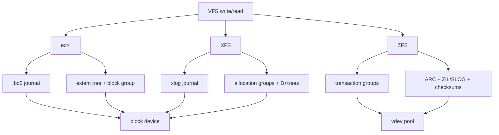

# 第 0c2 章 本地文件系统：ext4、XFS、ZFS

> **关联章节**：本章从 [0c1](0c1-vfs-inode-dentry-and-block-layer.md) 的 VFS 和 block layer 往下看具体文件系统。持久化协议见 [0c3](0c3-storage-semantics-fsync-direct-io-and-checkpoints.md)，对象存储和并行文件系统见 [0c4](0c4-object-storage-parallel-filesystems-and-dataset-io.md)。

## 1. 第一性原理拆解 + 学习地图

### 拆：不可化简的问题

本地文件系统要把 inode、目录、extent、空闲空间、journal、校验和、快照等元数据组织到块设备上。
它必须在吞吐、延迟、崩溃恢复、空间效率、碎片、管理成本之间取舍。
AI Infra 关心的不是“哪个文件系统最快”，而是 workload 的 IO 形状和文件系统机制是否匹配。

### 推：从问题推出机制

- 崩溃后不能把目录树变成随机字节，所以 ext4 和 XFS 需要 journal 保护元数据更新。
- 大文件不能逐块索引，所以现代文件系统使用 extent 或 B+tree 描述连续范围。
- 多核并发写不能全局锁一把，所以 XFS 用 allocation group 分散元数据竞争。
- 快照和端到端校验需要写新块而不是覆盖旧块，所以 ZFS 使用 CoW transaction group。
- Dataset、checkpoint、权重加载有不同形状，因此选型必须按场景讨论。

### 绘：同一 VFS 请求在三个文件系统里的落点



### 导：本章读完后能做什么

1. 说明 ext4、XFS、ZFS 的机制差异，而不是只背名字。
2. 判断 checkpoint、dataset cache、模型权重盘分别偏向哪类文件系统。
3. 理解 journal、delayed allocation、extent、CoW、ARC、ZIL/SLOG 对性能和语义的影响。
4. 用 `findmnt`、`xfs_info`、`tune2fs`、`zpool`、`zfs` 观察真实配置。
5. 给 AI 集群制定本地盘格式化、挂载和验收 checklist。

## 2. 文件系统共同要解决什么

本地文件系统至少要维护五类状态。

| 状态 | 内容 | 失败风险 | 性能风险 |
|---|---|---|---|
| 命名 | 目录项、link count | rename/unlink 后目录不一致 | 大目录 lookup 慢 |
| 身份 | inode、权限、大小、时间戳 | inode 泄漏或错误引用 | inode cache 压力 |
| 空间 | free block、extent、bitmap/B+tree | 重复分配或空间丢失 | 碎片、分配锁竞争 |
| 数据 | file block contents | torn write、旧数据暴露 | 随机 IO、写放大 |
| 恢复 | journal、log、checkpoint | crash 后 replay 失败 | sync latency、log tail |

AI 任务常把“普通文件系统设计点”推到极端。
checkpoint 是少量大文件、同步发布、失败恢复敏感。
dataset cache 是大量读、多进程共享、命名稳定。
预处理临时目录是大量创建、rename、删除，元数据压力高。
模型权重加载是大文件顺序读或 `mmap`，Page Cache 行为明显。

## 3. ext4：稳健默认值

ext4 是很多 Linux 发行版的默认文件系统。
它使用 extent 管理大文件，使用 jbd2 journal 记录元数据事务，常见模式是 `data=ordered`。
`data=ordered` 的直观含义是：与元数据提交相关的数据块会在 journal commit 前写出，避免 crash 后新文件指向未初始化旧数据。
这不等于每次 `write()` 都持久，也不等于不需要 `fsync()`。

ext4 的优势：

- 部署广，工具成熟，默认行为保守。
- 对中小规模本地盘、系统盘、普通数据目录足够稳定。
- `fsck`、resize、quota 等运维经验丰富。
- 对单机训练 cache、临时目录、通用 checkpoint 目录通常可用。

ext4 的限制：

- 极高并发大目录和多线程分配下，扩展性不如 XFS 的 AG 设计。
- journal commit 和 barrier 配置会影响 `fsync()` 尾延迟。
- 大量小文件会被 inode、目录索引、dentry cache 和 Page Cache 共同限制。
- 云盘或 RAID 下如果底层 flush 语义弱，ext4 无法单独提供端到端保护。

常用观测：

```bash
findmnt -T /mnt/local -o TARGET,SOURCE,FSTYPE,OPTIONS
tune2fs -l /dev/nvme0n1p1 | egrep 'Filesystem features|Block size|Inode count|Journal'
dumpe2fs -h /dev/nvme0n1p1 | egrep 'Filesystem state|Errors behavior|Journal size'
cat /proc/fs/ext4/*/mb_groups 2>/dev/null | head
```

## 4. XFS：并发和大文件友好

XFS 的核心直觉是把文件系统划分为多个 allocation group。
每个 AG 有自己的空闲空间和 inode 管理结构，减少全局锁竞争。
它广泛使用 B+tree 管理 extent、free space、inode btree 和反向映射等结构。
在大文件、并发写、海量容量、在线增长场景下，XFS 通常是强候选。

XFS 的优势：

- 多线程分配和大文件吞吐稳定。
- 对大容量文件系统和在线扩容友好。
- 延迟分配能把小写合并成更好的 extent。
- 对 checkpoint、shard cache、日志归档这类大文件场景表现常很稳。

XFS 的注意点：

- 小文件性能不靠文件系统名称解决，目录布局和 shard 格式仍然关键。
- `fsync()` 延迟受 log、设备 flush、dirty writeback 和并发影响。
- 格式化参数如 `reflink`、`crc`、`ftype` 会影响功能和兼容性。
- 容器 overlayfs 通常要求底层 XFS `ftype=1`。

常用观测：

```bash
xfs_info /mnt/local
xfs_db -r -c 'sb 0' -c 'p agcount blocksize sectsize' /dev/nvme0n1p1
xfs_spaceman -c 'freesp -s' /mnt/local 2>/dev/null | head
xfs_io -c 'stat' /mnt/local/some-file
```

## 5. ZFS：CoW、校验和和数据管理

ZFS 不是传统意义上“文件系统 + 外部卷管理”的组合。
它把存储池、vdev、文件系统、快照、校验和、压缩、ARC 缓存、ZIL/SLOG 等能力放在一个系统里。
ZFS 的核心是 CoW：修改不会原地覆盖旧块，而是写新块，再原子更新指针树。

ZFS 的优势：

- 端到端校验和能发现静默数据损坏。
- 快照、clone、send/receive 适合数据版本和回滚。
- 压缩常能提升文本、日志、部分 tensor metadata 的有效吞吐。
- ARC 对重复读取明显有帮助。

ZFS 的代价：

- CoW 会带来写放大和碎片，尤其是随机覆盖写。
- ARC 会与 Linux Page Cache 争内存，需要明确内存上限。
- 同步写依赖 ZIL，低延迟 sync workload 可能需要合适的 SLOG。
- 运维复杂度高于 ext4/XFS，不适合作为不了解团队的默认选择。

常用观测：

```bash
zpool status
zpool list -v
zfs list -o name,used,avail,refer,compressratio,mountpoint
zfs get recordsize,compression,atime,primarycache,logbias <pool/dataset>
arcstat 1 5 2>/dev/null || true
```

## 6. Journal、log、CoW 的语义差异

ext4 和 XFS 都有 journal/log，但它们主要保护元数据一致性。
它们不把所有用户数据都默认写入 journal。
因此应用如果需要“文件内容已经到稳定存储”，仍要使用 `fsync()` 或正确的同步协议。

ZFS 的 CoW 让元数据树更新天然避免很多原地覆盖风险。
同步写通过 ZIL 记录意图，之后再由 transaction group 汇总写入主存储池。
这不意味着所有写都没有延迟，也不意味着忽略 `fsync()` 就能得到应用级发布语义。

| 机制 | 保护重点 | 对 checkpoint 的含义 | 常见误解 |
|---|---|---|---|
| ext4 jbd2 | 元数据事务 | `rename` 元数据可恢复，文件数据仍需 sync | `write` 返回等于落盘 |
| XFS log | 元数据 log | 大文件并发写好，发布仍需文件和目录 sync | XFS 不需要 `fsync` |
| ZFS CoW | 指针树一致性和校验 | 快照强，sync 写延迟看 ZIL/SLOG | CoW 自动解决应用协议 |

## 7. Delayed allocation、extent 和碎片

Delayed allocation 会推迟真实块分配，等待内核看到更多写入后再分配更连续的 extent。
这对大顺序写有利，因为文件系统能把许多小 write 合并成大 extent。
但它也意味着 `write()` 返回时，文件还没有获得最终物理块。
如果 crash 发生在 `fsync()` 前，应用不能假设文件内容完整。

Extent 是“从逻辑 offset 到物理连续块范围”的映射。
大 checkpoint 如果被许多 rank 交错写到同一目录，或在空间接近满盘时写入，extent 会更碎。
碎片会让顺序读变成更多随机请求。

检查碎片和 extent：

```bash
filefrag -v /mnt/local/checkpoints/ckpt_001/model.safetensors | head -40
xfs_bmap -v /mnt/local/checkpoints/ckpt_001/model.safetensors 2>/dev/null | head
stat -c 'size=%s blocks=%b blksize=%o' /mnt/local/checkpoints/ckpt_001/model.safetensors
```

## 8. 挂载参数和格式化参数

参数不是性能开关清单，必须知道它改变了什么语义。

| 参数 | 常见位置 | 作用 | 风险 |
|---|---|---|---|
| `noatime` | mount | 读文件不更新访问时间 | 依赖 atime 的清理逻辑失效 |
| `discard` | mount | 在线 TRIM | 可能增加写延迟，常改用周期性 fstrim |
| `barrier`/flush | FS/设备 | 保证写顺序到稳定介质 | 关闭会破坏 crash 假设 |
| `inode64` | XFS | 允许 inode 分布在大容量空间 | 老软件兼容性 |
| `recordsize` | ZFS | 文件记录块大小 | 与随机读写粒度不匹配会放大 IO |
| `compression` | ZFS | 透明压缩 | CPU 与压缩率取舍 |

AI 本地 NVMe cache 常见基线：`noatime`、合理预留空间、定期 `fstrim`、不要关闭 flush/barrier 来换 benchmark 分数。
XFS 用于容器 overlay 底层时确认 `ftype=1`。
ZFS 用于训练节点时限制 ARC，避免挤压 framework、Page Cache 和 NCCL buffer。

## 9. AI 选型：按 workload 讨论

| 场景 | ext4 | XFS | ZFS | 更重要的设计点 |
|---|---|---|---|---|
| 单机临时训练 cache | 合适 | 合适 | 可用但偏重 | shard、清理、容量水位 |
| 大 checkpoint 顺序写 | 可用 | 常更稳 | 可用，sync 延迟需测 | 发布协议、并发 rank、fsync |
| 海量小文件 dataset | 不推荐单靠 FS 解决 | 不推荐单靠 FS 解决 | 不推荐单靠 FS 解决 | 打包、manifest、index、本地 cache |
| 数据版本快照 | 弱 | 弱或依赖外部 | 强 | snapshot 策略和恢复演练 |
| 静默损坏敏感 | 依赖底层 | 依赖底层 | 强 | 校验和、scrub、备份 |
| 容器镜像/overlay | 常见 | 常见，需 ftype | 不常作为默认 | overlay 兼容性 |

保守建议：

- 通用 Linux 节点：ext4 或 XFS 都是合理默认值。
- 多并发大文件、本地 NVMe 数据盘：优先评估 XFS。
- 需要快照、校验、压缩和数据管理：评估 ZFS，并把内存和运维纳入成本。
- 不要用文件系统替代 dataset 格式治理；百万小文件应先改 IO 形状。

## 10. 命令观测：建立事实表

收集文件系统事实：

```bash
findmnt -T /mnt/local -o TARGET,SOURCE,FSTYPE,OPTIONS
lsblk -f
stat -f -c 'type=%T bsize=%S blocks=%b files=%c' /mnt/local
df -hT /mnt/local
df -ih /mnt/local
```

收集设备和延迟：

```bash
iostat -x 1
cat /sys/block/nvme0n1/queue/scheduler
cat /sys/block/nvme0n1/queue/logical_block_size
cat /sys/block/nvme0n1/queue/physical_block_size
```

收集 workload：

```bash
find /mnt/local/dataset -type f -printf '%s\n' | awk '{n++; s+=$1; if($1<1048576) small++} END {print n,s/n,small}'
find /mnt/local/dataset -type f | sed 's#/[^/]*$##' | sort | uniq -c | sort -nr | head
```

## 11. Mini case：checkpoint 目录选 ext4 还是 XFS

场景：每个节点 8 rank，每 30 分钟写一次 checkpoint。
每个 rank 写 12GB shard，最后 rank0 发布 `latest` 指针。
本地盘是 2 块 NVMe RAID0，checkpoint 会被异步上传到对象存储。

评估维度：

| 维度 | 观察 | 结论 |
|---|---|---|
| 文件大小 | 少量 10GB 级文件 | 大文件 extent 和顺序写重要 |
| 并发 | 8 rank 同时写不同文件 | 分配并发重要 |
| 恢复 | crash 后不能读到半成品 | 应用协议比 FS 名字更重要 |
| 生命周期 | 写完上传，保留最近 N 个 | 删除和空间水位要稳定 |

ext4 能工作，但要实测 journal commit 和 `fsync()` 尾延迟。
XFS 对多并发大文件分配通常更有优势，是优先候选。
ZFS 如果需要本地快照和校验也可评估，但 ARC 和 sync 写延迟必须纳入压测。

验收实验：

```bash
# 8 个 job，每个写 12G，模拟 rank shard
fio --name=ckpt --directory=/mnt/ckpt --rw=write --bs=4m \
  --size=12g --numjobs=8 --iodepth=8 --direct=1 \
  --ioengine=libaio --fsync_on_close=1 --group_reporting

# 观察尾延迟和设备队列
iostat -x 1
```

通过标准不是“峰值最高”，而是 `fsync_on_close` 总耗时、99% 延迟、空间回收和 crash 演练都满足训练恢复目标。

## 12. Mini case：ZFS dataset cache 的取舍

场景：研究平台需要在节点本地缓存多个数据版本。
数据以 tar shard 存放，每个 shard 512MB 到 2GB。
用户经常回滚到旧版本，要求能发现坏盘导致的数据损坏。

ZFS 的优势变得具体：snapshot 记录版本，checksum 发现损坏，compression 对部分元数据有效，send/receive 可迁移 cache。
但要设置 ARC 上限，例如避免 ARC 抢走训练进程可用内存。
还要按 shard 读写粒度评估 `recordsize`，不要让 4KB 随机读取被 1MB record 放大，也不要让大顺序 shard 被过小 record 增加元数据。

检查项：

```bash
zfs set atime=off pool/cache
zfs set compression=lz4 pool/cache
zfs get recordsize,primarycache,compression pool/cache
zpool scrub pool
zpool status -v
```

如果团队没有 ZFS 运维经验，ext4/XFS + 应用层 manifest + 对象存储校验可能更稳。

## 13. SOP：本地文件系统选型和验收

1. 写清 workload：文件大小分布、读写比例、并发 worker/rank、是否需要 `fsync()`、保留周期。
2. 写清设备：NVMe、云盘、RAID、是否有掉电保护、flush 语义。
3. 选两个候选：通常 ext4 vs XFS；有快照/校验需求时加入 ZFS。
4. 固定格式化和挂载参数，不用不明来源的“性能参数包”。
5. 用代表性数据集压测 cold/warm、顺序/随机、小文件/大文件、sync/async。
6. 跑 crash 演练：写入中 kill 进程、重启节点、检查目录和 manifest。
7. 记录 `findmnt`、`xfs_info`、`tune2fs`、`zfs get`、`iostat`、`fio` 输出。
8. 制定空间水位：满盘会显著改变分配行为和碎片。
9. 制定 scrub/fsck/备份策略，不把单盘文件系统当长期真相源。

## 14. Checklist

- 是否知道当前目录真实 FSTYPE，而不是只看路径名？
- 是否区分元数据 journal 和用户数据持久化？
- 是否为 checkpoint 明确 `fsync` 和原子发布协议？
- 是否测过 70%、85%、95% 空间水位下的写入表现？
- 是否检查 inode 数量、目录 fanout 和小文件比例？
- 是否确认容器 overlay 的底层兼容性？
- 是否避免关闭 barrier/flush 换取不可恢复的 benchmark？
- 是否对 ZFS 设置 ARC 上限并安排 scrub？

## 15. 练习

1. 解释 ext4 `data=ordered` 能保证什么，不能保证什么。
2. 画出 XFS allocation group 如何减少并发分配竞争。
3. 给一个 8 rank checkpoint 场景，写出 ext4 vs XFS 的验收指标。
4. 说明 ZFS ARC 和 Linux Page Cache 同时存在时为什么要关注内存预算。
5. 为一个 2000 万小文件数据集给出文件系统之外的治理方案。
