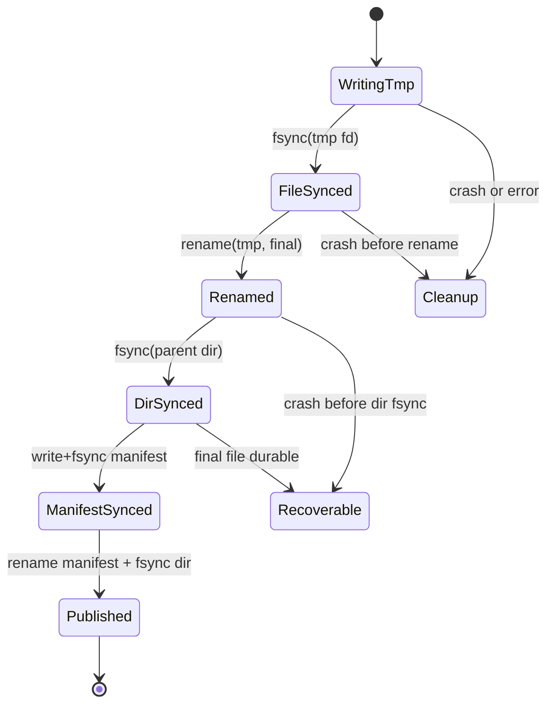

# 第 0c3 章 存储语义：fsync、Direct IO 与 checkpoint

> **关联章节**：本章承接 [0c1](0c1-vfs-inode-dentry-and-block-layer.md) 的 VFS/Page Cache 和 [0c2](0c2-local-filesystems-ext4-xfs-zfs.md) 的本地文件系统机制，目标是把“写完了”拆成可证明的发布协议。对象存储发布方式见 [0c4](0c4-object-storage-parallel-filesystems-and-dataset-io.md)。

## 1. 第一性原理拆解 + 学习地图

### 拆：不可化简的问题

应用想表达的是：“这个 checkpoint 可以恢复训练”。
操作系统看到的是一串 `write()`、`rename()`、`fsync()`、`close()`、目录更新和设备 flush。
失败可以发生在任意两步之间。
因此 checkpoint 质量不是看文件名是否出现，而是看 crash 后 reader 会看到什么状态。

### 推：从问题推出机制

- `write()` 只说明字节进入内核路径，不等于稳定存储。
- `fsync(file)` 推动文件数据和必要元数据持久化，但不一定持久化父目录项。
- `rename(old, new)` 在同一目录同一文件系统内提供原子命名切换，但不替你 sync 数据。
- `fsync(parent_dir)` 用来持久化目录项创建、删除或 rename 的结果。
- `O_DIRECT`、`O_SYNC`、`RWF_DSYNC`、`io_uring` 改变提交路径或等待点，但不改变应用必须定义发布协议这个事实。

### 绘：安全发布的状态机



### 导：本章读完后能做什么

1. 区分 `write`、`fdatasync`、`fsync`、`syncfs`、`close` 的语义。
2. 解释为什么安全 checkpoint 常需要 temp file、file fsync、rename、dir fsync、manifest。
3. 设计 checkpoint crash matrix，而不是重复相信“rename 原子”。
4. 判断 `O_DIRECT`、`io_uring`、`RWF_DSYNC` 对性能和语义分别改变了什么。
5. 写出训练恢复、模型发布和 dataset manifest 的 SOP。

## 2. write 成功到底意味着什么

`write(fd, buf, len)` 返回成功，最小含义是内核接受了这些字节的一部分或全部。
对 buffered IO，它通常已经把用户缓冲区复制进 Page Cache，并把相关页标记 dirty。
它不表示数据已经写到 SSD，也不表示设备的易失 cache 已经 flush。

`write()` 可能短写。
网络文件系统、配额、ENOSPC、EIO、信号中断都可能导致返回值小于请求长度。
可靠写入循环必须处理短写和错误。

```c
ssize_t full_write(int fd, const char *p, size_t n) {
    size_t off = 0;
    while (off < n) {
        ssize_t r = write(fd, p + off, n - off);
        if (r > 0) { off += (size_t)r; continue; }
        if (r < 0 && errno == EINTR) continue;
        return -1;
    }
    return (ssize_t)off;
}
```

`close()` 也可能返回错误。
如果之前的 writeback 失败，错误可能延迟到 `fsync()` 或 `close()` 才暴露。
训练代码如果忽略 close/fsync 错误，就可能把坏 checkpoint 标记为成功。

## 3. fsync、fdatasync、syncfs

`fsync(fd)` 请求把文件数据和恢复该文件所需的元数据写到稳定存储。
如果文件大小变化，size 元数据也需要持久化。
如果只是覆盖已有范围，`fdatasync(fd)` 可能少同步部分时间戳等非必要元数据。
实际差异取决于文件系统和内核实现。

`syncfs(fd)` 作用在 fd 所在文件系统，把该文件系统上的脏数据推进同步。
它适合管理工具，不适合作为单个 checkpoint 的精确发布边界。

常见误解：

| 调用 | 能说明什么 | 不能说明什么 |
|---|---|---|
| `write()` | 内核接受了字节 | 字节已经持久化 |
| `fsync(file)` | 文件内容和必要元数据已推进持久化 | 父目录项一定持久化 |
| `fdatasync(file)` | 文件数据和必要元数据已推进持久化 | 所有元数据都持久化 |
| `close()` | fd 被释放，可能报告延迟错误 | 自动完成正确发布协议 |
| `syncfs()` | 文件系统级同步请求 | 单文件原子发布 |

## 4. rename 的原子性和限制

`rename(old, new)` 在同一挂载的同一文件系统内是命名原子操作。
reader 要么看到旧名字，要么看到新名字，不会看到半个目录项。
如果 `new` 已存在，POSIX 语义下替换也是原子的。

限制必须说清：

- 跨文件系统 rename 会失败为 `EXDEV`，应用常退化成 copy + unlink，这不再是原子切换。
- rename 原子不代表新文件内容已经落盘。
- rename 后如果不 `fsync(parent_dir)`，crash 后目录项更新是否保留不能作为应用协议假设。
- 对象存储里的 rename 通常不是这个语义，见 0c4。

`renameat2()` 还提供 `RENAME_NOREPLACE`、`RENAME_EXCHANGE` 等选项。
它们能表达“不要覆盖”或“交换两个名字”，但仍不能替代 file fsync 和 dir fsync。

## 5. 父目录 fsync

目录也是文件系统对象。
创建文件、unlink、rename 会改变父目录的目录项。
`fsync(file)` 关注文件内容和该文件自身必要元数据；父目录的命名更新需要对目录 fd 调用 `fsync()`。

安全发布通常要：

```text
open tmp
write all bytes
fsync tmp file
close tmp file
rename tmp -> final
open parent directory
fsync parent directory
close parent directory
```

目录 fd 示例：

```c
int dfd = open("/mnt/ckpt/run42", O_RDONLY | O_DIRECTORY | O_CLOEXEC);
if (dfd < 0) abort();
if (fsync(dfd) < 0) abort();
close(dfd);
```

一些文件系统或挂载组合对目录 fsync 的支持和语义不同。
生产协议应在目标文件系统上做 crash 演练，而不是只依赖开发机经验。

## 6. 标准 checkpoint 发布协议

单文件 checkpoint 的保守协议：

1. 写到同目录临时文件，例如 `model.safetensors.tmp.<pid>`。
2. 处理所有短写和错误。
3. `fsync(tmp_fd)`。
4. `close(tmp_fd)` 并检查返回值。
5. `rename(tmp, final)`。
6. `fsync(parent_dir)`。
7. 更新 manifest 或 `latest` 指针时重复同样的 temp + fsync + rename + dir fsync。

多 rank checkpoint 的推荐结构：

```text
ckpt-000123.tmp/
  rank-00000.bin
  rank-00001.bin
  ...
  metadata.json
ckpt-000123/              # rename or manifest published only after all files synced
latest.json               # small manifest pointer
```

如果目录整体 rename 在同一文件系统内可用，可以先完成临时目录内所有文件 fsync，再 rename 目录，最后 fsync 父目录。
但很多对象存储或远端文件系统不提供同样语义，因此跨后端可移植方案更偏向 manifest 发布。

## 7. Checkpoint crash matrix

下面的矩阵用于检查 reader 在不同失败点会看到什么。
它不是重复同一张表，而是把协议动作和可见状态对应起来。

| 失败点 | 目录里可能看到 | reader 应该怎么做 | 是否可接受 |
|---|---|---|---|
| 写 tmp 中 | `*.tmp` 或残缺临时目录 | 忽略 tmp，后台清理 | 可接受 |
| `fsync(tmp)` 前 | tmp 内容不可信 | 忽略 tmp | 可接受 |
| `fsync(tmp)` 后、rename 前 | tmp 完整但未发布 | 忽略 tmp | 可接受 |
| rename 后、dir fsync 前 | final 可能可见，crash 后可能回退 | reader 只相信 manifest | 取决于协议 |
| dir fsync 后、manifest 前 | final durable 但未进入 latest | 恢复工具可扫描，默认 reader 不读 | 可接受 |
| manifest temp 写入中 | `latest.tmp` | 忽略 tmp | 可接受 |
| manifest rename + dir fsync 后 | `latest.json` 指向完整文件集 | 按 manifest 校验后读取 | 目标状态 |

关键原则：reader 不扫描“看起来像 checkpoint 的目录”作为真相。
reader 只读取已经发布并通过校验的 manifest。
这样目录中存在临时文件、孤儿完整文件、旧版本都不会破坏恢复。

## 8. Direct IO

`O_DIRECT` 主要改变缓存路径。
它减少 Page Cache 污染和一次内存复制，允许应用更直接地控制 IO 并发。
它不自动提供数据完整性协议。
`O_DIRECT` 写成功后，如果没有同步标志或 `fsync()`，仍然不能把 checkpoint 标记为已发布。

Direct IO 要注意：

- buffer 地址、长度、文件 offset 常需要按块大小对齐。
- 混用 buffered IO 和 Direct IO 访问同一文件会引入一致性和性能复杂度。
- 小 IO 使用 Direct IO 可能牺牲 Page Cache 合并和 readahead。
- 某些文件系统在不满足条件时失败或退化，必须实测。

对 checkpoint，大块 Direct IO + 显式 `fsync()` 可能有用。
对 dataset 读取，buffered IO 通常更容易利用 Page Cache 和 readahead。

## 9. O_SYNC、O_DSYNC、RWF_DSYNC

`O_SYNC` 让每次 write 等待数据和相关元数据同步完成。
`O_DSYNC` 更接近每次 write 后执行 data sync，可能少同步部分非必要元数据。
`pwritev2()` 的 `RWF_DSYNC` 让同步语义作用在单次写请求上，而不是整个 fd 生命周期。

这些选项的代价是每个写请求都可能触发更频繁的 flush 或 log force。
如果 checkpoint 由许多小 tensor write 组成，逐次同步会极慢。
更常见的高效协议是批量写完一个大文件后 `fsync()` 一次。

| 方式 | 适合 | 不适合 |
|---|---|---|
| buffered + final fsync | 大 checkpoint、manifest | 需要每条记录立即持久的日志 |
| `O_DSYNC` | 小型事务日志 | 大量小 tensor 分片写 |
| `RWF_DSYNC` | 局部同步请求 | 老内核或不支持文件系统 |
| Direct IO + fsync | 避免 cache 污染的大文件 | 不对齐短写、复杂格式 |

## 10. io_uring 文件 IO

`io_uring` 改变提交和完成模型。
应用把 SQE 放进 submission queue，内核完成后写 CQE。
它可以减少系统调用次数，提升高并发 IO 的提交效率，并支持 linked operation、fixed file、registered buffer 等优化。

但 `io_uring` 不改变持久化语义。
一个 async write 完成，只说明该写请求完成到对应语义点。
如果需要 durable publish，仍然要提交 fsync 请求，并在 fsync CQE 成功后再 rename 或发布 manifest。

文件 IO 中使用 `io_uring` 的判断：

- 有大量并发请求、希望减少 syscall overhead，值得评估。
- 单个大 checkpoint 顺序写，瓶颈常在设备和 flush，收益可能有限。
- 需要严格顺序时，用 linked SQE 或应用状态机表达依赖，不要只靠提交顺序猜测。
- 任何 CQE error 都必须进入失败路径，不能只统计成功吞吐。

## 11. 命令观测：看语义和延迟

观察系统调用：

```bash
strace -f -tt -e trace=openat,write,pwrite64,fdatasync,fsync,rename,close -p <pid>
```

观察 dirty/writeback：

```bash
grep -E 'Dirty|Writeback|Cached' /proc/meminfo
vmstat 1
```

观察设备 flush 和延迟：

```bash
iostat -x 1
blktrace -d /dev/nvme0n1 -o - 2>/dev/null | blkparse -i - | head
```

用 `fio` 近似 checkpoint：

```bash
fio --name=ckpt --directory=/mnt/ckpt --rw=write --bs=4m \
  --size=20g --numjobs=8 --iodepth=8 --direct=1 \
  --ioengine=libaio --fsync_on_close=1 --group_reporting
```

如果 `write` 阶段快而 `fsync_on_close` 或 close 阶段长，说明数据被缓存吸收，真正持久化成本集中在尾部。
这对训练 step time 的影响取决于 checkpoint 是否在 critical path 上。

## 12. Worked example：16 rank checkpoint 发布

场景：16 rank，每个 rank 写 50GB，总 checkpoint 800GB。
要求 crash 后要么恢复到旧 checkpoint，要么恢复到完整新 checkpoint，不能读到部分 rank。

设计：

```text
runs/job-7/
  ckpt-0041/
    manifest.json
  ckpt-0042.tmp.<uuid>/
    rank-00000.bin
    ...
    rank-00015.bin
    metadata.json
  latest.json
```

每个 rank：

1. 写自己的 `rank-xxxxx.bin.tmp`。
2. `fsync(file)`。
3. `rename(tmp, rank-xxxxx.bin)`。
4. `fsync(ckpt_tmp_dir)` 或由协调者统一 fsync 目录。
5. 报告 checksum、size、duration。

协调者：

1. 等待所有 rank 成功。
2. 写 `metadata.json.tmp`，包含 rank 文件名、size、checksum、global step、代码版本。
3. fsync metadata，rename metadata，fsync 临时目录。
4. 发布 `latest.json.tmp`，指向 `ckpt-0042.tmp.<uuid>` 或最终目录名。
5. 如果需要目录名稳定，先 rename 目录为 `ckpt-0042`，fsync 父目录，再发布 latest。

恢复：只读取 `latest.json` 指向的 manifest。
逐项校验文件存在、size 和 checksum。
任何不匹配都回退到上一个 latest 或进入人工恢复流程。

## 13. Mini case：为什么只 rename final 不够

错误实现：

```text
open final
write bytes
close final
rename final latest
```

问题有三个。
第一，reader 可能在写入过程中看到 final，因为写入目标不是 tmp。
第二，close 错误被忽略时，latest 可能指向损坏文件。
第三，rename latest 没有配套文件 fsync 和目录 fsync，crash 后可能丢失目录项或文件内容。

修正后：

```text
write final.tmp
fsync final.tmp
close final.tmp with error check
rename final.tmp final
fsync parent dir
write latest.tmp
fsync latest.tmp
rename latest.tmp latest
fsync parent dir
```

这个协议牺牲了一些尾延迟，换来明确的恢复状态。
如果尾延迟不可接受，应优化文件布局、并发、设备和异步上传，而不是删除同步步骤。

## 14. SOP：checkpoint 语义验收

1. 写出发布协议状态机，明确 reader 只相信什么入口。
2. 所有写入处理短写、EINTR、ENOSPC、EDQUOT、EIO。
3. 文件内容写完后 `fsync(file)`，并检查返回值。
4. rename 后 `fsync(parent_dir)`。
5. manifest 包含 size、checksum、rank 数、训练 step、格式版本。
6. 恢复流程验证 manifest，不靠目录扫描猜测完整性。
7. 压测包括正常写、kill -9、节点重启、满盘、权限错误、远端 IO error。
8. 记录 fsync p50/p95/p99 和最大值，不只记录平均吞吐。
9. 对对象存储使用 manifest/multipart 协议，不假设 POSIX rename。

## 15. Checklist

- 是否把 `write()` 成功和持久化成功分开处理？
- 是否检查 `fsync()` 和 `close()` 错误？
- 是否在 rename 后同步父目录？
- 是否避免 reader 直接读取临时文件或未发布目录？
- 是否为多 rank checkpoint 设计 all-or-nothing manifest？
- 是否知道当前后端是否支持目录 fsync、rename 原子性和 Direct IO？
- 是否把 `io_uring` 看作提交机制，而不是持久化协议？
- 是否做过 crash 演练并保存结果？

## 16. 练习

1. 解释 `fsync(file)` 后为什么还可能需要 `fsync(parent_dir)`。
2. 设计一个三文件 checkpoint 的 manifest 格式，包含 checksum 和 size。
3. 说明 `O_DIRECT` 能减少什么，不能保证什么。
4. 把一个错误的“直接写 final 文件”协议改成安全发布协议。
5. 给出 5 个 crash 注入点，并写出 reader 应看到的结果。
