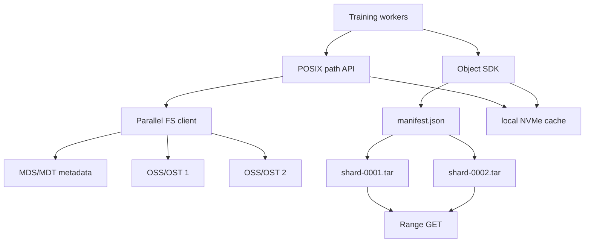

# 第 0c4 章 对象存储、并行文件系统与 Dataset IO

> **关联章节**：本章把 [0c1](0c1-vfs-inode-dentry-and-block-layer.md) 的 VFS 思维扩展到非本地后端，并承接 [0c3](0c3-storage-semantics-fsync-direct-io-and-checkpoints.md) 的发布语义。重点是对象存储、并行文件系统、manifest、stripe、MDS 和小文件治理。

## 1. 第一性原理拆解 + 学习地图

### 拆：不可化简的问题

AI 数据平台既要喂饱 GPU，又要支持多租户共享、版本管理、失败恢复和低成本存储。
单机 POSIX 文件系统不能覆盖所有需求。
对象存储提供廉价、弹性、HTTP API 和强大的持久性，但不是 inode + rename 模型。
并行文件系统提供共享命名空间和高带宽，但元数据服务和条带策略会成为系统设计的一部分。

### 推：从问题推出机制

- 对象存储没有目录 inode，key 前缀只是命名约定，所以 dataset 入口应是 manifest 而不是递归 LIST。
- 大对象上传不能一次请求完成，所以需要 multipart upload、part checksum、complete 和 abort。
- 多 worker 读取不能全靠小对象随机 GET，所以需要 shard、range read、本地 cache 和 index。
- 并行文件系统要把数据分散到多个 OSS/OST 或 NSD 上，所以需要 stripe size/count。
- 海量小文件会打爆 MDS 或对象存储请求预算，所以要治理文件粒度。

### 绘：三种存储模型



### 导：本章读完后能做什么

1. 解释对象存储的 PUT/GET/LIST/multipart 与 POSIX 文件系统的差异。
2. 用 manifest 设计 dataset 和 checkpoint 的发布入口。
3. 判断并行文件系统瓶颈来自 MDS、OSS/OST、stripe、客户端 cache 还是网络。
4. 把小文件 dataset 改造成 shard + index + cache 的读取路径。
5. 写出 dataset IO 的观测命令、SOP 和验收指标。

## 2. 对象存储不是 POSIX 文件系统

对象存储的基本单位是 object。
object 有 key、bytes、metadata、etag/version 等属性。
所谓目录通常只是 key 前缀，例如 `dataset/v3/train/shard-0001.tar`。
没有本地文件系统意义上的 inode、hard link、目录 fd、跨对象原子 rename。

常见操作：

| 操作 | 含义 | 与 POSIX 的差异 |
|---|---|---|
| PUT object | 写入一个完整 object | 不是 `write()` 流式可见文件 |
| GET object | 读取 object | 可用 Range 读取片段 |
| LIST prefix | 枚举某个前缀 | 不是目录 inode 遍历，成本和一致性要按服务理解 |
| Multipart upload | 分片上传大 object | complete 前 object 通常不可见 |
| Copy + delete | 模拟 rename | 非原子，成本高，失败状态复杂 |

现代主流对象存储通常提供强一致读写语义，但应用仍不应把 LIST 当成 dataset 真相源。
原因是 LIST 成本高、分页复杂、跨账号/跨区域/网关/FUSE 层语义可能变化，而且训练启动时全量 LIST 会制造控制面尖峰。

## 3. Multipart upload

Multipart upload 把大对象拆成多个 part 上传。
完成流程通常是：initiate、upload parts、complete。
complete 前，最终 object 不应作为已发布数据被 reader 使用。
失败时要 abort，避免遗留未完成分片占用成本。

设计要点：

- part size 不要太小；太小会增加请求数和服务端元数据压力。
- 每个 part 记录 checksum，complete 后记录 object checksum 或组合校验。
- 上传 worker 控制并发，避免把带宽、CPU checksum、TLS 和服务端 throttling 混在一起。
- 失败重试必须幂等，part number 和内容要稳定。
- complete 成功后再发布 manifest 指针。

示例命令：

```bash
aws s3api create-multipart-upload --bucket my-bucket --key dataset/v3/shard-0001.tar
aws s3api upload-part --bucket my-bucket --key dataset/v3/shard-0001.tar \
  --part-number 1 --body part-0001 --upload-id <upload-id>
aws s3api complete-multipart-upload --bucket my-bucket --key dataset/v3/shard-0001.tar \
  --upload-id <upload-id> --multipart-upload file://parts.json
```

## 4. Manifest 是发布入口

Manifest 是对象存储和并行数据集里最重要的应用层边界。
它把“有哪些 shard、每个 shard 多大、校验和是什么、样本索引在哪里、版本是什么”写成一个小对象或小文件。
训练入口读取 manifest，而不是实时扫描目录或 LIST prefix。

一个最小 manifest：

```json
{
  "dataset": "imagenet-sharded",
  "version": "v2026-05-04",
  "format": "tar+idx",
  "shards": [
    {"key": "train/shard-000000.tar", "bytes": 1073741824, "sha256": "...", "samples": 8192},
    {"key": "train/shard-000001.tar", "bytes": 1073741824, "sha256": "...", "samples": 8192}
  ],
  "index": "train/index-v2026-05-04.parquet"
}
```

发布协议：

1. 上传所有 shard，完成 multipart。
2. 校验 size 和 checksum。
3. 上传 manifest 到不可变 key，例如 `manifests/v2026-05-04.json`。
4. 更新小指针 `current.json`，内容只包含当前 manifest key 和版本。
5. reader 读取 `current.json`，再读取 manifest，再按 manifest 读取 shard。

这样即使前缀下有临时对象、旧版本或失败上传残留，reader 也不会把它们纳入训练。

## 5. LIST 的成本和陷阱

LIST 适合管理和审计，不适合作为每个训练 job 的启动路径。
一个包含 5000 万对象的数据集，如果每个 job 启动都分页 LIST，会产生高延迟、高费用和控制面压力。
分页过程中如果还有写入或删除，应用还要处理重复、遗漏、排序和 continuation token。

更稳的模式：

- 数据生产时生成 manifest 和 index。
- 训练时只读 manifest。
- 定期离线审计 LIST 与 manifest 是否一致。
- 清理任务只删除 manifest 不再引用的对象。
- 多版本并存时用版本前缀或内容地址 key，避免覆盖更新。

观测对象存储请求：

```bash
aws s3 ls s3://bucket/dataset/v3/ --recursive --summarize
aws s3api list-objects-v2 --bucket bucket --prefix dataset/v3/ --max-items 1000
aws s3api head-object --bucket bucket --key dataset/v3/train/shard-0001.tar
```

## 6. 对象存储读取路径：Range GET、cache、prefetch

训练读取 shard 时通常不下载整个 dataset。
worker 根据 index 定位 shard 和 byte range，再发起 Range GET 或从本地 cache 读取。
本地 cache 可以是节点 NVMe、daemon cache、FUSE cache 或框架自带 cache。

设计参数：

| 参数 | 影响 | 建议 |
|---|---|---|
| shard size | 请求数、并行度、失败重试成本 | 常从 256MB 到 2GB 起测 |
| sample grouping | 随机性和顺序读效率 | 同一 shard 内打乱，跨 shard 分配 |
| prefetch depth | 隐藏网络延迟 | 与 worker 数、内存、带宽一起调 |
| cache key | 复用和一致性 | dataset version + shard checksum |
| retry budget | 尾延迟和成本 | 区分 404、429、5xx、timeout |

不要让所有 rank 同时读取同一个 shard 开头。
可以按 global rank 对 shard 列表做确定性切分，并在 epoch 间改变顺序。

## 7. 并行文件系统模型

Lustre、GPFS/Spectrum Scale、BeeGFS 等并行文件系统提供 POSIX 风格共享命名空间。
它们的核心是把元数据路径和数据路径拆开。
MDS/MDT 负责目录、inode、权限、layout。
OSS/OST 或 NSD 负责数据块。
客户端把 VFS 请求转成网络协议和后端请求。

| 组件 | 负责 | 典型瓶颈 |
|---|---|---|
| client | VFS 接入、cache、RPC | CPU、网络、缓存失效 |
| MDS/MDT | lookup、create、unlink、stat | 小文件、目录扫描、锁竞争 |
| OSS/OST | 数据读写 | 顺序带宽、热点 OST |
| network | client 到服务端 | 拥塞、包丢、RDMA 配置 |
| coordinator | quota、锁、恢复 | 大规模 job 同步风暴 |

并行文件系统能提供很高 aggregate bandwidth，但不意味着 `stat()` 无限快。
DataLoader 如果每个 sample 都触发 open/stat，小文件元数据仍会先打满 MDS。

## 8. Stripe 策略

Stripe 决定一个文件的数据如何分布到多个数据服务端。
stripe count 越高，大文件可并行读写的服务端越多。
但小文件使用过高 stripe count 会增加元数据和锁成本。
stripe size 决定连续多少字节放在同一 stripe 上。

Lustre 示例：

```bash
lfs getstripe /mnt/lustre/dataset
lfs setstripe -c 8 -S 16M /mnt/lustre/checkpoints
lfs df -h
lfs osts
```

经验方向：

| 文件类型 | stripe count | stripe size | 理由 |
|---|---|---|---|
| 10GB+ checkpoint shard | 多 OST | 8MB 到 64MB 起测 | 提升大文件并行带宽 |
| 512MB tar shard | 中等 | 4MB 到 16MB 起测 | 平衡吞吐和管理成本 |
| 100KB 小图片 | 1 | 默认或小 stripe | 避免为小文件放大元数据 |
| manifest/index 小文件 | 1 | 默认 | 低延迟、简单 |

Stripe 不是越大越好。
如果所有 rank 同时写很多大文件，高 stripe count 可能让所有文件打到所有 OST，制造全局竞争。
更好的方案可能是按 rank 或目录分布 stripe，使热点分散。

## 9. 小文件治理

小文件问题不是“文件系统不够快”，而是 IO 形状不匹配。
每个样本一个对象或一个文件，会产生大量 open/stat/GET/head 请求。
当单样本只有几十 KB，元数据、TLS、RPC、调度和 Python overhead 可能超过数据传输本身。

治理方向：

- 打包成 tar、zip、RecordIO、Parquet、Arrow、TFRecord、WebDataset 等 shard。
- 为 shard 建 index，记录 sample id 到 `(shard, offset, length)`。
- 保持 shard 不可变，用 manifest 发布版本。
- 把随机性放在 index 和 sampler 层，而不是依赖随机小文件读取。
- 本地 cache 以 shard 为单位，不以单样本为单位。
- 对异常样本建立 sidecar blacklist，不重写整个 dataset。

文件大小分布观测：

```bash
find /mnt/dataset -type f -printf '%s\n' \
  | awk '{n++; s+=$1; if($1<65536)a++; if($1<1048576)b++} END {print "files",n,"avg",s/n,"<64K",a,"<1M",b}'
find /mnt/dataset -type f | sed 's#/[^/]*$##' | sort | uniq -c | sort -nr | head -20
```

## 10. Dataset 读取架构

一个稳定的 dataset IO 架构通常包含四层。

```text
manifest/current pointer
  -> shard manifest and index
    -> object store or parallel FS shards
      -> node-local cache
        -> worker prefetch and decode
```

职责分离：

| 层 | 负责 | 不应该负责 |
|---|---|---|
| manifest | 版本、完整性、shard 列表 | 实时发现对象 |
| index | sample 到 byte range | 数据持久性 |
| storage | 保存 shard bytes | 训练随机性 |
| cache | 降低重复读取成本 | 版本真相 |
| worker | prefetch、decode、batch | 全局目录扫描 |

训练 worker 只需要知道当前 epoch 分到哪些 sample 或 shard。
它不应在热路径里递归目录、LIST 对象前缀、或为每个样本做远端 HEAD。

## 11. 命令观测：对象、并行 FS、本地 cache

对象存储侧：

```bash
aws s3api head-object --bucket bucket --key dataset/v3/manifest.json
aws s3api list-objects-v2 --bucket bucket --prefix dataset/v3/train/ --max-items 10
curl -I https://example-bucket.s3.amazonaws.com/dataset/v3/train/shard-0001.tar
```

并行文件系统侧：

```bash
findmnt -T /mnt/shared -o TARGET,SOURCE,FSTYPE,OPTIONS
df -hT /mnt/shared
df -ih /mnt/shared
lfs getstripe /mnt/shared/path 2>/dev/null || true
mmlsfs all 2>/dev/null | head || true
beegfs-ctl --getentryinfo /mnt/shared/path 2>/dev/null || true
```

训练进程侧：

```bash
pidstat -d -p <pid> 1
strace -f -c -e trace=openat,newfstatat,read,close -p <pid>
iostat -x 1
ss -tinp | head
```

如果对象存储请求 p99 高，但本地 cache hit 率低，先优化 cache key、prefetch 和 shard 切分。
如果并行文件系统 MDS busy，而 OST 带宽不高，先减少小文件和目录扫描。
如果 OST 带宽满而 MDS 空闲，再调 stripe、worker 并发和压缩解码。

## 12. Worked example：2000 万小图片迁移

场景：原始数据是 2000 万张小图片，平均 80KB，按类别目录存放。
训练启动要扫描目录生成 sample list，启动 20 分钟，GPU 经常等待。
存储后端从本地 NFS 迁到对象存储后，直接一文件一对象更慢。

迁移方案：

1. 离线扫描原始目录，生成全量样本表：sample id、label、原始路径、size、checksum。
2. 按类别和随机种子打包为 1024MB 左右 tar shard。
3. 为每个 shard 生成 index：sample id、offset、length、label、checksum。
4. 上传 shard 到对象存储，使用 multipart 和 checksum。
5. 上传全局 Parquet index 和 manifest。
6. 训练读取 `current.json`，按 rank 切分 shard，Range GET 或本地 cache 读取。
7. 每个 epoch 在 index 层 shuffle，不在对象存储层 LIST。

收益评估：

| 指标 | 迁移前 | 迁移后目标 |
|---|---|---|
| 训练启动 | 20 分钟目录扫描 | 读取 manifest/index 小于 30 秒 |
| 请求数 | 每 epoch 数千万 open/stat/GET | 每 shard 少量 GET/Range |
| GPU idle | 随机尖峰 | decode 或训练成为主要瓶颈 |
| 版本管理 | 目录覆盖 | manifest 不可变版本 |

失败处理：如果某个 shard checksum 不匹配，reader 标记该 shard 不可用并停止训练，不能静默跳过样本。
清理任务只删除没有被任何 manifest 引用的 shard。

## 13. Mini case：并行文件系统 checkpoint 热点

场景：64 节点训练，每节点 8 rank，每 rank 写一个 8GB 文件到 Lustre。
所有 rank 写到同一个目录，默认 stripe count 为 1。
现象是总吞吐远低于存储标称，MDS CPU 高，部分 OST 空闲。

分析：

- 同一目录创建 512 个文件，MDS 处理 create、layout、lock。
- stripe count 1 让每个大文件只落到一个 OST，分布可能不均。
- 所有 rank 同时 rename 和 fsync 父目录，制造元数据同步尖峰。

改法：

- 预创建分层目录，例如 `node-000/rank-000.bin`，减少单目录热点。
- 对大 rank 文件设置合适 stripe count，例如 4 或 8，并压测 stripe size。
- rank 文件写完后由协调者分批发布 manifest，避免所有 rank 同时操作同一父目录。
- 把最终长期存储异步转移到对象存储，训练热路径只保留最近 checkpoint。

验证：看 MDS/OST 指标、`lfs getstripe`、`iostat`、训练端 fsync p99。
不要只看 aggregate bandwidth 的单次峰值。

## 14. Dataset IO SOP

1. 统计文件数量、大小分布、目录 fanout、样本读取顺序和解码成本。
2. 明确后端：对象存储、并行文件系统、本地 NVMe、NFS、FUSE 或混合。
3. 规定版本入口：`current.json` 或等价 manifest 指针。
4. 数据生产阶段生成 shard、index、checksum 和 manifest。
5. 训练阶段禁止热路径全量 LIST 或递归目录扫描。
6. 按 rank/worker 做确定性切分，避免所有 worker 抢同一 shard。
7. 设置本地 cache 容量、水位、淘汰策略和 cache key。
8. 记录请求 p50/p95/p99、cache hit、decode time、GPU wait、MDS/OST 指标。
9. 做失败演练：缺 shard、坏 checksum、对象存储 429、MDS 抖动、cache 满。
10. 把清理策略绑定 manifest 引用，不按前缀时间盲删。

## 15. Checklist

- 是否把对象存储 key 前缀当成命名约定，而不是 POSIX 目录？
- 是否使用 manifest 作为 dataset 入口？
- 是否避免训练启动时全量 LIST？
- 是否为 multipart upload 记录 part 和最终 checksum？
- 是否按 shard 而不是单小文件设计 cache？
- 是否知道并行文件系统的 MDS 和数据服务端是否分别饱和？
- 是否为大文件设置并验证 stripe，而不是照抄默认值？
- 是否把小文件治理放在数据格式层，而不是只换后端？
- 是否对 reader 做 size/checksum 校验？

## 16. 练习

1. 设计一个 manifest，描述 3 个 shard、每个 shard 的 size、checksum 和样本数。
2. 解释为什么对象存储上的 rename 不能当成本地 POSIX rename 使用。
3. 给一个 1TB tar shard 数据集，选择 shard size 和 worker 切分策略。
4. 看到 MDS CPU 高、OST 带宽低，应如何改 DataLoader 或目录布局？
5. 为一个节点本地 cache 设计 key、容量水位和清理规则。
