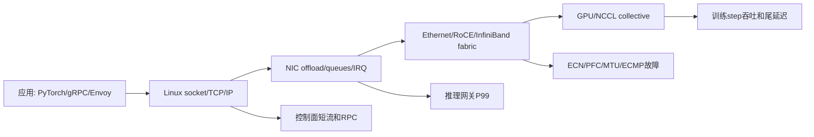

# 第 0d 章 · 网络协议栈基础导览

> **关联章节**：本章改为导览章。详细内容拆到 [0d1](0d1-linux-network-stack-tcp-and-mtu.md)、[0d2](0d2-nic-offload-queues-and-service-network-io.md)、[0d3](0d3-rdma-roce-infiniband-and-gpudirect.md)、[0d4](0d4-nccl-collectives-and-network-diagnostics.md)。NUMA、PCIe、DMA 与 pinned memory 见 [0b3](0b3-numa-pcie-dma-and-pinned-memory.md)，syscall、epoll、io_uring 见 [0b4](0b4-syscall-epoll-io-uring-and-service-io.md)。

## 1. 为什么拆分

网络协议栈在 AI Infra 里横跨两类问题：控制面要稳定处理短连接、RPC、Kubernetes API、对象存储和推理请求；训练数据面要在每个 step 里搬运 GB 级梯度、激活或参数分片。把这些内容放在一个长章里，容易让读者把 Linux TCP、NIC queue、RDMA fabric 和 NCCL collective 混成一个“网络慢”的标签。

拆分后的阅读目标是：先建立从应用到网卡的路径感，再理解硬件 offload 和多队列如何影响 CPU，接着进入 RDMA/RoCE/IB/GPUDirect 的数据面，最后用 NCCL 日志和验收 SOP 把训练网络排障闭环。

## 2. 四个子章的边界

| 章节 | 主问题 | 读完后能做什么 |
| --- | --- | --- |
| [0d1](0d1-linux-network-stack-tcp-and-mtu.md) | Linux 收发包、TCP、IP 路由、MTU/PMTU/ECMP | 能解释 send/recv 到 NIC 的路径，估算 BDP，判断短流/长流和 MTU 故障。 |
| [0d2](0d2-nic-offload-queues-and-service-network-io.md) | NIC offload、多队列、RSS/RPS/XPS、IRQ、softirq、服务网络 IO | 能看懂 ethtool、/proc/interrupts、softirq，并排查推理网关 P99。 |
| [0d3](0d3-rdma-roce-infiniband-and-gpudirect.md) | RDMA verbs、MR/QP/CQ/WR/WC、RoCE v2、InfiniBand、GPUDirect RDMA | 能把一次 RDMA 传输映射到 verbs 对象，区分 RoCE 与 IB 的运维风险。 |
| [0d4](0d4-nccl-collectives-and-network-diagnostics.md) | NCCL collective、transport、日志、AllReduce 网络诊断、训练网络验收 | 能用 NCCL 日志判断 fallback、GDRDMA、HCA、算法、拓扑和网络异常。 |

## 3. 总因果图



## 4. 推荐阅读顺序

1. 先读 0d1，建立“应用调用到线缆上出现帧”的路径。没有这条路径，后面所有 offload、RDMA 和 NCCL 日志都容易失去位置感。
2. 再读 0d2，理解为什么网卡不是一个单队列黑盒，以及为什么推理网关 P99 经常卡在 IRQ、softirq、RSS 或连接分布。
3. 接着读 0d3，进入训练数据面的 verbs、memory registration、RoCE/IB 和 GPUDirect RDMA。这里的关键不是背术语，而是知道数据如何绕开远端 CPU。
4. 最后读 0d4，把 NCCL 日志、collective 算法、fabric counter 和验收 SOP 串成排障流程。

## 5. 一张责任边界表

| 边界 | 主要对象 | 典型证据 |
| --- | --- | --- |
| 应用到内核 | fd、socket buffer、epoll、io_uring | 应用 trace、`ss -tinm`、event loop lag。 |
| 内核到 NIC | skb、qdisc、driver ring、queue | `tc -s qdisc`、`ethtool -S`、`/proc/softirqs`。 |
| NIC 到交换机 | MTU、VLAN、RSS、PFC、ECN、ECMP | 端口 counter、drop、pause、ECN mark、route hash。 |
| NIC 到 GPU | PCIe、NUMA、BAR、pinned memory、GDRDMA | `nvidia-smi topo -m`、NCCL `NET/IB` 日志、verbs counter。 |
| collective 层 | ring/tree、rank、channel、transport | `NCCL_DEBUG=INFO`、`nccl-tests`、per-rank time。 |

## 6. 全局排障原则

- 先定位责任边界，再改参数。网络参数很多，盲调 MTU、queue 数、ECN threshold 或 NCCL 变量，容易把可复现问题变成偶发问题。
- 同时看主机和 fabric。主机上的 retrans、softirq、queue drop 只描述一半事实，交换机上的 discard、pause、ECN mark、buffer occupancy 才能说明共享链路发生了什么。
- 分开看短流和长流。短流通常被握手、连接池、队列和调度支配；长流通常被 BDP、拥塞控制、MTU、路径熵和 fabric 配置支配。
- 分开看 control plane 和 data plane。NCCL AllReduce 走 RDMA 不代表 bootstrap、rendezvous、对象存储、日志和监控也不会拖慢 job。

## 7. 快速入口

| 你看到的症状 | 优先进入 |
| --- | --- |
| 推理网关 P99 抖动，CPU 总体不满 | 0d2，重点看 RSS、IRQ affinity、softirq、连接分布。 |
| 跨节点 TCP 吞吐上不去或重传多 | 0d1，重点看 BDP、cwnd、PMTU、qdisc、ECMP。 |
| RoCE 训练偶发 timeout 或 retry | 0d3，重点看 MR/QP/CQ、PFC、ECN、DCQCN、MTU。 |
| NCCL AllReduce 慢或 fallback 到 socket | 0d4，重点看 NCCL 日志、transport、GDRDMA、HCA、拓扑和 fabric counter。 |

## 8. 最小命令集

```bash
ip -br addr
ip route get <peer_ip>
ss -tinm dst <peer_ip>
tc -s qdisc show dev <iface>
ethtool -k <iface>
ethtool -l <iface>
ethtool -S <iface> | head -120
cat /proc/softirqs | egrep 'NET_RX|NET_TX'
cat /proc/interrupts | egrep 'mlx|eth|ens|enp'
nvidia-smi topo -m
NCCL_DEBUG=INFO NCCL_DEBUG_SUBSYS=INIT,NET,GRAPH ./all_reduce_perf -b 8M -e 4G -f 2 -g 8
```

## 9. 进入下一章前的自测

- 能画出一次 TCP send 从应用到 NIC TX queue 的路径。
- 能说明 receive window 与 congestion window 的区别。
- 能解释为什么 TSO/GSO 会让抓包看到“大包”，但链路帧仍受 MTU 限制。
- 能说明 RSS、IRQ affinity、NUMA 为什么会影响推理服务尾延迟。
- 能用 MR、QP、CQ、WR、WC 串起一次 RDMA Write。
- 能从 NCCL 日志里找到 socket、NET/IB、GDRDMA、HCA、GID、rank、channel、algorithm 相关线索。

## 10. 章节产物

读完 0d1-0d4 后，你应该能产出三类工程文档：一份推理网关网络 IO 排查 SOP，一份 RoCE/IB 训练 fabric 变更检查单，一份 NCCL 集群验收报告模板。后续训练、Serving 和平台章节会默认你已经理解这些边界。
