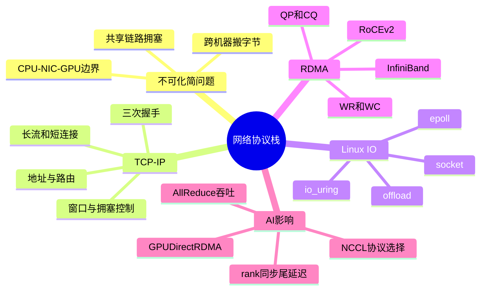
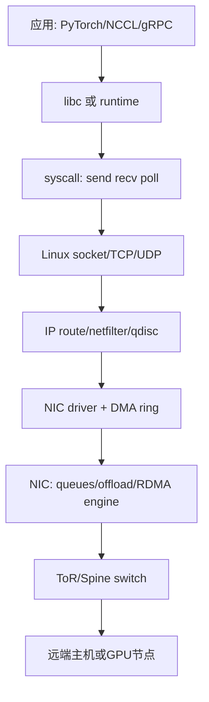
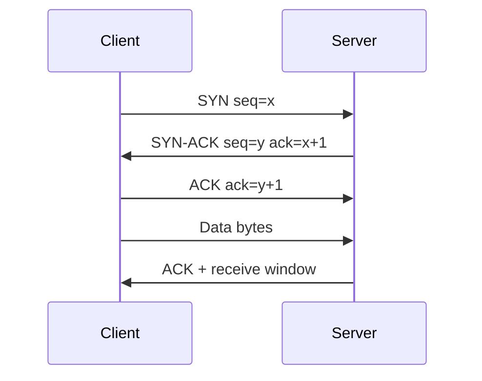
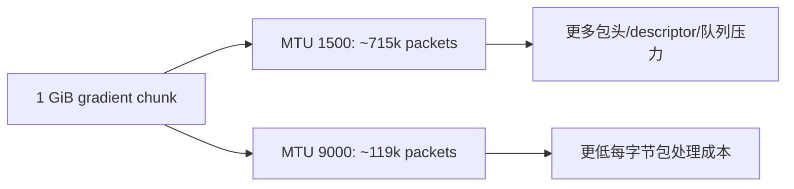
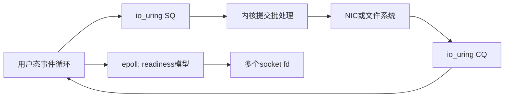
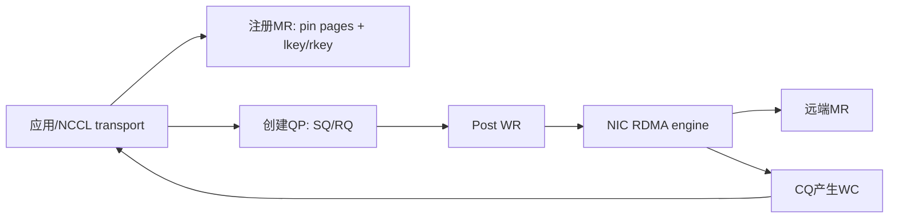
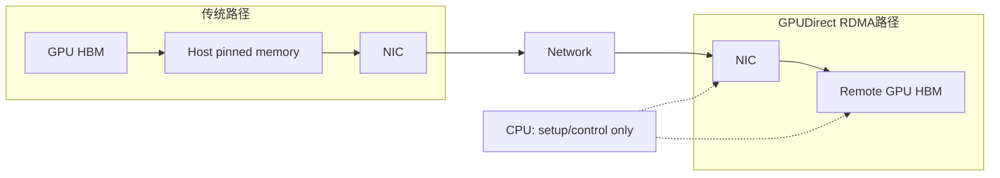
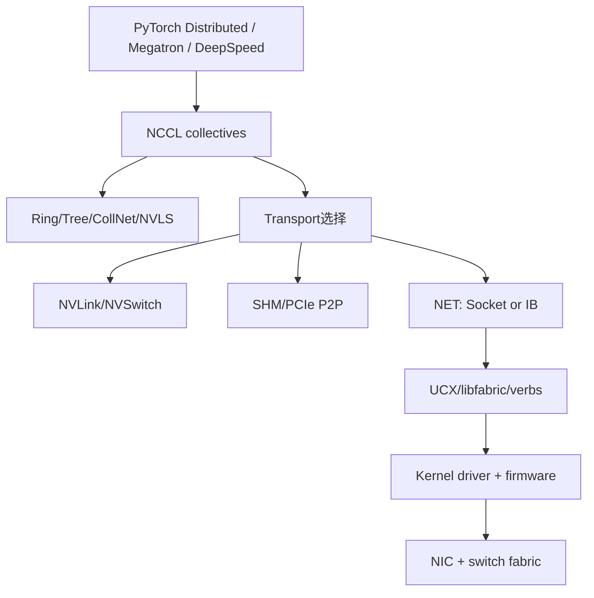

# 第 0d 章 网络协议栈基础

AI 平台里的网络不是一个单一组件。控制面通常还在用 TCP、HTTP、gRPC、Kubernetes API、对象存储 API；数据面才会在训练集群里尽量走 RDMA、NCCL、GPUDirect RDMA。工程师如果只记“RDMA 很快”或“MTU 要开 9000”，很容易在故障现场漏掉真正瓶颈：一次 AllReduce 慢，可能是 ECN 没开，也可能是网卡队列 RSS 打散不均、MTU 不一致、PCIe 拓扑绕远、TCP control plane 抖动导致 rank rendezvous 慢。本章从协议栈的第一性问题出发，把 Linux 网络、TCP/IP、socket、offload、RDMA、NCCL 的关系放到同一张工程地图上。

## 0d.1 第一性原理拆解 + 学习大纲

### 拆 — 不可化简的问题

网络协议栈要解决的不可化简问题是：一台机器里的程序只会读写内存和文件描述符，但训练任务需要把另一台机器、另一张 GPU、另一个进程里的字节，按正确顺序、可控延迟、可恢复语义送到本地计算路径上。中间隔着网卡、交换机、光模块、路由、内核、驱动、队列、拥塞、丢包、重传、权限和地址空间。所有术语都可以先拿掉，只剩三个硬约束：第一，链路是共享资源，任意两个发送者都可能在交换机出口相遇，必须有排队、丢弃或退避；第二，CPU、内存、PCIe、NIC、GPU 都有各自的数据移动边界，少一次拷贝就是少一次带宽竞争；第三，分布式训练的通信不是“偶尔发消息”，而是在每个 step 周期性制造大流量，任何 1% 的尾延迟都会被 64、512、4096 张 GPU 放大。

从这个问题看，协议栈不是教科书里的七层名词表，而是一组在不同边界上付出代价、换取语义的机制。TCP 给字节流顺序、重传和拥塞控制，但它一般经过内核 socket 路径，适合 control plane、参数服务小消息、API 调用和跨机协调。IP 给寻址、路由、分片边界和子网隔离，但不会保证交付。以太网和 NIC 负责把包变成帧和电/光信号，同时用 offload 把 CPU 做不动的分段、校验、聚合、散列下推到硬件。RDMA 则换了一个问题表述：如果两端进程已经预注册内存、预建队列、预授权访问，能不能让 NIC 直接搬运远端内存，绕过对端 CPU 和内核拷贝？GPUDirect RDMA 再进一步问：既然训练数据最终在 GPU HBM 里，能不能让 NIC 直接读写 GPU 显存，连 host memory staging 都省掉？

### 推 — 从这个问题如何推导出每个机制

先从最普通的发送开始：应用调用 `send()`，内核需要知道发给谁，所以需要 IP 地址、subnet、路由表和 ARP/ND；数据大于链路帧，就要按 MTU 切分，否则交换机无法转发；多个进程同时发包，内核必须提供 socket 抽象，让每条连接有缓冲区、状态机和错误语义。连接跨越不可靠网络，于是 TCP 需要三次握手确认双方初始序列号，需要窗口控制限制未确认数据，需要 CUBIC/BBR 这类拥塞控制算法在吞吐和排队之间做选择。训练任务里的长流 AllReduce 与服务里的短连接完全不同：长流关心稳定带宽和拥塞公平，短连接更容易被握手、慢启动、队列延迟支配。

当连接数和 QPS 上来，control plane 不能每个 socket 一个线程阻塞等待，于是出现 `epoll` 这样的 readiness notification；当系统调用和拷贝成本成为瓶颈，`io_uring` 把提交队列和完成队列搬到共享 ring，减少 syscall 往返。再往下，CPU 对每个包做 TCP segmentation、checksum、receive coalescing 会浪费核心，于是 NIC 提供 TSO/GSO、LRO/GRO、RSS/RPS 等 offload。offload 的边界也很清楚：它能省 CPU，但错误配置会隐藏真实包大小、破坏抓包直觉，或者让单队列被打满。

数据面继续推导：大规模训练的 AllReduce 每个 step 要搬 GB 级梯度，TCP 的可靠字节流语义太重，CPU 拷贝和内核路径也太贵。RDMA verbs 把通信变成 QP、CQ、WR、WC：应用把 work request 放进 send/recv queue，NIC 执行后在 completion queue 放 completion。RoCE v2 把 RDMA 封装在 UDP/IP 上，能跑在以太网和 L3 网络里，但依赖 PFC/ECN/DCQCN 等数据中心无损或近无损配置；InfiniBand 则是专用网络体系，拥塞和管理模型更完整但生态和布线成本不同。NCCL 并不替代协议栈，它是在 GPU 集合通信层选择 ring/tree/CollNet/NVLS 等算法，再通过 libfabric、UCX、verbs、driver、NIC 把字节送出去。

### 绘 — 因果链路



### 导 — 读完本章你应该能回答

1. 为什么 control plane 继续使用 TCP，而训练 data plane 会尽量绕开传统内核网络路径？
2. OSI 七层模型与 Linux 实际收发包路径之间有什么差异？
3. TCP 的三次握手、窗口、拥塞控制分别在解决什么不同问题？
4. 为什么 MTU 1500 与 jumbo frame 9000 会影响大流量 AllReduce 的 CPU 和交换机开销？
5. `epoll`、`io_uring`、网卡 offload 分别减少的是哪一种成本？
6. RDMA verbs 里的 QP、CQ、WR、WC 如何对应一次真正的数据传输？
7. NCCL、libfabric/UCX、verbs、driver、NIC 之间如何分工，故障排查时应该从哪一层切入？

## 0d.2 OSI 模型 → 实际 Linux 协议栈分层

OSI 模型适合建立词汇表，但 Linux 排查更需要路径感。应用看到的是 socket fd；内核看到的是 `struct sock`、skb、qdisc、路由表、邻居表和网卡驱动；NIC 看到的是 DMA descriptor、queue、interrupt/MSI-X 和硬件 offload；交换机看到的是以太帧、VLAN、ECN、PFC、队列和 buffer。



工程边界：OSI 的“会话层、表示层”在 AI Infra 里通常被 TLS、HTTP/2、gRPC、protobuf、NCCL bootstrap 等库吸收；不要拿 OSI 层号判断性能责任。抓包看到 TCP retransmission，不代表应用层一定错；NCCL 报 timeout，也不代表 verbs 一定错，可能是路由、PFC、ECN、MTU 或 rank 某侧 CPU stalled。

## 0d.3 TCP：三次握手、拥塞控制、窗口、AI 长流 vs 短连接

TCP 提供可靠有序字节流。三次握手确认双方可达、协商初始序列号，并避免旧连接残留包污染新连接。窗口有两类：receive window 保护接收端 buffer，congestion window 保护网络。CUBIC 以丢包为核心信号，适合传统高带宽长延迟网络；BBR 估计瓶颈带宽和 RTT，试图把 inflight 数据控制在带宽时延积附近，但在某些共享队列里会与基于丢包的流产生公平性问题。



AI 场景要区分长流和短连接。训练 AllReduce、checkpoint upload、dataset shard 拉取会形成长流，瓶颈多在吞吐、队列、拥塞控制和 MTU；推理服务的 control request、scheduler RPC、metadata lookup 更像短连接或短流，握手、TLS、慢启动、连接池、尾延迟更关键。工程上，长流看 `ss -tin`、`sar -n TCP,ETCP`、重传率、RTT、cwnd；短流看连接复用、`TIME_WAIT`、DNS、负载均衡、P99。

工程边界：不要把 TCP 调优当成 RDMA 训练的主手段。TCP 常用于 bootstrap、控制、日志、对象存储和服务请求；真正的 GPU 梯度数据若走 NCCL RDMA，瓶颈会转向 RoCE/IB、verbs、PCIe 和 GPU 同步。

## 0d.4 IP 路由、subnet、MTU、jumbo frame 对训练吞吐影响

IP 层决定包往哪里走。单机看 `ip addr`、`ip route`、`ip neigh`；集群看 subnet 规划、ECMP、BGP/静态路由、VLAN/VXLAN、ToR 到 spine 的 oversubscription。训练网络常希望 GPU 节点的 RDMA NIC 在专用 subnet，避免与管理流量、存储流量混在同一个拥塞域。

MTU 是单个二层帧可承载的最大 payload。以太网常见 MTU 1500，jumbo frame 常设 9000。对 1 GiB 梯度块，1500 MTU 需要约 715k 个包，9000 MTU 约 119k 个包；包数少意味着更少的 header、队列操作、中断、交换机查表和 NIC descriptor 压力。RoCE v2 对 MTU 一致性更敏感：任一路径 MTU 不一致都可能导致吞吐下降或连接异常。



工程边界：jumbo frame 必须端到端一致，包括 NIC、bond、VLAN、交换机端口、overlay。云上很多虚拟网络不允许随意设置 9000；跨公网更不能假设 jumbo 可用。训练网络里改 MTU 前要用 `ping -M do -s 8972 <peer>` 或 RDMA benchmark 验证路径。

## 0d.5 socket / epoll / io_uring（control plane 用）

`socket` 是 Linux 给应用的网络端点抽象。阻塞 socket 简单但扩展性差；一个推理网关要同时管理 10000 条连接时，线程 per connection 会把内存和调度开销放大。`epoll` 把“哪些 fd 可读写”的通知集中起来，适合 control plane 的高并发 RPC、日志 agent、metadata 服务。`io_uring` 用 submission queue 和 completion queue 降低 syscall 和上下文切换成本，对高 QPS 网络和存储 IO 都有价值。



工程边界：这些机制主要优化 control plane 或普通 TCP/UDP IO，不会自动让 NCCL AllReduce 变快。`io_uring` 的收益依赖内核版本、驱动支持和应用框架；对于 Python 服务，GIL、序列化、TLS、业务逻辑常比 syscall 更早成为瓶颈。

## 0d.6 网卡 offload（GSO/TSO/LRO/RSS/RPS）

网卡 offload 的目标是把每包重复工作从 CPU 移走。GSO 是 Linux 在较晚阶段把大 skb 分段，TSO 是 NIC 做 TCP segmentation；GRO/LRO 把接收侧多个包合并成更大的单元，减少协议栈处理次数；checksum offload 让 NIC 计算校验和；RSS 根据五元组 hash 把流分散到多个 receive queue；RPS 在软件层把包分发到不同 CPU。

| 机制 | 方向 | 省掉的成本 | AI Infra 注意点 |
| --- | --- | --- | --- |
| TSO/GSO | 发送 | TCP 分段 CPU 成本 | 抓包可能看到大包，不等于线上 MTU 真大 |
| GRO/LRO | 接收 | per-packet 协议栈开销 | LRO 可能影响转发和精确测量 |
| RSS | 接收 | 单队列瓶颈 | hash key、队列数、IRQ affinity 要匹配 NUMA |
| RPS | 接收 | 软件分散 CPU 处理 | 会增加跨 CPU cache traffic |

工程边界：offload 不是越多越好。排查时可用 `ethtool -k eth0` 看功能、`ethtool -S eth0` 看队列计数、`/proc/interrupts` 看 IRQ 是否压在一个核上。训练节点要关注 NIC 与 GPU 是否在同一 NUMA/PCIe root complex，否则 offload 省下的 CPU 可能被跨 NUMA 内存访问吃掉。

## 0d.7 RDMA verbs、RoCE v2 vs InfiniBand、零拷贝原理

RDMA 的核心是把“远端通信”变成“NIC 执行内存操作”。应用先注册 memory region，得到 lkey/rkey；创建 queue pair（QP），里面有 send queue 和 receive queue；提交 work request（WR），NIC 执行 RDMA Write、RDMA Read、Send/Recv 或 atomic；完成后在 completion queue（CQ）产生 work completion（WC）。可靠连接 RC 模式常用于训练通信。



| 项 | RoCE v2 | InfiniBand |
| --- | --- | --- |
| 承载 | UDP/IP over Ethernet | IB 专用链路与子网管理 |
| 路由 | 可 L3 路由，适配以太网数据中心 | IB fabric，常用 subnet manager |
| 拥塞 | 依赖 PFC/ECN/DCQCN 配置 | 原生 IB 拥塞与信用机制更完整 |
| 成本与生态 | 易复用以太网交换机，但配置复杂 | 性能稳定，专用设备和运维体系 |
| 常见风险 | PFC storm、ECN 阈值、MTU 不一致 | SM、LID、分区、专用运维门槛 |

零拷贝不是没有任何数据移动，而是避免 CPU 在用户态 buffer、内核 buffer、socket buffer 之间反复复制。RDMA 要求内存注册和 pinning，这会消耗 IOMMU、页表和 NIC cache 资源；频繁注册小 buffer 反而慢，所以通信库通常做 memory registration cache。

工程边界：RDMA 把快路径交给硬件，也把错误从“应用异常”变成“QP error、CQE syndrome、fabric counter”。排查必须会看 `ibv_devinfo`、`rdma link`、`perfquery`、`ibstat`、`ethtool -S` 和 NCCL debug 日志。

## 0d.8 GPUDirect RDMA：路径图（GPU → NIC，bypass CPU mem）

没有 GPUDirect RDMA 时，GPU 数据跨机发送常需要 GPU HBM → host pinned memory → NIC → 网络 → 远端 host pinned memory → 远端 GPU HBM。每一步都占用 PCIe、CPU memory controller 和同步开销。GPUDirect RDMA 允许 NIC 直接 DMA 读写 GPU memory，CPU 主要负责建立映射、注册内存、提交 work request，不在数据路径上搬字节。



工程边界：GPUDirect RDMA 依赖 GPU、NIC、driver、CUDA、nvidia-peermem、IOMMU/ACS、PCIe topology。`nvidia-smi topo -m` 里 NIC 与 GPU 如果跨 socket 或经过不理想的 PCIe switch，理论 bypass CPU memory 也可能被拓扑限制。开启后还要验证 NCCL 是否真的选了 `NET/IB` 路径，而不是 fallback 到 socket。

## 0d.9 集合通信库与协议栈关系：NCCL → libfabric / verbs → driver

集合通信库负责把 AllReduce、Broadcast、AllGather、ReduceScatter 这类 collective 拆成拓扑感知的数据流。NCCL 会选择 ring、tree、CollNet、NVLS 等算法，决定 GPU 之间如何分块、流水、同步。底层 transport 可以是 NVLink/NVSwitch、PCIe P2P、shared memory、socket、IB/RoCE。libfabric、UCX 或 verbs 提供更接近硬件的通信抽象；driver 与 NIC firmware 最终把 WR 变成 DMA 和网络包。



工程边界：NCCL 报错时先看它选择了什么路径。常用环境变量包括 `NCCL_DEBUG=INFO`、`NCCL_DEBUG_SUBSYS=INIT,NET,GRAPH`、`NCCL_IB_HCA`、`NCCL_SOCKET_IFNAME`、`NCCL_IB_GID_INDEX`、`NCCL_NET_GDR_LEVEL`。不要只看 GPU utilization；通信慢可能体现为 GPU 等待、step time 拉长、SM 利用率下降，但根因在 fabric。

## 0d.10 Worked example：8 节点 64-GPU AllReduce 慢一半 → 排查到 ECN 关闭 + MTU 1500

背景：一个 8 节点训练池，每节点 8 张 H100、8 张 400GbE RoCE v2 NIC，理论上单 rail 单向带宽约 50 GB/s。团队跑 64-GPU LLaMA 预训练，模型计算段稳定，但每个 step 从 1.8 s 变成 3.4 s。`nvidia-smi dmon` 看到 GPU SM 利用率在 backward 后掉到 20%-35%，NCCL 日志里 AllReduce 阶段耗时接近翻倍。单机 8-GPU benchmark 正常，所以怀疑跨节点网络。

第一步确认 NCCL 走的不是 socket fallback：

```bash
export NCCL_DEBUG=INFO
export NCCL_DEBUG_SUBSYS=INIT,NET,GRAPH
torchrun --nnodes=8 --nproc_per_node=8 train.py 2>&1 | tee nccl.log
grep -E "NET/IB|NET/Socket|GDRDMA|GID" nccl.log
```

日志显示 `NET/IB`、`GDRDMA` 均启用，说明没有退回 TCP socket。第二步跑基准，把模型因素拿掉：

```bash
/opt/nccl-tests/build/all_reduce_perf -b 64M -e 8G -f 2 -g 8
ib_write_bw -d mlx5_0 -x 3 <peer_ip>
```

同机 NCCL bus bandwidth 可到 320-350 GB/s，跨 8 节点只有预期的一半左右；`ib_write_bw` 单连接偶尔能冲高，多连接后 P99 延迟明显抖动。第三步看端口与队列计数：

```bash
ethtool -S ens5f0 | egrep "ecn|pause|discard|timeout|rx_prio|tx_prio"
ip -d link show ens5f0
ping -M do -s 8972 10.20.3.17
```

这里出现两个关键线索：`ip link` 显示 MTU 1500；`ping -M do -s 8972` 返回 `Message too long` 或无响应；交换机侧 telemetry 显示 RoCE lossless 队列没有 ECN mark，PFC pause 帧却在拥塞时上升。也就是说，训练流量以 1500 MTU 产生大量小包，交换机出口队列更容易堆积；同时 ECN 没启用，DCQCN 收不到早期拥塞信号，只能等到 PFC 或丢包/超时后才退让。RoCE v2 对这种配置很敏感，表面看链路没掉，实际有效吞吐被队列抖动和重传拖垮。

推理链要避免跳步：如果是 PCIe 拓扑问题，单节点或单 NIC peer-to-peer 也会慢；如果是 NCCL 算法选错，日志的 ring/tree 拓扑会异常且不同消息大小曲线不同；如果是 socket fallback，日志会出现 `NET/Socket`。现在证据集中在 fabric：跨节点慢、多流更慢、PFC pause 上升、ECN mark 为 0、MTU 1500。处理方案分两部分。节点侧把训练网卡、VLAN、bond 全部设为 MTU 9000，并持久化到 NetworkManager 或 netplan；交换机侧为 RoCE priority 开 ECN/WRED，设置合适 threshold，并确认 PFC 只对 RoCE lossless priority 生效而不是全局 pause。变更后逐跳验证：

```bash
ip link set ens5f0 mtu 9000
ping -M do -s 8972 10.20.3.17
for h in node{01..08}; do ssh $h "ip -br link | grep ens5f0"; done
NCCL_DEBUG=INFO /opt/nccl-tests/build/all_reduce_perf -b 64M -e 8G -f 2 -g 8
```

复测结果：8G message 下 bus bandwidth 从约 145 GB/s 升到 285 GB/s，step time 从 3.4 s 回到 1.9 s；交换机 ECN mark 开始随拥塞出现，PFC pause 降到低频；`ethtool -S` 中重传、timeout、discard 不再增长。最后把这次事故沉淀成 pre-flight：新节点入池前必须检查 MTU 端到端、RoCE GID index、PFC/ECN priority、NCCL `NET/IB` 与 `GDRDMA` 日志、`nccl-tests` 基线。训练网络的问题不能只靠“链路 up”验收，必须用接近真实 collective 的负载验收。

## 练习

### 练习 0d-1（基础）：画出一次 `send()` 到网卡发包的路径

要求标出用户态、syscall、TCP/IP、qdisc、driver、NIC queue、交换机，并说明每一层可能引入的排队。

### 练习 0d-2（基础）：解释三次握手为什么不是两次

从初始序列号、双向可达性、旧包残留三个角度回答。

### 练习 0d-3（基础）：计算 MTU 对包数的影响

分别估算 1 GiB 数据在 MTU 1500 和 MTU 9000 下需要多少个包，忽略 header 后再讨论真实场景为什么会更复杂。

### 练习 0d-4（基础）：区分 receive window 和 congestion window

给出一个接收端慢、一个网络拥塞的例子，并说明 TCP 分别如何表现。

### 练习 0d-5（基础）：列出 5 个常用网络排查命令

至少包含 `ss`、`ip`、`ethtool`、`ping -M do`、`tcpdump` 或 RDMA 工具中的一种。

### 练习 0d-6（基础）：解释 RSS 为什么会影响多核收包性能

说明五元组 hash、receive queue、IRQ affinity、NUMA 之间的关系。

### 练习 0d-7（进阶）：比较 CUBIC 与 BBR

从拥塞信号、队列占用、公平性、长流吞吐四个维度比较，并说明 AI dataset 拉取场景更关心什么。

### 练习 0d-8（进阶）：解释 RDMA Write 的一次生命周期

要求使用 MR、QP、WR、CQ、WC、rkey/lkey 这些术语串成完整链路。

### 练习 0d-9（进阶）：分析 RoCE v2 为什么需要 ECN/PFC

分别说明无损、近无损、拥塞提前反馈的作用，以及 PFC storm 的风险。

### 练习 0d-10（进阶）：判断 NCCL 是否 fallback 到 socket

给出需要打开的环境变量、日志关键词、以及 fallback 后性能曲线通常会怎样变化。

### 练习 0d-11（设计）：设计 32 节点训练网络验收清单

包含 MTU、subnet、GID index、ECN/PFC、`nccl-tests`、拓扑、告警指标和回滚条件。

### 练习 0d-12（设计）：为推理服务 control plane 选择 IO 模型

在 20000 长连接、每连接低吞吐、P99 < 50 ms 的前提下，比较 thread-per-connection、epoll、io_uring。

### 练习 0d-13（设计）：设计 GPU 与 NIC 亲和放置策略

给定每节点 8 GPU、8 NIC、双 socket，写出如何用 `nvidia-smi topo -m`、NUMA 信息和 NCCL 变量约束通信路径。

### 练习 0d-14（设计）：AI 训练集群网络配置交付清单

为一个新建 32 节点 RoCE v2 训练集群编写一份"网络配置交付清单"。要求覆盖以下 8 个维度，每项给出：

1. NIC 固件 / driver 版本
2. PFC（Priority Flow Control）
3. ECN（Explicit Congestion Notification）+ DCQCN 阈值
4. MTU（NIC / VLAN / overlay）
5. RoCE QoS（DSCP / 802.1p priority 映射）
6. `NCCL_TOPO_FILE`
7. InfiniBand `sm_priority`（即使是 RoCE 也对应 RDMA CM 优先策略，可注明 N/A 与替代）
8. libfabric provider 选型（verbs / efa / cxi / shm）

每个维度填写：

| 维度 | 检查命令 | 期望值 / 配置目标 | 错误时的影响 | 责任角色 |

最后要求给出"上线前 7 天"、"上线当天"、"上线后 30 天"三个时间窗的验收节奏，说明哪些项是 hard gate（不通过不上线）哪些是 soft gate（可带 caveat 上线 + 后续整改）。

## 深度参考阅读

- W. Richard Stevens, *TCP/IP Illustrated, Volume 1: The Protocols*.
- Linux kernel documentation: networking, `io_uring`, TCP congestion control, NAPI, RPS/RFS.
- NVIDIA NCCL User Guide: environment variables, topology, network transports, troubleshooting.
- NVIDIA GPUDirect RDMA documentation and CUDA peer memory documentation.
- Mellanox/NVIDIA RDMA Aware Networks Programming User Manual: verbs, QP, CQ, MR, completion semantics.
- IETF RFC 793 / RFC 9293: Transmission Control Protocol.
- IETF RFC 3168: Explicit Congestion Notification.
- IETF RFC 9000: QUIC, for comparison with TCP-based service control plane.
- InfiniBand Architecture Specification, selected chapters on queue pairs, completion queues, subnet management.
- Linux `man 7 socket`, `man 7 tcp`, `man 7 epoll`, `man 2 io_uring_setup`.
