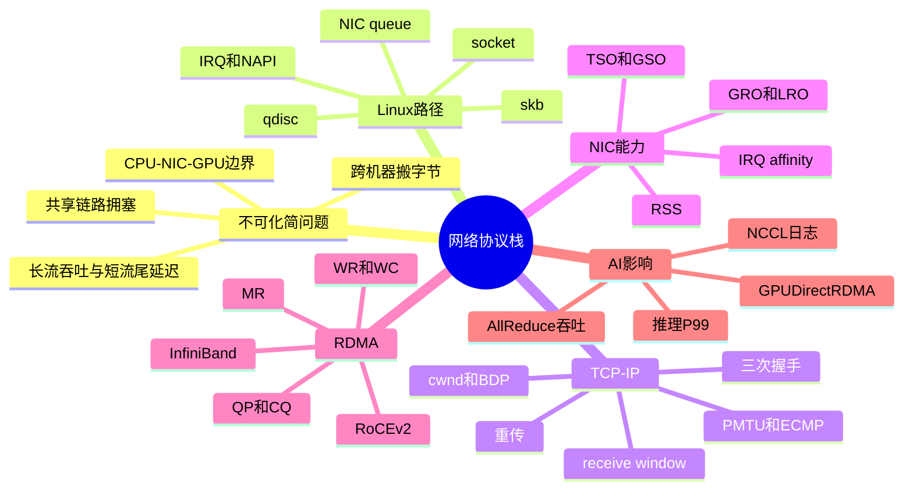
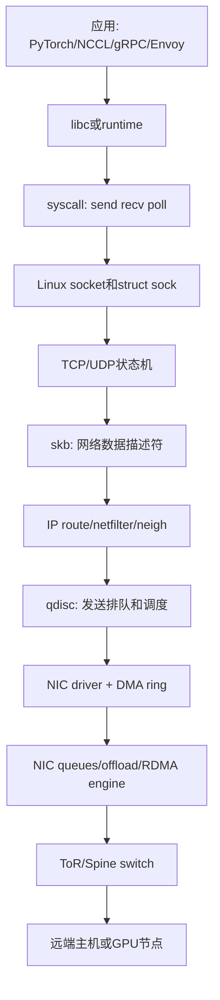
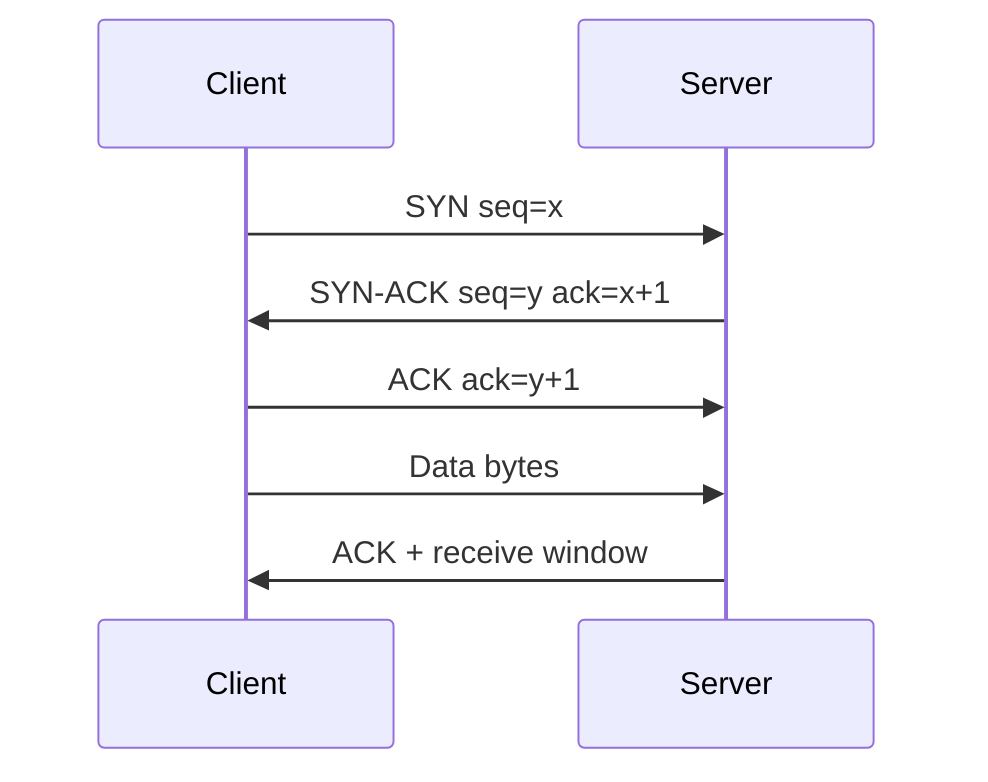
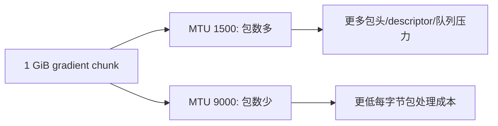
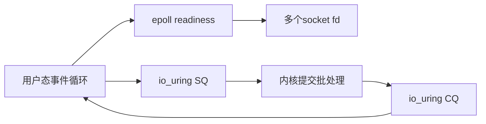
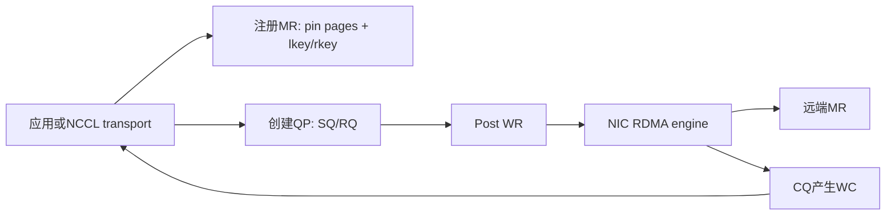
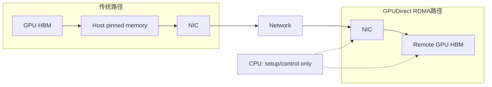
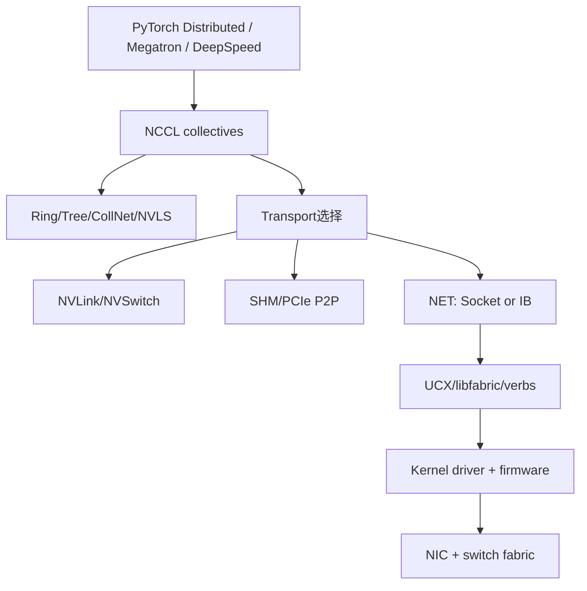

# 第 0d 章 网络协议栈基础

> **关联章节**：本章是 Part 0 的网络基础拆分篇。NUMA、PCIe、DMA 与 pinned memory 见 [0b3](0b3-numa-pcie-dma-and-pinned-memory.html)，文件系统与数据读取见 [0c](0c-filesystems-and-storage-internals.html)，训练并行与集合通信会在后续章节继续展开。

## 1. 第一性原理拆解 + 学习大纲

### 拆 — 不可化简的问题

AI 平台里的网络不是一个单一组件。控制面通常还在使用 TCP、HTTP、gRPC、Kubernetes API、对象存储 API；训练数据面才会在集群里尽量走 RDMA、NCCL、GPUDirect RDMA。工程师如果只记“RDMA 很快”或“MTU 要开 9000”，很容易在故障现场漏掉真正瓶颈：一次 AllReduce 慢，可能是 ECN 没开，也可能是网卡队列 RSS 打散不均、MTU 不一致、PCIe 拓扑绕远、TCP control plane 抖动导致 rank rendezvous 慢。

网络协议栈要解决的不可化简问题是：

**一台机器里的程序只会读写内存和文件描述符，但分布式训练和推理需要把远端进程、远端 NIC、远端 GPU 里的字节，按正确顺序、可控延迟和可恢复语义送到本地计算路径。**

把术语拿掉，只剩四个硬约束：

1. 链路是共享资源，任意两个发送者都可能在交换机出口相遇，必须有排队、丢弃、标记或退避。
2. CPU、DRAM、PCIe、NIC、GPU HBM 都有自己的数据移动边界，少一次拷贝就是少一次带宽竞争。
3. 训练通信不是偶尔发消息，而是在每个 step 周期性制造大流量，1% 的尾延迟会被 64、512、4096 张 GPU 放大。
4. 推理服务的请求通常不是最大吞吐问题，而是短流、连接池、队列、IRQ、TLS、调度和负载均衡共同塑造 P99。

从这个问题看，协议栈不是教科书里的七层名词表，而是一组在不同边界上付出代价、换取语义的机制。TCP 给字节流顺序、重传和拥塞控制，但它通常经过内核 socket 路径，适合 control plane、参数服务小消息、API 调用和跨机协调。IP 给寻址、路由、分片边界和子网隔离，但不保证交付。以太网和 NIC 负责把包变成帧和电/光信号，同时用 offload 把 CPU 做不动的分段、校验、聚合、散列下推到硬件。

RDMA 换了一个问题表述：如果两端进程已经预注册内存、预建队列、预授权访问，能不能让 NIC 直接搬运远端内存，绕过对端 CPU 和内核拷贝？GPUDirect RDMA 再进一步问：既然训练数据最终在 GPU HBM 里，能不能让 NIC 直接读写 GPU 显存，连 host memory staging 都省掉？

### 推 — 从这个问题如何推导出每个机制

先从最普通的发送开始：应用调用 `send()`，内核需要知道发给谁，所以需要 IP 地址、subnet、路由表和 ARP/ND；数据大于链路帧，就要按 MTU 切分，否则交换机无法转发；多个进程同时发包，内核必须提供 socket 抽象，让每条连接有缓冲区、状态机和错误语义。

连接跨越不可靠网络，于是 TCP 需要三次握手确认双方初始序列号，需要 receive window 保护接收端，需要 congestion window 保护共享网络，需要 CUBIC/BBR 这类拥塞控制算法在吞吐和排队之间做选择。训练任务里的长流 AllReduce 与服务里的短连接完全不同：长流关心稳定带宽、BDP、拥塞公平和重传；短流更容易被握手、慢启动、队列延迟、DNS、TLS、连接池和负载均衡支配。

当连接数和 QPS 上来，control plane 不能每个 socket 一个线程阻塞等待，于是出现 `epoll` 这样的 readiness notification；当系统调用和拷贝成本成为瓶颈，`io_uring` 把提交队列和完成队列搬到共享 ring，减少 syscall 往返。再往下，CPU 对每个包做 TCP segmentation、checksum、receive coalescing 会浪费核心，于是 NIC 提供 TSO/GSO、GRO/LRO、RSS、checksum offload、multi-queue、MSI-X 等机制。

Linux 收发包路径的关键对象也能由这个问题推出。应用看到 fd，内核用 `struct sock` 维护连接状态，用 skb 描述一段待处理网络数据，用 qdisc 做发送侧排队和调度，用 driver ring 把 skb 映射成 DMA descriptor，用 NIC queue 和 completion queue 让硬件执行。接收侧则反过来：NIC DMA 到内存，触发 MSI-X 或 NAPI poll，驱动生成 skb，协议栈解 IP/TCP，最后唤醒 socket wait queue 或 `epoll`。

训练数据面继续推导：大规模 AllReduce 每个 step 要搬 GB 级梯度，TCP 的可靠字节流语义、CPU 拷贝和内核路径常常太贵。RDMA verbs 把通信变成 QP、CQ、MR、WR、WC：应用把 work request 放进队列，NIC 执行 RDMA Write、Read、Send/Recv 或 atomic，完成后在 completion queue 产生 completion。RoCE v2 把 RDMA 封装在 UDP/IP 上，能跑在以太网和 L3 网络里，但依赖 PFC/ECN/DCQCN 等数据中心无损或近无损配置；InfiniBand 则是专用 fabric，拥塞和管理模型更完整，但生态、布线和运维体系不同。

NCCL 并不替代协议栈。它是在 GPU 集合通信层选择 ring、tree、CollNet、NVLS 等算法，再通过 socket、shared memory、NVLink、verbs、UCX/libfabric、driver、NIC 把字节送出去。排查 AllReduce 不能只问“网络通不通”，而要问：NCCL 选了什么 transport，GDRDMA 是否启用，RDMA fabric 是否有 ECN/PFC/MTU 问题，NIC 与 GPU 拓扑是否匹配，control plane 是否已经在启动和 rendezvous 阶段抖动。

### 绘 — 因果链路



### 导 — 读完本章你应该能回答

1. 为什么 control plane 继续使用 TCP，而训练 data plane 会尽量绕开传统内核网络路径？
2. OSI 七层模型与 Linux 实际收发包路径之间有什么差异？
3. `socket`、`struct sock`、skb、qdisc、NIC queue 分别处在什么位置？
4. TCP 三次握手、receive window、congestion window、BDP、重传分别解决什么问题？
5. 为什么 short flow 与 long flow 的优化方向不同？
6. 为什么 MTU 1500 与 jumbo frame 9000 会影响 AllReduce 的 CPU、NIC 和交换机开销？
7. PMTU discovery、jumbo frame、ECMP hashing 为什么会在 RoCE v2 和 NCCL 场景里变成故障点？
8. TSO/GSO/GRO/LRO/RSS/IRQ affinity 分别改变哪一段成本？
9. RoCE v2 与 InfiniBand 的运维风险为什么不同？
10. RDMA verbs 里的 QP、CQ、MR、WR、WC 如何对应一次真正的数据传输？
11. GPUDirect RDMA 与 0b3 的 NUMA、PCIe、DMA、pinned memory 边界如何衔接？
12. NCCL 日志里如何判断 socket fallback、NET/IB、GDRDMA、HCA、GID、算法和拓扑选择？

## 2. OSI 模型到 Linux 实际收发包路径

OSI 模型适合建立词汇表，但 Linux 排查更需要路径感。应用看到的是 socket fd；内核看到的是 `struct sock`、skb、qdisc、路由表、邻居表和网卡驱动；NIC 看到的是 DMA descriptor、queue、interrupt/MSI-X 和硬件 offload；交换机看到的是以太帧、VLAN、ECN、PFC、队列和 buffer。



工程边界：OSI 的“会话层、表示层”在 AI Infra 里通常被 TLS、HTTP/2、gRPC、protobuf、NCCL bootstrap 等库吸收；不要拿 OSI 层号判断性能责任。抓包看到 TCP retransmission，不代表应用层一定错；NCCL 报 timeout，也不代表 verbs 一定错，可能是路由、PFC、ECN、MTU、IRQ、CPU stalled 或某个 rank 没有及时进入 collective。

| 观察对象 | 真实系统对象 | 常见排查入口 |
| --- | --- | --- |
| 应用连接 | socket fd、RPC channel、NCCL communicator | `ss`、应用日志、NCCL debug |
| 内核协议栈 | TCP/UDP、skb、qdisc、route、neighbor | `ip route`、`ip neigh`、`tc`、`sar` |
| 网卡路径 | DMA ring、queue、IRQ、offload、RDMA engine | `ethtool -k`、`ethtool -S`、`/proc/interrupts` |
| 交换网络 | ToR/Spine、ECMP、PFC、ECN、buffer | 交换机 telemetry、端口 counter、队列丢弃与 ECN mark |
| GPU 通信 | NCCL transport、GDRDMA、PCIe/NVLink 拓扑 | `NCCL_DEBUG`、`nvidia-smi topo -m`、`nccl-tests` |

### 2.1 发送路径：`send()` 到 NIC 发包

一次 TCP 发送可以先按下面的简化路径理解：

```text
应用 send()
  -> syscall 进入内核
  -> socket send buffer
  -> TCP 拆分字节流、维护 seq/ack/cwnd/rwnd
  -> skb 承载待发送数据和协议元数据
  -> IP route 决定出口和下一跳
  -> neighbor/ARP/ND 找到二层地址
  -> netfilter/tc/qdisc 做过滤、整形、排队
  -> driver 把 skb 映射成 DMA descriptor
  -> NIC TX queue 执行 DMA 读 host memory
  -> TSO/checksum/VLAN 等硬件 offload
  -> 以太帧进入交换机
```

`socket send buffer` 不是无限队列。应用写得太快，内核可能返回 `EAGAIN` 或阻塞；TCP cwnd 太小、对端 receive window 太小、qdisc 或 NIC ring 满，都可能让数据停在不同层。排查发送慢时要先问“卡在哪里”：应用没写、socket buffer 满、TCP 等 ACK、qdisc 排队、NIC queue 堵、交换机拥塞，还是对端收不动。

常用观察：

```bash
ss -tinp dst <peer_ip>
ss -m -tinp | head
ip -s link show dev eth0
tc -s qdisc show dev eth0
ethtool -S eth0 | egrep 'tx|timeout|drop|discard|queue'
```

### 2.2 接收路径：NIC 到 `recv()`

接收路径的瓶颈经常被误判成“应用慢”。简化路径如下：

```text
NIC RX queue 收到帧
  -> DMA 写入 host memory receive buffer
  -> MSI-X interrupt 或 NAPI poll
  -> driver 生成 skb
  -> GRO/LRO 可能合并多个包
  -> IP 层检查地址、路由、netfilter
  -> TCP 按 seq 重组、ACK、更新 receive window
  -> 数据进入 socket receive queue
  -> 唤醒阻塞 recv 或 epoll readiness
  -> 应用 copy 或 zero-copy 风格读取
```

NAPI 的核心思想是：流量低时用中断及时唤醒，流量高时切到 poll，避免每个包一次中断。这个机制能保护 CPU，但也引入 `softirq` 和 budget。单个 RX queue 打满时，你可能看到一个 CPU 的 softirq 很高，其他核很空，应用 P99 却抖动。

常用观察：

```bash
cat /proc/softirqs | egrep 'NET_RX|NET_TX'
cat /proc/interrupts | egrep 'mlx|eth|ens|enp'
mpstat -P ALL 1
pidstat -w -p <pid> 1
ethtool -S eth0 | egrep 'rx|drop|miss|buffer|queue'
```

### 2.3 skb、qdisc、NIC queue 的责任边界

skb 是 Linux 网络栈的核心数据描述符。它不只是“包内容”，还带着 headroom、协议头位置、checksum 状态、GSO size、时间戳、mark、priority、dev 等元数据。offload 打开后，一个 skb 可能代表大于 MTU 的 TCP 数据段，真正分段发生在 GSO 或 NIC TSO 阶段。这就是为什么 `tcpdump` 或内核观测看到“大包”时，不能直接得出线上二层帧大于 MTU 的结论。

qdisc 是发送侧排队与调度层。默认 `fq_codel`、`fq`、`pfifo_fast` 或云厂商定制策略会影响短流尾延迟和长流公平性。对普通 TCP 服务，qdisc 可以做 pacing、fair queue、bufferbloat 抑制；对 RDMA data plane，RoCE 流量可能绕过一部分传统 TCP 语义，但仍会经过 NIC、priority、traffic class、交换机队列和 buffer。

NIC queue 是硬件并行度的入口。现代 NIC 有多个 TX/RX queue，每个 queue 通常对应一个 MSI-X interrupt vector，可绑定到不同 CPU。RSS 决定一个五元组落到哪个 RX queue；XPS/RPS/RFS、IRQ affinity、NUMA 共同决定包由哪个 CPU 处理。推理网关 P99 被网络队列拖慢时，根因常常不是“带宽不够”，而是单个 queue、单个 IRQ、单个 CPU 被打满。

### 2.4 最小路径检查

下面这组命令用于快速建立“接口、路由、队列、IRQ、offload”的初始画像：

```bash
ip -br addr
ip route
ip neigh show nud reachable
ip -d link show dev eth0
tc -s qdisc show dev eth0
ethtool -l eth0
ethtool -k eth0
ethtool -S eth0 | head -80
cat /proc/interrupts | egrep 'eth0|mlx|ens|enp'
```

判断方向：

- `ip route get <peer>` 与预期出口不一致：先查路由、policy routing、VRF、容器网络。
- `tc -s qdisc` backlog 长期增长：发送侧排队已经在本机出现。
- 单个 RX queue counter 远高于其他队列：RSS 分布或流量模式可能不均。
- 单个 IRQ CPU 飙高：检查 IRQ affinity、irqbalance、NUMA 亲和。
- offload 状态与预期不一致：抓包、CPU 使用率和 MTU 判断都可能被误导。

## 3. TCP：握手、窗口、cwnd、BDP、重传

TCP 提供可靠有序字节流。它的代价是状态机、ACK、重传、拥塞控制和缓冲区。AI Infra 里 TCP 依然很重要：Kubernetes API、scheduler、对象存储、模型 registry、推理网关、NCCL bootstrap、日志和监控都可能走 TCP。训练梯度数据不一定走 TCP，但 TCP control plane 抖动也会拖慢整体任务启动、rank rendezvous 和异常恢复。



### 3.1 三次握手解决什么问题

三次握手不是仪式，而是最小状态确认：

| 步骤 | 双方学到什么 | 如果缺失会怎样 |
| --- | --- | --- |
| SYN | 客户端选择初始序列号，声明想建立连接 | 服务端不知道客户端新连接意图 |
| SYN-ACK | 服务端确认客户端 SYN，并给出自己的初始序列号 | 客户端不知道服务端是否可达 |
| ACK | 客户端确认服务端初始序列号 | 服务端无法确认双向路径可用 |

它还避免旧连接残留包污染新连接。TCP 序列号空间、TIME_WAIT、MSL 等机制共同降低“旧包被新连接误收”的概率。短连接很多的推理场景里，握手、TLS、连接池命中率、TIME_WAIT 和 SYN backlog 都可能影响 P99。

观察握手与连接状态：

```bash
ss -s
ss -tan state syn-sent
ss -tan state time-wait | wc -l
netstat -s | egrep 'listen|SYN|reset|retrans'
sar -n TCP,ETCP 1
```

### 3.2 receive window 与 congestion window

TCP 有两类窗口，不能混用：

| 窗口 | 保护对象 | 谁发布或维护 | 典型症状 |
| --- | --- | --- | --- |
| receive window, rwnd | 接收端 socket buffer 和应用消费能力 | 接收端在 ACK 中通告 | 对端 `ss` 看到窗口小，应用读慢 |
| congestion window, cwnd | 共享网络路径 | 发送端拥塞控制维护 | RTT 上升、重传、吞吐上不去 |

发送端实际可在途数据通常受 `min(rwnd, cwnd)` 限制。接收应用慢、GC 暂停、单线程反序列化慢，会让 rwnd 变小；交换机拥塞、丢包、ECN、队列堆积，会让 cwnd 或 pacing 限制吞吐。

观察 TCP 内部状态：

```bash
ss -tin dst <peer_ip>
ss -i '( sport = :443 or dport = :443 )'
cat /proc/sys/net/ipv4/tcp_congestion_control
sysctl net.ipv4.tcp_rmem net.ipv4.tcp_wmem
```

`ss -tin` 里的 `cwnd`、`rtt`、`rto`、`retrans`、`bytes_acked`、`delivery_rate` 等字段可以把“网络慢”拆成更具体的问题。不要只看平均吞吐。

### 3.3 BDP：带宽时延积决定需要多少在途数据

BDP 是 bandwidth-delay product，表示把链路填满需要多少在途数据：

```text
BDP = bottleneck_bandwidth * RTT
```

例子：100 Gb/s 链路，RTT 100 us。

```text
100 Gb/s = 12.5 GB/s
BDP = 12.5 GB/s * 100 us = 1.25 MB
```

如果 cwnd 或 socket buffer 小于 BDP，发送端无法填满链路；如果 inflight 远大于 BDP，多余数据只能在队列里排队，增加延迟。数据中心内 RTT 很小，但 100G/200G/400G 链路很宽，BDP 仍然足够让小 buffer、慢启动、pacing、ACK 延迟影响短时吞吐。

长距离对象存储、跨 AZ 数据同步、checkpoint 上传到远端存储时，BDP 更大。此时单连接吞吐上不去，不一定是对象存储慢，也可能是 TCP buffer、拥塞控制、代理、LB 或路径 RTT 共同限制。

### 3.4 重传：信号、代价和误判

TCP 重传说明发送方认为数据没有被及时确认。原因可能是实际丢包、乱序、ACK 丢失、RTO 太短、接收端 CPU 卡顿、虚拟化 pause、交换机队列过长。重传本身会占用链路，并触发拥塞控制降低 cwnd，所以少量丢包在高带宽长流里也会造成明显吞吐下降。

观察重传：

```bash
sar -n TCP,ETCP 1
nstat -az | egrep 'TcpRetransSegs|TcpTimeouts|TcpExtTCPLostRetransmit'
ss -tinp | egrep 'retrans|rto|rtt|cwnd'
tcpdump -i eth0 -nn host <peer_ip> and tcp
```

排查时要把 TCP 重传和 RoCE 重传分清。TCP 重传能从 `ss`、`sar`、`tcpdump` 看到；RoCE RC 的 packet loss、timeout、retry、CQE syndrome 需要看 RDMA/NIC/fabric counter 和 verbs 错误，普通 TCP 工具可能看不到关键数据面。

### 3.5 short flow 与 long flow

短流的主要成本常在启动阶段：

- DNS、LB、NAT、TLS、连接池；
- 三次握手和慢启动；
- server accept queue、worker queue、epoll loop；
- IRQ、softirq、应用线程调度；
- 请求排队造成 P99 放大。

长流的主要成本常在稳态：

- BDP 与 socket buffer；
- cwnd、pacing、拥塞控制公平性；
- MTU、offload、包处理成本；
- ECMP 分布、交换机队列、buffer；
- 重传率、丢包、ECN mark。

推理网关通常是短流和中等长度流混合；dataset 拉取、checkpoint、参数同步更像长流；AllReduce 是周期性同步长流，且每个 rank 的尾延迟会拖住所有 rank。

## 4. IP 路由、subnet、MTU、PMTU、ECMP

IP 层决定包往哪里走。单机看 `ip addr`、`ip route`、`ip neigh`；集群看 subnet 规划、ECMP、BGP/静态路由、VLAN/VXLAN、ToR 到 spine 的 oversubscription。训练网络常希望 GPU 节点的 RDMA NIC 在专用 subnet，避免与管理流量、存储流量混在同一个拥塞域。

### 4.1 subnet 与路由：先确认出口

一台训练节点可能同时有管理网、存储网、训练网、容器网、BMC 网。一个 IP 选错出口，NCCL 或 RPC 仍然“能通”，但路径会绕远，MTU 不一致，或者落到低带宽网卡。

```bash
ip -br addr
ip route
ip route get <peer_ip>
ip rule
ip neigh show dev eth0
```

判断方向：

- `ip route get` 显示出口不是训练网卡：检查路由优先级、policy routing、容器 CNI。
- `ip neigh` 大量 `FAILED` 或 `STALE`：检查二层连通、ARP/ND、网关。
- 同一作业不同 rank 走不同 subnet：检查 hostfile、NCCL socket interface、Kubernetes 多网卡注入。

### 4.2 MTU 与 jumbo frame

MTU 是单个二层帧可承载的最大 payload。以太网常见 MTU 1500，jumbo frame 常设 9000。对 1 GiB 梯度块，粗略估算：

```text
1 GiB / 1460 bytes 约 735k 个 TCP payload 包
1 GiB / 8960 bytes 约 120k 个 jumbo payload 包
```

包数少意味着更少的 header、descriptor、队列操作、中断、交换机查表和 per-packet buffer 管理。对 RoCE v2，MTU 一致性更敏感：任一路径 MTU 不一致都可能导致吞吐下降、retry、timeout 或连接异常。



端到端验证：

```bash
ip -d link show dev eth0
ping -M do -s 1472 <peer_ip>
ping -M do -s 8972 <peer_ip>
tracepath <peer_ip>
```

`ping -M do -s 8972` 适用于 IPv4 9000 MTU 的常见快速检查：8972 bytes payload + 20 bytes IP header + 8 bytes ICMP header = 9000。实际网络有 VLAN、VXLAN、Geneve、IPsec 时，要把封装开销算进去。

### 4.3 PMTU discovery 的失败方式

Path MTU discovery 依赖中间设备返回 ICMP Fragmentation Needed。现实里 ICMP 可能被安全策略丢弃，导致发送端以为大包可达，实际黑洞。TCP 有 MSS clamping 等缓解；RoCE v2 和 UDP 类路径更需要端到端配置一致。

典型问题：

- 主机 MTU 9000，交换机某段端口 1500；
- overlay 封装后有效 MTU 下降；
- ICMP 被防火墙拦截，PMTU 黑洞；
- 多路径 ECMP 中只有部分路径 MTU 错；
- bond/VLAN/bridge 的 MTU 与物理口不一致。

排查建议：

```bash
tracepath <peer_ip>
ping -M do -s 8972 <peer_ip>
ip link show type vlan
ip link show type bond
bridge link show
```

### 4.4 ECMP：五元组散列与流量不均

ECMP 用 hash 把不同 flow 分到多条等价路径。对 TCP/UDP，一般散列五元组；对 RoCE v2，UDP 源端口常用于提供熵。问题在于，AllReduce 的流量模式可能不是很多均匀小流，而是少数巨大长流；如果 hash 结果集中到某条 spine link，局部拥塞会让整体 step 变慢。

观察方向：

- 交换机端口利用率是否不均；
- 同一 job 不同 pair 的 RTT/带宽是否差异大；
- RoCE UDP source port entropy 是否启用；
- NCCL rail 和 HCA 是否按预期使用；
- flowlet/load balancing 策略是否对长流友好。

主机侧能做的有限，但可以先确认 flow、接口和 HCA 选择：

```bash
NCCL_DEBUG=INFO NCCL_DEBUG_SUBSYS=INIT,NET,GRAPH <train_cmd>
grep -E 'NET/IB|NET/Socket|Using network|HCA|GID' nccl.log
ss -u -a -n | head
```

## 5. socket、epoll、io_uring：control plane 的网络 IO

`socket` 是 Linux 给应用的网络端点抽象。阻塞 socket 简单但扩展性差；一个推理网关要同时管理 10000 条连接时，thread-per-connection 会把内存、上下文切换和调度开销放大。`epoll` 把“哪些 fd 可读写”的通知集中起来，适合 control plane 的高并发 RPC、日志 agent、metadata 服务。`io_uring` 用 submission queue 和 completion queue 降低 syscall 和上下文切换成本，对高 QPS 网络和存储 IO 都有价值。



| 模型 | 适合场景 | 主要成本 | AI Infra 判断 |
| --- | --- | --- | --- |
| 阻塞 socket | 低并发工具、简单脚本、一次性控制命令 | 线程等待、上下文切换 | 不适合高并发推理网关 |
| `epoll` | 大量连接、每连接低吞吐、事件驱动服务 | 应用状态机复杂度 | control plane 常用基线 |
| `io_uring` | 高 QPS 网络与存储 IO、批量提交完成 | 内核/驱动/框架支持差异 | 收益需要压测验证 |

工程边界：这些机制主要优化 control plane 或普通 TCP/UDP IO，不会自动让 NCCL AllReduce 变快。对于 Python 服务，GIL、序列化、TLS、业务逻辑常比 syscall 更早成为瓶颈。对 C++/Rust/Go 网关，epoll loop、线程池、accept queue、socket buffer、IRQ affinity 和 NIC queue 更常成为 P99 的共同根因。

常用观察：

```bash
ss -ltnp
ss -s
cat /proc/net/sockstat
pidstat -t -p <pid> 1
perf top -p <pid>
strace -f -e trace=epoll_wait,io_uring_enter,accept4,recvfrom,sendto -p <pid>
```

## 6. 网卡 offload、multi-queue、RSS、IRQ affinity

网卡 offload 的目标是把每包重复工作从 CPU 移走。它能降低 CPU 开销，也会改变观测方式。抓包、skb size、CPU profile 和链路 MTU 之间经常因为 offload 而看起来互相矛盾。

| 机制 | 方向 | 省掉的成本 | 注意点 |
| --- | --- | --- | --- |
| checksum offload | 收发 | IP/TCP/UDP checksum CPU 成本 | 抓包可能显示 checksum incorrect，这是本机抓包视角 |
| TSO | 发送 | NIC 做 TCP segmentation | `tcpdump` 可能看到大 skb |
| GSO | 发送 | Linux 延后分段，减少协议栈处理次数 | 最终仍需按 MTU 发帧 |
| GRO | 接收 | Linux 合并多个包给上层 | 降 CPU，但隐藏真实包粒度 |
| LRO | 接收 | NIC 更激进合并包 | 可能影响转发、精确测量和某些协议 |
| RSS | 接收 | 多 RX queue 分散流 | hash、队列数、IRQ affinity 要匹配 |
| RPS/RFS | 接收 | 软件层分发包到 CPU | 可能增加跨 CPU cache traffic |
| XPS | 发送 | 按 CPU 选择 TX queue | 降低发送侧锁竞争与跨 NUMA |

### 6.1 TSO/GSO/GRO/LRO 与抓包误判

如果 TSO/GSO 打开，应用写 64 KiB，内核可能保留一个大 skb，最后由 NIC 按 MTU 分成多个帧。你在发送端本机抓包可能看到大于 MTU 的“包”，这不是交换机真的收到了超大帧。要验证线上 MTU，仍然要用 `ip link`、`ping -M do`、交换机端口 counter 或在对端/镜像口抓包。

```bash
ethtool -k eth0
tcpdump -i eth0 -nn -s 128 host <peer_ip>
```

排查时可以临时关闭某些 offload 做对比，但不要把它当成长期优化结论：

```bash
ethtool -K eth0 tso off gso off gro off
ethtool -K eth0 tso on gso on gro on
```

### 6.2 RSS 与 IRQ affinity

RSS 根据 hash 把流分到 RX queue。每个 RX queue 通常对应一个 MSI-X vector，进而绑定到某个 CPU。高并发推理网关的常见问题是：连接四元组或五元组熵不足，流量集中到少数 queue；或者 IRQ 被绑到远离应用线程和 NIC NUMA 的 CPU，造成 cache miss 和跨 socket 内存访问。

观察：

```bash
ethtool -l eth0
ethtool -x eth0
ethtool -S eth0 | egrep 'rx_queue|tx_queue|rx-[0-9]|tx-[0-9]'
cat /proc/interrupts | egrep 'eth0|mlx|ens|enp'
for f in /proc/irq/*/smp_affinity_list; do echo "$f $(cat $f 2>/dev/null)"; done | head
lscpu | egrep 'NUMA|CPU\\(s\\)'
numactl -H
```

处理方向：

- 增加或确认 combined queue 数；
- 确认 RSS indirection table 均匀；
- 把 NIC IRQ 绑到同 NUMA 的 CPU；
- 把应用 worker 绑到相同 NUMA；
- 避免所有连接经同一个 LB source port 或 NAT pattern；
- 对 DPDK/XDP 类路径，按框架自己的 queue pinning 规则处理。

### 6.3 offload 的工程边界

offload 不是越多越好。它省 CPU，但可能隐藏真实包大小、破坏精确测量、造成单队列热点，或者与虚拟化、overlay、转发场景冲突。训练节点要把 NIC 与 GPU 是否在同一 NUMA/PCIe root complex 一起看；否则 offload 省下的 CPU 可能被跨 NUMA 内存访问、PCIe 绕路或 IOMMU 映射成本吃掉。

## 7. RDMA verbs：MR、QP、CQ、WR、WC

RDMA 的核心是把“远端通信”变成“NIC 执行内存操作”。应用先注册 memory region，得到 lkey/rkey；创建 queue pair（QP），里面有 send queue 和 receive queue；提交 work request（WR），NIC 执行 RDMA Write、RDMA Read、Send/Recv 或 atomic；完成后在 completion queue（CQ）产生 work completion（WC）。



### 7.1 verbs 对象表

| 对象 | 含义 | 常见问题 |
| --- | --- | --- |
| PD, protection domain | 隔离一组 QP/MR/AH 的权限域 | 错误复用会导致权限或资源管理混乱 |
| MR, memory region | 注册并 pin 住的一段内存 | 注册太频繁、cache miss、IOMMU 压力 |
| lkey/rkey | 本地和远端访问 key | key 错误会触发 protection error |
| QP, queue pair | send queue + receive queue | 状态机错误、retry exceeded、资源耗尽 |
| CQ, completion queue | 完成事件队列 | poll 不及时会溢出或增加延迟 |
| WR, work request | 应用提交给 NIC 的工作 | opcode、SGE、长度、signaled 策略错误 |
| WC, work completion | NIC 完成后的结果 | status/syndrome 是排查入口 |
| AH, address handle | UD 等模式的寻址信息 | GID/LID/SL/traffic class 配错 |

可靠连接 RC 模式常用于训练通信。它提供有序、可靠、面向连接的 RDMA 语义，但“可靠”不是无代价：packet loss、PFC storm、ECN 配置错误、路径 MTU 不一致，都可能体现为 retry、timeout、QP error 或 NCCL hang。

### 7.2 RDMA Write 生命周期

一次 RDMA Write 可以拆成：

1. 远端注册 MR，并把地址、rkey、长度通过控制面告诉本端。
2. 本端注册本地 MR，得到 lkey。
3. 两端创建 QP，交换 QP number、PSN、GID/LID、MTU、SL/traffic class 等连接信息。
4. 本端 post RDMA Write WR，WR 中包含本地 SGE、远端地址、rkey、长度。
5. NIC 从本地内存 DMA 读取数据，封装成 RDMA packet 发出。
6. 远端 NIC 验证 rkey 和地址范围，把数据 DMA 写入远端 MR。
7. 本端 CQ 出现 WC；如果请求 signaled，应用 poll CQ 得到成功或错误。
8. 如果发生丢包或拥塞，RC 进行 retry；超过阈值后 QP 进入 error。

注意：RDMA Write 不需要远端 CPU 在数据到达时执行 `recv()`，但远端必须提前完成内存注册和权限交换。控制面仍然重要。

### 7.3 memory registration cache

注册 MR 需要 pin page、建立 DMA/IOMMU 映射、更新 NIC 侧 memory translation cache。频繁注册小 buffer 会非常慢。通信库和高性能 serving runtime 常用 registration cache：把已注册的内存范围缓存起来，后续复用，减少注册开销。

风险：

- cache 太小：频繁 miss，性能抖动；
- cache 太大：pinned memory 过多，影响系统内存回收；
- buffer 生命周期管理错误：use-after-free 或权限错误；
- GPU memory 注册依赖 driver 和 peer memory 模块，失败后可能 fallback。

观察方向：

```bash
ibv_devinfo
rdma link
rdma resource show
cat /sys/class/infiniband/mlx5_0/ports/1/state
ulimit -l
dmesg | egrep -i 'mlx|rdma|peer|iommu|odp'
```

## 8. RoCE v2 vs InfiniBand，PFC/ECN/DCQCN 与 lossless 风险

RoCE v2 和 InfiniBand 都能承载 RDMA，但它们的失败模式不同。

| 项 | RoCE v2 | InfiniBand |
| --- | --- | --- |
| 承载 | UDP/IP over Ethernet | IB 专用链路与子网管理 |
| 路由 | 可 L3 路由，适配以太网数据中心 | IB fabric，常用 subnet manager |
| 拥塞 | 依赖 PFC/ECN/DCQCN 配置 | 原生 IB 拥塞与信用机制更完整 |
| QoS | VLAN PCP、DSCP、traffic class、priority queue | SL、VL、partition 等 IB 体系 |
| 成本与生态 | 可复用以太网交换机，但配置复杂 | 性能稳定，专用设备和运维体系 |
| 常见风险 | PFC storm、ECN 阈值、MTU 不一致、lossless 域扩大 | SM、LID、分区、专用运维门槛 |

### 8.1 为什么 RoCE v2 需要近无损网络

传统 TCP 可以把丢包当成拥塞信号并重传。RDMA RC 也有可靠性和 retry，但它期待低丢包、低乱序、低尾延迟的 fabric。RoCE v2 跑在以太网上，如果交换机像普通 IP 网络一样随意丢包，QP retry、timeout 和 CQE error 会严重拖慢训练，甚至让 NCCL collective 卡死。

RoCE 常见组合：

- PFC：按 priority 暂停发送，避免 lossless queue 丢包；
- ECN：在队列变长但未丢包前给包打拥塞标记；
- DCQCN：端主机根据 ECN/CNP 调整发送速率；
- QoS mapping：把 RoCE 流量映射到专用 priority/traffic class；
- buffer threshold：为 RoCE queue 设置合适 headroom 和 ECN/PFC 阈值。

### 8.2 PFC 的风险

PFC 能避免丢包，但不是免费午餐。它会把拥塞向上游传播。如果配置错误，某个热点队列可能触发 pause storm，导致无关流量被阻塞，甚至形成 head-of-line blocking。全局 pause 更危险，会把普通 TCP、存储、管理流量一起停住。

判断方向：

```bash
ethtool -S eth0 | egrep 'pause|prio|pfc|rx_prio|tx_prio|discard|ecn'
mlnx_qos -i eth0
dcbtool gc eth0 pfc
```

交换机侧要看：

- PFC pause frames per priority；
- ECN marked packets；
- queue occupancy；
- WRED/ECN threshold；
- port discard/drop；
- buffer headroom；
- RoCE priority 是否与 DSCP/PCP 映射一致。

### 8.3 ECN 与 DCQCN

ECN 的目标是在丢包前提供拥塞信号。交换机队列超过阈值后给包打 CE mark，接收端生成 CNP，发送端 DCQCN 降速。阈值太高，拥塞已经变成 PFC 或丢包；阈值太低，发送端过早降速，吞吐上不去。训练集群需要用真实 collective 或接近真实的 incast/all-to-all 模式调阈值，而不是只用单流 `ib_write_bw`。

常见错误：

- ECN 在交换机打开，但主机 RoCE traffic class 没映射到对应队列；
- PFC 打开了所有 priority，造成无关流量被暂停；
- ECN mark 为 0，PFC pause 却持续增长；
- CNP counter 增长但吞吐仍差，说明降速过度或热点路径未解决；
- 不同 ToR 配置漂移，新节点入池后才暴露。

## 9. GPUDirect RDMA 与 0b3 边界

没有 GPUDirect RDMA 时，GPU 数据跨机发送常需要：

```text
GPU HBM
  -> host pinned memory
  -> NIC
  -> network
  -> remote NIC
  -> remote host pinned memory
  -> remote GPU HBM
```

GPUDirect RDMA 允许 NIC 直接 DMA 读写 GPU memory，CPU 主要负责建立映射、注册内存、提交 work request，不在数据路径上搬字节。



这与 0b3 的边界是：0b3 解释 NUMA、PCIe、DMA、pinned memory、IOMMU、GPU/NIC 拓扑；本章只关心这些机制进入网络数据路径后如何影响 RDMA/NCCL。GPUDirect RDMA 不等于“CPU 完全无关”。CPU 仍负责页表、映射、QP 建立、进程调度、错误处理和 control plane。

依赖项：

| 依赖项 | 为什么重要 | 常用验证 |
| --- | --- | --- |
| GPU/NIC/driver/CUDA | 决定是否支持 peer memory 和 DMA 映射 | `nvidia-smi`、driver/CUDA 版本 |
| `nvidia-peermem` | 让 NIC 能访问 GPU memory 映射 | `lsmod | grep nvidia_peermem` |
| PCIe topology | 跨 socket 或绕远会吞掉理论收益 | `nvidia-smi topo -m`、`lspci -tv` |
| IOMMU/ACS | 可能改变 peer-to-peer 路径 | kernel cmdline、BIOS、`dmesg` |
| NCCL transport | 确认没有 fallback 到 socket | `NCCL_DEBUG=INFO` 查 `NET/IB` 与 `GDRDMA` |

最小检查：

```bash
nvidia-smi topo -m
lspci -tv
lsmod | grep nvidia_peermem
dmesg | egrep -i 'nvidia_peermem|peer|mlx|iommu|acs'
NCCL_DEBUG=INFO NCCL_DEBUG_SUBSYS=INIT,NET <train_cmd> 2>&1 | tee nccl.log
grep -E 'NET/IB|NET/Socket|GDRDMA|GDR|P2P' nccl.log
```

## 10. NCCL transport、环境变量与日志解读

集合通信库负责把 AllReduce、Broadcast、AllGather、ReduceScatter 这类 collective 拆成拓扑感知的数据流。NCCL 会选择 ring、tree、CollNet、NVLS 等算法，决定 GPU 之间如何分块、流水、同步。底层 transport 可以是 NVLink/NVSwitch、PCIe P2P、shared memory、socket、IB/RoCE。libfabric、UCX 或 verbs 提供更接近硬件的通信抽象；driver 与 NIC firmware 最终把 WR 变成 DMA 和网络包。



### 10.1 常用环境变量

| 变量 | 用途 | 排查含义 |
| --- | --- | --- |
| `NCCL_DEBUG=INFO` | 打开基础日志 | 必开 |
| `NCCL_DEBUG_SUBSYS=INIT,NET,GRAPH,COLL` | 选择子系统 | 看初始化、网络、拓扑、collective |
| `NCCL_SOCKET_IFNAME=eth0` | 限制 TCP socket interface | 避免 bootstrap 走错网卡 |
| `NCCL_IB_HCA=mlx5_0,mlx5_1` | 限制 HCA | 避免使用错误 NIC |
| `NCCL_IB_GID_INDEX=3` | 指定 RoCE GID index | RoCE v2 常见故障点 |
| `NCCL_IB_TC` | 设置 traffic class | 影响 DSCP/QoS/ECN 映射 |
| `NCCL_IB_SL` | IB service level | IB fabric QoS |
| `NCCL_NET_GDR_LEVEL` | 控制 GDRDMA 使用级别 | 验证 GPUDirect RDMA |
| `NCCL_ALGO=Ring,Tree` | 限制算法 | 做 A/B 排查 |
| `NCCL_PROTO=Simple,LL,LL128` | 限制协议 | 看消息大小敏感性 |
| `NCCL_TOPO_FILE` | 指定拓扑文件 | 修正或复现实验拓扑 |

示例：

```bash
export NCCL_DEBUG=INFO
export NCCL_DEBUG_SUBSYS=INIT,NET,GRAPH
export NCCL_SOCKET_IFNAME=eth0
export NCCL_IB_HCA=mlx5_0,mlx5_1
export NCCL_IB_GID_INDEX=3
export NCCL_NET_GDR_LEVEL=2
/opt/nccl-tests/build/all_reduce_perf -b 8M -e 8G -f 2 -g 8 2>&1 | tee nccl.log
```

### 10.2 日志关键词怎么读

| 日志关键词 | 含义 | 判断 |
| --- | --- | --- |
| `NET/Socket` | 使用 TCP socket transport | 对跨节点训练数据面通常是 fallback 或非 RDMA 环境 |
| `NET/IB` | 使用 IB verbs transport | RoCE/IB 快路径入口 |
| `GDRDMA`、`GDR` | GPUDirect RDMA 相关 | 需要结合 topo 和性能确认 |
| `mlx5_0`、`mlx5_1` | 选中的 HCA | 检查是否覆盖所有 rail |
| `GID` | RoCE GID index/address | GID 错会导致连接或 QoS 问题 |
| `Ring`、`Tree` | collective 算法 | 不同消息大小性能不同 |
| `P2P`、`SHM` | 节点内 GPU transport | 单机正常、跨机慢时用于切边界 |
| `timeout`、`unhandled system error` | 通信错误 | 继续看 verbs/NIC/fabric counter |

排查顺序：

1. 先确认 NCCL 是否启动成功，所有 rank 是否进入 communicator。
2. 看跨节点 transport 是 `NET/IB` 还是 `NET/Socket`。
3. 看 HCA、GID、GDRDMA 是否符合预期。
4. 用 `nccl-tests` 去掉模型计算因素。
5. 分别测单机、多机、单 rail、多 rail、不同 message size。
6. 对照 NIC/交换机 counter，看 ECN、PFC、drop、retry、timeout。

## 11. Worked example：AllReduce 慢，ECN 关闭 + MTU 1500

背景：一个 8 节点训练池，每节点 8 张 H100、8 张 400GbE RoCE v2 NIC，理论上单 rail 单向带宽约 50 GB/s。团队跑 64-GPU LLaMA 预训练，模型计算段稳定，但每个 step 从 1.8 s 变成 3.4 s。`nvidia-smi dmon` 看到 GPU SM 利用率在 backward 后掉到 20%-35%，NCCL 日志里 AllReduce 阶段耗时接近翻倍。单机 8-GPU benchmark 正常，所以怀疑跨节点网络。

### 11.1 先确认不是 socket fallback

```bash
export NCCL_DEBUG=INFO
export NCCL_DEBUG_SUBSYS=INIT,NET,GRAPH
torchrun --nnodes=8 --nproc_per_node=8 train.py 2>&1 | tee nccl.log
grep -E "NET/IB|NET/Socket|GDRDMA|GID|HCA" nccl.log
```

日志显示 `NET/IB`、`GDRDMA` 均启用，HCA 覆盖预期 rail，说明没有退回 TCP socket。

### 11.2 把模型因素拿掉

```bash
/opt/nccl-tests/build/all_reduce_perf -b 64M -e 8G -f 2 -g 8
ib_write_bw -d mlx5_0 -x 3 <peer_ip>
ib_write_lat -d mlx5_0 -x 3 <peer_ip>
```

结果：

| 测试 | 结果 | 解读 |
| --- | --- | --- |
| 单机 8 GPU | bus bandwidth 正常 | 节点内 NVLink/PCIe/P2P 不是主因 |
| 跨 8 节点 NCCL | 只有预期一半 | 问题在跨节点路径 |
| 单连接 `ib_write_bw` | 偶尔能冲高 | 链路不一定硬坏 |
| 多连接/大消息 | P99 抖动明显 | fabric 拥塞或队列策略可疑 |

### 11.3 查 MTU、ECN、PFC

```bash
ip -d link show ens5f0
ping -M do -s 8972 10.20.3.17
ethtool -S ens5f0 | egrep "ecn|pause|discard|timeout|rx_prio|tx_prio|pfc|cnp"
```

关键线索：

- `ip link` 显示 MTU 1500；
- `ping -M do -s 8972` 返回 `Message too long` 或无响应；
- 交换机 telemetry 显示 RoCE lossless 队列 ECN mark 为 0；
- PFC pause 帧在拥塞时上升；
- NIC 侧 timeout/retry 相关 counter 在慢 step 后增长。

也就是说，训练流量以 1500 MTU 产生大量小包，交换机出口队列更容易堆积；同时 ECN 没启用，DCQCN 收不到早期拥塞信号，只能等到 PFC 或 retry/timeout 后才退让。RoCE v2 对这种配置很敏感，表面看链路 up，实际有效吞吐被队列抖动和重试拖垮。

### 11.4 排除其他候选根因

| 候选根因 | 证据 | 结论 |
| --- | --- | --- |
| PCIe 拓扑问题 | 单机与单 NIC peer-to-peer 未明显变慢 | 暂不支持 |
| NCCL 算法选错 | 日志 ring/tree 拓扑正常，不同消息大小主要跨节点变差 | 不是主因 |
| socket fallback | 日志出现 `NET/IB` 与 `GDRDMA` | 排除 |
| 单根光模块故障 | 单连接偶尔能冲高，慢与拥塞周期相关 | 不是主要解释 |
| fabric 配置问题 | 跨节点慢、多流更慢、PFC pause 上升、ECN mark 为 0、MTU 1500 | 主因 |

### 11.5 修复和复测

节点侧把训练网卡、VLAN、bond 全部设为 MTU 9000，并持久化到 NetworkManager 或 netplan；交换机侧为 RoCE priority 开 ECN/WRED，设置合适 threshold，并确认 PFC 只对 RoCE lossless priority 生效。

```bash
ip link set ens5f0 mtu 9000
ping -M do -s 8972 10.20.3.17
for h in node{01..08}; do ssh $h "ip -br link | grep ens5f0"; done
NCCL_DEBUG=INFO /opt/nccl-tests/build/all_reduce_perf -b 64M -e 8G -f 2 -g 8
```

复测结果：

- 8G message 下 bus bandwidth 从约 145 GB/s 升到 285 GB/s；
- step time 从 3.4 s 回到 1.9 s；
- 交换机 ECN mark 开始随拥塞出现；
- PFC pause 降到低频；
- `ethtool -S` 中 retry、timeout、discard 不再持续增长。

沉淀为 pre-flight：新节点入池前必须检查 MTU 端到端、RoCE GID index、PFC/ECN priority、NCCL `NET/IB` 与 `GDRDMA` 日志、`nccl-tests` 基线。训练网络的问题不能只靠“链路 up”验收，必须用接近真实 collective 的负载验收。

## 12. Worked example：推理网关 P99，网络队列 + IRQ 热点

背景：一个 LLM 推理集群前面有 C++ 网关，负责 HTTP/2/gRPC 入口、鉴权、路由、流式 token 返回。平均 QPS 还没到容量上限，CPU 总使用率 45%，NIC 带宽不到 15Gb/s，但线上 P99 从 70 ms 抖到 240 ms。模型后端 GPU 指标正常，KV cache 命中率稳定，只有网关所在节点的 `softirq` 偶尔尖刺。

### 12.1 先确认不是后端模型慢

把请求路径拆开：

| 指标 | 现象 | 初步判断 |
| --- | --- | --- |
| 网关入口到路由完成 | P99 抖动明显 | 网关或网络入口可疑 |
| 后端模型 prefill/decode | 稳定 | GPU 不是主因 |
| 上游 LB 到网关 RTT | 偶发上升 | 网络或队列可疑 |
| 网关 CPU 总利用率 | 不高 | 需要看 per CPU、softirq、IRQ |

应用侧加时间戳后发现，请求进入网关 socket 后，到业务 worker 拿到请求之间有 100 ms 级抖动。于是转向内核收包路径。

### 12.2 看 socket、队列、softirq

```bash
ss -ltnp | grep 8443
ss -s
cat /proc/net/sockstat
mpstat -P ALL 1
cat /proc/softirqs | egrep 'NET_RX|NET_TX'
cat /proc/interrupts | egrep 'mlx|ens|enp'
ethtool -S ens5f0 | egrep 'rx_queue|tx_queue|rx_[0-9]|tx_[0-9]|drop|miss|buffer'
```

结果：

- CPU 17 的 `NET_RX` softirq 明显高于其他 CPU；
- `/proc/interrupts` 显示一个 RX queue 的 MSI-X vector 主要打到 CPU 17；
- `ethtool -S` 显示 `rx_queue_3_packets` 远高于其他 queue；
- 网关 worker 被调度在 NUMA node 1，而 NIC 本地 NUMA 是 node 0；
- 上游 LB 使用少量 source IP 和 source port pattern，RSS hash 熵不足。

这说明“CPU 总使用率 45%”掩盖了单队列热点。请求先在 NIC RX queue 和 CPU softirq 上排队，然后才进入应用层 epoll loop。P99 被单个 queue/IRQ 放大，而不是带宽打满。

### 12.3 处理方案

分三类处理：

1. NIC/RSS：增加 combined queue，调整 RSS indirection table，确认 hash 字段包含足够熵。
2. CPU/IRQ：把 NIC IRQ 绑到 NIC 本地 NUMA 的一组 CPU，避免被其他批任务抢占。
3. 应用：把网关 accept/event-loop/worker 绑到同 NUMA，增加 SO_REUSEPORT listener 让连接分布到多个 accept queue。

示例命令：

```bash
ethtool -L ens5f0 combined 16
ethtool -x ens5f0
systemctl stop irqbalance
echo 0-15 > /proc/irq/<irq_id>/smp_affinity_list
taskset -cp 0-15 <gateway_pid>
```

如果使用 systemd：

```ini
[Service]
CPUAffinity=0-15
```

如果使用 Kubernetes：

```bash
kubectl describe pod <gateway-pod> | egrep 'cpu|numa|device|annotation'
```

实际生产里不要直接照抄 CPU 编号，要按 `lscpu`、`numactl -H`、`ethtool -i`、`cat /sys/class/net/ens5f0/device/numa_node` 确认拓扑。

### 12.4 复测和沉淀

复测：

```bash
wrk -t32 -c2000 -d5m https://gateway.example/v1/chat/completions
mpstat -P ALL 1
cat /proc/softirqs | egrep 'NET_RX|NET_TX'
ethtool -S ens5f0 | egrep 'rx_queue|drop|miss|buffer'
```

结果：

- P99 从 240 ms 回到 82 ms；
- `NET_RX` 分布到多个 CPU；
- 各 RX queue packet counter 更均匀；
- 网关业务线程 run queue 降低；
- NIC drop/miss counter 不再增长。

沉淀为 serving checklist：不要只看平均 CPU、平均带宽、平均 RTT。高并发网关要固定观测 per CPU softirq、IRQ affinity、RX/TX queue 分布、SO_REUSEPORT 分布、accept queue、epoll loop latency 和 NUMA 亲和。

## 13. 观测 SOP：从症状到责任边界

### 13.1 通用入口：先分 control plane 与 data plane

第一步不要急着改参数。先问：

1. 慢的是请求入口、rank rendezvous、dataset 拉取、checkpoint，还是 AllReduce？
2. 流量走 TCP socket、HTTP/gRPC、对象存储 SDK，还是 NCCL RDMA？
3. 是单机慢、跨节点慢、某个 rack 慢，还是只在多 job 并发时慢？
4. 是平均吞吐低，还是 P99/P999 抖动？
5. 是最近变更后出现，还是新节点入池后出现？

最小命令包：

```bash
date
hostname -f
ip -br addr
ip route
ss -s
sar -n DEV,TCP,ETCP 1 5
mpstat -P ALL 1 5
cat /proc/softirqs | egrep 'NET_RX|NET_TX'
ethtool -S eth0 | head -120
```

### 13.2 TCP 服务慢 SOP

```bash
ss -ltnp
ss -tinp | head -80
ss -s
sar -n TCP,ETCP 1
nstat -az | egrep 'Tcp|Ip'
tc -s qdisc show dev eth0
tcpdump -i eth0 -nn host <peer_ip> and tcp
```

判断：

- `SYN-SENT` 或 listen overflow：连接建立或 accept backlog。
- `retrans`、`rto` 增长：丢包、队列、接收端卡顿。
- `cwnd` 小且 RTT 高：拥塞或 pacing。
- receive queue 堆积：应用读慢。
- qdisc backlog：本机发送排队。

### 13.3 MTU/路由/ECMP SOP

```bash
ip route get <peer_ip>
ip neigh show <peer_ip>
ip -d link show dev eth0
ping -M do -s 1472 <peer_ip>
ping -M do -s 8972 <peer_ip>
tracepath <peer_ip>
```

判断：

- `ip route get` 出口错：先修路由和接口选择。
- 1472 通，8972 不通：路径不支持 9000 MTU。
- 某些 peer 通，某些不通：检查 ECMP、rack、交换机端口、overlay。
- `tracepath` pmtu 异常：检查 ICMP、PMTU 黑洞。

### 13.4 NIC queue/IRQ SOP

```bash
ethtool -l eth0
ethtool -x eth0
ethtool -S eth0 | egrep 'rx|tx|queue|drop|miss|timeout|buffer'
cat /proc/interrupts | egrep 'eth0|mlx|ens|enp'
cat /proc/softirqs | egrep 'NET_RX|NET_TX'
mpstat -P ALL 1
cat /sys/class/net/eth0/device/numa_node
numactl -H
```

判断：

- 单 queue 热：RSS/流量熵/indirection table。
- 单 CPU softirq 热：IRQ affinity。
- NIC NUMA 与应用 CPU 不一致：重新 pin IRQ 和 worker。
- drop/miss 增长：ring、driver、CPU poll 不及时或交换机 burst。

### 13.5 RDMA/RoCE/NCCL SOP

```bash
ibv_devinfo
rdma link
rdma resource show
ibstat
ethtool -S eth0 | egrep 'pause|pfc|ecn|cnp|discard|timeout|retry|prio'
NCCL_DEBUG=INFO NCCL_DEBUG_SUBSYS=INIT,NET,GRAPH <train_cmd> 2>&1 | tee nccl.log
grep -E 'NET/IB|NET/Socket|GDRDMA|GID|HCA|Ring|Tree|timeout|error' nccl.log
/opt/nccl-tests/build/all_reduce_perf -b 8M -e 8G -f 2 -g 8
```

判断：

- `NET/Socket`：先修 NCCL interface/HCA/GID/driver。
- `NET/IB` 但无 `GDRDMA`：查 GPUDirect RDMA、topology、`nvidia-peermem`。
- ECN mark 为 0 且 PFC pause 高：ECN/DCQCN 配置可疑。
- timeout/retry/discard 增长：fabric 丢包、PFC、MTU、ECMP 或链路质量。
- 单机正常跨机慢：边界在 RDMA fabric 或跨节点拓扑。

## 14. Checklist

### 14.1 新训练节点入池 checklist

| 项 | 命令或证据 | 期望 |
| --- | --- | --- |
| 接口命名和 subnet | `ip -br addr`、资产系统 | 训练网、管理网、存储网清晰分离 |
| 路由出口 | `ip route get <peer>` | 训练 peer 走训练网卡 |
| MTU | `ip -d link`、`ping -M do -s 8972` | 端到端 9000 或平台规定值一致 |
| HCA | `ibv_devinfo`、`rdma link` | 设备 up，port active |
| GID index | NCCL 日志、`show_gids` | RoCE v2 GID 与网络配置一致 |
| PFC/ECN | NIC/交换机 counter | RoCE priority 配置一致 |
| GPUDirect RDMA | `lsmod`、NCCL `GDRDMA` | 启用并有性能收益 |
| Topology | `nvidia-smi topo -m` | GPU/NIC 亲和符合设计 |
| NCCL baseline | `nccl-tests` | 达到 rack/cluster 基线 |
| Counter clean | `ethtool -S`、交换机 telemetry | 无持续 drop/retry/timeout |

### 14.2 推理网关 checklist

- listen backlog、accept queue、连接池命中率可观测；
- `ss -s`、`sockstat`、`TIME_WAIT`、reset、retrans 有基线；
- `NET_RX`/`NET_TX` softirq 按 CPU 观察；
- NIC RX/TX queue 分布均匀；
- IRQ affinity 与应用 worker NUMA 一致；
- SO_REUSEPORT 或多 listener 分布均匀；
- TLS、序列化、业务队列、后端 RPC 分段打点；
- 压测报告同时给 average、P50、P95、P99、P999；
- 变更 RSS、IRQ、queue 数后有回滚方案。

### 14.3 RoCE fabric checklist

- RoCE traffic class、DSCP、PCP、priority queue 映射一致；
- PFC 只对必要 priority 开启；
- ECN/WRED threshold 有压测依据；
- DCQCN/CNP counter 能在拥塞时正常响应；
- MTU 端到端一致，包括 VLAN/bond/bridge/overlay；
- ECMP 熵足够，长流没有固定压到单路径；
- 交换机端口无持续 discard、buffer drop、symbol error；
- 新 ToR、新固件、新线缆入池前跑 `nccl-tests`；
- 告警覆盖 ECN mark、PFC pause、drop、retry、timeout；
- 多租户训练有隔离和限速策略，避免一个 job 打爆 lossless 域。

## 15. 练习

### 练习 0d-1（基础）：画出一次 `send()` 到网卡发包的路径

要求标出用户态、syscall、socket send buffer、TCP、skb、IP route、neighbor、qdisc、driver、NIC TX queue、交换机，并说明每一层可能引入的排队。

### 练习 0d-2（基础）：解释三次握手为什么不是两次

从初始序列号、双向可达性、旧包残留三个角度解释。

### 练习 0d-3（基础）：估算 MTU 对包数的影响

分别估算 1 GiB 数据在 MTU 1500 和 MTU 9000 下需要多少个包，先忽略 header，再讨论真实场景为什么会更复杂。

### 练习 0d-4（基础）：区分 receive window 与 congestion window

给出一个接收端应用读慢、一个网络拥塞的例子，并说明 `ss -tin` 里可能看到什么。

### 练习 0d-5（基础）：解释 skb 与 MTU 的关系

说明为什么 TSO/GSO 打开后，本机抓包可能看到大于 MTU 的包，但线上帧仍然按 MTU 发送。

### 练习 0d-6（基础）：RSS 与多核收包

解释五元组 hash、receive queue、MSI-X、IRQ affinity、NUMA 之间的关系。

### 练习 0d-7（进阶）：CUBIC vs BBR

从拥塞信号、队列占用、公平性、长流吞吐四个维度比较 CUBIC 与 BBR，并说明 dataset 拉取和推理短流分别更关心什么。

### 练习 0d-8（进阶）：RDMA Write 生命周期

使用 MR、QP、WR、CQ、WC、rkey/lkey 这些术语串起一次 RDMA Write 的完整生命周期。

### 练习 0d-9（进阶）：RoCE v2 与 ECN/PFC

分析 RoCE v2 为什么需要 ECN/PFC，分别说明无损、近无损、拥塞提前反馈的作用，以及 PFC storm 的风险。

### 练习 0d-10（进阶）：NCCL fallback 判断

给出需要打开的环境变量、日志关键词、以及 fallback 到 socket 后性能曲线通常会怎样变化。

### 练习 0d-11（设计）：32 节点训练网络验收清单

设计 32 节点 RoCE v2 训练网络验收清单，包含 MTU、subnet、GID index、ECN/PFC、`nccl-tests`、拓扑、告警指标和回滚条件。

### 练习 0d-12（设计）：推理网关 P99 排查

给定 20000 长连接、每连接低吞吐、P99 小于 50 ms 的目标，比较 thread-per-connection、epoll、io_uring，并写出 NIC queue/IRQ 观测计划。

### 练习 0d-13（设计）：GPU 与 NIC 亲和

给定每节点 8 GPU、8 NIC、双 socket，写出如何用 `nvidia-smi topo -m`、NUMA 信息和 NCCL 变量约束 GPU 与 NIC 亲和放置。

### 练习 0d-14（设计）：RoCE 变更回滚

为一次 ECN/PFC/MTU 变更写回滚计划，包含变更前基线、变更窗口、灰度节点、hard gate、soft gate、失败回滚和事后复盘数据。

## 16. 参考资料与学习路线

学习路线：先用本章建立“应用 socket → Linux 协议栈 → NIC queue/offload → RDMA verbs → NCCL transport → GPU 通信等待”的路径感；再进入 [第 2 章](../part1/02-compute-storage-network.html) 理解算力、存储与网络如何共同限制 AI 系统上限。阅读训练并行章节前，建议回看本章的 MTU、RoCE、GPUDirect RDMA 和 NCCL 排查路径。

延伸阅读：

- W. Richard Stevens, *TCP/IP Illustrated, Volume 1*；
- Linux kernel networking、NAPI、qdisc、RPS/RFS、TCP congestion control 文档；
- `man 7 socket`、`man 7 tcp`、`man 7 epoll`、`man 2 io_uring_setup`；
- NVIDIA NCCL User Guide；
- NVIDIA GPUDirect RDMA 文档；
- NVIDIA/Mellanox RDMA Aware Networks Programming User Manual；
- IETF RFC 9293、RFC 3168；
- InfiniBand Architecture Specification。
