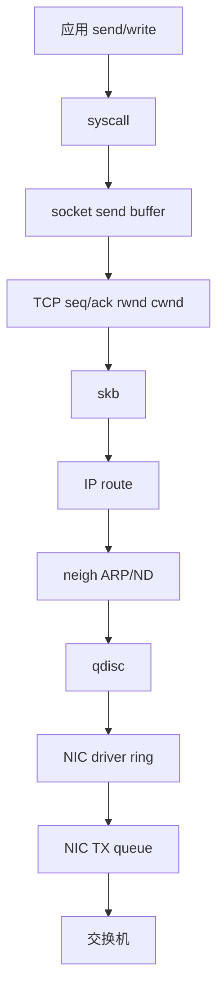

# 第 0d1 章 · Linux 网络栈、TCP 与 MTU

> **关联章节**：本章承接 [0d 导览](0d-network-stack-fundamentals.md)，系统调用与事件循环见 [0b4](0b4-syscall-epoll-io-uring-and-service-io.md)，NUMA、PCIe、DMA 与 pinned memory 见 [0b3](0b3-numa-pcie-dma-and-pinned-memory.md)。

## 1. 第一性原理拆解 + 学习大纲

### 拆 — 不可化简的问题

应用只能读写自己的虚拟内存和文件描述符，但远端服务、远端 rank、远端对象存储并不在本机地址空间里。Linux 网络栈要解决的不可化简问题是：在不可信、会丢包、会拥塞、会重排、会变化路径的共享网络上，为进程提供可编程、可观测、可恢复的数据传输抽象。

### 推 — 从问题推出机制

因为应用需要一个稳定句柄，所以有 socket fd；因为连接需要状态，所以内核有 `struct sock`；因为网络数据要穿过协议层、qdisc、driver 和 NIC，所以有 skb 作为数据与元数据载体；因为链路帧有大小上限，所以有 MTU、MSS、GSO/TSO 与 PMTU；因为共享网络会拥塞，所以 TCP 同时维护接收端窗口 `rwnd` 和拥塞窗口 `cwnd`。

### 概念先说清楚

Socket 是进程可操作的通信端点，表现为一个 fd。它不是“网络连接本身”，而是应用进入内核网络栈的句柄。`struct sock` 才是内核里保存连接状态、发送/接收队列、拥塞控制、定时器、窗口和协议操作的对象。应用写 `send()` 时只是把字节交给 socket；这些字节还要经过 TCP 分段、IP 路由、邻居解析、qdisc、driver ring 和 NIC queue，最后才真的变成链路上的帧。

TCP 是可靠字节流协议，不是消息协议。它把应用字节编号成 sequence number，通过 ACK、重传、流量控制和拥塞控制让两端看到有序字节流。`rwnd` 是接收端告诉发送端“我还能接多少”，保护接收端内存和应用读取速度；`cwnd` 是发送端根据网络反馈估计“我现在能向网络里放多少未确认数据”，保护共享网络。吞吐上不去时，不能只看带宽，还要看 RTT、BDP、MSS、窗口、丢包和 pacing 是否匹配。

MTU 是链路层一帧能承载的最大 IP 包大小，MSS 是 TCP payload 的最大段大小，通常由 MTU 扣掉 IP/TCP 头得到。PMTU 是路径上所有链路共同允许的最大包大小。GSO/TSO 让内核或 NIC 可以先处理大 skb，再在靠近发送端的地方切成 MSS 大小的段；这会改变本机抓包看到的形态，但不会让真实链路突破 MTU。训练、推理和对象存储访问里的“网络慢”，经常来自这些概念边界被混在一起：应用以为发了消息，TCP 只看到字节；本机看到大包，线上仍是 MTU 帧；buffer 很大，`cwnd` 或 PMTU 黑洞仍然限制实际 in-flight。

### 绘 — 从 send 到 wire



### 导 — 本章问题清单

1. Linux 发送路径和接收路径各有哪些排队点？
2. `socket`、`struct sock`、skb、qdisc、driver ring 和 NIC queue 分别负责什么？
3. TCP 三次握手为什么需要双方确认初始序列号？
4. `rwnd`、`cwnd`、BDP、MSS、RTO、fast retransmit 如何共同决定吞吐？
5. short flow 和 long flow 为什么优化方向不同？
6. IP route、subnet、MTU、PMTU、ECMP 为什么会成为训练和推理的故障点？

## 2. OSI 词汇表与 Linux 真实路径

OSI 模型可以帮助命名，但排障要跟随真实对象。应用层的 gRPC、HTTP、NCCL bootstrap 通过 fd 进入内核；内核把字节变成 skb，经过 TCP/IP、netfilter、qdisc 和 driver；NIC 再通过 DMA descriptor 把 host memory 里的数据读走。

| 抽象层 | Linux 对象 | 常见命令 |
| --- | --- | --- |
| 应用连接 | fd、socket、TLS/RPC channel | `lsof -p`、应用 trace。 |
| 传输层 | TCP state、send/receive queue、timer | `ss -tinm`、`nstat`。 |
| 网络层 | route、rule、neighbor、MTU | `ip route get`、`ip neigh`、`ip -d link`。 |
| 发送排队 | qdisc、class、filter | `tc -s qdisc`、`tc -s class`。 |
| 设备层 | driver ring、TX/RX queue | `ethtool -S`、`ethtool -g`。 |

## 3. 发送路径逐层拆解

发送路径不是一条无状态函数调用链，而是多个缓冲区和状态机串联。应用写入 socket 后，数据可能停在用户态 buffer、socket send buffer、TCP 未确认队列、qdisc backlog、driver ring 或 NIC queue。每一层都有不同的“满”的含义。

```text
send()
  user buffer -> copy_from_user
  sock sndbuf -> tcp_sendmsg
  write queue -> tcp_transmit_skb
  skb -> ip_queue_xmit
  route/neigh -> dev_queue_xmit
  qdisc -> driver ndo_start_xmit
  TX descriptor -> NIC DMA read
  wire frame -> switch port queue
```

`SO_SNDBUF` 过小会让应用更早阻塞，但调大它并不等于提高网络吞吐。如果瓶颈是 `cwnd`、PMTU 黑洞或交换机拥塞，send buffer 只会把等待从应用转移到内核。`tc -s qdisc` 的 backlog 长期增长说明发送排队已经在本机出现；`ss -tinm` 中 `send-q` 高且 `cwnd` 小，说明 TCP 还在等 ACK 或拥塞窗口。

## 4. 接收路径逐层拆解

接收路径从 NIC RX queue 开始。NIC DMA 写入 receive buffer 后，驱动通过 MSI-X 中断或 NAPI poll 处理包，创建 skb，进入 IP/TCP，最终把有序字节放入 socket receive queue。应用慢、softirq 被打满、GRO 合并异常、RX ring 溢出都可能表现为“recv 慢”。

```text
wire frame -> NIC RX queue
  DMA write host memory
  MSI-X/NAPI poll
  driver builds skb
  GRO may merge packets
  IP checks route/netfilter
  TCP reorders and ACKs
  socket receive queue
  wake epoll or blocking recv
  copy_to_user
```

接收端窗口 `rwnd` 反映接收端愿意再收多少字节。应用如果不及时读，receive queue 占满，`rwnd` 会缩小甚至变成零窗口。发送端看到的是网络不再前进，但根因在对端应用、线程池、GC、事件循环或 CPU。

## 5. skb、MSS 与 offload 的关系

skb 是 Linux 网络栈最重要的数据结构之一。它描述数据指针、协议头位置、checksum 状态、GSO size、设备、mark、priority 和时间戳。打开 GSO/TSO 后，一个 skb 可以代表大块 TCP payload，后续由软件 GSO 或 NIC TSO 切成不超过 MSS 的段。

这解释了一个常见误判：在发送端本机抓包看到 64 KiB “大包”，不代表线上真的出现了 64 KiB 以太帧。抓包点可能在 TSO 之前；真正线速上的帧仍由 MTU/MSS 限制。排查 MTU 时要结合 `ip link`、交换机端口 MTU、对端 MTU 和 DF/PMTU 行为。

## 6. qdisc：发送侧排队不是交换机才有

qdisc 位于协议栈和 driver 之间。默认策略可能是 `fq_codel`、`fq`、`pfifo_fast` 或发行版/云厂商定制。它决定包在进入 driver 前如何排队、整形、分类和丢弃。短流 P99 与 qdisc 排队有很强关系，因为一个短请求的几个包可能排在大流后面。

| qdisc 现象 | 可能含义 | 下一步 |
| --- | --- | --- |
| backlog 长期不为零 | 本机发送侧排队 | 看应用速率、cwnd、NIC queue、对端 ACK。 |
| drops 增长 | 本机已经丢包 | 确认队列长度、限速、突发流量。 |
| overlimits 增长 | 整形策略触发 | 检查 tc filter/class 和带宽上限。 |
| requeues 增长 | driver/NIC 暂时不能接收更多 skb | 看 TX ring、BQL、网卡 counter。 |

## 7. TCP 三次握手

三次握手不是形式主义。客户端发 SYN 表示自己的初始序列号，服务端回 SYN-ACK 表示收到客户端序列号并声明自己的序列号，客户端再 ACK 表示收到服务端序列号。两端都确认对方可达，才能避免旧连接残留包和单向可达造成的状态错误。

```mermaid
sequenceDiagram
  participant C as Client
  participant S as Server
  C->>S: SYN seq=x
  S->>C: SYN-ACK seq=y ack=x+1
  C->>S: ACK ack=y+1
  Note over C,S: ESTABLISHED; data can be sent reliably
```

推理网关的短连接如果没有连接池，握手、TLS、慢启动和负载均衡都会进入 P99。训练任务的 bootstrap 如果大量 rank 同时连接 rendezvous 服务，accept queue、SYN backlog 和 CPU softirq 也会成为启动瓶颈。

## 8. TCP 窗口：rwnd、cwnd 与 BDP

TCP 同时受接收端窗口和拥塞窗口限制。`rwnd` 保护接收端内存和应用读取速度；`cwnd` 保护共享网络，避免发送端向网络注入过多未确认数据。有效 in-flight 字节大致受 `min(rwnd, cwnd) * MSS` 限制。

BDP 是 bandwidth-delay product，表示链路上“正好填满管道”的数据量。公式是 `BDP = 带宽 * RTT`。100 Gbit/s、RTT 100 us 的路径，BDP 约为 1.25 MB；400 Gbit/s、RTT 80 us 的路径，BDP 约为 4 MB。如果 socket buffer、cwnd 或 pacing 不能达到这个量，长流吞吐就上不去。

## 9. 重传、RTO 与乱序

TCP 用 ACK 推进发送窗口。丢包或严重乱序会触发 fast retransmit 或 RTO。fast retransmit 通常依赖重复 ACK，RTO 则是超时重传，代价更高。对推理短流，一次 RTO 可能直接把请求打到超时；对训练长流，少量重传会降低吞吐并增加 collective 尾延迟。

```bash
ss -tin dst <peer_ip>
nstat -az | egrep 'TcpRetransSegs|TcpExtTCPLostRetransmit|TcpExtTCPTimeouts'
sar -n TCP,ETCP 1
```

## 10. Short Flow vs Long Flow

short flow 的主要成本常常不是带宽，而是握手、排队、调度、TLS、慢启动和负载均衡路径。long flow 的主要成本常常是 BDP、拥塞窗口、公平性、MTU、丢包、ECMP 哈希和路径容量。把长流调优方法用于短流，或者把短流策略用于训练数据面，都容易错。

| 流类型 | 典型场景 | 核心指标 | 常见优化 |
| --- | --- | --- | --- |
| 短流 | 推理 RPC、metadata、控制面 | P99/P999、连接建立、queue wait | 连接池、keepalive、SO_REUSEPORT、低排队。 |
| 长流 | checkpoint、dataset shard、AllReduce fallback | 吞吐、重传率、稳定性 | BDP、MTU、pacing、ECMP、拥塞控制。 |
| 突发流 | rank 同时启动、批量日志 | burst loss、accept queue、softirq | 限流、jitter、队列隔离、backpressure。 |

## 11. IP route、subnet 与 neighbor

IP 层回答“下一跳是谁、从哪个接口出去”。`ip route get <peer>` 比 `ip route` 更适合排查单个目的地址，因为它会显示实际选择的源地址、出口和下一跳。subnet 错误、policy routing、容器 overlay、VRF、bond、VLAN 都可能让包走到错误路径。

```bash
ip -br addr
ip rule
ip route
ip route get <peer_ip>
ip neigh show dev <iface>
arping -I <iface> <gateway_or_peer>
```

## 12. MTU、MSS 与 PMTU

MTU 是二层链路最大 payload，TCP MSS 通常是 MTU 减去 IP/TCP 头。以太网 MTU 1500 下 IPv4 TCP MSS 常见为 1460；jumbo MTU 9000 下 MSS 约 8960。PMTU discovery 依赖 DF 位和 ICMP too big，如果中间设备丢弃 ICMP，就会出现 PMTU 黑洞。

训练网络常用 jumbo frame 减少包数、CPU 中断、NIC descriptor 和交换机 per-packet 开销。但 jumbo 不是单机开关，必须端到端一致：主机接口、bond、VLAN、bridge、overlay、ToR、spine、对端都要能承载。只要路径上一段不一致，就可能表现为大包丢、小包通。

## 13. ECMP 与哈希熵

ECMP 让多条等价路径分担流量，通常按五元组哈希。少量超大长流可能哈希到同一条链路，造成局部拥塞；大量短流可能分布更均匀。RoCE v2 使用 UDP/IP 封装，源端口熵、NCCL channel 数、QP 分布都会影响 ECMP 效果。

如果 8 个 rank 的通信都压到同一上行，平均带宽看似够，单个 collective 仍会慢。排查要比较交换机每条 uplink counter，而不是只看主机网卡总吞吐。

## 14. Worked Example：跨机 TCP 吞吐只有 20 Gbit/s

现象：两台 100G 主机 iperf3 单流只有 20 Gbit/s，多流能到 80 Gbit/s。`ss -tin` 显示 cwnd 不大，RTT 约 120 us，无明显 retrans。推导：单流可能受拥塞控制增长、socket buffer、pacing 或 CPU 单队列限制；多流通过多个 cwnd 和 RSS queue 填满管道。

处理步骤：先算 BDP，100 Gbit/s * 120 us 约 1.5 MB；检查 `net.ipv4.tcp_rmem/wmem` 和应用 buffer；看 `ethtool -S` 是否单 TX/RX queue 热；用 `iperf3 -P 8` 验证并行流；再检查 qdisc pacing 和 CPU softirq。不要直接把问题归因到交换机。

## 15. Worked Example：大包通不过，小包正常

现象：`ping <peer>` 正常，`ping -M do -s 8972 <peer>` 失败；NCCL 或大文件传输偶发 timeout。路径里有 VLAN 和一个 overlay。推导：基础连通性只证明小包可达，不能证明端到端 MTU。overlay 和 VLAN 会消耗额外头部，实际可用 MTU 更小。

```bash
ping -M do -s 1472 <peer_ip>
ping -M do -s 8972 <peer_ip>
tracepath <peer_ip>
ip -d link show dev <iface>
ethtool -S <iface> | egrep 'rx.*err|tx.*err|drop|fragment'
```

修复要按路径推进：确认两端接口 MTU，确认 bond/VLAN/bridge MTU，确认 ToR/spine 端口 MTU，确认 overlay underlay 预留，确认 ICMP too big 没被防火墙丢弃。

## 16. 观测 SOP

1. 先记录症状：吞吐、P99、重传、连接失败、timeout、启动慢。
2. 用 `ip route get` 确认出口和源地址。
3. 用 `ss -tinm` 看 TCP state、send-q、receive-q、cwnd、rtt、retrans。
4. 用 `tc -s qdisc` 看本机发送排队。
5. 用 `ip -s link` 和 `ethtool -S` 看接口错误和 queue counter。
6. 用 PMTU 探测验证路径 MTU。
7. 对比交换机端口 drop、ECN mark、拥塞队列和 ECMP 分布。
8. 改动前保存基线，改动后用相同负载复测。

## 17. Checklist

- socket buffer、应用 backpressure、连接池策略有基线。
- `ss` 中 retrans、rtt、cwnd、rwnd、send-q、receive-q 已记录。
- qdisc backlog、drop、requeue 已检查。
- 路由、源地址、neighbor、ARP/ND 已确认。
- MTU 和 PMTU 已端到端验证。
- ECMP 分布和长流哈希风险已评估。
- 交换机端口 counter 与主机 counter 时间线一致。

## 18. 练习

1. 画出 send 到 NIC TX queue 的完整路径，并标出至少 6 个排队点。
2. 解释 `rwnd` 与 `cwnd` 的区别，各举一个导致吞吐下降的例子。
3. 计算 400 Gbit/s、RTT 90 us 的 BDP，并说明 socket buffer 至少应该处于什么量级。
4. 用命令证明某条路径支持或不支持 MTU 9000。
5. 分析为什么单流慢、多流快不一定是网络总带宽不足。
6. 给出一个 ECMP 哈希不均导致 AllReduce 慢的排查计划。

## 19. 实验：把一条 TCP 连接拆成可观测状态

下面这个实验适合在两台测试机之间执行。目标不是追求最大带宽，而是把“应用写入字节”拆成内核和网络的状态变化。

```bash
# server
iperf3 -s -p 5201

# client
iperf3 -c <server_ip> -p 5201 -t 30 -i 1
```

运行期间在客户端观察：

```bash
ss -tinm dst <server_ip>
tc -s qdisc show dev <iface>
ip -s link show dev <iface>
ethtool -S <iface> | egrep 'tx|rx|drop|err|timeout|retrans'
```

`ss -tinm` 是第一入口。`rtt` 解释反馈环路多长；`cwnd` 解释最多能放多少未确认段；`send` 或 `send-q` 解释应用写入和网络前进是否脱节；`retrans` 解释是否进入恢复路径。`tc` 解释本机是否已经排队；`ethtool` 解释 driver/NIC 是否出现 drop、timeout 或 queue 热点。

把 `iperf3 -P 1` 改成 `iperf3 -P 8` 再测一次。如果单流慢、多流快，优先比较 `cwnd`、RSS/队列分布、CPU 单核和 qdisc，而不是直接认为链路坏。多流快通常说明总路径容量存在，但单个控制环路没填满 BDP，或者单队列/单核成为限制。

## 20. 命令输出如何读

`ss -tinm` 的字段经常被误读。`rtt:120/10` 表示估计 RTT 和抖动；`cwnd:80` 表示拥塞窗口约 80 个 MSS；`bytes_acked` 推进说明 ACK 正常回来；`retrans:0/12` 里累计重传增长才是信号。`rcv_space` 和接收窗口相关，如果对端应用慢，发送端可能看到 in-flight 上不去。

```text
ESTAB 0 0 10.0.0.1:51522 10.0.0.2:5201
  cubic wscale:7,7 rto:204 rtt:120/10 ato:40 mss:8948
  cwnd:80 bytes_acked:123456789 segs_out:45678 retrans:0/12
```

这个例子里，单流理论 in-flight 约 `80 * 8948 = 715840` 字节。若路径是 100 Gbit/s、RTT 120 us，BDP 约 1.5 MB，当前窗口只能填一半管道。下一步要确认拥塞控制是否仍在增长、是否被 pacing 限制、是否有 ACK 压缩/丢包、socket buffer 是否足够。

`tc -s qdisc` 要看 backlog 和 drops 的趋势，而不是一次快照。backlog 短暂出现不一定异常；持续增长说明本机发出速率超过下游可接收速率。drops 增长说明本机已经丢包，TCP 会把它当成拥塞信号。

## 21. 路由与源地址错配案例

现象：同一台机器访问两个训练节点，一个带宽正常，一个只有几 Gbit/s；`ip route` 看起来都有默认路由。用 `ip route get <peer>` 发现慢路径选了管理网接口作为源地址，经由低速 ToR 出去。

```bash
ip route get 10.80.12.34
ip -br addr
ip rule
```

修复不是调 TCP 参数，而是修正 policy routing、源地址选择或应用绑定接口。NCCL、MPI、对象存储客户端和推理网关都可能因为默认接口选择错误走到管理网。所有跨机性能问题都应先证明“包从预期接口出去”。

## 22. PMTU 黑洞的判断树

PMTU 黑洞的特征是小包通、大包卡、重传或 timeout 增长，但接口物理错误不一定增长。判断顺序：

1. 用 `ping -M do` 找到不分片可达的最大 payload。
2. 用 `tracepath` 看路径估计 MTU 是否下降。
3. 检查本机 interface、bond、VLAN、bridge、容器 veth、overlay 的 MTU。
4. 检查 ToR、spine、对端端口和防火墙是否允许 ICMP too big。
5. 如果必须经过 overlay，按封装头预留 underlay MTU。

常见数字要能心算：IPv4 下 `ping -M do -s 1472` 对应以太网 MTU 1500；`-s 8972` 对应 MTU 9000。IPv6、VLAN、VXLAN、Geneve、IPsec 会改变可用 payload，不能机械套数字。

## 23. ECMP 诊断 mini case

现象：16 个训练节点之间两两 iperf 正常，但 AllReduce 方差很大；交换机总上行利用率不高。按端口看，某两条 uplink 已接近满载，其他链路很空。

推导：ECMP 不是按字节做完美负载均衡，而是按流哈希。少数长流如果哈希到同一条链路，会形成局部拥塞。NCCL channel 数、源端口熵、RoCE UDP 源端口、bond hash policy、交换机 hash field 都会影响结果。

处理策略：先收集 per-uplink counter，确认热点；再增加流熵或调整 channel/QP 分布；必要时检查交换机 hash 配置是否包含 L4 端口。改动后不能只看平均 busbw，要比较 P95/P99 step time 和每条链路利用率。

## 24. 变更 SOP：TCP/MTU/路由

1. 写明变更目标：吞吐、P99、timeout、启动失败还是路径纠偏。
2. 记录变更前：`ss -tinm`、`ip route get`、`ip -d link`、`tc -s qdisc`、`ethtool -S`。
3. 先在两节点复现，再扩大到小集群。
4. 一次只改一类变量：buffer、MTU、route、qdisc、拥塞控制或 ECMP。
5. 每次变更后跑同一条命令集，比较趋势而不是单点值。
6. 如果出现 retrans、qdisc drop、PMTU failure 或接口 error 增长，先回到上一版基线。
7. 把最终值固化到配置管理，并保留为什么这么设的证据。

## 25. 排障矩阵：从症状回到机制

| 症状 | 优先机制 | 关键证据 | 常见误区 |
| --- | --- | --- | --- |
| 单流慢、多流快 | BDP、cwnd、RSS、单核 | `ss -tinm`、`iperf3 -P`、softirq | 直接判定链路坏。 |
| 小包通、大包失败 | MTU、PMTU、ICMP too big | `ping -M do`、`tracepath`、`ip -d link` | 只用普通 ping 验证连通性。 |
| send-q 高 | 对端慢、cwnd 小、本机排队 | `ss`、`tc -s qdisc`、对端 receive-q | 只调大 `SO_SNDBUF`。 |
| retrans 增长 | 丢包、拥塞、乱序、PMTU | `nstat`、交换机 drop/ECN、抓包 | 把所有重传都归因到网卡。 |
| accept 慢 | SYN backlog、accept queue、CPU | `ss -ltn`、应用 listener 指标 | 只看已建立连接。 |

这个矩阵的用法是先缩小机制集合，再补证据。网络问题最容易被平均值掩盖：平均 RTT、平均 CPU、平均带宽都正常时，per-flow、per-queue、per-rank 的分布仍可能异常。

## 26. 练习答案检查点

完成本章练习时，答案至少应覆盖这些检查点：

1. send path 里必须出现 socket send buffer、TCP 未确认队列、qdisc、driver ring、NIC queue。
2. recv path 里必须出现 RX queue、NAPI/softirq、GRO、TCP reorder、socket receive queue。
3. BDP 计算要带单位换算，不能只写公式。
4. MTU 验证要说明 payload size、IP 头、TCP/ICMP 头和 overlay 头的关系。
5. ECMP 分析要区分“总带宽足够”和“某条路径局部拥塞”。
