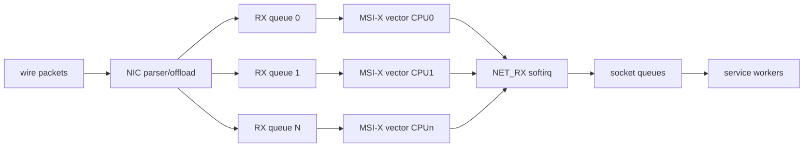
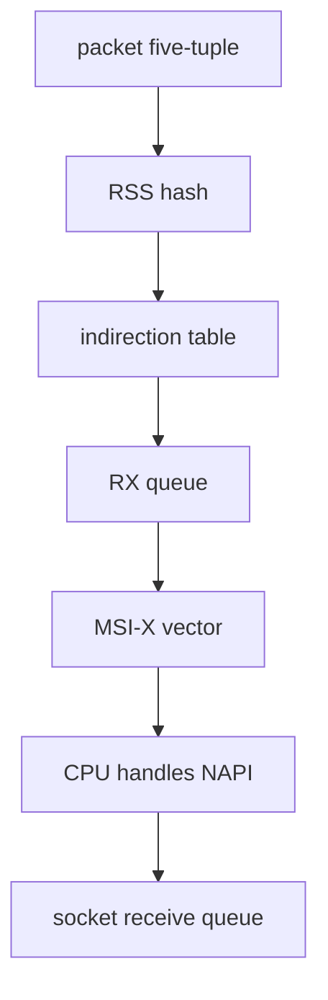

# 第 0d2 章 · NIC Offload、队列与服务网络 IO

> **关联章节**：本章承接 [0d1](0d1-linux-network-stack-tcp-and-mtu.md) 的 Linux/TCP 路径，并与 [0b4](0b4-syscall-epoll-io-uring-and-service-io.md) 的服务 IO 模型衔接。RDMA 数据面见 [0d3](0d3-rdma-roce-infiniband-and-gpudirect.md)。

## 1. 第一性原理拆解 + 学习大纲

### 拆 — 不可化简的问题

网络带宽增长得比单核处理包的能力快。100G、200G、400G 网卡可以每秒产生数百万到数千万个包，而每个包如果都由 CPU 做分段、校验、协议头处理、中断、队列选择和 wakeup，服务 CPU 很快会花在“照看包”而不是业务上。

### 推 — 从问题推出机制

因为每包成本太高，所以有 checksum offload、TSO、GSO、GRO、LRO；因为单队列无法利用多核，所以有 multi-queue、RSS、MSI-X；因为硬件哈希不总够用，所以有 RPS、RFS、XPS；因为中断太多会打爆 CPU，所以有 NAPI、interrupt moderation 和 softirq budget；因为服务需要稳定 P99，所以必须把 NIC queue、IRQ CPU、NUMA 和应用 worker 放在同一张图上。

### 概念先说清楚

NIC offload 指把一部分重复、机械、每包成本高的网络处理交给网卡、驱动或更低层的软件路径完成。Checksum offload 让 NIC 填校验和，TSO/GSO 把大 skb 延后切段，GRO/LRO 把接收侧多个小包合并成大 skb。它们的共同目标是减少 CPU 每包处理成本，不是改变 TCP 的可靠性语义，也不是让链路 MTU 失效。offload 打开后，抓包位置和真实线上帧不再完全一致，所以排障时要同时看本机抓包、对端抓包、NIC counter 和交换机 counter。

Multi-queue 是现代 NIC 把收发路径拆成多组 RX/TX queue。RSS 根据五元组 hash 把流量分到不同 RX queue，每个 queue 通常有自己的 MSI-X interrupt vector，再绑定到某个 CPU 处理 NAPI poll 和 softirq。它解决的是“多流如何利用多核”，不是“单个 TCP 连接自动用满所有队列”。如果流量熵不足、长连接过于集中、RSS indirection table 配错，系统总 CPU 可能不高，但某个 queue、某个 IRQ CPU 或某个 softirq 会成为 P99 尾部。

IRQ affinity、RPS/RFS/XPS 和 NUMA 解决的是“包在哪个 CPU 上处理、应用在哪个 CPU 上消费、内存和 NIC 离哪个 socket 近”。服务网络 IO 的性能不是只由网卡速率决定，而是由 NIC queue、interrupt vector、softirq、socket queue、event loop、worker 线程和 NUMA locality 串起来决定。理解这些对象的边界后，`softirq` 高、某个 RX queue drop、event loop lag、TLS CPU 高和应用 backpressure 才能被放到同一条因果链里。

### 绘 — NIC 到 CPU 的并行结构



### 导 — 本章问题清单

1. TSO、GSO、GRO、LRO、checksum offload 分别节省哪段 CPU？
2. 为什么打开 offload 后抓包和真实链路帧可能不一致？
3. RSS 如何把流分配到 RX queue，为什么五元组熵不足会导致热点？
4. IRQ affinity、RPS、XPS、NUMA 如何影响服务尾延迟？
5. softirq 高说明什么，为什么总 CPU 不高也可能 P99 抖动？
6. 推理网关、控制面服务、sidecar proxy 应该如何设计网络 IO 观测？

## 2. NIC Offload 总览

NIC offload 的本质是把可机械执行、重复度高、每包成本高的工作下推给硬件或更靠近驱动的路径。它不是免费午餐：offload 会改变观测点、影响抓包解释、引入驱动/固件差异，也可能在虚拟化、容器、overlay 或安全策略下被禁用。

| 能力 | 发送/接收 | 节省什么 | 排查注意 |
| --- | --- | --- | --- |
| checksum offload | 两侧 | IP/TCP/UDP checksum 计算 | 抓包可能显示 checksum incorrect，因为抓包发生在硬件填充前。 |
| TSO | 发送 | CPU 不必按 MSS 切 TCP 段 | 本机看到大 skb，不代表线速帧超 MTU。 |
| GSO | 发送 | 软件统一处理大 skb 后再分段 | TSO 不可用时由内核分段。 |
| GRO | 接收 | 把多个包合并成大 skb | 降低每包成本，但可能影响延迟和抓包粒度。 |
| LRO | 接收 | 更激进接收合并 | 不适合所有转发/路由场景，可能破坏语义假设。 |
| RSS | 接收 | 多队列并行收包 | 依赖 hash key、indirection table 和流量熵。 |

## 3. TSO 与 GSO：发送侧分段

没有 TSO 时，内核需要把应用的大写入切成许多 MSS 大小的 TCP segment，为每个 segment 准备头、checksum 和 skb 元数据。TSO 打开后，内核可以把较大的 skb 交给 NIC，由 NIC 按 MSS 产生线速帧。GSO 是软件版本，提供统一抽象；TSO 是硬件执行。

对大吞吐服务，TSO 可以显著降低 CPU；对极低延迟服务，过大的聚合可能与 pacing、队列延迟产生相互作用，需要结合 P99 测试。不要凭“offload 一定更快”做结论。

```bash
ethtool -k <iface> | egrep 'tcp-segmentation|generic-segmentation|tx-checksum'
tcpdump -i <iface> -nn host <peer_ip>
ss -tinm dst <peer_ip>
```

## 4. GRO 与 LRO：接收侧合并

GRO 把同一流的多个连续包合并成一个较大的 skb，再交给协议栈上层。这样每个包触发的协议处理、内存分配和调度成本降低。LRO 更偏硬件/驱动层，合并更激进，转发、桥接、虚拟化和某些安全场景下可能不适合。

推理网关如果请求很小，GRO 的收益可能不如长连接大吞吐明显；如果响应 token streaming 以小 chunk 发出，接收侧合并也不能解决发送侧应用写小块的问题。

## 5. Checksum Offload 与抓包误判

发送端抓包常见 `bad checksum`，这往往只是因为 tcpdump 抓到的是 NIC 填 checksum 之前的 skb。判断线上 checksum 错误要看对端、交换机、NIC error counter，而不是只看发送端抓包。

```bash
ethtool -k <iface> | egrep 'checksum|scatter-gather'
ethtool -S <iface> | egrep 'csum|checksum|err|crc|symbol'
ip -s link show dev <iface>
```

## 6. Multi-Queue 与 RSS

现代 NIC 有多个 RX/TX queue。RSS 根据 hash key 和 indirection table 把包分到 RX queue，常见输入是五元组。每个 RX queue 通常对应一个 MSI-X vector，再绑定到某个 CPU。这样多流可以并行处理，单流通常仍落在一个 RX queue。



单个大流不能靠 RSS 自动分到多个 RX queue；多个连接如果五元组相似或 NAT/负载均衡导致熵不足，也可能集中在少数 queue。推理网关常见问题是总 QPS 不高，但某个 queue 和某个 CPU 被长连接或热点客户端打满。

```bash
ethtool -l <iface>
ethtool -x <iface>
ethtool -S <iface> | egrep 'rx_queue|tx_queue|rx[0-9]|tx[0-9]'
```

## 7. RPS、RFS 与 XPS

RPS 在软件层把接收处理分发到其他 CPU，弥补硬件 RSS queue 不足；RFS 尝试把包送到消费该 socket 的 CPU，提高 cache locality；XPS 控制发送侧由哪个 TX queue 发包，通常希望与运行发送线程的 CPU/NUMA 对齐。

这些机制能解决队列分布问题，也可能增加跨核 IPI 和 cache 迁移。启用前要知道应用 worker 在哪些 CPU 上，NIC 属于哪个 NUMA node，IRQ 当前落在哪里。

## 8. IRQ Affinity、NAPI 与 Softirq

低流量时中断让包尽快被处理；高流量时每包中断会压垮 CPU，于是 NAPI 切换到 poll。NAPI poll 的工作通常在 softirq 上下文执行，受 budget 限制。`NET_RX` 某个 CPU 异常高，是网络接收热点的重要信号。

```bash
cat /proc/interrupts | egrep 'mlx|eth|ens|enp'
cat /proc/softirqs | egrep 'NET_RX|NET_TX'
mpstat -P ALL 1
ps -Leo pid,psr,comm | head
```

IRQ affinity 的目标不是“平均撒到所有 CPU”，而是让网络处理、应用 worker、NUMA 内存和 NIC PCIe locality 尽量一致。对于双 socket 机器，把 NIC0 的 IRQ 打到远端 socket，可能让每个包多跨一次 UPI/QPI。

## 9. Ring Buffer、Descriptor 与 Drop

NIC driver 通过 RX/TX ring 与硬件交换 descriptor。RX ring 太小会在突发流量下丢包；太大可能增加排队延迟。TX ring 满可能导致 requeue 或 qdisc backlog。ring 参数要结合 burst、P99 和内存预算调整。

```bash
ethtool -g <iface>
ethtool -G <iface> rx 4096 tx 4096
ethtool -S <iface> | egrep 'rx.*drop|rx.*miss|tx.*drop|timeout|buffer|ring'
```

## 10. 服务网络 IO：推理网关视角

推理网关通常不是最大带宽问题，而是大量连接、短请求、长响应、token streaming、TLS、负载均衡、连接池、慢客户端和 backpressure 的组合。网络 IO 的目标是让事件循环少做无效工作，让慢连接不能拖住快连接，让 RX/TX queue 分布和 worker 调度可控。

| 服务现象 | 网络层可能原因 | 应用层联动 |
| --- | --- | --- |
| P99 偶发尖刺 | 单 IRQ CPU softirq 高 | worker 与 IRQ 争核，event loop lag。 |
| 长连接分布不均 | RSS hash 或 SO_REUSEPORT 不均 | 少数 listener/worker 热。 |
| send-q 持续升高 | 慢客户端或下游拥塞 | 需要 per-connection pending bytes。 |
| CPU 总体不高但延迟高 | 单 queue 热点 | 看 per-CPU 而不是平均 CPU。 |

## 11. Control Plane 网络 IO

Kubernetes API、scheduler、controller、metadata service、对象存储 gateway 对带宽不敏感，但对连接建立、DNS、TLS、RPC timeout、重试风暴和队列长度敏感。它们通常继续走 TCP 和内核网络栈，因此 0d1 的 TCP 基础和本章的队列/IRQ 仍然重要。

控制面服务更需要保护：限制并发、连接池、指数退避、jitter、熔断、请求预算、慢依赖隔离。网络栈 counter 只能说明一部分问题，必须和应用队列、RPC retry、GC、CPU profile 一起看。

## 12. Mini Case：推理网关 P99 从 30 ms 抖到 300 ms

现象：平均延迟正常，P99 偶发 300 ms；网卡 25G 未打满；`mpstat` 显示 CPU 总体 35%；`cat /proc/softirqs` 显示 CPU 7 的 `NET_RX` 明显高；`ethtool -S` 显示 rx_queue_3 包数远高于其他队列。

推导：总带宽不是瓶颈，热点可能在 RSS queue 和 IRQ CPU。连接经过四层负载均衡后五元组熵不足，大量长连接落到同一 RX queue；该 IRQ 与一个 event loop worker 同核，导致应用调度延迟。

处理：调整 RSS indirection table，确认 hash field 包含源端口；把 IRQ affinity 移到同 NUMA 的独立 CPU；应用侧启用多 listener 或 SO_REUSEPORT 并验证分布；为慢客户端设置 pending bytes 上限。复测必须同时记录 per-queue counter、per-CPU softirq、event loop lag 和 P99。

## 13. Mini Case：TSO 关闭后 CPU 飙高

现象：一次安全基线变更后，服务吞吐下降 40%，CPU user 不变但 system 升高，`perf top` 中 TCP 分段和 checksum 相关函数上升。`ethtool -k` 发现 TSO/GSO/checksum offload 被关闭。

推导：原本由 NIC 执行的分段和 checksum 回到 CPU，每个大响应被拆成大量小段处理。恢复 offload 后 CPU 降低；但同时需要验证抓包中的 checksum 报告不再被误读。

## 14. 观测 SOP

1. 固定负载和时间窗口，记录 P50/P95/P99/P999。
2. 看 per-CPU：`mpstat -P ALL 1`、`/proc/softirqs`、`/proc/interrupts`。
3. 看 per-queue：`ethtool -S`，比较 RX/TX queue 分布。
4. 看 offload：`ethtool -k` 与基线 diff。
5. 看 ring：`ethtool -g` 和 drop/miss/timeout counter。
6. 看应用：event loop lag、pending bytes、连接分布、worker CPU。
7. 看 NUMA：NIC PCIe locality、worker pinning、IRQ affinity。
8. 每次只改一个变量，并保留回滚命令。

## 15. Checklist

- offload 状态有基线，变更会自动 diff。
- RSS queue 数、indirection table、hash field 已记录。
- IRQ affinity 与 NIC NUMA、应用 worker 对齐。
- `NET_RX`/`NET_TX` softirq 无单核热点。
- RX/TX ring、drop、miss、timeout counter 有告警。
- SO_REUSEPORT、listener、连接池分布有观测。
- 慢客户端 pending bytes、write timeout、取消传播有上限。
- 压测覆盖长连接、小请求、大响应、token streaming 和突发重连。

## 16. 练习

1. 解释 TSO、GSO、GRO、LRO 的区别，并说明各自改变哪个观测点。
2. 给定 `NET_RX` 单核高、总 CPU 低，写出排查步骤。
3. 设计一个推理网关的 per-connection pending bytes 策略。
4. 解释为什么单 TCP 流通常不会被 RSS 分到多个 RX queue。
5. 比较增大 RX ring 与降低 P99 的 tradeoff。
6. 写一份 offload 变更前后的验证计划。

## 17. Worked Example：RSS 热点导致 P99 尖刺

环境：一台推理网关有 32 核、25G NIC、8 个 worker。压测平均 QPS 只有容量的 40%，但 P99 从 40 ms 跳到 250 ms。`top` 看总 CPU 不高，应用日志只显示 event loop lag。

观测：

```bash
mpstat -P ALL 1
cat /proc/softirqs | egrep 'CPU|NET_RX|NET_TX'
cat /proc/interrupts | egrep '<iface>|mlx|ens|enp'
ethtool -S <iface> | egrep 'rx_queue|tx_queue|rx[0-9]|tx[0-9]'
ethtool -x <iface>
```

结果发现 RX queue 2 的包量是其他队列 5 倍，MSI-X vector 绑定 CPU 11，而 CPU 11 同时运行一个最忙的 gateway worker。负载均衡器到网关之间复用了少数长连接，源端口熵不足，RSS 把这些连接打到同一个 queue。

修复顺序：

1. 调整上游连接池，让到每个网关实例的连接数增加并分散源端口。
2. 检查 RSS hash field 和 indirection table，确认 RX queue 分布均匀。
3. 把 NIC IRQ 绑定到同 NUMA 但不跑 event loop 的 CPU 集合。
4. 应用启用多 listener 或 `SO_REUSEPORT`，验证 worker 接收连接分布。
5. 复测 P99，同时保存 per-queue、per-CPU、event loop lag 三组曲线。

这个案例的关键是：平均 CPU 和平均带宽都不能解释队列热点。网络 IO 的尾延迟问题必须看 per-CPU 和 per-queue。

## 18. Worked Example：GRO 改善吞吐但伤害流式响应

环境：一个 token streaming 服务把模型输出以小 chunk 写回客户端。打开 GRO 后，大文件下载吞吐更好，但流式首 token 后的间隔抖动增大。

推导：GRO 在接收侧合并包，减少每包协议处理；对大响应和反向代理接收上游数据有收益。但流式场景的延迟常由应用 flush、TLS record、代理缓冲、Nagle/`TCP_NODELAY`、发送侧 qdisc 和慢客户端共同决定。GRO 不能替代应用层的 write 策略，某些场景下合并会让观测粒度变粗。

验证方法：

```bash
ethtool -k <iface> | egrep 'generic-receive-offload|large-receive-offload'
curl -N -w '%{time_starttransfer}\n' http://<gateway>/stream
ss -tinm sport = :<port>
perf top -g --call-graph dwarf
```

如果关闭 GRO 后 CPU 明显升高但 P99 改善，需要权衡服务目标。推理网关通常可以按接口或服务类型区分策略：高吞吐后端链路保留 GRO，大量小响应前端链路重点优化应用 flush、连接池和 worker 调度。

## 19. Offload 变更风险表

| 变更 | 可能收益 | 主要风险 | 回滚信号 |
| --- | --- | --- | --- |
| 开 TSO/GSO | 降低发送 CPU | 抓包更难解释，驱动 bug 暴露 | system CPU 下降但 retrans/drop 增长。 |
| 关 TSO/GSO | 更贴近线速帧观测 | CPU 分段成本上升 | 吞吐下降、`tcp_*segment*` 热。 |
| 开 GRO | 降低接收每包成本 | 小流延迟和抓包粒度变化 | P99 上升、流式 chunk 间隔变大。 |
| 增大 RX ring | 吸收突发 | 排队延迟增加 | drop 降了但 P99 升了。 |
| 调 IRQ affinity | 降低热点和跨 NUMA | 绑定错误造成更严重热点 | `NET_RX` 单核升高或远端 NUMA 访问增加。 |

任何 offload 变更都要在与生产相似的包大小、连接数、响应模式下测。只用大包吞吐测试不能覆盖推理网关、代理和控制面。

## 20. 生产观测指标建议

主机层至少记录：

- per-CPU `NET_RX`、`NET_TX` softirq。
- per-IRQ 中断速率和 affinity。
- per-RX/TX queue packet、byte、drop、miss、timeout。
- offload 状态快照与配置 drift。
- qdisc backlog/drop/requeue。
- TCP retrans、listen overflow、accept queue、orphan、reset。

应用层至少记录：

- event loop lag 或 reactor tick delay。
- 每个 worker 的 active connection、pending bytes、write buffer。
- request queue wait、上游连接池等待、下游写阻塞。
- 慢客户端数量和断开原因。
- P50/P95/P99/P999 分布，不只看平均。

把这些指标按同一时间轴展示，才能判断是 NIC queue 先热、softirq 先热，还是应用 worker 先堵。

## 21. 推理网关网络 IO 设计 checklist

1. listener 数与 worker 数匹配，连接分布可观测。
2. worker CPU、IRQ CPU、NIC NUMA 有明确亲和策略。
3. 慢客户端有 `write_timeout`、pending bytes 上限和取消传播。
4. 上游连接池有最大连接数、最大 pending 请求和健康检查。
5. token streaming 使用明确 flush 策略，并验证 TLS/proxy 是否缓冲。
6. 对大响应和小响应分别压测，不混成一个平均数。
7. offload、RSS、ring、IRQ 配置纳入启动检查或节点验收。
8. 任何 P99 事故复盘都包含 per-queue 和 per-CPU 图。

## 22. 练习延伸：用数据证明队列问题

给一组压测数据：P99 尖刺时总 CPU 40%、NIC 带宽 30%、CPU 9 的 `NET_RX` 为其他 CPU 的 6 倍、rx_queue_5 包量为其他 queue 的 7 倍。请写出：

1. 你会先否定哪些假设。
2. 你会追加哪些命令。
3. 你会如何区分 RSS 熵不足、IRQ 绑定错误和应用 worker 热点。
4. 你会如何设计一次最小变更验证。

## 23. 队列调优的顺序

队列调优要按“证明热点、解释热点、移动热点、复测尾延迟”的顺序做。

1. 证明热点：比较 per-queue packet/byte/drop、per-CPU `NET_RX`、IRQ rate。
2. 解释热点：看 RSS hash、indirection table、连接五元组、上游连接池、NAT/LB 行为。
3. 移动热点：调整连接熵、RSS table、IRQ affinity、worker pinning 或 listener 分布。
4. 复测尾延迟：同时看 P99/P999、event loop lag、drop、softirq、CPU steal。

不要把“均匀”当成唯一目标。某些低延迟服务会把 IRQ 放在独立 CPU，避免和 worker 抢核；某些高吞吐服务会让 IRQ 和 worker 保持 cache locality。目标不同，最优亲和策略不同。

## 24. 观测字段对照表

| 字段/命令 | 说明 | 异常解释 |
| --- | --- | --- |
| `/proc/interrupts` | MSI-X vector 到 CPU 的分布 | 单 vector 过热或跑到远端 NUMA。 |
| `/proc/softirqs` | 网络 softirq 工作量 | `NET_RX` 单核高说明接收处理热点。 |
| `ethtool -S` queue counter | RX/TX 队列包数、字节、drop | RSS/XPS 分布不均或 ring 溢出。 |
| `ethtool -k` | offload 状态 | 与基线不一致可能改变 CPU 和抓包解释。 |
| `ethtool -g` | ring 大小 | 太小易 drop，太大可能增加排队。 |
| 应用 pending bytes | 每连接待写数据 | 慢客户端或下游拥塞。 |

这些字段需要按时间差分。很多 counter 是启动以来累计值，单次截图只能说明“曾经发生过”，不能说明当前事故是否由它触发。

## 25. 服务发布前网络 IO gate

推理网关或代理服务发布前，至少跑四类流量：

1. 小请求小响应：验证连接分布、event loop lag、P99。
2. 小请求大响应：验证 TSO/GSO、send-q、慢客户端 backpressure。
3. 长连接 token streaming：验证 flush、TLS/proxy buffering、chunk 间隔。
4. 突发重连：验证 SYN backlog、accept queue、RSS 熵和 worker 分布。

每类流量都要保存 offload 状态、RSS 分布、IRQ affinity、ring 设置和应用连接分布。这样下一次 P99 事故才能判断是代码变了、流量变了，还是节点网络配置漂移。
