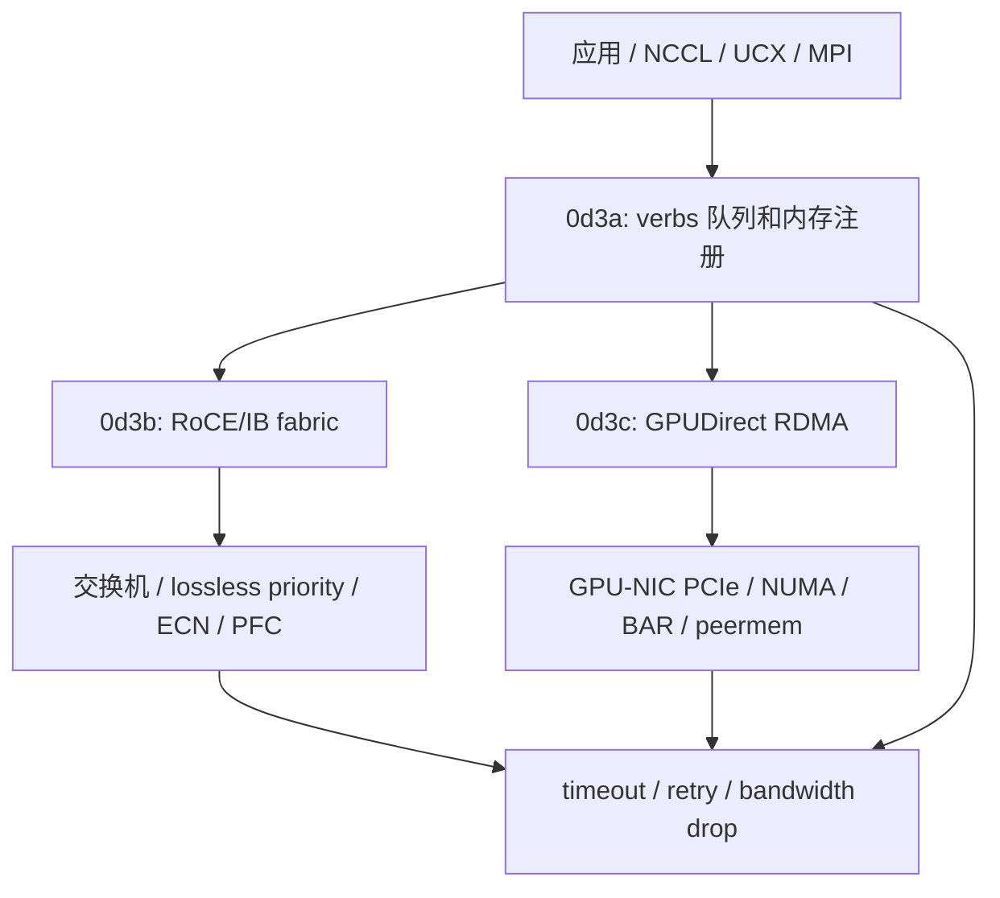

# 第 0d3 章 · RDMA、RoCE/IB 与 GPUDirect 导览

> **定位**：本章是 0d3 系列导览。原来的 RDMA、RoCE/IB、GPUDirect RDMA 内容已经拆成三个独立子章： [0d3a](0d3a-rdma-verbs-memory-registration-and-queues.md)、[0d3b](0d3b-roce-infiniband-lossless-fabric-and-congestion.md)、[0d3c](0d3c-gpudirect-rdma-gpu-nic-topology-and-diagnostics.md)。Linux 网络栈见 [0d1](0d1-linux-network-stack-tcp-and-mtu.md)，NIC queue/offload 见 [0d2](0d2-nic-offload-queues-and-service-network-io.md)，NCCL 专章见 [0d4](0d4-nccl-collectives-and-network-diagnostics.md)。

## 1. 三个概念先说清楚

**RDMA** 是一种“让网卡直接读写本机或远端已授权内存”的通信机制。普通 socket 把网络抽象成内核管理的 fd：应用 `send()`，数据进入内核 socket buffer，经过 TCP/IP，再由对端内核交给对端应用。RDMA 的思路是：应用先把内存注册给网卡，拿到访问 key，然后把“读哪里、写哪里、完成后怎么通知”提交给 NIC。NIC 通过 DMA 执行数据搬运，CPU 不再逐包处理 payload。

所以 RDMA 主要回答：**应用如何把内存、安全权限和异步队列交给 NIC？**  
它的关键词是 MR、lkey/rkey、QP、CQ、WR、WC、Send/Recv、RDMA Write、RDMA Read、Atomic。

**RoCE / InfiniBand** 不是另一个 RDMA API，而是 RDMA packet 跑在什么网络 fabric 上的问题。InfiniBand 是专用 RDMA fabric，有自己的链路层、Subnet Manager、LID、PKey、SL/VL 和管理工具。RoCE 是 RDMA over Ethernet，RoCE v2 把 RDMA 封装在 UDP/IP 上，跑在以太网和 L3 网络中。

所以 RoCE/IB 主要回答：**RDMA packet 如何跨交换机、链路、优先级、拥塞和路由到达对端？**  
它的关键词是 GID/GID index、LID、PKey、MTU、PFC、ECN、CNP、DCQCN、ECMP、SM、link width/speed。

**GPUDirect RDMA** 是 RDMA 的目标内存从 host DRAM 扩展到 GPU HBM。没有 GPUDirect RDMA 时，跨节点 GPU 通信常要走：

```text
GPU HBM -> host pinned memory -> NIC -> network -> peer NIC -> host pinned memory -> peer GPU HBM
```

启用 GPUDirect RDMA 后，目标路径变成：

```text
GPU HBM <-> NIC RDMA engine <-> network <-> peer NIC <-> peer GPU HBM
```

所以 GPUDirect RDMA 主要回答：**NIC 能不能绕过 host staging，直接 DMA 读写 GPU 显存？**  
它的关键词是 `nvidia_peermem`、BAR/BAR1、PCIe P2P、IOMMU/ACS/ATS、GPU/NIC locality、CUDA buffer、NCCL/UCX/MPI fallback。

三者的层次关系：

```text
RDMA
  = NIC 直接访问注册内存的机制

RoCE / InfiniBand
  = RDMA packet 跑在哪种网络 fabric 上

GPUDirect RDMA
  = RDMA 访问的内存不是 host DRAM，而是 GPU HBM
```

## 2. 为什么要拆分 0d3

RDMA 不是一个单一开关。它同时包含用户态 verbs 编程模型、网卡和内存注册机制、RoCE/InfiniBand fabric 配置、拥塞控制、GPU/NIC 拓扑、GPUDirect RDMA 和通信库 fallback 诊断。把这些放在一章里，很容易让读者把三个不同层次混在一起：

- RDMA verbs 解释“应用如何授权 NIC 直接访问内存”；
- RoCE/IB 解释“这些 RDMA packet 如何穿过网络 fabric”；
- GPUDirect RDMA 解释“NIC 如何直接访问 GPU HBM，并受 PCIe/NUMA 拓扑约束”。

拆分后的目标是：先掌握 RDMA 的队列和内存模型，再理解 RoCE/IB fabric 的无损与拥塞控制，最后把 GPU memory、NIC、NCCL/UCX/MPI 和容器权限串起来。

## 3. 拆分后的阅读路径

| 子章 | 主题 | 读完应该能做什么 |
| --- | --- | --- |
| [0d3a RDMA Verbs、内存注册与队列模型](0d3a-rdma-verbs-memory-registration-and-queues.md) | MR、lkey/rkey、QP、CQ、WR/WC、registration cache、Send/Recv/Write/Read/Atomic | 能解释一次 RDMA Write 如何从用户态提交到 NIC，并能根据 WC status 排查 verbs 错误。 |
| [0d3b RoCE/InfiniBand、无损网络与拥塞控制](0d3b-roce-infiniband-lossless-fabric-and-congestion.md) | RoCE v2、InfiniBand、GID/LID/PKey、PFC/ECN/DCQCN、MTU、ECMP、SM | 能区分 RoCE 和 IB 的故障模型，并能排查 GID、PFC pause storm、MTU 与 SM/PKey 问题。 |
| [0d3c GPUDirect RDMA、GPU/NIC 拓扑与诊断](0d3c-gpudirect-rdma-gpu-nic-topology-and-diagnostics.md) | GDRDMA、nvidia_peermem、BAR/BAR1、PCIe P2P、IOMMU/ACS/ATS、GPU/NIC locality、NCCL/UCX/MPI fallback | 能判断 NIC 是否真的直接访问 GPU memory，并能定位跨 socket、容器权限、peermem 或 HCA 选择错误。 |

## 4. 总框架：三层责任边界



判断通信问题时，先问三个问题：

1. **verbs 层是否正确**：MR、QP、CQ、access flag、rkey、WR/WC 是否合理？
2. **fabric 层是否健康**：RoCE/IB 的 MTU、GID/LID、PFC、ECN、PKey、SM、端口 counter 是否合理？
3. **GPU direct 层是否成立**：GPU/NIC topology、`nvidia_peermem`、容器设备、GDRDMA 日志和 CUDA buffer benchmark 是否合理？

## 5. 和相邻章节的关系

- [0b3](0b3-numa-pcie-dma-and-pinned-memory.md) 讲 PCIe、DMA、pinned memory、NUMA、GPU/NIC locality 的主机侧基础。0d3c 会把这些机制用于 GDRDMA。
- [0d1](0d1-linux-network-stack-tcp-and-mtu.md) 讲 Linux TCP/IP 和 MTU。RoCE v2 虽然不是 TCP，但仍依赖 IP、UDP、MTU、ECMP 等路径。
- [0d2](0d2-nic-offload-queues-and-service-network-io.md) 讲 NIC queue、offload、IRQ 和服务网络 IO。RDMA 数据面绕过部分内核路径，但 NIC 队列和硬件 counter 仍然关键。
- [0d4](0d4-nccl-collectives-and-network-diagnostics.md) 讲 NCCL collective。NCCL 的 `NET/IB`、GDRDMA、HCA/GID、socket fallback 都依赖 0d3 系列。

## 6. 快速自测

1. `IBV_WC_RETRY_EXC_ERR` 应该先看应用代码、QP 参数、fabric counter 还是 GPU 拓扑？为什么？
2. RoCE 中 PFC、ECN、CNP、DCQCN 分别解决什么问题？为什么 PFC pause 很多但 ECN mark 很少是危险信号？
3. `NET/IB` 已经启用，为什么 NCCL 跨节点带宽仍可能只有预期一半？
4. 容器里缺 `/dev/infiniband`、`nvidia_peermem` 未加载、GPU/NIC 跨 socket，分别会导致什么现象？
5. 新训练节点入池前，RDMA、RoCE/IB、GDRDMA 三层各应该跑什么 smoke test？
