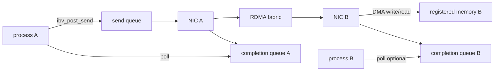
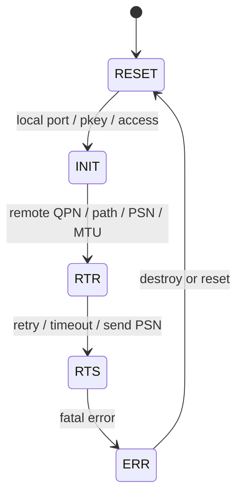

# 第 0d3a 章 · RDMA Verbs、内存注册与队列模型

> **关联章节**：本章承接 [0d2](0d2-nic-offload-queues-and-service-network-io.md) 的 NIC 队列视角，并为后续 RoCE/InfiniBand、GPUDirect RDMA、NCCL 网络诊断章节提供 verbs 和内存注册基础。

## 1. RDMA 到底是什么

RDMA 的全称是 Remote Direct Memory Access，直译是“远端直接内存访问”。这个名字容易误导，因为它听起来像某种网络协议；更准确的理解是：**RDMA 是一套让 NIC 在权限允许的范围内直接读写注册内存的机制和编程模型。**

普通 socket 里，应用把 bytes 交给内核，内核协议栈负责发送、接收、排队和唤醒。RDMA 里，应用先声明“哪些内存可以被 NIC 访问”，再通过队列提交 work request。NIC 按请求执行 DMA，完成后把结果写入 completion queue。CPU 的角色从“逐包处理数据”变成“准备内存、提交请求、收割完成、处理异常”。

最小对比：

| 问题 | socket 的答案 | RDMA 的答案 |
| --- | --- | --- |
| 数据在哪里 | socket buffer / 用户 buffer | 注册内存 MR |
| 谁搬 payload | 内核协议栈 + NIC | NIC DMA engine |
| 如何授权 | fd、进程、内核权限 | protection domain、lkey/rkey、access flags |
| 如何提交 | `send` / `recv` syscall 或 io_uring | work queue + doorbell |
| 如何知道完成 | syscall 返回、epoll、socket state | completion queue / work completion |
| 远端 CPU 是否参与 | 通常要参与协议栈和应用读取 | one-sided Write/Read 可不参与数据到达 |

RDMA 不等于“没有内核”，也不等于“没有拷贝”。创建资源、注册内存、pin page、建立 DMA/IOMMU 映射仍然要内核和驱动参与；zero-copy 只表示 payload 不再固定经过内核 socket buffer，不表示应用层序列化、压缩、GPU staging 或 buffer 拼接没有拷贝。

本章只讲 RDMA 的机制本身：MR、QP、CQ、WR、WC 这些对象如何组成数据面。RDMA packet 跑在什么 fabric 上，交给 [0d3b](0d3b-roce-infiniband-lossless-fabric-and-congestion.md)；RDMA 如何直接访问 GPU HBM，交给 [0d3c](0d3c-gpudirect-rdma-gpu-nic-topology-and-diagnostics.md)。

## 2. 第一性原理拆解 + 学习大纲

### 拆：RDMA 试图删掉什么

传统 socket 的核心抽象是“字节流或报文由内核协议栈负责搬运”。应用把数据写入 socket，内核复制或引用用户 buffer，协议栈做拥塞控制、分段、重传、路由、队列、唤醒，对端内核再把数据放入 socket receive queue，最后唤醒对端应用读取。

RDMA 的核心抽象不同：应用先把一段内存变成 NIC 可以 DMA 访问的对象，再把“从哪里取、写到哪里、怎么通知完成”提交给 NIC。数据路径上，NIC 可以直接读写用户态注册内存，不需要远端 CPU 运行 recv 系统调用，也不需要远端内核把 payload 从 socket queue 拷贝给应用。

所以 RDMA 不是“更快的 socket API”。它把网络 IO 的问题拆成三个更底层的问题：

1. 内存能否被设备安全、稳定、可寻址地 DMA。
2. 工作请求能否按队列语义被 NIC 执行。
3. 两端应用能否用很少的控制面协议管理 buffer、权限、生命周期和错误。

### 推：从瓶颈推出机制

如果每次网络传输都要进入内核、复制数据、走 socket 队列、唤醒远端线程，那么 CPU 成本、cache 污染和尾延迟都会被协议栈路径放大。RDMA 因此引入 kernel bypass：数据面提交和完成轮询大多在用户态 verbs 队列完成；引入 zero-copy：payload 从注册内存由 NIC DMA，不再要求 socket send/recv 的用户态到内核态 payload 拷贝；引入 one-sided 操作：RDMA Write/Read 可以让发起端直接访问远端注册内存。

但边界必须说准确：

1. RDMA 不是完全没有内核。创建设备上下文、分配保护域、注册内存、创建 QP/CQ、修改 QP 状态、销毁资源都要经过内核驱动和 uverbs。
2. RDMA 的 zero-copy 只覆盖已注册内存上的 payload DMA。应用仍可能在序列化、压缩、加密、框架 buffer 拼接、GPU/CPU staging 中产生额外拷贝。
3. RDMA 的 kernel bypass 主要是 steady-state 数据面绕开内核协议栈，不代表绕开 NIC、PCIe、IOMMU、驱动、固件和交换机。
4. 远端 CPU 是否参与取决于操作类型。Send/Recv 需要远端预先 post receive 并轮询 CQ；RDMA Write/Read/Atomic 不需要远端 CPU 在数据到达时执行协议栈代码，但远端 CPU 仍要管理注册内存、权限和同步协议。

### 绘：verbs 数据面的最小闭环



这个闭环里没有 socket receive queue，也没有“远端内核收到 payload 后再复制给应用”的固定路径。代价是应用必须显式管理 MR、QP、CQ、WR、WC、SGE 和远端地址/权限。

### 导：本章问题清单

1. RDMA 相比 socket 到底绕过了哪些路径，哪些路径仍存在。
2. verbs 对象如何拼成一个可通信的数据面。
3. 内存注册为什么昂贵，pin pages、IOMMU/DMA mapping、ODP、huge page 和 registration cache 如何影响性能。
4. QP 为什么有 RESET、INIT、RTR、RTS 状态，PSN、MTU、retry、RNR 和 access flags 分别控制什么。
5. Send/Recv、RDMA Write、RDMA Read、Atomic 的语义差异是什么。
6. CQ polling、completion batching、CQ overflow、signaled/unsignaled WR 如何影响吞吐和错误可见性。
7. 内存顺序、可见性、buffer 生命周期和错误处理为什么是 RDMA 程序的主体复杂度。
8. 如何用命令和基准工具定位 retry exceeded、RNR、内存注册抖动和 pin 过量。

## 3. RDMA 与 socket 的本质差异

socket 把网络看作内核提供的文件描述符。应用关心 `send`、`recv`、`epoll` 和 backpressure，内核负责大部分数据路径细节。RDMA verbs 把网络看作“用户态可操作的硬件队列 + 注册内存 + 完成事件”。应用直接向队列提交 work request，直接从 completion queue 取 work completion。

| 维度 | socket | RDMA verbs |
| --- | --- | --- |
| 数据提交 | 系统调用或 io_uring 进入内核 | 用户态写 WQE 并 ring doorbell |
| payload 放置 | 内核 socket buffer 或页引用 | NIC DMA 到注册内存 |
| 远端接收 | 远端内核协议栈入队，应用读取 | Send 需要远端 Recv WQE；Write/Read/Atomic 可 one-sided |
| 传输身份 | fd、IP、port、进程 | QP、QPN、LID/GID、PSN、rkey、remote addr |
| backpressure | socket buffer、TCP window、拥塞控制 | receive queue depth、RNR、retry、CQ depth、应用协议 |
| 错误模型 | syscall errno、socket state | WC status、async event、QP error state |

### kernel bypass 的准确边界

steady-state RDMA send path 通常是：

1. 应用把 SGE、opcode、flags 写入用户态映射的 work queue。
2. 应用写 doorbell record 或 MMIO doorbell 通知 NIC。
3. NIC 读取 WQE，按 lkey/rkey 和地址做 DMA。
4. NIC 把完成写到 CQ，应用轮询 CQ。

这里绕过的是内核协议栈、socket buffer、每次发送接收的 syscall 和调度唤醒。没有绕过的是：

1. 资源创建和权限管理时的内核 uverbs。
2. 页固定、DMA 映射、IOMMU 页表、设备上下文管理。
3. NIC 固件、PCIe、NUMA、内存控制器和交换机。
4. 进程间控制面，例如交换 QP 信息、rkey、地址和协议版本。

### zero-copy 的准确边界

RDMA zero-copy 的含义是 payload 不需要先复制到内核 socket buffer，再由 NIC 从 socket buffer 发送；也不需要远端内核把 payload 从协议栈 buffer 复制到用户 buffer。它并不保证：

1. 应用层对象天然在注册内存中。
2. 小消息不会被框架复制到 bounce buffer。
3. GPU tensor、CPU tensor、序列化 buffer 之间没有 staging。
4. RDMA Read/Write 后远端 CPU 立刻按语言内存模型看见最新值。

实践中，RDMA 的性能常常不是由“网络线速”决定，而是由“能否长期复用注册内存，避免频繁注册、复制和同步”决定。

## 4. verbs 对象总览

verbs 对象可以理解为一套硬件数据面的句柄。每个对象解决一个不可省略的问题。

| 对象 | 全称 | 解决的问题 |
| --- | --- | --- |
| context | device context | 进程打开哪个 RDMA 设备，并获得 uverbs 通道。 |
| PD | protection domain | 哪些 QP、MR、AH 属于同一个保护域，权限是否可组合。 |
| MR | memory region | 哪段虚拟地址可被本地或远端 DMA 访问。 |
| lkey | local key | 本地 NIC 访问本地 MR 时的权限 token。 |
| rkey | remote key | 远端 QP 访问本 MR 时必须携带的权限 token。 |
| CQ | completion queue | NIC 把完成和错误投递到哪里。 |
| QP | queue pair | 发送队列和接收队列的组合，是通信端点。 |
| SRQ | shared receive queue | 多个 QP 共享一组 receive WQE，降低预投递 buffer 成本。 |
| AH | address handle | UD 传输中描述远端寻址信息。 |
| WR | work request | 应用提交给 QP 的一次操作请求。 |
| WC | work completion | NIC 对 WR 的完成报告。 |
| SGE | scatter-gather element | WR 中的一段本地内存地址、长度和 lkey。 |

### context、PD、MR 与 key

`ibv_open_device` 返回 context，代表进程与某个 HCA 设备的连接。通过 context 可以查询端口、创建 PD、CQ、QP，接收 async event。多设备机器上，context 也决定 NUMA、PCIe root complex 和 GID table；只按 `mlx5_0` 选择设备而不确认 netdev、NUMA node、物理端口和容器可见设备，是常见误配。

PD 是保护域。MR、QP、SRQ、AH 都挂在 PD 下，硬件会检查 lkey/rkey 与 QP 是否在兼容保护域内。PD 不是性能调优旋钮，而是隔离和权限边界；多租户 runtime 可按租户、模型实例或安全域拆 PD，减少 rkey 泄漏后的影响范围。

MR 是“这段用户虚拟地址范围可以被 HCA DMA”的承诺。注册 MR 后会得到 lkey 和 rkey：

1. lkey 用于本地访问。Send、Recv、RDMA Read 的本地写入目标、RDMA Write 的本地读取源都要用 lkey。
2. rkey 用于远端访问。把 rkey 和 remote addr 发给对端，就等于授予对端在 access flags 范围内访问该 MR 的能力。
3. rkey 不是秘密协议的替代品。它应被当作敏感 capability 管理，生命周期越短、范围越小越好。

### CQ

CQ 是完成队列。多个 QP 可以共享 CQ，也可以分离 send CQ 和 recv CQ。高性能程序通常 busy poll CQ，避免事件通知的 wakeup 延迟；控制面或低 QPS 服务可能使用 completion channel 事件通知。

CQ 的大小必须覆盖峰值 outstanding WR 和完成批量。如果 CQ overflow，结果不是“慢一点”，而是 QP 进入错误状态或完成丢失，程序必须把它当作严重容量错误。

### QP

QP 是 queue pair，包含 send queue 和 receive queue。常见类型：

1. RC：reliable connected，最常用，提供可靠、有序、连接语义，支持 Send/Recv、Write、Read、Atomic。
2. UC：unreliable connected，连接但不可靠，较少用于通用上层协议。
3. UD：unreliable datagram，类似数据报，需要 AH，常用于管理、发现或特殊协议。
4. XRC、DCT 等扩展用于大规模连接数场景，具体语义依赖设备和驱动支持。

本章主要讨论 RC，因为大多数训练、参数服务、存储和高性能 RPC 的 RDMA 基础都先从 RC QP 入手。

### SRQ

没有 SRQ 时，每个 QP 都有自己的 receive queue。若有 10000 个连接，每个 QP 预投递 64 个 recv buffer，会消耗大量内存，即使多数连接空闲。SRQ 让多个 QP 从同一个 receive queue 取 WQE，降低 buffer 预留量。

SRQ 的风险是共享池耗尽会影响所有关联 QP。它需要更严格的 low watermark、补充线程和 per-peer 限流。

### AH、WR、WC 与 SGE

AH 是 address handle，主要用于 UD，封装 LID/GID、SL、path bits、port 等寻址信息。RC QP 在连接建立时把路径信息配置到 QP 状态里，数据面不在每个 WR 携带 AH。WR 是提交的请求，WC 是完成的结果，SGE 是 WR 引用的本地内存片段。

一个 Send WR 可以带多个 SGE，NIC 按顺序 gather；一个 Recv WR 也可以带多个 SGE，NIC scatter 到多个 buffer。SGE 数量不是无限的，受设备 `max_sge`、QP 类型和 WQE 大小限制。小消息高 QPS 场景中，SGE 过多会增加 NIC 读取 WQE 和地址转换成本。

## 5. 从应用 buffer 到 NIC DMA：内存注册实现

内存注册是 RDMA 里最容易被低估的成本。它不是简单地把指针登记到表里，而是把一段用户虚拟地址转换成设备可安全访问的 DMA 映射。

### 注册的基本步骤

典型 `ibv_reg_mr(pd, addr, length, access)` 背后会发生：

1. 检查地址范围、权限和 access flags。
2. pin pages，阻止这些页被换出或迁移到无法保持 DMA 映射的位置。
3. 建立虚拟地址到物理页或 DMA 地址的映射。
4. 配置 IOMMU 或设备 MTT/MPT，使 HCA 能做地址转换和权限检查。
5. 返回 MR 句柄、lkey 和 rkey。

注册成本与页数、页表形态、IOMMU、驱动缓存、NUMA 和内存碎片相关。注册 1 GB 的 4 KiB 页，理论上要处理 262144 个页条目；注册同样大小的 2 MiB huge page，只需 512 个大页条目。

### pin pages 的意义

DMA 设备不能接受“这个虚拟页可能随时被换出或迁移”的不确定性。pin pages 的意义是让内核承诺这些页在 MR 生命周期内保持可 DMA。pin 过多会带来系统级风险：

1. 可回收内存减少，触发 reclaim 压力。
2. NUMA balancing、内存迁移、透明大页整理受阻。
3. 容器 memory limit 与 `RLIMIT_MEMLOCK` 配置不匹配时，注册失败或抖动。
4. 长期 pin 小页会制造碎片，使后续 huge page 分配更难。

### IOMMU 与 DMA mapping

开启 IOMMU 时，设备看到的是 IOVA，而不是裸物理地址。注册 MR 需要为设备建立 IOVA 到物理页的映射。IOMMU 提供隔离和安全，但也可能增加映射建立成本和 DMA 地址转换压力。

在高性能环境里，常见选择包括开启 IOMMU passthrough、使用 huge page 降低 IOTLB 压力、或按安全要求保留完整 IOMMU 隔离。不要只用 microbenchmark 决定，因为多租户安全、设备隔离和故障域同样重要。

### ODP：On-Demand Paging

ODP 允许 MR 不在注册时立刻 pin 和映射全部页，而是在设备访问时按需 fault。它降低大地址空间注册的启动成本，适合稀疏访问或动态内存池。但它不是免费：

1. 首次访问页可能触发 page fault，带来尾延迟尖刺。
2. ODP fault 路径需要驱动、内核和硬件协作，故障定位比传统 MR 更复杂。
3. 对低延迟确定性要求高的热路径，仍常预热或使用显式注册内存池。

ODP 的价值在于“可管理的大虚拟地址空间”，不是保证每次访问都更快。

### huge page 的作用

huge page 对 RDMA 的帮助主要来自减少页条目数量：注册时处理的页更少，HCA 地址转换表更小，IOMMU IOTLB miss 更少，长期内存池也更容易稳定复用。透明大页可能被拆分，显式 huge page 更可控。训练系统、KV cache、embedding cache 和大 buffer pool 常把通信缓冲区放在 huge page 区域，减少注册和地址转换压力。

### registration cache

频繁 `ibv_reg_mr` 和 `ibv_dereg_mr` 会把性能打碎。registration cache 的做法是缓存已注册内存区域和 lkey/rkey，下次相同或相近 buffer 复用 MR。

常见实现按页对齐地址和长度做 key，用引用计数避免仍有 outstanding WR 时 dereg，用 LRU 和 pin 字节上限控制内存，并与 allocator 集成，在释放用户 buffer 时通知 cache。对 rkey 暴露给远端的 MR 要使用更严格生命周期，避免 rkey 复用造成协议漏洞。

registration cache 的难点是正确性而不只是性能。最危险的 bug 是 buffer 已被上层释放并重新分配给别的对象，但旧 MR/rkey 仍被远端使用。

### 生命周期与风险

MR 生命周期必须长于所有引用它的 WR 和远端访问。安全顺序通常是：

1. 停止把该 MR 的 rkey/addr 发给新请求。
2. 等待本地所有使用该 lkey 的 WR 完成。
3. 通过协议确认远端不会再使用旧 rkey。
4. 必要时 revoke 或更换 rkey。
5. dereg MR。
6. 释放或复用内存。

如果省略第 2 或第 3 步，结果可能是本地 NIC DMA 到已释放内存，或远端把数据写进已经承载新对象的地址。

## 6. QP 状态机与连接参数

RC QP 在真正发送数据前必须从 RESET 走到 RTS。每个状态配置不同层次的信息。



### RESET 与 INIT

QP 创建后处于 RESET。此时队列不可用，通常配置基础属性后转 INIT。RESET 也常作为错误后重建的起点。RC QP 进入 ERR 后，很多场景下实际处理是 drain CQ、销毁 QP、重建连接，而不是指望原 QP 恢复。

INIT 配置本地端口、P_Key index、QP access flags 等。access flags 决定远端是否可以对本 QP 关联的 MR 执行 RDMA Read、Write、Atomic。常见 flags：

1. `IBV_ACCESS_LOCAL_WRITE`：本地 HCA 可写该 MR。本地作为 Recv 或 RDMA Read 目标时需要。
2. `IBV_ACCESS_REMOTE_WRITE`：允许远端 RDMA Write。
3. `IBV_ACCESS_REMOTE_READ`：允许远端 RDMA Read。
4. `IBV_ACCESS_REMOTE_ATOMIC`：允许远端 atomic。
5. `IBV_ACCESS_ON_DEMAND`：ODP 相关。
6. `IBV_ACCESS_RELAXED_ORDERING`：允许更宽松 PCIe ordering，需谨慎验证协议。

权限应最小化。只做 Send/Recv 的 buffer 不应暴露 remote write/read。只需要 Write 的数据区不应开启 Atomic。

### RTR

RTR 是 ready to receive。这里配置远端 QPN、远端 PSN、路径、MTU、address vector、最大 RDMA Read/Atomic 资源等。若路径、GID、LID、MTU 或 PSN 不匹配，常见表现是连接建立看似完成，但数据 WR 超时、retry exceeded 或无完成。

MTU 必须与链路、端口和路径兼容。RDMA path MTU 与 IP MTU 不是同一个字段，但 RoCE 场景下底层以太网 MTU、VLAN、PFC/ECN 配置会影响实际传输。

### RTS

RTS 是 ready to send。这里配置 send PSN、timeout、retry count、RNR retry、SQ PSN、max outstanding RDMA Read/Atomic 等。RTS 后可以 post send。

关键参数包括 PSN、timeout、retry count、RNR retry、min RNR timer 和 path MTU。PSN 用于可靠传输排序和重传；timeout 太小会在拥塞或长路径上误判；retry count 耗尽会产生 retry exceeded；RNR retry 和 min RNR timer 控制远端没有 receive WQE 时如何重试；path MTU 影响分片和链路效率。

### PSN、retry 与 RNR 的关系

RC 保证可靠，但可靠不是无限等待。发送方发出包后期望 ACK；没有 ACK 就按 timeout 重试。重试次数耗尽，WC status 可能是 retry exceeded。若远端没有 Recv WQE，远端会返回 RNR NAK，发送方按 RNR timer 和 RNR retry 处理；RNR retry 耗尽则产生 RNR retry exceeded。

这两个错误的定位方向不同：

1. retry exceeded 更像路径、链路、对端 QP 状态、PSN、MTU、拥塞导致 ACK 不回来。
2. RNR retry exceeded 更像远端 receive queue/SRQ 没有及时补充，或协议发送 Send 太快。

## 7. 操作语义：Send/Recv、Write、Read、Atomic

RDMA 的四类常见操作不是“同一种传输的不同名字”，而是远端 CPU 感知和同步方式完全不同。

| 操作 | payload 方向 | 远端是否必须预投递 | 远端 CQ 是否有完成 | 常见用途 |
| --- | --- | --- | --- | --- |
| Send/Recv | 发起端到接收端 | 是，Recv WQE | 是，Recv WC | 消息、控制面、小 RPC |
| RDMA Write | 发起端写远端内存 | 否 | 默认无远端 WC | 数据推送、ring buffer |
| RDMA Read | 发起端读远端内存 | 否 | 默认无远端 WC | 拉取、cache miss、参数读取 |
| Atomic | 发起端操作远端内存 | 否 | 默认无远端 WC | lock-free index、credit、计数 |

### Send/Recv

Send/Recv 最接近消息语义。接收端必须提前 post receive WR，指出 payload 放到哪些 SGE。发送端 Send 到达后，远端 NIC 消耗一个 Recv WQE，把数据 DMA 到接收 buffer，并在远端 CQ 产生 Recv WC。

优点是远端应用自然感知消息到达；缺点是 receive queue depth 是硬约束。没有足够 Recv WQE 就会 RNR。

### RDMA Write

RDMA Write 是 one-sided push。发送端携带 remote addr 和 rkey，把本地 SGE 数据写入远端 MR。远端 CPU 不会因为这次写自动被唤醒，远端 CQ 默认也没有完成。远端只是在内存中某段地址被 NIC DMA 改写。

因此 Write 常配合 doorbell/flag 协议：

1. 发起端先 Write payload 到远端 data buffer。
2. 再 Write 一个 flag、tail pointer 或 descriptor 到远端 control buffer。
3. 远端 CPU 轮询 flag，看到新值后读取 payload。

关键是顺序。必须保证远端看到 flag 时 payload 已经可见。通常使用同一 QP 上有序 WR、带 fence 的 WR、或协议级 sequence number 避免乱序可见性问题。

### RDMA Read

RDMA Read 是 one-sided pull。发起端从远端 MR 读数据到本地 MR。远端 CPU 不参与完成通知。Read 对远端 NIC 和 PCIe/内存子系统压力较大，因为远端要响应读请求，延迟通常比 Write 更难隐藏。

Read 常用于拉取模型参数、远端缓存 miss、读远端 ring descriptor。它的风险是读取到不一致快照，因此常需要 version、seqlock 或两阶段读取协议。

### Atomic

Atomic 包括 compare-and-swap、fetch-and-add 等，目标通常是 8 字节对齐地址，具体能力看设备。Atomic 在远端内存位置执行原子读改写，并把旧值返回本地。

Atomic 适合做小粒度协调，但不能替代完整分布式锁设计。高并发热点 atomic 会把某个远端 cache line、HCA atomic 单元或 PCIe 路径打成瓶颈。

## 8. doorbell、WQE 与完成

post send 并不等于 NIC 已执行完成。应用把 WR 转成 WQE 放入 SQ 后，需要 ring doorbell 通知 NIC。doorbell 可能是 MMIO，也可能有 doorbell record 和 BlueFlame 等设备优化。核心点是：doorbell 是“请开始消费这些 WQE”，不是“这些数据已经到达远端”。

### signaled 与 unsignaled WR

每个 WR 可以选择是否产生 send completion。全 signaled 简单但 CQ 压力大；大量 unsignaled 能提高吞吐，但必须周期性发 signaled WR，确认前面的 WR 已被处理，并让错误可见。

常见模式：

1. 每 N 个 WR 一个 signaled。
2. 每个逻辑批次最后一个 WR signaled。
3. 遇到需要释放 buffer、更新 credit、切换 epoch 时 signaled。

如果长期只发 unsignaled WR，SQ 可能因为没有回收进度而耗尽，错误也可能延迟暴露。

### completion batching

CQ polling 应批量取完成，例如一次 `ibv_poll_cq(cq, 32, wc_array)`。批量 polling 降低函数调用、cache miss 和分支成本。高 QPS 程序通常把 polling loop 和业务状态机绑在同一线程，避免完成在一个线程、buffer 释放在另一个线程之间反复跨核。

### CQ overflow

CQ overflow 说明应用没有及时 poll，或 CQ sizing 低于峰值完成数量。它会导致 async event，QP 可能进入错误状态。预防手段：

1. CQ depth 大于所有关联 QP 可能同时产生的 signaled completion 和 recv completion。
2. 控制 signaled rate。
3. poller 不做阻塞操作。
4. 把 recv CQ 和 send CQ 分开，避免控制面完成淹没数据面完成。
5. 对 SRQ、多 QP 共享 CQ 的场景做峰值容量预算。

## 9. 内存顺序、可见性与 buffer 生命周期

RDMA 程序最常见的正确性问题不是“包丢了”，而是“对端看到 flag 时数据还没准备好”“buffer 被复用时旧 DMA 还在路上”“错误 WR 之后继续解释旧状态”。

### 本地可见性

应用把数据写入本地 buffer 后，NIC 才能 DMA 读取正确内容。用户态内存写入与 doorbell 之间需要满足平台和 verbs 库要求的 ordering。一般 verbs provider 会在 doorbell 路径中处理必要屏障，但如果应用使用 non-temporal store、GPU memory、用户态缓存技巧或 relaxed ordering，就需要显式确认可见性。

### 远端可见性

RDMA Write completion 在本地 CQ 出现，表示本地 HCA 已完成该 WR 的语义；对 RC 来说通常意味着远端已确认。远端 CPU 何时按普通 load 看见数据，还受 CPU cache coherency、平台、内存类型和 GPU/设备内存语义影响。CPU host memory 通常是 coherent 的，但 GPU memory、peer memory 和 relaxed ordering 需要额外同步。

### flag 协议

一个稳健的 Write-based ring buffer 通常这样设计：

1. 每个 slot 有 sequence number，而不只是 boolean flag。
2. producer 先写 payload，再写 descriptor 或 sequence。
3. consumer 读取 sequence，确认 slot 属于当前 epoch。
4. consumer 处理后写回 credit 或 head。
5. producer 不复用 slot，直到看见 credit。

这样可以避免 flag 丢失、ABA、重复消费和旧写覆盖新对象。

### buffer 生命周期

释放 buffer 的最低条件是：

1. 所有引用该 buffer 的本地 WR 都已有成功或失败 WC。
2. 对远端暴露的 buffer 已通过协议确认远端不会再访问。
3. 相关 rkey 已失效或不会被旧请求使用。
4. 应用不会再根据旧 WC 释放同一 buffer 两次。

错误路径也必须释放或隔离 buffer。QP 进入 ERR 后，未完成 WR 可能以 flush error 返回。程序要 drain CQ，标记所有 outstanding request 失败，然后重建 QP 或上报连接死亡。

## 10. 错误处理模型

verbs 错误大多通过 WC status 和 async event 暴露。不要把 `ibv_post_send` 成功理解为传输成功。它只说明 WR 被接受进入队列。

常见 WC status：

| status | 含义 | 排查方向 |
| --- | --- | --- |
| `IBV_WC_SUCCESS` | WR 完成 | 仍需按 opcode 判断业务语义。 |
| `IBV_WC_RETRY_EXC_ERR` | retry 耗尽 | 路径、MTU、PSN、对端 QP、拥塞、链路丢包。 |
| `IBV_WC_RNR_RETRY_EXC_ERR` | RNR retry 耗尽 | 远端 Recv/SRQ 不足，补充线程卡住。 |
| `IBV_WC_REM_ACCESS_ERR` | 远端访问错误 | rkey、remote addr、access flags、MR 生命周期。 |
| `IBV_WC_LOC_PROT_ERR` | 本地保护错误 | lkey、地址、长度、SGE 越界、本地写权限。 |
| `IBV_WC_WR_FLUSH_ERR` | QP 错误后 WR 被 flush | 先找首个真实错误，flush 是后果。 |

错误处理原则：记录 `wr_id`、opcode、qp_num、status、vendor_err、byte_len；优先找首个非 flush 错误；进入 ERR 的 QP 不继续复用数据面状态；drain CQ，归还或隔离 outstanding buffer；对端也记录连接 epoch，避免旧 QP 的迟到控制消息污染新连接。

## 11. 命令观测与基准工具

RDMA 排查要同时看设备、端口、链路、QP/MR 资源和业务 completion。单个命令很少能给出完整答案。

### 设备与端口

```bash
ibv_devices
ibv_devinfo -v
rdma link show
rdma dev show
rdma resource show
```

关注点：

1. HCA 名称、固件版本、node GUID、sys image GUID。
2. port state 是否 ACTIVE。
3. link layer 是 InfiniBand 还是 Ethernet。
4. active MTU、max MTU、active speed、active width。
5. GID table 是否包含期望 RoCE v2 GID。
6. 设备 max_qp、max_cq、max_mr、max_sge 是否满足应用配置。

### 计数器

```bash
perfquery -x
perfquery -x <lid> <port>
rdma statistic show
ethtool -S <netdev> | egrep 'err|drop|discard|timeout|crc|ecn|pause|pfc'
```

InfiniBand 常看 symbol error、link error recovery、VL15 dropped、port xmit wait、port rcv errors。RoCE 还要看以太网 pause/PFC、ECN、buffer discard、priority queue drop。

### per-process RDMA 资源

```bash
rdma resource show qp
rdma resource show cq
rdma resource show mr
rdma resource show qp pid <pid>
rdma resource show mr pid <pid>
```

这些命令能发现 QP 数暴涨、MR 数暴涨、CQ depth 异常、进程退出后资源是否仍被持有。不同内核和 rdma-core 版本字段略有差异，排查时保存原始输出。

### perftest

```bash
ib_write_bw -d <dev> -i <port> <server>
ib_read_bw  -d <dev> -i <port> <server>
ib_send_bw  -d <dev> -i <port> <server>
ib_write_lat -d <dev> -i <port> <server>
```

使用原则：

1. 先用小消息 latency 验证路径基本可用。
2. 再用大消息 bandwidth 验证 MTU、链路速率和拥塞。
3. Write、Read、Send 分开测，因为压力方向不同。
4. 用相同 GID index、SL/TC、MTU、QP 数和 message size 对比业务配置。
5. perftest 正常不代表业务正确，只说明基础链路和 verbs 能力大体可用。

## 12. Worked Example：`WC retry exceeded` 定位

### 现象

业务日志出现：

```text
send completion error: status=IBV_WC_RETRY_EXC_ERR vendor_err=0x81 wr_id=...
qp moved to error state
```

吞吐从稳定 180 Gbps 降到接近 0，重启连接后短暂恢复。不是 RNR 错误，说明远端缺 Recv 不是首要假设。

### 第一轮判断

`retry exceeded` 表示 RC 发送方没有在重试预算内拿到期望 ACK。可能原因：

1. 物理或链路层丢包严重。
2. RoCE 拥塞或 PFC/ECN 配置错误导致 pause/drop。
3. path MTU 两端不一致或超过实际路径。
4. 远端 QP 不在 RTR/RTS，或 QPN/PSN 交换错误。
5. GID index、traffic class、service level、P_Key 或路由错误。
6. timeout/retry 配置过激，在正常拥塞下误判失败。

### 操作步骤

1. 保存首个错误 WC，不要只看后续 flush：

```text
status, vendor_err, opcode, wr_id, qp_num, byte_len, timestamp
```

2. 看端口状态和 MTU：

```bash
ibv_devinfo -v
rdma link show
```

确认两端 active_mtu、link_layer、state、phys_state、GID index 与业务配置一致。

3. 跑 perftest 做最小复现：

```bash
ib_write_lat -d <dev> -i <port> -x <gid_index> <peer>
ib_write_bw  -d <dev> -i <port> -x <gid_index> -s 65536 <peer>
```

如果 perftest 同样失败，优先查链路、交换机、MTU 和 GID。若 perftest 正常，回到业务 QP 参数、消息大小、QP 数和流控。

4. 看计数器差分：

```bash
perfquery -x
ethtool -S <netdev> | egrep 'drop|discard|timeout|ecn|pause|pfc|crc|err'
```

在 RoCE 中，priority drop、PFC pause 异常、ECN mark 暴涨都可能导致 retry exceeded。InfiniBand 中，symbol error、link error recovery、xmit wait、rcv error 的差分更关键。

5. 对比 QP 参数：

检查两端交换的 `qpn`、`psn`、`lid/gid`、`mtu`、`port_num`、`gid_index`、`traffic_class`、`hop_limit`。重点看“连接重建后是否复用旧 peer info”，因为旧 QPN/PSN 与新 QP 混用会造成非常像链路丢包的现象。

### 收敛结论示例

若 `ib_write_bw` 大消息失败、小消息正常，且 `ethtool -S` 显示某个 priority queue discard 增长，优先怀疑 RoCE lossless 配置或交换机 buffer/ECN/PFC。若所有计数器干净，但业务只在高 QP 数下失败，检查 CQ polling 是否阻塞、QP timeout 是否太小、业务是否在错误后继续向旧 QP post WR。

### 修复策略

1. 修正 MTU/GID/TC/PFC/ECN 配置后再复测 perftest。
2. 放宽 timeout/retry 只作为临时缓解，不能掩盖真实丢包。
3. 连接控制面加入 epoch，避免旧连接信息污染新 QP。
4. 业务日志记录 QP 参数快照，使下一次 retry exceeded 能直接对比。

## 13. Worked Example：registration cache 抖动与内存 pin 过量

### 现象

服务 P99 每隔几十秒出现尖刺，CPU sys 上升，`ibv_reg_mr` 采样显示耗时从几十微秒抖到数毫秒。节点可用内存看似充足，但容器偶发 `Cannot allocate memory` 或 `RLIMIT_MEMLOCK` 相关失败。

### 第一轮判断

这不是网络链路问题，而是内存注册和 pin 生命周期问题。常见根因：

1. 每个请求临时分配 buffer 并注册，完成后立即 dereg。
2. registration cache 容量太小，工作集略大于 cache，导致 LRU 反复淘汰。
3. 小页太多，注册大 buffer 时页表遍历和 IOMMU mapping 成本高。
4. 容器 memlock 限制低于业务实际 pin 内存。
5. 远端 rkey 生命周期长，cache 不敢淘汰，最终 pin 内存过量。

### 操作步骤

1. 看进程 MR 资源：

```bash
rdma resource show mr pid <pid>
rdma resource show qp pid <pid>
```

记录 MR 数量、长度分布、是否随 QPS 周期性波动。

2. 看 memlock 和 pinned 相关配置：

```bash
ulimit -l
cat /proc/<pid>/limits | egrep 'Max locked memory'
cat /proc/meminfo | egrep 'HugePages|AnonHugePages|Unevictable|Mlocked'
```

`Mlocked` 或 `Unevictable` 持续升高，说明 pin 对系统回收有影响。

3. 对 `ibv_reg_mr` 和 `ibv_dereg_mr` 做采样：

```bash
perf top -p <pid>
perf record -g -p <pid> -- sleep 30
```

如果热点落在 pin、get user pages、IOMMU mapping、mlx5 MR 创建路径，说明注册不在冷路径。

4. 检查 allocator 与 cache key：

确认 buffer 地址是否稳定复用。若上层 allocator 每次返回不同地址，即使 size 相同也无法命中按地址缓存的 MR。若 cache key 没有页对齐，可能同一物理页范围被重复注册。

### 收敛结论示例

若 MR 数在高峰时快速增长，LRU 淘汰也快速增长，同时 `ibv_reg_mr` P99 与业务 P99 同步，说明 registration cache 工作集不足。若 MR 数不高但单次注册很慢，且 huge page 命中率低，说明页粒度和 IOMMU mapping 成本更可疑。

### 修复策略

1. 建立长期 buffer pool，启动时预注册热路径 buffer。
2. 使用 huge page 或固定大小 slab，提升 MR cache 命中率。
3. 给 registration cache 设置 pin 字节上限、MR 数上限和按租户隔离。
4. 对暴露 rkey 的 MR 使用明确 revoke/epoch，避免远端持有导致本地无法淘汰。
5. 把 `reg_mr_count`、`dereg_mr_count`、cache hit rate、pinned bytes、MR LRU evictions 纳入监控。

## 14. 生产 SOP：从零确认 RDMA 数据面

### 阶段 1：确认设备和拓扑

```bash
ibv_devices
ibv_devinfo -v
rdma link show
ls -l /sys/class/infiniband/
```

确认 HCA、端口、link layer、active speed、active width、active MTU、NUMA node。多 HCA 机器必须记录业务进程使用的 device、port 和 netdev。

### 阶段 2：确认基础连通

```bash
ib_write_lat -d <dev> -i <port> <peer>
ib_write_bw  -d <dev> -i <port> -s 65536 <peer>
ib_read_bw   -d <dev> -i <port> -s 65536 <peer>
ib_send_bw   -d <dev> -i <port> -s 4096 <peer>
```

Write、Read、Send 都要测。只测 Write 可能漏掉远端读响应瓶颈；只测 Send 可能漏掉 one-sided 权限和 rkey 问题。

### 阶段 3：确认资源容量

```bash
rdma resource show
rdma resource show qp
rdma resource show cq
rdma resource show mr
```

把 QP、CQ、MR、PD 数与业务配置对齐。异常增长通常代表连接泄漏、MR cache 泄漏或错误重连逻辑没有释放旧资源。

### 阶段 4：确认业务 completion

业务至少记录：每个 QP 的状态迁移；每个非 success WC 的 status、vendor_err、wr_id、opcode；outstanding WR 数；CQ poll 批量大小和空轮询比例；RQ/SRQ posted recv depth；signaled WR 间隔；MR 注册耗时和 cache 命中率。

### 阶段 5：确认错误恢复

对任意 QP 错误，标准动作是：停止向该 QP post 新 WR；drain CQ，收集 flush 和首个真实错误；标记所有 outstanding request 失败；通知上层连接 epoch 失效；销毁或重建 QP、必要时重建 MR/rkey；重新握手后恢复流量。

## 15. Checklist

### 设计 checklist

1. 是否明确每类消息使用 Send/Recv、Write、Read 还是 Atomic。
2. 是否为 one-sided Write 设计了 flag、sequence、credit 和 buffer reuse 协议。
3. 是否最小化 MR access flags。
4. 是否把 rkey 当作 capability 管理，而不是普通整数。
5. 是否避免热路径频繁注册和注销 MR。
6. 是否为 CQ depth、SQ depth、RQ depth、SRQ depth 做峰值预算。
7. 是否限定 unsignaled WR 的最大连续数量。
8. 是否记录每个 WR 的 `wr_id` 到业务 request 的映射。
9. 是否定义 QP error 后的 drain、fail、reconnect 流程。
10. 是否区分 CPU host memory、GPU memory、ODP memory 的同步要求。

### 上线 checklist

1. `ibv_devinfo -v` 输出归档。
2. `rdma link show` 输出归档。
3. perftest Write/Read/Send baseline 归档。
4. RoCE 或 IB 计数器 baseline 归档。
5. 业务 MR cache hit rate 达到预期。
6. `rdma resource show` 与连接数、buffer pool 规模一致。
7. 压测中没有 CQ overflow、RNR retry exceeded、retry exceeded。
8. 错误注入后 QP 能重建，旧 epoch 不污染新连接。
9. 降速、丢包、远端重启、poller 暂停都有演练。
10. 监控覆盖 pinned bytes、MR count、QP count、CQ poll lag。

### 排障 checklist

1. 先找首个非 flush WC。
2. 同时保存业务日志、`rdma resource show`、`ibv_devinfo -v`、端口计数器。
3. 用 perftest 判断是基础链路还是业务协议。
4. retry exceeded 查路径、MTU、PSN、拥塞、对端 QP。
5. RNR retry exceeded 查 RQ/SRQ 补充和 Send 速率。
6. remote access error 查 rkey、remote addr、access flags、MR 生命周期。
7. local protection error 查 lkey、SGE 地址长度、本地写权限。
8. P99 抖动查 MR 注册、CQ polling、NUMA、IOMMU、huge page。

## 16. 练习

1. 画出一个最小 RC Send/Recv 程序需要创建的 verbs 对象，并标出每个对象的生命周期。
2. 解释为什么 RDMA Write 到远端内存不会自动唤醒远端线程。设计一个 flag 协议让远端可靠发现新消息。
3. 给定 1 GB buffer，比较 4 KiB page 与 2 MiB huge page 对 MR 注册页条目数量的影响。
4. 设计一个 registration cache，说明 key、引用计数、淘汰策略、rkey 生命周期和 pin 内存上限。
5. 一个服务出现 `IBV_WC_RNR_RETRY_EXC_ERR`，列出你会检查的 8 个字段或指标。
6. 一个服务只在 256 个 QP 并发时出现 CQ overflow，说明如何计算 CQ depth 和 signaled WR rate。
7. 对 RDMA Read 拉取远端 descriptor 的协议，设计 version 校验避免读到半更新状态；再解释为什么 ODP 可能改善启动时间却伤害首次访问尾延迟。
8. 用 `rdma resource show mr pid <pid>` 和业务 MR cache 指标判断是否存在注册抖动。

## 17. 小结

RDMA 的本质不是“网络更快”，而是把数据面从内核 socket 路径改写为“注册内存 + 硬件队列 + 完成轮询”。这带来 kernel bypass 和 payload zero-copy，但也把内存生命周期、远端权限、队列容量、完成处理、错误恢复和同步协议交给应用。

一个可靠的 RDMA 系统必须同时满足三件事：MR 注册和 pin 内存可控，QP/CQ/RQ/SRQ 队列不会在峰值下失控，one-sided 操作有明确的可见性和 buffer ownership 协议。只要这三件事缺一项，线速 benchmark 再漂亮，生产系统也会在 P99、错误恢复或内存压力下暴露问题。
