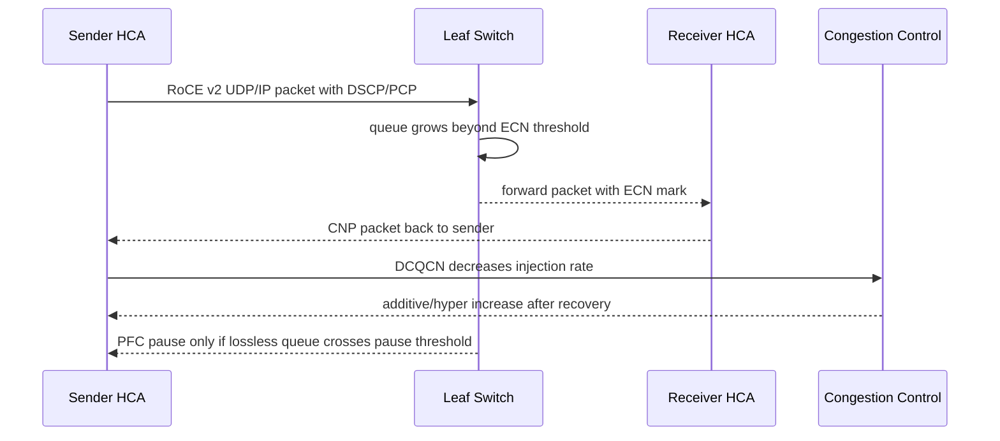

# 第 0d3b 章 · RoCE/InfiniBand、无损网络与拥塞控制

> **关联章节**：本章是 0d3 的网络 fabric 专章。RDMA verbs、MR/QP/CQ 的基础语义见 [0d3](0d3-rdma-roce-infiniband-and-gpudirect.md)，Linux TCP/MTU 见 [0d1](0d1-linux-network-stack-tcp-and-mtu.md)，NIC queue/offload 见 [0d2](0d2-nic-offload-queues-and-service-network-io.md)，NCCL 端到端诊断见 [0d4](0d4-nccl-collectives-and-network-diagnostics.md)。

## 1. RoCE / InfiniBand 到底是什么

RDMA 规定了应用、内存注册、队列和 NIC 如何协作，但 RDMA packet 还需要一张网络把两端 HCA 连起来。**RoCE 和 InfiniBand 解决的就是 RDMA 数据包跑在什么 fabric 上，以及这张 fabric 如何寻址、路由、隔离和处理拥塞。**

InfiniBand 是专用 RDMA fabric。它有自己的链路层、Subnet Manager、LID、PKey、SL/VL、链路宽度、速率和管理工具。它的优点是 RDMA 语义和运维边界集中，HPC/AI 训练中常见；代价是需要专用交换机、线缆和 IB 运维知识。

RoCE 是 RDMA over Converged Ethernet。RoCE v2 把 RDMA 封装在 UDP/IP 上，跑在以太网和 L3 网络中。它的优点是复用以太网生态、IP 路由、spine-leaf 和现有交换机体系；代价是以太网天然会丢包和排队，而 RDMA 对丢包和尾延迟非常敏感，所以必须正确配置 priority、PFC、ECN、CNP、DCQCN、MTU 和 ECMP。

最小对比：

| 问题 | InfiniBand 的答案 | RoCE v2 的答案 |
| --- | --- | --- |
| 承载 | IB 专用链路/fabric | UDP/IP over Ethernet |
| 寻址 | LID、GID、PKey | IP、GID/GID index、VLAN |
| 管理平面 | Subnet Manager、SA、IB tools | Linux netdev、IP route、switch QoS |
| 拥塞/无损 | IB credit、VL/SL、IB 拥塞控制 | PFC、ECN、CNP、DCQCN |
| 常见错误 | SM、LID、PKey、link width/speed | GID index、MTU、DSCP/PCP、PFC/ECN |

因此，本章不是重复 RDMA verbs，也不是讲 GPU。它专门回答：**RDMA packet 在网络里怎么走，为什么会因为 MTU、GID、PFC、ECN、SM 或 PKey 配错而 timeout、retry 或拖慢 NCCL。**

## 2. 第一性原理拆解 + 学习大纲

### 拆 — 不可化简的问题

RDMA 把数据面从内核协议栈和对端 CPU 中移走，让 NIC 直接执行远端内存访问。这带来一个不可化简的问题：**当传输栈不再依赖 TCP 的逐流丢包恢复，fabric 必须怎样承载、寻址、路由、隔离、拥塞反馈和观测，才能让大规模 GPU 训练里的 RDMA 流量既快又不把网络拖入全局暂停？**

RoCE v2 和 InfiniBand 都能承载 RDMA，但责任边界不同。RoCE v2 复用以太网、IP、UDP、VLAN、DSCP、ECMP 和交换机队列；InfiniBand 使用专用 fabric、Subnet Manager、LID、PKey、SL/VL 和 IB 管理工具。因此排障不能只问“RDMA 通不通”，必须问：这个 QP 用什么 GID、什么优先级、什么 MTU、什么路径、什么拥塞反馈、什么隔离域、什么管理平面。

### 推 — 从目标推出机制

从“RDMA 不能像 TCP 一样靠大量丢包后恢复”推出 lossless 或 near-lossless fabric；从“以太网本身可能丢包”推出 RoCE 的 PFC、ECN、CNP、DCQCN 组合；从“PFC 会暂停链路”推出只对少数 RDMA priority 开启 PFC，而不是全网全优先级无损；从“拥塞要在丢包前反馈”推出交换机 ECN 标记、接收端 CNP 生成、发送端 DCQCN 降速。

从“RoCE v2 是 UDP/IP”推出 GID index、VLAN、DSCP、PCP、routing、ECMP hash、path MTU 都是数据面的一部分；从“InfiniBand 是专用 fabric”推出 SM 分配 LID、维护路由、管理 PKey、暴露链路宽度/速率和 fabric counter；从“训练流量是 incast 和同步 burst”推出要关注 buffer、队列水位、HOL blocking、ECMP 极化和 pause storm。

### 绘 — RoCE v2 拥塞反馈链路



### 导 — 本章读完后你应该能回答

1. RoCE v1、RoCE v2 和 InfiniBand 在承载、寻址、路由、管理平面上分别差在哪里？
2. GID、GID index、RoCE v2 UDP/IP、VLAN、DSCP、PCP、priority 如何共同决定一条 RDMA 流的网络行为？
3. PFC、ECN、CNP、DCQCN 的工作链路是什么，为什么 lossless 不是越多越好？
4. MTU、path MTU、ECMP hash、incast、buffer、head-of-line blocking 如何把小错误放大成训练 timeout？
5. InfiniBand 中 SM、LID、PKey、SL、VL、link width/speed 分别解决什么问题？
6. 如何用 `show_gids`、`ibv_devinfo`、`rdma link`、`ip -d link`、`ethtool -S`、`perfquery`、`ibstat`、`iblinkinfo`、`ibnetdiscover`、`sminfo` 建立证据链？
7. RoCE/IB 变更如何设计 SOP，避免一次调参把更大范围的 fabric 带入风险？

## 3. RDMA Fabric 的数据面与控制面

RDMA fabric 可以分成四层：端口与链路、寻址与路径、隔离与 QoS、拥塞反馈。第一层包括 HCA 端口、交换机端口、线缆、FEC、链路速率、链路宽度、MTU；第二层在 RoCE 中是 GID/IP/VLAN/ECMP，在 IB 中是 LID/SL/VL/SM 路由；第三层在 RoCE 中是 VLAN、PCP、DSCP、TC、priority、PFC，在 IB 中是 PKey、SL、VL；第四层在 RoCE 中主要是 PFC、ECN、CNP、DCQCN，在 IB 中是 credit、VL/SL、IB congestion control 和 fabric counter。

训练网络最常见的误判是把这四层混在一起。例如 `ibv_devinfo` 显示端口 `PORT_ACTIVE` 只说明 HCA 端口起来了，不说明 GID index 正确，不说明 DSCP 被交换机映射到 RDMA priority，不说明 ECN 早于 PFC，也不说明 ECMP 没有热点。

## 4. RoCE v1、RoCE v2 与 InfiniBand 总览

RoCE v1 是二层以太网封装，通常局限在同一个 L2 broadcast domain。RoCE v2 是 UDP/IP 封装，能够经过 L3 路由，适合 spine-leaf 以太网 fabric。InfiniBand 不是以太网封装，而是专用链路层和管理平面。

| 维度 | RoCE v1 | RoCE v2 | InfiniBand |
| --- | --- | --- | --- |
| 承载 | Ethernet L2 | UDP/IP over Ethernet | IB link/fabric |
| 路由范围 | L2 域内 | L3 可路由 | IB subnet 内由 SM 管理 |
| 关键地址 | MAC、GID | IP、UDP、GID | LID、GID、PKey |
| 管理平面 | 以太网/VLAN/交换机配置 | IP routing、QoS、ECMP、交换机配置 | Subnet Manager、SA、IB tools |
| 拥塞控制 | PFC 为主 | PFC、ECN、CNP、DCQCN | credit、VL/SL、IB congestion control |
| 常见风险 | L2 范围和 VLAN | GID index、DSCP/PCP、ECMP、ECN | SM、LID、PKey、链路质量 |

RoCE v2 的优点是利用以太网运维体系，代价是配置面更宽：Linux netdev、VLAN、ToS、DSCP、switch QoS、PFC、ECN、routing、ECMP、NIC profile 都会影响 RDMA。InfiniBand 的优点是 RDMA fabric 语义集中，代价是需要理解 IB 管理域：SM 是否唯一且稳定、PKey 是否一致、LID 是否分配、link width/speed 是否符合预期、VL/SL 映射是否合理。

## 5. RoCE v2 Packet：从 Verbs 到以太网

应用提交 verbs WR 时，看到的是 QP、remote QPN、remote address、rkey、AH 或连接参数。落到 RoCE v2 数据面时，包会成为以太网帧里的 IP/UDP/RoCE payload。

```text
verbs WR
  -> HCA QP context
  -> RoCE BTH/RETH/AETH payload
  -> UDP destination port 4791
  -> IPv4/IPv6 source/destination address
  -> DSCP/ECN bits
  -> Ethernet VLAN tag and PCP
  -> switch queue, PFC, ECN, ECMP
```

GID index 不是装饰项。它选择的是本地 HCA 端口上的某个 GID 表项。不同 GID 表项可能对应 IPv4-mapped IPv6、IPv6、不同 VLAN、不同 RoCE version、不同 netdev。NCCL、UCX、MPI 或自写 verbs 程序如果选错 GID index，QP 可能能建起来，但包走到错误 VLAN、错误源 IP、错误 priority 或不可达路径。

## 6. GID 与 GID Index

GID 是 128-bit 地址标识，在 RoCE 中通常由 IP 地址映射而来。`show_gids` 会列出每个 HCA 端口的 GID 表，关键是同时看设备、端口、index、GID、IP、RoCE version 和 netdev。

| 字段 | 含义 | 排障价值 |
| --- | --- | --- |
| DEV | HCA 设备，如 `mlx5_0` | 确认 NCCL/UCX 选的 HCA |
| PORT | HCA 端口 | 多端口卡容易混淆 |
| INDEX | GID index | 应用配置常用这个数字 |
| GID | 128-bit GID | 可识别 IPv4-mapped 地址 |
| IPv4 | 对应 IPv4 | 确认源 IP/VLAN |
| VER | RoCE v1/v2 | v1/v2 不匹配会失败 |
| NETDEV | Linux netdev | 对应 `ibdev2netdev` 和 `ip link` |

常见判断命令：

```bash
show_gids
ibdev2netdev
ibv_devinfo -v
rdma link show
ip -br addr
ip -d link show <iface>
```

如果训练使用 `NCCL_IB_GID_INDEX=3`，不要只确认“3 存在”。要确认 index 3 在所有节点上都对应同一个 RoCE version、同一业务 VLAN、同一地址族和同一 routing domain。集群中不同镜像、不同固件、不同 netplan 或不同 VLAN 子接口顺序，可能让同一个 index 在不同机器上含义不同。

## 7. VLAN、DSCP、PCP、Priority

RoCE 里的“优先级”不是单个字段。应用或 RDMA CM 可能设置 ToS/traffic class；IP 头里有 DSCP 和 ECN bits；以太网 VLAN tag 里有 PCP；交换机会把 DSCP/PCP 映射到内部 traffic class 或 priority group；NIC 会把 priority 映射到 PFC-enabled 队列、DCQCN profile 或 ETS bandwidth group。

```text
Application ToS / rdma_cm traffic_class
  -> IP DSCP + ECN capable transport bits
  -> switch DSCP-to-TC map
  -> egress queue / priority group
  -> optional VLAN PCP rewrite
  -> NIC priority / PFC / CNP handling
```

典型风险：

1. 主机打了 DSCP，交换机没有 trust DSCP，包进了 default queue。
2. 交换机 trust PCP，但主机没有 VLAN tag，PCP 不存在。
3. RDMA priority 开了 PFC，返回 CNP 的 priority 没配对，反馈被普通队列拥塞。
4. 不同 leaf 的 DSCP-to-queue 映射不同，同一 job 跨 rack 后行为不一致。
5. 管理流量、存储流量和 RDMA 流量共享同一 lossless priority，局部拥塞传播范围扩大。

## 8. PFC：按优先级暂停，不是全局可靠性

PFC 是 IEEE 802.1Qbb Priority Flow Control。它允许接收端按 priority 发 pause frame，让对端停止发送该 priority 的流量。PFC 的目标不是提高吞吐，而是在短时 buffer 压力下避免 lossless priority 丢包。它是逐跳机制，不是端到端拥塞控制。

PFC 的副作用来自“暂停”这个动作本身。当一个下游端口拥塞，上游端口被 pause，上游再积压并 pause 更上游，拥塞可能沿 fabric 反向传播。如果多个业务共享 lossless priority，互不相关的流也会一起停，这就是 pause storm 和 head-of-line blocking 的根源。

### 8.1 PFC pause storm：自我强化与 fabric 死锁

普通的"PFC 偶发"是健康的——burst 短时压制、ECN 来不及降速时，PFC 暂停几微秒后恢复。**真正的灾难是 pause storm**：

1. 一个下游端口出现真实拥塞（如 incast、热点 spine、慢节点 GPU 处理 RDMA 不及时）→ 它向上游发 pause
2. 上游入口 buffer 积压 → 上游也向**它的**上游发 pause
3. 拥塞反向沿 fabric 传播；同 priority 的其他无关流也被一起暂停
4. 在某些拓扑上（特别是非严格树形 + 循环路径），暂停信号绕回最初的拥塞点 → **pause loop / pause deadlock**：每个端口都在等其他端口先发数据，整个 priority 的所有流量永久卡死
5. 表现：NCCL timeout、verbs retry exceeded、整个训练 job 全节点同时 hang，但 GPU 利用率显示 0%、链路 link state 仍然 UP

### 8.2 PFC watchdog：必须配置的停损机制

NIC 和交换机都提供 PFC watchdog 来检测异常持续的 pause 状态并强制恢复。**没有 watchdog 配置的 RoCE 集群会在 incast / 热点场景中遇到无法自愈的 fabric 死锁**。

| 厂商 / 平台 | 配置位置 | 关键参数 | 触发后的动作 |
|---|---|---|---|
| Mellanox / NVIDIA NIC（mlx5） | `mlnx_qos`、`ethtool --show-priv-flags` | `pfc_stall_prevention` / `tx_pause_storm` | 进入 pfcdead 状态后丢弃该 priority 的发送队列直至恢复 |
| Mellanox / NVIDIA Spectrum 交换机 | NOS（Cumulus / SONiC / NVOS） | `dcb pfc watchdog action drop`，`detection_time`、`restoration_time` | 检测到端口持续 pause 超阈值（如 200 ms）后，对该端口该 priority 临时切到 lossy（丢包），等待 `restoration_time` 后再尝试恢复 |
| Arista / Cisco 等 | EOS / NX-OS | `priority-flow-control watch-dog action drop` | 同上 |
| Broadcom Tomahawk-based 交换机 | SONiC / SAI | `pfcwd start` + `--detection-time --restoration-time --action drop` | SONiC 默认推荐打开 `pfcwd` |

### 8.3 PFC 配置原则（含 watchdog）

1. 只给真正需要 near-lossless 的 RDMA traffic class 开 PFC。
2. 不要把所有 priority 都配置成 lossless。
3. ECN 阈值应早于 PFC pause 阈值触发。
4. PFC buffer 要按链路速率、线缆距离、pause reaction time 和 MTU 计算。
5. 交换机 ingress/egress 队列水位要纳入变更验收。
6. **PFC watchdog 必须开启**，`detection_time` 通常设 100-200 ms（足够覆盖正常 burst，又能快速止损死锁），`action=drop`（让该 priority 临时变 lossy 而不是永久死锁）。
7. **NIC 侧也要开 `pfc_stall_prevention`**：交换机 watchdog 只解决"出方向"死锁，NIC 看到自己被 pause 长时间不释放也要能强制 drop。
8. 监控 `ethtool -S <iface> | grep -i pause` 的 tx/rx pause counter 增量，以及 `pfcwd show stats` 的 storm-detected 事件——pause counter 持续上升或频繁 watchdog 触发是 fabric 设计或 incast 严重的信号。

> [!DANGER]
> **没有 PFC watchdog 的 RoCE 集群在生产 LLM 训练里几乎一定会出事**：MoE 的 All-to-All、checkpoint 大批量上传、跨 rail 流量不均都能在某些 ECMP hash 不幸时制造 pause loop。修复 deadlock 通常只能 reset 涉事端口或重启 NIC，整个训练 job 必须从最近 checkpoint 重启。把 watchdog 配置加入 fabric 上线 checklist，比追求"PFC counter 永远为零"更实际。

## 9. ECN、CNP 与 DCQCN

ECN 是在 IP header 中标记拥塞，而不是丢包。RoCE v2 里交换机看到 RDMA 队列超过 ECN threshold 后，对经过的 packet 标 ECN；接收端 HCA 收到带 ECN 的 RoCE packet 后生成 CNP；发送端 HCA 收到 CNP 后，DCQCN 降低发送速率，随后按算法逐步恢复。

```text
queue grows
  -> ECN mark
  -> receiver generates CNP
  -> sender DCQCN rate decreases
  -> queue drains
  -> PFC should be rare
```

如果 PFC 比 ECN 更早频繁触发，说明拥塞控制太晚或 buffer/阈值设计不合理。如果 ECN marks 很多但 CNP 很少，可能是接收端/NIC 没生成 CNP、CNP priority 被阻塞、或者计数器口径不同。如果 CNP 很多但发送速率不降，可能是 DCQCN profile 没启用、priority 映射错误、驱动/固件参数不生效。

## 10. Lossless 不是越多越好

“无损网络”在 RoCE 语境里更准确地说是：对少数 RDMA priority 尽量避免丢包，并在丢包前通过 ECN/CNP/DCQCN 降速。它不是全网所有流量都不能丢，更不是把所有 queue 都开 PFC。

全局 lossless 会放大三个问题。第一，head-of-line blocking：某个拥塞流暂停了同 priority 的其他流。第二，拥塞扩散：pause frame 是逐跳传播，局部热点会影响更大范围。第三，故障隐蔽：丢包变少但延迟和 timeout 增加，应用只看到 NCCL timeout 或 verbs retry exceeded。

一个健康 RoCE fabric 的目标不是 pause counter 永远为零。更实际的目标是：ECN/CNP 在 burst 早期出现，PFC 低频且局部，drop/retry 极低，作业带宽方差可控。

## 11. MTU 与 Path MTU

RoCE 有多层 MTU：Linux netdev MTU、交换机端口 L2 MTU、RoCE QP path MTU、HCA port active MTU。任一层不一致，都可能表现为吞吐低、retry、timeout 或只在大消息出错。

```bash
ip link show <iface>
ip -d link show <iface>
ibv_devinfo | egrep 'hca_id|port:|active_mtu|link_layer'
rdma link show
ethtool -k <iface>
```

RoCE v2 是 UDP/IP，实际帧还包含 Ethernet、VLAN、IP、UDP、RoCE headers。如果你想承载 4096 byte RDMA payload，交换机 L2 MTU 不能只按 IP MTU 等值理解。在混合 VLAN、overlay 或交换机端口 profile 中，MTU 不一致尤其常见。

path MTU 还会影响性能。太小会增加 packet rate、加重交换机队列和 HCA packet processing；太大则要求所有路径一致，并可能增加单包占用 buffer 的时间。

## 12. ECMP、Hash 与路径极化

RoCE v2 能跨 L3 路由，所以 spine-leaf 网络常依赖 ECMP 分摊流量。但 ECMP 是基于 hash 字段选择路径，不是逐包平均分配。如果 hash 字段不包含足够变化，或者 RDMA 流数量少于可用路径，就会出现路径极化。

RDMA 流量还有一个特征：单个 QP 或少量 QP 就可能承载很大带宽。这会让“平均链路利用率不高，但某些 spine link 拥塞”的现象很常见。

检查思路：

1. 比较每条 spine/leaf uplink 的利用率和 ECN/PFC counter。
2. 确认 ECMP hash 是否包含 UDP source/destination port、IP 五元组。
3. 确认 RoCE UDP source port 是否有足够 entropy。
4. 对比单 job、双 job、多 job 的热点是否固定。
5. 使用 per-port queue counter，而不是只看设备级总吞吐。

## 13. Incast、Buffer 与 HOL Blocking

训练 collective 经常形成 incast。例如多个 rank 同时向一个 rank 或一个交换机下游端口发送。在 AllReduce、ReduceScatter、parameter server、checkpoint 汇聚、MoE token exchange 中，都可能出现短时间多对一。

Incast 的问题不只是总带宽超了。它会制造瞬时队列峰值，触发 ECN、PFC、drop 或 HCA retry。如果 PFC 配置过宽，incast 会把一条下游热点扩散到多个上游端口。

buffer 配置要回答三个问题：

1. 每个 lossless priority 预留多少 headroom？
2. 共享 buffer 与 dedicated buffer 如何分配？
3. ECN threshold、PFC XOFF/XON threshold、drop threshold 的先后关系是什么？

理想顺序是 ECN 先标记，DCQCN 降速，队列开始回落。PFC 只在短时突发超过控制回路反应能力时兜底。

## 14. InfiniBand Fabric 核心对象

InfiniBand fabric 有自己的管理平面。Subnet Manager 负责发现拓扑、分配 LID、计算路由、维护 subnet；Subnet Administrator 提供查询服务。HCA 端口进入 Active 状态并不等于所有分区和路径都正确。

| 对象 | 含义 | 排障价值 |
| --- | --- | --- |
| SM | Subnet Manager | 没有 SM 或 SM 不稳定会导致 LID/路由异常 |
| LID | Local Identifier | IB subnet 内转发地址 |
| PKey | Partition Key | 隔离通信域，类似 fabric 分区 |
| SL | Service Level | 服务等级，映射到 VL 或路径策略 |
| VL | Virtual Lane | 链路层虚拟通道，缓解 HOL blocking |
| GUID | 全局唯一设备/端口标识 | 拓扑和设备定位 |
| Link width | x1/x2/x4 等 | 宽度降级会直接降带宽 |
| Link speed | SDR/DDR/QDR/FDR/EDR/HDR/NDR 等 | 速率不符常见于线缆或端口配置 |

IB 排障的第一步通常不是 `ping`，而是 fabric 状态。

```bash
ibstat
sminfo
ibv_devinfo
ibnetdiscover
iblinkinfo
perfquery
```

## 15. Subnet Manager、LID 与路由

IB 中每个端口需要 LID 才能在 subnet 内通信。SM 负责分配 LID 并建立转发表。如果 SM 缺失，端口可能停留在 Init 或 Armed。如果有多个 SM 且优先级配置混乱，可能发生 master 切换，导致短时路由变化或 fabric 抖动。

```bash
sminfo
ibstat
ibv_devinfo | egrep 'state|phys_state|base lid|sm lid|active_mtu|active_width|active_speed'
ibnetdiscover > fabric.topo
iblinkinfo
```

看 `base lid` 是否为非零，看 `sm lid` 是否存在且稳定，看端口状态是否 `Active`、物理状态是否 `LinkUp`，看 `iblinkinfo` 中是否有降速、降宽、逻辑链路异常或大量 error。

## 16. PKey、SL 与 VL

PKey 是 IB 的分区机制。通信双方必须在相容 PKey 分区中，QP 配置的 PKey index 必须指向正确 PKey。PKey 不一致时，应用可能看到连接失败、remote access error、retry exceeded 或 NCCL timeout。

SL 是 service level，可以映射到不同 VL 或路由策略。VL 是 virtual lane，它在链路层提供独立流控资源，用来缓解 HOL blocking。不要把 SL/VL 当成 RoCE 里的 DSCP/PCP 的简单同义词：它们都在做服务等级与队列隔离，但管理平面和实现模型不同。

```bash
ibv_devinfo -v | less
cat /sys/class/infiniband/<dev>/ports/<port>/pkeys/*
```

如果同一 job 的节点跨不同 PKey，RDMA 连接会出现非常像“网络随机不通”的症状。

## 17. IB Link Width、Speed 与 MTU

IB 链路带宽由 speed 和 width 共同决定。例如同样是 HDR，如果 width 从 x4 降到 x2，可用带宽会明显下降。降宽常见原因包括线缆、光模块、端口协商、交换机端口 profile、硬件故障。

`ibstat` 和 `ibv_devinfo` 会显示 active width、active speed、active MTU。`iblinkinfo` 能从 fabric 视角列出链路状态。`perfquery` 能看 symbol error、link error recovery、link downed、VL15 dropped 等 counter。

```bash
ibstat
iblinkinfo | egrep -i 'down|reduced|could not|error'
perfquery -x
perfquery -r <lid> <port>
```

IB MTU 不一致时，症状可能是某些路径性能低或连接参数协商失败。对于 verbs RC QP，path MTU 是 QP 转到 RTR 时的重要参数。不要只看一端 active MTU，要确认端到端路径和应用选择的 MTU。

## 18. 命令观测：主机侧最小证据包

RoCE 主机侧建议一次收集：

```bash
hostname
uname -a
ibv_devinfo -v
show_gids
ibdev2netdev
rdma link show
rdma resource show
ip -br link
ip -br addr
ip -d link show <iface>
ethtool -i <iface>
ethtool -S <iface>
```

IB 主机侧建议一次收集：

```bash
hostname
ibstat
ibv_devinfo -v
sminfo
ibnetdiscover
iblinkinfo
perfquery -x
```

应用侧同时收集：

```bash
env | egrep 'NCCL|UCX|FI_|RDMAV|MLX'
dmesg -T | egrep -i 'mlx|rdma|ib|roce|cq|qp|syndrome'
journalctl -k --since '30 min ago' | egrep -i 'mlx|rdma|ib|roce'
```

证据包要包含“好节点”和“坏节点”的对比。只收坏节点很难判断是配置异常、拓扑差异还是正常计数器波动。

## 19. `ethtool -S` 与 RoCE Counter 读法

不同厂商和不同驱动 counter 名称不同，但读法相似。

| 类别 | 例子 | 含义 |
| --- | --- | --- |
| pause | `rx_prio*_pause`, `tx_prio*_pause` | PFC 是否触发，哪个 priority 触发 |
| ECN/CNP | `np_cnp_sent`, `rp_cnp_handled`, `ecn_marked` | 拥塞反馈是否形成闭环 |
| drops | `rx_discards`, `tx_discards`, `out_of_buffer` | 近无损队列是否仍在丢 |
| errors | CRC、symbol、FCS | 物理链路和帧错误 |
| RoCE | retry、timeout、out_of_sequence | RDMA transport 异常 |
| queue | per-priority/per-queue bytes、drops | 是否打到预期队列 |

读 counter 的原则：先确认 counter 是累计值还是速率；变更前后取两次 delta；分 priority 看，不只看总 pause；主机与交换机同一时间窗口对齐；把 counter 与作业 rank、HCA、端口、GPU 拓扑对应起来。

## 20. `perfquery` 与 IB Counter 读法

`perfquery` 读取 IB performance counter。常见关注项如下。

| Counter | 可能含义 | 下一步 |
| --- | --- | --- |
| `SymbolErrorCounter` | 物理链路问题 | 查线缆、模块、端口 |
| `LinkErrorRecoveryCounter` | 链路恢复 | 看是否持续增长 |
| `LinkDownedCounter` | 链路曾 down | 对齐作业失败时间 |
| `PortRcvErrors` | 接收错误 | 定位对端端口和链路 |
| `PortXmitDiscards` | 发送丢弃 | 看拥塞、VL、路由 |
| `VL15Dropped` | 管理 VL 丢包 | 关注 SM/SA 管理面压力 |
| `PortXmitWait` | 等待 credit | 可能拥塞或下游慢 |

IB 排障要把 counter 放回拓扑。`ibnetdiscover` 提供节点和端口关系，`iblinkinfo` 帮你看到哪条链路降速、down 或异常，`perfquery` 告诉你哪一端的哪个 port 在增长错误。三者合起来才是证据链。

## 21. Worked Example：GID Index 选错

现象：两台机器 `ib_write_bw` 单独跑有时成功，有时失败；NCCL 多机启动后报 `unhandled system error` 或 `retry exceeded`；部分节点能互通，跨 rack 失败。

第一步，看 GID 表：

```bash
show_gids
ibdev2netdev
ip -br addr
```

发现节点 A 的 `mlx5_0 port 1 index 3` 是业务 VLAN 的 RoCE v2 IPv4 GID；节点 B 的同一 index 却对应管理网 IP，业务 VLAN GID 在 index 4。

第二步，看应用配置：

```bash
env | grep NCCL_IB_GID_INDEX
env | grep UCX_IB_GID_INDEX
```

集群统一下发了 `NCCL_IB_GID_INDEX=3`。这在节点 A 正确，在节点 B 错误。

修复方式：

1. 不把 GID index 当作跨节点稳定常量，先统一 netdev/VLAN/GID 表生成规则。
2. 如果必须固定 index，验收脚本逐节点校验 index、RoCE version、IPv4、netdev、VLAN。
3. 在 NCCL/UCX 配置中同时约束 HCA 和业务接口，避免走管理网。
4. 变更后跑 `ib_write_bw`、`ib_read_bw`、`nccl-tests` 的跨 rack 矩阵。

关键结论：GID index 是本机 HCA 端口 GID 表下标，不是 fabric 全局语义。

## 22. Worked Example：PFC Pause Storm 与 ECN 太晚

现象：大规模 AllReduce 到 128 节点后 step time 周期性尖刺。NCCL 日志只看到 timeout 前的长时间无进展。主机没有明显丢包，但 `ethtool -S` 显示 RDMA priority 的 `rx_prio3_pause` 和 `tx_prio3_pause` 快速增长。交换机上某些 leaf uplink 的 PFC pause 增长扩散到多个端口。

第一步，确认是否 ECN 早于 PFC：

```bash
ethtool -S <iface> | egrep 'prio3|pause|cnp|ecn'
```

交换机 telemetry 显示队列接近满时才开始 ECN mark，随后马上触发 PFC XOFF。DCQCN 来不及降速，PFC 成为主要控制机制。进一步检查发现存储复制和 RDMA 训练共用 priority 3，且 priority 3 开了 PFC，一个 checkpoint burst 能 pause 训练流量。

修复方式：

1. 分离训练 RDMA 与存储复制的 traffic class。
2. 调低 ECN marking threshold，使 ECN 明显早于 PFC XOFF。
3. 根据链路速率和 MTU 重新计算 PFC headroom。
4. 校验 CNP counter 增长后发送端速率确实下降。
5. 用压力测试验证 PFC 从高频全局扩散变成低频局部兜底。

关键结论：PFC 频繁增长不是“lossless 工作良好”，而是拥塞控制闭环太晚或队列隔离错误。

## 23. Worked Example：IB SM、PKey、LID 与 MTU 不一致

现象：IB 集群重启交换机后，部分节点 `ibstat` 显示 Active，但 MPI/NCCL 跨节点失败；另一些节点能通信但带宽只有预期的一半。

第一步，看 SM 和 LID：

```bash
sminfo
ibstat
ibv_devinfo | egrep 'state|base lid|sm lid|active_mtu|active_width|active_speed'
```

发现部分节点 `base lid` 重新分配后正常，但有一组节点的 PKey index 指向旧分区。同一 job 的节点不在相同 PKey，QP 初始化时使用的 PKey index 在不同节点上对应不同值。

第二步，看 PKey、链路宽度和 MTU：

```bash
cat /sys/class/infiniband/mlx5_0/ports/1/pkeys/*
ibv_devinfo -v
iblinkinfo | egrep -i 'reduced|down|error'
perfquery -x
```

一条上联协商为低 width，且部分端口 active MTU 与预期不一致。

修复方式：

1. 确认唯一 master SM，固定 SM priority 与启动顺序。
2. 重新下发并校验 PKey 表，避免只校验 PKey index。
3. 修复降宽链路，替换可疑线缆或模块。
4. 统一 active MTU 与应用 path MTU。
5. 用 `ib_write_bw` 的节点矩阵和 `nccl-tests` 验证。

关键结论：IB 的端口 Active 只是入口，SM/LID/PKey/MTU/link width 必须一起看。

## 24. RoCE 变更 SOP

RoCE 变更要把主机、交换机、应用三侧同时纳入。

变更前：

1. 记录当前 NIC firmware、driver、OFED/rdma-core、kernel。
2. 导出 `show_gids`、`rdma link`、`ip -d link`、`ethtool -S` baseline。
3. 导出交换机 QoS、PFC、ECN、buffer、DSCP/PCP map、ECMP hash 配置。
4. 选择 canary 节点，覆盖同 leaf、跨 leaf、跨 rack。
5. 明确回滚条件：drop、PFC、CNP、带宽、p99 step time、timeout。

变更中：

1. 先改一组 leaf 或一小组节点。
2. 每一步都跑 `ib_write_bw`、`ib_read_bw`、`ib_send_bw` 的基本矩阵。
3. 再跑 `nccl-tests` 覆盖小消息、大消息、单节点、多节点。
4. 同步采集主机和交换机 counter delta。
5. 不在同一窗口同时修改 GID、MTU、PFC、ECN、DCQCN 多类参数。

变更后：

1. 比较 baseline 与新 counter。
2. 观察至少一个训练高峰周期。
3. 固化验收脚本。
4. 把 GID index、DSCP/PCP、priority、MTU 写入资产和作业模板。

## 25. IB 变更 SOP

IB 变更更关注 fabric 管理平面和物理链路。

变更前：

1. 记录 SM 位置、priority、版本、配置。
2. 保存 `ibnetdiscover` 拓扑。
3. 保存 `iblinkinfo` 链路宽度/速率状态。
4. 保存关键端口 `perfquery` baseline。
5. 导出 PKey 表和应用使用的 PKey index。

变更中：

1. 确认 master SM 稳定。
2. 每次拓扑或交换机变更后重新跑 `ibnetdiscover`。
3. 对比 LID 分配是否异常。
4. 检查 `VL15Dropped`、`PortXmitWait`、link error counter。
5. 用带宽矩阵验证跨 leaf、跨 spine、跨机柜路径。

变更后：

1. 确认所有端口 Active、speed/width 符合预期。
2. 确认 PKey 值一致，而不只是一致的 index。
3. 确认应用 path MTU 与 fabric active MTU 匹配。
4. 保留拓扑和 counter 快照供下一次事故对比。

## 26. 故障排查 Checklist

RoCE checklist：

1. HCA、port、netdev 是否与作业期望一致？
2. `show_gids` 中应用选择的 GID index 是否跨节点语义一致？
3. RoCE version 是否一致，是否都为 v2？
4. IP、VLAN、routing 是否可达，返回路径是否对称或至少可用？
5. Linux MTU、交换机 MTU、QP path MTU 是否一致？
6. DSCP/PCP 是否进入预期 priority？
7. PFC 是否只对 RDMA priority 开启？
8. ECN 是否早于 PFC，CNP 是否形成闭环？
9. ECMP hash 是否有足够 entropy？
10. 主机与交换机 drop、pause、CNP、ECN counter 是否对应同一时间窗口？

IB checklist：

1. SM 是否存在且 master 稳定？
2. 端口是否 Active，phys state 是否 LinkUp？
3. LID、SM LID 是否正常？
4. PKey 值是否一致，PKey index 是否正确？
5. active MTU、path MTU 是否一致？
6. link width/speed 是否降级？
7. `perfquery` 是否有 symbol、link recovery、VL15 dropped、xmit wait 异常？
8. `ibnetdiscover` 拓扑是否符合预期？
9. `iblinkinfo` 是否报告 down、reduced 或 error link？
10. 应用使用的 HCA/port 是否与 fabric 分区一致？

## 27. 练习

1. 给定三台 RoCE 节点的 `show_gids` 输出，找出为什么统一设置 `NCCL_IB_GID_INDEX=3` 会让其中一台走错 VLAN。
2. 设计一个 RoCE canary 测试，要求能发现 DSCP 没被交换机 trust 的问题。
3. 解释为什么 PFC pause counter 快速增长时，不能直接得出“网络没有丢包所以没问题”的结论。
4. 给出 ECN threshold、PFC XOFF threshold、drop threshold 的合理触发顺序，并说明原因。
5. 一个 64 节点 job 只有跨 rack 慢，同 leaf 正常。列出 ECMP 和 spine uplink 的排查步骤。
6. IB 中 `ibstat` Active，但应用连接失败。写出 SM、LID、PKey、path MTU 的检查顺序。
7. `perfquery` 显示某端口 `PortXmitWait` 高但 symbol error 为零。列出两个可能原因。
8. 设计 RoCE/IB 事故证据包目录结构，要求能支持事后对比好坏节点。
9. 解释为什么同一个 PKey index 在不同节点上不一定安全。
10. 把本章 checklist 改写成上线前自动验收脚本的伪代码。

## 28. 本章结论

RoCE v2 的核心不是“UDP/IP 上跑 RDMA”这一句话，而是 GID、VLAN、DSCP、PCP、priority、PFC、ECN、CNP、DCQCN、MTU、ECMP 和 buffer 共同形成的 fabric 行为。

InfiniBand 的核心不是“专用网络更快”这一句话，而是 SM、LID、PKey、SL/VL、link width/speed、MTU 和 IB counter 共同形成的受管理 fabric。

训练集群里，RDMA 网络问题很少只停留在单点。GID index 错会变成跨 rack 不通；ECN 太晚会变成 PFC pause storm；PKey 或 LID 问题会伪装成应用 timeout。正确的工程习惯是先拆层，再对齐配置，再看 counter delta，最后用带宽矩阵和真实 collective 验证。
