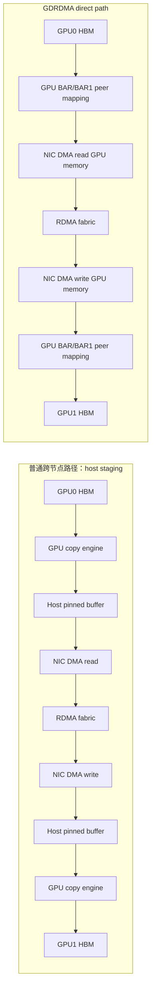

# 第 0d3c 章 · GPUDirect RDMA、GPU/NIC 拓扑与诊断

> **关联章节**：本章是 GPUDirect RDMA 专章，聚焦 GPU HBM 到 NIC 的跨节点快路径、PCIe/NUMA 拓扑约束、NCCL/UCX/MPI 的 CUDA buffer 使用和生产排障。RDMA verbs、RoCE/IB、PFC/ECN/MTU 的通用背景见 [0d3](0d3-rdma-roce-infiniband-and-gpudirect.md)，NUMA、PCIe、DMA 和 pinned memory 的基础见 [0b3](0b3-numa-pcie-dma-and-pinned-memory.md)，NCCL collective 诊断见 [0d4](0d4-nccl-collectives-and-network-diagnostics.md)。

## 1. GPUDirect RDMA 到底是什么

GPUDirect RDMA 是 RDMA 的一个关键扩展：**在 peer memory / BAR 映射、驱动授权、地址翻译和 GPU/NIC 拓扑都允许时，让 RDMA NIC 对 GPU HBM 对应的可 DMA 映射发起读写，从而避免先把 GPU 数据复制到 host pinned memory 做 host staging。**

没有 GPUDirect RDMA 时，跨节点 GPU 通信通常要经过 host staging：

```text
GPU HBM -> host pinned memory -> NIC -> network -> peer NIC -> host pinned memory -> peer GPU HBM
```

这个路径是正确的，但它会额外占用 GPU copy engine、PCIe、host DRAM 带宽和 CPU/驱动调度资源。启用 GPUDirect RDMA 后，理想路径变成：

```text
GPU HBM <-> NIC RDMA engine <-> network <-> peer NIC <-> peer GPU HBM
```

这并不只是 NCCL 的一个环境变量。它要求 GPU driver、RDMA driver、`nvidia_peermem`、HCA、IOMMU/ACS/ATS、PCIe P2P、BAR/BAR1 映射、容器设备权限和通信库都配合。任何一层不成立，通信库仍可能接受 CUDA pointer，但实际退回 host staging 或 socket fallback。

GPUDirect RDMA 和前两章的关系：

| 层次 | 负责的问题 | 本章如何使用 |
| --- | --- | --- |
| RDMA verbs | NIC 如何访问注册内存 | CUDA device memory 也必须能被注册/映射成 NIC 可访问的 MR |
| RoCE/IB | RDMA packet 如何穿过 fabric | GDRDMA 只优化 GPU/NIC 内存路径，不替代 MTU/PFC/ECN/GID/SM |
| GPUDirect RDMA | NIC 如何直接访问 GPU HBM | 关注 GPU/NIC 拓扑、peer memory、BAR、IOMMU、容器权限和 fallback |

一句话：**RDMA 让 NIC 直接访问内存；RoCE/IB 决定这些 RDMA packet 怎么过网络；GPUDirect RDMA 让这块“内存”可以是 GPU 显存。**

## 2. 第一性原理拆解 + 学习大纲

### 拆：不可化简的问题

分布式训练的跨节点通信经常从 GPU memory 出发，也经常落到另一块 GPU memory。不可化简的问题不是“网络带宽够不够”，而是：

**NIC 是否能在正确授权、正确地址翻译、正确 PCIe 路径和正确软件栈下，直接 DMA 访问 GPU HBM 对应的虚拟地址，而不把数据先搬到 host pinned memory。**

这句话拆成五个约束：

1. buffer 约束：通信库拿到的是 CUDA device pointer，不是普通 host pointer。
2. 注册约束：RDMA NIC 只能访问已注册、已 pin、已映射并有 key 的 memory region。
3. 地址约束：GPU virtual address、GPU physical backing、PCIe bus address、IOMMU IO virtual address 不是一回事。
4. 拓扑约束：GPU 和 HCA 可能同 PCIe switch、同 root complex、跨 root、跨 socket，路径成本差异很大。
5. 权限约束：kernel module、driver、OFED、容器 device、memlock、IPC_LOCK、NVIDIA runtime 任一层缺失都会退化。

### 推：从问题推出机制

如果 NIC 不能直接读写 GPU memory，通信库只能走 staging：

1. GPU copy engine 把 HBM 复制到 host pinned memory。
2. NIC DMA 读取 host pinned memory 并发往网络。
3. 对端 NIC DMA 写入 host pinned memory。
4. 对端 GPU copy engine 再把 host pinned memory 复制到 HBM。

如果要避免这两次 host staging，就必须让 NIC verbs registration 能识别 CUDA pointer，让 GPU driver 暴露 peer memory 映射，让 HCA 建立可 DMA 的页表，并让 PCIe fabric 允许 P2P transaction。于是推出 `nvidia_peermem`、BAR/BAR1 映射、peer memory client、DMA mapping、MR key、IOMMU/ACS/ATS 策略和拓扑 locality 这些机制。

### 绘：普通路径与 GDRDMA 快路径



### 导：本章读完后你应该能回答

1. 为什么 CUDA buffer 不能自动等价于 RDMA MR？
2. `nvidia_peermem`、BAR1、PCIe P2P、IOMMU、ACS、ATS 分别卡在哪一层？
3. `nvidia-smi topo -m` 里的 `PIX`、`PXB`、`PHB`、`NODE`、`SYS` 对 GPU/NIC 绑定意味着什么？
4. NCCL、UCX、MPI 拿到 CUDA buffer 后如何选择 GPUDirect RDMA、host staging 或 socket fallback？
5. 如何从 `NCCL_DEBUG`、`UCX_LOG_LEVEL`、`ib_write_bw --use_cuda` 判断 direct path 是否真的启用？
6. 容器和 Kubernetes 为什么经常让裸机可用的 GDRDMA 退化？
7. 性能曲线如何区分 host staging、跨 socket HCA、copy engine 饱和、fabric 拥塞和 registration 抖动？

## 3. GPUDirect RDMA 在系统栈里的位置

GPUDirect 是 NVIDIA 对 GPU 与外设直接交互的一组能力名。GPUDirect RDMA 特指第三方 PCIe 设备，最常见是 Mellanox/NVIDIA ConnectX HCA，通过 RDMA verbs 直接访问 GPU memory。它不是 NCCL 独有能力，UCX、MPI、NVSHMEM、GDS 等栈也可能使用相近的 peer memory 机制。

典型训练调用链如下：

```text
PyTorch / JAX / TensorFlow
  -> NCCL / UCX-Py / MPI / NVSHMEM
  -> CUDA pointer detection
  -> verbs memory registration
  -> nvidia_peermem peer memory callback
  -> HCA MTT/MPT/IOMMU mapping
  -> PCIe read/write to GPU BAR aperture
  -> RDMA packets over IB or RoCE
```

两个边界要分清：RDMA 是网络和 HCA 能力，GDRDMA 是 RDMA 访问 GPU memory 的能力；CUDA-aware MPI 或 CUDA-aware UCX 只说明库能接受 CUDA pointer，不保证最终一定走 GDRDMA。

## 4. 普通路径：GPU HBM 到 host pinned 再到 NIC

没有 GDRDMA 时，通信库仍然可以支持 CUDA buffer。它会把 device memory 分块搬到 host pinned buffer，再让 NIC 访问 host buffer。这个路径正确但昂贵。

```text
send side:
  cudaMemcpyAsync(host_pinned <- gpu_buffer)
  wait or pipeline copy completion
  ibv_post_send(host_pinned MR)
  NIC DMA reads host DRAM

receive side:
  NIC DMA writes host_pinned MR
  poll CQ
  cudaMemcpyAsync(gpu_buffer <- host_pinned)
```

host staging 的成本来自四处：PCIe 上多走两段 GPU <-> host DMA；host DRAM 带宽被通信占用；GPU copy engine 被 D2H/H2D 占用；pipeline 需要额外同步，放大小消息 latency。大 buffer 时，有效带宽通常被 `min(GPU D2H, host DRAM, NIC line rate, H2D)` 限制。

## 5. GDRDMA direct path 的数据面

GDRDMA 目标是让 HCA 对 GPU memory 执行 DMA read/write。它不是把 HBM 变成普通系统内存，而是建立一条授权过的 peer mapping。

```text
CUDA device pointer
  -> communication library detects pointer type
  -> ibv_reg_mr() or registration cache asks verbs to register
  -> peer memory client recognizes GPU VA range
  -> NVIDIA driver pins GPU pages and exposes DMA mapping
  -> HCA programs memory translation and access key
  -> NIC issues PCIe read/write toward GPU
```

关键点：HCA 看到的是可 DMA 的 bus/I/O virtual address，不是 CUDA 虚拟地址本身；GPU memory registration 有生命周期；NIC 直接写 GPU memory 不等价于 GPU kernel 已经看到数据，通信库仍然要处理 CUDA stream、event、memory ordering；跨 socket 或被 ACS 强制上行到 root complex 时，direct path 仍可能慢。

## 6. nvidia_peermem 与 peer memory

`nvidia_peermem` 是 NVIDIA GPU driver 与 RDMA core/OFED 之间的 peer memory 模块。它让 verbs registration 遇到 GPU memory 时，可以调用 NVIDIA driver 完成 pin、map、unmap、invalidate 等动作。

检查项：`lsmod | egrep 'nvidia_peermem|nv_peer_mem|mlx5_core|ib_core'`、`modinfo nvidia_peermem`、`dmesg | egrep -i 'nvidia_peermem|peer.*mem|mlx5'`。

实践边界：

| 组件 | 作用 | 失败表现 |
| --- | --- | --- |
| `nvidia_peermem` | 连接 NVIDIA driver 与 RDMA peer memory 注册 | `ib_write_bw --use_cuda` 失败或退到 host |
| `mlx5_core` / `mlx5_ib` | HCA PCIe、verbs、MR、QP、CQ | 没有 RDMA device，NCCL 退到 socket |
| RDMA core / OFED | verbs ABI、kernel/user library | `ibv_reg_mr` 失败，版本 ABI 不匹配 |
| CUDA driver | CUDA VA、GPU page pin、BAR 映射 | CUDA pointer 识别失败或映射失效 |

历史上有 `nv_peer_mem` out-of-tree 模块；新栈通常使用 `nvidia_peermem`。生产排障时不要只看模块名，还要核对 driver、CUDA、OFED、kernel 的组合是否被厂商支持。

## 7. BAR、BAR1 与 GPU memory aperture

PCIe 设备通过 BAR 暴露 MMIO 或 memory aperture。GPU 的 BAR1 常用于让 CPU 或 peer device 访问 GPU memory 的窗口。GDRDMA 并不要求把全部 HBM 永久映射进 BAR1；驱动和 HCA 会按页、窗口和访问模式建立映射。

常见误解：BAR1 size 小于 HBM size 不等于 GDRDMA 不可用；BAR1 可见不等于 HCA 一定能访问，还要看 peer memory、IOMMU、ACS 和拓扑；`nvidia-smi -q` 看到 BAR1 usage 增加可以作为线索，但不能单独证明性能路径。可用 `nvidia-smi -q -d MEMORY` 和 `lspci -vv -s <bdf>` 查看 BAR、Resizable BAR、ACS、ATS。

## 8. PCIe P2P、root complex 与 switch

PCIe P2P 指一个 endpoint 直接向另一个 endpoint 发 transaction，而不是所有流量都必须经过 host memory。GPU 与 HCA 同挂一个 PCIe switch 时，P2P 路径通常最短；跨 root complex 或跨 socket 时，transaction 可能经过 CPU root port、UPI/Infinity Fabric 和另一个 root port。

`nvidia-smi topo -m` 常见标记：

| 标记 | 含义 | 对 GDRDMA 的直觉 |
| --- | --- | --- |
| `PIX` | 经过一个 PCIe switch | 通常是优先绑定对象 |
| `PXB` | 经过多个 PCIe bridge/switch | 可用但 latency/带宽可能差 |
| `PHB` | 经过 PCIe host bridge | 需要谨慎验证 |
| `NODE` | 跨同 NUMA node 内互连 | 可能可用但不如近邻 |
| `SYS` | 跨 NUMA socket | 高风险，容易带宽低和抖动 |
| `NV#` | GPU 间 NVLink | 影响节点内 GPU P2P，不代表 HCA locality |

拓扑不是“能不能跑”的二值判断，而是“应该把哪个 rank 绑到哪个 GPU 和哪个 HCA”的优化问题。

## 9. IOMMU、ACS 与 ATS

IOMMU 把 device DMA address 转换成系统物理地址或 I/O virtual address。它提供隔离，但也可能增加映射复杂度。ACS 控制 PCIe transaction 是否能在 switch 内 peer-to-peer 直达，还是必须上送 root complex。ATS 允许设备缓存地址翻译，减少 IOMMU 开销，但需要平台、BIOS、kernel、device 共同支持。

对 GDRDMA 的影响：

| 机制 | 可能收益 | 可能风险 |
| --- | --- | --- |
| IOMMU on | DMA 隔离、虚拟化支持 | P2P mapping 失败、性能下降 |
| IOMMU passthrough | 较低开销，保留部分 IOMMU 框架 | 隔离弱于严格模式 |
| ACS enabled | 隔离和路由控制清晰 | 禁止或绕远 P2P，跨 root 往返 |
| ACS override | 可能恢复 P2P | 安全边界变弱，不宜随意用于生产 |
| ATS/PRI | 减少地址翻译压力 | 需要端到端支持，故障更隐蔽 |

排障原则：不要先改 BIOS。先用 topo、`lspci -vv`、性能测试证明路径问题，再由平台团队评估 IOMMU/ACS 策略。

## 10. DMA mapping 与 MR 的边界

RDMA verbs 的 memory registration 给 HCA 一个可访问的 MR，应用拿到 `lkey` 或 `rkey`。GPU memory registration 与 host memory registration 的关键差异在 backing store 和 invalidate 生命周期。

host pinned memory：

```text
process VA -> pinned host pages -> DMA map -> HCA MR
```

GPU memory：

```text
CUDA VA -> GPU allocation -> peer memory pin -> BAR/IOMMU DMA map -> HCA MR
```

边界条件：`cudaMalloc`、`cudaMallocAsync`、framework allocator 和 memory pool 会复用地址，registration cache 必须处理释放与重分配；Unified Memory 可能发生 page migration；IPC handle、MPS、MIG、容器 namespace 会改变可见性；通信库需要 CUDA event 或 stream dependency 确保 kernel 写完后 NIC 再读。

## 11. GPU memory registration cache

每次注册 GPU memory 都可能触发 driver 回调、页 pin、DMA mapping、HCA 表项更新和同步。高性能通信库通常会做 registration cache，按地址范围缓存 MR。

缓存命中时，CUDA buffer range 直接 lookup existing MR 后 post RDMA work request；缓存未命中时，先 register peer memory、update cache，再 post request。

常见问题包括动态 shape 降低 cache 命中率、频繁创建销毁 communicator 或 CUDA context、memlock 限制过低、allocator 释放后复用同一虚拟地址但通信库 invalidate 处理不正确。

## 12. GPU/NIC locality：root、switch、NUMA

GPU/NIC locality 的目标是把每个 rank 的 GPU 绑定到最近的 HCA port。训练节点可能是 8 GPU + 8 HCA、8 GPU + 4 HCA、8 GPU + 2 HCA，或 HGX/DGX 形态；即使 GPU 间有 NVSwitch，NIC locality 仍受 PCIe/NUMA 影响。

先画拓扑，再谈环境变量：

```bash
nvidia-smi topo -m
nvidia-smi topo -p2p w
lspci -tv
lspci | egrep -i 'NVIDIA|Mellanox|ConnectX'
numactl -H
cat /sys/class/infiniband/mlx5_*/device/numa_node
```

判断顺序：先找每个 GPU 的 closest HCA，再确认 HCA port 的 link layer、rate、state，然后叠加 rank/GPU/HCA 绑定，最后检查跨 socket 路径是否只在必要时发生。

## 13. multi-rail 与 rank/GPU/HCA 绑定

multi-rail 的目标是同时使用多张 HCA 或多个 port，提高总带宽并减少单 rail 热点。它不是简单地把 `NCCL_IB_HCA=mlx5_0,mlx5_1,...` 写得越多越好。

绑定对象有三层：进程层把 rank 绑到 CPU NUMA，GPU 层用 `CUDA_VISIBLE_DEVICES` 和 local rank 绑 CUDA device，NIC 层用 NCCL topology、`NCCL_IB_HCA` 或 UCX `UCX_NET_DEVICES` 选择 HCA/port。

8 GPU + 8 HCA 的示例绑定：

```text
rank0 -> GPU0 -> mlx5_0:1 -> CPU NUMA 0
rank1 -> GPU1 -> mlx5_1:1 -> CPU NUMA 0
rank2 -> GPU2 -> mlx5_2:1 -> CPU NUMA 0
rank3 -> GPU3 -> mlx5_3:1 -> CPU NUMA 0
rank4 -> GPU4 -> mlx5_4:1 -> CPU NUMA 1
rank5 -> GPU5 -> mlx5_5:1 -> CPU NUMA 1
rank6 -> GPU6 -> mlx5_6:1 -> CPU NUMA 1
rank7 -> GPU7 -> mlx5_7:1 -> CPU NUMA 1
```

风险包括所有 rank 选到同一 HCA、rank0/GPU0 选到 socket1 的 HCA、容器里 HCA 设备名顺序和宿主机不一致、双端节点 rail 命名不一致。

## 14. NCCL 如何使用 CUDA buffer

NCCL 收到 collective 的 send/recv buffer 后，会识别 pointer 是否在 CUDA device memory。跨节点时它选择 NET transport，常见是 `NET/IB` 或 `NET/Socket`。如果 `NET/IB` 可用且 GPU memory registration 成功，NCCL 可以使用 GDRDMA；如果失败，可能走 host staging 或 socket。

关键日志入口：

```bash
export NCCL_DEBUG=INFO
export NCCL_DEBUG_SUBSYS=INIT,NET,GRAPH,COLL
export NCCL_TOPO_DUMP_FILE=/tmp/nccl-topo.xml
export NCCL_IB_HCA=mlx5_0,mlx5_1
export NCCL_SOCKET_IFNAME=eth0
```

常见日志线索：

| 日志片段 | 可能含义 |
| --- | --- |
| `NET/IB` | NCCL 使用 verbs/RDMA 网络插件 |
| `NET/Socket` | 没用 RDMA，走 TCP socket |
| `GDRDMA` / `GPU Direct RDMA` | direct path 被探测或启用 |
| `Could not enable P2P` | GPU P2P 或 GPU/NIC P2P 相关能力不足 |
| `Failed to open libibverbs` | 容器或镜像缺 verbs library |
| `No device found` | HCA 不可见、端口 down、device cgroup 或 namespace 问题 |

不要只 grep 一个词就下结论；要把 NCCL 日志、`ib_write_bw --use_cuda`、topology 和性能曲线合起来看。

## 15. UCX 如何使用 CUDA buffer

UCX 会通过 memory type detection 判断 buffer 属于 host、CUDA device、CUDA managed 等类型，然后选择 transport lane。典型 CUDA/RDMA 相关 transport 包括 `rc_x`、`dc_x`、`cuda_copy`、`cuda_ipc`、`gdr_copy`。

常用变量：

```bash
export UCX_LOG_LEVEL=info
export UCX_TLS=rc_x,cuda_copy,cuda_ipc,gdr_copy
export UCX_NET_DEVICES=mlx5_0:1
export UCX_MEMTYPE_CACHE=y
ucx_info -d
ucx_perftest -t tag_bw -m cuda -s 1048576 <peer>
```

判断思路：`cuda_ipc` 主要用于同节点进程间 GPU memory；`cuda_copy` 表示用 CUDA copy engine 做 host/device copy，不等于 GDRDMA；`gdr_copy` 常用于小消息 CPU 映射 GPU memory copy，不等同于 HCA RDMA direct；`rc_x` 或 `dc_x` 是 RDMA transport，但是否直接访问 GPU memory 还要看 memory registration 和日志。

UCX 报错经常比 NCCL 更贴近 verbs 层，例如 memory type cache、IB port、GID、registration、devx 权限。MPI 栈用 UCX 时，先用 `ucx_perftest` 缩小问题比直接跑完整训练更快。

## 16. MPI 如何使用 CUDA buffer

CUDA-aware MPI 指 MPI API 可以接受 CUDA pointer。实现方式取决于 MPI 发行版和配置，常见底层是 UCX、OFI 或厂商 PML/BTL。

检查入口：

```bash
ompi_info | egrep -i 'cuda|ucx|openib|ofi'
mpirun -x UCX_LOG_LEVEL=info -x UCX_TLS=rc_x,cuda_copy,gdr_copy ./cuda_mpi_test
```

边界：`MPI_Send(device_ptr, ...)` 能运行，不代表走 GDRDMA；有些 MPI 会在小消息走 host bounce buffer，大消息才尝试 RDMA；MPI launcher 的 rank mapping 直接影响 GPU/NIC locality；容器中 `mpirun`、PMIx、verbs library 和 host OFED ABI 不一致时，错误可能表现为初始化失败，也可能表现为性能 fallback。

## 17. 如何判断 GDRDMA enabled 或 fallback

按证据强度排序：

1. `ib_write_bw --use_cuda` 在指定 GPU/HCA 组合上成功，带宽接近 HCA line rate，CPU/DRAM 负载低。
2. NCCL 日志显示 `NET/IB`、GDRDMA 相关路径，并且 `nccl-tests` 跨节点 busbw 符合理想拓扑。
3. UCX debug/info 日志显示 CUDA memory registration 走 RDMA transport。
4. `nvidia_peermem` 已加载，HCA/GPU topo 近，BAR1 有使用变化。
5. host DRAM 带宽和 CPU memcpy 指标没有随通信线性升高。

fallback 线索包括 `NET/Socket`、`cuda_copy`、host bounce、staging、pinned buffer pool 日志增加；大消息带宽接近 PCIe D2H/H2D 或 host DRAM 限制；CPU utilization、memory controller read/write、NUMA remote traffic 随通信增加；同一节点不同 GPU/HCA 组合性能差异巨大。

## 18. 性能模型：host staging 与 direct path

设单向消息大小为 `S`，GPU 到 host copy 带宽为 `B_d2h`，host 到 GPU copy 带宽为 `B_h2d`，NIC 有效带宽为 `B_net`，固定开销为 `L`。

host staging 的单向近似：

```text
T_stage ~= L_copy + S / B_d2h + L_net + S / B_net
```

双端 GPU 到 GPU：

```text
T_stage_gpu_to_gpu ~= L + S/B_d2h_sender + S/B_net + S/B_h2d_receiver
```

GDRDMA direct path：

```text
T_gdr ~= L_reg_or_cache + L_net + S / min(B_pcie_p2p, B_net)
```

这只是上界直觉。实际还受 NCCL chunk pipeline、多个 channel、copy engine 并发、PCIe read completion、HCA outstanding read、GPU memory ordering 和 fabric 拥塞影响。

## 19. 对 CPU、DRAM 与 copy engine 的影响

GDRDMA 的价值不只是网络带宽更高，还包括释放 CPU 和 host DRAM。host staging 需要 CPU 管理 memcpy、poll、同步和 buffer pool，占用 host DRAM bandwidth 与 GPU copy engine，并让 PCIe 走 GPU-host + host-NIC 多段路径。GDRDMA 主要保留提交和 poll 开销，让通信不再线性消耗 host DRAM；如果训练还同时做 CPU offload、checkpoint、dataloader decode，这个差异会直接反映到 step time。

## 20. 命令观测：拓扑

最小拓扑取证包：

```bash
hostname
nvidia-smi -L
nvidia-smi topo -m
nvidia-smi topo -p2p w
lspci -tv
lspci | egrep -i 'NVIDIA|Mellanox|ConnectX'
numactl -H
for d in /sys/class/infiniband/mlx5_*; do
  echo "$d numa=$(cat $d/device/numa_node) bdf=$(basename $(readlink $d/device))"
done
```

读法：先找每个 GPU 到每个 NIC 的 topo label，再看 NIC 的 NUMA node 是否接近，用 `lspci -tv` 验证同 switch 或同 root，最后叠加 launcher 的 local rank 映射。

## 21. 命令观测：RDMA 与 peermem

RDMA device 取证：`lsmod | egrep 'nvidia_peermem|mlx5_core|mlx5_ib|ib_uverbs|ib_core'`、`ibv_devinfo`、`ibstat`、`rdma link show`、`rdma resource show`、`devlink dev show`。

端口状态：

```bash
for d in /sys/class/infiniband/mlx5_*; do
  echo "== $d =="
  cat $d/ports/1/state 2>/dev/null || true
  cat $d/ports/1/rate 2>/dev/null || true
  cat $d/ports/1/link_layer 2>/dev/null || true
done
```

RoCE 还要看网卡接口：`ip -br link`、`ip -br addr`、`ethtool -S <iface> | egrep -i 'pause|pfc|ecn|cnp|drop|timeout|retry|roce'`。

## 22. 命令观测：GDRDMA microbenchmark

用 perftest 的 CUDA 模式先验证单 GPU/HCA 对：

```bash
# server
ib_write_bw -d mlx5_0 -i 1 --use_cuda=0 --report_gbits

# client
ib_write_bw <server_ip> -d mlx5_0 -i 1 --use_cuda=0 --report_gbits
```

不同版本的 perftest 参数可能是 `--use_cuda=<gpu_id>` 或 `--use_cuda` 搭配 GPU id 选项，以本机 `ib_write_bw --help` 为准。

测试矩阵至少覆盖 GPU0/GPU1/跨 socket GPU，closest/remote HCA，4 KiB/64 KiB/1 MiB/64 MiB，write/read/bidirectional，local/remote CPU bind。如果 host memory `ib_write_bw` 正常而 `--use_cuda` 失败，优先查 `nvidia_peermem`、CUDA/OFED ABI、BAR/IOMMU 和容器 device。

## 23. 命令观测：NCCL

跨节点验证建议用 `nccl-tests`：

```bash
export NCCL_DEBUG=INFO
export NCCL_DEBUG_SUBSYS=INIT,NET,GRAPH
export NCCL_TOPO_DUMP_FILE=/tmp/nccl-topo.xml
export NCCL_IB_DISABLE=0
export NCCL_SOCKET_IFNAME=eth0

mpirun -np 16 -N 8 \
  -x NCCL_DEBUG -x NCCL_DEBUG_SUBSYS -x NCCL_TOPO_DUMP_FILE \
  -x NCCL_IB_DISABLE -x NCCL_SOCKET_IFNAME \
  ./build/all_reduce_perf -b 8 -e 8G -f 2 -g 1
```

关键读法：`algbw` 是 collective 语义带宽，`busbw` 是按算法换算后的总线压力估计；小消息看 latency 和曲线平滑度，大消息看平台上限；只跑一个最大 size 不够，要看 size sweep；单节点正常不代表跨节点 GDRDMA 正常。

## 24. 命令观测：UCX/MPI

UCX 先看 `ucx_info -d | egrep -i 'cuda|gdr|mlx5|rc|dc'`，再跑 `UCX_LOG_LEVEL=info UCX_TLS=rc_x,cuda_copy,gdr_copy UCX_NET_DEVICES=mlx5_0:1 ucx_perftest <peer> -t tag_bw -m cuda -s 1048576`。Open MPI + UCX 先用 `ompi_info | egrep -i 'ucx|cuda'` 看构建能力，再用 `mpirun -x UCX_LOG_LEVEL=info ...` 跑 CUDA pingpong。

如果 UCX 日志只出现 `tcp`、`self`、`sm` 或 `cuda_copy`，说明还没有证明跨节点 CUDA buffer 走 RDMA direct。

## 25. 容器与 Kubernetes 权限

裸机正常、容器异常是 GDRDMA 的高频故障。容器需要同时看到 GPU、RDMA device、verbs library、driver ABI 和足够的锁页权限。

最小检查：

```bash
ls -l /dev/infiniband
ls -l /dev/nvidia*
ldconfig -p | egrep 'libibverbs|libmlx5|libcuda|libnccl'
ulimit -l
grep Cap /proc/self/status
```

Kubernetes 常见配置项：

| 项 | 目的 |
| --- | --- |
| NVIDIA device plugin / runtime | 注入 GPU device 和 driver library |
| RDMA device plugin | 注入 `/dev/infiniband/*` |
| `IPC_LOCK` capability | 允许锁页和 memory registration |
| `ulimit memlock` 或容器 runtime memlock | 避免 MR 注册失败 |
| host OFED 与镜像 verbs ABI | 避免 user/kernel ABI 不匹配 |
| privileged 或精确 device cgroup | 暴露 HCA char device |

容器内能 `nvidia-smi` 不代表能 GDRDMA；能 `ibv_devinfo` 不代表 CUDA peer memory 注册成功，二者都要验证。

## 26. 版本矩阵与变更风险

GDRDMA 是跨层能力，版本组合比单个软件版本更重要。

需要记录：

```bash
uname -a
cat /etc/os-release
nvidia-smi
modinfo nvidia | egrep '^version'
modinfo nvidia_peermem | egrep '^version|filename'
ofed_info -s || true
ibv_devinfo -v
python - <<'PY'
import torch
print(torch.__version__)
print(torch.version.cuda)
print(torch.cuda.nccl.version() if torch.cuda.is_available() else None)
PY
```

变更风险排序：kernel 更新但 OFED/peer memory module 没同步；NVIDIA driver 更新但容器镜像仍挂旧 userspace library；NCCL 更新改变 HCA 选择、GDR level 或 topology 解析；Kubernetes device plugin 更新改变 device 暴露顺序；BIOS 更新改变 ACS/IOMMU/Resizable BAR 策略。

## 27. Worked Example：GDRDMA disabled

现象：

```text
nccl-tests 跨节点可运行，但 busbw 只有预期的 35% 到 50%。
CPU memory bandwidth 随 all_reduce 增加明显升高。
ib_write_bw host memory 正常，ib_write_bw --use_cuda 失败。
```

证据：

```bash
lsmod | grep nvidia_peermem
# no output

ib_write_bw --use_cuda=0 -d mlx5_0 <peer>
# CUDA memory registration failed
```

推理：RDMA host path 正常，说明 HCA、port、fabric 不是第一嫌疑；CUDA buffer path 失败，说明问题在 peer memory registration 或 GPU/HCA mapping；NCCL 能跑但慢，符合 host staging fallback。

处理：

```bash
sudo modprobe nvidia_peermem
lsmod | grep nvidia_peermem
dmesg | egrep -i 'nvidia_peermem|peer'
```

验收：`ib_write_bw --use_cuda` 成功，NCCL 日志出现 `NET/IB` 且没有 socket fallback，大消息 busbw 回到平台预期范围，CPU/DRAM 压力下降。

## 28. Worked Example：GPU/NIC 跨 socket 选错 HCA

现象：

```text
nodeA GPU0 到 nodeB GPU0 all_reduce 慢。
nodeA GPU4 到 nodeB GPU4 正常。
所有 HCA port state active，ib_write_bw host memory 正常。
```

拓扑：

```text
GPU0  <-> mlx5_0 : PIX
GPU0  <-> mlx5_4 : SYS
GPU4  <-> mlx5_4 : PIX
```

错误配置：

```bash
export CUDA_VISIBLE_DEVICES=0,1,2,3,4,5,6,7
export NCCL_IB_HCA=mlx5_4
```

推理：GPU0 的通信被强制走 socket1 的 HCA，PCIe transaction 跨 CPU socket，带宽下降且 latency 抖动；collective 由最慢 rank 决定，单个错误绑定会拖慢全局。

修正：

```bash
# 让 NCCL 拓扑自动选择，或按 local rank 分组注入
unset NCCL_IB_HCA

# 如果必须手动绑定，按 GPU 分组启动
rank0-3: NCCL_IB_HCA=mlx5_0,mlx5_1,mlx5_2,mlx5_3
rank4-7: NCCL_IB_HCA=mlx5_4,mlx5_5,mlx5_6,mlx5_7
```

验收：`NCCL_DEBUG_SUBSYS=GRAPH,NET` 中 rank/HCA 与 topo 一致，`numactl -H` 与 cpuset 没有把 rank pin 到远端 socket，分 GPU/HCA 矩阵测试不再出现单边慢点。

## 29. Worked Example：容器缺 device 或 peermem fallback

现象：

```text
宿主机 ib_write_bw --use_cuda 正常。
容器内 nvidia-smi 正常，但 NCCL 日志显示 NET/Socket。
容器内 ibv_devinfo 报 No IB devices found。
```

容器检查：

```bash
ls -l /dev/infiniband
# No such file or directory

ldconfig -p | grep libibverbs
# empty or wrong path
```

推理：GPU device 已注入，RDMA device 没注入；NCCL 找不到 verbs device，只能走 socket；如果 `/dev/infiniband` 存在但 memlock 太低，则可能是 registration 失败后 fallback。

修正方向：

```yaml
securityContext:
  capabilities:
    add: ["IPC_LOCK"]
resources:
  limits:
    nvidia.com/gpu: 8
    rdma/hca: 1
```

还需要由运行时或镜像保证 `/dev/infiniband/uverbs*`、`rdma_cm`、`issm*` 按需可见，NVIDIA runtime 注入匹配宿主机 driver 的 `libcuda.so`，verbs provider `libmlx5` 与 kernel driver ABI 匹配，`ulimit -l` 足够大。

验收：

```bash
ibv_devinfo
ib_write_bw --use_cuda=0 -d mlx5_0 <peer>
NCCL_DEBUG=INFO ./all_reduce_perf ...
```

## 30. 故障模式总表

| 现象 | 第一嫌疑 | 关键证据 |
| --- | --- | --- |
| `NET/Socket` | verbs/HCA 不可见 | NCCL 日志、`ibv_devinfo` |
| `ib_write_bw` host 正常，CUDA 失败 | peermem/GPU mapping | `lsmod nvidia_peermem`、dmesg |
| 某些 GPU 慢 | HCA locality 错 | `nvidia-smi topo -m` 矩阵 |
| 大消息慢，小消息正常 | PCIe/fabric 带宽 | size sweep、port counters |
| 小消息抖动 | registration miss、CPU poll、CQ moderation | UCX/NCCL 日志、perf |
| 容器内失败 | device/capability/library | `/dev/infiniband`、`ulimit -l` |
| RoCE 间歇 timeout | PFC/ECN/MTU/fabric drop | switch/NIC counters |
| 更新后退化 | 版本矩阵变化 | driver/OFED/NCCL diff |

## 31. GDRDMA 验收 SOP

单机先记录 GPU/HCA/NUMA/PCIe 拓扑，确认 `nvidia_peermem`、`mlx5_core`、`mlx5_ib`、`ib_uverbs` 加载，确认 HCA port active、rate 正确、link layer 符合预期，并检查 memlock、IPC_LOCK、容器 device。两节点先用 host memory `ib_write_bw` 建立 baseline，再用 CUDA memory `ib_write_bw --use_cuda` 验证 peer memory，并对 GPU/HCA locality 组合采样。NCCL 验收从单节点 `all_reduce_perf` 到两节点再到多节点扩展，保存 `NCCL_DEBUG=INFO`、topo dump、命令行和版本矩阵。上线门槛是目标 GPU/HCA 组合通过 CUDA RDMA microbenchmark、跨节点 busbw 达到平台预期、没有 socket fallback、容器内与宿主机一致、重启后可复现。

## 32. Checklist

- [ ] `nvidia-smi topo -m` 已保存。
- [ ] `lspci -tv` 已保存。
- [ ] GPU 到 HCA locality 已形成矩阵。
- [ ] `nvidia_peermem` 已加载且 dmesg 无异常。
- [ ] `ibv_devinfo` 能看到目标 HCA。
- [ ] HCA port state active，rate 正确。
- [ ] `ib_write_bw` host memory 正常。
- [ ] `ib_write_bw --use_cuda` 对目标 GPU/HCA 正常。
- [ ] `NCCL_DEBUG=INFO` 未出现 socket fallback。
- [ ] `NCCL_DEBUG_SUBSYS=GRAPH,NET` 显示 HCA 选择符合拓扑。
- [ ] UCX/MPI 如被使用，已单独跑 CUDA buffer perftest。
- [ ] 容器内 `/dev/infiniband` 可见。
- [ ] 容器具备 `IPC_LOCK` 或等效 memlock 配置。
- [ ] NVIDIA runtime 与 driver library 匹配。
- [ ] OFED/RDMA core userspace 与 kernel driver 匹配。
- [ ] RoCE 场景已核对 MTU、GID、PFC、ECN、DSCP/PCP。
- [ ] 多 rail 没有单 HCA 热点。
- [ ] rank/GPU/HCA/CPU NUMA 绑定可解释。
- [ ] 变更前后版本矩阵可对比。
- [ ] 验收日志和性能结果已归档。

## 33. 练习

1. 给一台 8 GPU、4 HCA 节点画出 GPU/HCA locality 矩阵，并为每个 local rank 选择 HCA。
2. 构造 `ib_write_bw --use_cuda` 测试矩阵：至少包含 closest HCA、remote socket HCA、host memory baseline。
3. 给出一段 NCCL 日志，标出 bootstrap、NET transport、HCA selection、GDRDMA 或 fallback 证据。
4. 解释为什么 `nvidia-smi` 正常但容器内 `ibv_devinfo` 失败时，NCCL 会走 socket。
5. 比较 host staging 与 GDRDMA 在 CPU DRAM bandwidth 上的差异，并说明应该用哪些指标验证。
6. 在 RoCE 集群中，列出 GDRDMA 正常但 NCCL 仍 timeout 的三个 fabric 层原因。
7. 说明为什么 `UCX_TLS=cuda_copy` 不能证明 GPUDirect RDMA 已启用。
8. 设计一次 driver/OFED/NCCL 升级后的回归测试，要求能发现 peermem 失效、HCA 选错和 socket fallback。
