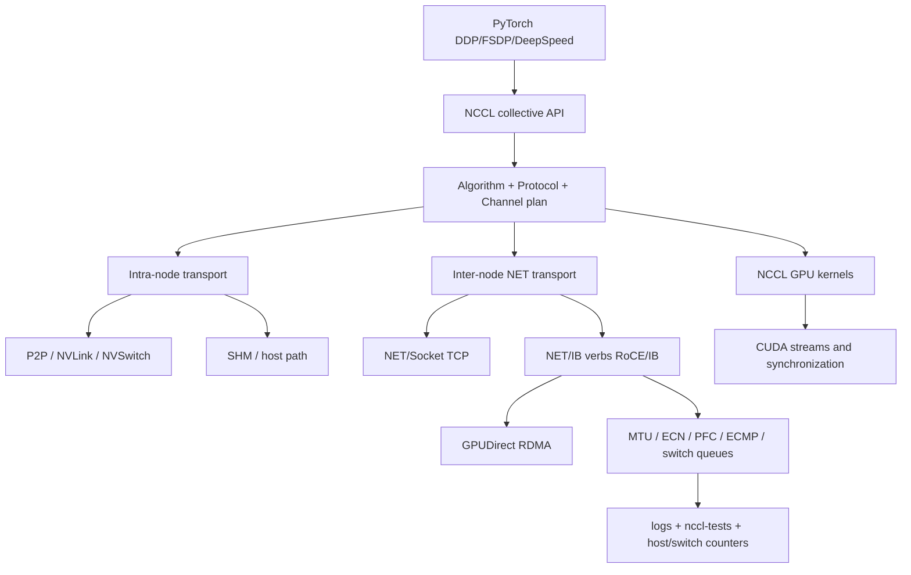

# 第 0d4 章 · NCCL Collective 与网络诊断

> **关联章节**：本章专门讲 NCCL。Linux TCP/MTU 见 [0d1](0d1-linux-network-stack-tcp-and-mtu.md)，NIC queue/offload 见 [0d2](0d2-nic-offload-queues-and-service-network-io.md)，RDMA/RoCE/IB/GPUDirect 见 [0d3](0d3-rdma-roce-infiniband-and-gpudirect.md)，GPU/NIC/NUMA 拓扑见 [0b3](0b3-numa-pcie-dma-and-pinned-memory.md)。第 8 章会从数据并行训练语义继续使用本章结论。

## 1. 第一性原理拆解 + 学习大纲

### 拆 — 不可化简的问题

NCCL 要解决的不是“把一段 bytes 从 A 发到 B”这么简单。训练里的通信通常是 collective：所有 rank 要在同一个逻辑步骤里共同完成 AllReduce、ReduceScatter、AllGather、Broadcast 或 AllToAll。不可化简的问题是：

**一组 GPU 分布在不同 PCIe/NVLink/NVSwitch/NIC/交换机路径上，但训练语义要求它们像一个同步机器一样前进；NCCL 必须把 tensor 切片、选择算法、选择 transport、安排 channel、利用 GPU kernel 和网络设备，并在任意 rank 变慢时暴露足够证据。**

这也是 NCCL 难排的根因：一次 timeout 可能来自算法选择、消息大小、rank 没进 collective、GPU kernel 阻塞、P2P 被禁、GDRDMA fallback、HCA 选错、GID 错、MTU 不一致、PFC pause、ECMP 不均、容器权限、driver/CUDA/NCCL 版本组合。NCCL 日志只是入口，不是结论。

### 推 — 从问题推出机制

从“所有 rank 要共同完成一个通信语义”推出 collective API；从“单次 tensor 很大”推出 chunk、slice、pipeline 和 channel；从“拓扑不均匀”推出 ring/tree/CollNet/NVLS 等算法选择；从“节点内和跨节点路径不同”推出 P2P/SHM/NVLink/NET transport；从“跨节点要低 CPU 开销”推出 NET/IB、RoCE/IB、GPUDirect RDMA；从“自动选择会出错或被环境破坏”推出 `NCCL_DEBUG`、topology dump、`nccl-tests` 和分层 SOP。

### 绘 — NCCL 工作栈



### 导 — 本章读完后你应该能回答

1. NCCL 中 collective、rank、channel、algorithm、protocol、transport 分别是什么？
2. Ring、tree、CollNet、NVLS 大致在解决什么问题？
3. `NET/Socket`、`NET/IB`、P2P、SHM、GDRDMA 日志各意味着什么？
4. `NCCL_IB_HCA`、`NCCL_SOCKET_IFNAME`、`NCCL_IB_GID_INDEX` 等变量什么时候该用，什么时候会误导？
5. `nccl-tests` 的 `algbw`、`busbw`、消息大小曲线和规模曲线怎么读？
6. NCCL timeout 如何区分 rank stall、socket fallback、RDMA fabric、MTU/ECN/PFC、GPU/NIC 拓扑问题？
7. 一个训练集群上线前，NCCL 验收 hard gate 应该包含什么？

## 2. NCCL 在训练栈里的位置

NCCL 通常不直接由业务代码调用，而是被 PyTorch Distributed、DDP、FSDP、DeepSpeed、Megatron、Tensor Parallel、Pipeline Parallel 或 MoE runtime 间接调用。

```text
loss.backward()
  -> autograd hooks
  -> DDP gradient bucket ready
  -> torch.distributed all_reduce / reduce_scatter
  -> ProcessGroupNCCL
  -> NCCL communicator
  -> NCCL kernels + transport
  -> GPU/NIC/fabric
```

这个路径说明两个边界：

- NCCL 慢不一定是 NCCL 本身慢。可能是 bucket 没 ready、某个 rank dataloader 慢、某个 CUDA kernel 没结束、CPU 线程没及时提交 collective。
- 训练慢也不一定体现为 NCCL error。很多通信退化只是 step time 变长、GPU utilization 掉、`nccl-tests` 方差变大。

常见调用场景：

| 场景 | NCCL collective | 典型瓶颈 |
| --- | --- | --- |
| DDP 梯度同步 | AllReduce | bucket ready time、跨节点带宽、慢 rank |
| FSDP / ZeRO | ReduceScatter + AllGather | 参数 shard 重建、通信与计算重叠 |
| Tensor Parallel | AllReduce / AllGather / ReduceScatter | 节点内 NVLink/NVSwitch、跨节点 TP 风险 |
| Pipeline Parallel | Send/Recv + 部分 collective | stage bubble、microbatch 调度 |
| MoE Expert Parallel | AllToAll | ECMP、队列、incast、消息碎片 |
| 初始化/权重广播 | Broadcast | bootstrap、首轮拓扑、冷路径 |

## 3. NCCL 核心对象：rank、communicator、channel

NCCL 的最小世界观：

| 概念 | 含义 | 排障意义 |
| --- | --- | --- |
| rank | collective 中的一个参与者，通常绑定到一张 GPU | 慢 rank 会拖住全体 |
| world size | communicator 中 rank 总数 | 影响算法、ring 数、树形结构 |
| communicator | 一组 rank 的通信上下文 | 初始化失败和训练中 timeout 要分开看 |
| channel | NCCL 内部并行通信通道 | 影响带宽、ECMP 熵、GPU kernel 并发 |
| chunk/slice | tensor 被切开的通信单元 | 影响 pipeline 和小消息效率 |
| stream | NCCL kernel 所在 CUDA stream | 与计算 kernel 的依赖关系决定 overlap |

channel 不是“越多越好”。更多 channel 可以提高并行度和网络熵，但也会增加 kernel、queue pair、buffer、调度和交换机队列压力。不同 NCCL 版本、GPU 数、NIC 数、消息大小会选择不同 channel 数。

观察入口：

```bash
export NCCL_DEBUG=INFO
export NCCL_DEBUG_SUBSYS=INIT,GRAPH,NET,COLL
export NCCL_TOPO_DUMP_FILE=/tmp/nccl-topo.xml
```

日志里看到 `Channel 00/..`、`Ring`、`Tree`、`NET/IB`、`GDRDMA` 等字段时，不要只摘一行，要把同一 rank 的 INIT、GRAPH、NET、COLL 阶段连起来读。

## 4. Collective 语义：AllReduce 只是其中一种

| Collective | 输入输出语义 | 常见训练位置 | 性能敏感点 |
| --- | --- | --- | --- |
| AllReduce | 所有 rank 输入，所有 rank 得到 reduce 结果 | DDP 梯度同步 | 带宽、慢 rank、重叠 |
| ReduceScatter | reduce 后每个 rank 得到一片 | FSDP/ZeRO 梯度或参数分片 | 分片布局、bucket 粒度 |
| AllGather | 每个 rank 的分片收集成全量 | FSDP 参数重建、TP | 峰值显存、带宽、调度 |
| Broadcast | 一个 root 发给所有 rank | 初始化、权重同步 | root 路径、树形 fanout |
| AllToAll | 每个 rank 给每个 rank 不同数据 | MoE expert dispatch | 小消息、ECMP、incast |
| Send/Recv | 点对点语义 | pipeline parallel、custom runtime | 顺序、死锁、流依赖 |

AllReduce 常被用来代表 NCCL，但真正的大模型训练往往更依赖 ReduceScatter/AllGather 的组合。FSDP 和 ZeRO 把参数、梯度、优化器状态分片后，通信模式从“每步一个大 AllReduce”变成多次 bucket 化的 ReduceScatter/AllGather。MoE 则会引入 AllToAll，它对网络队列和 ECMP 更敏感。

## 5. AllReduce 算法：ring、tree、CollNet、NVLS

### 5.1 Ring

Ring AllReduce 通常拆成 reduce-scatter + all-gather 两段。每个 rank 只和 ring 上相邻 rank 通信，带宽利用率好，适合大消息。

```text
rank0 -> rank1 -> rank2 -> ... -> rankN-1 -> rank0
reduce-scatter: 每轮规约一片
all-gather: 每轮传播一片结果
```

直觉：

- 大消息带宽效率高；
- 每个 rank 的链路负载相对均匀；
- 延迟随 rank 数和轮数增长；
- ring 顺序如果跨拓扑不合理，会把远路径放进关键环。

### 5.2 Tree

Tree 更像规约树 + 广播树，常用于小中消息或更重视延迟的场景。它减少某些轮次，但可能让树根或上层路径压力更高。

### 5.3 CollNet / Hierarchical

多节点多 GPU 中，常见思想是先节点内规约，再跨节点通信，再节点内广播。这样能更好利用 NVLink/NVSwitch 和每节点 NIC。CollNet 类算法会利用这种层级结构，但需要硬件、拓扑和 NCCL 支持。

### 5.4 NVLS

NVLS 与 NVLink/NVSwitch 相关，目标是在支持的节点内 fabric 上更高效地做 collective。是否启用、效果如何，要看 GPU 代际、NVSwitch、驱动、NCCL 版本和日志。

工程结论：不要手工固定算法当长期默认。正确流程是：

1. 先记录 NCCL 自动选择；
2. 用 `nccl-tests` 按消息大小画曲线；
3. 只在明确复现某个消息范围退化时，用环境变量做最小约束；
4. 约束必须绑定版本、机型和拓扑。

## 6. NCCL Protocol：LL、LL128、Simple 的直觉

NCCL 除了选择算法，还会选择 protocol。不同 protocol 在小消息延迟、带宽效率、CPU/GPU 协调、内存访问方式上有取舍。你不需要把内部实现细节背下来，但要知道同一个 AllReduce 在不同消息大小下可能走不同 protocol。

粗略直觉：

| Protocol | 典型直觉 | 排障意义 |
| --- | --- | --- |
| LL | 低延迟，小消息友好 | 小 bucket 多时可能看到 |
| LL128 | 低延迟和带宽折中 | 中等消息可能出现 |
| Simple | 大消息带宽友好 | 大 tensor / 大 bucket 常见 |

如果训练改了 bucket size、FSDP prefetch、gradient accumulation 或 tensor parallel 粒度，NCCL 的消息大小分布会变，算法/protocol 选择也可能变。通信性能不能只用“总梯度大小”解释，要看 bucket 切分后的消息大小直方图。

## 7. Transport：P2P、SHM、NET/Socket、NET/IB

NCCL transport 是数据真正走的路径。

| Transport | 路径 | 常见用途 | 风险 |
| --- | --- | --- | --- |
| P2P | GPU-GPU 直接路径，可能经 NVLink/PCIe P2P | 节点内 GPU 通信 | P2P 被禁、ACS/IOMMU、拓扑远 |
| SHM | 通过 host shared memory | 节点内 fallback 或辅助路径 | Host memory 带宽和 NUMA |
| NET/Socket | TCP socket | 无 RDMA 或 fallback | 带宽低、CPU 高、受 TCP/MTU/route 影响 |
| NET/IB | verbs over InfiniBand/RoCE | 跨节点训练主路径 | HCA/GID/MTU/PFC/ECN/GDRDMA |

排障第一问：**实际 transport 是什么？**

```bash
grep -E 'NET/Socket|NET/IB|P2P|SHM|GDR|Channel|Ring|Tree' nccl.log
```

如果期望 RDMA，却看到 `NET/Socket`，先不要调 NCCL 算法；先查容器权限、`/dev/infiniband`、libibverbs、NCCL net plugin、`NCCL_IB_DISABLE`、HCA 可见性和 GID。

## 8. GPUDirect RDMA：NCCL 的跨节点快路径

没有 GDRDMA 时，GPU 数据可能要经 host pinned memory staging：

```text
GPU HBM -> host pinned memory -> NIC -> network -> peer NIC -> host pinned memory -> peer GPU
```

启用 GDRDMA 后，NIC 可以直接 DMA 读写 GPU memory，CPU 主要负责 setup/control：

```text
GPU HBM <-> NIC RDMA engine <-> network <-> peer NIC <-> peer GPU HBM
```

成立条件来自多个层次：

- GPU、NIC、driver、CUDA、NCCL/插件版本支持；
- `nvidia_peermem` 或对应 peer memory 模块可用；
- 容器能看到 RDMA device 和必要库；
- GPU/NIC PCIe topology 合理，跨 socket 会变慢；
- IOMMU/ACS/BIOS 设置不破坏 peer mapping；
- NCCL 真的选择 `NET/IB` 且 GDRDMA enabled。

验证不是看一个开关：

```bash
lsmod | grep nvidia_peermem
nvidia-smi topo -m
ibv_devinfo
NCCL_DEBUG=INFO NCCL_DEBUG_SUBSYS=INIT,NET,GRAPH ./all_reduce_perf -b 64M -e 4G -f 2 -g 8
```

GDRDMA disabled 不一定是错误。如果 GPU/NIC 远、平台不支持或出于隔离策略禁用，它可能是预期状态。关键是平台文档要写清楚预期，并让 `nccl-tests` 基线与预期一致。

## 9. Topology：NCCL 自动探测也需要正确资源布局

NCCL 会探测 GPU、CPU、NIC、PCIe、NVLink/NVSwitch 的拓扑，但调度器如果把 rank/GPU/NIC 放错，它只能在坏布局里优化。

必须记录：

```bash
nvidia-smi topo -m
nvidia-smi -q | egrep -i 'PCI|Bus Id|NUMA'
ls -l /sys/class/infiniband
for h in /sys/class/infiniband/*; do cat $h/device/numa_node; done
```

典型错误：

- rank0 使用 GPU0，但 `NCCL_IB_HCA` 绑到远端 socket 的 NIC；
- 每个节点 8 GPU 2 NIC，但所有 rank 都压到一个 HCA；
- 容器里 HCA 名称和宿主机不一致，环境变量约束失效；
- MIG、虚拟化或 cgroup 让拓扑可见性和物理拓扑不一致；
- 多 rail 物理存在，但 ECMP/路由/变量没有提供足够并行路径。

一个健康的 launcher 应把 rank、GPU、CPU set、NUMA memory、HCA、rail 一起作为资源组，而不是只设置 `CUDA_VISIBLE_DEVICES`。

## 10. 环境变量：诊断工具，不是魔法咒语

| 变量 | 主要用途 | 常见误用 |
| --- | --- | --- |
| `NCCL_DEBUG` | 打开日志 | 长期开 INFO，日志太大且影响可读性 |
| `NCCL_DEBUG_SUBSYS` | 限定 INIT/NET/GRAPH/COLL 等 | 只开 WARN，错过初始化证据 |
| `NCCL_TOPO_DUMP_FILE` | 输出拓扑 | 只保存一台机器，缺少全局对比 |
| `NCCL_SOCKET_IFNAME` | 约束 socket/bootstrap 接口 | 把 bootstrap 绑到错误 VLAN |
| `NCCL_IB_HCA` | 约束 RDMA HCA | 拓扑变化后选错 NIC |
| `NCCL_IB_GID_INDEX` | 选择 RoCE GID | GID index 错导致连不通或路径错 |
| `NCCL_IB_DISABLE` | 验证 socket fallback | 忘记恢复，长期走 TCP |
| `NCCL_P2P_DISABLE` | 验证节点内 P2P 问题 | 生产默认禁用导致节点内退化 |
| `NCCL_ALGO` | 约束算法 | 用 microbenchmark 结论覆盖真实训练 |
| `NCCL_PROTO` | 约束 protocol | 忽略消息大小分布 |

推荐使用方式：

1. baseline：不加约束，只开必要日志，记录自动选择；
2. hypothesis：一次只改一个变量验证假设；
3. compare：同节点、同消息大小、同版本复测；
4. document：把变量和适用机型/拓扑/版本绑定；
5. fail-fast：启动脚本检查“期望 RDMA/GDRDMA 时是否真的启用”。

## 11. NCCL 日志分阶段读法

### 11.1 Bootstrap

Bootstrap 是 control plane。NCCL 需要让 rank 互相发现并建立初始连接。这里可能走 TCP socket，即使数据面走 RDMA。

看点：

- 使用哪个 interface；
- 是否走管理网；
- rank/world size 是否一致；
- 端口、防火墙、DNS、容器网络是否正常；
- 启动慢是否来自 rendezvous 而不是 data plane。

### 11.2 Graph / Topology

看 GPU/NIC/CPU 距离、ring/tree 构造、channel 数、P2P 路径。`NCCL_TOPO_DUMP_FILE` 对排查很有价值。

### 11.3 NET

看 `NET/Socket` 还是 `NET/IB`，HCA、port、GID、GDRDMA、网卡插件、错误。

### 11.4 COLL

看具体 collective、算法、protocol、消息大小。训练中如果只在某个 bucket 或某种 collective 慢，COLL 日志和框架 profiler 要一起看。

快速过滤：

```bash
grep -E 'Bootstrap|NET/|GDR|Channel|Ring|Tree|Coll|WARN|ERROR|socket|mlx5|GID' nccl-*.log
```

## 12. nccl-tests：怎么跑才有意义

`nccl-tests` 的价值是隔离训练框架变量，但它也容易被误用。一个只跑单节点、只看最大带宽的结果，不足以证明集群健康。

### 12.1 单节点

```bash
./all_reduce_perf -b 8M -e 4G -f 2 -g 8
./all_gather_perf -b 8M -e 4G -f 2 -g 8
./reduce_scatter_perf -b 8M -e 4G -f 2 -g 8
```

目的：验证 P2P/NVLink/NVSwitch/SHM 基线。

### 12.2 两节点

```bash
mpirun -np 16 -N 8 \
  -x NCCL_DEBUG=INFO \
  -x NCCL_DEBUG_SUBSYS=INIT,NET,GRAPH \
  ./all_reduce_perf -b 8M -e 4G -f 2 -g 8
```

目的：验证 HCA、GID、MTU、GDRDMA、跨节点基本带宽。

### 12.3 阶梯规模

跑 2/4/8/16/32/目标节点规模，记录每档 busbw、方差、timeout、交换机 counter。很多 RoCE/ECMP/PFC 问题只在规模上来后出现。

### 12.4 节点矩阵

当只有部分组合慢时，跑节点 pair 或 rack pair 矩阵。慢组合如果集中在某个节点、ToR、uplink 或 rail，故障域会清楚很多。

## 13. algbw、busbw 和理论带宽

`algbw` 是 collective 语义下的有效数据带宽，`busbw` 是按算法通信量折算后的总线带宽。不同 collective 的通信量不同，所以不要把 AllReduce、AllGather、ReduceScatter 的数值直接横比。

验收建议：

| 指标 | 用途 | 注意 |
| --- | --- | --- |
| algbw | 看应用语义有效吞吐 | 受 collective 类型影响 |
| busbw | 看底层通信路径利用率 | 和理论链路带宽更接近 |
| time | 看小消息延迟和尾部 | 训练 step 更关心长尾 |
| 方差 | 看稳定性 | 平均值好但方差大仍危险 |
| 错误/timeout | hard gate | 不应进入长训练 |

理论值只能给上限。例如 400GbE 单 rail 单向约 50 GB/s，8 GPU/多 rail/双向/协议开销/collective 算法都会改变可达值。不要用宣传带宽直接判定 NCCL 应该达到某个数字；要用同机型历史基线。

## 14. 性能模型：为什么小 bucket 和大 bucket 不一样

通信时间可以粗略拆成：

```text
T = launch/sync overhead + latency rounds + bytes / effective_bandwidth + queueing_tail
```

小消息主要受 launch、latency、rounds、协议选择影响；大消息主要受带宽、拓扑、fabric、GDRDMA、ECMP 影响。DDP bucket 太小会制造大量小 collective，带宽上不去；bucket 太大又可能降低计算通信重叠，让反向传播后半段等待变长。

调优方向：

- DDP bucket：观察 bucket ready time 和 allreduce duration；
- FSDP prefetch：观察 AllGather 是否挡在 compute 前；
- Tensor Parallel：尽量把高频 TP 通信放在 NVLink/NVSwitch 域内；
- MoE AllToAll：关注消息碎片、ECMP 熵和小包压力；
- gradient accumulation：减少同步频率，但改变内存和优化器语义。

## 15. 与 PyTorch Profiler / Nsight 的关系

NCCL collective 在 GPU 上通常表现为 NCCL kernel。Profiler 里看到 NCCL kernel 长，不一定说明网络慢；也可能是它在等待其他 rank、等待 CUDA stream 依赖、等待远端进入 collective。

需要同时看：

```text
PyTorch profiler:
  - bucket ready time
  - nccl all_reduce / reduce_scatter / all_gather duration
  - CPU submit time

Nsight Systems:
  - NCCL kernels timeline
  - compute/communication overlap
  - H2D/D2H 是否干扰

NCCL logs:
  - transport / algorithm / protocol / channel

Host/fabric counters:
  - NIC queue, RDMA retry, ECN, PFC, drop
```

如果某个 rank 的 NCCL kernel 晚开始，优先查应用/compute/data；如果所有 rank 同时进入但结束时间差异大，再查通信路径。

## 16. 常见故障模式总表

| 现象 | 高概率原因 | 快速证据 |
| --- | --- | --- |
| 带宽只有预期 10%-20% | socket fallback | `NET/Socket`、容器无 RDMA device |
| 单节点正常，两节点慢 | HCA/GID/MTU/GDRDMA | `NET/IB` 日志、GID、PMTU、topo |
| 小规模正常，大规模慢 | ECMP/PFC/ECN/incast | 交换机 counter、阶梯测试 |
| 某些节点组合慢 | 坏链路/坏 NIC/拓扑 | 节点矩阵、端口 error |
| timeout 指向某 rank | rank stall 或路径故障 | rank enter time + fabric counter |
| 训练慢但 nccl-tests 正常 | bucket/overlap/data stall | profiler、per-rank timeline |
| 升级后变慢 | 版本/插件/变量变化 | 版本矩阵、日志 diff |
| 只在 MoE 慢 | AllToAll 小消息/ECMP | AllToAll perf、flow distribution |

## 17. Worked Example：socket fallback

现象：新镜像发布后 16 节点训练吞吐降到原来的 15%。GPU 利用率低，NCCL 没有立刻报错。

证据：

```bash
grep -E 'NET/Socket|NET/IB|mlx5|infiniband' nccl.log
ls -l /dev/infiniband
ldconfig -p | grep ibverbs
```

发现日志全是 `NET/Socket`，容器里没有 `/dev/infiniband`。宿主机 RDMA 正常。

修复：

- 恢复容器 RDMA device 挂载；
- 确认 libibverbs、NCCL net plugin、权限和 securityContext；
- 启动前加 fail-fast：期望 RDMA 的训练若出现 `NET/Socket`，直接失败；
- 把镜像升级纳入 NCCL smoke test。

## 18. Worked Example：GID index 错

现象：RoCE 集群中部分节点 NCCL 初始化失败，部分节点能跑但带宽不稳定。团队固定了 `NCCL_IB_GID_INDEX=3`。

排查：

```bash
show_gids
ibv_devinfo
NCCL_DEBUG=INFO NCCL_DEBUG_SUBSYS=INIT,NET ./all_reduce_perf ...
```

发现不同网卡/端口上的 GID index 排列不一致，index 3 在某些节点对应错误 VLAN 或地址族。

修复：

- 用自动发现或按节点模板生成 GID index；
- 在入池检查中验证 GID、RoCE version、VLAN、source IP；
- 不把从一台机器抄来的 GID index 当全局真理。

## 19. Worked Example：ECN + MTU 规模故障

现象：64 节点训练偶发 timeout，32 节点以下正常。`nccl-tests` 在 8 节点达到基线，64 节点只有基线 55%。日志显示 `NET/IB` 和 GDRDMA 都启用。

第一轮证据：

```bash
for dev in bond0 bond0.3000; do ip -d link show dev $dev; done
ping -M do -s 8972 <peer>
ethtool -S <iface> | egrep 'pause|ecn|cnp|drop|discard|prio'
```

发现物理 bond 是 MTU 9000，但 VLAN 子接口是 1500；交换机 PFC pause 增长明显，ECN mark 和 CNP 很少。

推导：

- socket fallback 已排除；
- GDRDMA 已启用；
- 规模扩大后才慢，说明 incast、ECMP 或拥塞控制被触发；
- MTU 不一致让大包路径不可靠；
- ECN/CNP 少而 PFC pause 多，说明拥塞反馈太晚；
- collective 同步把少数路径 pause 放大全局 step time。

修复：统一 MTU，核对 DSCP/PCP 到 lossless priority，调整 ECN/WRED threshold，让 CNP 在 PFC 前出现。验收通过标准不是“没有 timeout”，而是 busbw、PFC pause、ECN mark、CNP、drop 都回到基线区间。

## 20. Worked Example：rank stall 伪装成 NCCL timeout

现象：NCCL timeout 总是指向 rank 37。网络 counter 正常，节点间 `nccl-tests` 正常。该 rank 所在节点 checkpoint 压缩线程在同一时间 CPU 飙高。

验证：

```python
torch.cuda.synchronize()
t0 = time.time()
dist.all_reduce(tensor)
torch.cuda.synchronize()
t1 = time.time()
print(rank, socket.gethostname(), "enter", t0, "cost", t1 - t0)
```

把 enter time、NCCL 日志、CPU、IO、checkpoint 日志对齐后发现：rank 37 比其他 rank 晚 28 秒进入 collective。其他 rank 只是被动等待。

修复：

- checkpoint 压缩和通信线程隔离 CPU；
- checkpoint 写入加限速和错峰；
- 训练日志增加 per-rank collective enter/exit 采样；
- timeout 处理流程先分离 rank stall 与 fabric 故障。

## 21. NCCL 调优顺序

不要从环境变量开始。推荐顺序：

1. 语义层：确认 collective 类型、消息大小、bucket、并行策略。
2. 时间线：确认 rank 是否同时进入 collective，compute/comm 是否重叠。
3. 自动选择：记录 NCCL algorithm/protocol/transport/channel。
4. 拓扑层：确认 GPU/NIC/NUMA/HCA/rail。
5. Fabric 层：确认 MTU、GID、PFC、ECN、ECMP、drop。
6. 变量实验：一次只改一个 NCCL 变量。
7. 固化：只固化已证明对目标 workload 有收益的变量。

错误顺序是：一看到慢就复制网上的 `NCCL_*` 参数。这样可能掩盖 topology 或 fabric 问题，也可能让下一次升级更难解释。

## 22. 训练集群 NCCL 验收 SOP

1. 收集硬件：GPU、NIC、PCIe/NVLink/NVSwitch、交换机、线缆、端口。
2. 收集软件：driver、CUDA、NCCL、OFED/rdma-core、kernel、firmware、container runtime。
3. 验证基础：`nvidia-smi topo -m`、`ibv_devinfo`、`show_gids`、MTU、路由、容器设备。
4. 跑单节点 `nccl-tests`：AllReduce、AllGather、ReduceScatter。
5. 跑两节点 `nccl-tests`：确认 `NET/IB`、GDRDMA、HCA/GID。
6. 跑阶梯规模：2/4/8/16/目标节点。
7. 跑节点矩阵：定位慢节点、慢 ToR、慢 rail。
8. 同步采集主机和交换机 counter。
9. 形成 hard gate / soft gate。
10. 保存报告，作为后续升级回归基线。

## 23. Hard Gate 与 Soft Gate

Hard gate，直接阻止入池或训练：

- 期望 RDMA 却出现 `NET/Socket`；
- 期望 GDRDMA 却未启用，且没有豁免说明；
- MTU 在主机、bond、VLAN、容器、交换机之间不一致；
- `nccl-tests` 出现 timeout、unhandled system error、WC retry exceeded；
- 交换机端口有持续 drop、discard、CRC、symbol error；
- RoCE lossless priority 的 PFC/ECN/CNP 策略明显失效；
- NCCL/CUDA/driver/OFED 版本不在兼容矩阵。

Soft gate，需要人工复核：

- busbw 低于历史基线；
- 方差过高；
- PFC pause 接近阈值；
- ECMP uplink 利用率明显不均；
- 某些节点 pair 异常但可隔离；
- `nccl-tests` 正常但真实训练 overlap 变差。

## 24. 生产事故取证包

一次 NCCL 事故至少要收：

```text
job metadata:
  model, parallelism, world size, node list, rank mapping
software:
  driver, CUDA, NCCL, framework, OFED/rdma-core, kernel, image digest
NCCL:
  NCCL_DEBUG logs, topo dump, env vars
timeline:
  per-rank step time, collective enter/exit, profiler slice
host:
  nvidia-smi topo, dmesg, Xid, ethtool -S, softirq, CPU, IO
fabric:
  port utilization, drop/discard, ECN mark, CNP, PFC pause, buffer
benchmark:
  single-node, two-node, ladder scale, node matrix nccl-tests
```

没有 rank mapping 和时间同步，NCCL 事故很难闭环。平台应自动收集这些信息，而不是让用户在 timeout 后手工翻日志。

## 25. Checklist

- [ ] 是否知道当前 workload 的 collective 类型和消息大小分布？
- [ ] 是否确认 rank 按时进入 collective？
- [ ] 是否保存 NCCL INIT/GRAPH/NET 日志？
- [ ] 是否确认 transport 是预期的 P2P/SHM/NET/IB/Socket？
- [ ] 是否确认 HCA、GID、GPU/NIC locality、GDRDMA？
- [ ] 是否跑过单节点、两节点、阶梯规模、节点矩阵 `nccl-tests`？
- [ ] 是否把 `algbw`、`busbw`、方差和 counter 一起看？
- [ ] 是否有 NCCL 版本升级回归测试？
- [ ] 是否把 socket fallback、MTU 不一致、RDMA device 不可见做成 fail-fast？
- [ ] 是否区分 rank stall 和 fabric 故障？

## 26. 练习

1. 从一段 NCCL 日志中标出 bootstrap interface、transport、HCA、GID、GDRDMA、channel、ring/tree。
2. 设计一个启动前 fail-fast 脚本：期望 RDMA/GDRDMA 时，发现 socket fallback 应立即失败。
3. 给出 DDP bucket 过小导致 NCCL 效率差的证据链。
4. 设计 8/16/32/64 节点 `nccl-tests` 阶梯验收矩阵。
5. 解释为什么 `nccl-tests` 正常，真实训练仍可能 NCCL 等待很长。
6. 分析 MoE AllToAll 为什么比普通 AllReduce 更容易触发 ECMP 和队列问题。
7. 写出一次 NCCL timeout 的事故取证包字段。
8. 给一次 NCCL/CUDA/driver 升级设计回归测试计划。
