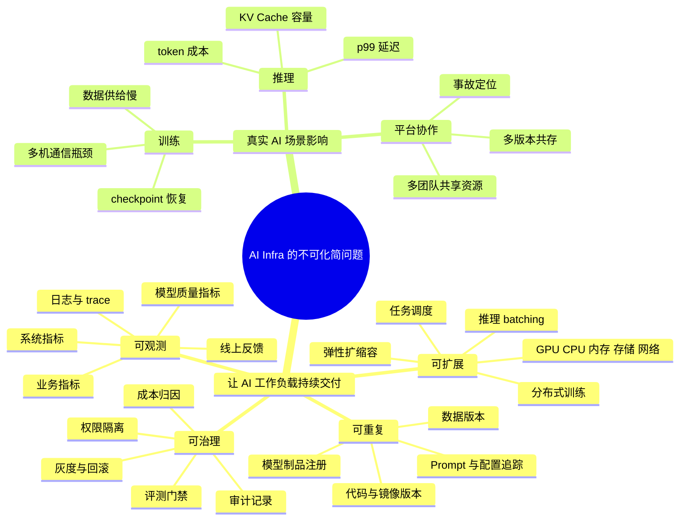

# 第1章：什么是 AI Infra

> 当模型开始接触真实用户、真实数据、真实成本和真实故障时，AI Infra 才真正登场。

---

## 学习目标

完成本章学习后，你将能够：

1. 用自己的话解释 AI Infra 的定义、边界和核心价值
2. 区分模型、框架、平台、业务应用、底层资源各自负责什么
3. 理解 AI Infra 为什么天然跨越数据、训练、推理、评测、运维和治理
4. 识别团队在 AI Infra 建设中的常见误区
5. 画出一个基础的 AI 系统分层图和端到端链路图
6. 判断一个团队当前处于 AI 工程化的哪个成熟度阶段
7. 在遇到延迟、成本、质量、稳定性问题时，知道应该从哪些层开始排查

---

## 1. 第一性原理拆解与学习大纲

### 拆 — 不可化简的问题

很多人第一次接触 AI Infra，会以为它主要是买 GPU、装 CUDA、跑 PyTorch、写 Dockerfile、部署模型 API，或者搭一个能接收 HTTP 请求的推理服务。这些当然都是 AI Infra 的一部分，但如果只停在这些工具名上，就会错过本章真正要建立的判断：AI Infra 的不可化简问题不是“怎样让模型运行一次”，而是“怎样让一个高度不确定、资源密集、状态复杂、质量难评估的 AI 工作负载，在真实团队、真实用户、真实成本和真实故障中持续交付”。一个模型在研究员的机器上跑通，解决的是单点可行性；同一个模型要进入生产，就必须面对数据版本、训练重试、checkpoint、评测门禁、模型注册、灰度发布、推理排队、线上质量、成本归因、权限隔离和回滚审计。换句话说，AI Infra 的第一性问题可以压缩成一句话：当模型的输入、输出、资源占用和质量都不是稳定常数时，工程系统怎样仍然给出可重复、可扩展、可观测、可治理的交付结果？

这个问题之所以不可再拆，是因为 AI 工作负载天然跨越三类不稳定性。第一类是计算不稳定性：训练和推理消耗 GPU、CPU、内存、网络、存储，瓶颈可能在任意一层，症状却常常出现在另一层。比如 p99 延迟升高看似是 API 问题，根因可能是 KV Cache 被挤爆、动态 batching 参数变化、检索服务变慢，或者某个 GPU 节点网络抖动。第二类是状态不稳定性：模型不仅有权重，还有 tokenizer、Prompt、训练代码、数据版本、评测结果、依赖镜像、量化配置和发布策略；任意一个状态漂移，都可能让“同一个模型”在生产里变成另一个系统。第三类是质量不稳定性：普通 Web 服务返回 `200 OK` 通常意味着请求成功，但 AI 服务即使返回成功，也可能答非所问、幻觉、漏检、越权调用工具或消耗过多 token。因此，AI Infra 不是某个组件，而是把这些不稳定性压进一条可运营链路的系统能力。

### 推 — 从这个问题如何推导出每个机制

从“持续交付一个不稳定的 AI 工作负载”出发，可以推导出本章后面每个概念为什么必然存在。首先，既然模型依赖数据，那么数据不能只是临时下载的文件；它必须有版本、血缘、权限、质量校验和高吞吐供给能力，否则训练变慢、评测失真和线上质量退化都无法复现。于是会出现数据管道、数据集版本、特征平台、对象存储和文件系统选型。其次，既然训练任务可能持续数小时到数周，且会占用昂贵 GPU，那么训练不能只是 `python train.py`；它必须被调度、隔离、监控、失败恢复，并周期性保存 checkpoint。于是会出现容器、队列、Kubernetes 或 Slurm、分布式启动、日志采集、checkpoint 管理和弹性训练。

再次，既然模型上线前必须回答“是否比上一版更好、是否足够安全、是否值得承担额外成本”，评测就不能只是一次临时 notebook 结果；它必须变成发布门禁，绑定固定评测集、baseline、质量指标、延迟指标和成本指标。于是会出现评测平台、模型注册中心、审批流和灰度策略。接着，既然真实用户请求有并发、突发、上下文长度差异和多租户差异，推理服务不能只是一个 Flask demo；它必须处理模型加载、路由、batching、KV Cache、限流、超时、降级、扩缩容、多版本共存和回滚。于是会出现推理引擎、模型网关、流量治理和服务编排。

再往下，既然 AI 服务的失败不一定表现为 HTTP 错误，观测系统不能只收集 CPU、内存和状态码；它必须同时看到系统指标、模型质量指标和业务指标，并把请求、模型版本、Prompt、检索结果、token 成本、GPU 排队和用户反馈串成证据链。于是会出现 metrics、logs、traces、SLO、在线评测、质量采样和告警。最后，既然 GPU 小时、存储、网络、向量库、第三方模型 API 和日志追踪都会产生真实成本，平台必须知道谁在用、用在哪里、是否值得、何时止损。于是会出现配额、chargeback、预算告警、资源回收、多租户隔离、安全审计和治理机制。整章的结构因此不是组件百科，而是一条从不可化简问题推导出的因果链：不确定性越高，越需要版本；资源越昂贵，越需要调度和成本；质量越难判断，越需要评测和观测；团队越多人协作，越需要边界和治理。

### 绘 — 因果链路



### 导 — 读完本章你应该能回答

1. 如果一个团队“有 GPU、能跑 PyTorch、能部署模型 API”，为什么仍然可能没有真正的 AI Infra？
2. 当线上模型质量下降但 HTTP 请求全部是 `200 OK` 时，哪些版本、数据、评测和观测证据必须被串起来？
3. 为什么 AI Infra 要同时覆盖数据、训练、评测、制品、推理、观测、成本和治理，而不能只做推理服务？
4. 当 GPU 利用率低、p99 延迟高或训练扩展收益差时，为什么根因可能不在表面症状所在的层？
5. 一个模型制品为什么不只是权重文件，还必须包含 tokenizer、配置、依赖、评测、数据和发布记录？
6. AI Infra 工程师在设计平台时，怎样在“先跑通”和“可重复、可回滚、可审计”之间划出工程边界？
7. 对一个小团队来说，最小可行的 AI Infra 应该先闭合哪些链路，哪些能力可以推迟建设？

---

## 2.0 本章先建立一个核心判断

很多人第一次接触 AI Infra，会以为它主要是：

- 买 GPU
- 装 CUDA
- 跑 PyTorch
- 写 Dockerfile
- 部署模型 API
- 搭一个推理服务

这些当然都属于 AI Infra 的一部分，但还远远不够。

**AI Infra 的本质不是“把模型跑起来”，而是“让 AI 工作负载稳定、可重复、可扩展、可观测、可治理地运行起来”。**

换句话说：

```text
模型能跑起来      = 单点成功
模型能稳定交付    = 工程系统成功
模型能持续迭代    = 平台能力成功
```

如果只有一个人能在自己机器上跑通一个 demo，这不是完整的 AI Infra；  
如果一个团队可以持续训练、评测、发布、回滚、监控、降本、排障，这才开始接近 AI Infra 的目标。

---

## 2.1 AI Infra 到底在解决什么问题

原始的 AI 项目通常是这样开始的：

```text
下载数据 -> 写训练脚本 -> 跑模型 -> 看指标 -> 保存 checkpoint
```

这条链路在实验阶段没有问题，因为目标是“先验证想法”。  
但一旦模型要进入真实业务，就会出现一系列新的问题：

| 问题类型 | 实验阶段的做法 | 生产阶段需要的能力 |
|---|---|---|
| 数据问题 | 手工下载、临时清洗 | 数据版本、数据血缘、权限、质量校验 |
| 训练问题 | 本地或单机脚本 | 任务调度、资源隔离、失败恢复、日志追踪 |
| 模型问题 | 保存一个 checkpoint | 模型注册、版本管理、元数据、回滚 |
| 评测问题 | 看一次指标 | 固定评测集、基线对比、门禁策略 |
| 推理问题 | 写一个 demo API | 高并发、低延迟、弹性扩缩容、灰度发布 |
| 观测问题 | 出错看日志 | 指标、日志、链路追踪、告警、SLO |
| 成本问题 | 先跑出来再说 | 资源配额、利用率、成本归因、预算控制 |
| 协作问题 | 一个人维护 | 团队流程、权限边界、审计、规范 |

所以，AI Infra 真正解决的是：

> 如何把一个高度不确定、资源密集、状态复杂、质量难评估的 AI 工作负载，变成一个可以被团队长期运营的工程系统。

它关注的不只是“模型是否有效”，还包括：

- 数据如何进入系统
- 训练任务如何稳定运行
- 模型制品如何保存、比较、回滚
- 推理请求如何被路由、调度、限流和服务
- 线上质量如何被评测和观测
- 出问题时如何定位根因、止损和恢复
- 多个团队共享资源时如何隔离、计费和治理

---

## 2.2 一句话定义 AI Infra

可以先给出一个可操作的定义：

> **AI Infra 是支撑 AI 模型从数据、训练、评测、制品管理、部署、推理、监控到反馈迭代的基础设施与平台能力集合。**

这个定义里有三个关键词。

### 关键词一：支撑 AI 模型

AI Infra 不是模型本身，但它让模型能够被生产化使用。

模型研究关注：

```text
模型结构、损失函数、训练策略、效果指标
```

AI Infra 关注：

```text
资源调度、数据供给、任务编排、版本管理、服务治理、观测告警、成本控制
```

### 关键词二：从数据到反馈

AI Infra 不是只负责部署模型 API。  
完整链路通常包括：

```text
数据 -> 训练 -> 评测 -> 注册 -> 发布 -> 推理 -> 观测 -> 反馈 -> 再训练
```

也就是说，AI Infra 支撑的是一个持续循环，而不是一次性上线。

### 关键词三：基础设施与平台能力集合

AI Infra 既有偏底层的资源能力，也有偏上层的平台能力。

底层能力包括：

- GPU / CPU / 内存 / 存储 / 网络
- 容器
- 驱动
- 调度器
- 分布式通信
- 文件系统
- 对象存储

平台能力包括：

- 训练平台
- 模型仓库
- 特征平台
- 推理平台
- 评测平台
- Prompt / Agent 管理平台
- 观测平台
- 成本治理平台

因此，AI Infra 不是某一个组件，而是一组跨层能力。

---

## 2.3 AI Infra 不是哪些东西

为了避免概念混乱，先明确几个边界。

### 2.3.1 AI Infra 不等于 GPU

GPU 是 AI Infra 的重要资源，但不是全部。

如果一个团队只有 GPU，没有：

- 任务调度
- 数据供给
- 日志收集
- 模型版本
- 推理服务
- 监控告警
- 成本管理

那它只是“有算力”，不等于“有 AI Infra”。

更准确地说：

```text
GPU 是资源
AI Infra 是让资源变成稳定生产力的系统
```

### 2.3.2 AI Infra 不等于模型框架

PyTorch、JAX、TensorFlow、vLLM、TensorRT-LLM、DeepSpeed 这些工具很重要，但它们主要解决的是某些局部问题：

| 工具类型 | 主要解决什么 |
|---|---|
| PyTorch / JAX | 表达和执行模型计算 |
| DeepSpeed / FSDP | 分布式训练和显存优化 |
| vLLM / TensorRT-LLM | 推理执行和性能优化 |
| Kubernetes / Slurm | 资源调度和任务运行 |
| MLflow / W&B | 实验追踪和模型管理的一部分 |

AI Infra 要把这些工具纳入一条完整链路，而不是简单堆在一起。

### 2.3.3 AI Infra 不等于 MLOps

MLOps 是 AI Infra 的重要组成部分，但 AI Infra 的范围通常更大。

MLOps 更关注：

```text
实验管理、训练流水线、模型注册、发布、监控、再训练
```

AI Infra 还会覆盖：

```text
GPU 集群、网络拓扑、存储系统、推理引擎、调度器、资源隔离、多租户治理、成本优化
```

在大模型时代，AI Infra 还进一步包含 LLMOps，例如：

- Prompt 版本管理
- RAG 链路
- 向量索引管理
- Agent 工具调用
- 生成质量评测
- Token 成本治理
- 安全与内容风控

### 2.3.4 AI Infra 不等于业务应用

业务应用面向用户，关注产品体验和业务指标。  
AI Infra 面向模型和工程团队，关注可交付、可运行、可扩展、可治理。

例如，一个智能客服产品中：

| 层次 | 例子 |
|---|---|
| 业务应用 | 客服对话页面、工单系统、用户入口 |
| AI 能力 | 意图识别、知识库问答、总结、推荐回复 |
| AI Infra | RAG 服务、模型网关、向量库、评测、监控、灰度发布、成本统计 |

业务应用直接产生用户价值，AI Infra 保证这些 AI 能力能够持续可靠地交付。

---

## 2.4 AI 系统的基本分层

一个简化的 AI 系统可以分成五层：

```text
┌────────────────────────────┐
│ 业务层：产品、用户请求、业务流程 │
├────────────────────────────┤
│ 模型层：模型、Prompt、Agent、推理逻辑 │
├────────────────────────────┤
│ 框架层：PyTorch、JAX、vLLM、TensorRT │
├────────────────────────────┤
│ 平台层：训练平台、模型仓库、推理平台、观测系统 │
├────────────────────────────┤
│ 资源层：GPU、CPU、内存、存储、网络 │
└────────────────────────────┘
```

每一层关注的问题不同。

| 层次 | 主要对象 | 关注点 | 常见角色 |
|---|---|---|---|
| 业务层 | 产品、用户请求、业务工作流 | 用户体验、业务效果、SLA | 产品、业务工程师 |
| 模型层 | 模型结构、Prompt、Agent、推理逻辑 | 准确率、召回率、生成质量、幻觉率 | 算法工程师、研究员 |
| 框架层 | PyTorch、JAX、vLLM、推理引擎 | 计算图、算子、显存、并行策略 | 算法工程师、系统工程师 |
| 平台层 | 训练平台、模型仓库、网关、监控 | 工作流、自动化、治理、稳定性 | AI Infra 工程师、平台工程师 |
| 资源层 | GPU、CPU、内存、网络、存储 | 容量、带宽、拓扑、成本 | SRE、集群工程师、平台工程师 |

很多 AI 系统问题之所以难排查，是因为症状和根因可能不在同一层。

例如：

| 表面现象 | 可能根因 |
|---|---|
| 模型响应变慢 | 推理 batch 策略变化、GPU 排队、下游检索慢、网络抖动 |
| 模型效果变差 | 数据分布漂移、Prompt 变更、模型版本错误、检索索引过期 |
| GPU 利用率低 | 数据加载慢、CPU 预处理慢、batch 太小、通信等待 |
| 成本突然升高 | 上下文变长、输出 token 变多、缓存失效、流量异常 |
| 多卡扩展收益差 | AllReduce 慢、网络拓扑差、负载不均衡、参数切分不合理 |

所以，学 AI Infra 的核心不是背组件名字，而是建立跨层因果关系。

---

## 2.5 AI Infra 的核心任务

AI Infra 可以拆成八类核心任务。

### 2.5.1 数据进入系统

没有数据，训练和评测都无从谈起。

数据层要解决：

- 数据从哪里来
- 数据格式是否统一
- 数据能否被切分和采样
- 数据质量是否可校验
- 数据版本是否可追踪
- 数据权限是否合规
- 数据能否高吞吐地供给训练任务

典型问题：

```text
训练很慢，不一定是模型慢，可能是数据读不动。
```

比如：

- 数据全是小文件，元数据访问开销巨大
- 数据存在远端对象存储，延迟波动明显
- 图片/视频解码消耗 CPU
- 数据增强逻辑写得低效
- dataloader worker 数量不合理

### 2.5.2 训练任务稳定运行

训练不是简单执行一个 Python 脚本。生产环境里的训练任务要考虑：

- 资源申请
- 队列调度
- 多机多卡启动
- 失败重试
- checkpoint 保存
- 日志收集
- 指标上报
- 任务恢复
- 权限隔离

实验阶段可以这样：

```bash
python train.py
```

生产阶段更可能是：

```text
提交训练任务
  -> 调度器分配 GPU
  -> 拉取镜像和代码
  -> 挂载数据
  -> 启动分布式训练
  -> 周期性保存 checkpoint
  -> 上报 loss / throughput / GPU 利用率
  -> 训练完成后触发评测任务
```

### 2.5.3 模型制品可管理

模型制品不只是一个权重文件。

一个可上线模型通常至少包括：

- 权重文件
- 模型结构代码
- tokenizer
- 配置文件
- 特征定义
- Prompt 模板
- 推理参数
- 依赖环境
- 训练数据版本
- 评测结果
- 安全扫描结果
- 发布记录

如果只保存 `model.pt`，后面很容易出现：

- 不知道这个模型从哪份数据训练出来
- 不知道它对应哪个 tokenizer
- 不知道它比上一版好在哪里
- 不知道线上出问题时该回滚到哪一版
- 不知道谁批准了这次发布

所以 AI Infra 需要模型仓库或模型注册中心。

### 2.5.4 评测成为发布门禁

AI 系统上线不能只看“代码能不能跑”。还要看：

- 模型质量有没有退化
- 关键样本有没有坏
- 延迟是否超标
- 成本是否超标
- 安全策略是否满足
- 与旧版本相比是否值得上线

一个成熟的模型发布流程通常是：

```text
训练完成
  -> 离线评测
  -> 与 baseline 对比
  -> 生成评测报告
  -> 通过质量门禁
  -> 注册候选模型
  -> staging 验证
  -> 灰度发布
  -> 线上监控
  -> 放量或回滚
```

没有评测门禁的模型上线，本质上是在生产环境里做盲测。

### 2.5.5 推理服务稳定交付

推理服务要解决的是“真实用户请求来了以后，系统如何稳定返回结果”。

关键能力包括：

- 模型加载
- 权重分片
- 请求路由
- 动态 batching
- KV Cache 管理
- 多模型共存
- 限流
- 超时控制
- 降级策略
- 弹性扩缩容
- 多版本灰度
- 多租户隔离

大模型推理尤其复杂，因为一次请求成本与以下因素强相关：

- 输入 token 数
- 输出 token 数
- batch 大小
- 并发数
- KV Cache 占用
- 模型量化方式
- 解码策略
- 是否命中缓存
- 是否调用工具或检索链路

### 2.5.6 线上观测与故障定位

AI 服务的观测不能只看 HTTP 状态码。

一个请求返回 `200 OK`，仍然可能：

- 答非所问
- 出现幻觉
- 调错工具
- 检索不到相关文档
- 输出过长导致成本飙升
- 命中错误模型版本
- 使用了过期 Prompt

因此，AI Infra 的观测通常要同时覆盖三类指标：

#### 系统指标

- QPS
- 延迟 p50 / p90 / p99
- 错误率
- 超时率
- GPU 利用率
- 显存占用
- 队列长度
- batch size
- cache 命中率

#### 模型质量指标

- 准确率
- 召回率
- F1
- BLEU / ROUGE
- 相关性
- 幻觉率
- 拒答率
- 安全违规率
- 人工反馈分数

#### 业务指标

- 转化率
- 留存
- 点击率
- 客服解决率
- 工单减少率
- 用户满意度
- 人工接管率

AI Infra 的难点在于：这三类指标经常互相牵制。

例如：

```text
提高 batch size -> GPU 利用率上升 -> 成本下降
但可能导致排队时间增加 -> p99 延迟变差
```

### 2.5.7 成本治理

AI 系统的成本高度动态，不像普通 Web 服务那么平稳。

成本可能来自：

- GPU 训练成本
- GPU 推理成本
- 存储成本
- 网络传输成本
- 向量数据库成本
- 第三方模型 API 成本
- 日志和追踪成本
- 评测任务成本

常见成本失控原因包括：

- 上下文长度无限增长
- 输出 token 没有限制
- embedding 重复计算
- 检索结果过多
- 缓存失效
- 训练任务忘记停止
- GPU 空转
- 同一模型被多个团队重复部署
- checkpoint 保存过于频繁

因此，AI Infra 要提供：

- 成本归因
- 资源配额
- 预算告警
- 使用率统计
- 闲置资源回收
- 模型合并部署
- 缓存策略
- 请求限流

### 2.5.8 安全、权限与治理

AI 系统往往处理高价值数据，也可能输出高风险内容，因此治理非常重要。

需要关注：

- 数据访问权限
- 模型访问权限
- Prompt 泄漏
- 训练数据泄漏
- 日志脱敏
- 用户隐私
- 模型输出安全
- 越权工具调用
- 审计记录
- 多租户隔离

在 Agent 系统中，安全问题更复杂，因为模型可能调用：

- 数据库
- 文件系统
- 代码执行器
- 浏览器
- 内部 API
- 邮件系统
- 支付系统

这时 AI Infra 不只是“部署模型”，还要控制模型能做什么、不能做什么、做了什么、谁批准的。

---

## 2.6 一条从实验到生产的最小链路

一个最小 AI 交付链路通常是：

```text
数据准备
  -> 训练任务
  -> 离线评测
  -> 模型制品注册
  -> staging 部署
  -> 灰度发布
  -> 线上推理
  -> 监控告警
  -> 反馈采集
  -> 再训练 / 回滚 / 调参
```

这条链路里每一段都可能成为基础设施问题。

| 环节 | 关键问题 | Infra 需要提供的能力 |
|---|---|---|
| 数据准备 | 数据是否可用、可追踪、可复现 | 数据版本、数据校验、数据权限 |
| 训练任务 | 任务是否稳定跑完 | 调度、容器、日志、checkpoint、失败恢复 |
| 离线评测 | 模型是否真的变好 | 评测集、指标、baseline、报告 |
| 模型注册 | 哪个模型可以上线 | 模型仓库、元数据、审批流 |
| staging 部署 | 线上前是否验证 | 测试环境、影子流量、兼容性测试 |
| 灰度发布 | 新版本是否安全放量 | 流量切分、回滚、版本路由 |
| 线上推理 | 请求是否稳定返回 | 推理引擎、扩缩容、限流、降级 |
| 监控告警 | 出问题能否发现 | 指标、日志、trace、告警 |
| 反馈采集 | 质量是否持续有效 | 用户反馈、线上样本、人工标注 |
| 再训练 / 回滚 | 出问题如何修复 | 自动化流水线、版本回滚、数据闭环 |

这条链路有两个重要特征。

### 特征一：它不是单向流程，而是闭环

AI 系统上线后不会结束。  
模型面对真实用户后，数据分布、用户行为和业务目标都会变化。

因此，AI Infra 必须支持：

```text
线上观测 -> 问题发现 -> 样本回收 -> 数据更新 -> 重新训练 -> 重新评测 -> 重新发布
```

### 特征二：它不是只有一个版本，而是多版本共存

生产环境通常同时存在：

- 多个数据版本
- 多个训练代码版本
- 多个模型版本
- 多个 Prompt 版本
- 多个向量索引版本
- 多个服务实例
- 多套评测结果

因此，版本管理和证据链非常关键。

---

## 2.7 AI Infra 为什么天然跨层

AI 系统里的很多故障不是单层问题。

例如，一个 LLM 服务延迟突然变高，表面看是“接口慢了”，但根因可能来自：

```text
业务层：某个活动导致流量突增
模型层：新 Prompt 让输入上下文变长
框架层：推理引擎版本升级导致调度策略变化
平台层：batching 参数设置不合理
资源层：GPU 显存不足导致频繁换页或队列阻塞
网络层：下游向量库跨可用区访问，尾延迟上升
存储层：模型冷加载慢，实例扩容变慢
```

再例如，一个模型质量突然变差，根因可能来自：

```text
数据层：知识库没有更新
检索层：embedding 模型换了，但索引没重建
模型层：Prompt 模板变更
发布层：流量被路由到错误版本
业务层：用户问题分布变化
评测层：离线评测集没有覆盖新场景
```

因此，AI Infra 的工程师需要建立一种能力：

> 看到一个现象，不只在现象所在层排查，而是沿着整条链路寻找因果关系。

---

## 2.8 AI 系统与传统业务系统有什么不同

传统业务系统也需要基础设施，但 AI 系统有一些额外复杂性。

### 2.8.1 资源更异构

传统后端通常主要依赖 CPU、内存、磁盘和网络。  
AI 系统还大量依赖：

- GPU
- HBM 显存
- NVLink
- RDMA
- InfiniBand
- 高吞吐并行文件系统
- 本地 NVMe 缓存
- 专用推理芯片

不同 GPU 代际、显存容量、网络拓扑，都会影响训练和推理表现。

同样是“8 卡机器”，实际能力可能完全不同：

```text
8 卡 PCIe 互联
8 卡 NVLink 互联
多机 8 卡 + 普通以太网
多机 8 卡 + RDMA 网络
```

这些差异会直接影响分布式训练和大模型推理。

### 2.8.2 状态更多

传统服务主要管理：

- 代码版本
- 配置版本
- 数据库 schema
- 服务实例状态

AI 系统还要管理：

- 数据版本
- 特征版本
- 训练代码版本
- checkpoint
- 模型权重
- tokenizer
- Prompt
- embedding 模型
- 向量索引
- 评测集
- 评测结果
- 人工反馈
- 安全策略
- 推理参数

状态越多，越需要版本管理和元数据系统。

### 2.8.3 质量更难判断

传统服务返回正确 JSON，通常就能判断功能是否正常。

AI 服务不同。它可能：

- 格式正确，但内容错误
- 语气自然，但事实错误
- 单轮回答正确，多轮上下文错误
- 离线评测好，线上业务差
- 平均效果好，关键场景差
- 低风险问题表现好，高风险问题表现差

所以 AI 系统要同时关注：

```text
系统稳定性 + 模型质量 + 业务效果 + 安全边界
```

### 2.8.4 成本波动更剧烈

AI 请求成本经常与输入输出规模强相关。

例如 LLM 请求成本取决于：

```text
输入 token 数 + 输出 token 数 + 模型大小 + batch 策略 + 缓存命中率 + 工具调用次数
```

一个用户上传长文档，可能让单次请求成本比普通请求高几十倍。

### 2.8.5 迭代方式不同

传统软件更多是代码逻辑迭代。  
AI 系统还会迭代：

- 数据
- 模型
- Prompt
- 检索策略
- reranker
- 后处理规则
- 安全策略
- 评测标准

这意味着 AI Infra 必须支持更复杂的实验、对比、灰度和回滚。

---

## 2.9 AI Infra 的能力地图

可以把 AI Infra 能力分成十个模块。

```text
1. 数据基础设施
2. 算力与资源调度
3. 训练平台
4. 实验追踪
5. 模型制品管理
6. 评测平台
7. 推理服务平台
8. LLMOps / RAG / Agent 平台
9. 观测与运维
10. 安全、权限与成本治理
```

### 2.9.1 数据基础设施

负责让数据可用、可信、可追踪。

典型能力：

- 数据接入
- 数据清洗
- 数据切分
- 数据版本
- 数据质量校验
- 数据采样
- 数据权限
- 特征管理
- 标注平台
- 数据血缘

### 2.9.2 算力与资源调度

负责让 GPU / CPU / 存储 / 网络被高效使用。

典型能力：

- GPU 集群管理
- 队列系统
- 配额管理
- 多租户隔离
- 作业优先级
- 抢占与恢复
- 弹性调度
- 资源利用率统计
- 成本归因

### 2.9.3 训练平台

负责让训练任务可复现、可恢复、可观察。

典型能力：

- 训练任务提交
- 分布式启动
- 镜像管理
- 参数配置
- checkpoint
- 自动重试
- 日志收集
- 指标上报
- 训练模板
- 超参搜索

### 2.9.4 实验追踪

负责记录“做过什么实验，结果如何”。

典型能力：

- 记录参数
- 记录代码版本
- 记录数据版本
- 记录指标曲线
- 记录模型输出样例
- 实验对比
- 实验复现
- 实验归档

### 2.9.5 模型制品管理

负责管理“哪个模型可以被谁使用”。

典型能力：

- 模型注册
- 模型版本
- 元数据
- 审批流
- 权重存储
- 依赖环境
- 权限控制
- 回滚记录
- 生命周期管理

### 2.9.6 评测平台

负责判断模型是否值得上线。

典型能力：

- 评测集管理
- 指标计算
- baseline 对比
- 自动评测
- 人工评测
- 回归测试
- 安全评测
- 质量门禁
- 评测报告

### 2.9.7 推理服务平台

负责承载线上请求。

典型能力：

- 模型加载
- 多模型路由
- 动态 batching
- 流式输出
- 缓存
- 限流
- 熔断
- 降级
- 自动扩缩容
- 灰度发布
- 多版本共存

### 2.9.8 LLMOps / RAG / Agent 平台

大模型应用还需要额外能力。

典型能力：

- Prompt 版本管理
- Prompt 评测
- 工具调用管理
- 向量库管理
- embedding 任务
- 索引构建
- 检索评测
- reranker 管理
- Agent trace
- 人类反馈采集
- 安全策略

### 2.9.9 观测与运维

负责发现问题、定位问题、恢复系统。

典型能力：

- 指标监控
- 日志检索
- 链路追踪
- 告警
- SLO
- 事故复盘
- 容量规划
- 演练
- 故障注入

### 2.9.10 安全、权限与成本治理

负责让平台可控、可审计、可持续。

典型能力：

- 用户权限
- 项目隔离
- 数据脱敏
- 审计日志
- 资源配额
- 预算控制
- 成本报表
- 空闲回收
- 合规策略

---

## 2.10 三类典型 AI Infra 场景

不同类型的 AI 系统，对 Infra 的要求不同。

### 2.10.1 传统机器学习系统

典型任务：

- 推荐
- 广告
- 风控
- 搜索排序
- 用户画像
- 时间序列预测

重点能力：

- 特征工程
- 特征存储
- 批训练
- 在线特征服务
- A/B 实验
- 模型监控
- 数据漂移检测

典型链路：

```text
日志数据 -> 特征处理 -> 训练 -> 离线评测 -> 模型发布 -> 在线预测 -> 反馈回流
```

### 2.10.2 深度学习训练系统

典型任务：

- CV 模型训练
- ASR / TTS
- 多模态模型
- 大模型预训练
- 大模型微调

重点能力：

- GPU 调度
- 数据吞吐
- 分布式训练
- checkpoint
- 混合精度
- 通信优化
- 训练稳定性
- 大规模日志和指标

典型链路：

```text
大规模数据 -> 数据加载 -> 多机多卡训练 -> checkpoint -> 评测 -> 模型注册
```

### 2.10.3 LLM 应用系统

典型任务：

- 智能客服
- 知识库问答
- 代码助手
- 文档分析
- Agent 自动化
- 企业 Copilot

重点能力：

- 模型网关
- Prompt 管理
- RAG
- 向量索引
- 工具调用
- 上下文压缩
- 流式输出
- 生成质量评测
- Token 成本控制
- 安全与权限

典型链路：

```text
用户问题
  -> 权限校验
  -> Prompt 构造
  -> 检索知识库
  -> rerank
  -> 调用 LLM
  -> 工具调用 / 后处理
  -> 输出
  -> 记录 trace / 反馈
```

---

## 2.11 一个例子：为什么“模型效果好”仍然可能上线失败

假设团队训练了一个客服问答模型，离线评测准确率很高。  
但上线后用户体验很差。

可能原因包括：

### 问题一：线上数据分布和离线评测不一致

离线评测集里多是标准问题，线上用户问法更口语化。

```text
离线：如何修改收货地址？
线上：我刚下单地址填错了咋办？
```

这属于数据与评测问题。

### 问题二：推理延迟过高

模型本身效果好，但每次回答需要 8 秒，用户无法接受。

这属于推理服务和系统性能问题。

### 问题三：知识库检索失败

模型需要依赖 RAG，但向量索引没有及时更新，导致模型拿不到最新政策。

这属于数据、索引和 RAG Infra 问题。

### 问题四：灰度和回滚机制缺失

新版本上线后效果下降，但团队无法快速切回旧版本。

这属于发布治理问题。

### 问题五：没有线上质量观测

用户已经大量不满意，但监控只看到 HTTP 200，平台误以为服务正常。

这属于 AI 观测问题。

这个例子说明：

```text
模型效果只是成功的一部分
生产系统还需要数据、推理、评测、发布、观测、反馈共同支撑
```

---

## 2.12 一个例子：为什么“买更多 GPU”不一定解决问题

假设训练任务很慢，团队决定购买更多 GPU。  
但扩卡后吞吐没有线性提升。

可能原因包括：

### 原因一：数据加载成为瓶颈

GPU 等数据，利用率忽高忽低。

```text
存储读不动 -> CPU 解码慢 -> GPU 空等
```

### 原因二：多机通信成为瓶颈

卡越多，梯度同步成本越高。

```text
计算时间减少了
通信时间增加了
总 step time 没有明显下降
```

### 原因三：batch size 和模型结构不适合扩展

模型太小或 batch 太小，无法有效利用更多 GPU。

### 原因四：checkpoint 写入拖慢训练

每隔一段时间保存 checkpoint，所有 worker 等待远程存储写入完成。

### 原因五：调度和资源碎片化

GPU 虽多，但可用资源不连续，任务经常排队或被抢占。

所以，AI Infra 的第一原则不是“堆资源”，而是先看瓶颈在哪里。

---

## 2.13 AI Infra 工程师需要具备什么思维

### 2.13.1 链路思维

不要只看一个组件，要看完整路径：

```text
数据从哪里来？
经过哪些处理？
什么时候进入 GPU？
模型如何产出结果？
结果如何被服务返回？
指标如何被记录？
问题如何被反馈？
```

### 2.13.2 瓶颈思维

系统吞吐通常由最慢的一段决定。

```text
总吞吐 ≈ min(数据供给, 计算能力, 通信能力, 服务调度能力)
```

不要只优化最显眼的地方，要找真正限制系统的那块短板。

### 2.13.3 版本思维

AI 系统里几乎所有东西都需要版本：

- 数据版本
- 代码版本
- 模型版本
- Prompt 版本
- 评测集版本
- 配置版本
- 索引版本

版本不清楚，就无法复现、比较和回滚。

### 2.13.4 证据链思维

上线一个模型时，要能回答：

- 这个模型是谁训练的？
- 用了哪份数据？
- 用了哪个代码 commit？
- 训练参数是什么？
- 评测结果如何？
- 与上一版相比哪里更好？
- 谁批准上线？
- 上线后效果如何？
- 如果出问题回滚到哪一版？

### 2.13.5 闭环思维

AI 系统不是“一次上线”，而是持续迭代：

```text
训练 -> 评测 -> 发布 -> 观测 -> 反馈 -> 再训练
```

没有闭环，系统会随着数据和业务变化逐渐退化。

### 2.13.6 成本思维

每一次训练、每一次推理、每一次检索、每一次日志记录都可能产生成本。

AI Infra 需要在效果、延迟、稳定性和成本之间做取舍。

---

## 2.14 团队 AI Infra 成熟度模型

可以把团队的 AI 工程化能力分成五个阶段。

### 阶段 0：个人实验阶段

特征：

- notebook 为主
- 数据手工处理
- 训练在个人机器或临时服务器上
- checkpoint 随手保存
- 没有稳定评测
- 没有发布流程

主要风险：

- 结果不可复现
- 代码不可交接
- 数据来源不清楚
- 无法上线

下一步重点：

```text
把实验脚本、数据版本、训练参数和结果记录下来
```

### 阶段 1：脚本工程化阶段

特征：

- 有训练脚本
- 有配置文件
- 能在服务器上重复运行
- 有初步日志
- 模型可以手工部署

主要风险：

- 发布靠人工
- 回滚困难
- 多人协作混乱
- 线上问题难定位

下一步重点：

```text
建立模型制品管理、评测流程和部署规范
```

### 阶段 2：基础平台阶段

特征：

- 有训练任务提交
- 有模型仓库
- 有推理服务
- 有基础监控
- 有简单灰度发布

主要风险：

- 评测不系统
- 资源利用率不高
- 成本不可控
- 线上反馈没有进入训练闭环

下一步重点：

```text
补齐评测门禁、观测体系和反馈闭环
```

### 阶段 3：闭环平台阶段

特征：

- 数据、训练、评测、发布、推理、反馈形成闭环
- 多模型多版本可管理
- 支持灰度、回滚和 A/B 实验
- 有成本归因
- 有质量监控

主要风险：

- 平台复杂度上升
- 规范过重影响研发效率
- 多团队需求冲突

下一步重点：

```text
提升平台体验、自动化程度和成本效率
```

### 阶段 4：规模化治理阶段

特征：

- 多团队共享平台
- 多租户隔离
- 大规模 GPU 集群
- 统一模型网关
- 完整审计与成本治理
- 自动化容量规划
- 统一安全策略

主要风险：

- 平台治理成本高
- 组织协作复杂
- 资源争抢严重
- 技术债累积

下一步重点：

```text
平台产品化、标准化、自动化和精细化成本控制
```

---

## 2.15 AI Infra 建设的常见误区

### 误区一：模型效果好，系统问题以后再补

很多项目不是败在模型效果，而是败在交付能力。

常见表现：

- 模型训练出来了，但没人知道怎么部署
- 线上出问题，没人知道回滚到哪一版
- 测试环境正常，生产环境延迟爆炸
- 离线指标很好，线上用户不满意
- 训练脚本只有作者本人能运行

正确做法：

```text
从项目早期就建立最小闭环，而不是等模型做完再补系统
```

### 误区二：开源组件拼起来就是平台

开源组件只是原材料。

例如你可以同时使用：

- Kubernetes
- MLflow
- Airflow
- Prometheus
- Grafana
- vLLM
- Milvus
- Argo Workflows

但如果它们之间没有统一的身份、权限、元数据、流程和观测，就仍然不是一个真正的平台。

平台的价值在于：

```text
把组件串成稳定工作流
把状态统一管理起来
把团队协作规则固化下来
```

### 误区三：AI Infra 只是大公司才需要

小团队当然不需要一开始就建设完整平台。  
但小团队同样需要最小闭环。

小团队至少应该有：

- 可复现训练脚本
- 数据和模型版本记录
- 固定评测集
- 基础部署流程
- 回滚方案
- 基础监控
- 成本意识

区别只是：

```text
小团队做轻量闭环
大团队做完整平台
```

### 误区四：买更多 GPU 就能解决一切

GPU 只是资源。  
系统瓶颈可能在：

- 数据加载
- CPU 预处理
- 网络通信
- checkpoint 写入
- 推理排队
- 缓存失效
- 模型路由
- 下游依赖

正确做法是先定位瓶颈，再决定买资源还是优化系统。

### 误区五：只看系统指标，不看模型质量

AI 服务返回成功不代表答案正确。

如果只看：

- QPS
- 延迟
- 错误率
- CPU / GPU 利用率

就会漏掉：

- 幻觉
- 答非所问
- 检索失败
- 安全风险
- 用户不满意
- 业务指标下降

AI Infra 必须同时看系统指标和质量指标。

### 误区六：只做离线评测，不看线上反馈

离线评测集永远不能完全代表真实用户。

因此要建立：

- 线上样本采集
- 用户反馈
- 人工标注
- badcase 分析
- 数据回流
- 再训练机制

---

## 2.16 如何判断一个问题是不是 AI Infra 问题

可以用下面的判断方法。

### 2.16.1 如果问题涉及可重复性

例如：

- 训练结果无法复现
- 同一份代码不同机器结果不同
- 不知道模型来自哪份数据
- 无法还原线上版本

这是 AI Infra 问题。

### 2.16.2 如果问题涉及规模化

例如：

- 单机能跑，多机不行
- 小流量能跑，大流量不行
- 单人能用，团队不能协作
- 单模型能部署，多模型混乱

这是 AI Infra 问题。

### 2.16.3 如果问题涉及可观测性

例如：

- 服务慢了但不知道慢在哪
- 模型变差但不知道为什么
- GPU 利用率低但不知道谁在等待
- 用户投诉但监控没有报警

这是 AI Infra 问题。

### 2.16.4 如果问题涉及治理

例如：

- 谁都可以调用昂贵模型
- 训练任务无限占用 GPU
- 数据权限不清楚
- 模型上线没有审批
- 成本无法归因

这是 AI Infra 问题。

---

## 2.17 一个基础 AI 系统分层图

你可以用下面这张图理解 AI Infra 的位置。

```text
┌───────────────────────────────────────┐
│              业务应用层                │
│  App / Web / API / 工作流 / 用户体验    │
└──────────────────┬────────────────────┘
                   │
┌──────────────────▼────────────────────┐
│              AI 能力层                 │
│  模型 / Prompt / Agent / RAG / 推荐逻辑 │
└──────────────────┬────────────────────┘
                   │
┌──────────────────▼────────────────────┐
│              AI 平台层                 │
│  训练平台 / 评测平台 / 模型仓库 / 推理平台 │
│  模型网关 / Prompt 管理 / 观测 / 发布系统  │
└──────────────────┬────────────────────┘
                   │
┌──────────────────▼────────────────────┐
│              执行框架层                │
│  PyTorch / JAX / vLLM / TensorRT / Ray  │
└──────────────────┬────────────────────┘
                   │
┌──────────────────▼────────────────────┐
│              资源层                    │
│  GPU / CPU / 内存 / 存储 / 网络 / 容器    │
└───────────────────────────────────────┘
```

其中 AI Infra 主要覆盖：

```text
AI 平台层 + 执行框架层的一部分 + 资源层的一部分
```

但它必须理解上层业务和模型，因为平台能力必须服务于真实场景。

---

## 2.18 一个端到端 AI 生产链路图

更完整的生产链路可以画成：

```text
┌────────────┐
│ 数据采集    │
└─────┬──────┘
      │
┌─────▼──────┐
│ 数据清洗    │
└─────┬──────┘
      │
┌─────▼──────┐
│ 数据版本    │
└─────┬──────┘
      │
┌─────▼──────┐
│ 训练任务    │
└─────┬──────┘
      │
┌─────▼──────┐
│ 离线评测    │
└─────┬──────┘
      │
┌─────▼──────┐
│ 模型注册    │
└─────┬──────┘
      │
┌─────▼──────┐
│ Staging 验证│
└─────┬──────┘
      │
┌─────▼──────┐
│ 灰度发布    │
└─────┬──────┘
      │
┌─────▼──────┐
│ 线上推理    │
└─────┬──────┘
      │
┌─────▼──────┐
│ 监控与反馈  │
└─────┬──────┘
      │
      └──────────────┐
                     │
              回流到数据与训练
```

这条链路不是为了显得复杂，而是为了让每一步都有可检查、可追踪、可回滚的依据。

---

## 2.19 遇到线上问题时怎么排查

### 场景一：推理服务超时增加

优先按下面顺序看：

```text
入口流量
  -> 排队时间
  -> 模型执行时间
  -> batch 策略
  -> GPU 利用率 / 显存
  -> 下游依赖
  -> 网络延迟
  -> 版本变更
```

关键问题：

- QPS 是否突然变高？
- 输入 token 是否变长？
- 输出 token 是否变多？
- batch size 是否变化？
- GPU 是否打满？
- 队列是否堆积？
- 是否有下游检索或工具调用变慢？
- 是否最近发布了新模型、新 Prompt 或新索引？

### 场景二：模型质量下降

优先看：

```text
流量分布
  -> 模型版本
  -> Prompt 版本
  -> 检索结果
  -> 数据版本
  -> 评测集覆盖
  -> 线上 badcase
```

关键问题：

- 是否路由到了错误模型？
- 是否更新了 Prompt？
- 是否知识库过期？
- 是否 embedding 模型和索引不匹配？
- 是否线上问题类型发生变化？
- 离线评测是否覆盖这些问题？

### 场景三：训练任务变慢

优先看：

```text
数据读取
  -> CPU 预处理
  -> H2D 拷贝
  -> GPU 计算
  -> 多卡通信
  -> checkpoint 写入
```

关键问题：

- GPU 利用率是否锯齿状？
- dataloader 是否成为瓶颈？
- 小文件是否过多？
- 网络存储是否抖动？
- AllReduce 是否占比过高？
- checkpoint 是否阻塞训练？

### 场景四：成本突然升高

优先看：

```text
调用量
  -> token 数
  -> 模型版本
  -> 缓存命中
  -> 工具调用
  -> 重试
  -> 空闲资源
```

关键问题：

- 请求量是否上涨？
- 平均输入输出长度是否上涨？
- 是否切到了更大模型？
- 是否缓存失效？
- 是否重试风暴？
- 是否训练任务忘记停止？
- 是否多个团队重复部署同一模型？

---

## 2.20 AI Infra 建设的最小可行版本

对小团队来说，不需要一开始就搭一个复杂平台。  
可以先做一个最小闭环。

### 最小训练闭环

至少包括：

- 固定代码仓库
- 配置文件管理
- 数据版本记录
- 训练日志
- checkpoint 保存
- 指标记录
- 实验结果对比

### 最小评测闭环

至少包括：

- 固定评测集
- baseline 模型
- 自动评测脚本
- 评测报告
- 上线门槛

### 最小发布闭环

至少包括：

- 模型版本号
- 模型制品保存位置
- staging 验证
- 灰度或手工放量
- 回滚版本
- 发布记录

### 最小观测闭环

至少包括：

- QPS
- 延迟 p50 / p95 / p99
- 错误率
- GPU / CPU / 内存使用率
- 模型版本
- Prompt 版本
- 线上 badcase 收集

### 最小成本闭环

至少包括：

- 每日调用量
- 平均 token 数
- GPU 使用时长
- 模型 API 成本
- 项目维度成本归因
- 异常成本告警

---

## 2.21 本章关键词速查

| 关键词 | 含义 |
|---|---|
| AI Infra | 支撑 AI 工作负载稳定生产化的基础设施和平台能力 |
| MLOps | 围绕机器学习生命周期的工程化实践 |
| LLMOps | 围绕大模型应用、Prompt、RAG、Agent 的工程化实践 |
| 模型制品 | 可被保存、发布、回滚的模型相关文件和元数据 |
| 模型注册 | 把模型版本、指标、元数据、审批状态统一管理起来 |
| 评测门禁 | 模型上线前必须通过的质量和性能检查 |
| 灰度发布 | 将部分流量导向新版本，观察稳定后逐步放量 |
| 回滚 | 新版本异常时恢复到旧版本 |
| 数据漂移 | 线上数据分布相对训练/评测数据发生变化 |
| 观测性 | 通过指标、日志、trace 理解系统内部状态的能力 |
| 多租户 | 多个团队或用户共享同一平台资源 |
| 成本归因 | 把资源消耗分摊到具体团队、项目、模型或请求 |

---

## 2.22 本章小结

| 核心点 | 结论 |
|---|---|
| AI Infra 的本质 | 把 AI 工作负载变成可重复、可扩展、可观测、可治理的系统 |
| 它解决的问题 | 数据、训练、评测、制品、部署、推理、观测、反馈、成本和治理 |
| 它不是什么 | 不等于 GPU，不等于模型框架，不等于简单部署脚本，也不等于开源组件堆砌 |
| 与传统 Infra 的差异 | AI 系统资源更异构，状态更多，质量更难评估，成本波动更强 |
| 学习重点 | 建立跨层因果关系，而不是只记组件名字 |
| 建设原则 | 先做最小闭环，再逐步平台化、自动化和治理化 |

---

## 2.23 自测题

### 基础题

1. 用你自己的话解释 AI Infra 与“训练一个模型”的区别。
2. 为什么说“有 GPU”不等于“有 AI Infra”？
3. AI 系统通常可以分成哪几层？每一层主要关注什么？
4. 模型制品为什么不只是一个权重文件？
5. 为什么 AI 服务返回 `200 OK` 不代表质量达标？

### 进阶题

6. 一个推理服务 p99 延迟突然上升，你会从哪些层排查？
7. 一个模型离线评测很好，但线上效果差，可能有哪些原因？
8. 为什么说 AI Infra 天然需要版本管理？
9. 小团队是否需要 AI Infra？如果需要，最小版本应该包括什么？
10. 为什么开源组件拼起来不等于平台？

### 实战题

11. 画出一个 RAG 应用从用户请求到模型回答的完整链路，并标出每一步可能的 Infra 问题。
12. 假设一个训练任务 GPU 利用率只有 30%，请列出至少 6 个可能原因。
13. 假设公司有 5 个团队共用一批 GPU，你会如何设计最小的资源治理机制？
14. 设计一个模型上线前检查清单，至少包含数据、评测、性能、发布、回滚、监控 6 个方面。
15. 你所在团队如果还处于 notebook 阶段，下一步最应该补哪 3 个能力？

---

## 2.24 参考答案要点

### 1. AI Infra 与训练模型的区别

训练模型关注的是：

```text
如何得到一个效果好的模型
```

AI Infra 关注的是：

```text
如何让模型从实验走向稳定生产，并持续迭代
```

前者偏算法和实验，后者偏工程链路和平台能力。

### 2. “有 GPU”为什么不等于“有 AI Infra”

因为 GPU 只是资源。  
AI Infra 还需要调度、数据供给、训练任务、模型管理、发布、推理、监控、权限和成本治理。

### 3. AI 系统分层

可分为：

```text
业务层 -> 模型层 -> 框架层 -> 平台层 -> 资源层
```

- 业务层看用户和业务效果
- 模型层看模型质量
- 框架层看计算表达和执行效率
- 平台层看流程、自动化和治理
- 资源层看容量、带宽、拓扑和成本

### 4. 模型制品为什么不只是权重

因为生产使用还需要：

- tokenizer
- 配置
- 代码版本
- 数据版本
- 推理参数
- 评测结果
- 依赖环境
- 发布记录

否则无法复现和回滚。

### 5. 为什么 `200 OK` 不代表质量达标

因为 AI 服务可能格式正确但内容错误。  
例如幻觉、答非所问、检索失败、工具调用错误、安全违规，都可能发生在 HTTP 成功返回的情况下。

### 6. p99 延迟上升排查方向

优先排查：

- 流量是否变化
- 队列是否堆积
- 输入输出 token 是否变长
- batch 策略是否变化
- GPU 是否打满
- 显存是否不足
- 下游依赖是否变慢
- 网络是否抖动
- 是否有模型或 Prompt 发布

### 7. 离线好、线上差的可能原因

可能包括：

- 评测集不代表线上流量
- 数据分布漂移
- Prompt 变更
- 检索索引过期
- 新模型路由错误
- 用户问题类型变化
- 线上延迟影响用户体验
- 安全策略拦截过多

### 8. AI Infra 为什么需要版本管理

因为 AI 系统中数据、代码、模型、Prompt、评测集、索引、配置都会变化。  
没有版本就无法复现、比较、审计和回滚。

### 9. 小团队的最小 AI Infra

至少包括：

- 可复现训练脚本
- 数据和模型版本记录
- 固定评测集
- 简单模型仓库
- 基础部署流程
- 回滚方案
- 基础监控
- 成本统计

### 10. 开源组件为什么不等于平台

组件只是工具。  
平台要把工具串成稳定流程，并统一身份、权限、状态、元数据、监控、治理和用户体验。

---

## 2.25 本章实践清单

学完本章后，你可以检查自己的项目：

### 基础链路

- [ ] 是否知道数据从哪里来？
- [ ] 是否知道训练脚本如何复现？
- [ ] 是否记录了训练参数？
- [ ] 是否记录了数据版本？
- [ ] 是否保存了模型版本？
- [ ] 是否有固定评测集？
- [ ] 是否知道模型如何上线？
- [ ] 是否知道如何回滚？

### 生产能力

- [ ] 是否有推理服务监控？
- [ ] 是否记录模型版本和 Prompt 版本？
- [ ] 是否监控延迟 p95 / p99？
- [ ] 是否监控错误率和超时率？
- [ ] 是否有线上 badcase 收集？
- [ ] 是否有告警机制？
- [ ] 是否能定位成本来自哪个模型或项目？

### 治理能力

- [ ] 是否有资源配额？
- [ ] 是否有访问权限？
- [ ] 是否有审计记录？
- [ ] 是否有数据脱敏策略？
- [ ] 是否有发布审批？
- [ ] 是否有成本预算？
- [ ] 是否有资源回收机制？

如果大多数答案是“否”，说明团队仍处于早期阶段。  
这不是问题，关键是先补最短板，而不是一开始追求大而全的平台。

---

## 2.26 下一章预告

下一章会继续展开 AI Infra 的底层基础：**算力、存储与网络**。

你将看到：

- 为什么 GPU 不等于有效算力
- 为什么训练经常被数据加载拖慢
- 为什么网络会限制多机训练扩展
- 为什么推理服务的尾延迟常常来自链路最慢的一段
- 如何用简单公式判断系统瓶颈

本章解决的是“AI Infra 是什么”。  
下一章解决的是“AI Infra 依赖哪些底层资源，以及这些资源如何限制系统上限”。
