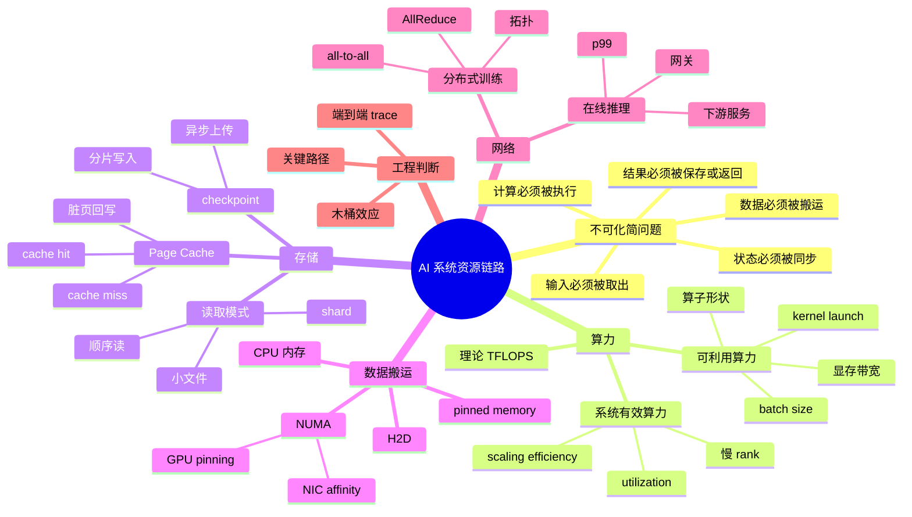
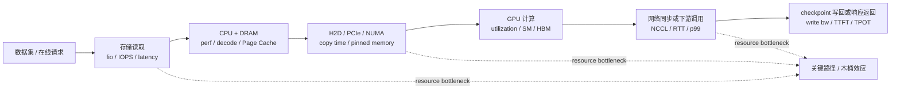

# 第2章：算力、存储与网络

> **前置知识**：理解 AI Infra 的基本问题域，建议先读 [第1章](./01-what-is-ai-infra.md)；具备 CPU、内存、磁盘、网络和 GPU 的基本直觉。
> **读完能判断什么**：能把慢训练、慢推理或扩卡收益差拆成算力、存储、网络、H2D、调度等资源链路问题，并判断下一步该采集哪类证据。
> **关键指标**：GPU utilization、MFU/HFU、tokens/s 或 samples/s、H2D copy time、I/O throughput、NCCL bus bandwidth、p95/p99 latency。
> **相关章节**：[第1章](./01-what-is-ai-infra.md)、[第3章](./03-from-model-to-production.md)、[第5章](../part2-systems-stack/05-memory-interconnect-io.md)、[第21章](../part7-reliability-security/21-observability-and-capacity.md)。
> **常见误区**：把 GPU 利用率低直接归因于模型代码；只看部件峰值而不看端到端关键路径；用平均值掩盖尾延迟和慢 rank。
> **验证/练习入口**：按本章资源链路方法构造 `EvidenceBundle`，并对照 [附录C 检查清单](../appendix/checklists.md) 与 [附录D 参考解答](../appendix/answers.md) 校验推理过程。

## 1. 第一性原理拆解：为什么算力、存储与网络必须一起看

### 拆 — 不可化简的问题

很多 AI 系统问题看起来发生在模型层，真正的瓶颈却早已在算力、存储和网络之间决定了上限。真正成熟的 AI 工程分析，不是先问“模型还能不能再优化”，而是先问：**数据有没有按时送到？算力有没有被喂饱？通信有没有拖住整体？系统有没有被最慢的一段卡死？**

本章的定位是桥接章：它不是模型教程，也不在这里展开 CPU cache、Page Cache、PCIe、NVMe、RDMA、NCCL 或 CUDA kernel 的完整机制。后续 Part 0 和 Part 2 会分别解释这些机制；这里先建立一套证据优先的 resource chain（资源链）诊断语言。遇到慢训练、慢推理或扩卡收益差，先把现象写成 `EvidenceBundle`，用 `perf`、`fio`、H2D copy 时间、NCCL trace、队列时间和 p99 等证据确认 critical path / 关键路径，再用 `threshold` 和 `retest` 判断改动是否真的移除了 resource bottleneck。

把所有术语先拿掉，只保留不可化简的问题：一个 AI 任务要把输入数据变成输出结果，必然要经历“取数、搬运、计算、同步、保存或返回”这些物理动作。每个动作都占用一种有限资源：存储负责把字节交出来，CPU 和内存负责解码、拼 batch、调度和缓存，PCIe / NVLink 负责把数据送到设备，GPU 负责高密度矩阵计算，网络负责跨机器同步或跨服务调用。只要其中一段供给速度低于后续消费速度，后续资源就会等待；只要其中一段尾延迟变大，端到端体验就会被拉长。这个问题不能被“更大模型”“更强 GPU”“更多机器”单独解决，因为系统吞吐不是某个部件的最大值，而是依赖链路上可持续供给能力的最小值。

因此，本章的核心不是背诵“算力、存储、网络”三个名词，而是建立一个资源守恒视角：计算不会凭空发生，GPU 每算一次都需要权重、激活和输入数据已经在正确的显存位置；分布式训练每推进一步都需要各 rank 的梯度或参数状态达到一致；在线推理每返回一个 token 都要经过队列、模型服务、下游服务和客户端连接。所谓“GPU 利用率低”，本质上是昂贵计算单元处在等待状态；所谓“扩卡收益差”，本质上是新增计算能力被通信、同步、慢节点或调度开销吃掉；所谓“p99 很差”，本质上是某些请求走到了更慢的存储、网络或队列路径。先把这些物理约束看清楚，后面的机制才有意义。

### 推 — 从这个问题如何推导出每个机制

从“端到端结果必须穿过一条有限资源链路”出发，可以自然推出本章的每个机制。第一，既然 GPU 是高吞吐但高成本资源，就必须区分理论算力、可利用算力和系统级有效算力：规格表上的 TFLOPS 只是上限，真实吞吐还要乘以 utilization 和 scaling efficiency。于是我们需要理解 batch size、算子形状、显存带宽、kernel launch、CPU 调度和多卡同步如何让 GPU 被喂饱或饿住。

第二，既然计算前必须有数据，就必须讨论存储层级和读取模式。容量只回答“放不放得下”，不能回答“能否稳定按 1GB/s、10GB/s 或更高速度供给”。大量小文件会把吞吐问题变成元数据问题；远端对象存储会把读取问题变成网络往返和尾延迟问题；checkpoint 会把训练推进问题变成写入带宽、fsync 语义、分片合并和恢复时间问题。所以本章会把数据加载、数据打包、热冷分层、本地 NVMe 缓存、checkpoint 写回放在同一条链路里看。

第三，既然训练和推理都要搬运数据，就必须讨论 CPU 内存到 GPU 显存之间的 Host-to-Device（H2D）路径。样本从磁盘进入 Page Cache，再进入用户态 buffer，经过解码、增强、batch 拼接，最后通过 pinned memory 和 DMA 进入 GPU；NUMA 拓扑又会决定 CPU、内存、GPU、NIC 之间是不是走了本地路径。如果 pinned memory 没开、batch 太碎、worker 绑错 NUMA node，即使存储和 GPU 都很强，H2D 仍然可能成为关键路径。

第四，既然多卡和多机任务需要共同推进，就必须讨论网络。数据并行需要 AllReduce，张量并行需要高频中间结果通信，Pipeline 并行需要 stage 之间传激活，MoE 需要 all-to-all token dispatch。在线推理虽然不一定做梯度同步，但会跨网关、路由、向量库、reranker、数据库、外部工具和日志系统；每个服务的 p99 都可能叠加成用户感知的卡顿。于是“网络”不只是带宽，还包括延迟、抖动、拓扑、重试、超时、拥塞和尾延迟放大。

第五，既然所有资源都可能重叠工作，也可能互相等待，就需要关键路径和木桶效应。训练 step 不能只看 forward / backward，要拆成 load、preprocess、h2d、forward、backward、sync、update、checkpoint；推理请求不能只看模型执行，要拆成 queue、tokenize、prefill、decode、postprocess、downstream、return。只有把时间拆开，才能判断优化 tokenizer 省 2ms 是否值得，或者减少 AllReduce 50ms 是否比换更强 GPU 更有效。

### 绘 — 因果链路



同一条链路也可以画成可以采证的流水线。后续章节会深入每一段的机制；本章只要求你能把观察点放到正确位置：



### 导 — 读完本章你应该能回答

1. 当 GPU utilization 只有 30% 时，如何判断它是在等数据、等 H2D、等通信，还是 batch / kernel 本身太小？
2. 为什么“存储容量足够”不能说明训练数据供给足够，应该额外检查哪些吞吐、延迟和读取模式指标？
3. 一个训练 step 为什么要拆成 load、preprocess、h2d、forward、backward、sync、update、checkpoint，而不是只看 GPU compute time？
4. Page Cache、pinned memory 和 NUMA 为什么会影响数据从磁盘到 GPU 的稳定性？
5. 为什么单卡快、多卡不一定线性加速，新增 GPU 可能被哪些通信或同步成本抵消？
6. 在线推理中为什么平均延迟正常但 p99 很差仍然是严重问题，网络和下游服务如何放大尾延迟？
7. 面对一个慢系统，如何用“关键路径 + 木桶效应”决定先优化存储、CPU、H2D、GPU、网络还是队列？

---

## 学习目标

完成本章学习后，你将能够：

1. 区分算力、存储、网络在 AI 系统中的职责边界。
2. 理解 AI 训练和推理为什么本质上都是一条资源链路。
3. 用“木桶效应”和“关键路径”判断系统吞吐上限。
4. 理解 GPU 利用率低、step time 抖动、推理尾延迟高背后的常见资源原因。
5. 能用简单公式拆解训练 step 和推理请求的耗时组成，并用阈值判断瓶颈是否成立。
6. 能识别数据加载、显存、通信、checkpoint、KV Cache、下游服务等常见瓶颈。
7. 能写出一个最小 `EvidenceBundle` 和 `CapacityLedger`，把现象、证据、阈值和复测结果放在同一张表里。
8. 建立“先看资源，再看模型；先拆链路，再谈优化”的工程习惯。

---

## 2.0 先建立一个总图：AI 系统不是只有模型

很多初学者理解 AI 系统时，会把注意力集中在模型本身：

```text
输入 -> 模型 -> 输出
```

但在真实工程里，模型只是系统链路中的一段。一个训练任务或推理服务要跑起来，背后至少会涉及：

```text
数据在哪里？
数据如何被读取？
数据如何被预处理？
数据如何进入 GPU？
GPU 如何执行计算？
多张 GPU 如何同步？
结果如何返回？
模型和中间结果如何保存？
线上请求如何排队、路由、扩容和降级？
```

因此，更真实的视角是：

```text
数据 / 请求
   ↓
存储系统
   ↓
CPU / 内存 / 数据预处理
   ↓
GPU 显存
   ↓
GPU 计算
   ↓
网络通信 / 下游服务
   ↓
结果写回 / 响应返回
```

这条链路上每一段都可能成为瓶颈。**模型越大、数据越多、并发越高，系统问题就越不像一个单纯的模型问题，而越像资源调度问题。**

### 2.0.1 EvidenceBundle：先把瓶颈写成可验证证据

排查资源瓶颈时，推荐先写一个很小的 `EvidenceBundle`。它的作用不是替代 profiler 报告，而是避免“看起来像 GPU 慢”这种模糊判断，把现象、证据、阈值、处置和复测绑定在一起。

| 字段 | 写什么 | 例子 |
|---|---|---|
| `symptom` | 用户或训练任务看到的现象 | GPU utilization 周期性掉到 20%，step time p95 是 p50 的 2.4 倍 |
| `segment` | 资源链中的候选段 | storage、CPU preprocess、H2D、GPU compute、NCCL sync、checkpoint、downstream |
| `evidence` | 直接证据，不写猜测 | `fio` 顺序读只有 800MB/s；`perf top` 显示解码函数占 CPU；H2D copy 45ms；NCCL AllReduce p95 180ms |
| `threshold` | 判定瓶颈成立的阈值 | 目标 step 需要 2GB/s；GPU idle 超过 25%；通信占 step time 超过 30%；p99 超过 SLA 2 倍 |
| `critical_path` | 是否在关键路径 / 关键路径上 | H2D 在 forward 前串行等待，所以是 critical path |
| `action` | 一次只改一个主要变量 | 数据打包成 shard；开启 pinned memory；调整 NCCL topology；下游加 timeout |
| `retest` | 复测指标和通过条件 | 同样 batch、同样并发复测；step time p95 降到 1.2 倍以内；GPU utilization 稳定超过 70% |

一个最小记录可以这样写：

```text
EvidenceBundle:
  symptom: 8 卡图像训练 GPU utilization 在 90% 和 20% 间周期性摆动
  segment: storage + CPU preprocess + H2D
  evidence: fio 顺序读 0.8GB/s；perf 显示 jpeg decode 占 CPU 42%；H2D copy p95 38ms
  threshold: 目标 1s step 需要稳定 2GB/s，H2D 不应超过 step time 的 5%
  critical_path: dataloader queue 为空时 GPU forward 等待，属于关键路径
  action: shard 数据 + 本地 NVMe 缓存 + pinned memory + worker/NUMA 绑定
  retest: 同一训练配置跑 500 step，GPU utilization p50 > 75%，step time p95/p50 < 1.2
```

这个格式故意朴素。真正重要的是：瓶颈必须有证据、有阈值、有复测，而不是凭直觉命名。

### 2.0.2 CapacityLedger：把资源链写成容量账本

`CapacityLedger` 是一张容量账本，用来回答“哪一段供给能力低于目标需求”。它不要求你从第一天就精确到硬件计数器，但要把 compute、storage、memory 和 network 放到同一张表里，避免只看一个资源。

| 资源段 | 需求怎么算 | 供给怎么看 | 典型证据 | 常见阈值 / 决策规则 |
|---|---|---|---|---|
| Storage read | `bytes_per_step / target_step_time` | 本地盘、并行文件系统或对象存储的稳定吞吐 | `fio`、dataloader wait、IO latency、Page Cache hit | 供给 < 需求的 1.2 倍时，先怀疑数据供给 |
| CPU / DRAM | decode、tokenize、augment、batch 拼接时间 | CPU core、内存带宽、Page Cache、NUMA locality | `perf`、CPU utilization、context switch、major fault | CPU 长期满载且 GPU idle，先查 preprocess |
| H2D / PCIe | `batch_bytes / copy_bandwidth` | PCIe / NVLink、pinned memory、DMA overlap | profiler H2D copy、pinned memory、NUMA 拓扑 | H2D 串行占 step time > 5% 且 GPU 等待，先查搬运 |
| GPU compute / HBM | FLOPs、activation、KV Cache、HBM bytes | SM utilization、Tensor Core、显存容量和带宽 | GPU utilization、SM occupancy、HBM bandwidth、OOM | utilization 高且队列不空，才优先看算子和显存 |
| Network / NCCL / downstream | gradients、activations、RPC bytes、p99 | NIC bandwidth、RTT、拓扑、拥塞和重试 | NCCL trace、RTT、packet loss、服务 p99 | sync 或下游 p99 超过预算，就在关键路径上治理 |
| Checkpoint / writeback | checkpoint bytes / interval | 写入带宽、元数据能力、后台上传能力 | write throughput、fsync time、checkpoint duration | 周期性卡顿和写回重叠时，先降阻塞写入 |

可以用下面的决策规则做第一轮判断：

$$
\text{resource headroom}_i = \frac{\text{sustainable supply}_i}{\text{required demand}_i}
$$

$$
\text{bottleneck} = \arg\min_i(\text{resource headroom}_i),\quad \text{当 } \min_i(\text{resource headroom}_i) < 1.2
$$

这里的 1.2 不是永恒真理，而是给抖动、尾延迟和测量误差留下的工程余量。若某段 `headroom < 1`，它已经无法满足目标吞吐；若 `1 <= headroom < 1.2`，上线或多机并发后也很容易变成最短板。

一个训练容量账本示例：

| 项目 | 目标需求 | 已测供给 | headroom | 判断 |
|---|---:|---:|---:|---|
| storage read | 2.0GB/s | 0.8GB/s | 0.40 | 明确瓶颈，先做 shard / cache |
| CPU preprocess | 500 batch/s | 430 batch/s | 0.86 | 也在关键路径，需看 `perf` |
| H2D | 1.0GB/s | 10GB/s | 10.00 | 容量够，但仍要看是否与 compute 重叠 |
| GPU compute | 450 batch/s | 900 batch/s | 2.00 | 不是当前最短板 |
| NCCL sync | 120ms budget | 80ms p95 | 1.50 | 暂不优先 |

---

## 2.1 算力、存储、网络不是平行名词，而是一条链路

以训练为例，一个 batch 的最简路径通常是：

```text
存储 -> CPU 内存 -> 数据解码 / 预处理 -> GPU 显存 -> 前向计算 -> 反向计算 -> 梯度同步 -> 参数更新 -> checkpoint 写回
```

以推理为例，一次请求的最简路径通常是：

```text
入口请求 -> 网关 -> 路由 -> 队列 -> tokenizer -> 模型加载 / 缓存 -> GPU prefill -> GPU decode -> 后处理 -> 响应返回
```

如果是 RAG 应用，推理链路还会更长：

```text
用户问题
  -> 网关
  -> query rewrite
  -> embedding 模型
  -> 向量检索
  -> 文档召回
  -> rerank
  -> prompt 拼接
  -> LLM 推理
  -> 输出流式返回
```

这些链路看起来不同，但共同点是：**任何一段慢，整体都快不起来。**

所以，一个简单但非常重要的判断模型是：

$$
\text{系统吞吐} \approx \min(\text{计算吞吐上限},\ \text{存储供给上限},\ \text{网络供给上限})
$$

这不是严格数学模型，但非常适合作为工程第一判断。

### 2.1.1 用水管理解吞吐

可以把 AI 系统想象成一条水管：

```text
水源：数据 / 请求
管道 1：存储读取
管道 2：CPU 预处理
管道 3：PCIe / NVLink 搬运
管道 4：GPU 计算
管道 5：网络通信 / 响应返回
```

如果某一段水管特别细，那么前后再粗也没有用。

例如：

```text
存储每秒只能稳定提供 1GB 数据
GPU 理论上每秒可以消化 5GB 数据对应的计算
```

那么系统不会因为 GPU 很强就达到 5GB/s 的处理速度。GPU 会出现等待，表现为：

- GPU 利用率忽高忽低。
- step time 不稳定。
- dataloader 队列经常为空。
- 训练日志里 compute 时间不长，但总 step time 很长。

### 2.1.2 关键路径决定整体速度

工程上经常要区分两个概念：

| 概念 | 含义 | AI 系统中的例子 |
|---|---|---|
| 总工作量 | 整个系统所有模块加起来做了多少事情 | 数据读取、解码、前向、反向、同步、写 checkpoint |
| 关键路径 | 决定一次任务完成时间的最长依赖链 | GPU 等数据、AllReduce 等最慢机器、请求排队等待 |

优化系统时，不能只看某个局部模块有没有变快，而要看它是否在关键路径上。

例如：

```text
一次推理总延迟 = 200ms
其中 tokenizer = 3ms
GPU decode = 120ms
下游检索 = 60ms
网络返回 = 17ms
```

这时把 tokenizer 从 3ms 优化到 1ms，整体只减少 2ms；但如果把 GPU decode 或下游检索优化掉 30ms，收益就明显得多。

---

## 2.2 算力在 AI 系统里到底意味着什么

算力并不只是“TFLOPS 越大越好”。在工程上，算力至少要分成三层理解。

### 2.2.1 第一层：芯片理论计算能力

芯片计算能力指硬件在理想情况下，单位时间内能完成多少浮点或矩阵运算。常见指标包括：

| 指标 | 含义 | 常见场景 |
|---|---|---|
| FLOPS | 每秒浮点运算次数 | 通用计算能力描述 |
| TFLOPS | 每秒万亿次浮点运算 | GPU 规格表常见指标 |
| Tensor Core 吞吐 | 专门执行矩阵乘的硬件单元吞吐 | 深度学习训练 / 推理 |
| INT8 / FP16 / BF16 / FP8 吞吐 | 不同数值精度下的计算能力 | 推理量化、混合精度训练 |

但理论算力是理想值。真实任务不一定能达到。

### 2.2.2 第二层：可利用计算能力

真实任务能否把芯片吃满，取决于很多因素：

- batch 是否足够大。
- 张量形状是否适合硬件加速。
- 算子是否能高效调度。
- 内存访问是否连续。
- 数据是否能及时送到设备上。
- 模型结构是否包含大量小算子。
- kernel launch 开销是否过多。
- CPU 是否成为调度瓶颈。

一个常见现象是：

```text
GPU 理论很强，但利用率只有 20% - 40%。
```

这时不要立刻判断“GPU 不行”。更可能是：

```text
GPU 不是不够强，而是没有被喂饱。
```

### 2.2.3 第三层：系统级有效算力

单卡跑得快，不代表多卡一定线性变快。多卡训练还会引入：

- 参数广播。
- 梯度同步。
- 激活重计算。
- pipeline bubble。
- 数据并行切分。
- 张量并行通信。
- checkpoint 写入冲突。
- 慢节点拖累整体。

所以系统级有效算力要看：

$$
\text{有效算力} = \text{理论算力} \times \text{利用率} \times \text{扩展效率}
$$

其中：

- 理论算力由硬件决定。
- 利用率由模型、数据、算子、调度决定。
- 扩展效率由并行策略和通信开销决定。

### 2.2.4 “算力不足”其实有三种含义

现实中的“算力不足”往往不是一个问题，而是三类不同问题：

| 表现 | 真正含义 | 典型处理方向 |
|---|---|---|
| 单卡跑不动 | 设备本身计算或显存不够 | 换更强 GPU、混合精度、模型压缩、ZeRO、offload |
| GPU 利用率低 | 设备没有被喂饱 | 优化 dataloader、增大 batch、缓存数据、融合算子 |
| 扩卡收益差 | 设备之间协同效率差 | 优化通信、调整并行策略、减少同步频率、改善网络拓扑 |

### 2.2.5 计算密集型与访存密集型

不是所有模型操作都主要受算力限制。有些操作看起来在 GPU 上执行，但瓶颈其实是访存。

| 类型 | 主要瓶颈 | 例子 |
|---|---|---|
| 计算密集型 | 矩阵乘法速度 | Transformer 中的大型 GEMM |
| 访存密集型 | 显存带宽 / cache 命中 | LayerNorm、embedding lookup、部分小 batch 推理 |
| 通信密集型 | 网络带宽和延迟 | 分布式 AllReduce、参数切分、MoE 路由 |

判断一个操作更偏计算还是访存，可以用一个直觉指标：

$$
\text{计算强度} = \frac{\text{计算量}}{\text{数据搬运量}}
$$

计算强度高，通常更容易吃满算力；计算强度低，就容易被内存带宽限制。

---

## 2.3 存储为什么经常被低估

AI 工程师很容易直觉性地盯着 GPU，但存储问题常常才是第一瓶颈。因为数据要先到，训练和推理才有东西可算。

AI 系统中的存储通常分层如下：

| 层次 | 典型介质 | 特征 | 常见用途 |
|---|---|---|---|
| 冷存储 | 对象存储、数据湖、归档存储 | 容量大、便宜、延迟高 | 原始数据、历史 checkpoint、离线归档 |
| 热存储 | 本地 SSD、NVMe、并行文件系统 | 吞吐高、延迟较低、成本较高 | 训练缓存、局部热点模型、临时数据集 |
| 主存 | DRAM | 延迟低、容量有限 | dataloader、预处理、中间缓存 |
| 显存 | HBM / GDDR | 带宽极高、容量昂贵 | 权重、激活、梯度、KV Cache |
| 分布式缓存 | Redis、Memcached、Feature Store 缓存 | 访问快、需要一致性策略 | 在线特征、热文档、路由元数据 |

### 2.3.1 存储不是只有容量，还有读取模式

很多人会说：

```text
对象存储很便宜，所以训练时直接从对象存储读就行。
```

这个判断只看了容量，没有看读取模式。

AI 训练对存储的要求通常包括：

- 吞吐够不够。
- 延迟稳不稳。
- 小文件多不多。
- 是否频繁随机读取。
- 是否需要解压和解码。
- 多机同时读取是否会打爆元数据服务。
- checkpoint 写入是否会和数据读取互相干扰。

### 2.3.2 小文件问题为什么严重

如果数据集由大量小文件组成，比如：

```text
10 亿张小图片
每张几十 KB
每次训练随机读取一批
```

系统不只是读取图片内容，还要处理大量元数据操作：

```text
打开文件 -> 查元数据 -> 读取内容 -> 关闭文件
```

当文件数量巨大时，瓶颈可能不是数据本身的字节数，而是：

- 文件打开次数太多。
- 元数据查询太频繁。
- 网络往返太多。
- CPU 解码开销太高。

这就是为什么训练数据经常会被打包成：

- WebDataset tar shards。
- TFRecord。
- Parquet。
- LMDB。
- Arrow。
- 自定义二进制 shard。

这些格式的目标不是“更好看”，而是减少小文件随机访问，把大量细碎 IO 变成更适合训练的顺序读取和批量读取。

### 2.3.3 数据加载链路

一个训练样本从磁盘到 GPU，通常要经过：

```text
远端存储 / 本地磁盘
  -> 文件读取
  -> 解压
  -> 解码
  -> 数据增强
  -> batch 拼接
  -> pinned memory
  -> Host-to-Device 复制
  -> GPU 显存
```

其中任何一步都可能慢。

常见瓶颈包括：

| 瓶颈点 | 表现 | 可能原因 |
|---|---|---|
| 文件读取慢 | dataloader 等待 | 远程存储延迟高、小文件太多 |
| CPU 解码慢 | CPU 使用率高，GPU 等待 | 图片 / 视频解码过重 |
| 数据增强慢 | worker 忙不过来 | augment 太复杂，worker 数不足 |
| H2D 慢 | GPU 计算前等待 | pinned memory 未使用，batch 太碎 |
| cache 不命中 | step time 抖动 | 热数据没有缓存，远端存储波动 |

### 2.3.4 Page Cache / NUMA 如何影响数据到 GPU

这里先做一个浅引用，完整机制见 [§0b](../part0-foundations-of-systems/0b-memory-virtual-memory-and-io.md)。训练数据从文件系统读出时，通常不是每次都直接从磁盘进用户态，而是先经过 Linux Page Cache。第一次读取 shard 可能受远端存储、磁盘和文件系统限制；如果热数据仍在 Page Cache，后续 epoch 或相邻 worker 可能直接从内存命中，`t_load` 会明显下降。反过来，如果机器内存不足、checkpoint 写入产生大量脏页回写，或数据集工作集远大于可用内存，Page Cache 会频繁失效，表现为 step time 抖动、`cache` 指标下降、major page fault 或 IO wait 升高。Page Cache 只缓存文件页，不等于 dataset cache、object cache、tokenization cache、KV Cache 或 semantic cache；这些缓存的命中键、生命周期、一致性和淘汰策略都不同。

NUMA 的问题更隐蔽。多 socket 机器上，CPU core、DRAM、PCIe root complex、GPU、NIC 并不是等距连接。如果 dataloader worker 在 socket 0 上运行，却把 batch 分配到 socket 1 的内存，再拷到挂在 socket 0 PCIe root complex 下的 GPU，H2D 路径会多一次跨 socket 访问，带宽和延迟都可能变差。`pin_memory=True` 只是让 Host 内存变成 page-locked，方便 DMA 和 `cudaMemcpyAsync`；它不自动保证 NUMA 亲和正确。工程上要把 dataloader worker、CPU affinity、内存分配、GPU pinning、NIC affinity 一起看，尤其是 GPU Direct Storage、RDMA 数据路径或多 GPU 多 NIC 训练节点。

| 机制 | 影响点 | 典型症状 | 工程边界 |
|---|---|---|---|
| Page Cache | `t_load`、数据重复读取、checkpoint 写回干扰 | epoch 初慢后快、周期性 IO 抖动 | 适合热数据和重复读取；数据集远大于内存时不能把它当稳定缓存 |
| pinned memory | `t_h2d`、异步 H2D 重叠 | GPU compute 前等待、H2D copy 时间高 | 会占用不可换出的 Host 内存；过量 pin 会挤压 Page Cache |
| NUMA affinity | CPU 预处理、H2D、GPU / NIC 路径 | 同型号节点吞吐差异、跨 socket 带宽下降 | 需要结合拓扑绑定；不是简单增加 worker 就能解决 |

### 2.3.5 checkpoint 也是存储问题

训练大模型时，checkpoint 不只是“保存一下模型”。它可能包括：

- 模型权重。
- optimizer state。
- scheduler state。
- dataloader state。
- random seed。
- 分布式 rank 状态。
- ZeRO / FSDP 分片状态。

如果模型很大，checkpoint 可能达到几十 GB、几百 GB，甚至更多。

checkpoint 会带来几个工程问题：

1. 写入太慢，阻塞训练。
2. 多个 worker 同时写，冲击文件系统。
3. 保存太频繁，浪费训练时间。
4. 保存太少，故障恢复成本高。
5. 从 checkpoint 恢复太慢，影响资源利用率。

所以真实系统里常见优化是：

- 异步 checkpoint。
- 分片 checkpoint。
- 先写本地 NVMe，再后台上传对象存储。
- 只保存必要状态。
- 降低 checkpoint 频率。
- 使用增量 checkpoint 或分层 checkpoint。

但 checkpoint 的第一目标不是“写得快”，而是故障后能按一致的 manifest、完整的 rank/shard 状态和可验证的提交点恢复。只优化写入吞吐，却没有原子提交、校验、版本元数据、恢复演练和失败中断处理，可能得到一个很快写完但崩溃后不可用的 checkpoint；文件系统语义见 [§0c3](../part0-foundations-of-systems/0c3-storage-semantics-fsync-direct-io-and-checkpoints.md)，checkpoint 工程化见 [§12b](../part4-data-and-storage/12b-checkpoint-engineering.md)。

---

## 2.4 网络为什么不只是“把包发过去”

在 AI 系统里，网络至少影响三类事情：

1. **训练数据读取**：数据服务、对象存储、特征服务、远程文件系统。
2. **分布式训练通信**：AllReduce、参数广播、梯度同步、pipeline stage 通信、MoE token dispatch。
3. **在线推理调用链路**：网关、模型服务、向量库、reranker、数据库、缓存、日志系统。

因此，网络既可能影响训练吞吐，也可能影响线上尾延迟。

### 2.4.1 训练中的网络

多卡训练时，网络通信常见在：

| 并行方式 | 网络通信内容 | 通信压力 |
|---|---|---|
| 数据并行 | 梯度 AllReduce | 和模型参数 / 梯度规模相关 |
| 张量并行 | 中间激活 / partial result | 高频、低延迟要求高 |
| Pipeline 并行 | stage 之间传激活 | 与 micro-batch 和层切分相关 |
| ZeRO / FSDP | 参数、梯度、optimizer state 分片通信 | 通信复杂度高 |
| MoE | token 路由到不同 expert | all-to-all 通信压力大 |

特别是在多机训练里，一个粗糙但有效的判断是：

$$
\text{扩卡是否值得} \approx \text{新增计算收益} - \text{新增通信代价}
$$

如果通信代价上升太快，多卡不仅不会带来线性加速，还可能让总成本更差。

网络排障时要先确认 NCCL transport 是否走在预期路径上。`NCCL_DEBUG=INFO` / `NCCL_DEBUG_SUBSYS=INIT,NET,GRAPH,COLL` 里看到 `NET/IB`，通常说明 NCCL 选择了 RDMA/IB/RoCE transport；看到 `NET/Socket`，则说明退回 TCP socket 或没有选中 IB transport。即使显示 `NET/IB`，也还要继续验证 GDRDMA 是否真的启用、CUDA buffer 是否经过 peer memory/BAR 映射直接给 HCA 访问，还是退回 host staging。RoCE 场景还要核对 GID index、MTU、PFC、ECN、loss/ECN marking 和交换机队列；MoE 或多并行混合训练要把 rank timeline 展开，看慢的是某个 collective、某个 all-to-all、某个 rank 等待，还是 fabric 拥塞。机制背景见 [§0d3](../part0-foundations-of-systems/0d3-rdma-roce-infiniband-and-gpudirect.md)、[§0d4](../part0-foundations-of-systems/0d4-nccl-collectives-and-network-diagnostics.md)、[§8](../part3-training-infra/08-data-parallel.md) 和 [§09e](../part3-training-infra/09e-moe-training-infrastructure.md)。

### 2.4.2 为什么扩卡不一定线性加速

假设单卡训练一个 step 需要：

```text
计算 900ms
其他开销 100ms
总计 1000ms
```

理想情况下，8 卡可能变成：

```text
计算 900ms / 8 = 112.5ms
其他开销 100ms
通信开销 50ms
总计 262.5ms
```

加速比约为：

```text
1000 / 262.5 ≈ 3.8 倍
```

这不是 8 倍。原因是：

- 不是所有部分都能并行。
- 通信开销新增了。
- 多卡之间有同步等待。
- 慢卡会拖住快卡。

这背后可以用一个经典思想理解：**系统加速受不可并行部分限制。**

如果一个任务只有 80% 能并行，剩下 20% 必须串行，那么即使无限加机器，理论上也不可能超过 5 倍加速。

### 2.4.3 推理中的网络

在线推理经常不是只有一次模型调用。尤其是 LLM 应用，常见链路是：

```text
客户端
  -> API 网关
  -> 鉴权
  -> 限流
  -> prompt 组装
  -> 模型服务
  -> 向量库
  -> reranker
  -> 工具调用
  -> 数据库
  -> 日志 / 监控
  -> 流式响应
```

这时网络会影响：

- 首 token 延迟。
- 流式输出稳定性。
- 下游服务调用耗时。
- 多服务串联后的尾延迟。
- 重试造成的放大效应。

一个下游服务平均 20ms 并不一定可怕，可怕的是它的 p99 可能是 500ms。线上用户感受到的往往不是平均延迟，而是尾延迟。

---

## 2.5 三类资源如何形成“木桶效应”

现实中的 AI 系统瓶颈通常长这样：

- GPU 算力强，但数据加载慢，导致 GPU 利用率锯齿化。
- 模型放得下显存，但多机同步太慢，扩展效率快速下降。
- 在线推理单实例很快，但扩容慢、冷启动重，导致队列堆积。
- 向量检索很快，但远程存储加载文档太慢，导致整体时延高。
- checkpoint 写入太慢，训练每隔一段时间就出现长时间卡顿。
- KV Cache 占满显存，导致并发上不去。
- 网络 p99 抖动，导致整体服务 p99 被放大。

你可以把 AI 系统抽象成一个资源木桶：

```text
算力桶板很高
存储桶板中等
网络桶板较低
=> 系统出水速度仍然取决于最短那块板
```

这也是为什么很多平台优化要优先做“补短板”，而不是继续抬高已经很高的那块板。

### 2.5.1 木桶效应的工程判断

当你看到一个系统慢，不要马上问：

```text
模型能不能再小一点？
GPU 能不能换更强？
代码能不能再优化？
```

应该先问：

```text
现在最短的桶板是哪一块？
```

也就是：

| 问题 | 说明 |
|---|---|
| GPU 是否在等数据？ | 如果是，先查存储和 dataloader。 |
| GPU 是否在等通信？ | 如果是，先查 AllReduce、拓扑、并行策略。 |
| 请求是否在排队？ | 如果是，先查容量、并发、batching、限流。 |
| 延迟是否集中在下游？ | 如果是，先查向量库、数据库、工具调用。 |
| p99 是否远高于 p50？ | 如果是，先查抖动、重试、热点、GC、冷启动。 |

### 2.5.2 不同阶段的瓶颈不同

AI 系统在不同阶段，瓶颈可能完全不同：

| 阶段 | 常见瓶颈 | 说明 |
|---|---|---|
| 数据准备 | 存储、CPU、ETL | 数据清洗、格式转换、去重、切分 |
| 预训练 | GPU、网络、checkpoint | 大规模并行、长时间训练、容错 |
| 微调 | 显存、数据加载 | 数据量较小但实验频繁 |
| 离线评测 | 调度、存储、推理吞吐 | 大量模型版本和数据集组合 |
| 在线推理 | 显存、KV Cache、尾延迟 | 并发、流式输出、SLA |
| RAG 应用 | 向量库、rerank、网络 | 多服务链路叠加 |
| Agent 应用 | 工具调用、外部 API | 不确定性和长链路放大 |

因此，不能用一个固定套路分析所有问题。要先判断系统处于哪个阶段，再判断资源链路。

---

## 2.6 一个简单的定量分析框架

当你面对训练或推理吞吐问题时，可以先问四个量：

1. 每个样本 / 请求大约需要多少计算？
2. 每个样本 / 请求大约需要搬多少数据？
3. 每秒能提供多少带宽？
4. 当前链路里哪一段最容易抖动？

你不一定需要一开始就精确建模，但至少要形成“把总时间拆成几段”的习惯。

### 2.6.1 训练 step 拆解

训练吞吐可以粗略写成：

$$
\text{step time} \approx t_{\text{load}} + t_{\text{preprocess}} + t_{\text{h2d}} + t_{\text{forward}} + t_{\text{backward}} + t_{\text{sync}} + t_{\text{update}} + t_{\text{checkpoint}}
$$

这个直接相加公式是未重叠上界模型：它假设数据加载、H2D、计算、同步和 checkpoint 都串行发生，因此适合做保守预算和找最大项，但不能代表成熟训练系统的真实关键路径。启用 prefetch、pinned memory、CUDA stream、gradient bucket overlap、async checkpoint 后，更接近下面的 critical path 近似：

```text
data_pipeline = max(t_load, t_preprocess, t_h2d)   # 下一批数据能否及时到 GPU
compute_sync_path = t_forward + max(t_backward, t_sync_overlap_path) + t_update
checkpoint_blocking = checkpoint 在训练主循环上的阻塞部分
step_time ≈ max(data_pipeline, compute_sync_path, checkpoint_blocking)
```

这里的 `max` 不是说所有开销都会消失，而是说只有落在依赖链上的部分决定 step time。数据管道如果持续填满 prefetch queue，就不在当前 step 的关键路径；AllReduce 如果和 backward bucket 有效重叠，只剩未重叠的尾部；async checkpoint 如果主线程只等待 manifest commit 或少量 flush，阻塞项也应只算这部分。单机数据管道见 [§7](../part3-training-infra/07-single-node-training.md)，数据并行通信重叠见 [§8](../part3-training-infra/08-data-parallel.md)，DataLoader 工程化见 [§11d](../part4-data-and-storage/11d-streaming-and-dataloader-engineering.md)，checkpoint 阻塞边界见 [§12b](../part4-data-and-storage/12b-checkpoint-engineering.md)。

其中：

| 符号 | 含义 | 常见瓶颈 |
|---|---|---|
| $t_{\text{load}}$ | 从存储读取数据 | 远程 IO、小文件、元数据 |
| $t_{\text{preprocess}}$ | 解码、清洗、增强 | CPU 不够、worker 不够 |
| $t_{\text{h2d}}$ | CPU 到 GPU 拷贝 | PCIe、pinned memory、batch 太碎 |
| $t_{\text{forward}}$ | 前向计算 | GPU 算力、算子效率 |
| $t_{\text{backward}}$ | 反向计算 | 显存、重计算、梯度规模 |
| $t_{\text{sync}}$ | 梯度 / 参数同步 | 网络、拓扑、并行策略 |
| $t_{\text{update}}$ | optimizer 更新 | optimizer state、显存带宽 |
| $t_{\text{checkpoint}}$ | 保存状态 | 存储写入、分片合并 |

一个简单判断是：

```text
如果 GPU 利用率低，先看 load / preprocess / h2d。
如果单卡快、多卡慢，先看 sync。
如果周期性卡顿，先看 checkpoint。
如果显存爆掉，先看 batch、激活、optimizer state、KV Cache 或并行策略。
```

### 2.6.2 推理延迟拆解

推理延迟可以粗略写成：

$$
\text{request latency} \approx t_{\text{queue}} + t_{\text{tokenize}} + t_{\text{prefill}} + t_{\text{decode}} + t_{\text{postprocess}} + t_{\text{downstream}} + t_{\text{return}}
$$

其中：

| 符号 | 含义 | 说明 |
|---|---|---|
| $t_{\text{queue}}$ | 排队时间 | 并发高时显著增加 |
| $t_{\text{tokenize}}$ | 分词时间 | prompt 很长时不可忽视 |
| $t_{\text{prefill}}$ | 处理输入 prompt | 与输入 token 数相关 |
| $t_{\text{decode}}$ | 逐 token 生成 | 与输出 token 数相关 |
| $t_{\text{postprocess}}$ | 后处理 | 格式化、过滤、结构化解析 |
| $t_{\text{downstream}}$ | 下游调用 | 向量库、数据库、工具、外部 API |
| $t_{\text{return}}$ | 返回给客户端 | 网络、流式传输、客户端连接 |

推理延迟也要单独看 CPU hot path。GPU prefill/decode 很快时，tokenizer 是否 SIMD 化、prompt 拼接是否频繁分配、scheduler queue 是否在锁竞争、HTTP/JSON 编解码是否占 CPU、sampling/top-k/top-p/logits processing 是否在主线程上，都可能决定 TTFT 或 p99。CPU 侧机制可回读 [§0a4](../part0-foundations-of-systems/0a4-simd.md)、[§0a5](../part0-foundations-of-systems/0a5-cache-hierarchy.md)、[§0a7](../part0-foundations-of-systems/0a7-false-sharing.md)、[§0b4](../part0-foundations-of-systems/0b4-syscall-epoll-io-uring-and-service-io.md)；推理架构、调度和引擎优化见 [§14](../part5-serving-infra/14-online-inference-architecture.md)、[§15](../part5-serving-infra/15-batching-scheduling-and-kv-cache.md) 和 [§16](../part5-serving-infra/16-quantization-compilation-and-engines.md)。

LLM 推理尤其要区分两个指标：

| 指标 | 含义 | 用户感受 |
|---|---|---|
| TTFT | Time To First Token，首 token 时间 | 用户多久看到模型开始回答 |
| TPOT | Time Per Output Token，每个输出 token 时间 | 模型输出是否流畅 |

对于聊天产品，TTFT 决定“是不是卡住了”，TPOT 决定“输出是不是顺滑”。

### 2.6.3 带宽估算

如果每个训练样本读取后大小约为 4MB，batch size 为 256，那么每 step 至少需要读取：

```text
4MB × 256 = 1024MB ≈ 1GB
```

如果目标 step time 是 500ms，那么仅数据供给就需要：

```text
1GB / 0.5s = 2GB/s
```

这还没算解码、增强、预取、抖动和多机并发。如果存储系统稳定只能提供 800MB/s，那么 GPU 再强也会等数据。

### 2.6.4 显存估算

训练时显存主要由几部分组成：

```text
显存 ≈ 参数 + 梯度 + optimizer state + 激活 + 临时 buffer
```

推理时显存主要由：

```text
显存 ≈ 模型权重 + KV Cache + 临时 buffer
```

其中 LLM 在线推理的关键常常不是模型权重，而是 KV Cache。

粗略理解：

```text
上下文越长，并发越高，KV Cache 越大。
```

所以有时模型能加载进显存，但并发一高就 OOM。这不是模型加载问题，而是推理运行时状态占用了大量显存。

---

## 2.7 训练场景中的典型瓶颈

### 2.7.1 GPU 利用率锯齿化

表现：

```text
GPU 利用率一会儿 90%，一会儿 10%。
step time 忽快忽慢。
```

常见原因：

- dataloader worker 数不足。
- 数据在远程对象存储上，小文件太多。
- CPU 解码或数据增强太慢。
- batch 构造太复杂。
- 数据没有预取。
- H2D 拷贝没有和计算重叠。

排查方向：

1. 看 GPU utilization 曲线是否周期性掉下去。
2. 看 CPU 是否满载。
3. 看 dataloader 等待时间。
4. 看存储读取吞吐和延迟。
5. 尝试把数据缓存到本地 NVMe。
6. 调整 num_workers、prefetch factor、pinned memory。

### 2.7.2 单卡很快，多卡变慢

表现：

```text
1 卡正常，8 卡没有明显加速。
16 卡以后速度反而下降。
```

常见原因：

- AllReduce 通信太重。
- batch size 切得太小，单卡计算不够饱和。
- 多机网络带宽不足。
- 节点间拓扑差异大。
- 有慢卡或慢节点拖住整体。
- checkpoint 多 rank 写入冲突。

排查方向：

1. 对比单卡 step time 和多卡 step time。
2. 拆分 compute time 与 communication time。
3. 查看每个 rank 的耗时是否一致。
4. 检查网络拓扑和 NCCL 配置。
5. 增大 global batch 或 gradient accumulation。
6. 尝试 bucket size、overlap communication、调整并行策略。

### 2.7.3 checkpoint 导致周期性卡顿

表现：

```text
每隔 N step，训练突然卡住几十秒甚至几分钟。
```

常见原因：

- checkpoint 文件过大。
- 多进程同时写文件系统。
- 远端对象存储写入慢。
- 保存 optimizer state 成本高。
- checkpoint 合并或上传在主训练线程执行。

排查方向：

1. 记录 checkpoint 前后耗时。
2. 分别测本地写入和远端上传耗时。
3. 降低保存频率或改为异步保存。
4. 使用分片 checkpoint。
5. 避免所有 rank 同时写同一个目录或同一个元数据热点。

---

## 2.8 推理场景中的典型瓶颈

### 2.8.1 首 token 慢

表现：

```text
用户提交问题后，过很久才看到第一个 token。
一旦开始输出，后面速度还可以。
```

常见原因：

- 请求排队。
- prompt 太长，prefill 时间长。
- 模型冷启动。
- tokenizer 或 prompt 拼接慢。
- RAG 检索 / rerank 慢。
- 上游网关或鉴权慢。

优化方向：

- 优化调度和动态 batching。
- 控制 prompt 长度。
- 缓存系统 prompt、工具描述、热门上下文。
- 模型常驻，减少冷启动。
- 并行化 RAG 子步骤。
- 给下游服务设置超时和降级策略。

### 2.8.2 输出 token 慢

表现：

```text
第一个 token 出来不慢，但后续一个字一个字蹦得很慢。
```

常见原因：

- decode 阶段算力不足。
- batch 调度不合理。
- KV Cache 压力大。
- 显存带宽瓶颈。
- 输出太长。
- 量化或 kernel 实现不佳。

优化方向：

- 使用更合适的推理引擎。
- 开启 continuous batching。
- 限制最大输出长度。
- 优化 KV Cache 管理。
- 采用量化、speculative decoding 等技术。
- 分离长请求和短请求队列。

### 2.8.3 并发一高就 OOM

表现：

```text
单请求正常，并发高时显存爆掉。
```

常见原因：

- KV Cache 随并发和上下文增长。
- batch 太大。
- 没有限制 max context length。
- 请求长短混排，长请求拖住显存。
- 没有做显存池化或分页管理。

优化方向：

- 限制最大上下文。
- 使用 paged attention 或类似机制。
- 分级路由长上下文请求。
- 设置并发上限和排队策略。
- 使用更小模型或量化模型。

### 2.8.4 平均延迟正常，p99 很差

表现：

```text
大多数请求很快，但少数请求极慢。
线上报警集中在 p95 / p99。
```

常见原因：

- 下游服务偶发抖动。
- 冷启动。
- 缓存击穿。
- 大 prompt 或超长输出。
- 网络重试。
- GC 或资源争抢。
- 队列中混入长请求，短请求被阻塞。

优化方向：

- 单独监控 p50、p90、p95、p99。
- 长短请求分队列。
- 热点缓存和请求限流。
- 下游服务超时、熔断、降级。
- 避免无限重试。
- 做端到端 trace，找到尾延迟来源。

---

## 2.9 资源瓶颈排查方法：从现象到原因

### 2.9.1 先不要优化，先观察

工程排查最怕直接猜。正确顺序应该是：

```text
观察现象 -> 拆解链路 -> 采集指标 -> 定位瓶颈 -> 小步验证 -> 再做优化
```

不要一上来就：

- 换 GPU。
- 改模型。
- 改并行策略。
- 重写服务。

这些都可能有效，但如果没有找到真正瓶颈，很容易做无用功。

### 2.9.2 常见指标

| 资源 | 关键指标 | 说明 |
|---|---|---|
| GPU | utilization、memory used、SM occupancy、显存带宽 | 判断是否吃满、是否 OOM |
| CPU | utilization、load average、上下文切换 | 判断预处理和调度压力 |
| 内存 | used、cache、page fault | 判断是否频繁换页或缓存不足 |
| 存储 | read/write throughput、IOPS、latency | 判断数据读取和 checkpoint |
| 网络 | bandwidth、packet loss、RTT、p99 latency | 判断通信和下游调用 |
| 服务 | QPS、并发、队列长度、p50/p99 | 判断线上容量和尾延迟 |
| 训练 | step time、tokens/s、samples/s、loss scale | 判断训练效率和稳定性 |

### 2.9.3 排查决策树

可以用下面这个简化决策树：

```text
系统慢
├─ GPU 利用率低？
│  ├─ 是：查数据加载、CPU 预处理、H2D、batch size
│  └─ 否：继续
├─ 单卡快，多卡慢？
│  ├─ 是：查通信、同步、拓扑、慢节点
│  └─ 否：继续
├─ 延迟主要在排队？
│  ├─ 是：查容量、并发、batching、扩容、限流
│  └─ 否：继续
├─ p99 远高于 p50？
│  ├─ 是：查抖动、冷启动、缓存击穿、长请求、下游服务
│  └─ 否：继续
└─ 周期性卡顿？
   ├─ 是：查 checkpoint、日志、GC、定时任务
   └─ 否：做端到端 trace
```

---

## 2.10 训练与推理的资源差异

虽然训练和推理都用算力、存储、网络，但侧重点不同。

| 对比项 | 训练 | 推理 |
|---|---|---|
| 目标 | 高吞吐、稳定训练、成本可控 | 低延迟、高并发、稳定 SLA |
| 主要输入 | 大规模训练数据 | 在线请求、prompt、上下文 |
| 算力压力 | 前向 + 反向 + optimizer | prefill + decode |
| 显存压力 | 参数、梯度、激活、optimizer state | 权重、KV Cache、batch runtime state |
| 存储压力 | 数据集读取、checkpoint 保存 | 模型加载、缓存、RAG 文档读取 |
| 网络压力 | 多卡 / 多机同步 | 网关、下游服务、流式返回 |
| 典型指标 | samples/s、tokens/s、step time、MFU | QPS、TTFT、TPOT、p99、错误率 |
| 常见优化 | 混合精度、并行策略、数据缓存 | batching、量化、KV Cache、限流降级 |

### 2.10.1 为什么训练更关注吞吐

训练通常是离线任务。用户不直接等待每一个 step 的结果，所以核心目标是：

```text
在给定成本下，尽可能快地完成训练。
```

因此关注：

- 每秒处理多少 token / sample。
- 每张 GPU 是否充分利用。
- 多卡扩展效率如何。
- 失败恢复成本是否可控。

### 2.10.2 为什么推理更关注延迟和稳定性

推理面对的是在线用户。用户关心的是：

```text
我什么时候看到响应？
响应是否持续输出？
会不会突然卡住或失败？
```

因此推理除了吞吐，还特别关注：

- 首 token 时间。
- 每 token 生成速度。
- p95 / p99 尾延迟。
- 高并发下是否稳定。
- 异常请求是否拖垮整体。

---

## 2.11 工程案例：为什么 GPU 很强，训练还是慢？

### 背景

某团队用 8 张 GPU 训练图像模型，发现 GPU 利用率只有 35% 左右，训练速度远低于预期。团队一开始怀疑模型代码写得不好，准备优化模型结构。

### 现象

监控显示：

```text
GPU utilization：周期性从 90% 掉到 10%
CPU utilization：接近 100%
step time：波动很大
存储读取：大量小文件随机读取
```

### 分析

训练链路是：

```text
对象存储 -> 小图片读取 -> CPU 解码 -> 数据增强 -> batch -> GPU
```

真正瓶颈不是 GPU，而是：

```text
小文件远程读取 + CPU 解码 + 数据增强
```

### 优化

团队做了几件事：

1. 把小文件打包成 shard。
2. 将热数据缓存到本地 NVMe。
3. 增加 dataloader worker。
4. 简化部分 CPU 数据增强。
5. 使用 pinned memory 并开启预取。

### 结果

GPU 利用率明显上升，step time 更稳定。模型代码并没有大改，但训练吞吐提升明显。

### 结论

这个案例说明：

```text
GPU 慢，不一定是 GPU 的问题。
系统慢，先看链路最短板。
```

---

## 2.12 工程案例：为什么 RAG 应用平均很快，但用户仍然觉得卡？

### 背景

某 RAG 问答系统平均响应时间只有 1.2 秒，但用户反馈“经常卡住”。

### 现象

进一步看指标发现：

```text
p50：1.0s
p90：2.5s
p99：12s
```

平均值看起来不错，但 p99 非常差。

### 链路拆解

```text
用户问题
  -> embedding：80ms
  -> 向量检索：120ms
  -> 文档加载：50ms - 8s 不等
  -> rerank：200ms
  -> LLM：700ms - 2s
```

问题出在：

```text
少数文档从远程存储加载非常慢。
```

### 优化

1. 给文档加载增加缓存。
2. 对远程存储访问设置超时。
3. 对慢文档降级，只返回摘要或跳过。
4. 给检索链路做 trace，单独监控 p99。
5. 将热门文档放到热存储。

### 结论

在线系统不要只看平均值。用户体验往往由尾延迟决定。

---

## 2.13 常见误区

### 误区一：GPU 利用率低，就说明 GPU 不行

不对。更常见的是数据没准备好，或者同步等待过长。

正确问法：

```text
GPU 是在计算，还是在等待？
如果在等待，它等的是数据、通信，还是队列？
```

### 误区二：对象存储够大，就足够做训练存储

不对。训练关注的不只是容量，还有读取模式、吞吐稳定性和热数据布局。

正确问法：

```text
数据是大文件顺序读，还是小文件随机读？
多机并发读的时候是否稳定？
是否需要本地缓存或数据打包？
```

### 误区三：网络只影响分布式训练

不对。在线推理、RAG、模型下载、制品同步、日志上报、工具调用同样都依赖网络。

正确问法：

```text
这条请求链路跨了多少服务？
每个服务的 p99 是多少？
有没有重试和超时放大？
```

### 误区四：平均延迟低，就说明用户体验好

不对。用户经常感受到的是 p95 和 p99。

正确问法：

```text
慢请求来自哪里？
是长 prompt、长输出、冷启动、下游抖动，还是排队？
```

### 误区五：扩卡一定能提升训练速度

不对。扩卡会增加通信、同步和调度复杂度。

正确问法：

```text
新增 GPU 带来的计算收益，是否大于新增通信代价？
```

### 误区六：显存能放下模型，就能支撑高并发

不对。推理时还要放 KV Cache 和运行时 buffer。上下文越长、并发越高，KV Cache 越大。

正确问法：

```text
模型权重占多少？
KV Cache 在目标并发和上下文长度下占多少？
```

---

## 2.14 资源优化的基本原则

### 原则一：先定位瓶颈，再优化

不要凭感觉优化。先通过监控和 trace 找到关键路径。

```text
没有测量，就没有优化。
```

### 原则二：优先补短板

如果 GPU 已经 90% 利用率，继续优化数据加载收益可能不大。
如果 GPU 只有 30% 利用率，换更强 GPU 可能浪费更多。

### 原则三：让资源重叠工作

很多链路可以重叠：

```text
CPU 预处理下一批数据
GPU 计算当前 batch
网络异步同步部分梯度
后台写 checkpoint
```

目标是减少等待，让不同资源同时工作。

### 原则四：把随机访问变成顺序访问

存储系统通常更喜欢：

```text
大块、顺序、批量、可预取
```

不喜欢：

```text
小块、随机、高并发元数据、频繁打开关闭
```

### 原则五：控制尾延迟

在线系统必须关心 p99。优化平均值不一定能改善用户体验。

常用手段包括：

- 超时。
- 熔断。
- 降级。
- 缓存。
- 限流。
- 长短请求隔离。
- 热点预加载。

### 原则六：成本也是资源指标

AI 系统优化不是只追求最快，还要考虑成本：

```text
单位 token 成本
单位样本训练成本
单位 QPS 成本
GPU 空闲成本
失败重跑成本
存储和网络成本
```

一个更快但贵很多的方案，不一定是更好的方案。

---

## 2.15 实战检查清单

### 训练任务检查清单

当训练慢时，可以按下面顺序检查：

```text
[ ] GPU 利用率是否稳定？
[ ] step time 是否稳定？
[ ] dataloader 是否成为瓶颈？
[ ] CPU 是否满载？
[ ] 数据是否在远程存储？
[ ] 是否存在大量小文件？
[ ] 是否使用本地缓存？
[ ] H2D 拷贝是否慢？
[ ] 单卡和多卡性能差距是否合理？
[ ] 通信时间占比是否过高？
[ ] checkpoint 是否造成周期性卡顿？
[ ] 是否有慢节点或慢 rank？
```

### 推理服务检查清单

当推理慢时，可以按下面顺序检查：

```text
[ ] 慢的是首 token，还是后续 token？
[ ] 请求是否在队列里等待？
[ ] prompt 是否过长？
[ ] 输出是否过长？
[ ] GPU 显存是否被 KV Cache 占满？
[ ] batch 调度是否合理？
[ ] 是否有冷启动？
[ ] RAG / 工具 / 数据库调用是否慢？
[ ] p99 是否远高于 p50？
[ ] 是否有超时、熔断、降级？
[ ] 长请求是否拖累短请求？
[ ] 是否有缓存击穿或热点问题？
```

---

## 2.16 本章核心记忆卡片

### 卡片一：AI 系统吞吐由最短板决定

```text
系统吞吐 ≈ min(计算上限, 存储上限, 网络上限)
```

### 卡片二：GPU 慢不一定是 GPU 的问题

```text
GPU 利用率低 = GPU 没在持续计算
原因可能是数据、CPU、H2D、通信、队列
```

### 卡片三：训练 step 要拆开看

```text
load + preprocess + h2d + forward + backward + sync + update + checkpoint
```

### 卡片四：推理延迟要区分 TTFT 和 TPOT

```text
TTFT：多久开始回答
TPOT：回答过程是否流畅
```

### 卡片五：扩卡收益取决于计算收益和通信代价

```text
扩卡是否值得 ≈ 新增计算收益 - 新增通信代价
```

### 卡片六：在线系统不能只看平均值

```text
用户体验常常由 p95 / p99 决定
```

---

## 本章小结

| 资源 | 在 AI 系统中的主要职责 | 常见瓶颈表现 | 典型优化方向 |
|---|---|---|---|
| 算力 | 承担训练和推理执行 | GPU 不饱和、扩卡收益差、decode 慢 | 增大 batch、算子优化、混合精度、并行策略、推理引擎优化 |
| 存储 | 承担数据、模型、checkpoint 供给 | 数据加载慢、checkpoint 抖动、小文件随机读 | 数据打包、本地缓存、异步 checkpoint、热冷分层 |
| 网络 | 承担同步、访问和跨服务调用 | AllReduce 慢、尾延迟高、下游服务抖动 | 拓扑优化、通信重叠、超时降级、链路 trace |
| 显存 | 承担权重、激活、KV Cache | OOM、并发上不去、上下文受限 | 量化、分页 KV Cache、并行切分、限制上下文 |
| CPU / 内存 | 承担调度、预处理、缓存 | 数据增强慢、tokenizer 慢、worker 忙 | 多 worker、预取、缓存、异步化 |

本章最重要的思想是：

```text
AI 系统不是模型孤岛，而是一条资源链路。
算力、存储、网络共同决定上限。
优化前先拆链路，拆完再找最短板。
```

---

## 练习题

### 基础题

1. 为什么说 AI 系统吞吐通常由最慢的一段决定？请用水管或木桶模型解释。
2. 对象存储、SSD、主存、显存分别适合放什么类型的数据？
3. 为什么网络既会影响训练吞吐，也会影响线上推理时延？
4. 请把一个训练 step 拆成至少 8 个时间段，并说明每段可能的瓶颈。
5. 为什么 GPU 利用率低不一定说明 GPU 性能差？
6. 什么是 TTFT？什么是 TPOT？它们分别影响用户的什么体验？

### 进阶题

7. 假设一个训练任务每 step 需要读取 2GB 数据，目标 step time 是 1 秒。存储系统至少需要提供多少稳定吞吐？如果实际只有 800MB/s，会发生什么？
8. 一个推理服务 p50 为 800ms，p99 为 9s。平均延迟看起来不高，但用户抱怨卡顿。你会如何排查？
9. 某任务单卡 step time 为 1s，8 卡后 step time 为 350ms。请计算加速比，并分析为什么没有达到 8 倍。
10. 某 LLM 服务模型权重可以放进显存，但并发升高后 OOM。请分析可能原因。
11. 为什么大量小文件训练数据可能比少量大 shard 更慢？
12. checkpoint 为什么可能成为训练瓶颈？有哪些优化方法？

### 实战题

13. 你负责一个图像训练任务，GPU 利用率只有 30%，CPU 接近满载，数据在远程对象存储上。请给出排查和优化方案。
14. 你负责一个 RAG 问答系统，链路包括 embedding、向量检索、文档加载、rerank、LLM。现在 p99 很高，请设计一套 trace 指标。
15. 你要把一个单机训练任务扩展到 16 卡。你会提前关注哪些风险？
16. 某在线 LLM 服务短请求和长请求混在一个队列里，短请求经常被长请求拖慢。请给出调度优化思路。

---

## 参考答案要点

### 1. 为什么吞吐由最慢的一段决定？

因为 AI 系统是一条依赖链路。后续阶段必须等待前面阶段提供输入。如果存储、CPU、网络或 GPU 中任意一段供给能力不足，其他资源就会等待。整体吞吐无法超过最慢阶段的供给能力。

### 2. 不同存储层适合放什么？

对象存储适合放原始数据、历史 checkpoint 和归档数据；SSD / NVMe 适合放训练热数据和临时缓存；主存适合放 dataloader 队列、预处理数据和中间缓存；显存适合放权重、激活、梯度和 KV Cache。

### 3. 网络为什么影响训练和推理？

训练中网络负责多机数据读取、梯度同步、参数广播、分布式 checkpoint 等；推理中网络负责网关、模型服务、向量库、数据库、工具调用、流式响应等。多服务链路中任何网络抖动都会放大整体延迟。

### 4. 训练 step 的 8 段拆解

可以拆成：load、preprocess、h2d、forward、backward、sync、update、checkpoint。每段都可能成为关键路径。

### 5. GPU 利用率低说明什么？

说明 GPU 没有持续计算。原因可能是数据加载慢、CPU 预处理慢、H2D 拷贝慢、通信等待、队列等待、batch 太小或算子调度低效。

### 6. TTFT 与 TPOT

TTFT 是首 token 时间，决定用户多久看到模型开始响应。TPOT 是每个输出 token 的平均生成时间，决定模型输出是否流畅。

---

## 延伸阅读方向

学完本章后，可以继续深入这些主题：

1. GPU 架构与 Tensor Core 基础。
2. CUDA kernel、算子融合与显存带宽。
3. 数据并行、张量并行、Pipeline 并行、ZeRO / FSDP。
4. NCCL、AllReduce 与分布式训练通信。
5. 大模型推理系统：continuous batching、paged attention、KV Cache。
6. RAG 系统的检索链路与尾延迟治理。
7. AI Infra 中的监控、trace、profiling 与容量规划。
