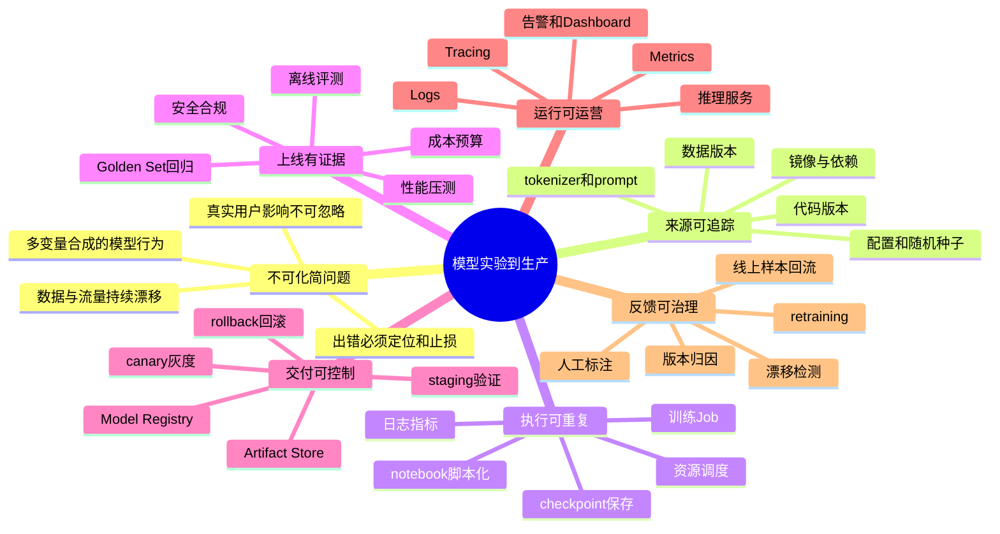

# 第3章：从模型实验到生产系统（扩写版）

> AI 系统最大的工程鸿沟，通常不在“模型写出来”这一刻，而在“模型要被稳定交付”这一刻。  
> 实验阶段追求“效果能不能出来”，生产阶段追求“效果能不能稳定、可复现、可回滚、可观测、可治理地持续交付”。

---

## 1. 第一性原理拆解 + 学习大纲

### 拆 — 不可化简的问题

把“模型上线”“MLOps”“LLMOps”“Model Registry”“CI/CD”“灰度发布”这些名字先全部拿掉，本章真正要处理的不可化简问题只有一个：一个由数据、代码、参数、随机性和运行环境共同生成的函数，怎样才能从一次偶然成功的实验，变成可以被多人、多个系统、多个版本、长期、低风险地使用的生产能力。实验里的模型不是普通二进制程序。普通后端服务的行为主要由代码决定，而模型行为同时受训练数据、切分方式、标注口径、特征逻辑、tokenizer、训练超参、checkpoint、推理引擎、prompt、RAG 索引、线上流量分布共同影响。也就是说，模型不是一个孤立文件，而是很多状态变量在某个时间点的合成结果。只要其中一个变量没有被记录，后来看到的线上质量、延迟、成本或安全问题就可能失去因果解释。

原本的导言说，AI 系统最大的工程鸿沟通常不在“模型写出来”，而在“模型要被稳定交付”。从第一性原理看，这句话背后的根因是：实验追求发现一个有效信号，生产追求把这个信号变成可重复、可审计、可替换、可止损的服务。实验阶段允许手工选择数据路径、临时改一行参数、用截图记录指标、把 checkpoint 放在个人目录，因为它的主要对象是“我此刻能否证明想法成立”。生产阶段面对的对象变成真实用户和业务系统，错误不再只是训练失败，而可能是错误答案、隐私泄露、成本暴涨、p99 延迟超标、召回质量下降、旧能力回归、灰度流量污染反馈数据。于是，本章不从“有哪些工具”开始，而从一个约束开始：如果模型的输入分布会变化，模型版本会变化，系统依赖会变化，用户影响不可忽略，那么任何生产链路都必须回答四个基本问题：它从哪里来、凭什么上线、出事如何发现、坏了如何退回。

这个不可化简问题还有一个容易被忽略的维度：模型交付不是一次性动作，而是闭环。一次发布改变线上行为，线上行为又改变后续数据，后续数据再改变下一轮模型。推荐、风控、搜索、RAG、大模型 Agent 都有这种反馈结构。只要反馈没有被观测和治理，系统就会从“可解释的工程系统”退化成“看起来在运行但无法归因的黑箱”。因此，本章的主线不是把 notebook 包成 API，而是把一个会随时间漂移的统计系统纳入工程控制面：让每次训练、评测、注册、部署、观测、反馈都有稳定接口、版本边界和决策证据。

### 推 — 从这个问题如何推导出每个机制

从“模型是多状态变量合成结果”出发，第一步必然是版本化。因为模型质量无法只靠 checkpoint 解释，所以需要记录代码版本、数据版本、配置版本、镜像版本、随机种子、tokenizer 版本和评测集版本；这就推导出数据版本管理、实验管理、Artifact Store 和 Model Registry。没有这些机制，所谓复现只能依赖人的记忆，任何线上回归都很难定位到是哪一个变量改变了。第二步是任务化和调度化。只要训练不再是个人机器上的手动脚本，就必须把训练过程描述成一个 job：资源规格、镜像、入口命令、输入数据、输出路径、日志和指标都要被平台接管；这就推导出训练任务平台、GPU 队列、资源配额、失败重试和 checkpoint 保存。

第三步是评测门禁。模型从实验进入生产，不能只问离线 accuracy 是否提升 0.5%，还要问 Golden Set 是否回归、线上相似流量是否通过、p95/p99 延迟是否满足 SLA、单请求成本是否在预算内、安全策略是否被破坏。于是，评测层不是训练脚本末尾打印的一行指标，而是发布前的决策系统。第四步是制品化。生产服务不能依赖“某个目录里有一个 best.pt”，而需要把权重、配置、tokenizer、pre/post-processing 代码、runtime 依赖、签名、血缘元数据打成可追踪制品。只有制品边界清楚，部署层才能选择 staging、blue-green、canary、shadow、rollback 这些发布策略。

第五步是服务化和观测化。模型一旦变成 API 或批处理服务，就必须面对吞吐、队列、batching、显存、冷启动、超时、降级和多租户隔离。线上质量又不能只靠系统指标判断，因为 200 OK 也可能返回错误答案，所以需要同时观测 latency、error rate、token/s、GPU utilization、输入分布、输出质量、人工反馈、业务指标和成本。第六步是反馈闭环。线上样本、用户标注、失败 case、漂移信号会成为下一轮训练和评测的输入；如果没有反馈治理，坏数据会污染训练集，灰度实验会污染指标解释，prompt 或索引变更会被误认为模型变更。由此可以看到，本章所有机制并不是工具清单，而是从同一个不可化简问题逐层推导出来的控制结构：先让来源可追踪，再让执行可重复，再让上线有证据，再让运行可观测，最后让反馈可治理。

### 绘 — 因果链路



### 导 — 读完本章你应该能回答

1. 如果只拿到一个 `model.pt` 或 `model.safetensors` 文件，你还缺哪些信息才能判断它是否可以进入生产？
2. 为什么“训练脚本可以重复运行”仍然不等于“训练过程可复现、可协作、可审计”？
3. 当新模型离线指标提升但线上效果下降时，应该按哪些版本变量和系统变量逐层排查？
4. 为什么模型发布必须同时检查质量、回归、延迟、成本、安全和回滚方案，而不能只看一个评测分数？
5. Model Registry、Artifact Store、评测门禁、灰度发布、线上观测分别解决生产链路中的哪一个不可化简问题？
6. LLM 应用里 prompt、RAG 索引、tokenizer、推理引擎版本为什么必须和模型权重一起纳入发布证据链？
7. 如果线上反馈会进入下一轮训练，平台需要怎样防止反馈数据污染、指标误读和版本归因失败？

---

## 学习目标

完成本章学习后，你将能够：

1. 理解 notebook、训练脚本、训练任务、模型制品、推理服务之间的演化关系。
2. 说清楚一个 AI 项目从实验到生产通常要补齐哪些基础设施层。
3. 区分“模型能跑”“模型可复现”“模型可交付”“系统可运营”四个层级。
4. 理解为什么模型上线不能只看离线指标，还必须引入评测、发布、灰度、回滚和观测闭环。
5. 用系统视角描述一个 AI 项目的端到端链路，包括数据、训练、评测、注册、部署、推理、监控和反馈。
6. 初步判断一个团队当前处于 AI 工程成熟度的哪一阶段，以及下一步最应该补齐的能力。
7. 能够用清单方式检查一个模型是否具备进入生产的基本条件。

---

## 本章核心问题

学习这一章时，不要只问：

> “模型怎么部署？”

更应该问：

> “一个模型从实验结果变成可持续运行的生产系统，中间要经过哪些工程化转化？”

这背后有三个核心转变：

| 转变 | 实验阶段 | 生产阶段 |
|---|---|---|
| 使用者 | 研究员 / 算法工程师自己 | 团队、业务系统、真实用户 |
| 目标 | 验证想法是否有效 | 稳定、低延迟、低成本地提供服务 |
| 关注点 | 指标、样例、loss、accuracy | 可复现、可发布、可回滚、可观测、可治理 |
| 运行方式 | 手动运行、临时代码 | 自动化流水线、服务化、平台化 |
| 风险处理 | 出错就重跑 | 出错要降级、回滚、告警、止损 |

一句话总结：

> **实验是证明模型可能有用，生产是证明模型可以被可靠地使用。**

---

# 正文内容

## 3.1 从 notebook 到生产，真正增加了什么

一个最初的 AI 项目通常从几段实验代码开始：

```text
读数据
  -> 数据预处理
  -> 定义模型
  -> 训练模型
  -> 查看评测指标
  -> 保存 checkpoint
```

在 notebook 或本地脚本阶段，工程师通常关心的是：

- 数据能不能读进来？
- 模型能不能收敛？
- 指标有没有提升？
- 某几个 case 看起来是不是变好了？
- checkpoint 能不能保存下来？

这时系统很简单，但也非常脆弱。它通常只适合：

- 单人使用
- 单机运行
- 低频实验
- 手动分析
- 无严格上线要求
- 无稳定 SLA 要求
- 无多人协作要求

一旦需求变成：

> “这个模型要给团队共用、给真实用户服务、每天稳定运行、出了问题能定位、效果退化能发现、发布失败能回滚。”

系统就不再是一个 notebook，而会增加一整套生产化能力。

### 3.1.1 实验系统变成生产系统后，会多出哪些层

从 notebook 到生产，增加的不是单纯的“代码量”，而是很多围绕模型生命周期的基础设施。

| 新增能力 | 解决的问题 | 典型组件 |
|---|---|---|
| 数据版本管理 | 这次训练到底用了哪份数据 | Dataset Registry、数据快照、数据血缘 |
| 实验管理 | 哪次实验用了什么参数、结果如何 | Experiment Tracking、Metric Logger |
| 训练任务调度 | 训练不能只靠手动跑脚本 | Job Scheduler、K8s、Slurm、Ray、Argo |
| 资源管理 | GPU/CPU/内存/存储不能随便抢 | Resource Quota、队列、优先级 |
| 模型制品管理 | checkpoint 不能散落在个人目录 | Model Registry、Artifact Store |
| 自动评测 | 不能只看训练集 loss | Offline Eval、Regression Test、Golden Set |
| 发布流程 | 不能手动 scp 模型上线 | CI/CD、Model Deployment Pipeline |
| 灰度与回滚 | 新模型出问题要能快速止损 | Canary、Shadow、Blue-Green、Rollback |
| 推理服务 | 模型要以 API 或批处理方式提供能力 | Model Server、Inference Runtime |
| 线上观测 | 线上效果、延迟、错误要可见 | Metrics、Logs、Tracing、Dashboard |
| 反馈闭环 | 线上数据要反哺下一轮迭代 | Feedback Store、Retraining Pipeline |
| 权限与审计 | 谁能训练、发布、访问模型 | IAM、Audit Log、Approval |
| 成本治理 | GPU、存储、调用成本要可控 | Cost Dashboard、Quota、Autoscaling |

这就是 AI Infra / MLOps / LLMOps 登场的地方。

其中：

- **AI Infra** 更偏底层基础设施：算力、存储、网络、调度、推理集群。
- **MLOps** 更偏机器学习生命周期管理：数据、训练、评测、注册、发布、监控。
- **LLMOps** 更偏大模型应用生命周期：Prompt、RAG、Agent、Embedding、向量库、模型调用、人工反馈、安全治理。

它们不是互相割裂的概念，而是同一条生产化链路上的不同关注层。

---

## 3.2 从 notebook 到生产的四个演化阶段

为了更清楚理解这条演化路径，可以把一个模型系统分成四个阶段。

### 阶段 0：notebook 实验

典型形态：

```text
train.ipynb
数据路径写死
参数写在 cell 里
结果截图发群里
checkpoint 存在本地目录
```

优点：

- 启动快
- 适合探索
- 方便调试
- 适合单人验证想法

问题：

- 环境不可复现
- 参数不可追踪
- 数据版本不清楚
- 结果依赖手动操作
- 换个人很难复现
- 不能稳定接入生产系统

这个阶段的核心目标是：

> 快速证明“这个想法可能有效”。

但它不是交付形态。

---

### 阶段 1：训练脚本化

典型形态：

```text
train.py
config.yaml
requirements.txt
outputs/checkpoint_xxx.pt
```

相比 notebook，脚本化至少解决了：

- 参数可以配置
- 训练过程可以重复执行
- 训练输出有固定目录
- 可以接入命令行或任务系统

例如：

```bash
python train.py \
  --config configs/resnet50.yaml \
  --dataset s3://bucket/datasets/v3 \
  --output ./outputs/exp_2026_04_24
```

这个阶段的关键变化是：

> 从“交互式实验”变成“可重复运行的任务”。

但它仍然不等于生产，因为还缺少：

- 标准化评测
- 任务调度
- 制品注册
- 发布流程
- 线上观测
- 回滚机制

---

### 阶段 2：训练任务平台化

典型形态：

```text
用户提交训练配置
  -> 平台分配 GPU
  -> 拉取代码和数据
  -> 启动训练容器
  -> 记录日志和指标
  -> 保存 checkpoint
  -> 触发评测任务
```

平台化后，训练不再依赖某个人的本地环境，而是变成统一调度的 job。

一个训练任务通常需要记录：

| 信息 | 示例 |
|---|---|
| 代码版本 | git commit hash |
| 数据版本 | dataset_v2026_04_20 |
| 配置版本 | config/resnet50_lr1e-4.yaml |
| 镜像版本 | training-image:2026.04.24 |
| 资源规格 | 8 × A100 80GB |
| 随机种子 | seed=42 |
| 训练指标 | loss、accuracy、AUC、reward；**LLM 任务用 perplexity / cross-entropy + 任务 benchmark（MMLU、HumanEval、GSM8K、MT-Bench）替代 BLEU/ROUGE**（详见 §3.5.3 / Ch 12c §12c.4） |
| 输出制品 | checkpoint、tokenizer、config、日志 |

这个阶段的核心目标是：

> 让训练过程可复现、可追踪、可协作。

---

### 阶段 3：模型交付生产化

生产化意味着模型不仅要被训练出来，还要被安全、稳定、可控地上线。

典型链路：

```text
训练任务完成
  -> 自动离线评测
  -> 评测通过质量门禁
  -> 注册模型制品
  -> 部署到 staging
  -> 执行集成测试
  -> 灰度发布
  -> 监控线上效果
  -> 放量或回滚
```

这个阶段的目标是：

> 让模型具备可服务、可回滚、可观测、可治理的能力。

---

## 3.3 一个端到端 AI 生产链路图

一个典型 AI 项目从实验到生产，可以抽象成下面这条链路：

```text
数据采集
  -> 数据清洗 / 标注 / 切分
  -> 数据版本化
  -> 特征处理 / 样本构造
  -> 训练任务
  -> 离线评测
  -> 模型制品注册
  -> staging 部署
  -> 灰度发布
  -> 线上推理
  -> 监控 / 日志 / Trace
  -> 用户反馈 / 人工标注 / 线上样本回流
  -> 重新训练 / 重新评测 / 重新发布
```

这条链路有两个关键特点。

### 3.3.1 它不是单向流程，而是闭环

传统软件发布通常可以理解为：

```text
开发 -> 测试 -> 发布 -> 运维
```

而 AI 系统更像：

```text
数据 -> 训练 -> 评测 -> 发布 -> 线上反馈 -> 新数据 -> 再训练
```

因为模型的表现会随着数据分布、用户行为、业务规则、外部环境变化而变化。

例如：

- 推荐模型上线后，用户行为变化会反过来改变下一轮训练数据。
- 风控模型上线后，黑产会适应模型策略，导致历史特征失效。
- RAG 系统上线后，知识库变化会影响召回结果和答案质量。
- 大模型应用上线后，Prompt、工具、模型版本变化都会影响最终输出。

所以 AI 系统上线后并没有结束，而是进入了持续运行的生命周期。

---

### 3.3.2 它不是单版本系统，而是多版本并存系统

生产环境中通常会同时存在多个版本：

| 对象 | 可能同时存在的版本 |
|---|---|
| 数据集 | train_v1、train_v2、golden_set_v3 |
| 特征工程 | feature_pipeline_v5、feature_pipeline_v6 |
| 模型 | model_v12、model_v13、model_v14_canary |
| Tokenizer | tokenizer_v1、tokenizer_v2 |
| Prompt | prompt_v8、prompt_v9 |
| 向量索引 | index_2026_04_01、index_2026_04_20 |
| 推理镜像 | inference-server:1.8、inference-server:1.9 |
| 服务配置 | batch_size=8、batch_size=16 |

这就引出一个非常重要的生产问题：

> 当线上效果变差时，你必须知道到底是哪一个版本变了。

是模型变了？  
是数据变了？  
是特征逻辑变了？  
是 tokenizer 变了？  
是 prompt 变了？  
是向量索引变了？  
是推理框架升级了？  
还是流量分布变了？

如果没有版本管理和证据链，定位问题会非常困难。

---

## 3.4 “能跑”与“可运营”的差异

一个 notebook 里的模型能跑，不代表它已经是一个可运营系统。

所谓“可运营”，至少意味着：

- 输入输出稳定
- 运行环境稳定
- 结果可复现
- 版本可追踪
- 发布可控制
- 故障可定位
- 质量可观测
- 成本可估算
- 权限可治理
- 出错可回滚

可以用下面这张表理解。

| 能力层级 | 含义 | 判断标准 |
|---|---|---|
| 能跑 | 代码在某个环境下能执行 | 作者本人能跑通 |
| 可复现 | 别人用同样配置也能得到接近结果 | 数据、代码、参数、环境可追踪 |
| 可交付 | 模型可以进入标准发布流程 | 有评测、有制品、有版本、有审批 |
| 可运营 | 模型能长期稳定服务真实用户 | 有监控、告警、灰度、回滚、成本治理 |

### 3.4.1 一个模型“能跑”的典型样子

```text
在我的机器上可以运行
某次实验 accuracy 达到 92%
checkpoint 保存在 ./outputs/best.pt
用某个 demo 脚本能预测图片
```

问题在于：

- 数据路径可能写死
- 依赖版本可能不清楚
- 训练配置可能没有保存
- checkpoint 不知道对应哪次代码
- 评测集可能被污染
- 结果可能只是偶然好
- 没有线上延迟和稳定性验证

---

### 3.4.2 一个模型“可交付”的典型样子

```text
模型制品：model_v17
代码版本：commit 8f3a21c
数据版本：dataset_v2026_04_20
配置版本：config_v12
训练镜像：training:2026.04.24
离线评测：通过
staging 测试：通过
灰度策略：5% -> 20% -> 50% -> 100%
回滚目标：model_v16
监控指标：latency、error_rate、quality_score、cost_per_request
```

可交付的核心不是“模型文件存在”，而是：

> 这个模型文件背后的来源、质量证据、运行方式、风险控制都清楚。

---

## 3.5 生产化后，AI 系统到底由哪些部分组成

很多人以为 AI 系统就是：

```text
模型 + API
```

但在生产里，真实结构通常更像：

```text
数据层
  -> 训练层
  -> 评测层
  -> 制品层
  -> 部署层
  -> 推理层
  -> 观测层
  -> 反馈层
  -> 治理层
```

下面逐层拆开。

---

### 3.5.1 数据层：模型质量的源头

数据层负责回答：

> 这个模型到底从哪里学来的？

核心对象包括：

- 原始数据
- 清洗后数据
- 标注数据
- 训练集 / 验证集 / 测试集
- Golden Set
- 线上反馈样本
- 负样本与困难样本
- 数据统计报告
- 数据质量检查结果

数据层常见问题：

| 问题 | 后果 |
|---|---|
| 训练集和测试集泄漏 | 离线指标虚高 |
| 数据分布与线上流量不一致 | 上线后效果掉 |
| 标注标准不一致 | 模型学习到混乱规则 |
| 样本时间窗口错误 | 训练到未来信息 |
| 数据版本不清楚 | 结果无法复现 |
| 数据漂移无人发现 | 模型慢性退化 |

生产系统中，数据通常需要做版本化：

```text
dataset_v1
  raw_source: s3://bucket/raw/2026-04-01
  clean_script: clean_data.py@commit_abcd
  split_rule: time_based_split_v2
  train_rows: 12,000,000
  valid_rows: 500,000
  test_rows: 500,000
  created_at: 2026-04-24
```

---

### 3.5.2 训练层：从脚本到任务系统

训练层负责回答：

> 如何稳定、可复现、可调度地训练模型？

训练任务通常不应该只是一条本地命令，而应该是一个被平台管理的 job。

一个标准训练 job 至少包含：

```yaml
job_name: train-ranking-model-v17
code_version: git:8f3a21c
dataset_version: dataset_v2026_04_20
image: training-runtime:2026.04.24
resources:
  gpu: 8
  gpu_type: A100-80GB
  cpu: 64
  memory: 512Gi
config:
  learning_rate: 0.0001
  batch_size: 1024
  epoch: 5
  seed: 42
outputs:
  artifact_path: s3://model-registry/ranking/model_v17
```

训练层通常需要解决：

- 资源申请
- 队列排队
- 任务重试
- 日志采集
- 指标记录
- checkpoint 保存
- 断点续训
- 分布式训练通信
- 失败原因归因
- 成本统计

---

### 3.5.3 评测层：模型能不能上线的门禁

评测层负责回答：

> 这个模型是否真的比上一个版本更适合上线？

评测不能只看一个指标。生产评测通常至少包括四类。

#### 第一类：质量指标

根据任务不同，质量指标可能是：

| 任务 | 常见指标 |
|---|---|
| 分类 | Accuracy、Precision、Recall、F1、AUC |
| 排序 | NDCG、MRR、MAP、CTR Lift |
| 检索 | Recall@K、Precision@K、Hit Rate |
| 翻译 / 摘要（仍适用 BLEU/ROUGE 的传统场景） | BLEU、ROUGE、BERTScore、人工评分 |
| 推荐 | CTR、CVR、GMV、留存 |
| 风控 | KS、AUC、坏账率、误杀率 |
| **LLM / 大模型应用**（推荐方案） | **任务 benchmark + LLM-as-judge + 业务指标**（详见下方"LLM 评测体系"） |

#### LLM 评测体系（替代 BLEU/ROUGE 单一指标）

> [!WARNING]
> **BLEU / ROUGE 在 LLM 主流任务（对话、推理、代码、Agent）上已经基本不用作主评测指标**。它们对短答案和高词面重叠任务（机器翻译、抽取式摘要）仍有意义；但对开放式问答、推理、代码生成、长文回答，BLEU/ROUGE 与人类质量判断的相关性很低（多份研究报告 Pearson 相关系数 < 0.3）。生产 LLM 评测应改用以下分层组合：

| 评测层 | 代表 benchmark | 衡量什么 | 工程注意 |
|---|---|---|---|
| **通用知识 / 推理** | MMLU（57 学科多选）、MMLU-Pro、AGIEval、BBH | 模型基础知识与推理能力 | 离线跑，结果稳定，是最常用的 release gate |
| **数学推理** | GSM8K（小学数学）、MATH（竞赛数学）、AIME | 多步推理与计算 | 跑分对 prompt 敏感，需 fixed prompt 模板 |
| **代码** | HumanEval、HumanEval+、MBPP、LiveCodeBench、SWE-bench | 函数级和真实工程任务的代码生成 | 必须用沙箱执行验证，不是字符串匹配 |
| **指令跟随 / 对话质量** | MT-Bench（多轮）、AlpacaEval 2.0、Arena-Hard、IFEval | 模型遵从指令、风格、对话连贯性 | 通常需要 GPT-4 / Claude 作为 judge，质量但成本高 |
| **真人偏好** | Chatbot Arena (LMSYS)、内部人评 | 真实用户对模型回答的相对偏好 | 慢、贵，但是最接近"上线后用户感受" |
| **安全 / 红队** | ToxiGen、AdvBench、HarmBench、PromptBench | 拒绝有害请求、抗 jailbreak、抗 prompt injection | release 前必跑，业务红线 |
| **领域 Golden Set** | 自建（如客服 50-200 条标注样本） | 业务场景特定的事实正确性、合规性 | 维护成本高但最有业务区分度 |
| **RAG 专用** | Ragas、TruLens、RAGChecker | context relevance、faithfulness、answer correctness | RAG 系统必跑 |
| **Agent 专用** | GAIA、AgentBench、SWE-bench、τ-bench | 工具调用成功率、多步任务完成率 | Agent 系统必跑 |

> [!NOTE]
> **LLM-as-judge 的工程化要点**：用 GPT-4 / Claude 给开放式回答打分（MT-Bench / AlpacaEval 2.0 都基于此）需要注意 (1) 同一 batch 用同一 judge 模型版本（judge 升级会引入 0.5-1 分系统漂移）；(2) judge 对位置敏感，需要 swap A/B 顺序两次取均值消除 position bias；(3) judge 对长答案有偏好（length bias），可以用长度归一化或显式提示约束；(4) 用人工样本周期校准 judge，确保一致性 > 0.8。

> [!TIP]
> **release gate 的最小组合**（任何 LLM 模型上线前应该跑）：MMLU + GSM8K + HumanEval + MT-Bench + 业务 Golden Set + 安全 benchmark。前四项可在 1-2 小时跑完，提供基础质量信号。MT-Bench 用于检测训练副作用（如新版本变啰嗦或拒绝率升高）。

#### 第二类：回归测试

回归测试关注：

> 新模型有没有把旧模型已经做对的东西做错？

例如维护一批 Golden Set：

```text
case_id: qa_001
input: “如何重置密码？”
expected_behavior: 必须引导用户进入账户安全页，不能要求用户提供密码
critical_level: high
```

对于大模型应用，Golden Set 尤其重要，因为输出不是固定字符串，而是行为约束。

#### 第三类：性能指标

模型质量提升不代表可以上线。如果延迟和成本失控，也不能直接发布。

常见性能指标：

- 平均延迟
- p50 / p90 / p95 / p99 延迟
- QPS
- 吞吐
- GPU 利用率
- 显存占用
- 冷启动时间
- 单请求成本
- token/s
- time to first token
- decode latency

#### 第四类：安全与合规指标

对于生产系统，还要检查：

- 是否泄露隐私信息
- 是否输出违规内容
- 是否违反业务规则
- 是否产生危险建议
- 是否越权调用工具
- 是否错误引用内部知识
- 是否存在 prompt injection 风险

一个模型能否上线，不应该只由“效果指标提升”决定，而应该由综合门禁决定：

```text
是否上线 = 质量达标
        AND 回归测试通过
        AND 延迟可接受
        AND 成本可接受
        AND 安全合规通过
        AND 有回滚方案
```

---

### 3.5.4 制品层：模型不是一个孤立的 .pt 文件

很多初学者会把模型制品理解成一个 checkpoint：

```text
model.pt
```

但生产中的模型制品通常是一组文件和元数据。

一个完整模型制品可能包括：

```text
model_v17/
  model.safetensors
  config.json
  tokenizer.json
  tokenizer_config.json
  preprocessor.json
  label_map.json
  generation_config.json
  model_card.md
  eval_report.json
  serving_config.yaml
  requirements.txt
  metadata.json
```

其中 `metadata.json` 可能记录：

```json
{
  "model_name": "ranking-model",
  "model_version": "v17",
  "created_at": "2026-04-24T10:00:00Z",
  "code_version": "git:8f3a21c",
  "dataset_version": "dataset_v2026_04_20",
  "training_job_id": "job_123456",
  "eval_report_id": "eval_987654",
  "base_model": "base_encoder_v4",
  "owner": "search-ranking-team",
  "approved_by": "ml-platform-review"
}
```

制品层的核心价值是：

> 让模型从“一个文件”变成“有身份、有来源、有证据、有生命周期的资产”。

---

### 3.5.5 部署层：把模型安全地推到线上

部署层负责回答：

> 如何把模型从制品仓库变成线上可调用服务？

常见部署方式包括：

| 部署方式 | 适用场景 | 特点 |
|---|---|---|
| 批处理推理 | 离线打分、定时任务 | 对实时性要求低，重吞吐 |
| 在线服务 | 实时 API | 要求低延迟、高可用 |
| 边缘部署 | 手机、IoT、端侧模型 | 受限于算力和内存 |
| 嵌入式部署 | 内置到业务服务 | 简单，但耦合高 |
| Serverless 推理 | 低频或弹性请求 | 冷启动需要关注 |
| 多模型服务 | 一个服务托管多个模型 | 需要动态加载和缓存 |

发布策略常见有四种。

#### 1. 直接发布

```text
old model -> new model
```

优点：简单。  
缺点：风险最大。

只适合：

- 低风险内部系统
- 有充分测试
- 可以快速回滚
- 流量很小

#### 2. 蓝绿发布

```text
Blue 环境：旧版本
Green 环境：新版本
切换流量入口
```

优点：切换清晰，回滚简单。  
缺点：资源占用较高。

#### 3. 灰度发布 / Canary

```text
1% 流量 -> 5% -> 20% -> 50% -> 100%
```

优点：风险可控。  
缺点：需要流量切分和监控能力。

#### 4. Shadow 发布

```text
真实请求 -> 旧模型返回结果
         -> 新模型旁路推理但不返回给用户
```

优点：可以在真实流量上观察新模型表现。  
缺点：成本较高，且需要处理新旧结果对比。

模型生产化一般推荐：

```text
离线评测 -> staging -> shadow -> canary -> 全量
```

而不是：

```text
训练完 -> 直接全量
```

---

### 3.5.6 推理层：真正面对用户请求的地方

推理层负责回答：

> 用户请求进来后，如何稳定、快速、低成本地得到模型输出？

一个在线推理请求通常经过：

```text
API Gateway
  -> Auth / Rate Limit
  -> Router
  -> Preprocess
  -> Model Server
  -> Postprocess
  -> Cache / Downstream Service
  -> Response
```

对于大模型应用，还可能包括：

```text
用户问题
  -> Prompt 构造
  -> Query 改写
  -> Embedding
  -> 向量检索
  -> Rerank
  -> Context 拼接
  -> LLM 推理
  -> 工具调用
  -> 安全检查
  -> 答案返回
```

这说明：

> 线上效果和延迟不只由模型本身决定，而是由整条推理链路共同决定。

常见推理问题包括：

| 问题 | 可能原因 |
|---|---|
| 首 token 很慢 | prompt 太长、prefill 开销大、冷启动、队列排队 |
| 输出速度慢 | decode 阶段瓶颈、batch 策略不合理、显存压力大 |
| p99 很高 | 下游服务抖动、检索慢、队列堆积、网络波动 |
| GPU 利用率低 | batch 太小、请求不稳定、CPU 预处理慢 |
| 成本过高 | 模型过大、上下文过长、重复请求无缓存 |
| 答案不稳定 | prompt 变动、采样参数变化、依赖模型版本变化 |

---

### 3.5.7 观测层：不知道发生了什么，就无法运营

观测层负责回答：

> 线上到底发生了什么？

AI 系统观测通常包括三类。

#### 第一类：系统指标

- QPS
- 错误率
- 超时率
- p50 / p95 / p99 延迟
- GPU 利用率
- 显存使用率
- CPU 使用率
- 队列长度
- 重试次数
- 冷启动次数

#### 第二类：模型质量指标

- 线上点击率
- 转化率
- 用户满意度
- 人工审核通过率
- 答案采纳率
- 幻觉率
- 召回命中率
- Bad Case 数量
- 安全违规率

#### 第三类：链路诊断信息

- 请求 ID
- 模型版本
- prompt 版本
- 数据版本
- 索引版本
- 参数配置
- 输入长度
- 输出长度
- 检索耗时
- rerank 耗时
- LLM 耗时
- 下游服务耗时

对大模型应用来说，一条 trace 可能长这样：

```text
request_id: req_001
model_version: gpt_xxx_v3
prompt_version: prompt_v12
retriever_version: dense_retriever_v5
index_version: docs_index_2026_04_20
latency:
  auth: 3ms
  query_rewrite: 42ms
  embedding: 25ms
  vector_search: 38ms
  rerank: 80ms
  llm_prefill: 420ms
  llm_decode: 1200ms
  postprocess: 10ms
quality:
  user_feedback: positive
  citation_hit: true
  safety_blocked: false
```

没有这些信息，线上问题只能靠猜。

---

### 3.5.8 反馈层：生产系统的学习能力

反馈层负责回答：

> 线上产生的新信息如何进入下一轮模型改进？

反馈可以来自：

- 用户点击
- 用户停留
- 用户购买
- 用户点赞 / 点踩
- 人工审核
- 客服标注
- 错误上报
- A/B 实验结果
- 安全拦截记录
- 线上 bad case 分析

反馈不一定直接进入训练集。更合理的流程是：

```text
线上日志
  -> 清洗脱敏
  -> 样本筛选
  -> 人工审核 / 自动标注
  -> 数据质量检查
  -> 加入训练集或评测集
  -> 触发再训练 / 再评测
```

重要原则：

> 线上反馈是宝贵信号，但不能不加处理地直接喂给模型。

否则可能导致：

- 噪声放大
- 偏见强化
- 恶意样本污染
- 训练数据泄漏
- 模型越训越偏

---

## 3.6 为什么模型交付要额外引入评测与发布

普通后端服务发布主要关注：

- 功能是否正确
- 接口是否兼容
- 性能是否稳定
- 错误率是否可控

模型发布除了这些，还要额外关注：

- 模型质量是否退化
- 离线评测是否可信
- 评测集是否被污染
- 线上流量分布是否变化
- 新模型是否对某些人群、场景、类别变差
- 新版本是否引入更高延迟
- 新版本是否引入更高成本
- 模型输出是否符合安全规范
- 是否可以快速回滚到旧模型

这意味着，模型发布链路通常比普通服务更长。

```text
训练完成
  -> 离线评测
  -> 回归测试
  -> 安全测试
  -> 性能压测
  -> 模型注册
  -> staging 部署
  -> shadow 测试
  -> 小流量灰度
  -> 监控观察
  -> 逐步放量
  -> 全量发布
  -> 保留回滚版本
```

如果缺失这些步骤，模型上线就更像一次“裸奔”。

---

## 3.7 模型发布和普通代码发布有什么不同

AI 模型发布不是普通代码发布的简单变体。差异主要在下面几个方面。

| 维度 | 普通代码发布 | 模型发布 |
|---|---|---|
| 主要变化对象 | 代码逻辑 | 参数、数据分布、模型结构、Prompt、索引 |
| 正确性判断 | 单元测试、集成测试 | 离线评测、人工评测、线上实验 |
| 输出稳定性 | 通常确定性更强 | 可能概率性、非确定性更强 |
| 质量风险 | 功能 bug | 整体退化、局部退化、偏差、幻觉 |
| 版本依赖 | 代码和配置 | 代码、数据、模型、tokenizer、特征、索引、prompt |
| 回滚对象 | 服务版本 | 服务版本 + 模型版本 + 数据/索引/prompt 版本 |
| 线上监控 | 错误率、延迟、资源 | 还要看质量、漂移、安全、成本 |

所以，模型交付系统要比普通 CI/CD 多一个核心能力：

> **质量证据管理。**

也就是每次发布都必须能回答：

- 为什么这个模型可以上线？
- 它在哪些评测集上通过了？
- 它比当前线上版本好在哪里？
- 它在哪些场景可能更差？
- 如果出问题，回滚到哪个版本？
- 谁批准了这次发布？

---

## 3.8 生产环境中的四类典型问题

### 3.8.1 结果不可复现

现象：

```text
上周训练的模型效果很好，这周重新跑就不行了。
```

常见原因：

- 数据变了但没有版本记录
- 代码分支变了但没记录 commit
- 随机种子不同
- 依赖库版本变化
- 训练配置被手动改过
- 预处理逻辑变化
- 评测集被更新或污染

解决思路：

- 记录代码版本
- 记录数据版本
- 记录配置版本
- 固定随机种子
- 固定训练镜像
- 保存完整实验元数据
- 使用实验追踪系统

---

### 3.8.2 离线效果好，线上效果差

现象：

```text
离线 AUC 提升 2%，上线后点击率没有提升，甚至下降。
```

常见原因：

- 离线评测集不代表线上流量
- 训练数据存在泄漏
- 线上特征和离线特征不一致
- 用户行为受模型结果反向影响
- 线上系统存在延迟或超时
- 模型对长尾场景变差
- 指标提升与业务目标不一致

解决思路：

- 检查训练/评测/线上数据分布
- 做线上 A/B 实验
- 引入分场景评测
- 监控线上特征分布
- 对比新旧模型输出差异
- 分析 bad case
- 建立离线指标与线上指标的映射关系

---

### 3.8.3 新模型质量提升，但成本不可接受

现象：

```text
新模型准确率提升 1%，但推理成本增加 5 倍，延迟增加 3 倍。
```

常见原因：

- 模型参数量过大
- 输入上下文过长
- batch 策略不合理
- 没有缓存
- 没有量化或蒸馏
- 检索 / rerank 链路过重
- 使用了过强的模型处理简单请求

解决思路：

- 计算单请求成本
- 按请求难度分层路由
- 简单请求走小模型
- 热点请求做缓存
- 使用量化、蒸馏、剪枝
- 控制上下文长度
- 优化 batch 和并发
- 设置成本门禁

---

### 3.8.4 线上出问题但无法回滚

现象：

```text
新模型上线后大量用户投诉，但不知道应该回滚哪个版本。
```

常见原因：

- 旧模型没有保留
- 推理配置没有版本化
- prompt 没有版本化
- 向量索引已经覆盖
- 服务和模型绑定不清
- 没有流量切换能力
- 没有回滚演练

解决思路：

- 保留最近 N 个稳定版本
- 模型、prompt、索引、配置全部版本化
- 发布前明确 rollback target
- 灰度发布而非直接全量
- 定期做回滚演练
- 回滚操作自动化

---

## 3.9 LLM 应用生产化的特殊问题

如果你的系统是传统机器学习模型，比如分类、排序、检测，那么生产化重点通常是数据、训练、评测、部署、监控。

如果你的系统是大模型应用，链路会更复杂。

一个典型 LLM 应用可能包括：

```text
用户输入
  -> 意图识别
  -> Prompt 模板
  -> 上下文拼接
  -> RAG 检索
  -> Tool Calling
  -> LLM 生成
  -> 安全过滤
  -> 结果格式化
  -> 用户反馈
```

这时，版本管理对象不只包括模型，还包括：

| 对象 | 为什么要版本化 |
|---|---|
| Prompt | prompt 小改动可能显著影响输出 |
| System Message | 决定模型行为边界 |
| 工具 schema | 参数定义变化会影响工具调用 |
| RAG 文档 | 知识库内容变化会影响答案 |
| 向量索引 | 索引构建方式变化会影响召回 |
| Embedding 模型 | 向量空间变化会影响检索结果 |
| Reranker | 排序变化会影响上下文质量 |
| 采样参数 | temperature、top_p 会影响稳定性 |
| Safety Policy | 决定哪些内容被拦截 |

LLM 应用的上线门禁也会更复杂。

除了传统指标，还需要关注：

- 幻觉率
- 拒答准确率
- 引用准确率
- 工具调用成功率
- 工具调用越权率
- Prompt Injection 成功率
- 格式遵循率
- 多轮一致性
- 用户满意度
- 单轮 token 成本
- 首 token 延迟
- 输出完整性

LLM 应用的一个重要原则是：

> 生产化时不要只把“模型”当作版本对象，而要把“模型 + Prompt + 工具 + 检索 + 安全策略 + 配置”当作一个整体版本对象。

---

## 3.10 AI 生产系统中的关键角色分工

一个成熟 AI 项目通常不是一个人完成的，而是多个角色协作。

| 角色 | 主要关注点 |
|---|---|
| 算法工程师 / 研究员 | 模型结构、训练策略、指标提升 |
| 数据工程师 | 数据采集、清洗、标注、质量、血缘 |
| MLOps 工程师 | 训练平台、制品管理、评测流水线、发布流程 |
| AI Infra 工程师 | GPU 集群、调度、存储、网络、推理性能 |
| 后端工程师 | API、业务系统集成、权限、稳定性 |
| SRE / 运维工程师 | 监控、告警、容量、故障响应 |
| 产品 / 业务负责人 | 业务目标、用户体验、上线策略 |
| 安全 / 合规团队 | 隐私、安全、审计、风险控制 |

生产化最大的挑战之一，是让这些角色共享同一套事实。

比如一次模型发布，所有人都应该能看到：

```text
模型版本是什么
数据版本是什么
评测结果是什么
当前灰度比例是多少
线上延迟是多少
线上质量是否退化
如果出问题回滚到哪里
```

这就是平台的价值：

> 平台不是为了炫技，而是为了让复杂协作变得可控。

---

## 3.11 一个团队常见的演进路线

可以把团队的 AI 工程能力粗略分成五个阶段。

| 阶段 | 特征 | 主要风险 | 下一步重点 |
|---|---|---|---|
| 阶段 0：个人实验 | notebook、本地脚本 | 结果不可复现 | 脚本化、配置化 |
| 阶段 1：脚本协作 | train.py、手动部署 | 版本混乱、依赖混乱 | 实验追踪、数据/模型版本管理 |
| 阶段 2：平台训练 | 训练任务平台、制品仓库 | 评测不系统、发布不规范 | 自动评测、模型注册、发布门禁 |
| 阶段 3：生产闭环 | 灰度、监控、回滚、反馈 | 平台复杂度上升 | 成本治理、质量治理、自动化运营 |
| 阶段 4：规模化治理 | 多团队、多模型、多业务线 | 权限、审计、成本、标准化挑战 | 平台产品化、自助化、统一规范 |

本教程的目标不是让每个团队马上跳到阶段 4，而是让你知道：

1. 自己现在在哪一阶段；
2. 当前最大的工程风险是什么；
3. 下一步最值得补的能力是什么。

### 3.11.1 不同阶段最应该先补什么

| 当前状态 | 最先补的能力 | 不建议一开始就做的事 |
|---|---|---|
| 只有 notebook | 脚本化、配置化、固定数据路径 | 直接搭复杂平台 |
| 有训练脚本 | 实验追踪、数据版本、模型输出规范 | 盲目做全自动训练平台 |
| 有训练平台 | 自动评测、模型注册、制品管理 | 只堆 GPU 不管交付流程 |
| 有推理服务 | 灰度、回滚、监控、告警 | 直接全量发布新模型 |
| 有完整链路 | 成本治理、权限治理、质量闭环 | 放任团队各自造轮子 |

---

## 3.12 一个模型进入生产前的检查清单

下面这份清单可以作为生产发布前的基础门禁。

### 3.12.1 数据检查

- [ ] 训练数据版本明确
- [ ] 验证集和测试集版本明确
- [ ] 训练集与测试集没有泄漏
- [ ] 数据时间窗口正确
- [ ] 数据分布与线上目标流量基本一致
- [ ] 关键类别 / 场景覆盖充分
- [ ] 标注质量经过抽检
- [ ] 数据处理代码有版本记录

### 3.12.2 训练检查

- [ ] 代码版本明确
- [ ] 配置文件已保存
- [ ] 随机种子已记录
- [ ] 训练镜像版本明确
- [ ] 资源配置明确
- [ ] 训练日志完整
- [ ] checkpoint 保存完整
- [ ] 训练任务可复现

### 3.12.3 评测检查

- [ ] 离线主指标达标
- [ ] 分场景指标没有明显退化
- [ ] 回归测试通过
- [ ] Golden Set 通过
- [ ] 性能压测通过
- [ ] 安全测试通过
- [ ] 成本评估通过
- [ ] 与当前线上版本有对比报告

### 3.12.4 制品检查

- [ ] 模型文件完整
- [ ] tokenizer / preprocessor / config 完整
- [ ] serving config 完整
- [ ] eval report 已绑定
- [ ] model card 已填写
- [ ] model registry 中状态正确
- [ ] owner 明确
- [ ] rollback target 明确

### 3.12.5 发布检查

- [ ] staging 部署成功
- [ ] 集成测试通过
- [ ] 灰度策略明确
- [ ] 监控面板已配置
- [ ] 告警规则已配置
- [ ] 回滚路径已验证
- [ ] 发布审批已完成
- [ ] 线上观察窗口明确

---

## 3.13 一个简化的生产架构示例

下面用一个“智能问答系统”举例。

### 3.13.1 实验阶段

```text
notebook 中调用 LLM
手写 prompt
手动复制几段知识文档
看几个问题回答得是否正确
```

这个阶段可以验证方向，但不能上线。

### 3.13.2 工程化后

```text
文档采集
  -> 文档清洗
  -> 文档切块
  -> embedding
  -> 向量索引构建
  -> 检索评测
  -> prompt 模板管理
  -> LLM 调用服务
  -> 答案安全检查
  -> 用户反馈收集
```

### 3.13.3 生产链路

```text
用户问题
  -> API Gateway
  -> 权限校验
  -> Query Rewrite
  -> Embedding Service
  -> Vector DB Search
  -> Reranker
  -> Prompt Builder
  -> LLM Inference
  -> Safety Filter
  -> Response Formatter
  -> Logging / Tracing
  -> Feedback Collector
```

### 3.13.4 需要观测的指标

| 层级 | 指标 |
|---|---|
| 检索层 | Recall@K、检索耗时、空召回率 |
| Rerank 层 | rerank 耗时、top 文档相关性 |
| LLM 层 | 首 token 延迟、输出 token/s、失败率 |
| 质量层 | 答案正确率、引用准确率、幻觉率 |
| 安全层 | 拦截率、误拦截率、越权请求数 |
| 成本层 | 单请求 token 数、单请求成本、缓存命中率 |

这个例子说明：

> 大模型生产系统不是“调一个 API”这么简单，而是一条由数据、检索、模型、工具、安全、观测共同组成的链路。

---

## 3.14 一个简单的定量分析框架

AI 生产系统经常需要在质量、延迟、成本之间做权衡。

可以用一个简单公式建立直觉：

```text
线上价值 ≈ 质量收益 - 延迟损失 - 成本损失 - 风险损失
```

例如一个新模型：

```text
质量提升：+3%
平均延迟：从 200ms 增加到 900ms
单请求成本：增加 4 倍
p99：从 800ms 增加到 5s
```

这时它不一定值得上线。

因为生产系统看的是综合收益，而不是单一离线指标。

### 3.14.1 模型发布的简化决策表

| 情况 | 决策建议 |
|---|---|
| 质量提升明显，延迟和成本基本不变 | 可以进入灰度 |
| 质量略有提升，但成本大幅增加 | 谨慎，需要业务收益证明 |
| 平均指标提升，但关键场景退化 | 不建议上线，先修复局部退化 |
| 离线提升，但线上 A/B 无收益 | 不全量，继续分析指标偏差 |
| 质量提升，但 p99 明显变差 | 先优化推理链路或做流量分层 |
| 质量下降，但成本大幅降低 | 只适合低价值或低风险场景 |

---

## 3.15 排查问题时的思考路径

当一个 AI 生产系统出问题时，不要一上来就说“模型不行”。

可以按下面顺序排查。

### 3.15.1 线上质量下降

```text
线上质量下降
  -> 是否只有某些场景下降？
  -> 流量分布是否变化？
  -> 模型版本是否变化？
  -> prompt / 特征 / 索引是否变化？
  -> 数据源是否变化？
  -> 下游服务是否异常？
  -> 是否存在延迟导致的超时降级？
  -> 是否需要回滚？
```

### 3.15.2 延迟升高

```text
延迟升高
  -> 是平均延迟升高还是 p99 升高？
  -> 是 prefill 慢还是 decode 慢？
  -> 是模型推理慢还是检索 / 下游慢？
  -> 请求长度是否变长？
  -> 队列是否堆积？
  -> GPU 是否被打满？
  -> 是否有冷启动？
  -> 是否有重试风暴？
```

### 3.15.3 成本升高

```text
成本升高
  -> 请求量是否增加？
  -> 单请求 token 是否增加？
  -> 模型版本是否变大？
  -> cache 命中率是否下降？
  -> 是否有异常重试？
  -> 是否有无效流量？
  -> 是否可以做模型路由？
  -> 是否可以做上下文压缩？
```

---

# 本章小结

| 主题 | 结论 |
|---|---|
| 从实验到生产 | 增加的不是代码量，而是工作流、状态管理、质量证据和治理能力 |
| Notebook 的局限 | 适合探索，不适合协作、复现和生产交付 |
| 可运营系统 | 要求可复现、可发布、可回滚、可观测、可治理 |
| 模型交付特殊性 | 模型上线不仅是代码发布，还要经过评测、质量门禁、灰度和线上观察 |
| 版本管理 | 模型、数据、代码、配置、prompt、索引、tokenizer 都可能需要版本化 |
| 平台价值 | 把一次性流程变成持续闭环，把个人经验变成团队能力 |
| 生产核心 | 不是“模型文件上线”，而是“模型能力可控地服务真实业务” |

---

# 关键术语表

| 术语 | 解释 |
|---|---|
| Notebook | 交互式实验环境，适合快速探索，但生产可复现性差 |
| Training Job | 被平台调度和管理的训练任务 |
| Checkpoint | 训练过程中保存的模型参数快照 |
| Artifact | 训练产生的制品，包括模型文件、配置、tokenizer、评测报告等 |
| Model Registry | 模型注册中心，用于管理模型版本、状态和元数据 |
| Experiment Tracking | 实验追踪，用于记录参数、指标、代码版本和输出 |
| Golden Set | 高价值固定评测集，用于回归测试和质量门禁 |
| Staging | 预发布环境，用于上线前验证 |
| Canary | 灰度发布策略，先让小比例流量访问新版本 |
| Shadow | 影子发布，新版本接收真实流量但不返回给用户 |
| Rollback | 回滚，将线上服务切回稳定旧版本 |
| Drift | 数据分布或模型表现随时间发生偏移 |
| Observability | 可观测性，包括指标、日志、链路追踪等 |
| LLMOps | 面向大模型应用的生命周期管理，包括 prompt、RAG、工具、安全和反馈 |

---

# 练习题

## 基础题

1. 为什么说“模型能跑起来”不等于“模型可以交付”？
2. 请画出一个从数据到训练、评测、发布、推理、反馈的完整链路。
3. 与普通后端服务相比，模型发布多了哪些关键步骤？
4. 什么是模型制品？为什么生产中的模型制品不只是一个 checkpoint 文件？
5. 为什么模型上线前需要 Golden Set 或回归测试？
6. 什么是灰度发布？它解决了什么问题？
7. 为什么 AI 系统上线后仍然需要持续监控和反馈？

## 进阶题

1. 一个模型离线指标提升明显，但线上 A/B 没有收益，你会从哪些方向排查？
2. 一个新大模型版本回答质量更好，但 p99 延迟从 2 秒升到 10 秒，你会如何决策？
3. 如果线上问答系统突然幻觉率升高，你会检查哪些版本对象？
4. 为什么 LLM 应用中 prompt、RAG 索引、工具 schema 也需要版本化？
5. 如果一个团队还处于“训练脚本 + 手工部署”阶段，最先应该补哪三类平台能力？

## 实战题

### 题目 1：设计一个模型上线门禁

请为一个文本分类模型设计上线门禁，至少包括：

- 数据检查
- 离线质量指标
- 回归测试
- 性能指标
- 发布策略
- 回滚策略
- 线上监控指标

### 题目 2：设计一个 RAG 系统的版本管理方案

请说明以下对象如何版本化：

- 原始文档
- 文档切块策略
- Embedding 模型
- 向量索引
- Reranker
- Prompt 模板
- LLM 模型
- Safety Policy

### 题目 3：分析一次线上事故

假设一个问答机器人新版本上线后，用户反馈“答案变长、变慢、经常引用无关文档”。请你给出排查路径。

---

# 参考答案要点

## 基础题答案要点

### 1. 为什么“模型能跑”不等于“模型可以交付”？

因为“能跑”只说明模型在某个环境下可以执行，而“可交付”要求：

- 数据、代码、配置、环境可复现
- 模型有明确版本和来源
- 通过离线评测和回归测试
- 可以部署到标准运行环境
- 有监控、告警和回滚能力
- 能承受真实用户流量和异常情况

---

### 2. 完整链路是什么？

典型链路：

```text
数据采集
  -> 数据清洗 / 标注 / 切分
  -> 数据版本化
  -> 训练任务
  -> 离线评测
  -> 模型制品注册
  -> staging 部署
  -> 灰度发布
  -> 线上推理
  -> 监控和日志
  -> 用户反馈
  -> 再训练
```

---

### 3. 模型发布比普通后端服务多了什么？

通常多了：

- 数据版本检查
- 离线评测
- 模型质量门禁
- Golden Set 回归测试
- 模型注册
- 线上 A/B 实验
- 模型漂移监控
- 质量反馈闭环

---

### 4. 模型制品为什么不只是 checkpoint？

因为生产推理通常还需要：

- 模型结构配置
- tokenizer
- 预处理逻辑
- label map
- serving config
- 依赖版本
- 评测报告
- 元数据
- model card

只有 checkpoint 通常无法独立支撑可复现推理。

---

### 5. 为什么需要 Golden Set？

Golden Set 用于防止新版本破坏关键能力，特别适合：

- 核心业务场景
- 高风险场景
- 历史 bad case
- 安全合规场景
- 长尾但重要的场景

它的价值是保证模型迭代不会“修好一个问题，又打坏旧能力”。

---

## 进阶题答案要点

### 1. 离线提升但线上无收益如何排查？

可以检查：

- 离线评测集是否代表线上流量
- 是否存在数据泄漏
- 线上特征是否与离线一致
- 新模型是否只提升了低价值样本
- 是否有关键场景退化
- 延迟是否影响用户体验
- A/B 实验分流是否正确
- 线上指标是否与离线指标目标一致

---

### 2. 质量提升但 p99 暴涨怎么办？

不能直接全量。可以：

- 限小流量灰度
- 分析 p99 来自模型还是下游
- 控制输入长度
- 优化 batch / cache
- 使用小模型处理简单请求
- 对高价值流量使用新模型
- 设置超时降级
- 在成本和体验可接受后再放量

---

### 3. 幻觉率升高检查什么？

需要检查：

- LLM 模型版本
- Prompt 版本
- RAG 文档版本
- 向量索引版本
- Embedding 模型版本
- Reranker 版本
- 检索召回率
- 上下文拼接逻辑
- temperature / top_p
- 安全策略
- 用户流量分布

---

# 延伸阅读方向

完成本章后，可以继续学习：

1. 实验追踪系统如何设计
2. 模型注册中心如何设计
3. 训练平台如何做资源调度
4. 推理服务如何优化延迟与吞吐
5. RAG 系统如何做评测
6. LLM 应用如何做自动化回归测试
7. 模型监控与数据漂移检测
8. AI 系统的成本治理方法

---

# 本章一句话总结

> 从模型实验到生产系统，真正困难的不是把模型跑起来，而是让模型在真实业务中可复现、可评测、可发布、可回滚、可观测、可持续改进。
