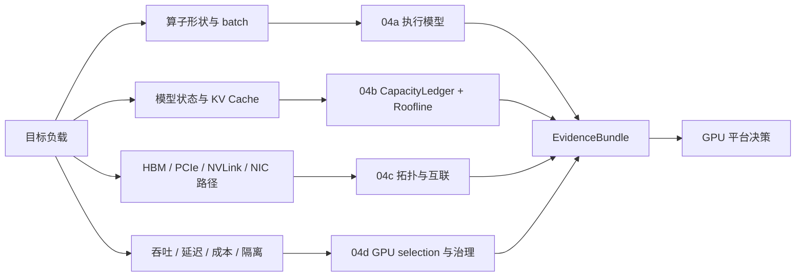

# 第4章：GPU 与加速器导览

> **本章已拆分为独立子章**：原来的 GPU 与加速器内容过于集中，容易把执行模型、显存带宽、互联系统、选型治理混在一起。现在第 4 章保留为导览章，详细内容拆到 04a-04d。读完导览后，按你的目标负载进入对应子章。

## 1. 第一性原理拆解 + 学习大纲

### 拆 — 不可化简的问题

把 H100、HBM、Tensor Core、NVLink、MIG 这些名字先拿掉，AI 加速器要解决的不可化简问题是：**有限功耗和有限硅面积下，平台必须让大量矩阵和张量状态在正确的时间出现在正确的计算单元旁边，并在吞吐、延迟、成本、隔离和故障半径之间做可验证的取舍。**

这句话拆开后只有五个基本量：

- **计算槽**：SM、Tensor Core、矩阵单元和向量单元每秒能发出多少有效计算。
- **状态字节**：权重、梯度、优化器状态、激活、KV Cache、workspace、通信 buffer 必须真实占用 HBM。
- **搬运路径**：HBM、L2、PCIe、NVLink、NVSwitch、NIC、存储和 CPU 预处理负责把字节送到计算旁边。
- **并行距离**：单 GPU、节点内、机柜内和跨节点网络的延迟/带宽/同步成本不同。
- **治理边界**：GPU selection、MIG、MPS、异构加速器、调度标签和故障域决定资源能否被稳定复用。

平台工程师说“GPU 不够快”时，可能指的是完全不同的问题：kernel 没有把 SM 和 Tensor Core 喂满；模型权重、激活、优化器状态或 KV Cache 放不下；HBM 带宽、PCIe、NVLink、网络或存储搬运成为瓶颈；多卡拓扑和并行策略不匹配；采购时混用了 dense / sparse、单卡 / 系统级、FP16 / FP8 / FP4 等 datasheet 口径；调度器无法表达 MIG、异构 GPU、非 NVIDIA 加速器和不同故障域。

这些问题共享“GPU”这个名字，但排查工具、系统边界和工程决策不同。把它们塞在同一章里，会导致内容看起来像参数百科，而不是可操作的判断路径。

### 推 — 从问题推导出四个子章

从“计算槽有限”推出 [04a GPU 执行模型与 Tensor Core](./04a-gpu-execution-model-and-tensor-cores.md)。它回答 SIMT、warp、occupancy、Tensor Core、低精度和 kernel 证据路径：为什么 `nvidia-smi` 显示 busy 不能证明 Tensor Core 忙，为什么 `nsys` 的时间线和 `ncu` 的 kernel 指标要一起看。

从“状态字节真实占用 HBM”推出 [04b HBM、显存预算与 Roofline](./04b-hbm-memory-and-roofline.md)。它回答 CapacityLedger、训练/推理显存公式、KV Cache、arithmetic intensity、Roofline 和 memory-bound 判断：为什么“权重放下了”仍可能 OOM，为什么 decode 常受 HBM 而不是 TFLOPS 限制。

从“搬运路径有距离”推出 [04c GPU 互联与系统形态](./04c-gpu-interconnect-and-systems.md)。它回答 PCIe、NVLink、NVSwitch、HGX、GB200 NVL72、NIC rail、NCCL 和拓扑诊断：为什么 8 张 GPU 不等于一个均匀 8-GPU 资源，为什么 topology retest 是长训练启动前的门禁。

从“治理边界决定复用”推出 [04d GPU 选型、虚拟化与异构加速器](./04d-gpu-selection-virtualization-and-heterogeneous-accelerators.md)。它回答 GPU selection、datasheet caveats、MIG、MPS、time-slicing、异构池和非 NVIDIA 生态成本：为什么最快的卡不一定是单位 token 成本最低的卡。

### 本章拥有 / 不拥有

本导览章拥有四件事：给出第 4 章 GPU 家族的判断框架；定义跨子章共享的证据包；说明各子章边界；给读者一个从症状到章节的入口。它不拥有 CUDA runtime 细节、stream 同步、算子库实现、RDMA 网络全链路、训练并行算法和 serving scheduler 的完整实现，这些分别交给第 5、6、8-10、15-17 和平台调度章节。

如果一次排障跨越多个边界，先在本章归类，再进入子章。例如：

- `nsys` 显示大量 launch 空洞，优先进入 04a 和第 6 章。
- HBM 水位接近上限或 OOM，优先进入 04b。
- NCCL collective 尾延迟大、跨节点扩展差，优先进入 04c。
- 资源池切分、MIG/MPS、异构 SKU 或采购口径不清，优先进入 04d。

### 绘 — 判断链路



### 导 — 读完本章你应该能回答

1. 为什么 GPU 性能问题必须先拆成执行、容量、带宽、互联和治理，而不能只看 utilization？
2. `nsys`、`ncu`、`torch.profiler`、DCGM、`nvidia-smi topo -m` 和 NCCL 日志分别证明什么？
3. CapacityLedger 里哪些字节必须算入训练，哪些必须算入推理？
4. Roofline 如何把 HBM 带宽和 Tensor Core 算力放到同一个判断坐标系？
5. NVLink / NVSwitch / PCIe / NIC rail 的拓扑错误为什么会让“有卡”变成“跑不快”？
6. MIG、MPS、time-slicing 和异构加速器分别解决什么问题，又牺牲什么？
7. benchmark 结果在什么 threshold 下可以接受，什么情况下必须 retest 或回滚？

## 2. EvidenceBundle：GPU 问题先收证据，再下结论

第 4 章后续子章都使用同一个 EvidenceBundle。没有这个证据包，不要把问题归因给某个硬件部件。

| 证据类别 | 最小采集项 | 解释什么 | 常见归属 |
|----------|------------|----------|----------|
| 端到端时间线 | `nsys profile`、`torch.profiler` trace、step time、TTFT/TPOT/P99 | 时间花在 kernel、launch、CPU、同步还是 IO | 04a / 第6章 |
| 单 kernel 细节 | `ncu` sections: occupancy、warp stall、tensor pipe、memory workload、register spill | Tensor Core 是否命中，warp 是否在等内存或分支 | 04a |
| 容量账本 | CapacityLedger：权重、激活、optimizer、KV Cache、workspace、reserved、headroom | 是容量失败还是碎片/峰值失败 | 04b |
| Roofline 信号 | ops、bytes moved、有效 HBM 带宽、Tensor Core 利用、machine balance | memory-bound 还是 compute-bound | 04b |
| 拓扑证据 | `nvidia-smi topo -m`、`nvidia-smi nvlink -s`、`lspci -tv`、NCCL topology dump、`nccl-tests` | GPU-GPU、GPU-NIC、NUMA、rail 是否匹配作业通信图 | 04c |
| 健康与运行态 | DCGM、ECC/Xid、温度、功耗、NVLink counters、IB/RoCE port errors | 是否是硬件、链路或设施降级 | 04c / 04d |
| 选型基准 | BenchmarkProtocol：GEMM、HBM bandwidth、NCCL/RCCL/HCCL、真实训练/推理回放 | datasheet 口径能否兑现到目标负载 | 04d |

最小命令模板：

```bash
# 时间线：先看端到端空洞、CPU/GPU 同步和 kernel 排列
nsys profile -t cuda,nvtx,osrt,cudnn,cublas -o trace_report python run_workload.py

# PyTorch：把 framework op、CUDA kernel 和显存峰值放到同一条线
python -m torch.utils.bottleneck run_workload.py

# 单 kernel：只对已经在 nsys/torch.profiler 中确认很慢的 kernel 下钻
ncu --set full --target-processes all -o kernel_report python run_workload.py

# 设备健康与容量：持续采样，而不是只看一次 nvidia-smi
dcgmi dmon -e 100,101,150,155,156,203,204

# 拓扑：启动前确认 GPU-GPU、GPU-NIC、NUMA 距离
nvidia-smi topo -m
nvidia-smi nvlink -s
lspci -tv
```

EvidenceBundle 的 retest 规则很简单：修复后必须用同一模型、同一 batch/sequence/concurrency、同一驱动和同一拓扑重跑；如果输入分布、GPU SKU、MIG profile、NCCL topology、引擎版本或 power cap 变了，旧结论自动失效。

## 3. CapacityLedger 与 BenchmarkProtocol

### 3.1 CapacityLedger

CapacityLedger 是第 4 章的容量账本，最少要写出：

```text
训练峰值显存 =
  weights
+ gradients
+ optimizer_state
+ master_weights
+ activations
+ temporary_workspace
+ communication_buffers
+ framework_reserved
+ fragmentation_headroom

推理峰值显存 =
  resident_weights
+ KV_cache
+ runtime_workspace
+ CUDA_graph_pool
+ prefix_or_paged_cache_metadata
+ fragmentation_headroom
```

容量判断必须区分三种 threshold：

- **硬上限 threshold**：显存、HBM 带宽、PCIe lane、NVLink/NIC 链路是否物理不足。
- **稳态 threshold**：长时间运行时 p95/p99 memory watermark、tokens/s/GPU、step time 是否达标。
- **安全余量 threshold**：训练通常保留 10%-20% 显存 headroom；在线推理还要给长请求、paged KV 碎片、模型热切换和故障迁移留余量。

### 3.2 BenchmarkProtocol

BenchmarkProtocol 用来把 datasheet 数字折算成平台可承诺数字。一次 GPU 选型或性能修复至少要覆盖：

| 测试 | 必须固定的变量 | 通过条件示例 |
|------|----------------|--------------|
| GEMM / attention microbenchmark | dtype、shape、layout、batch、driver、库版本 | 与同 SKU 内部基线偏差不超过 10%-15% |
| HBM bandwidth | 访问模式、读写比例、clock/power cap | 有效带宽没有明显低于同型号健康节点 |
| NCCL / RCCL / HCCL | GPU 数、rank 绑定、NIC rail、消息大小 | all-reduce 带宽/延迟达到集群基线 threshold |
| 训练 smoke test | 100-1000 step、loss、显存峰值、checkpoint | step time 稳定，无 Xid/ECC/NCCL timeout |
| 推理回放 | prompt/output 长度分布、并发、cache 策略 | TTFT/TPOT/P99/goodput 达到 SLO |
| 虚拟化测试 | MIG profile、MPS 配置、租户组合 | slice 隔离、尾延迟和显存水位满足承诺 |

BenchmarkProtocol 的 retest 条件：driver/CUDA/ROCm/CANN/Neuron 版本变化、推理引擎升级、MIG profile 变化、power cap 调整、拓扑维修、BIOS/firmware 更新、模型结构或 dtype 变化，都必须重新跑基线。

## 4. 拆分后的阅读路径

| 子章 | 主题 | 你应该在什么时候读 |
|------|------|--------------------|
| [04a GPU 执行模型与 Tensor Core](./04a-gpu-execution-model-and-tensor-cores.md) | SM、SIMT、warp、occupancy、Tensor Core、低精度算力口径、`nsys`/`ncu`/`torch.profiler` | 你想理解为什么同样 TFLOPS 实测差很多，或为什么 kernel 没吃满 GPU |
| [04b HBM、显存预算与 Roofline](./04b-hbm-memory-and-roofline.md) | HBM、显存容量、CapacityLedger、KV Cache、arithmetic intensity、Roofline、machine balance | 你要判断模型能不能放下、decode 为什么慢、换 H200/B200 是否有收益 |
| [04c GPU 互联与系统形态](./04c-gpu-interconnect-and-systems.md) | PCIe、NVLink、NVSwitch、HGX、GB200 NVL72、scale-up/scale-out、拓扑调度、DCGM/NCCL 证据 | 你要做多卡训练、张量并行、MoE、集群调度或大节点采购 |
| [04d GPU 选型、虚拟化与异构加速器](./04d-gpu-selection-virtualization-and-heterogeneous-accelerators.md) | GPU selection、训练 vs 推理、datasheet caveats、MIG/MPS、异构池、非 NVIDIA 生态成本 | 你要做采购、资源池规划、多租户切分或评估 AMD/TPU/Gaudi/昇腾 |

## 5. 四个总问题仍然不变

拆分以后，第 4 章仍然围绕同一个判断框架：

1. **算得动吗？**
   算子形状是否能把 SM、Tensor Core 和低精度路径用起来。证据来自 `nsys`、`ncu`、`torch.profiler`、kernel name、dtype trace 和质量回归。

2. **放得下吗？**
   权重、激活、梯度、优化器状态、KV Cache 和运行时 buffer 是否能装进显存。证据来自 CapacityLedger、`torch.cuda.max_memory_allocated()`、reserved/allocated、DCGM 和 OOM 前后的 allocator snapshot。

3. **喂得满吗？**
   HBM、PCIe、NVLink、NIC、CPU 数据预处理和存储是否能持续供给 GPU。证据来自 Roofline、HBM bandwidth、copy overlap、CPU trace、DCGM counters 和 profiler 时间线。

4. **连得快吗？**
   多 GPU / 多节点互联是否匹配数据并行、张量并行、流水并行和专家并行的通信图。证据来自 `nvidia-smi topo -m`、NCCL topology dump、`nccl-tests`、IB/RoCE counters 和 rank/NIC 绑定。

## 6. 和后续章节的关系

- 第 5 章会继续展开内存、互联与 IO，把 HBM、DRAM、PCIe、NVMe、对象存储和 RDMA 放到完整数据搬运链路里。
- 第 6 章会进入 CUDA runtime、stream、kernel launch、profiling 和算子执行效率。
- 第 8-10 章会把多 GPU 硬件约束带入数据并行、模型并行、checkpoint 和恢复。
- 第 15-17 章会把显存、KV Cache、推理引擎、批处理和多租户成本连起来。

因此，第 4 章拆分后的目标不是讲完所有 GPU 细节，而是建立硬件判断的骨架：**看到一个训练或推理负载，能先判断瓶颈属于执行、容量、带宽、互联还是治理，再进入对应章节深入。**

## 7. 快速自测

1. 一个 H100 服务 7B 模型 decode 阶段 SM 利用率只有 5%，这一定是 GPU 没调好吗？你会先看 `nsys` 时间线、Roofline，还是 CapacityLedger？
2. 70B 模型推理权重能放下，但长上下文并发一上来就 OOM，问题属于算力、显存、带宽还是互联？你会给 KV Cache 留多少 headroom？
3. 8 卡 H100 节点内 TP 很快，跨两个节点 TP 延迟暴涨，为什么不能只看单卡 TFLOPS？需要哪些 topology commands？
4. 采购页写 “FP8 72 PFLOPS”，你需要问它是单卡、8 卡系统还是 rack-level 口径？dense/sparse 和输入/累加精度如何确认？
5. 把一张 H100 切成 MIG 后，为什么它适合多个小服务，而不适合让一个大服务更快？MPS 又适合什么边界？
6. 一次优化声称 tokens/s 提升 30%，但没有 retest 质量、P99、DCGM 健康和 topology，你会接受这个结论吗？
