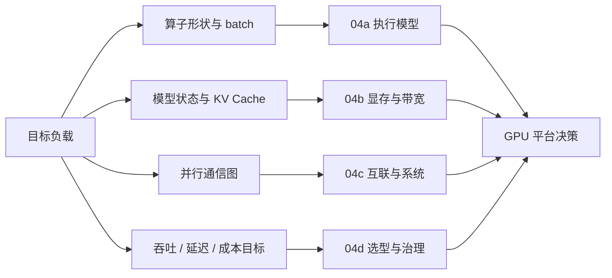

# 第4章：GPU 与加速器导览

> **本章已拆分为独立子章**：原来的 GPU 与加速器内容过于集中，容易把执行模型、显存带宽、互联系统、选型治理混在一起。现在第 4 章保留为导览章，详细内容拆到 04a-04d。读完导览后，按你的目标负载进入对应子章。

## 1. 为什么要拆分第 4 章

GPU 不是一个单一知识点。平台工程师说“GPU 不够快”时，可能指的是完全不同的问题：

- kernel 没有把 SM 和 Tensor Core 喂满；
- 模型权重、激活、优化器状态或 KV Cache 放不下；
- HBM 带宽、PCIe、NVLink、网络或存储搬运成为瓶颈；
- 多卡拓扑和并行策略不匹配；
- 采购时混用了 dense / sparse、单卡 / 系统级、FP16 / FP8 / FP4 等 datasheet 口径；
- 调度器无法表达 MIG、异构 GPU、非 NVIDIA 加速器和不同故障域。

这些问题共享“GPU”这个名字，但排查工具、系统边界和工程决策都不同。把它们塞在同一章里，会导致内容看起来像参数百科，而不是可操作的判断路径。

## 2. 拆分后的阅读路径

| 子章 | 主题 | 你应该在什么时候读 |
|------|------|--------------------|
| [04a GPU 执行模型与 Tensor Core](./04a-gpu-execution-model-and-tensor-cores.md) | SM、SIMT、warp、occupancy、Tensor Core、低精度算力口径 | 你想理解为什么同样 TFLOPS 实测差很多，或为什么 kernel 没吃满 GPU |
| [04b HBM、显存预算与 Roofline](./04b-hbm-memory-and-roofline.md) | HBM、显存容量、训练/推理状态预算、KV Cache、arithmetic intensity、machine balance | 你要判断模型能不能放下、decode 为什么慢、换 H200/B200 是否有收益 |
| [04c GPU 互联与系统形态](./04c-gpu-interconnect-and-systems.md) | PCIe、NVLink、NVSwitch、HGX、GB200 NVL72、scale-up/scale-out、拓扑调度 | 你要做多卡训练、张量并行、MoE、集群调度或大节点采购 |
| [04d GPU 选型、虚拟化与异构加速器](./04d-gpu-selection-virtualization-and-heterogeneous-accelerators.md) | 选型框架、训练 vs 推理、datasheet 阅读、MIG/MPS、异构池、非 NVIDIA 生态成本 | 你要做采购、资源池规划、多租户切分或评估 AMD/TPU/Gaudi/昇腾 |

## 3. 四个总问题仍然不变

拆分以后，第 4 章仍然围绕同一个判断框架：

1. **算得动吗？**  
   算子形状是否能把 SM、Tensor Core 和低精度路径用起来。

2. **放得下吗？**  
   权重、激活、梯度、优化器状态、KV Cache 和运行时 buffer 是否能装进显存。

3. **喂得满吗？**  
   HBM、PCIe、NVLink、NIC、CPU 数据预处理和存储是否能持续供给 GPU。

4. **连得快吗？**  
   多 GPU / 多节点互联是否匹配数据并行、张量并行、流水并行和专家并行的通信图。

## 4. 和后续章节的关系

- 第 5 章会继续展开内存、互联与 IO，把 HBM、DRAM、PCIe、NVMe、对象存储和 RDMA 放到完整数据搬运链路里。
- 第 6 章会进入 CUDA runtime、stream、kernel launch、profiling 和算子执行效率。
- 第 8-10 章会把多 GPU 硬件约束带入数据并行、模型并行、checkpoint 和恢复。
- 第 15-17 章会把显存、KV Cache、推理引擎、批处理和多租户成本连起来。

因此，第 4 章拆分后的目标不是讲完所有 GPU 细节，而是建立硬件判断的骨架：**看到一个训练或推理负载，能先判断瓶颈属于执行、容量、带宽、互联还是治理，再进入对应章节深入。**

## 5. 快速自测

1. 一个 H100 服务 7B 模型 decode 阶段 SM 利用率只有 5%，这一定是 GPU 没调好吗？你会先读 04a 还是 04b？
2. 70B 模型推理权重能放下，但长上下文并发一上来就 OOM，问题属于算力、显存、带宽还是互联？
3. 8 卡 H100 节点内 TP 很快，跨两个节点 TP 延迟暴涨，为什么不能只看单卡 TFLOPS？
4. 采购页写 “FP8 72 PFLOPS”，你需要问它是单卡、8 卡系统还是 rack-level 口径？
5. 把一张 H100 切成 MIG 后，为什么它适合多个小服务，而不适合让一个大服务更快？
