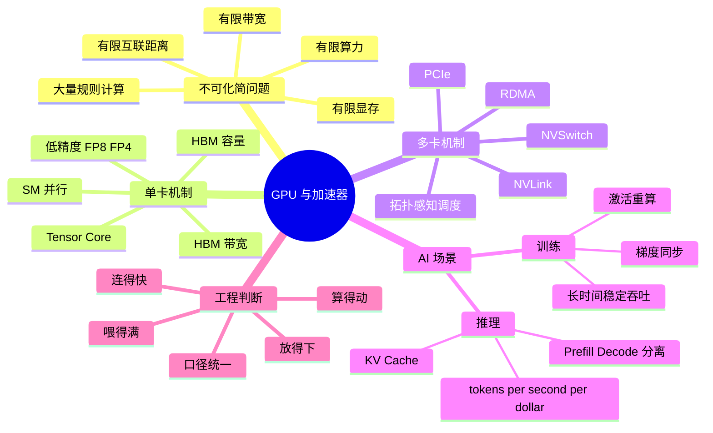
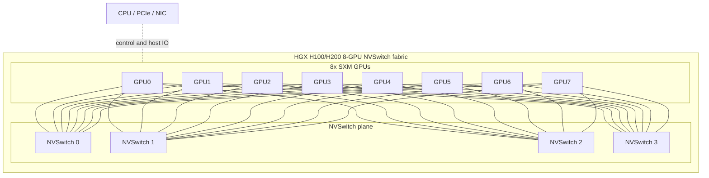

# 第4章：GPU 与加速器

> **关联章节**：本章内容与 [第5章](./05-memory-interconnect-io.md) 的带宽 / 互联链路，以及 [第6章](./06-cuda-runtime-and-kernels.md) 的 kernel 执行效率密切相关。硬件参数只有落到实际搬运和执行路径里，才有工程意义。再往后，[第8章](../part3-training-infra/08-data-parallel.md) 的扩展效率和 [第15章](../part4-inference-infra/15-batching-scheduling-and-kv-cache.md) 的 KV Cache 预算都会回过头来用本章的四个维度（算力/显存/带宽/互联）。

## 1. 第一性原理拆解 + 学习大纲

### 拆 — 不可化简的问题

理解 GPU 的最好方式，不是死记硬件参数，而是先回答：为什么这类设备特别适合 AI 工作负载，它又在哪些条件下会"不像你想得那么快"。把所有品牌名、SKU、Tensor Core、NVLink、HBM 这些术语先拿掉，GPU 章真正面对的不可化简问题只有一个：**一个模型步骤需要在很短时间内对大量规则数据做同构运算，但每个物理器件的计算单元、存储容量、读写带宽和互联距离都是有限的，平台工程师必须判断这些限制哪一个先成为瓶颈**。

这句话比"GPU 比 CPU 快"更接近本章核心。CPU 的强项是少量线程、复杂控制流、低延迟响应和操作系统控制面；GPU 的强项是把同一类指令摊给海量线程，以吞吐换延迟。Transformer 里的 GEMM、attention、归约和逐元素运算之所以适合 GPU，不是因为它们叫 AI 算子，而是因为它们有大量相似的数据元素和稳定的张量形状。反过来，小 batch、动态 shape、强分支、频繁 host-device 往返、碎 tensor、跨卡通信密集的任务，即使放在昂贵 GPU 上，也可能只能吃到峰值算力的很小一部分。

第一次做 AI 基础设施选型的团队，最常踩的坑是把"选 GPU"当成"挑显卡"：看 MLPerf 榜单，比 TFLOPS，挑吞吐最高的那张。这个思路在消费显卡时代还凑合，但对数据中心 AI 负载会有几个严重漏洞：峰值算力和可达吞吐常差 3-10 倍；显存和 HBM 带宽往往比算力更先顶爆；互联决定 8 卡节点到底是 8 卡同时干活，还是 8 卡互相等待；同一代产品又有 PCIe、SXM、不同显存容量、不同功耗墙和不同 datasheet 口径。平台工程师需要拆出的不是"哪张卡最快"，而是四个更硬的问题：算得动吗，放得下吗，喂得满吗，连得快吗。

### 推 — 从这个问题如何推导出每个机制

从这个不可化简问题往下推，GPU 的每个机制都不是孤立名词。首先，单个通用核心无法在可接受时间内完成数万亿次矩阵乘法，所以硬件必须堆出大量并行执行单元；因为深度学习核心计算大多是矩阵和张量运算，所以又出现专门服务低精度矩阵乘法的 Tensor Core，并逐步支持 TF32、BF16、FP8、FP4 等口径。接着，算力只有在数据持续供应时才有意义，显存容量决定权重、激活、梯度、优化器状态和 KV Cache 能不能放下，HBM 带宽决定这些数据能不能按 kernel 消费速度被读写。于是同样 70B 模型，训练时要看 6-16x 参数量的状态预算，推理时要看权重加 KV Cache；prefill 更像 compute-bound，decode 更像 memory-bound。

再往下推，单卡不够时必须切到多卡：数据并行要同步梯度，张量并行要交换 activation，流水并行要传递 microbatch，专家并行要做 token dispatch。跨 GPU 的距离立刻变成系统问题。PCIe 能连，但带宽和延迟不适合高频模型切分；NVLink 把 GPU-GPU 路径做成高带宽链路；NVSwitch 把多条 NVLink 组成交换网络，让 8 卡 HGX 节点里任意 GPU 都能以近似一致的路径通信；GB200/NVL72 进一步把这个边界从主板扩到整机柜，让 72 块 Blackwell GPU 位于一个 rack-scale NVLink domain 内。到了这里，GPU 不再是一张卡，而是计算、HBM、NVLink、NVSwitch、CPU、NIC、供电和液冷共同组成的 scale-up 系统。

最后，所有机制都要回到工程边界。算力指标必须统一 dense/sparse、per-GPU/system-level、FP16/BF16/FP8/FP4 口径；显存预算必须给运行时 buffer 和碎片留余量；带宽判断必须区分 HBM、PCIe、NVLink、InfiniBand/RoCE；互联拓扑必须和并行策略、作业调度、故障域绑定。读完本章，你应该能把硬件参数翻译成平台决策：哪些任务放 H200 更值，哪些任务用 L40S 更划算，什么时候该买 8 卡 SXM 节点，什么时候该等待 NVL72 这类 rack-scale 系统，什么时候非 NVIDIA 方案的省钱会被软件适配成本吃掉。

### 绘 — 因果链路



### 导 — 读完本章你应该能回答

1. 为什么 GPU 适合稠密张量计算，但不保证任何 AI 任务都会接近峰值吞吐？
2. 面对一个模型和 SLO，如何用"算得动、放得下、喂得满、连得快"拆出最可能的硬件瓶颈？
3. 为什么 LLM prefill 和 decode 对 GPU 的偏好不同，decode 为什么经常受 HBM 带宽而不是 TFLOPS 限制？
4. 读 NVIDIA datasheet 时，如何区分 dense / sparse、per-GPU / system-level、FP16 / BF16 / FP8 / FP4 等口径？
5. NVLink、NVSwitch、PCIe、RDMA 分别解决哪一段数据路径问题，为什么它们不能互相简单替代？
6. HGX H100/H200、GB200/NVL72 这类系统形态对平台调度、故障域、并行策略和供电散热有什么工程边界？
7. 什么时候应该接受异构 GPU 池或非 NVIDIA 加速器，什么时候软件生态成本会压过硬件采购折扣？

## 正文内容

### 4.1 为什么 AI 工作负载天然偏爱 GPU

深度学习中的核心计算大多可以归结为：

- 矩阵乘法
- 张量变换
- 归约
- 逐元素运算

这类计算有一个共同点：**可并行度高，且数据形状较规则**。GPU 恰好擅长这种高吞吐、规律性强的数值计算。

而 CPU 更擅长：

- 控制流复杂的任务
- 小规模低延迟逻辑
- 操作系统和服务控制面

所以在 AI 系统里常见分工是：

- CPU：数据预处理、调度、服务控制逻辑
- GPU：模型主计算路径

#### 4.1.1 一个量化感受：GPU 比 CPU 快多少

拿一次 bf16 矩阵乘法为例（典型的 transformer MLP 层）：

| 设备 | 峰值 bf16 吞吐 | 一次 GEMM 的相对速度 |
|------|----------------|----------------------|
| Intel Xeon Platinum 8480+（AMX）| ~30 TFLOPS（BF16 / AMX） | 1x（基线） |
| NVIDIA A100 80GB SXM | ~312 TFLOPS | ~10x |
| NVIDIA H100 SXM | ~989 TFLOPS | ~33x |
| NVIDIA B200 | ~2250 TFLOPS（dense） | ~75x |

但这个差距只有当负载形状匹配时才能兑现。小 batch、动态 shape、强分支控制的负载，GPU 优势会迅速缩水到 2-5x。所以"AI 一定要 GPU"更精确的说法是：**稠密、可批处理、形状稳定的张量计算一定要 GPU**。

### 4.2 看 GPU 先看四件事

#### 4.2.1 算力

决定理论上的计算上限，但它只在计算真正成为瓶颈时才最重要。

一个容易被忽略的事实：**同一张卡的算力有很多"口径"**，读 datasheet 时要看清楚：

| 口径 | 含义 | 常见用途 |
|------|------|----------|
| FP32（CUDA cores） | 通用 32-bit 浮点 | 科学计算、少数老模型 |
| TF32（Tensor Core） | NVIDIA 自定义 19-bit 浮点 | 传统训练加速 |
| FP16 / BF16 Tensor Core dense | 真实可达吞吐的基准 | 现代训练主力 |
| FP16 / BF16 Tensor Core sparse | 启用 2:4 稀疏后的峰值 | 宣传材料常用，实际不一定能用上 |
| FP8 / FP6 / FP4 | 新一代精度，需硬件原生支持 | Hopper 后推理和 LLM 训练 |

NVIDIA 官方页面常**默认展示 sparse 峰值**或混合多种口径。做跨代对比时，必须统一到同一口径（一般用 dense BF16 或 dense FP8）。不然会出现"标称数字差 5x、实际差 2x"的尴尬。

#### 4.2.2 显存

决定：

- 模型能不能放下
- batch 能不能做大
- KV Cache 能不能撑住并发

一个粗略的显存预算估算（参考 [第15章](../part4-inference-infra/15-batching-scheduling-and-kv-cache.md) §15.3）：

```text
训练显存 ≈ 权重 + 梯度 + 优化器状态 + 激活 + 框架碎片
          ≈ 16x 参数量（bf16 + Adam）+ 激活

推理显存 ≈ 权重 + KV Cache × 并发 + 运行时 buffer
          ≈ 2x 参数量（bf16）+ 长上下文 × 并发
```

以 Llama 3 70B 为例：训练时仅 state 就要 ~560 GB（见第8章 §8.9），推理时权重 140 GB + KV Cache（128K 上下文 ≈ 40 GB/请求）。**不看清这个预算就采购，很容易买到"装不下目标模型"的卡**。

#### 4.2.3 带宽

决定数据在设备内流动的速度。很多模型不是"算不动"，而是"数据搬不快"。

LLM decode 阶段（见 [第15章](../part4-inference-infra/15-batching-scheduling-and-kv-cache.md) §15.2）是典型 memory-bound：每生成一个 token 都要把整个权重读一遍。7B 模型 bf16 大小 ~14 GB，在 3.35 TB/s 带宽（H100）上理论下限 = 14 / 3350 ≈ 4 ms/token；换到 8 TB/s（B200），可以降到 ~2 ms/token。**这个差距和算力没关系，纯带宽决定**。

#### 4.2.4 互联

决定多 GPU 之间是否适合：

- 梯度同步
- 模型切分
- 高速 KV / activation 交换

所以同样是 8 卡节点，拓扑不同，训练体验可能差很多。

#### 4.2.4.1 NVSwitch：把"多条直连线"变成"节点内交换网络"

NVLink 解决的是 GPU-GPU 之间的高速链路问题，但只靠点到点直连会遇到一个组合爆炸：8 张 GPU 如果要任意两两全带宽互通，需要大量链路和复杂布线；如果只做 ring 或 mesh，某些 GPU 对之间要经过多跳，中间 GPU 还会承担转发压力。NVSwitch 的第一性原理很简单：**把 GPU 之间的通信从"谁和谁直接连"改成"每张 GPU 接入交换平面，由交换芯片完成转发"**。

在 HGX H100 8-GPU 这类节点里，每张 H100 SXM 通过多条 NVLink 接到 4 颗 NVSwitch；每颗 NVSwitch 同时连接全部 8 张 GPU 的一部分链路。逻辑上看，任意 GPU 到任意 GPU 都能走 NVSwitch fabric，而不是先经过 CPU、PCIe root complex 或其他 GPU。NVIDIA 对 HGX H100 8-GPU 的公开口径是每 GPU 最高约 900 GB/s 双向 NVLink 带宽；这个数字是 per-GPU 聚合口径，不是某两张 GPU 之间单向 900 GB/s。H200 SXM 继承 Hopper 平台形态，核心差异更多在 HBM3e 容量和带宽，节点内 NVLink/NVSwitch 的平台判断方式基本相同。



平台工程师看 NVSwitch，重点不是背交换芯片代号，而是判断通信模式是否能吃到这个 fabric。典型收益来自节点内 tensor parallel、activation 交换、FSDP/ZeRO 局部 reduce-scatter、MoE expert dispatch，以及多 GPU 推理里的 hidden state 同步。典型吃不到收益的情况也很明确：数据预处理卡在 CPU；模型跨节点做 TP，瓶颈落到 InfiniBand/RoCE；或者作业落到 PCIe-only、双 GPU 桥接、不同 NUMA 域的混合拓扑。工程边界是：**NVSwitch 只解决节点内 GPU fabric，不解决跨节点网络、CPU 内存带宽、存储读取、kernel 低效和并行策略错误**。

#### 4.2.4.2 HGX H100/H200 baseboard：物理布局如何影响调度直觉

HGX 不是"8 张显卡插在主板上"，而是一块面向 OEM 服务器集成的 GPU baseboard。H100/H200 8-GPU SXM baseboard 的直觉可以这样记：8 个 SXM GPU 模块围绕中间的 NVSwitch 平面布置，底板负责提供高密度 NVLink 走线、供电、管理信号和到服务器 CPU/PCIe/NIC 的连接路径；CPU、内存、NIC、NVMe、风冷/液冷部件通常由整机厂在外层系统里完成。也就是说，HGX baseboard 给你的是一个强 scale-up GPU 岛，服务器整机再把这个岛接到 host 和 scale-out 网络。

从平台视角，HGX 的物理布局会转化为 4 类工程约束。第一是故障域：8 张 GPU、NVSwitch、供电和散热耦合很强，GPU Xid 错误、NVLink lane 降级或 switch 异常可能影响整个 8 卡作业；调度系统需要能 drain 节点。第二是作业粒度：8 卡 HGX 适合 1/2/4/8 卡节点内切分，但多个小作业混布会争抢 HBM 带宽、PCIe host path、CPU cores 和 NIC；MIG 能隔离小推理任务，但不能把 NVSwitch fabric 变成无限资源。第三是拓扑可见性：`nvidia-smi topo -m`、NCCL topology dump、DCGM field、Kubernetes device plugin 标签，都应纳入 pre-flight validation。第四是设施边界：H100/H200 SXM 的 700W 级 TDP、8 卡节点的数 kW 功耗、风道/液冷和机柜供电，会限制机房可部署密度。

| 形态 | 逻辑规模 | 典型互联 | 平台适配重点 | 工程边界 |
|------|----------|----------|--------------|----------|
| 8x PCIe GPU 服务器 | 8 GPU，但常依赖 PCIe switch / root complex | PCIe 为主，少量 NVLink bridge 取决于卡型 | 成本、通用性、推理副本密度 | 不适合高频 TP；GPU 对之间带宽不均匀 |
| HGX H100 8-GPU | 单节点 8 GPU scale-up island | 4x NVSwitch + 每 GPU 约 900 GB/s 双向 NVLink 聚合 | 大模型训练、节点内 TP/PP、NCCL collectives | 仍需 IB/RoCE 做跨节点；故障常以整节点处理 |
| HGX H200 8-GPU | 单节点 8 GPU，显存更大 | 与 Hopper HGX 平台判断类似 | 长上下文、显存敏感训练/推理 | 算力不比 H100 翻倍，收益主要来自 HBM 容量/带宽 |
| GB200 NVL72 | 单机柜 72 GPU NVLink domain | NVLink Switch System，rack-scale fabric | 万亿参数推理、MoE、rack 内大 TP/EP | 供电液冷、分区、运维和采购门槛显著提高 |

这张表的关键不是说某个形态绝对更好，而是提醒平台工程师把"节点"定义清楚。对 A100/H100 时代，很多系统默认一个 8 卡服务器是基本调度单元；到 GB200/NVL72 时代，一个机柜内部的 72 张 GPU 可能才是一个高带宽 scale-up 域。调度器、队列、配额和作业模板如果还只理解单机 8 卡，会让用户在并行策略上做错假设。

#### 4.2.4.3 GB200/NVL72：把 scale-up 边界从主板推到机柜

GB200 NVL72 是 Blackwell 代更激进的系统形态：一个液冷机柜里包含 36 个 Grace CPU 和 72 个 Blackwell GPU，核心构件是 GB200 Grace Blackwell Superchip，即 1 个 Grace CPU 通过 NVLink-C2C 连接 2 个 Blackwell GPU。多个 compute tray 通过 NVLink Switch System 连接，形成 72-GPU NVLink domain；NVIDIA 公开规格给出的 rack-level NVLink 带宽约 130 TB/s，HBM 总容量约 13.4 TB，HBM 总带宽约 576 TB/s。这里的关键词是 rack-level：它不是把 9 台 8 卡服务器用 InfiniBand 接起来，而是把机柜内部做成一个更大的低延迟 GPU fabric。

这种架构对应的 workload 很明确。第一类是万亿参数级别推理，长上下文和高并发下，单个请求或一组请求需要跨很多 GPU 切分权重和 KV Cache；rack 内 NVLink domain 可以减少跨 IB 的 TP 通信。第二类是 MoE，token dispatch 和 expert combine 对 GPU-GPU 带宽更敏感，rack 内大域能让 expert placement 更灵活。第三类是大规模训练的局部通信，把高频张量并行、专家并行放在 rack 内，把较低频的数据并行同步交给跨 rack IB/RoCE。

但 NVL72 不是"把任何程序自动加速 30 倍"。工程边界至少有 6 条。第一，软件必须理解 NVLink multi-node domain，包括 NCCL、CUDA、驱动、fabric manager、分区管理和作业编排；旧的单机拓扑假设会失效。第二，调度单位更贵，错误 placement 的机会成本更高，平台需要按 NVLink domain、partition、compute tray、故障状态表达资源。第三，rack-scale 液冷、供电、维护窗口和备件策略进入平台工程范围。第四，跨 rack 仍需要 InfiniBand 或 Spectrum-X 这类 scale-out 网络，NVL72 只把最热通信留在 rack 内。第五，推理收益依赖请求形状和并行方式；如果瓶颈是 tokenizer、HTTP batching、KV eviction 或存储加载，NVL72 的 fabric 不会救你。第六，一个 rack 是巨大的故障域和资本开销单元，适合有稳定大模型负载的平台，不适合需求还在探索期的小团队。

因此，HGX H100/H200 和 GB200/NVL72 的本质差异不是"Hopper vs Blackwell"这么简单，而是 scale-up 边界不同：HGX 把 8 张 GPU 组成节点内岛；NVL72 把 72 张 GPU 组成机柜内域。平台工程师要把模型并行策略、通信热路径、调度单元、设施能力和预算周期对齐。

#### 4.2a 主流 GPU 横向对比

下表统一采用不含 sparsity 的 dense FP16 / BF16 Tensor Core 口径，目的是建立平台选型直觉，而不是做采购承诺。NVIDIA 官方页面常同时展示 dense / sparse 或不同产品形态口径，读表时不要把它们混成一个数。

| 设备 | FP16 / BF16 理论算力 | HBM 容量 | HBM 带宽 | NVLink 带宽 | 典型功耗 | 更常见定位 |
|------|----------------------|----------|----------|-------------|----------|------------|
| A100 40GB PCIe | 约 312 TFLOPS | 40 GB | 约 1.6 TB/s | 通常依赖 PCIe；部分双卡桥接场景可到约 600 GB/s | 250-300 W | 成熟推理、成本敏感训练原型 |
| A100 80GB SXM | 约 312 TFLOPS | 80 GB | 约 2.0 TB/s | 最高约 600 GB/s | 400 W | 显存更敏感的训练 |
| H100 SXM | 约 989 TFLOPS | 80 GB | 约 3.35 TB/s | 最高约 900 GB/s | 700 W | 主流大模型训练 |
| H200 SXM | 约 989 TFLOPS | 141 GB | 约 4.8 TB/s | 最高约 900 GB/s | 700 W | 长上下文、显存敏感训练 |
| B200 SXM | 约 2250 TFLOPS（dense） | 180-192 GB | 约 7.7-8 TB/s | 约 1.8 TB/s | 1000 W | 新一代训练、大模型推理 |

> **参考数量级（仅供建立直觉，实际值因硬件和配置差异较大）**
>
> | 场景 | 典型值 | 说明 |
> |------|--------|------|
> | 单卡 HBM 容量 | 40-192 GB | 决定单卡可承载的模型、激活和 KV Cache 上限 |
> | 单卡 HBM 带宽 | 1.6-8.0 TB/s | 很多 attention / gather 场景首先受这里限制 |
> | 8 卡节点总显存 | 320 GB-1.5 TB | 是训练并行规划的第一道约束 |
> | GPU-GPU 高速互联 | 600-1800 GB/s | 对张量并行、流水并行和高效 AllReduce 很关键 |

> 补充说明：Blackwell / B200 级产品的公开资料已明确 180-192 GB HBM3e 和更高带宽，但官方公开页更常强调 FP4 / FP8 或系统级口径（比如 DGX B200 总 FP8 达 72 PFLOPS = 8 卡 × 9 PFLOPS）。若要做采购或代际精确比较，建议回到具体产品 datasheet，而不要把不同页面里的 dense / sparse / system-level 指标混读。

#### 4.2a.1 怎么不被 datasheet 误导

读 GPU 参数表时，几个最容易出错的点：

| 陷阱 | 典型表述 | 该怎么读 |
|------|----------|----------|
| Sparse 峰值 | "FP16 Tensor Core: 1978 TFLOPS" | 实际是 2:4 sparse 的峰值，dense 只有一半 |
| 系统级 vs 单卡 | "72 PFLOPS FP8 compute" | 可能是 8 卡 DGX 加起来的，单卡只有 1/8 |
| FP4 "revolutionary" | "40 PFLOPS FP4" | 是否真能用上取决于模型、量化方法和软件栈成熟度 |
| NVLink 带宽口径 | "900 GB/s" | 通常是 per-GPU 双向聚合，不是两张卡之间的单向 |
| 功耗 vs TDP | "700W" | TDP 是可配置上限，实际长期运行功耗常是 80-90% TDP |

**一个实战心法**：同时查三处 —— 官方 datasheet、第三方 benchmark（MLPerf / Artificial Analysis / GenAI-Perf）、开源生态的实测（vLLM 仓库、Dao-AILab）。三者交叉印证，才不容易被单一数字误导。

### 4.3 一个简单但实用的判断框架

可以把 GPU 选型简化成四个问题：

1. **算得动吗？**  
   算力是否足够支撑目标吞吐

2. **放得下吗？**  
   显存是否足以容纳模型、激活、优化器状态或 KV Cache

3. **喂得满吗？**  
   数据与内存带宽是否支持持续高效执行

4. **连得快吗？**  
   多卡 / 多机之间互联是否支撑目标并行策略

这个框架比单纯看"单卡峰值算力"更接近真实工程。

#### 4.3.1 一个具体例子：Llama 3 70B 该选什么卡

假设你要部署 Llama 3 70B 做在线推理，走这四个问题：

**算得动吗？**
- 70B × bf16 ≈ 140 GB 权重，decode memory-bound
- 目标 TPOT < 50 ms，每 token 需要把权重读一遍
- H100 3.35 TB/s 带宽下理论下限 ~42 ms/token（单卡装不下，需要 TP=2）
- 答案：算力不是瓶颈，带宽和显存是

**放得下吗？**
- 权重 140 GB，KV Cache 32K 上下文 × 并发 32 ≈ ~40 GB
- 至少需要 ~200 GB 显存预算
- 2×H100 80GB（160 GB）紧张；2×H200（282 GB）或 1×B200（192 GB）更合适

**喂得满吗？**
- Decode 完全是 HBM 带宽限制
- H100：3.35 TB/s，H200：4.8 TB/s（+43%），B200：8 TB/s（+139%）
- 带宽越高，TPOT 越低

**连得快吗？**
- TP=2 下每 token 要做 all-reduce
- H100/H200：900 GB/s NVLink，B200：1.8 TB/s
- 节点内 NVLink 都够用，跨节点 IB 才是问题

**结论**：2×H200 SXM 或 1×B200 都合适；2×H100 80GB 会受限于显存；跨节点 TP 不推荐。

这个思路比"H200 比 H100 更快"笼统结论具体得多，也更能指导采购。

### 4.4 训练和推理需要的硬件并不相同

### 训练更关注

- 大显存
- 高速互联
- 长时间稳定吞吐
- 支持分布式训练的网络能力

### 推理更关注

- 单位成本吞吐
- 显存 / cache 组织
- 冷启动速度
- 并发下的稳定尾延迟

这意味着：

- 训练最优卡，不一定是推理最优卡
- 推理平台也未必需要和训练集群完全同构

#### 4.4.1 一个对比表

| 维度 | 训练优先 | 推理优先 |
|------|----------|----------|
| 核心指标 | TFLOPS × 利用率 | tokens/sec/$ |
| 显存 | 权重 + 梯度 + 优化器 + 激活，通常 6-16x 参数量 | 权重 + KV Cache，通常 2-4x 参数量 |
| 精度 | BF16 为主，FP8 开始普及 | 越来越低，INT8/FP8/INT4 常见 |
| 互联 | 关键：all-reduce 频繁 | 次要：少量 TP，跨副本无需 |
| 稳定性 | 数周连续运行，硬件故障率敏感 | 分钟级滚动，冷启动更关键 |
| 典型卡 | H100/H200 SXM、B200 | L40S、A100、H100、部分用 B200 做大模型 |
| 节点形态 | 8卡 SXM，高速互联 | 单卡或 2/4 卡 PCIe 更经济 |

**一个行业趋势**：Blackwell 代开始模糊训推边界 —— B200 的 FP4 推理吞吐太夸张，很多公司开始用同一种卡做训练和推理。但这不代表这两类工作负载的硬件偏好消失了，而是"市场上最前沿的卡同时满足两边"。

#### 4.4.2 采购策略：混部 vs 分池

实践中有两种常见路线：

**同构路线**：训练和推理用同一种卡（比如都是 H100 SXM）

- 优点：采购简单、调度灵活、空闲时段可以互借
- 缺点：推理端付了训练端的"溢价"，单位成本高

**异构路线**：训练用 H100/H200/B200，推理用 L40S / A10 / 量化后的老卡

- 优点：推理成本可以压到 1/2 - 1/3
- 缺点：运维两套镜像、调度要打标签（见 §4.6）、跨池调配复杂

**判断**：

- 规模小（< 50 卡）：同构
- 规模中（50-500 卡）：同构 + 少量推理专用
- 规模大（500+ 卡）：强制异构，否则单位成本吃不消

### 4.5 算力不是唯一瓶颈：Arithmetic Intensity 直觉

一个常见近似判断是：如果一个工作负载每搬运 1 字节数据能做很多次计算，那么它更可能受计算限制；反之更可能受带宽限制。

常写成：

$$
AI = \frac{\text{Ops}}{\text{Bytes moved}}
$$

其中 $AI$ 是 arithmetic intensity。

虽然平台工程师不一定天天手算这个值，但它能帮助你建立直觉：

- 大矩阵乘法通常更接近算力瓶颈
- 小 batch、碎 tensor、频繁 gather/scatter 更容易受带宽限制

把这个直觉放到 roofline 模型里，可以这样理解：

```text
性能 ^
     |                         _________  compute roof
     |                        /
     |                       /
     |                      /
     |                     /
     |____________________/__________________> Arithmetic Intensity
                         ^
                         |
                      machine balance
```

- 拐点左侧：更像 **memory-bound**，提高 HBM / 访存效率更有效
- 拐点右侧：更像 **compute-bound**，提高 Tensor Core 利用率更重要

平台视角里，这个图的价值不是做学术分析，而是帮助判断：当前瓶颈更该找 [第5章](./05-memory-interconnect-io.md) 的搬运链路，还是 [第6章](./06-cuda-runtime-and-kernels.md) 的 kernel 执行路径。

#### 4.5.1 典型 AI 算子的 arithmetic intensity

| 算子 / 场景 | AI 大致量级（ops/byte） | 更接近 |
|-------------|-------------------------|--------|
| Large GEMM（大 batch、大隐层） | 100-500 | Compute-bound |
| Attention prefill（长序列） | 30-100 | 混合，看序列长度 |
| Attention decode（1 个 token） | < 10 | Memory-bound |
| LayerNorm / RMSNorm | ~2 | Memory-bound |
| Element-wise（GELU / add） | 1-2 | Memory-bound |
| Embedding lookup | < 1 | Memory-bound |
| All-reduce（DDP 梯度） | N/A（纯通信） | Network-bound |

**一个关键观察**：transformer 的瓶颈会随 batch 和序列长度变化。Prefill 时是 compute-bound（H100 能跑到 70%+ 利用率），decode 时是 memory-bound（batch=1 时只有 1-3% 算力利用率）。所以"一个模型在这张卡上跑多快"这个问题，**没有单一答案**，必须按阶段分开看。

这也解释了为什么 LLM serving 要区分 prefill 和 decode（见 [第15章](../part4-inference-infra/15-batching-scheduling-and-kv-cache.md) §15.2）—— 两个阶段的硬件偏好完全不同。

#### 4.5.2 Machine Balance：不同卡的"拐点"在哪

一个硬件的 machine balance = 峰值算力 / 带宽（单位 ops/byte），表示该 GPU 从 memory-bound 转向 compute-bound 的拐点：

| 设备 | 峰值 BF16 | HBM 带宽 | Machine balance |
|------|-----------|----------|-----------------|
| A100 80GB | 312 TF | 2.0 TB/s | ~156 ops/byte |
| H100 SXM | 989 TF | 3.35 TB/s | ~295 ops/byte |
| H200 SXM | 989 TF | 4.8 TB/s | ~206 ops/byte |
| B200 SXM | 2250 TF（dense） | 8.0 TB/s | ~280 ops/byte |

H100 的 machine balance 特别高，意味着**同一个负载从 A100 换到 H100，memory-bound 的情况会变多**（因为带宽没跟上算力的增长）。这就是为什么 H200 和 B200 都在大幅提升 HBM 带宽 —— 不然新 GPU 的算力卖不出去。

对平台选型的启示：**换代升级不一定线性提速**，如果你的负载是 memory-bound（典型 decode），H100 → H200 的收益可能比 A100 → H100 更明显。

### 4.6 设备异构为什么会放大平台复杂度

现实中的平台往往不只有一种卡。常见情况：

- 不同代际卡混跑
- 显存大小不同
- 互联结构不同
- 部分节点有本地 NVMe，部分没有

这会导致：

- 调度要更细粒度打标签
- 镜像和依赖兼容性更难维护
- 用户需要知道哪些队列适合什么任务

因此，硬件异构不仅是资源问题，也是抽象问题。

#### 4.6a 非 NVIDIA 加速器简述

对平台团队来说，非 NVIDIA 方案的关键不只是卡本身，而是编译器、驱动、框架适配和运维成熟度。

| 平台 | 典型定位 | 优势 | 主要生态约束 |
|------|----------|------|--------------|
| AMD MI300X | 大显存训练 / 推理 | 192 GB HBM，适合显存敏感场景 | 依赖 ROCm 生态，部分 CUDA 专属库迁移成本高 |
| AMD MI325X / MI350 | 新一代，对标 B200 | HBM 进一步升到 256-288 GB | 生态追赶中，新硬件支持要踩坑 |
| Google TPU v5 / v6 | Pod 级训练 | XLA 编译和大规模集群整合较成熟 | 主要在 Google Cloud 生态内发挥优势 |
| Intel Gaudi 3 | 成本导向训练 / 推理 | 以太网互联思路明确，适合标准化部署 | 软件栈和社区成熟度仍弱于 CUDA |
| 华为昇腾 910B / 910C | 区域化训练 / 推理平台 | 本土化供应链和政企场景适配较强 | 依赖 CANN / MindSpore / 适配层，跨生态迁移要单独评估 |
| AWS Trainium / Inferentia | AWS 自家芯片 | 在 AWS 内部 TCO 友好 | 绑定 AWS 生态，迁出成本高 |

工程上最现实的判断标准通常是：团队要为移植和运维多付出多少，而不只是标称峰值有多高。

#### 4.6a.1 非 NVIDIA 路径的隐性成本

一个诚实的观察：**非 NVIDIA 加速器的采购价可能便宜 30-50%，但软件移植成本可以轻易抵消**。

典型的"坑"：

- **训练脚本不兼容**：HuggingFace Transformers、PyTorch 原生 API 多数支持，但 DeepSpeed、FSDP、FlashAttention 等高阶组件的适配可能落后半年到一年
- **推理引擎支持度不一**：vLLM 对 AMD / TPU 支持在追赶，TensorRT-LLM 是 NVIDIA 专属
- **kernel 生态差距大**：很多 SOTA kernel（FlashAttention-3 / FlashInfer / Triton community kernels）天然只有 NVIDIA 后端
- **驱动和调度集成**：DCGM、MIG、NVIDIA GPU Operator 是 k8s 调度的事实标准，非 NVIDIA 要另起一套

**什么时候值得选非 NVIDIA**：

- 已经深度绑定 Google / AWS 生态（TPU / Trainium 的 TCO 优势会放大）
- 有明确的供应链或合规约束（昇腾）
- 团队有大量底层优化人力（MI300X 训练 Llama 级模型要调很久）

**什么时候不值得**：

- 规模不到百卡
- 团队主要做上层应用
- 追求最快的模型上线速度

### 4.7 MIG 与 GPU 虚拟化

当一张 GPU 的算力对单个小任务来说太浪费时，可以考虑做切分。NVIDIA 提供几种方案：

| 方式 | 隔离强度 | 性能开销 | 适用场景 |
|------|----------|----------|----------|
| MIG（Multi-Instance GPU） | 硬件级，显存和 SM 都隔离 | ~0% | A100 / H100 / B200 做多租户或小任务并发 |
| MPS（Multi-Process Service） | 软件级，共享 SM | 低 | 同一租户多进程 |
| Time-slicing | 最弱，时间片轮转 | 视切换频率 | 开发环境，非生产 |

MIG 的典型用法：把一张 H100 切成 7 份（每份 ~11.8 GB 显存 + 1/7 SM），给 7 个互相独立的小模型服务。这样可以让 [第17章](../part4-inference-infra/17-multitenancy-and-cost.md) 里讨论的多租户问题在硬件层面就获得更强隔离。

**一个常见误解**：以为 MIG 是"把一张卡当 7 张用，吞吐不变"。实际上切分后每个 slice 的显存带宽也被按比例分配，单个 slice 的吞吐远低于整卡的 1/7（SM 切分更多、带宽接近 1:1）。所以 MIG 适合"很多小任务各自流畅"，不适合"一个任务跑得快"。

### 4.8 工程建议

- 训练集群优先关注互联和显存，再看单卡峰值算力
- 推理集群优先关注单位成本吞吐、显存与冷启动行为
- 读 datasheet 时统一口径（dense / sparse / per-GPU / system-level），不然跨代比较会被误导
- 不要让研究型实验和关键线上服务完全共享同一设备池
- 选型时先写出目标负载形状（seq len、batch、并发、SLO），再看设备参数
- 代际升级（H100 → H200）若你的负载是 memory-bound，收益会比看 TFLOPS 更明显
- 非 NVIDIA 方案算 TCO 要把软件适配人力算进去，而不只是采购价
- 小任务高并发场景，MIG 能比多买几张便宜卡更优

#### 本章涉及的常见工具

| 概念 | 常见工具 / 命令 | 备注 |
|------|-----------------|------|
| 硬件信息 | `nvidia-smi`、`nvidia-smi topo -m`、`rocm-smi` | 看卡型号、拓扑、功耗 |
| 算力与带宽基准 | `nccl-tests`、`stream` benchmark、`gemm_bench` | 验证是否能达到标称值的合理比例 |
| MLPerf / 第三方 benchmark | MLPerf Training / Inference 榜单 | 真实负载下的对比 |
| 显存和带宽分析 | `ncu`（见 [第6章](./06-cuda-runtime-and-kernels.md)） | 看单个 kernel 是 memory-bound 还是 compute-bound |
| MIG 管理 | `nvidia-smi mig`、NVIDIA GPU Operator | 在 k8s 上切分 GPU |

## 本章小结

| 维度 | 关键问题 |
|------|----------|
| 算力 | 算子吞吐是否够高 |
| 显存 | 模型、激活、KV Cache 是否放得下 |
| 带宽 | 数据搬运是否会成为关键瓶颈 |
| 互联 | 多卡 / 多机是否适合目标并行策略 |
| 异构治理 | 混卡场景要靠标签、镜像和调度来隔离复杂度 |
| Datasheet 阅读 | 口径统一（dense/sparse/per-GPU/system），交叉印证 |

---

## 练习题

### 基础题

1. 为什么 GPU 选型不能只看峰值算力？
2. 训练和推理在硬件诉求上最大的差异是什么？
3. 用"算得动、放得下、喂得满、连得快"分析一个你熟悉的模型场景。
4. 如果你的平台同时有 A100 80G 和 H200，哪些任务更适合优先放到 H200？

### 进阶题

5. 某 datasheet 标称"FP16 Tensor Core 1978 TFLOPS"。真实可达吞吐是多少？为什么？
6. 你要在 H100 80GB 上部署 Llama 3 70B 做推理。按 §4.3.1 的四个问题分析：能做吗？如果不能，最少要几张？
7. 为什么同一个模型从 A100 换到 H100，memory-bound 的阶段可能变多？用 §4.5.2 的 machine balance 解释。
8. 某负载在 A100 上 SM 利用率 95%，换到 H100 只有 40%。列出至少 3 种可能的原因。
9. 一张 H100 通过 MIG 切成 7 份，每份服务一个 7B 小模型。相比直接买 7 张 L40S，优劣分别是什么？

### 开放题

10. 你的团队要组建一个 ~200 卡规模的混合训推集群。从本章角度，你会怎么规划卡型组合？需要哪些前期 benchmark？
11. 某供应商说他们的非 NVIDIA 加速器"性价比比 H100 高 50%"。作为平台工程方，你会问哪些问题来判断这个数字的可信度？
12. 如何向财务团队解释"我们需要换 H200，不只是因为新（H100 刚买不久）"？用本章的数据和论据组织一份说服材料大纲。
