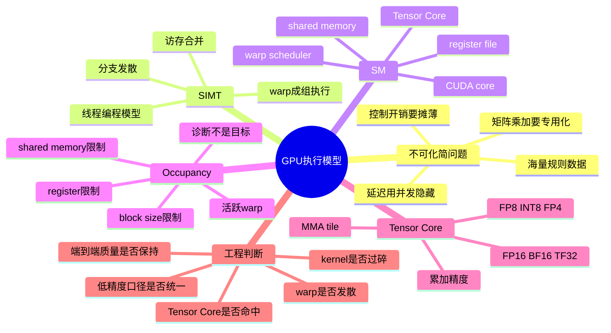
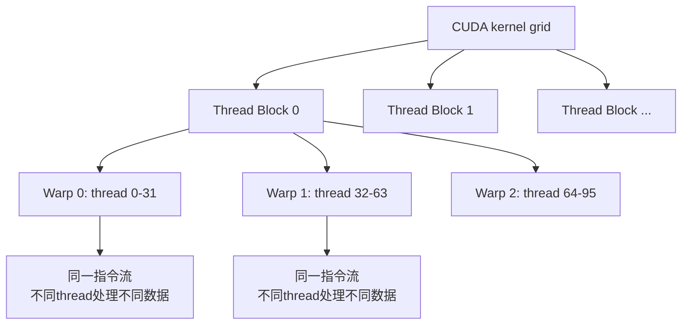
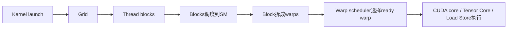
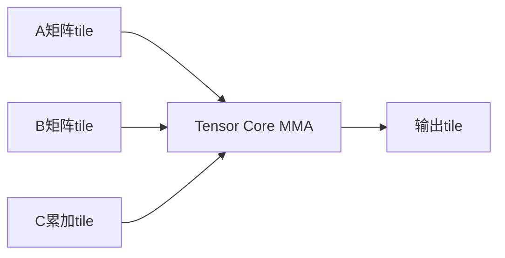

# 第 4a 章：GPU 执行模型与 Tensor Core

> **关联章节**：本章是 [第4章](./04-gpu-and-accelerators.md) 中"算力"部分的下钻，重点回答 GPU 为什么适合 AI，以及峰值算力怎样落到 SM、SIMT、warp、occupancy、Tensor Core 和低精度计算路径上。[第5章](./05-memory-interconnect-io.md) 会继续讨论 HBM、PCIe、NVLink 等数据搬运边界；[第6章](./06-cuda-runtime-and-kernels.md) 会从 runtime、stream、kernel launch 和 profile 工具继续下钻。本章只保留必要的访存背景，不展开 HBM、NVSwitch、MIG。

## 04a.1 第一性原理拆解 + 学习大纲

### 拆 — 不可化简的问题

把 GPU、CUDA、Tensor Core、warp 这些名字先拿掉，AI 算力的不可化简问题是：**模型训练和推理要在极短时间内对大量形状相似的数据做重复数值运算，但单个计算单元的频率、功耗、取指带宽和控制流能力都是有限的。硬件必须用大量简单执行单元共享同一套指令供给，把控制开销摊薄到海量数据上，同时用专用矩阵单元把乘加密度推到通用 ALU 做不到的水平。**

CPU 的设计目标是低延迟、复杂控制流和强单线程能力。一个请求进来，CPU 可以快速处理分支、系统调用、锁、页表、网络协议栈和对象生命周期。GPU 的设计目标相反：接受更高的单任务延迟，换取极高吞吐。Transformer 里的 GEMM、attention、MLP、softmax、layernorm、embedding 后处理，都有大量元素执行相同或近似相同的操作；这就给了 GPU 一个机会：不要为每个元素单独取指、译码和调度，而是让一组线程在同一个控制节奏下推进。

所以 GPU 适合 AI，不是因为它"更高级"，而是因为 AI 主干计算恰好满足三个条件：第一，数据并行度巨大；第二，算子形状相对规则；第三，计算可以被批处理并转成矩阵乘法或向量化张量操作。反过来，GPU 不擅长强分支、小 batch、动态 shape、短 kernel、链式指针访问、频繁 CPU-GPU 同步这些形态。一个平台工程师看到"GPU 利用率低"，不能直接得出"卡不够好"的结论，而要问：SM 上有没有足够 warp 驻留？warp 是否发散？Tensor Core 是否真的被调用？低精度口径是否统一？kernel 是算力瓶颈还是被等待和调度吃掉？

### 推 — 从这个问题如何推导出每个机制

从"大量元素执行同一类操作"推出 SIMT。SIMT（Single Instruction, Multiple Threads）不是 CPU SIMD 的简单放大版：程序员写的是线程，每个线程有自己的寄存器、索引和分支状态；硬件把线程按 warp 分组，在大多数时候让一个 warp 内的线程一起执行同一条指令。这样既保留了线程编程模型，又把取指、译码和调度开销摊薄。

从"warp 需要落到物理执行资源"推出 SM。SM（Streaming Multiprocessor）是 GPU 的基本执行岛，里面有 warp scheduler、寄存器文件、load/store 单元、shared memory、普通 CUDA core 和 Tensor Core。一个 kernel 的 grid 会拆成 block，block 被调度到 SM；block 内线程再按 warp 执行。SM 不是一次只跑一个 warp，而是让多个 warp 同时驻留：某个 warp 等数据或依赖时，scheduler 切到另一个 ready warp。GPU 隐藏延迟靠的不是单线程乱序执行，而是用海量 warp 做硬件级换班。

从"等待不可避免"推出 occupancy。occupancy 描述 SM 上活跃 warp 占理论最大 warp 的比例。它很重要，因为更多活跃 warp 通常更容易隐藏访存和指令依赖延迟；但它不是最终目标。一个 kernel occupancy 很高，可能所有 warp 都在等内存；一个 Tensor Core GEMM occupancy 中等，也可能已经把矩阵单元喂满。occupancy 是诊断资源约束的工具，不是优化 KPI。

从"AI 的主干是矩阵乘加"推出 Tensor Core。通用 CUDA core 可以做标量或向量浮点，但矩阵乘法的结构更固定：小块矩阵反复做 $D = A \times B + C$。Tensor Core 把这种固定形态做成专用硬件路径，一条矩阵乘加指令触发一组 tile 级乘加，吞吐远高于普通 ALU。于是现代训练从 FP32 转向 TF32/BF16/FP16，推理进一步转向 FP8/INT8/INT4/FP4，本质都是为了让单位字节和单位功耗产生更多有效乘加。

最后，从"低精度不是免费午餐"推出口径管理。datasheet 里的 TFLOPS 可能是 FP32 CUDA core、TF32 Tensor Core、BF16 dense、BF16 sparse、FP8、FP4，甚至是单卡或整机系统级数字。训练还要关心累加精度、loss scaling、梯度稳定性；推理还要关心校准、per-channel scale、outlier、精度回退和模型质量。平台工程里，低精度不是一句"开 FP8"就结束，而是硬件支持、kernel 支持、框架图优化、数值验证和业务质量共同组成的路径。

### 绘 — 因果链路



### 导 — 读完本章你应该能回答

1. 为什么 GPU 适合 AI 的核心原因是"控制开销摊薄 + 海量数据并行"，而不只是 TFLOPS 高？
2. SIMT 和 CPU SIMD 有什么相似点和关键差异？为什么 warp divergence 会浪费执行槽？
3. SM 内部有哪些关键资源？block、warp、register、shared memory 如何共同决定一个 kernel 能否高效驻留？
4. occupancy 为什么有用但不能当目标？什么时候低 occupancy 不是问题，什么时候高 occupancy 仍然很慢？
5. Tensor Core 和普通 CUDA core 的职责差异是什么？为什么 GEMM、attention、MLP 会高度依赖 Tensor Core？
6. TF32、FP16、BF16、FP8、INT8、INT4/FP4 各自适合什么阶段？训练和推理的低精度风险有什么不同？
7. 读 GPU 算力指标时，如何统一 dense/sparse、per-GPU/system、输入精度/累加精度这些口径？

## 04a.2 GPU 为什么适合 AI：不是"核心多"，而是控制开销被摊薄

一个标量 CPU 核心执行 1024 个 fp32 乘加，至少要面对 1024 组数据的指令调度、依赖跟踪和执行端口竞争。现代 CPU 可以乱序执行、SIMD 向量化，也能用 AMX 这类矩阵单元加速，但 CPU 仍然要保留大量晶体管服务复杂控制流、缓存一致性、分支预测、中断、系统调用和低延迟响应。

GPU 的取舍更极端：少做复杂控制，多做同构计算。它把大量线程组织成 warp，让同一条指令同时作用到多个线程的不同数据上。只要这些线程执行路径一致，硬件就能用一份控制逻辑驱动多份数据通路。

可以用下面的对比建立直觉：

| 维度 | CPU 优先优化 | GPU 优先优化 | AI 主干更偏哪边 |
|---|---|---|---|
| 单线程延迟 | 很强 | 较弱 | 训练/批量推理通常不敏感 |
| 控制流 | 分支预测、乱序执行、复杂异常处理 | 希望分支规整 | Transformer 主干规整 |
| 并行方式 | 少量强核心 + SIMD/AMX | 大量 SM + warp + Tensor Core | 大矩阵天然适合 |
| 调度单位 | OS thread / core / vector lane | grid / block / warp / thread | tensor op 容易拆分 |
| 延迟隐藏 | cache、OoO、预取 | 多 warp 驻留切换 | 大量独立元素可隐藏等待 |
| 典型弱点 | 峰值吞吐有限 | 小任务和分支浪费严重 | 小 batch decode 会暴露弱点 |

AI 负载里的关键算式通常长这样：

```text
Y = XW + b
Q, K, V = XWq, XWk, XWv
Attention = softmax(QK^T / sqrt(d)) V
MLP = W2 * activation(W1 * X)
```

这些式子大部分可以拆成矩阵乘法、归约和逐元素操作。矩阵乘法尤其适合 GPU，因为每个输出元素都来自一段重复的 dot product，tile 之间可以并行，tile 内可以复用输入数据，Tensor Core 又能把乘加路径专用化。

工程边界也很明确：

| 负载形态 | GPU 表现 | 原因 |
|---|---|---|
| 大 batch GEMM | 很强 | 高 arithmetic intensity，Tensor Core 可持续工作 |
| 长序列 prefill | 通常强 | attention 和 MLP 有大量矩阵计算 |
| batch=1 decode | 可能很低 | 每步计算小，权重读取和 launch 开销更突出 |
| 大量小 tensor elementwise | 常见低效 | kernel 碎、launch 多、中间读写多 |
| 动态 shape + 分支 | 容易低效 | graph capture 和 kernel 选择受限 |
| 指针追逐 / hash table | 不适合 | warp 内地址不规整，访存合并差 |

## 04a.3 SIMT：线程模型下的"同指令多线程"

SIMT 的关键是：程序员写的是标量线程，硬件执行时把线程打包成 warp。NVIDIA GPU 上一个 warp 通常包含 32 个线程。每个线程有自己的 thread id、寄存器和谓词状态，但 warp scheduler 通常以 warp 为单位取指和发射。

一个简化图：



### 04a.3.1 SIMT 和 SIMD 的差异

CPU SIMD 是"一条向量指令处理多个 lane"。程序员或编译器显式使用向量寄存器，例如 AVX 的 ymm/zmm。GPU SIMT 则是"多个线程看起来各自独立，硬件把它们按 warp 锁步推进"。两者都在摊薄控制开销，但编程模型不同。

| 对比项 | CPU SIMD | GPU SIMT |
|---|---|---|
| 程序员视角 | 向量寄存器和 lane | 标量线程 |
| 常见宽度 | 128/256/512-bit | warp 通常 32 线程 |
| 分支处理 | mask / blend / scalar fallback | warp divergence + predicate |
| 适合场景 | CPU 热点循环、字节扫描、小批量向量 | 大规模 tensor 并行 |
| 失败模式 | 编译器不向量化、降频、对齐问题 | 分支发散、访存不合并、占用不足 |

SIMT 的好处是开发者不用显式管理每个 vector lane，坏处是很容易误以为"线程很多就一定快"。如果 warp 内 32 个线程走不同路径，硬件必须分批执行各个路径，未参与当前路径的线程被 mask 掉。有效吞吐会下降。

### 04a.3.2 Warp divergence：同一个 warp 走不同分支

假设一个 warp 里 16 个线程满足 `x > 0`，另外 16 个不满足：

```cuda
if (x[tid] > 0) {
    y[tid] = fast_path(x[tid]);
} else {
    y[tid] = slow_path(x[tid]);
}
```

硬件不能让同一个 warp 同时执行两条不同指令流。它通常会先执行 `fast_path`，mask 掉 else 线程；再执行 `slow_path`，mask 掉 if 线程。结果是两个分支都要跑，平均只有一半 lane 有效。

| 分支形态 | warp 效率 | 工程含义 |
|---|---:|---|
| 所有线程走同一分支 | 高 | 最适合 SIMT |
| warp 内一半一半 | 低 | 两条路径串行执行 |
| 每个线程循环次数不同 | 可能很低 | 长尾线程拖住整个 warp |
| block 间分支不同但 warp 内一致 | 通常可接受 | 分歧发生在更粗粒度 |

LLM 里常见的 divergence 来源包括 variable-length sequence mask、ragged batch、top-k/top-p 采样里的不规则分支、自定义稀疏算子、MoE token dispatch 的条件路径。成熟推理引擎会尽量把不规则性搬到调度层或预处理层，把 GPU kernel 内部做成规整批处理。

### 04a.3.3 访存合并：warp 不只要同分支，还要同方向读写

warp 内线程如果访问连续地址，硬件能把多个线程的 load/store 合并成少量内存事务；如果访问完全散乱的地址，就会产生更多事务，执行单元等数据。

```text
好：thread 0 读 a[0], thread 1 读 a[1], ..., thread 31 读 a[31]
坏：thread 0 读 a[idx0], thread 1 读 a[idx1], idx 完全随机
```

本章不展开 HBM，但要记住一个执行模型事实：**SIMT 希望 warp 内线程同分支、同节奏、同方向访问数据**。GPU 最讨厌的是一组线程看起来很多，实际上每个线程都在不同地方等不同数据。

## 04a.4 SM：GPU 的基本执行岛

SM 可以理解成 GPU 上重复排列的执行岛。不同代际 SM 内部细节不同，但平台工程师先抓住这些资源就够用：

| SM 内资源 | 作用 | 常见瓶颈信号 |
|---|---|---|
| Warp scheduler | 选择 ready warp 发射指令 | eligible warps 少、stall 高 |
| Register file | 保存每个线程的临时变量 | registers per thread 高，occupancy 被压低 |
| CUDA cores | 通用 FP32/INT/部分 FP64 路径 | 非矩阵小算子、地址计算、控制逻辑 |
| Tensor Cores | 矩阵乘加专用路径 | GEMM/attention/MLP 未命中时吞吐大幅下降 |
| Load/store units | 执行内存读写 | load/store stall、访存不合并 |
| Shared memory / L1 | block 内数据复用和近端缓存 | shared memory 用量限制 block 驻留 |
| Special function units | exp、sin、sqrt 等特殊函数 | softmax、activation 中可能出现 |

kernel 执行路径可以简化成：



### 04a.4.1 Block 为什么是调度和资源分配单位

一个 block 会完整驻留在某个 SM 上执行，不能拆到多个 SM。block 内线程可以通过 shared memory 和 barrier 协作。于是 block size、shared memory 用量、register 用量会一起决定每个 SM 能放几个 block。

| 参数 | 过小的问题 | 过大的问题 |
|---|---|---|
| block threads | warp 少，隐藏延迟能力弱 | 单 block 占资源多，驻留 block 少 |
| registers/thread | 临时变量不够，可能重算 | occupancy 降，甚至 spill |
| shared memory/block | 数据复用不足 | 每 SM 可驻留 block 变少 |
| tile size | Tensor Core 喂不满 | register/shared memory 压力上升 |

这就是为什么高性能 kernel 是资源平衡问题。一个 fused kernel 把多个操作合到一起，可能减少 launch 和中间写回，但也可能让每个线程的临时变量变多，导致 register pressure 上升。最终快不快，要看端到端 kernel time 和实际吞吐。

### 04a.4.2 Warp scheduler 如何隐藏延迟

GPU 单个 warp 遇到长延迟操作时，通常不会像 CPU 那样靠复杂乱序逻辑深挖单线程并行，而是切到另一个 ready warp。前提是 SM 上要有足够可运行 warp。

```text
cycle 0: warp A 发出 load，开始等待
cycle 1: scheduler 切到 warp B，执行 MMA
cycle 2: scheduler 切到 warp C，执行 add
cycle 3: warp B 等依赖，切到 warp D
...
若没有其他 ready warp，SM 执行槽空转
```

所以 occupancy 太低可能会让延迟暴露出来。但如果 kernel 是 Tensor Core 密集型，少量 warp 就能持续发出 MMA 指令，那么继续提高 occupancy 未必提升性能。

## 04a.5 Occupancy：诊断指标，不是最终目标

occupancy 的常见定义是：

```text
occupancy = active warps per SM / maximum warps per SM
```

它回答的是"SM 上驻留了多少 warp"，不是"这些 warp 做了多少有效工作"。工程上常见的误判是：

- 低 occupancy 就一定慢
- 高 occupancy 就说明 GPU 跑满
- 通过强制限制 register 提高 occupancy 一定会快

这些都不可靠。

### 04a.5.1 什么会限制 occupancy

| 限制项 | 机制 | 典型现象 |
|---|---|---|
| register/thread 太高 | 每个线程占更多寄存器，SM 能容纳的 warp 变少 | occupancy 低，可能有 spill |
| shared memory/block 太高 | 每个 block 占更多 shared memory | 每 SM 只能驻留 1-2 个 block |
| block size 不合适 | warp 数和资源粒度不匹配 | active warps 少或尾部浪费 |
| 硬件最大 block 数 | 即使资源够，也有每 SM block 数上限 | 小 block 也无法无限驻留 |
| barrier 频繁 | warp 驻留但等待同步 | occupancy 不低，stall 仍高 |

### 04a.5.2 三种典型 profile 解读

| Profile 现象 | 不应直接下的结论 | 更合理的判断 |
|---|---|---|
| occupancy 35%，Tensor Core 利用率高，kernel time 短 | "occupancy 太低" | 可能已经 compute-bound，先别动 |
| occupancy 90%，SM busy 高，但 kernel time 长 | "GPU 已跑满" | 可能所有 warp 都在等内存或分支 |
| occupancy 20%，local memory load/store 明显 | "加大 block size" | 先怀疑 register spill |

一个实用判断顺序：

1. 先看端到端 step time、TPOT、tokens/s 是否真的差。
2. 再看 Nsight Systems，确认是否是某个 kernel 慢，而不是 launch 或同步问题。
3. 对慢 kernel 用 `ncu` 看 Tensor Core utilization、warp stall reason、registers per thread、local memory traffic。
4. 只有当低 occupancy 和 stall reason 能形成因果链时，才围绕 occupancy 调参数。

## 04a.6 Tensor Core：把矩阵乘加做成专用数据通路

Tensor Core 的第一性原理是：AI 主干里最值钱的计算不是任意浮点表达式，而是小块矩阵乘加。既然形态固定，就可以用专用硬件做得比通用 CUDA core 更密集。

从程序员视角看，一个 GEMM 是：

$$
C = A \times B + C
$$

从硬件执行视角看，它会被切成 tile。每个 tile 由一组 warp 或 warp group 协作，把 A/B 子块搬到合适位置，然后发出矩阵乘加指令。Tensor Core 对这些 tile 做批量 multiply-accumulate，最后写回输出。



### 04a.6.1 CUDA core 和 Tensor Core 的职责差异

| 执行路径 | 更适合 | 不适合 |
|---|---|---|
| CUDA core | 标量/向量 FP32、整数、地址计算、控制逻辑、小型 elementwise | 大规模低精度 GEMM 峰值吞吐 |
| Tensor Core | FP16/BF16/TF32/FP8/INT8 等矩阵乘加 | 不规则分支、非矩阵化操作 |

Transformer 的时间通常集中在 Linear/MLP/Attention 里的矩阵乘法，所以 Tensor Core utilization 直接决定算力是否兑现。LayerNorm、RMSNorm、GELU、sampling、mask 处理等算子即使很重要，也不会像大 GEMM 那样把 Tensor Core 长时间喂满。

### 04a.6.2 为什么矩阵形状会影响 Tensor Core 命中

Tensor Core 喜欢规整 tile。矩阵维度、数据布局、对齐和 batch 大小会影响 kernel 是否选择 Tensor Core 路径，以及 Tensor Core 是否能持续工作。

| 问题 | 影响 | 工程处理 |
|---|---|---|
| M/N/K 太小 | tile 不够多，SM 吃不满 | 合批、融合、调整并行维度 |
| 维度不对齐 | 需要尾部处理，效率下降 | padding 到友好倍数 |
| layout 不匹配 | 额外 transpose 或访存不连续 | 使用库推荐 layout |
| batch 太小 | launch 和调度开销占比高 | continuous batching、CUDA Graph |
| 自定义算子没走库 | Tensor Core 路径缺失 | 优先 cuBLASLt/CUTLASS/Triton 成熟实现 |

这也是为什么同样的数学公式，vLLM、TensorRT-LLM、PyTorch eager、自研 Triton kernel 可能差几倍。差距往往不是 FLOPs 不同，而是 tile、layout、Tensor Core 指令和调度策略不同。

### 04a.6.3 Hopper 的 WGMMA 与 TMA：H100 算力兑现的关键

如果只看 datasheet TFLOPS，H100 比 A100 涨 3 倍多。但实际 LLM 训练 / 推理 kernel 在 H100 上的 speedup 经常远高于 3x（如 FlashAttention-3 vs FA-2 在 H100 上吞吐翻倍以上）。差距来自两个 Hopper 引入的核心硬件机制：

**1. WGMMA（Warp Group MMA）—— 单条指令异步驱动整个 warp group**

| 时代 | 矩阵乘加指令 | 粒度 | 同步 / 异步 |
|---|---|---|---|
| Volta-Ampere | `mma.sync.aligned.*`（warp 级 MMA） | 单 warp（32 线程）协作 | 同步：发出后必须等结果 |
| Hopper+ | `wgmma.mma_async.*`（warp group MMA） | warp group（4 个 warp = 128 线程）协作 | **异步**：发出后立刻可启动下一条，配合 `wgmma.fence` / `wgmma.commit_group` / `wgmma.wait_group` 显式同步 |

WGMMA 让一个 warp group 用一条指令驱动更大 tile（128×N×16 量级），并把数据搬运（TMA）和计算（WGMMA）真正并行起来。FA-3、CUTLASS 3.x、cuBLASLt H100 后端、TRT-LLM Hopper kernel 都重写以利用 WGMMA。

**2. TMA（Tensor Memory Accelerator）—— 由硬件接管全局↔共享内存大块搬运**

| 时代 | 数据搬运指令 | 谁负责地址计算 / boundary check |
|---|---|---|
| Volta-Ampere | `cp.async.bulk.*`（Ampere 起异步加载） | 软件：每个线程算自己的地址、做 OOB 处理 |
| Hopper+ | `cp.async.bulk.tensor.*`（TMA） | **硬件**：通过 TensorMap descriptor 一次描述整张 tensor，TMA 引擎自己生成所有地址、处理边界、做 swizzle |

TMA 把传统上消耗 warp 时间和寄存器的"搬数据"工作交给独立硬件，warp group 可以专心做 WGMMA。FA-3 的核心增益正是来自 TMA：prefetch K/V tile 完全由 TMA 异步发出，Tensor Core 几乎不再等数据。

**工程含义：**

- **同样的代码在 H100 上不一定自动用 WGMMA / TMA**：必须用支持 sm_90a 的 nvcc 编译，框架要选 Hopper-aware kernel 路径（cuBLASLt 自动选；自研 kernel 必须用 CUTLASS 3.x + CuTe 重写；Triton ≥ 2.2 / 3.x 已加入 WGMMA 后端）。
- **CUTLASS 2.x 在 H100 上跑得动但拿不到 Hopper 增益**：升级到 CUTLASS 3.x（CuTe DSL）才能使用 WGMMA / TMA；FlashAttention-2 → FlashAttention-3 的速度提升正来自这次重写。
- **PyTorch 用户**通常不需要直接关心，但要注意：`torch.compile` + Inductor、SDPA backend、cuBLASLt 都需要较新的 PyTorch 版本（2.3+）才能稳定走 H100 fast path。
- **B200 / Blackwell** 进一步引入了 5th-gen Tensor Core 和 TMA 增强（cluster-wide TMA、distributed shared memory），CUTLASS 4.x / FlashAttention-4 / CuDNN frontend 9.x 都在跟进。

> [!NOTE]
> **不讲 WGMMA / TMA，就解释不了"为什么 H100 标称 3x，但 LLM kernel 实测 5-10x"**。这两个机制是 Hopper 这一代算力真正兑现的关键，比 TF32 / BF16 这些精度变化更影响实际 throughput。

## 04a.7 低精度口径：训练、推理和 datasheet 不是一件事

低精度的目标是用更少 bit 表示数值，换取更高吞吐、更低带宽压力和更小模型状态。但低精度至少有三层口径：

1. 输入和权重用什么精度存储。
2. 乘法用什么精度执行。
3. 累加和输出用什么精度保存。

如果只说"FP8 算力"或"INT8 模型"，通常信息不够。

### 04a.7.1 常见精度格式

| 格式 | 大致特点 | 训练常见性 | 推理常见性 | 主要风险 |
|---|---|---|---|---|
| FP32 | 动态范围和精度高 | 现在多用于 master weight、特殊算子或验证 | 少 | 成本高 |
| TF32 | FP32 范围、较低尾数，走 Tensor Core | NVIDIA 上常用于兼容 FP32 训练加速 | 少 | 数值和 FP32 不完全一致 |
| FP16 | 位宽低、吞吐高，动态范围窄 | 常见，需要 loss scaling | 常见 | overflow/underflow |
| BF16 | FP32 级指数范围、尾数较少 | 现代训练主力 | 常见 | 精度比 FP16 尾数更粗 |
| FP8 | E4M3（推理 / forward）/ E5M2（训练 backward 梯度）两种格式 | Hopper 起原生 Tensor Core 支持，**训练（FP8 mixed precision）和推理已规模化生产** | 增长快，TRT-LLM / vLLM / Transformer Engine 全支持 | scale 管理（per-tensor / per-channel / per-block）、amax history、算子覆盖、质量验证 |
| INT8 | 整数量化，生态成熟 | 训练少（QAT 偶有），SmoothQuant W8A8 推理常见 | 很常见 | 校准、outlier、per-channel scale |
| INT4 | 4-bit 整数（GPTQ / AWQ 权重量化为主） | 推理生产已普及，**A100/H100 上必须有 Marlin / Machete kernel 才有真实加速**（详见 §16.3.3） | 权重量化（W4A16）非常常见 | 校准误差、kernel 路径、激活仍是 FP16 |
| FP4 (NV E2M1) | 4-bit 浮点，Blackwell 起原生 Tensor Core 支持 | **B200 / GB200 已产品级** dense ~4500 TFLOPS（约 BF16 的 4×）；TRT-LLM、vLLM 已有 FP4 推理路径 | 推理快速增长；训练（NVIDIA Modelopt + FP4 QAT）仍在早期 | 校准、kernel 覆盖、与 W4A16 GPTQ/AWQ 路径不同 |
| MXFP8 / MXFP6 / MXFP4 | OCP microscaling 格式，per-block scale | Blackwell 原生支持，更细粒度 scale → 量化误差比 per-tensor FP8 小 | 推理早期采用，训练实验中 | 框架支持仍在演进，需要 MXLib / Transformer Engine |

BF16 和 FP16 的差异值得单独记：

| 格式 | 指数位 | 尾数位 | 工程直觉 |
|---|---:|---:|---|
| FP16 | 5 | 10 | 精度细一点，但动态范围小 |
| BF16 | 8 | 7 | 动态范围接近 FP32，训练更稳 |

现代大模型训练偏爱 BF16，是因为梯度和激活的动态范围比尾数精细度更常成为稳定性问题。推理端则更愿意进一步降到 FP8/INT8/INT4，因为权重固定，可以离线校准和逐层验证。

### 04a.7.2 Dense、Sparse、单卡、整机：算力数字最容易混读

读 GPU 指标时至少要问 5 个问题：

| 问题 | 为什么重要 |
|---|---|
| 是 dense 还是 sparse？ | 2:4 sparse 峰值常是 dense 的 2 倍，但模型未必可用 |
| 是输入精度还是累加精度？ | FP16 multiply + FP32 accumulate 和纯 FP16 质量不同 |
| 是单卡还是系统级？ | DGX/HGX/NVL 的数字可能是多卡合计 |
| 是 Tensor Core 还是 CUDA core？ | FP32 CUDA core 和 TF32 Tensor Core 不是一条路径 |
| 是理论峰值还是真实 workload？ | kernel、shape、调度、访存会让可达吞吐低很多 |

一个常见误读：

```text
看到 "FP16 Tensor Core 1978 TFLOPS"
直接拿它和另一张卡的 "BF16 dense 989 TFLOPS" 比
```

这里可能前者是 sparse 峰值，后者是 dense 峰值；也可能一个是整机，一个是单卡。正确做法是统一到同一格式：例如单卡 dense BF16 Tensor Core，或单卡 dense FP8 Tensor Core。不能统一时，就不要用它做采购或容量承诺。

### 04a.7.3 低精度不是只改 dtype

训练低精度要同时处理：

- 参数、梯度、优化器状态的保存精度
- 前向和反向的 matmul 输入精度
- 累加精度
- loss scaling 或动态 scale
- layernorm、softmax、embedding 等敏感算子的回退
- checkpoint 与恢复的一致性

推理低精度要同时处理：

- 权重量化格式和 group size
- activation 是否量化
- KV Cache 是否量化
- per-tensor / per-channel / per-group scale
- outlier channel 处理
- 困惑度、任务准确率、人工偏好和安全指标回归

工程建议很简单：**低精度上线必须有质量门禁**。吞吐提升 2 倍但幻觉率、拒答率、数学题准确率或业务核心指标掉了，不能算优化成功。

## 04a.8 工程案例一：H100 上 BF16 GEMM 没跑满

**背景**：一个训练平台把 13B 模型从 A100 迁到 H100。理论 BF16 Tensor Core 峰值提升很大，但单卡吞吐只提升 1.25x。`nvidia-smi` 显示 GPU utilization 90% 以上，团队一开始以为 H100 已经跑满。

**现象**：

| 指标 | 预期 | 实测 |
|---|---:|---:|
| step time 改善 | 2x 以上 | 1.25x |
| GPU utilization | 高 | 90-96% |
| Tensor Core utilization | 高 | 35-45% |
| kernel 数量 | 较少 | 大量小 GEMM + elementwise |
| Nsight Systems | 连续计算 | kernel 间有细碎空隙 |

**拆解**：

1. GPU utilization 高，只说明设备忙，不说明 Tensor Core 忙。
2. H100 的 Tensor Core 更快后，小 GEMM 的 launch 和调度开销占比上升。
3. 模型里部分 Linear 因维度和 layout 不友好，没有命中 cuBLASLt 最优 Tensor Core kernel。
4. 多个 bias、GELU、dropout、residual elementwise 分散成小 kernel，中间结果反复写回。

**处理路径**：

| 动作 | 目的 | 验证信号 |
|---|---|---|
| 打开 `torch.compile` | 融合 elementwise，减少 launch | kernel 数下降 |
| 升级 cuBLASLt / Transformer Engine | 让 H100 选择更优 BF16/FP8 kernel | Tensor Core utilization 上升 |
| 调整 hidden size padding | 让 GEMM 维度更贴合 tile | GEMM kernel time 下降 |
| 对稳定 batch 使用 CUDA Graph | 降低重复 launch 开销 | kernel 间空隙减少 |

**复测**：

| 指标 | 优化前 | 优化后 |
|---|---:|---:|
| step time | 100 ms | 58 ms |
| Tensor Core utilization | 35-45% | 70-78% |
| kernel 数量 / step | 1800+ | 520 |
| GPU 时间线空隙 | 明显 | 大幅减少 |

结论不是"H100 不行"，而是新硬件把旧执行路径的问题放大了。越快的 Tensor Core，越不能容忍碎 kernel、差 layout 和过时库。

## 04a.9 工程案例二：FP8 推理吞吐涨了，答案质量掉了

**背景**：在线推理团队把 70B 模型从 BF16 权重切到 FP8 权重和 activation，希望降低 TPOT。压测显示 tokens/s 提升 1.7x，但线上灰度中长推理、代码生成和数学题质量下降。

**初始判断错误**：团队只看了 tokens/s 和平均困惑度，没有按任务类型和长度分桶，也没有检查哪些层对 FP8 更敏感。

**更完整的验证表**：

| 维度 | 必测项 | 为什么 |
|---|---|---|
| 数值 | layer output diff、logit diff | 找到误差放大的层 |
| 任务 | math/code/RAG/summary/chat 分桶 | 平均分会掩盖局部失败 |
| 长度 | short/medium/long context | 长上下文更容易累积误差 |
| 安全 | refusal、toxicity、policy eval | 低精度可能改变边界行为 |
| 性能 | TTFT、TPOT、P99、goodput | 吞吐不能替代 SLO |

**修正方案**：

1. 对 attention 和 MLP 主 GEMM 保留 FP8 Tensor Core 路径。
2. 对 embedding、lm head、部分 norm 和异常敏感层回退 BF16。
3. 使用 per-channel 或 per-group scale，而不是粗粒度 per-tensor scale。
4. 对 outlier 明显的层做混合精度或权重重标定。
5. 灰度门禁从"平均 tokens/s"改成"满足质量阈值的 goodput"。

**结果**：

| 指标 | 全 FP8 | 混合精度 FP8 |
|---|---:|---:|
| tokens/s 提升 | 1.7x | 1.45x |
| 数学题准确率下降 | -8.5% | -1.2% |
| 代码评测下降 | -6.0% | -0.9% |
| P99 TPOT | 明显改善 | 仍明显改善 |

工程结论：低精度优化的目标不是最大 TFLOPS，而是在质量约束下最大化吞吐。对生产推理，"哪几层不能低精度"和"低精度能快多少"同样重要。

## 04a.10 排障工具和指标

本章关注执行模型，所以工具也围绕 SM、warp、Tensor Core 和低精度路径：

| 目标 | 工具 / 指标 | 你要看什么 |
|---|---|---|
| 时间线是否碎 | Nsight Systems / `nsys` | kernel 间隙、launch 密度、同步点 |
| 单 kernel 是否命中 Tensor Core | Nsight Compute / `ncu` | tensor pipe utilization、MMA 指令 |
| occupancy 受什么限制 | `ncu` occupancy section | register、shared memory、block limit |
| 是否分支发散 | `ncu` warp state / branch metrics | branch efficiency、warp stall |
| 是否访存不规整 | `ncu` memory workload | load/store efficiency、transactions |
| 是否 register spill | `ncu` local memory traffic | local load/store 非零且明显 |
| 低精度是否生效 | profiler + kernel name + dtype trace | 是否走 FP8/BF16/INT8 kernel |
| 质量是否保持 | eval harness / shadow traffic | 分任务、分长度、分租户回归 |

一个最小排障流程：

```text
1. nsys 看 step / request 时间线
2. 找到最耗时的 3-5 个 GPU kernel
3. ncu 下钻这些 kernel
4. 判断是 Tensor Core 未命中、occupancy 受限、warp 发散、spill，还是访存等待
5. 优先换成熟库 / 调 layout / 打开编译和 graph
6. 若涉及低精度，补质量回归后再看性能收益
```

不要一开始就盯着 occupancy。先确认慢的是不是 kernel 本身；如果时间花在 CPU launch、同步或调度，occupancy 再漂亮也解决不了问题。

## 04a.11 常见误区

| 误区 | 更准确的说法 |
|---|---|
| GPU 快是因为核心多 | GPU 快是因为控制开销被摊薄，并且矩阵乘加被专用化 |
| GPU utilization 高说明算力跑满 | 还要看 Tensor Core utilization、SM stall、kernel time |
| occupancy 越高越好 | occupancy 是诊断指标，最终看有效吞吐和端到端指标 |
| FP16/BF16/FP8 都是"半精度" | 格式、动态范围、累加路径和质量风险完全不同 |
| sparse 峰值就是实际可用 | 结构化稀疏需要模型和 kernel 都配合，不能默认可用 |
| Tensor Core 会自动加速所有算子 | 只有合适 dtype、shape、layout 和 kernel 才能命中 |
| 低精度只影响一点点精度 | 某些任务、长上下文和安全边界可能被明显影响 |

## 04a.12 工程建议

- 用"SM 是否有可运行 warp、warp 是否规整、Tensor Core 是否命中"理解 GPU 算力，不要只看 TFLOPS。
- 对大模型训练，优先保证 BF16/FP8 GEMM、attention 和 MLP 走成熟 Tensor Core kernel。
- 对推理服务，把 prefill 和 decode 分开看；prefill 更容易吃 Tensor Core，decode 常被小 batch 和状态读取限制。
- 遇到低 occupancy，先查 register、shared memory、block size 和 spill，再决定是否改 kernel。
- 遇到高 occupancy 但慢，重点查 warp stall、访存合并、分支发散和 Tensor Core utilization。
- 低精度上线必须同时报告性能指标和质量指标，不能只报告 tokens/s。
- 读 datasheet 时统一 dense/sparse、per-GPU/system、输入精度/累加精度，否则比较没有意义。
- 优先升级 cuBLASLt、cuDNN、FlashAttention、Triton/Inductor、TensorRT-LLM 这类成熟路径，再考虑自研 kernel。

## 04a.13 本章小结

| 概念 | 一句话 |
|---|---|
| SIMT | 用线程模型表达数据并行，硬件把线程按 warp 成组执行 |
| Warp | 通常 32 个线程共享执行节奏，分支和访存越规整越好 |
| SM | GPU 的基本执行岛，负责驻留 block、调度 warp、执行指令 |
| Occupancy | 活跃 warp 比例，是诊断资源驻留的指标，不是性能目标 |
| Tensor Core | 面向矩阵乘加的专用硬件，是现代 AI 算力的主要来源 |
| 低精度 | 用更少 bit 换吞吐和容量，但必须管理 scale、累加和质量 |
| 算力口径 | 必须统一 dense/sparse、单卡/系统、输入/累加精度 |

---

## 练习题

### 基础题

1. 用自己的话解释：为什么 GPU 适合 AI 不是因为"核心多"这么简单？
2. SIMT 和 SIMD 有什么共同点？最重要的编程模型差异是什么？
3. 什么是 warp divergence？举一个 LLM 推理中可能出现 divergence 的例子。
4. SM 内哪些资源会限制 occupancy？至少列出 3 个。
5. 为什么 occupancy 高不等于 Tensor Core utilization 高？
6. BF16 相比 FP16 为什么更适合训练？它的代价是什么？

### 进阶题

7. 某 kernel 的 occupancy 是 85%，但 `ncu` 显示 Tensor Core utilization 很低、warp stall memory dependency 很高。你会如何解释这个现象？
8. 某 fused kernel 比拆开前更慢，`ncu` 显示 registers per thread 很高，local memory load/store 明显。请解释可能发生了什么，以及你会如何修。
9. 某 datasheet 写 "FP8 4 PFLOPS"，另一个页面写 "BF16 1 PFLOPS"。你需要问哪些问题，才能判断两者能否比较？
10. 一个 7B 模型 batch=1 decode 的 GPU utilization 只有 25%。从 SIMT、Tensor Core 和 launch 开销角度，列出至少 4 个可能原因。
11. 你把模型推理从 BF16 切到 INT8，tokens/s 提升 2x，但 RAG 问答准确率下降。设计一个分桶评测方案定位问题。

### 开放题

12. 给定一个训练 step 的 Nsight Systems 时间线：大量 10-20 μs 小 kernel，中间有空隙，少数 GEMM 很快。你会按什么顺序优化？说明每一步对应的执行模型原因。
13. 设计一个"低精度上线门禁"：包括性能指标、质量指标、回滚条件和灰度策略。
14. 某团队说"我们要把 occupancy 从 40% 优化到 90%"。你会追问哪些信息，来判断这是不是正确目标？
15. 选择一个你熟悉的 Transformer 算子，说明它如何映射到 block、warp、SM 和 Tensor Core；哪些 shape 会让它跑不满？
