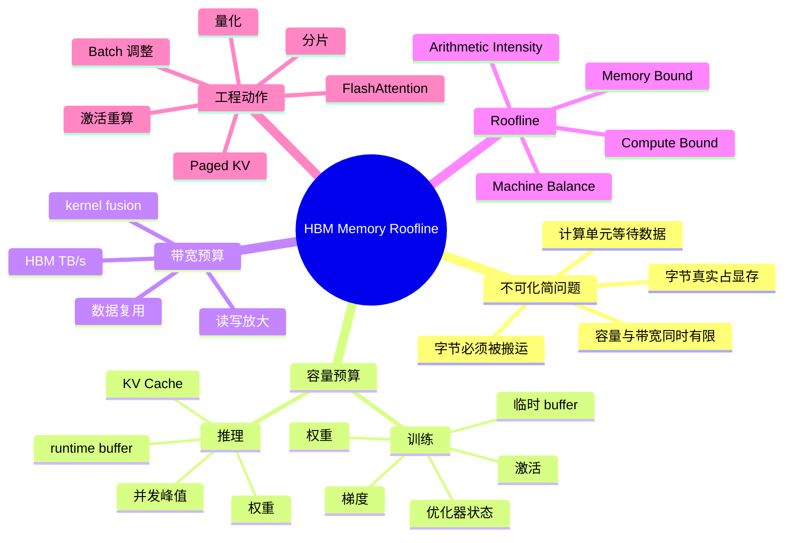

# 第4b章：HBM 显存、带宽与 Roofline

> **关联章节**：本章是 [第4章](./04-gpu-and-accelerators.md) 中 §4.2 显存/带宽和 §4.5 arithmetic intensity 的深入拆分。这里专注单 GPU 内部的 HBM、显存预算、训练/推理/KV Cache 与 roofline 判断；多机互联、NVSwitch、MIG 和非 NVIDIA 加速器只作为边界提及，详细内容交给第5章、第6章、第15章和平台调度章节。

## 1. 第一性原理拆解 + 学习大纲

### 拆 — 不可化简的问题

把 HBM、Tensor Core、FlashAttention、KV Cache、FP8 这些名字先拿掉，GPU 显存与带宽要解决的不可化简问题只有一个：**计算单元每秒能消耗海量数据，但模型状态必须真实占据某些字节，且这些字节必须从有限容量、有限带宽的存储介质中被反复读写。**

这句话有两个硬约束。第一是**容量约束**：权重、梯度、优化器状态、激活、临时 buffer 和 KV Cache 不是抽象变量，它们最终都要落到显存地址空间里。单卡 80GB 不是“差不多能跑 70B”，而是能否在某个并行策略、精度、batch、sequence length、并发和运行时碎片下，把所有状态放下。第二是**带宽约束**：就算放得下，如果每个 token、每个 layer 或每个 kernel 都要反复扫过大块内存，性能上限也可能由 HBM 每秒能搬多少字节决定，而不是由 Tensor Core 每秒能做多少乘加决定。

很多 AI Infra 事故都来自把这两个约束混在一起。显存 OOM 是容量失败；SM 利用率低、HBM 带宽打满、TPOT 高是带宽失败；算力很强但 decode 不快，是 arithmetic intensity 太低；训练 step 里峰值显存突然爆掉，常常是激活、通信 buffer、CUDA workspace 和 allocator fragmentation 同时叠加。平台工程师不能只问“这张卡有多少 TFLOPS”，而要能回答：这些字节有哪些、生命周期多长、每秒会被读写几次、可不可以分片、重算、量化、复用或缓存。

### 推 — 从这个问题如何推导出每个机制

从容量约束出发，首先得到**显存预算**。训练时，参数会衍生出权重、梯度、优化器状态和 master weight；forward 会产生激活；backward 会消耗和释放激活；框架还需要 kernel workspace、通信 buffer、CUDA graph pool 和 allocator 预留。推理时，没有梯度和优化器状态，但权重必须常驻，KV Cache 会随 batch、并发、上下文长度和 layer 数增长。于是训练的核心问题是“状态倍数 + 激活峰值”，推理的核心问题是“权重 + KV Cache + 并发”。

从带宽约束出发，得到**arithmetic intensity**。如果一个 kernel 每搬 1 byte 能做很多 ops，性能更可能受计算上限限制；如果每搬 1 byte 只做很少 ops，性能更可能受 HBM 带宽限制。GEMM 通过复用矩阵块提高 AI，所以大 batch、大 hidden size 时更接近 compute-bound；LayerNorm、RMSNorm、embedding lookup、decode attention 和许多 element-wise kernel 数据复用很少，所以更接近 memory-bound。Roofline 模型就是把这个判断画成一条上限曲线：左边受带宽斜线限制，右边受计算水平线限制，拐点就是 machine balance。

从生命周期出发，又能推导出训练和推理的差异。训练为了保存 backward 所需信息，会在 forward 后保留激活；activation checkpointing 用额外计算换显存；ZeRO/FSDP 用通信和分片换每卡状态；gradient accumulation 用更小 microbatch 换更大有效 batch。推理没有 backward，但 decode 阶段每生成一个 token 都要读权重、读写 KV Cache，长上下文和高并发会把显存容量与 HBM 带宽同时推到上限。prefill 和 decode 因此必须分开分析：prefill 常更接近 GEMM 计算，decode 常更接近内存扫描和小矩阵运算。

最后，所有公式都必须落回工程余量。纸面预算刚好 79GB 的任务，在 80GB 卡上大概率不稳定，因为还没算 allocator fragmentation、通信临时区、CUDA graph capture、不同 batch shape 的 workspace、峰值与稳态差异、监控和容错预留。可运行的预算通常需要留 10%-20% headroom；在线推理还要给突发长请求、prefix cache、paged KV block 碎片和模型热切换留空间。

### 概念先说清楚

HBM（High Bandwidth Memory）是贴近 GPU 计算芯片的高带宽显存。它的核心价值不是“比内存更大”，而是让 SM、Tensor Core、L2、copy engine 能以 TB/s 级别持续读写模型状态。HBM 同时有容量和带宽两个维度：容量决定权重、激活、optimizer state、KV Cache、workspace 能不能放下；带宽决定这些字节每秒能被搬运多少次。OOM 是容量失败，HBM 利用率打满但 SM 仍等数据是带宽失败，这两个问题的修复手段不同。

显存预算是在回答“哪些字节必须在什么时候驻留 HBM”。训练里的权重、梯度、优化器状态、master weight、激活、通信 buffer、临时 workspace 和 allocator 预留有不同生命周期；推理里的权重通常常驻，KV Cache 随 batch、并发、上下文长度和 layer 数增长。KV Cache 不是普通缓存，而是 attention decode 为了避免重复计算历史 token 而保存的 K/V tensor；它会把长上下文和高并发直接转成显存压力，并在 decode 阶段反复被读写。

Roofline 是一个性能上限模型，用来区分 kernel 更可能受计算上限还是内存带宽上限限制。Arithmetic intensity 表示每搬 1 byte 做多少计算；machine balance 表示这台 GPU 的峰值计算能力和峰值内存带宽之间的比例。AI 较低的算子落在 roofline 左侧，常被 HBM 限制；GEMM 等复用高的算子更可能靠近右侧，受 Tensor Core 计算限制。它不是精确预测器，而是帮你判断“该优化访存、融合、重用、batch，还是该优化矩阵计算路径”的第一张图。

### 绘 — 因果链路



### 导 — 读完本章你应该能回答

1. HBM 的容量和带宽分别限制什么，为什么“放得下”和“跑得快”是两个不同问题？
2. BF16 Adam 训练为什么常用 12-16 bytes/param 做第一版预算？哪些配置会让这个倍数变化？
3. LLM 推理中 KV Cache 的显存如何按 layer、KV head、head dim、token 数和并发计算？
4. 为什么 prefill 和 decode 对 GPU 的压力不同，decode 为什么经常 memory-bound？
5. Arithmetic intensity、roofline 和 machine balance 分别是什么，它们如何指导硬件选型和 kernel 排障？
6. 当 H100 的 BF16 算力远高于 A100，但某些任务提速不明显时，如何用 roofline 解释？
7. 面对一次 OOM 或吞吐低的问题，如何判断该优先做量化、减 batch、activation checkpointing、KV cache 管理，还是 kernel fusion？

### 本章拥有 / 不拥有

本章拥有的是**容量与带宽证据链**：把模型状态写成 CapacityLedger，把 kernel 或阶段写成 Roofline 坐标，再用 `torch.profiler`、PyTorch memory summary、`nsys`、`ncu` 和 DCGM 区分容量失败、HBM bandwidth 失败、Tensor Core compute-bound 和 runtime 空洞。本章不拥有 GPU-GPU 拓扑、NCCL rail、MIG/MPS 隔离策略或 GPU selection 的完整治理；如果 OOM 来自跨 GPU shard 策略或性能问题来自 NVLink/NIC，应转到 04c/04d 和并行训练章节。

### 04b CapacityLedger：先把字节写清楚

所有显存判断先落到 CapacityLedger，而不是凭经验说“70B 应该能放下”。最小账本如下：

```text
TrainingCapacityLedger =
  parameters
+ gradients
+ optimizer_state
+ master_weights
+ saved_activations
+ recompute_or_checkpoint_workspace
+ communication_buffers
+ cuda_graph_or_runtime_workspace
+ allocator_reserved_not_allocated
+ fragmentation_headroom

InferenceCapacityLedger =
  resident_weights
+ KV_cache
+ paged_kv_metadata
+ prefix_cache
+ runtime_workspace
+ cuda_graph_pool
+ allocator_reserved_not_allocated
+ fragmentation_headroom
```

常用 threshold：

- 训练任务启动前，纸面峰值显存不应超过可用 HBM 的 80%-90%；长序列、动态 shape、eval/generation 混跑时更接近 80%。
- 在线推理的稳态显存水位不应长期贴近 90%；如果 p95 watermark 高于 85% 且请求长度分布有长尾，应增加 admission control 或降低 max batched tokens。
- `reserved >> allocated` 且 OOM 报错要求大块连续分配时，优先怀疑 fragmentation 或 shape 抖动，不要直接采购更大 GPU。
- KV block free ratio 低于服务设定 threshold 时，应先拒绝/排队长请求，而不是等 CUDA OOM 把进程打掉。

### 04b EvidenceBundle：容量、HBM、Roofline 的采集路径

| 问题 | 证据 | 工具 / 命令 | 判断方式 |
|------|------|-------------|----------|
| 是否容量失败 | peak allocated、reserved、device used、KV block 使用率、OOM 栈 | PyTorch memory summary、`torch.cuda.max_memory_allocated()`、`nvidia-smi`、DCGM | CapacityLedger 超过 threshold 或峰值阶段明确 |
| 是否带宽失败 | HBM bandwidth、memory pipe、dram throughput、L2 hit、load/store efficiency | `ncu` memory workload sections、DCGM memory counters | HBM 接近可达上限而 Tensor Core/SM 不高 |
| 是否 runtime 空洞 | kernel 间隙、CPU launch、同步、H2D/D2H 拷贝 | `nsys`、`torch.profiler` | HBM 与 SM 都不高但时间线有空洞 |
| 是否 compute-bound | Tensor Core utilization、MMA 指令、SM issue active | `ncu` compute sections | AI 高且接近 compute roof |
| 是否拓扑牵连 | GPU-GPU/NIC 路径、NCCL collective 时间 | `nvidia-smi topo -m`、NCCL log | 跨 GPU 或跨节点阶段异常，转 04c |

命令模板：

```bash
# 1. 保存端到端时间线：看 OOM 前后、prefill/decode、optimizer step 是否阶段分明
nsys profile -t cuda,nvtx,osrt,cudnn,cublas -o memory_timeline python run_workload.py

# 2. PyTorch 显存：同时记录 allocated、reserved、peak、allocator 行为
PYTORCH_CUDA_ALLOC_CONF=expandable_segments:True python run_memory_profile.py

# 3. 单 kernel Roofline：只对 nsys 中确认耗时的 kernel 下钻
ncu --set full --target-processes all -o roofline_kernel python run_workload.py

# 4. 设备侧 HBM、温度、功耗与 throttle
dcgmi dmon -e 100,101,150,155,156,203,204
```

Retest criteria：

- 容量修复必须用最坏请求长度、最大并发、真实 batch bucketing 和 warmup 后稳态重测；只用短 prompt 或固定小 batch 不算通过。
- Roofline 优化必须同时报告 bytes/token 或 bytes/step、有效 HBM bandwidth、Tensor Core utilization 和端到端 TTFT/TPOT/step time。
- 量化、paged KV、activation checkpointing、FlashAttention、fused optimizer 等动作改变的是不同账本项；retest 报告必须说明减少了哪个字节项或提高了哪个复用项。
- driver、CUDA、PyTorch、推理引擎、batch scheduler、MIG profile、power cap 或 GPU SKU 变化后，CapacityLedger 和 BenchmarkProtocol 都要重新跑。

## 正文内容

### 4b.1 HBM 到底是什么：不是“显卡内存”的普通升级

HBM（High Bandwidth Memory）的关键不是名字里的 memory，而是 high bandwidth。普通服务器 DRAM 追求容量、成本和 CPU 访问语义；GPU HBM 追求贴近计算芯片的极高并行带宽。AI 负载里的大矩阵乘法、attention、归约和 KV Cache 访问，都会在极短时间里读取和写回大量 tensor。如果内存系统不能持续供给，Tensor Core 再多也会空等。

可以把 HBM 理解成 GPU 的“近场工作台”：

| 维度 | HBM 的工程含义 | AI 负载里的表现 |
|------|----------------|----------------|
| 容量 | 单卡能常驻多少状态 | 模型权重、激活、KV Cache 是否放得下 |
| 带宽 | 每秒能读写多少字节 | decode TPOT、LayerNorm、attention、optimizer step 是否被内存限制 |
| 延迟 | 单次访问仍不便宜 | GPU 靠大量线程隐藏延迟，不适合小而串行的访存 |
| 共享性 | 同一 GPU 上所有 SM 共享 | 多 kernel、多 stream、多 tenant 会争同一条 HBM 通道 |
| 成本 | 比 DRAM 昂贵且容量有限 | 需要预算、复用、分片和量化 |

HBM 与 CPU cache 的直觉也不同。GPU 没有靠一个巨大的低延迟 cache 让单线程快速返回，而是靠海量线程、coalesced access、shared memory、L2 和 HBM 带宽把吞吐堆起来。一个 kernel 如果访问模式不连续、复用低、warp 分歧严重，即使总字节数不大，也可能跑不满带宽；另一个 kernel 如果访问连续且并发高，就可能接近 HBM 理论带宽的相当比例。

### 4b.2 显存预算的总公式

先给一个工程上足够实用的总公式：

```text
峰值显存 =
  常驻模型状态
+ 当前阶段激活 / KV Cache
+ 临时 workspace
+ 通信 buffer
+ framework / allocator / CUDA graph 预留
+ fragmentation 与安全余量
```

不要把 `torch.cuda.memory_allocated()` 当作完整答案。它通常只显示框架已分配给 tensor 的部分，不等于进程真正占用，也不等于下一次 shape 变化时的峰值。排查时至少要同时看：

| 指标 | 含义 | 常见工具 |
|------|------|----------|
| allocated | 框架当前 tensor 占用 | PyTorch memory summary |
| reserved | caching allocator 向 CUDA 申请后保留的池 | PyTorch memory summary |
| device used | 驱动视角进程占用 | `nvidia-smi` |
| peak allocated | 最近阶段的峰值 | `torch.cuda.max_memory_allocated()` |
| kernel workspace | cuBLAS/cuDNN/attention engine 临时区 | profiler、框架日志 |
| fragmentation | 空闲但不可用于大块申请的碎片 | OOM 报错、allocator snapshot |

工程预算最好分成**稳态**和**峰值**。稳态决定平均吞吐和可常驻副本数；峰值决定是否 OOM。训练中，forward 末尾、backward 中部、optimizer step、checkpoint 保存、ZeRO all-gather 都可能成为峰值点。推理中，prefill 大 batch、长上下文请求进入、KV block 分配、CUDA graph capture 和模型热加载都可能成为峰值点。

### 4b.3 训练显存：为什么 Adam 会吃掉这么多

以 BF16 训练为例，最容易记住的参数状态预算是：

| 状态 | 常见精度 | bytes/param | 说明 |
|------|----------|-------------|------|
| 模型权重 | BF16 | 2 | forward/backward 主权重 |
| 梯度 | BF16 或 FP32 | 2-4 | 取决于框架和优化器配置 |
| Adam 一阶矩 `m` | FP32 | 4 | optimizer state |
| Adam 二阶矩 `v` | FP32 | 4 | optimizer state |
| master weight | FP32 或无 | 0-4 | mixed precision 下有些配置保留 |

所以常见粗算有两个口径：

```text
保守 BF16 Adam ≈ 16 bytes/param
较紧 BF16 Adam ≈ 12 bytes/param
```

差异来自梯度精度、是否保留 FP32 master weight、optimizer 实现和 sharding 策略。平台做容量规划时，第一版通常用 16 bytes/param 更安全；研究代码确认配置后，再把预算收紧。

以 7B、70B、405B 参数模型为例，只看参数相关状态：

| 模型规模 | 仅 BF16 权重 | 12 bytes/param 训练状态 | 16 bytes/param 训练状态 |
|----------|--------------|--------------------------|--------------------------|
| 7B | 14 GB | 84 GB | 112 GB |
| 70B | 140 GB | 840 GB | 1.12 TB |
| 405B | 810 GB | 4.86 TB | 6.48 TB |

这张表解释了为什么“70B 推理 2 张 80GB 卡能勉强放权重”和“70B 训练需要很多卡”不是矛盾。推理主要放权重和 KV Cache；训练要放梯度、优化器状态、激活和临时 buffer。

#### 4b.3.1 激活显存：真正让 batch 和 sequence length 难调的部分

参数状态通常和参数量线性相关，而激活显存和以下变量相关：

```text
激活显存 ≈ layers × batch × sequence_length × hidden_size × bytes × 保存因子
```

“保存因子”不是固定常数，因为不同实现会保存不同中间值：attention 的 Q/K/V、softmax 结果、MLP 中间激活、dropout mask、残差、norm 输入等都会影响峰值。FlashAttention 这类实现的价值之一，就是减少 attention 矩阵等中间状态的物化，把显存从近似 `O(seq_len^2)` 的压力压回更接近流式计算的形态。

激活显存有几个工程特征：

| 现象 | 原因 | 常见动作 |
|------|------|----------|
| sequence length 翻倍，显存不止翻倍 | attention 中间状态和部分 workspace 放大 | FlashAttention、缩短上下文、分块 |
| microbatch 增大很快 OOM | 激活随 batch 近似线性增长 | gradient accumulation、减 microbatch |
| 开启 activation checkpointing 后显存降、step 变慢 | backward 时重算 forward 片段 | 用计算换容量 |
| 不同模型实现显存差很多 | 保存中间 tensor 的策略不同 | profiler 对比 peak allocation |
| 第一步比后续更高 | kernel autotune、workspace、CUDA graph capture | warmup 后再测稳态，但峰值仍要预算 |

#### 4b.3.2 一个训练预算案例：13B SFT 单机能不能跑

假设要在 8×H100 80GB 节点上做 13B 模型 SFT，BF16，AdamW，sequence length 4096，global batch 128。先不讨论跨节点，只判断单节点是否有希望。

第一步，算参数状态：

```text
13B × 16 bytes/param ≈ 208 GB
```

如果完全复制到每卡，每卡光参数状态就 208GB，必然不行。需要 FSDP/ZeRO 把参数、梯度和优化器状态分片。8 卡均分后：

```text
208 GB / 8 ≈ 26 GB/卡
```

第二步，给激活和临时区预算。假设 microbatch per GPU = 1，activation checkpointing 开启后，每卡激活峰值按 18-28GB 粗估；通信 buffer、workspace、allocator 预留 8-12GB。

| 项目 | 每卡估算 |
|------|----------|
| 分片后的参数/梯度/优化器状态 | ~26 GB |
| 激活峰值 | ~18-28 GB |
| 通信和 workspace | ~8-12 GB |
| 安全余量 | ~8 GB |
| 合计 | ~60-74 GB |

结论：8×80GB 有希望，但不是“随便跑”。如果 sequence length 到 8192、microbatch per GPU 到 2，或关闭 activation checkpointing，就很可能 OOM。工程上应先用小 step 做 peak memory profile，再决定 microbatch、checkpointing 粒度和 FSDP wrapping 策略。

### 4b.4 推理显存：权重不再是唯一主角

推理显存可以先用这个公式：

```text
推理显存 ≈ 权重 + KV Cache + runtime buffer + fragmentation/headroom
```

权重部分很好算：

| 精度 | bytes/param | 70B 权重大致大小 |
|------|-------------|------------------|
| BF16/FP16 | 2 | ~140 GB |
| FP8/INT8 | 1 | ~70 GB |
| INT4/FP4 | 0.5 | ~35 GB |

但线上服务真正麻烦的是 KV Cache。权重是常驻固定成本，KV Cache 是随请求增长的动态成本。并发越高、上下文越长、输出越长，KV Cache 越大；如果没有分页式管理和良好的 eviction，显存会被少数长请求迅速吃完。

### 4b.5 KV Cache 的计算公式

Transformer decode 时，每一层都会保存历史 token 的 Key 和 Value。一个常用估算公式是：

```text
KV Cache bytes =
  batch_or_concurrent_sequences
× total_tokens_per_sequence
× layers
× kv_heads
× head_dim
× 2                 # K 和 V
× bytes_per_element
```

如果使用 GQA/MQA，`kv_heads` 小于 query heads，KV Cache 会显著下降。这是现代 LLM 架构对推理显存很重要的原因之一。

以一个 70B 级模型为例，假设：

- layers = 80
- kv_heads = 8
- head_dim = 128
- KV 精度 = FP16/BF16，2 bytes

单 token KV Cache：

```text
80 × 8 × 128 × 2 × 2 bytes = 327,680 bytes ≈ 320 KB/token
```

不同上下文和并发下：

| 场景 | token 总量 | KV Cache |
|------|------------|----------|
| 1 个请求，8K tokens | 8,192 | ~2.5 GB |
| 1 个请求，32K tokens | 32,768 | ~10 GB |
| 8 个并发，各 8K | 65,536 | ~20 GB |
| 32 个并发，各 8K | 262,144 | ~80 GB |
| 8 个并发，各 32K | 262,144 | ~80 GB |

这张表比“某模型支持 128K 上下文”更有工程意义。支持不等于便宜，更不等于高并发下稳定。长上下文会把显存从权重问题变成 KV Cache 问题；高并发也会在相同 token 总量下产生相似压力。

#### 4b.5.1 KV Cache 的生命周期

KV Cache 不是一块永远增长的数组，它有生命周期：

| 阶段 | KV 行为 | 资源压力 |
|------|---------|----------|
| Prefill | 一次性为 prompt token 写入 K/V | 大 GEMM + 大量写入，常有较高算力利用 |
| Decode | 每步追加新 token 的 K/V，并读取历史 K/V | 小 batch 时 memory-bound，受 HBM 和调度影响 |
| Finish | 请求结束后释放 KV block | 需要及时回收，否则显存泄漏式下降 |
| Prefix reuse | 共享系统 prompt 或长前缀 | 节省 prefill 计算，但占用常驻 KV |
| Eviction | 显存压力下淘汰低价值 cache | 影响命中率、尾延迟和重算成本 |

Paged KV 的核心动机是避免为每个请求预留最大上下文长度，改成按 block 分配。它解决的是容量碎片和动态并发问题，不会让每个 token 的读写字节凭空消失。换句话说，paged KV 更像“把显存用得更满、更稳”，不是“让 HBM 带宽无限大”。

### 4b.6 Prefill vs Decode：同一个模型的两个性能世界

LLM 推理至少要分成两个阶段：

| 阶段 | 输入形态 | 主要计算 | 更常见瓶颈 | 典型优化 |
|------|----------|----------|------------|----------|
| Prefill | 一次处理 prompt 中的很多 token | 大矩阵乘法、attention | compute-bound 或混合 | 大 batch、FlashAttention、prefix cache |
| Decode | 每轮生成 1 个或少量 token | 小 GEMM、读权重、读写 KV | memory-bound、调度开销 | continuous batching、KV 管理、量化、提高 HBM 带宽 |

decode 的一个粗暴下限来自权重读取：

```text
每 token 最低时间 ≥ 权重大小 / 有效 HBM 带宽
```

例如 70B BF16 权重约 140GB。如果总有效 HBM 带宽按 2 张 H100 聚合后 6.7TB/s 粗算，单看权重扫描的理想下限：

```text
140 GB / 6.7 TB/s ≈ 21 ms/token
```

真实系统还要加 KV Cache 访问、通信、kernel launch、调度、采样、runtime overhead 和未达到理论带宽的折损，所以 TPOT 会更高。这个估算的价值不是预测精确延迟，而是告诉你：如果 decode 已经受权重和 KV 的 HBM 读写限制，继续追 TFLOPS 没意义；更高 HBM 带宽、更低权重量化、更好的 batching 和减少内存读写才是方向。

### 4b.7 Arithmetic Intensity：把“算”和“搬”放到同一张账本

Arithmetic intensity（AI）定义为：

$$
AI = \frac{\text{Ops}}{\text{Bytes moved}}
$$

它回答的问题是：每从内存系统搬 1 byte，能做多少计算。如果 AI 高，说明数据复用好，可能受计算上限限制；如果 AI 低，说明大量时间花在搬数据，可能受带宽限制。

几个直觉例子：

| 算子 / 场景 | 数据复用 | AI 直觉 | 更常见瓶颈 |
|-------------|----------|---------|------------|
| 大 GEMM | A/B tile 被多次复用 | 高 | Tensor Core / compute |
| 小 GEMM | tile 小，复用不足 | 中低 | launch、带宽、占用率 |
| LayerNorm/RMSNorm | 每个元素读写少量几次 | 低 | HBM 带宽 |
| GELU/add/mul | 逐元素读写 | 低 | HBM 带宽 |
| Embedding lookup | 随机读，几乎无复用 | 很低 | HBM/L2/访存模式 |
| Attention prefill | QK/AV 有矩阵复用 | 中高 | shape 相关 |
| Attention decode | 每步读历史 KV | 低到中 | HBM 带宽 |
| Optimizer step | 读写权重、梯度、m、v | 低 | HBM 带宽 |

#### 4b.7.1 GEMM 的 AI 为什么高

矩阵乘法 $C = A \times B$，形状为 $M \times K$ 乘 $K \times N$。粗略 ops：

```text
Ops ≈ 2 × M × N × K
```

如果只按每个矩阵读写一次粗算，bytes：

```text
Bytes ≈ (M×K + K×N + M×N) × bytes_per_element
```

当 M、N、K 都很大时，ops 是三维乘积，bytes 是二维面积之和，所以 AI 会随矩阵尺寸变大而变高。这就是为什么大 GEMM 能接近 Tensor Core 峰值，而小 batch、小 hidden、碎矩阵很难跑满。

#### 4b.7.2 LayerNorm 为什么低

LayerNorm/RMSNorm 需要读输入、做归约、再写输出。每个元素参与的计算很少，且结果很难像 GEMM 那样被大量复用。即使用很好的 kernel，把多次读写融合起来，AI 仍然不会变成大 GEMM 那种量级。优化方向通常是：

- 减少读写次数
- 融合相邻 element-wise kernel
- 保持连续访问和向量化 load/store
- 避免中间 tensor 物化

这类优化提升来自“少搬字节”，不是“多用 Tensor Core”。

### 4b.8 Roofline：一张图判断上限

Roofline 模型把硬件上限写成：

$$
Performance \le \min(PeakCompute,\ AI \times MemoryBandwidth)
$$

其中：

- `PeakCompute` 是该精度下的峰值算力
- `MemoryBandwidth` 是 HBM 可达带宽
- `AI × MemoryBandwidth` 是在给定数据复用下，内存系统能支撑的性能上限

```text
性能 ^
     |                              compute roof
     |                         ----------------------
     |                       /
     |                     /
     |                   /
     |                 /
     |_______________/______________________________> Arithmetic Intensity
                    ^
                    |
              machine balance
```

拐点位置：

$$
MachineBalance = \frac{PeakCompute}{MemoryBandwidth}
$$

如果某 kernel 的 AI 小于 machine balance，它在 roofline 左侧，理论上 memory-bound；如果 AI 大于 machine balance，它在右侧，理论上 compute-bound。

#### 4b.8.1 不同 GPU 的 machine balance

用第4章相同的数量级口径，可以建立直觉：

**数字口径标签**：`vendor-public + illustrative calculation`，规格核对日期 `2026-05-05`，shape=`N/A`；表内 peak compute 和 HBM 带宽来自 NVIDIA 公开规格或产品页数量级，Machine balance 为 `厂商峰值 / HBM bandwidth` 的手算值，不是 kernel 实测吞吐。Blackwell/B200/GB200 行尤其要在采购或报告前重新核对 dense/sparse、BF16/FP16/FP8/FP4、单卡/system total 和具体服务器形态口径。

| 设备 | BF16/FP16 峰值口径 | HBM 带宽 | Machine balance |
|------|----------------------|----------|-----------------|
| A100 80GB SXM | ~312 TFLOPS，厂商峰值；需确认 dense/sparse 与 dtype | ~2.0 TB/s | ~156 ops/byte |
| H100 SXM | ~989 TFLOPS，厂商峰值；需确认 dense/sparse 与 dtype | ~3.35 TB/s | ~295 ops/byte |
| H200 SXM | ~989 TFLOPS，厂商峰值；需确认 dense/sparse 与 dtype | ~4.8 TB/s | ~206 ops/byte |
| B200 SXM | 厂商峰值数量级；需核对 dense/sparse、BF16/FP16/FP8/FP4 和单卡/system 口径 | ~8.0 TB/s | 仅作数量级示意 |
| GB200 | 厂商峰值数量级；需核对是否为 per-GPU、Grace Blackwell module 或 rack/system total | ~8.0 TB/s 级 | 仅作数量级示意 |

数字基于 NVIDIA 官方 datasheet / 产品规格（公开规格）或公开产品页数量级，不应用作未经复核的采购承诺。不同页面可能混用 dense、2:4 sparse、FP8/FP4 峰值、单 GPU 和整机/整柜总量；写入选型表前必须逐项标明。只有模型、kernel 和引擎实际走到对应低精度或结构稀疏路径时，相关峰值才有工程意义。

> [!WARNING]
> **B200/GB200 machine balance 口径提醒**：如果按厂商公开峰值和公开 HBM 带宽数量级粗算，Blackwell 一代的 compute roof 增长可能快于 HBM 带宽增长；但具体倍数取决于 dense/sparse、dtype、单卡/system total 和产品形态。结果是：在 H100 上已经 memory-bound 的 kernel（如 decode attention、layernorm、small-batch GEMV、KV-cache 写回），从 H100 换到新卡时不应按 TFLOPS 峰值同比例外推。`illustrative workload label`：decode-heavy LLM serving、small batch、KV-cache bandwidth bound、相同模型和引擎版本、核对日期 `2026-05-05`；这类路径必须用目标模型和引擎压测验证。prefill 大 batch GEMM 才更可能接近 compute roof。

这张表想表达的不是“某张新卡一定有某个 dense TFLOPS”，而是一个选型约束：compute roof 和 memory roof 的增长不同步时，同一个 AI 不变的 kernel 可能更容易落在 roofline 左侧。你会看到 GPU 标称算力暴涨，但某些 memory-bound kernel 提速远小于峰值 TFLOPS 提升。B200/GB200 的实际推理 throughput 还取决于 FP4 / FP8 量化是否可用、MLA / GQA 是否降低 KV bandwidth、Speculative Decoding 是否适配，以及 runtime 是否吃到对应 kernel 路径，而不仅仅是换硬件。

H200 没有把 BF16 算力翻倍，但 HBM 容量和带宽提升明显，所以对长上下文、decode、optimizer step、activation-heavy workload 可能比”算力没变”看起来更有价值。平台选型不能只看计算 roof，也要看 memory roof 的斜率。

#### 4b.8.2 Roofline 不是精确预言，而是排障坐标系

Roofline 的价值不是告诉你“这个 kernel 一定跑到 73.2 TFLOPS”，而是给排障排序：

| 观测 | Roofline 解读 | 优先动作 |
|------|---------------|----------|
| HBM 带宽高、SM/Tensor 利用低 | memory-bound | fusion、减少读写、量化、改善访问模式 |
| SM/Tensor 利用高、HBM 未满 | compute-bound | Tensor Core shape、精度、tile、occupancy |
| HBM 和 SM 都低 | 可能是 launch、同步、shape 太小、CPU 调度 | batch、CUDA graph、减少小 kernel |
| 理论 AI 高但实测像 memory-bound | 数据布局或 kernel 没有实现复用 | profiler 看 cache hit、shared memory、global load |
| 单 kernel 好，端到端差 | 阶段间同步、runtime、调度或 IO | trace 全链路，不只看 kernel |

### 4b.9 用 roofline 看训练 step

一个 transformer 训练 step 可以粗略拆成：

| 阶段 | 主要状态 | 更常见 roofline 位置 |
|------|----------|----------------------|
| Forward GEMM | 权重、激活 | compute-bound |
| Attention prefill | Q/K/V、attention 中间 | 混合，取决于 seq 和 kernel |
| Norm/element-wise | 激活读写 | memory-bound |
| Backward GEMM | 激活、梯度、权重 | compute-bound |
| Optimizer step | weight/grad/m/v 读写 | memory-bound |
| Activation recompute | 额外 forward | compute 换 memory |

这解释了一个常见现象：训练 profiler 里 GEMM 很快，但 step time 仍然不理想。原因可能不是 matmul 慢，而是大量低 AI kernel、optimizer step、通信前后的拷贝和显存压力拖慢了端到端。优化顺序通常是：

1. 先确认是否 OOM 或接近 OOM，避免 allocator 抖动。
2. 再看时间占比最高的 kernel 或阶段。
3. 对 compute-bound GEMM，优化 shape、precision、Tensor Core 利用。
4. 对 memory-bound kernel，优先减少读写、融合、重排布局。
5. 对显存容量，考虑 checkpointing、分片、offload 或减 microbatch。

### 4b.10 用 roofline 看推理服务

推理端最容易犯的错误，是只测一个短 prompt 的吞吐，然后把结论推广到线上长上下文和高并发。更稳的拆法是：

| 负载形态 | 资源主导 | 关键指标 |
|----------|----------|----------|
| 短 prompt、低并发 | launch/runtime overhead 明显 | TTFT、单请求 TPOT |
| 长 prompt prefill | GEMM 和 attention | prefill tokens/s、TTFT |
| 长 decode、高并发 | HBM 带宽 + KV Cache | TPOT、tokens/s/GPU、显存水位 |
| 多租户混合长度 | KV 分配和调度 | p95/p99 latency、OOM/eviction |
| 量化模型 | 权重带宽下降，但 kernel 复杂 | 质量、吞吐、反量化开销 |

一个工程判断例子：

| 优化 | 主要改善 | 对 capacity | 对 bandwidth | 风险 |
|------|----------|-------------|--------------|------|
| 权重量化到 INT8/INT4 | 权重显存和权重读取 | 明显降低 | 明显降低 | 精度、kernel 支持 |
| KV Cache 量化 | KV 显存和读写 | 长上下文收益大 | decode 收益大 | 质量和实现复杂度 |
| Continuous batching | 提高 GPU 填充度 | 不减少单请求 KV | 提高有效利用 | 尾延迟调度复杂 |
| Prefix caching | 减少重复 prefill | 增加常驻 cache | 减少部分计算 | cache 命中依赖流量 |
| Paged KV | 降低碎片和预留浪费 | 明显改善 | 不直接提高带宽 | block 管理开销 |

### 4b.11 工程案例一：70B 推理为什么“权重放下了”仍然 OOM

背景：团队用 2×H100 80GB 部署 70B BF16 模型，tensor parallel = 2。权重总大小约 140GB，每卡约 70GB。上线前用单请求测试能跑；上线后并发稍高就 OOM。

第一版错误判断：

```text
每卡 80GB - 权重 70GB = 10GB
还能跑一点并发
```

缺失项：

| 项目 | 每卡压力 |
|------|----------|
| 分片权重 | ~70 GB |
| runtime / workspace / graph / allocator | 2-5 GB |
| KV Cache | 随并发和上下文增长 |
| fragmentation/headroom | 3-8 GB |

如果 70B 模型单 token KV 约 320KB，TP=2 后每卡是否保存完整 KV 取决于实现和并行方式，但即使理想均分，每卡可用给 KV 的空间也可能只有几 GB。一个 8K token 请求的总 KV 约 2.5GB；多个并发或长上下文很快吃完余量。

更可靠的结论：

- 2×H100 BF16 适合证明“能加载”，不适合高并发长上下文。
- 如果坚持 BF16，需要更多卡或更大显存卡。
- 如果目标是在线服务，应评估 INT8/INT4 权重量化、KV 量化、H200/B200、更严格的 max context 和 admission control。
- 监控不能只看 GPU utilization，还要看 KV block 使用率、剩余 block、请求长度分布和 OOM 前的 allocator 状态。

### 4b.12 工程案例二：H100 比 A100 强很多，为什么 LayerNorm 没快多少

背景：某训练代码从 A100 80GB 迁到 H100。GEMM 提速明显，但 profiler 里 LayerNorm、residual add、dropout、optimizer step 的耗时下降有限，端到端 step 只提升 1.6x，远低于 BF16 峰值算力提升。

用 roofline 解释：

| 项目 | A100 | H100 | 影响 |
|------|------|------|------|
| BF16 dense 算力 | ~312 TFLOPS | ~989 TFLOPS | compute roof ~3.2x |
| HBM 带宽 | ~2.0 TB/s | ~3.35 TB/s | memory roof ~1.7x |
| LayerNorm AI | 低 | 低 | 主要吃 memory roof |

LayerNorm 这类 kernel 的上限大致跟有效 HBM 带宽走，而不是跟 Tensor Core 走。所以看到 1.5-1.8x 的提升并不奇怪。真正该做的是：

- 融合 LayerNorm + residual + dropout 等相邻读写。
- 避免产生额外中间 tensor。
- 使用更好的 fused optimizer。
- 确认 tensor layout 连续，避免非合并访存。
- 把优化预期从“跟 TFLOPS 同比例”改成“跟有效 HBM 带宽同量级”。

### 4b.13 工程案例三：训练 OOM 的最小排查链

现象：一个 7B SFT 任务在 8×A100 80GB 上偶发 OOM。相同配置有时能跑几十 step，有时 warmup 后第一个长 batch OOM。

排查链：

1. 固定随机种子和输入长度，确认是否由变长 batch 触发。
2. 记录 `max_memory_allocated`、`max_memory_reserved` 和 `nvidia-smi` 峰值。
3. 分阶段打点：load model、first forward、loss、backward、optimizer step、eval。
4. 关闭 eval 或 generation，确认是否训练中插入推理造成 KV/activation 峰值。
5. 降 microbatch，不降 global batch，观察是否线性缓解。
6. 开启或加深 activation checkpointing，观察显存下降与 step time 上升。
7. 检查是否有保存 loss/logits/hidden states 到列表导致 tensor 生命周期延长。
8. 调整 allocator 配置和固定 shape，确认是否 fragmentation。

常见根因表：

| 根因 | 表现 | 修复 |
|------|------|------|
| 变长 batch 有极长样本 | 偶发 OOM | length bucketing、max length、token budget batch |
| eval generation 混入训练进程 | 训练中段峰值突增 | 单独 eval、限制 eval batch、清理 cache |
| 保存 tensor 而未 detach | 显存逐 step 增长 | `.detach()`、只保存标量 |
| activation 太大 | 降 microbatch 立刻有效 | checkpointing、gradient accumulation |
| allocator 碎片 | reserved 很高但 allocated 不高 | 固定 shape、调整 allocator、重启进程 |
| optimizer state 未分片 | load 后就接近满 | FSDP/ZeRO 配置检查 |

### 4b.14 常见优化手段：它们到底换了什么

| 手段 | 主要解决 | 付出的代价 | 适合场景 |
|------|----------|------------|----------|
| 降 precision / 量化 | 权重和带宽 | 精度风险、kernel 依赖 | 推理、部分训练 |
| Activation checkpointing | 激活容量 | 重算，step 变慢 | 长序列训练 |
| FSDP/ZeRO | 每卡参数状态 | 通信和复杂度 | 大模型训练 |
| Gradient accumulation | global batch 不变下降 microbatch | step 内循环更多 | 显存不够但吞吐可接受 |
| FlashAttention | attention 中间显存和带宽 | kernel/shape 约束 | 长序列 |
| Fused kernels | 中间 tensor 和 HBM 往返 | 实现复杂 | norm、bias、activation、optimizer |
| Paged KV | KV 碎片和预留 | block 管理开销 | 多并发推理 |
| KV quantization | KV 容量和带宽 | 质量风险 | 长上下文 decode |
| Admission control | 防止极端请求打爆显存 | 拒绝或排队 | 在线服务 |

一个判断原则：**容量问题优先减少常驻字节或峰值生命周期；带宽问题优先减少每 token/每 step 搬运字节或提高访问复用；算力问题才优先追 Tensor Core 利用。**

### 4b.15 实战 Checklist

#### 训练显存预算 Checklist

- [ ] 参数量、精度、optimizer 类型是否明确？
- [ ] 是否保留 FP32 master weight？
- [ ] 梯度和 optimizer state 是否分片？
- [ ] microbatch、sequence length、activation checkpointing 是否明确？
- [ ] 是否估算了 activation 峰值，而不只是参数状态？
- [ ] 是否给 workspace、communication buffer、allocator reserved 留余量？
- [ ] 是否区分 warmup 峰值、稳态峰值和 eval/generation 峰值？
- [ ] 是否用真实长样本做过 peak memory profile？

#### 推理显存预算 Checklist

- [ ] 权重精度和实际加载格式是否明确？
- [ ] KV Cache 公式里的 layers、kv_heads、head_dim、bytes 是否按模型确认？
- [ ] max context、max batched tokens、并发上限是否写入 admission control？
- [ ] 是否启用 paged KV、prefix cache 或 KV quantization？
- [ ] 是否监控 KV block 使用率，而不只是 `nvidia-smi`？
- [ ] 是否给 runtime buffer、CUDA graph、碎片和热更新留余量？
- [ ] 是否分别测 prefill、decode、混合流量？

#### Roofline 排障 Checklist

- [ ] 当前最慢的是 kernel、阶段，还是端到端调度？
- [ ] profiler 中 HBM 带宽是否接近设备可达上限？
- [ ] Tensor Core utilization 是否高？
- [ ] 低 AI kernel 是否占据大量时间？
- [ ] 是否存在很多小 kernel launch 和同步？
- [ ] shape 是否适合 Tensor Core tile？
- [ ] tensor layout 是否连续，访存是否 coalesced？
- [ ] 优化动作是否匹配瓶颈：减少字节、增加复用、还是提高计算利用？

## 本章小结

| 概念 | 核心问题 | 工程判断 |
|------|----------|----------|
| HBM 容量 | 状态能否放下 | 权重、梯度、优化器、激活、KV、buffer 都要算 |
| HBM 带宽 | 字节能否及时供给 | decode、norm、optimizer、embedding 常受限 |
| 训练预算 | 参数状态 + 激活峰值 | BF16 Adam 常用 12-16 bytes/param 起算 |
| 推理预算 | 权重 + KV Cache | 长上下文和高并发会让 KV 成为主角 |
| Arithmetic intensity | 每 byte 做多少 ops | 高 AI 看算力，低 AI 看带宽 |
| Machine balance | compute roof / memory bandwidth | 判断 kernel 落在 roofline 左侧还是右侧 |
| 优化手段 | 改变容量、带宽或计算 | 先判瓶颈，再选量化、分片、重算、fusion、paged KV |

---

## 练习题

### 基础题

1. 为什么“模型权重能放下”不等于“推理服务能上线”？请至少列出 3 个额外显存项。
2. BF16 Adam 训练中，为什么常用 12-16 bytes/param 做参数状态预算？各项分别是什么？
3. 用公式计算：一个 32 layer、kv_heads=8、head_dim=128、BF16 KV 的模型，每 token KV Cache 大约是多少？
4. Prefill 和 decode 哪个更容易 memory-bound？为什么不能用一次短 prompt benchmark 代表线上性能？
5. 什么是 machine balance？它和 arithmetic intensity 如何共同判断 memory-bound / compute-bound？

### 进阶题

6. 一个 13B 模型用 BF16 Adam 训练，按 16 bytes/param 粗算参数状态需要多少显存？如果用 8 卡 FSDP 均分，每卡参数状态约多少？
7. 某 70B BF16 推理模型 TP=2 部署在 2×80GB GPU 上，每卡权重约 70GB。假设每卡还需要 5GB runtime/headroom，可用于 KV 的显存还剩多少？这对 8K 上下文并发意味着什么？
8. 口径标签：`illustrative exercise`，规格核对日期 `2026-05-05`，按 `vendor-public dense BF16 Tensor Core peak / vendor-public HBM bandwidth` 粗算，shape=`N/A`。A100 80GB 的 machine balance 约 `312 TFLOPS / 2.0 TB/s ≈ 156 ops/byte`，H100 SXM 约 `989 TFLOPS / 3.35 TB/s ≈ 295 ops/byte`。一个 AI=80 ops/byte 的 kernel 在两张卡上都更接近哪类瓶颈？为什么换 H100 后提速可能不跟 TFLOPS 成比例？
9. 一个训练任务 OOM，但 `allocated` 明显低于 `reserved`。这可能说明什么？你会如何验证是否为碎片或 shape 抖动？
10. 解释 FlashAttention 为什么既可能降低显存，又可能提升速度。它减少的是哪些中间状态或内存往返？

### 开放题

11. 你的团队要上线一个长上下文客服模型，目标是 32K context、p95 TPOT < 80ms、并发 64。请写出显存预算表和需要压测的指标。
12. 某供应商说“新 GPU BF16 算力是旧 GPU 的 3 倍，所以训练会快 3 倍”。请用 roofline 组织一段反驳或验证计划。
13. 一个 70B 服务在白天高峰 OOM、夜间稳定。你会从请求长度分布、KV Cache、batching、allocator 和 admission control 哪些方向排查？
14. 对一个 HBM 带宽已接近上限的 decode 服务，列出 5 个可能优化动作，并说明每个动作减少的是权重字节、KV 字节、碎片，还是调度空洞。
15. 设计一次 profiler 实验，把 transformer step 中的 compute-bound GEMM 和 memory-bound norm/optimizer 分开测。你会采集哪些指标，如何判断优化是否有效？
