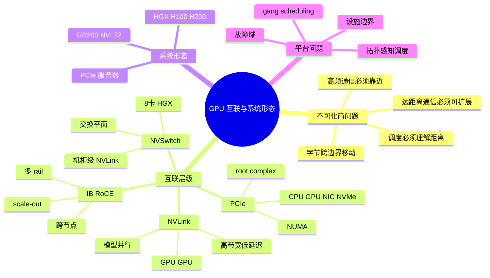
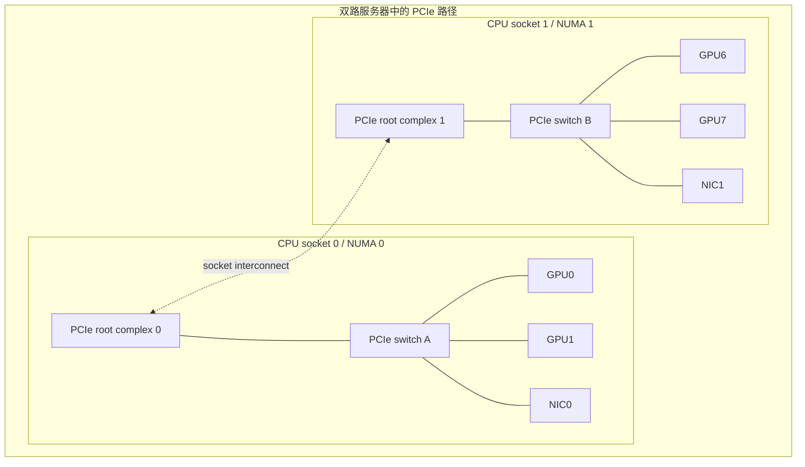
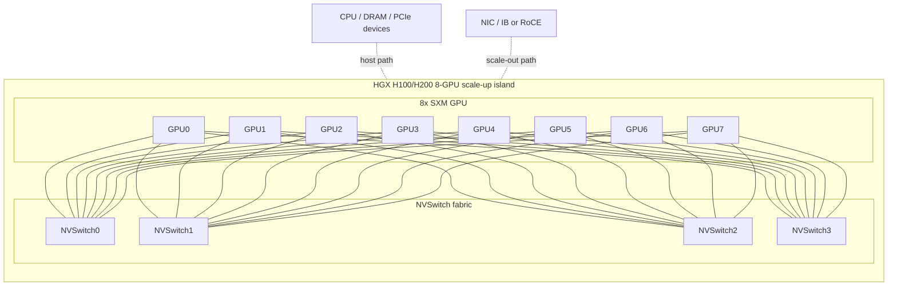
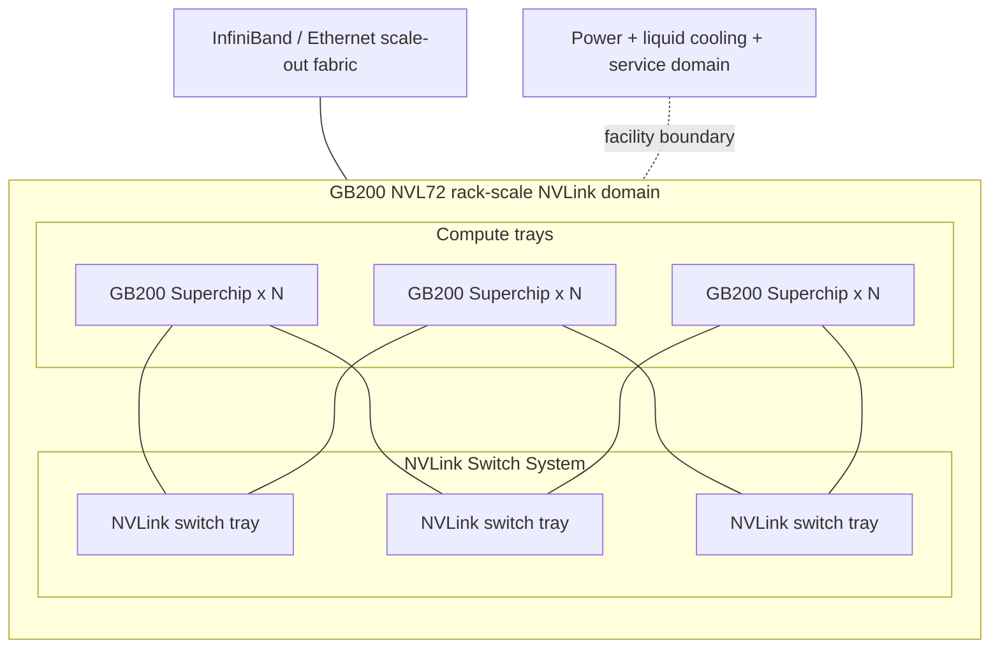
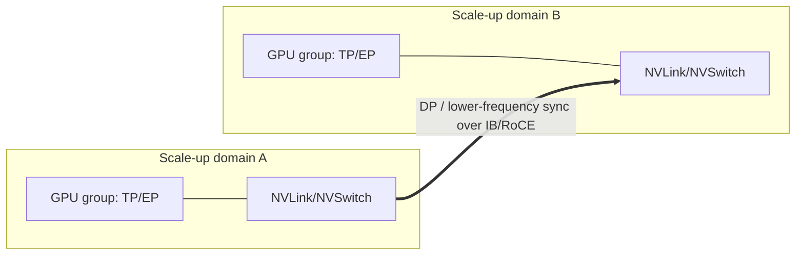
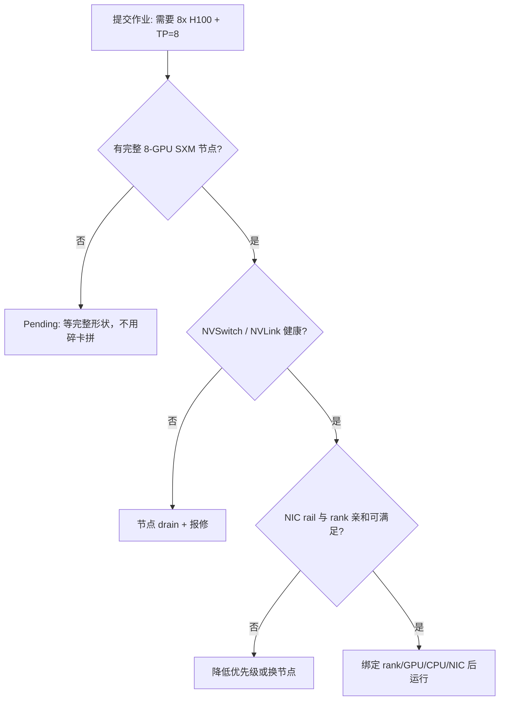

# 第4c章：GPU 互联与系统形态

> **关联章节**：本章是第4章 GPU 硬件选型中“互联”部分的独立展开。阅读时可以把它和 [第5章](./05-memory-interconnect-io.md) 的数据搬运链路、[第8章](../part3-training-infra/08-data-parallel.md) 的数据并行、[第9章](../part3-training-infra/09-model-pipeline-parallel.md) 的张量 / 流水并行，以及 [第20章](../part6-platform-and-orchestration/20-queues-quotas-and-autoscaling.md) 的队列与调度放在一起看。

## 1. 第一性原理拆解 + 学习大纲

### 拆 — 不可化简的问题

把 PCIe、NVLink、NVSwitch、HGX、NVL72 这些名字先拿掉，本章真正要解决的问题只有一个：**一次模型 step 或一次推理请求的状态分散在多块 GPU、CPU、NIC 和存储之间，但每一次跨边界移动都要付出带宽、延迟、同步、故障和设施成本；平台工程师必须把高频通信放在近距离域内，把低频通信放到远距离网络上，并让调度器理解这种距离。**

这句话比“NVLink 比 PCIe 快”更重要。AI 集群里不是所有字节都一样。权重切分后的 activation 交换可能每层都发生，梯度 AllReduce 每个 step 都发生，checkpoint 可能每几百个 step 才发生，日志和控制面流量更低频。高频、小粒度、阻塞计算路径的通信对延迟和带宽极敏感；低频、大块、可重试的通信更能忍受跨节点网络。系统形态的核心就是给这些通信分层：同一 GPU 内用 HBM，节点内 GPU 间用 NVLink/NVSwitch，主机和设备间用 PCIe，跨节点用 NIC 和 InfiniBand/RoCE，跨机柜还要面对 leaf-spine、rail、pod、供电、冷却和维护边界。

第一次看 GPU 互联时，常见误区是把“几张卡”当成唯一资源单位。实际上，8 张 PCIe GPU、8 张 HGX H100/H200 SXM GPU、一个 GB200 NVL72 机柜里的 72 张 GPU，虽然都能被写成 `n x GPU`，但它们给软件的通信形状完全不同。调度器如果只会数 GPU 数量，就会把需要高速张量并行的作业放到 PCIe-only 节点，把两个相邻 pipeline stage 放到跨 rack 网络两端，或者把本该独占 NVLink domain 的推理大模型和小任务混在一起。结果不是“资源利用率更高”，而是昂贵 GPU 互相等待。

### 推 — 从这个问题如何推导出每个机制

从“跨边界移动有成本”往下推，第一步会得到 PCIe。GPU 不是孤立计算器，它要接 CPU、主机内存、网卡、NVMe 和管理控制面。PCIe 负责这些设备接入主机系统，决定 H2D/D2H 拷贝、GPU 到 NIC 的 GPUDirect RDMA 路径、GPU 到 NVMe 的数据路径，以及设备枚举和隔离。PCIe 的问题不是只有带宽，还包括 root complex、switch、NUMA、ACS/IOMMU、lane 降级和实际协商速率。两张 GPU 都是 H100，不代表它们离同一张 NIC 一样近。

第二步会得到 NVLink。模型并行把一个逻辑模型切到多 GPU 后，GPU-GPU 之间不再是偶尔同步，而是训练和推理主路径的一部分。PCIe 可以完成 peer-to-peer，但带宽和延迟不适合高频 activation、partial logits、expert dispatch 和 reduce-scatter。NVLink 的作用是把 GPU-GPU 路径从“通过主机设备总线绕路”变成“GPU 之间的高带宽近距离链路”。

第三步会得到 NVSwitch。只靠点到点 NVLink，GPU 数量一多就会遇到布线和拓扑不均匀：某些 GPU 对直连，某些 GPU 对多跳，中间 GPU 可能承担转发。NVSwitch 把多条 NVLink 接入交换平面，让 8 卡 HGX 这类系统中任意 GPU 对都能通过 fabric 通信。到了 GB200 NVL72，NVLink Switch System 又把这个 scale-up 域从主板扩大到机柜，让 72 张 GPU 处在一个 rack-scale NVLink domain 内。

第四步会得到 scale-up 与 scale-out 的分工。Scale-up 是在一个强互联域内把更多 GPU 组合成更大的“近距离计算体”，典型边界是 HGX 8-GPU 节点或 NVL72 机柜。Scale-out 是把多个节点、多个机柜通过 InfiniBand/RoCE 扩成更大集群。前者适合高频、低延迟、模型切分通信；后者适合更大规模的数据并行、容错扩展和容量扩张。成熟平台不是在两者中二选一，而是把 tensor parallel / expert parallel 尽量放在 scale-up 域内，把 data parallel 放在 scale-out 网络上。

最后，机制会推导出调度、故障域和设施边界。调度器必须知道 GPU 是否在同一 NVSwitch fabric、NIC 与 GPU 是否同 NUMA、节点属于哪个 rail、机柜是否同一 NVLink domain、液冷或供电是否可用。故障域也随 scale-up 变大：一张 PCIe 卡坏了可能只 drain 一个小节点；HGX 上 NVSwitch 或散热异常可能影响整台 8 卡服务器；NVL72 的 switch tray、液冷回路、机柜供电和分区管理会进入作业可用性设计。设施边界不再是“运维细节”，而是平台调度和容量承诺的一部分。

### 概念先说清楚

PCIe 是主机设备互联总线，负责让 CPU、GPU、NIC、NVMe 和其他设备被枚举、管理、隔离并进行 DMA。它是 GPU 接入服务器的基础路径，也是 H2D/D2H、GPU 到 NIC、GPU 到 NVMe 的常见通道。PCIe 的关键问题不只是代际带宽，还包括 root complex、PCIe switch、NUMA、lane 协商、ACS/IOMMU 和设备之间是否能 peer-to-peer。两块同型号 GPU 如果挂在不同 root complex 下，它们到同一张 NIC 的路径成本可能完全不同。

NVLink 是 GPU-GPU 近距离高带宽链路，主要服务节点内或机柜内高频模型并行通信。它不是 PCIe 的通用替代品：PCIe 负责设备接入主机系统，NVLink 负责让 GPU 之间更快交换 tensor。NVSwitch 是 NVLink 的交换平面，把多条 GPU-GPU 点到点链路组织成更接近全互联的 fabric。HGX 8 卡节点里，NVSwitch 让任意 GPU 对之间的通信更均匀；NVL72 这类形态则把 NVLink domain 扩到机柜级。

Scale-up 和 scale-out 是两个不同的扩展方向。Scale-up 是在一个高速近距离互联域内扩大单个计算体，适合 tensor parallel、expert parallel、pipeline 相邻 stage 这类高频通信；scale-out 是用 IB/RoCE/TCP 网络连接多个节点或机柜，适合更大规模数据并行、容错和容量扩张。调度器如果只数 GPU 数量，不理解 PCIe/NVLink/NVSwitch/IB/RoCE 的边界，就会把通信密集型作业放到“有卡但距离错误”的位置。

### 绘 — 因果链路



### 导 — 读完本章你应该能回答

1. PCIe、NVLink、NVSwitch、InfiniBand/RoCE 分别解决哪一段路径，为什么不能简单互相替代？
2. 为什么 8 张 GPU 不等于一个均匀的 8-GPU 资源池，`nvidia-smi topo -m` 对调度有什么意义？
3. HGX H100/H200 8-GPU 节点为什么适合节点内张量并行、流水并行和 NCCL collective？
4. GB200 NVL72 把 scale-up 边界从主板推到机柜后，调度单元、故障域和设施要求发生了什么变化？
5. Scale-up 和 scale-out 的边界应该如何与 TP、PP、EP、DP 等并行策略对齐？
6. 拓扑感知调度需要表达哪些标签、约束和健康状态，才能避免“有卡但跑不快”？
7. 发生 NVLink lane 降级、NIC rail 不均、NVSwitch 异常或液冷维护时，平台应该如何定义 drain、重试和容量降级？

### 本章拥有 / 不拥有

本章拥有的是**拓扑证据链**：GPU-GPU、GPU-NIC、NUMA、NVLink/NVSwitch、IB/RoCE rail 和设施故障域如何影响多 GPU 训练/推理，以及如何用 topology commands、DCGM、NCCL 日志和 retest 门禁证明问题。本章不拥有单 kernel 优化、HBM 容量公式、MIG/MPS 切分策略和采购 TCO 的完整决策；这些分别交给 04a、04b、04d 和后续训练/平台章节。

### 04c EvidenceBundle：拓扑问题的证据路径

拓扑问题最容易被误报成“GPU 不够快”。最小 EvidenceBundle 要同时覆盖硬件形状、通信库选择、运行时健康和网络侧信号。

| 层级 | 命令 / 工具 | 证据 | 判断 threshold |
|------|-------------|------|----------------|
| 节点内拓扑 | `nvidia-smi topo -m`、`nvidia-smi nvlink -s`、`lspci -tv` | GPU-GPU、GPU-NIC、NUMA、PCIe switch、NVLink lane | 目标 TP/EP 必须落在同一 NVLink/NVSwitch domain；GPU-NIC 应与 rank/rail 亲和 |
| 通信库拓扑 | `NCCL_DEBUG=INFO NCCL_TOPO_DUMP_FILE=topo.xml` | NCCL 看到的路径、rings/trees、rail 使用 | NCCL topology 与调度预期不一致时禁止启动长作业 |
| 快速基准 | `nccl-tests` all-reduce/all-gather/reduce-scatter | 消息大小分桶下的带宽和延迟 | 低于同 SKU/同拓扑健康基线 10%-20% 进入隔离或维修 |
| 健康监控 | DCGM、Fabric Manager、Xid/ECC、NVLink counters | lane 降级、replay/error、NVSwitch 异常、温度/功耗 | 任一 fabric health error 都不能承接长 TP 作业 |
| 网络侧 | IB/RoCE port counters、PFC/ECN、leaf/rail 拥塞、NIC error | 跨节点 collective 尾延迟来源 | 单 rail 拥塞或 error counter 增长时重排 job placement |
| 端到端 | `nsys`、训练 step time、推理 TPOT/P99 | collective 是否阻塞 compute | collective 时间占比上升且 GPU idle 增加时归入拓扑/网络排障 |

最小命令模板：

```bash
# 节点启动前：拓扑和 NVLink 健康
nvidia-smi topo -m
nvidia-smi nvlink -s
lspci -tv

# NCCL 拓扑：保留通信库实际选择的路径
NCCL_DEBUG=INFO NCCL_TOPO_DUMP_FILE=topo.xml python distributed_run.py

# 快速 retest：覆盖目标消息大小，而不是只跑默认参数
./build/all_reduce_perf -b 8M -e 4G -f 2 -g 8
./build/all_gather_perf -b 8M -e 4G -f 2 -g 8

# 健康和设施旁证
dcgmi dmon -e 100,101,150,155,156,203,204
```

Retest criteria：

- NVLink lane、NVSwitch、NIC、PCIe、BIOS、driver、Fabric Manager、NCCL、IB/RoCE 配置或 job placement 变化后，必须重新采集 topology dump 和 `nccl-tests`。
- 拓扑修复必须用同一 GPU 数、同一 TP/PP/EP/DP 策略、同一 rank/GPU/NIC 绑定重测；单节点过了不能证明多节点过。
- 长训练启动门禁应有明确 threshold：例如 all-reduce 带宽低于健康基线 15%、NCCL timeout、DCGM fabric error、Xid/ECC 高频、GPU-NIC 跨 NUMA 不满足策略时 fail fast。
- Retest 通过不只看 collective microbenchmark，还要看真实 step time、GPU idle、collective overlap 和 p95/p99 尾延迟是否恢复。

## 正文内容

### 4c.1 先画清楚“距离”

AI 系统里的距离不是地理距离，而是数据路径穿过的硬件边界数量。一个粗略顺序是：

```text
同一 GPU HBM
  < 同一节点 NVLink / NVSwitch
  < 同一 PCIe switch / root complex
  < 跨 CPU socket / NUMA
  < 同一节点 GPU 到 NIC
  < 同一 rack / pod 网络
  < 跨 rack / 跨 pod 网络
```

越靠左，越适合高频、细粒度、阻塞计算路径的通信；越靠右，越适合低频、大块、可流水、可重试的通信。这个判断比单纯背带宽数字更稳定，因为真实系统还会叠加协议栈、交换、排队、拥塞控制和软件同步。

| 距离层级 | 典型路径 | 更适合 | 不适合 |
|----------|----------|--------|--------|
| 单 GPU 内 | SM ↔ HBM | kernel 读写、KV Cache、本地 activation | 容量超过单卡的模型 |
| 节点内 GPU-GPU | NVLink / NVSwitch | TP、EP、activation 交换、局部 collective | 跨节点扩到数百卡 |
| 主机设备总线 | PCIe | H2D/D2H、GPU ↔ NIC、GPU ↔ NVMe、控制面 | 高频 TP 主路径 |
| 跨节点网络 | IB / RoCE | DP AllReduce、跨节点 checkpoint、参数同步 | 每层都要同步的小粒度通信 |
| 设施级边界 | rack、pod、电力、冷却 | 容量规划、故障隔离、维护窗口 | 当成透明资源池 |

工程上要养成一个习惯：看到一个性能问题，先问“这份字节在每一步走哪条路”。例如 LLM TP=8 推理时，partial logits 或 hidden states 每层都要在 GPU 间同步；如果这 8 张 GPU 在同一 HGX NVSwitch fabric 里，通信是节点内近距离；如果分到两台 4 卡 PCIe 服务器，中间就变成跨节点网络，TPOT 和尾延迟很可能被网络同步放大。

### 4c.2 PCIe：不是慢，而是职责不同

PCIe 是主机系统的设备互联基础。GPU、NIC、NVMe、DPU、管理控制器最终都要通过 PCIe 层级接到 CPU root complex 或 PCIe switch。它解决的是“设备如何被主机发现、管理、隔离和搬运数据”，而不是专门为 GPU-GPU 高频模型并行设计的链路。

PCIe 的工程风险主要来自拓扑不均匀：

- GPU 与 NIC 在同一 PCIe switch 下，GPUDirect RDMA 路径短；
- GPU 与 NIC 跨 root complex，数据路径可能经过 CPU socket 间互连；
- GPU 虽然标称 x16，但实际可能协商成 x8 或低一代速率；
- ACS/IOMMU/BIOS 配置可能影响 peer-to-peer 和 GPUDirect；
- 多张 GPU 或 NVMe 共享同一个上行口时，单设备基准好看，并发后带宽下降。



这张图解释了为什么同一台机器上 GPU0 到 NIC0 很快，GPU7 到 NIC0 可能慢一截。平台调度如果要做 multi-rail RDMA，不能只给每个节点打 `h100=8` 标签，还要知道 rank 到 GPU、GPU 到 NIC、NIC 到 rail 的对应关系。NCCL 能做拓扑探测和路径选择，但调度器如果把作业放到了错误形状上，通信库只能在坏局面里尽量优化。

### 4c.3 NVLink：把 GPU-GPU 通信移到近距离路径

NVLink 的第一性意义是减少 GPU-GPU 高频通信对 PCIe 和 CPU 路径的依赖。它提供比 PCIe 更高的 GPU 间聚合带宽和更适合 collective 的通信路径。对大模型系统而言，NVLink 的价值主要体现在四类场景：

| 场景 | 通信模式 | 为什么需要近距离互联 |
|------|----------|----------------------|
| Tensor Parallel | 每层或多个子层交换 activation / partial result | 高频且阻塞前向 / 反向 |
| Pipeline Parallel | 相邻 stage 传 microbatch activation | 对 stage placement 敏感 |
| Expert Parallel / MoE | token dispatch、expert combine | 小块多流量，容易受尾延迟影响 |
| FSDP / ZeRO 局部通信 | reduce-scatter、all-gather | 每 step 周期性发生，影响扩展效率 |

注意，NVLink 带宽口径经常是 per-GPU 双向聚合，不是任意两张 GPU 之间的单向带宽。H100/H200 代公开资料中常见的 900 GB/s，要理解为每 GPU 的 NVLink 聚合双向数量级。工程上不要用这个数字直接除以某个 tensor 大小就得出单次通信时间；实际还要看 NCCL 算法、消息大小、并发流、拓扑、GPU kernel 与 copy engine 重叠情况。

### 4c.4 NVSwitch：让 8 卡节点成为一个 GPU fabric

如果只有点到点 NVLink，GPU 数量增加后会出现布线复杂、路径不均匀、多跳转发和链路利用不均。NVSwitch 的作用是把 GPU 连接到交换平面，降低“哪两张 GPU 直连”的重要性，让 HGX 8-GPU 这类系统对 collective 和模型并行更友好。

HGX H100 8-GPU 的公开平台形态可以简化理解为：8 张 H100 SXM GPU 接入 4 颗第三代 NVSwitch，任意 H100 都能以 NVLink fabric 与其他 H100 通信；H200 SXM 继承相同级别的平台直觉，主要把 HBM 容量和带宽进一步提高，节点内 NVLink/NVSwitch 的判断方式类似。



这类节点的关键是 scale-up island。对用户来说，它像一个很强的 8-GPU 近距离域；对平台来说，它是一个昂贵且形状清晰的调度单元。适合的作业包括：

- 需要 TP=4/8 的大模型训练或推理；
- 需要节点内高效 AllReduce / ReduceScatter 的训练；
- 多 GPU 推理中需要频繁同步 hidden state 的服务；
- MoE 中希望把一组 expert 放在低延迟域内的场景。

不适合的用法也很清楚：把 8 张卡拆给 8 个互不相关的小任务，可能提升表面利用率，但会牺牲完整拓扑；把需要跨 16 或 32 GPU 的 TP 直接跨 HGX 节点展开，则会把一部分高频通信推到 IB/RoCE 上；把数据预处理、tokenizer 或存储读取瓶颈误认为 NVSwitch 不够快，也会买错优化方向。

### 4c.5 HGX H100/H200：主板、整机和平台视角

HGX 不是普通“8 张显卡插槽服务器”。它更接近一块由 SXM GPU、NVSwitch、高密度 NVLink 走线、供电和管理能力组成的 GPU baseboard，再由 OEM 整机把 CPU、DRAM、NIC、NVMe、BMC、风冷或液冷集成进去。平台工程师要把 HGX 看成“一个节点内 GPU fabric + 外围 host / network / facility 系统”。

| 维度 | HGX H100/H200 的工程含义 | 平台要做什么 |
|------|---------------------------|--------------|
| GPU fabric | 8 张 SXM GPU 通过 NVSwitch 形成近距离域 | 把需要 4/8 卡近距离通信的作业优先放进完整节点 |
| Host path | CPU、DRAM、PCIe、NIC 仍在外围系统 | 绑定 rank、CPU set、NUMA、NIC rail |
| 健康状态 | GPU Xid、NVLink lane、NVSwitch、温度、功耗都会影响作业 | 做 pre-flight、DCGM 监控、自动 drain |
| 故障域 | 8 卡作业通常把整台节点视作最小可用域 | 节点级隔离、整节点重试、备件和维护窗口 |
| 设施约束 | 高功耗、高热密度，对机柜电力和冷却敏感 | 容量承诺要扣除电力、液冷、维护余量 |

H100 到 H200 的平台判断不要简化成“新卡更快”。H200 的核心价值更偏向 HBM3e 容量和带宽，对长上下文推理、显存紧张训练、KV Cache 压力大的服务更明显；如果负载主要卡在跨节点网络、CPU dataloader 或 kernel 实现，H100 换 H200 未必带来线性收益。互联章节只需要记住一点：H200 仍然要被放进正确的 HGX/NVLink/NIC 拓扑里，显存升级不会消除拓扑错误。

### 4c.6 GB200 NVL72：机柜级 scale-up 域

GB200 NVL72 把 scale-up 边界从“8-GPU 主板 / 服务器”推到“72-GPU 液冷机柜”。公开资料中，NVL72 包含 36 个 Grace CPU 和 72 个 Blackwell GPU，使用 NVLink-C2C 连接 Grace 与 Blackwell Superchip 内的 GPU，并通过 NVLink Switch System 形成 72-GPU NVLink domain；rack 级 NVLink 通信带宽数量级为 130 TB/s，HBM 总容量约 13.4 TB。



这不是把 9 台 8 卡服务器简单堆进一个机柜。关键差异是：rack 内高频 GPU-GPU 通信可以留在 NVLink domain 里，而不是每次都跨 IB/RoCE。对万亿参数推理、MoE、超大 TP/EP 分区，这会改变并行策略的可行边界。

| 系统形态 | Scale-up 域 | Scale-out 依赖 | 适合放进去的通信 | 平台风险 |
|----------|-------------|----------------|------------------|----------|
| 8x PCIe GPU 服务器 | 常是不均匀 PCIe 域 | 很早进入网络 | 小模型推理、低频同步、成本敏感任务 | GPU 对距离不均、NIC 亲和复杂 |
| HGX H100/H200 | 8-GPU NVSwitch 域 | 跨节点用 IB/RoCE | TP=4/8、节点内 collective、局部 EP | 整节点故障域、拓扑碎片 |
| GB200 NVL72 | 72-GPU rack NVLink 域 | 跨 rack 用 IB/RoCE | rack 内大 TP/EP、万亿参数推理、MoE dispatch | 液冷、电力、分区、维护和巨大资本开销 |

NVL72 的工程边界要讲清楚。第一，它要求软件栈理解多节点 NVLink domain、fabric manager、分区和作业编排；旧的“单机 8 卡”假设会变成错误抽象。第二，它把机柜变成调度和故障的关键单位，平台需要表达哪些 GPU 属于同一 NVLink domain、哪些 partition 健康、哪些 switch tray 或 compute tray 正在维护。第三，它不消灭 scale-out 网络。多个 NVL72 机柜组成更大训练集群时，跨 rack 仍然要靠 IB/RoCE，数据并行和 checkpoint 仍然受网络、存储和拥塞控制影响。第四，液冷、供电、机柜重量、维护窗口、备件策略都进入容量管理。一个 rack 级 scale-up 域很强，也很贵，适合稳定的大模型平台，不适合需求还在快速探索的小规模团队。

### 4c.7 Scale-up vs Scale-out：把并行策略放到正确距离

Scale-up 和 scale-out 不是营销词，而是通信放置原则。

- **Scale-up**：在低延迟、高带宽、拓扑更均匀的近距离域内增加 GPU。典型是 HGX 8-GPU 或 NVL72 72-GPU NVLink domain。
- **Scale-out**：通过跨节点网络增加更多节点和机柜。典型是 IB/RoCE leaf-spine、rail-optimized fabric、SuperPOD 级集群。

并行策略应该和这两类距离匹配：

| 并行 / 通信 | 通信频率 | 对延迟敏感度 | 优先放置 |
|-------------|----------|--------------|----------|
| Tensor Parallel | 每层高频 | 很高 | 同一 NVSwitch / NVLink domain |
| Expert Parallel | token routing 高频且不均匀 | 高 | 同一节点或同一 NVL72 partition |
| Pipeline Parallel | 每个 microbatch 传边界 activation | 中高 | 相邻 stage 尽量同节点 / 同 rack |
| Data Parallel | 每 step 梯度同步 | 中 | 可跨节点，但要 rail 对齐 |
| Checkpoint | 低频大块 | 低到中 | 可跨网络，重点是削峰和恢复时间 |

一个常用经验是：把最热的通信放进 scale-up，把较冷、较规整、可批量化的通信交给 scale-out。比如 1024 GPU 训练中，可以让每个 HGX 节点内做 TP=8，节点之间做 DP；或者在 NVL72 内做更大的 TP/EP，再跨 NVL72 做 DP。反过来，如果 TP 跨多个 rack，哪怕总 GPU 数更多，step time 也可能被每层同步拖垮。



### 4c.8 拓扑感知调度：调的不是 GPU 数，而是形状

拓扑感知调度的目标不是把每张卡都塞满，而是把作业放到与通信模式匹配的硬件形状上。最低限度，它要表达四类信息：

| 信息 | 例子 | 用途 |
|------|------|------|
| 设备形态 | `h100-sxm`、`h200-sxm`、`gb200-nvl72`、`pcie-only` | 避免把 TP 作业放到错误节点 |
| 近距离域 | `nvlink-domain=node-a`、`nvswitch-fabric=healthy`、`nvl72-partition=rack7-p0` | 保证多卡作业在同一 fabric |
| 网络亲和 | `rail=0/1`、`nic0-near-gpu=0-3`、`leaf=leaf12` | 让 rank/NIC/rail 对齐 |
| 健康状态 | NVLink lane、Xid、ECC、温度、液冷、switch tray 状态 | 避免坏链路进入长作业 |

调度策略可以分成三层。第一层是硬约束：卡型、显存、GPU 数、同一 NVSwitch domain、同一 NVL72 partition、gang scheduling。第二层是软偏好：尽量 compact 到完整节点，尽量同 leaf，尽量保留整节点给大作业，尽量让低优小任务用 PCIe 或碎片资源。第三层是运行时校验：作业启动前跑 `nvidia-smi topo -m`、NCCL topology dump、`nccl-tests` 快速基准，发现链路降级就 fail fast，而不是让训练跑 6 小时后 timeout。

一个简化的调度决策可以这样画：



“有卡但跑不起来”通常不是调度器不会数数，而是剩余资源无法组成作业需要的形状。例如集群还有 16 张 H100 空闲，但分散在 6 台节点，每台 1-3 张；一个 TP=8 的作业仍然应该 Pending，因为用碎卡跨节点拼起来会把高频 TP 通信放到网络上。平台要把这个原因解释给用户，否则用户只会看到“资源浪费”。

### 4c.9 故障域：越强的 scale-up，越要清楚失败半径

互联越紧密，故障域越需要被认真建模。单卡故障、链路降级、交换芯片异常、NIC rail 抖动、液冷维护，对不同系统形态的影响半径不同。

| 故障类型 | 常见信号 | 影响半径 | 平台动作 |
|----------|----------|----------|----------|
| GPU Xid / ECC 高发 | `dmesg`、DCGM、`nvidia-smi` | 单 GPU 到整节点 | 停止新调度、迁移小任务、长作业重试 |
| NVLink lane 降级 | DCGM NVLink counters、拓扑 dump | GPU 对或整个 fabric | 标记拓扑不健康，禁止 TP 作业 |
| NVSwitch 异常 | Fabric manager、NCCL error、链路计数 | HGX 整节点 | drain 节点，保留证据后维修 |
| NIC / rail 故障 | IB port error、PFC/ECN、NCCL timeout | 节点到 leaf / rail | 重新映射 rail，必要时节点隔离 |
| NVL72 switch tray / partition 异常 | NVLink 管理面、作业集体超时 | rack partition 到整 rack | partition drain，重新计算可用容量 |
| 液冷 / 供电维护 | CDU、温度、功率 cap | rack 或 pod | 维护窗口、容量降级、调度避让 |

故障域建模的目标不是追求零故障，而是让失败可解释、可隔离、可重试。对短推理任务，平台可以快速摘除坏副本；对多天训练作业，启动前健康检查和周期性 checkpoint 更重要；对 NVL72 这类 rack-scale 系统，维护计划本身就是容量调度输入。不要等硬件事件变成 NCCL timeout 后才让用户猜。

### 4c.10 设施边界：电、热、机柜和维护也是系统设计

H100/H200 SXM、B200、GB200 NVL72 这类系统的部署边界已经超出“服务器上架”。高功耗 GPU 节点会改变机柜功率密度、风道、液冷、PDU、UPS、配电、楼板承重、备件和维护流程。对平台团队而言，这些设施约束会直接变成资源可用性：

- 某些机柜电力不足，即使有物理空间也不能继续上 GPU；
- 液冷维护会让整 rack 或 partition 暂时不可调度；
- 功率 cap 会降低 GPU 长期频率，使 benchmark 与生产表现不一致；
- 同一 pod 的冷却余量不足，会限制高功耗作业同时运行；
- 备件等待时间会影响可用 GPU 池和排队时间。

因此，容量规划不能只写“采购 1024 张 GPU”。更接近真实的写法是：

```text
可承诺 GPU 容量 =
  物理 GPU 数
  - 维护预留
  - 故障预期
  - 设施降额
  - 拓扑碎片
  - 调度保留
```

拓扑碎片和设施降额经常被低估。一个平台可能账面有 512 张 H100，但能同时提供的“完整 8 卡健康 HGX 节点”只有 54 台；再扣掉维护、坏链路和预留，真正能承诺给大训练作业的容量更少。把这个差值提前产品化，比让用户在队列里等待后才发现更专业。

### 4c.11 一个完整案例：为什么 64 卡训练只比 8 卡快 3 倍

某团队在 8 卡 HGX H100 上训练 70B 模型，单节点 step time 为 1.0s。扩到 8 节点 64 卡后，理论希望接近 8x，但实际 step time 只降到 0.33s，等价加速约 3x。GPU utilization 从 85% 降到 48%，NCCL 日志偶尔出现跨节点 all-reduce 尾延迟。

不要先怀疑模型代码，先按距离拆：

1. 节点内 TP=8，单节点表现好，说明 HGX NVSwitch 内的高频 TP 路径基本成立。
2. 扩到 8 节点后，DP AllReduce 走 IB/RoCE，瓶颈可能转到 NIC、rail 或交换机。
3. 查看 `nvidia-smi topo -m`，发现 rank0-rank3 靠近 NIC0，rank4-rank7 靠近 NIC1，但 launcher 没有绑定 NIC rail，部分 rank 跨 NUMA 访问远端 NIC。
4. 查看 NCCL topology dump，发现多节点通信没有均匀使用双 rail，部分流量压到同一 rail。
5. 交换机侧看到某个 leaf 上 PFC pause 和 ECN mark 异常，说明 job placement 把 8 个节点集中到了同一拥塞域。

修复不是“再买更快 GPU”，而是三步：

1. 在调度层要求 8 个节点跨 leaf 均衡或选择 rail-optimized placement。
2. 在 launcher 中绑定 rank、GPU、CPU NUMA 和 NIC rail，让本地 GPU 优先走本地 NIC。
3. 把作业 pre-flight 加上 `nccl-tests` 多节点 all-reduce 小样本，低于阈值则不启动长训练。

复测后，64 卡 step time 降到 0.20s，加速约 5x。仍不到 8x，因为 DP 同步、optimizer、数据加载和不可并行部分仍然存在。这个案例的核心结论是：节点内 scale-up 成功后，下一层瓶颈会自然转移到 scale-out；调度如果不理解 topology，扩卡会把带宽问题放大。

## 本章小结

| 概念 | 第一性解释 | 平台判断 |
|------|------------|----------|
| PCIe | 主机设备接入和数据搬运路径 | 看 root complex、NUMA、lane、GPU-NIC 亲和 |
| NVLink | GPU-GPU 近距离高速链路 | 适合高频模型并行通信 |
| NVSwitch | GPU fabric 交换平面 | 让 HGX 8-GPU 成为更均匀的 scale-up island |
| HGX H100/H200 | 节点内 8-GPU scale-up 系统 | 调度完整节点，监控 NVLink/NVSwitch 健康 |
| GB200 NVL72 | 72-GPU rack-scale NVLink domain | 把机柜、液冷、分区纳入调度和故障域 |
| Scale-up | 把热通信放进近距离域 | TP/EP 优先放这里 |
| Scale-out | 通过网络扩大总规模 | DP/checkpoint 更适合放这里 |
| 拓扑感知调度 | 调的是硬件形状而非 GPU 数 | 标签、约束、pre-flight、健康状态缺一不可 |

---

## 练习题

### 基础题

1. 用自己的话解释：为什么 PCIe、NVLink、NVSwitch、IB/RoCE 不是同一种东西的快慢版本？
2. `nvidia-smi topo -m` 中如果某些 GPU 到 NIC 显示跨 socket 路径，这对 GPUDirect RDMA 和 NCCL 有什么影响？
3. 为什么 HGX H100/H200 8-GPU 节点适合 TP=8 的模型切分，而 8 张分散的 PCIe GPU 不一定适合？
4. NVLink 带宽常用 per-GPU 双向聚合口径。为什么不能把它直接当成任意两张 GPU 之间的单向带宽？

### 进阶题

5. 一个作业需要 8 张 H100 做 TP=8。集群还有 12 张空闲 H100，但分散在 5 台节点上。调度器应该运行还是 Pending？请说明理由。
6. 某 8 节点训练作业在单节点正常，扩到多节点后 GPU utilization 大幅下降。请给出一条从 GPU、PCIe、NIC、rail、交换机到 NCCL 日志的排查链。
7. 设计一组 Kubernetes 节点标签或资源描述，用来表达 `h100-sxm`、同一 NVSwitch fabric、NIC rail 亲和、NVLink 健康状态。
8. 对比 HGX H200 和 GB200 NVL72：哪些通信可以从跨节点网络回到 rack 内 NVLink domain？哪些通信仍然离不开 scale-out 网络？
9. 如果 NVLink lane 降级但 GPU 本身还能跑 kernel，你会如何处理训练作业和小推理作业？请分别说明。

### 开放题

10. 为一个 512 卡 H100 训练集群写一份“拓扑感知调度验收清单”。至少覆盖：完整 8 卡节点保留、rank/GPU/NIC 绑定、multi-rail、NCCL pre-flight、DCGM 健康、故障 drain、用户可解释 pending reason。
11. 你的团队准备采购 GB200 NVL72。请列出除模型吞吐外必须评估的 10 个问题，至少包括液冷、电力、机柜、软件栈、分区、运维、备件、调度和容量承诺。
12. 选择一个你熟悉的大模型并行方案，画出哪些通信属于 scale-up，哪些属于 scale-out。解释如果把 TP 跨 rack 展开，会发生什么性能和故障域变化。
