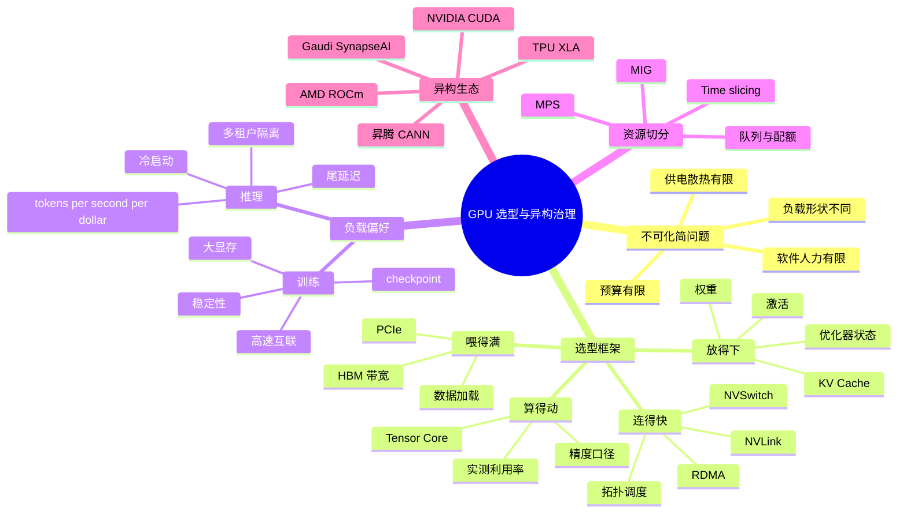

# 第4d章：GPU 选型、虚拟化与异构加速器

> **关联章节**：本章是 [第4章](./04-gpu-and-accelerators.md) 的独立拆分篇，重点从"GPU 为什么快"转向"平台团队应该如何选、如何分池、如何切分、如何治理异构"。读本章时要同时参考 [第5章](./05-memory-interconnect-io.md) 的 HBM / PCIe / NVLink / RDMA 链路，以及 [第15章](../part5-serving-infra/15-batching-scheduling-and-kv-cache.md) 的推理 KV Cache 预算。

## 1. 第一性原理拆解 + 学习大纲

### 拆 — 不可化简的问题

把 H100、H200、B200、MI300X、TPU、MIG、MPS 这些名字先拿掉，GPU 选型真正面对的不可化简问题是：**一个 AI 平台要在有限预算、有限供电、有限机柜、有限软件人力下，把不同形状的计算任务放到最合适的加速器上，并让每个任务获得可预测的吞吐、延迟和隔离性**。

这句话里有三层约束。第一层是物理约束：每张卡的 Tensor Core 算力、HBM 容量、HBM 带宽、GPU-GPU 互联、PCIe 带宽、功耗和散热都有限。第二层是负载约束：训练要长期稳定地跑大 batch、同步梯度、保存 checkpoint；推理要在并发、长上下文、冷启动和尾延迟之间取平衡。第三层是组织约束：平台不能只服务一个模型，也不能让所有用户都抢同一种最贵的卡；资源池一旦异构，调度、镜像、驱动、监控、配额、SLO 和故障处理都会变复杂。

所以，GPU 选型不是"哪张卡最快"，而是把一个 workload 放进四个问题里：算得动吗，放得下吗，喂得满吗，连得快吗。再往外一层，还要问：这张卡能不能被稳定运维，能不能被调度系统准确表达，能不能被现有框架和推理引擎吃到，能不能在成本模型里跑赢替代方案。

### 推 — 从这个问题如何推导出每个机制

从"任务形状不同"出发，训练和推理必然需要不同偏好。训练更怕显存不够、互联不够和长时间不稳定，因为一次 7 天训练中断后，损失的不只是一次请求，而是大量 GPU 小时、checkpoint 恢复时间和实验窗口。推理更怕单位 token 成本、冷启动、KV Cache 爆显存和尾延迟，因为线上服务的价值来自持续服务大量请求，而不是单个 batch 的峰值 FLOPS。于是同一张 H100，放在训练队列和推理队列里的价值会不同；同一张 L40S，对小模型推理可能很划算，对大模型训练可能完全不合适。

从"参数表不能直接等于性能"出发，datasheet 口径必须被统一。FP16 dense、FP16 sparse、BF16、FP8、FP4、per-GPU、8-GPU system-level、单向带宽、双向聚合带宽、TDP、实际墙上功耗，这些数字混在一起时很容易制造错误结论。工程选型要先固定口径，再用 microbenchmark、真实模型 benchmark 和线上回放把理论值折算成有效吞吐。

从"平台不能只有一种负载"出发，异构 GPU 池和 GPU 虚拟化必然出现。异构池通过不同卡型服务不同任务：训练池放 H100/H200/B200，推理池放 L40S/A100/量化友好的卡，开发池放便宜或旧卡。虚拟化则在一张昂贵 GPU 内部做切分：MIG 提供硬件级隔离，MPS 提供同租户多进程并发，time-slicing 提供最弱但最灵活的时间共享。它们解决的是"资源颗粒度"问题，但不会凭空创造算力和带宽。

最后，非 NVIDIA 加速器会把硬件成本问题转化成生态成本问题。AMD、TPU、Gaudi、昇腾、Trainium / Inferentia 都可能在某些场景有性价比，但平台团队必须把编译器、kernel、框架、推理引擎、驱动、监控、调度、故障定位和招聘成本算进去。便宜的硬件如果让模型上线慢三个月，或者让每次模型升级都要重写 kernel，TCO 未必更低。

### 概念先说清楚

GPU 选型不是给硬件排“绝对性能榜”，而是把 workload 的计算形状、状态规模、数据路径、互联需求和服务目标映射到加速器能力。TFLOPS 描述理论计算上限，HBM 容量描述能放多少状态，HBM 带宽描述每秒能搬多少字节，NVLink/NVSwitch/RDMA 描述多卡通信边界，功耗和散热描述设施成本。任何一个维度缺失，都可能让“最快的卡”在实际任务里不划算。

虚拟化和资源切分解决的是 GPU 颗粒度与租户隔离问题，不是凭空创造算力。MIG 把支持它的 GPU 切成硬件隔离实例，显存、SM、L2 slice 等资源有较强边界，适合需要硬隔离的小推理或开发负载；MPS 让同一 GPU 上多个进程共享执行资源，适合同租户或可信负载提高并发；time-slicing 按时间片复用 GPU，灵活但隔离和性能可预测性最弱。三者都受 HBM、带宽、copy engine、PCIe 和故障域限制。

异构加速器指平台同时引入不同 GPU 代际、不同厂商或不同专用芯片。它的收益来自把不同任务放到性价比更高的硬件上；成本来自软件栈分裂。CUDA、ROCm、XLA、SynapseAI、CANN、Neuron 等生态在 kernel、编译器、调试工具、推理引擎、监控和故障语义上都不同。平台要治理的是“硬件池 + 软件镜像 + 调度标签 + 性能基线 + 用户契约”的组合，而不是只在采购表里增加一个 SKU。

### 绘 — 因果链路



### 导 — 读完本章你应该能回答

1. 为什么 GPU 采购不能只看 TFLOPS 或 MLPerf 排名？
2. 如何用"算得动、放得下、喂得满、连得快"分析训练、推理和开发任务？
3. 训练硬件偏好和推理硬件偏好为什么不同，哪些差异来自显存，哪些来自互联，哪些来自服务 SLO？
4. 读 datasheet 时如何统一 dense / sparse、FP16 / BF16 / FP8 / FP4、per-GPU / system-level、单向 / 双向带宽口径？
5. A100、H100、H200、B200、L40S 这类主流 GPU 的平台定位有什么差异？
6. 异构 GPU 池会给调度、镜像、监控、成本核算和用户体验带来哪些复杂度？
7. MIG、MPS、time-slicing 分别解决什么问题，边界在哪里？
8. 非 NVIDIA 加速器什么时候值得引入，什么时候硬件折扣会被软件生态成本吃掉？

### 本章拥有 / 不拥有

本章拥有的是**GPU selection 与资源治理证据链**：把 workload 卡片、datasheet caveats、BenchmarkProtocol、MIG/MPS/time-slicing、异构池标签、成本账本和 retest 门禁连起来。本章不拥有单 kernel profile、HBM 公式和 NVLink/NCCL 拓扑的全部细节；选型报告必须引用 04a 的执行证据、04b 的 CapacityLedger、04c 的 topology EvidenceBundle 后，才能给出采购或资源池承诺。

### 04d BenchmarkProtocol：选型不是参数表排序

GPU selection 的最小 BenchmarkProtocol 要覆盖理论口径、微基准、真实负载和运营约束：

| 层级 | 必测内容 | 工具 / 证据 | 通过 threshold |
|------|----------|-------------|----------------|
| Datasheet 统一 | dtype、dense/sparse、per-GPU/system、PCIe/SXM、NVLink 单向/双向、TDP/power cap | 选型表中显式写出口径 | 不能统一口径的数字不得进入排序 |
| 执行基准 | GEMM、attention、fused norm/optimizer、目标 dtype | `nsys`、`ncu`、`torch.profiler`、厂商 profiler | 与同 SKU 健康基线偏差不超过 10%-15% |
| 容量基准 | 权重、KV Cache、activation、optimizer、workspace、fragmentation | CapacityLedger、memory snapshot、DCGM | 峰值低于承诺 threshold，并留 headroom |
| 拓扑基准 | NCCL/RCCL/HCCL、GPU-NIC rail、NVLink/NVSwitch、PCIe | topology dump、`nccl-tests`、DCGM | collective 达到同拓扑基线，链路健康 |
| 推理回放 | TTFT、TPOT、P50/P95/P99、goodput、质量分桶 | vLLM/SGLang/TRT-LLM benchmark、真实流量回放 | 质量不低于门禁，P99 满足 SLO |
| 训练 smoke | 100-1000 step、loss、checkpoint、恢复、长时间稳定性 | 训练日志、DCGM、NCCL log | 无 Xid/ECC/NCCL timeout，loss 曲线正常 |
| 虚拟化隔离 | MIG profile、MPS worker 数、time-slicing 组合 | slice 压测、尾延迟、显存隔离、故障演练 | 租户间干扰低于 SLO threshold |
| 运营成本 | power、冷却、镜像矩阵、驱动升级、备件、工程人力 | internal chargeback / TCO ledger | tokens/sec/$ 或训练到同等 loss 的总成本优于替代池 |

命令与证据模板：

```bash
# 执行与容量基线
nsys profile -t cuda,nvtx,osrt,cudnn,cublas -o selection_trace python run_target_model.py
ncu --set full --target-processes all -o selection_kernel python run_target_model.py
dcgmi dmon -e 100,101,150,155,156,203,204

# 拓扑与通信基线
nvidia-smi topo -m
NCCL_DEBUG=INFO NCCL_TOPO_DUMP_FILE=topo.xml python distributed_run.py
./build/all_reduce_perf -b 8M -e 4G -f 2 -g 8

# MIG 状态和 profile 验证
nvidia-smi mig -lgip
nvidia-smi mig -lcip
```

Retest criteria：

- GPU SKU、系统形态、power cap、driver、CUDA/ROCm/CANN/Neuron、推理引擎、MIG profile、MPS 配置、NCCL/RCCL/HCCL 版本或模型 dtype 改变后，选型结论必须重新跑 BenchmarkProtocol。
- 选型通过必须同时满足性能 threshold、质量 threshold、容量 threshold、拓扑健康 threshold 和运营 threshold；只满足 tokens/s 或 TFLOPS 不算通过。
- 异构加速器试点必须有退出条件：关键 kernel 缺失、质量门禁失败、调试成本超过预算、模型升级需要等待厂商支持、或迁回 CUDA 成本不可接受时停止扩池。
- MIG/MPS 的 retest 必须覆盖尾延迟和邻居干扰；整卡基准不能外推到 slice。

## 正文内容

### 4d.1 GPU 选型框架：先问四个问题

平台选型最怕从 SKU 开始讨论。更稳的方式是先写 workload 卡片，再映射硬件。

| 问题 | 要看的输入 | 对应硬件维度 | 常见错误 |
|------|------------|--------------|----------|
| 算得动吗 | 模型结构、batch、序列长度、目标吞吐、精度 | Tensor Core 算力、支持精度、kernel 生态 | 只看峰值 TFLOPS，不看实际算子能否吃到 Tensor Core |
| 放得下吗 | 参数量、训练状态、激活、KV Cache、并发、上下文长度 | HBM 容量、显存碎片、运行时 buffer | 只算权重，不给 KV Cache、optimizer、activation 留空间 |
| 喂得满吗 | 数据加载、tokenizer、H2D、kernel 访存、decode 阶段 | HBM 带宽、PCIe、CPU、NVMe、网络存储 | 以为 GPU utilization 低一定是 GPU 不够强 |
| 连得快吗 | 并行策略、GPU 数、跨节点比例、通信频率 | NVLink、NVSwitch、PCIe、NIC、RDMA fabric | 把 PCIe 8 卡服务器当作 HGX 8 卡节点使用 |

这四个问题的顺序也很重要。一个模型如果放不下，算力再高也没用；一个 decode-heavy 的推理服务如果被 HBM 带宽限制，换更高 TFLOPS 的卡不一定明显变快；一个 tensor parallel 作业如果跨节点跑，IB/RoCE 可能立刻变成瓶颈。

#### 4d.1.1 Workload 卡片模板

做采购或资源池规划前，建议每类任务至少写出下面的信息：

| 字段 | 示例 | 为什么重要 |
|------|------|------------|
| 任务类型 | 预训练 / SFT / LoRA / embedding / reranker / LLM serving | 不同任务瓶颈完全不同 |
| 模型规模 | 7B / 70B / 405B / MoE | 决定权重、训练状态和切分方式 |
| 精度 | BF16 / FP8 / INT8 / INT4 | 决定显存、吞吐和软件路径 |
| 序列长度 | 4K / 32K / 128K | 推理 KV Cache 和 attention 成本的核心变量 |
| 并发与 SLO | QPS、TTFT、TPOT、P99 | 推理选型不能只看离线吞吐 |
| 并行策略 | DP / TP / PP / EP / FSDP / ZeRO | 决定互联需求 |
| 生命周期 | 临时实验 / 线上长期服务 / 关键训练 | 决定隔离、稳定性和抢占策略 |
| 依赖栈 | PyTorch、Triton、vLLM、TensorRT-LLM、DeepSpeed | 决定是否能迁到非 NVIDIA 或低端卡 |

如果一类任务连这张卡片都写不清，就不应该直接进入"买哪张 GPU"的讨论。

### 4d.2 训练 vs 推理：硬件偏好不是一回事

训练和推理使用相同的模型权重，但它们消耗硬件的方式不同。

#### 4d.2.1 训练更像长期吞吐系统

训练关注的是长时间 step time 和扩展效率。一个训练 step 可能包含：

```text
读取样本 -> CPU 预处理 -> H2D -> forward -> backward
       -> gradient reduce-scatter/all-reduce -> optimizer step -> checkpoint
```

训练硬件优先级通常是：

1. **显存容量**：权重、梯度、优化器状态、激活和碎片会把需求放大到参数量的多倍。
2. **GPU-GPU 互联**：FSDP、ZeRO、TP、PP、EP 都会产生通信；大模型训练里互联直接决定扩展效率。
3. **稳定功耗与散热**：训练作业连续运行数天到数周，降频、Xid、ECC、链路降级都会变成昂贵中断。
4. **集群网络**：单机 NVLink 不够，跨节点还要看 NIC、RDMA、交换机和 job placement。
5. **框架成熟度**：训练最怕长作业中途踩到驱动、编译器或 collective 的边缘 bug。

#### 4d.2.2 推理更像带状态的在线服务

推理关注的是单位成本吞吐、首 token 延迟、每 token 延迟和尾延迟。LLM serving 还要把 prefill 和 decode 分开看：

| 阶段 | 主要工作 | 更可能瓶颈 | 硬件偏好 |
|------|----------|------------|----------|
| Prefill | 处理 prompt，构建 KV Cache | 计算与 HBM 混合，长 prompt 更重 | Tensor Core、较大 batch、attention kernel |
| Decode | 每次生成 1 个 token，反复读权重和 KV | HBM 带宽、KV Cache、调度 | HBM 带宽、显存容量、低延迟调度 |
| 多请求服务 | 连续 batching、抢占、KV eviction | 显存碎片、调度、尾延迟 | 大显存、稳定性能、推理引擎支持 |

推理硬件优先级通常是：

1. **tokens/sec/$**：线上服务的核心不是单卡最快，而是单位成本产出。
2. **HBM 容量与带宽**：大模型权重和 KV Cache 常比 TFLOPS 更先成为限制。
3. **冷启动与权重加载**：模型副本扩缩容时，PCIe、NVMe、对象存储和加载路径会影响恢复时间。
4. **多租户隔离**：小模型、高并发和开发任务常需要 MIG、MPS 或 time-slicing。
5. **推理引擎适配**：vLLM、SGLang、TensorRT-LLM、Triton kernel 的支持情况会决定真实吞吐。

#### 4d.2.3 一张对比表

| 维度 | 训练优先 | 推理优先 |
|------|----------|----------|
| 核心指标 | tokens/sec/GPU、step time、扩展效率 | tokens/sec/$、TTFT、TPOT、P99 |
| 显存组成 | 权重 + 梯度 + 优化器状态 + 激活 | 权重 + KV Cache + runtime buffer |
| 精度路径 | BF16 为主，FP8 逐步进入训练 | FP8 / INT8 / INT4 更常见 |
| 互联需求 | 高，尤其 TP / FSDP / ZeRO / EP | 中等，通常只在单请求多卡切分时关键 |
| 故障成本 | 很高，失败可能损失数千 GPU 小时 | 单副本失败可迁移，但 P99 会受影响 |
| 资源颗粒度 | 倾向完整节点、完整 NVSwitch 域 | 倾向单卡、半卡、MIG slice、弹性副本 |
| 常见节点 | 8 卡 SXM / HGX / NVL domain | 单卡 PCIe、2/4 卡、部分大模型用 SXM |

### 4d.3 Datasheet 口径：先统一单位，再比较产品

GPU datasheet 是选型输入，不是选型结论。最危险的做法是把不同页面里的最大数字拿出来排序。

#### 4d.3.1 常见口径陷阱

| 陷阱 | 表面说法 | 工程读法 |
|------|----------|----------|
| Dense vs sparse | "FP16 Tensor Core 1978 TFLOPS" | 可能是 2:4 sparse 峰值；dense 通常只有一半 |
| BF16 vs FP8 vs FP4 | "AI performance 20 PFLOPS" | 先确认精度；FP4 推理峰值不能当 BF16 训练吞吐 |
| Per-GPU vs system-level | "72 PFLOPS FP8" | 可能是 8 卡整机总和，单卡要除以 GPU 数 |
| PCIe vs SXM | 同名 GPU 不同形态 | SXM 通常有更高功耗墙和 NVLink；PCIe 更通用但互联弱 |
| 单向 vs 双向带宽 | "900 GB/s NVLink" | 常是 per-GPU 双向聚合，不是任意两卡单向带宽 |
| HBM 容量 vs 可用显存 | "80 GB" | 框架、driver、fragmentation、通信 buffer 都会吃掉一部分 |
| TDP vs 实际功耗 | "700W" | 还要看 power cap、散热、机柜供电和长期降频 |
| 标称峰值 vs 可达吞吐 | "1 PFLOPS" | 真实模型可能只达到 20%-70%，取决于 kernel 和 shape |

#### 4d.3.2 建议的读表流程

1. **固定负载精度**：训练一般先看 BF16 dense；Hopper / Blackwell 推理再看 FP8 / FP4 是否被模型和引擎支持。
2. **固定产品形态**：PCIe、SXM、HGX、DGX、NVL72 不是同一种系统边界。
3. **分清单卡与系统**：单卡参数用于单副本估算，系统参数用于完整节点或 rack-level 调度。
4. **把显存和带宽分开看**：H200 相对 H100 的核心价值更多来自 HBM3e 容量和带宽，而不是 BF16 算力翻倍。
5. **用真实 benchmark 折算**：至少跑 GEMM、HBM bandwidth、NCCL、目标模型 prefill/decode 或训练 100-1000 step。
6. **写入口径说明**：所有选型表都必须标明 dense/sparse、精度、per-GPU/system、PCIe/SXM。

一个实用规则：**供应商给的最大数字用于建立上限，平台自己的回放测试用于做预算**。

### 4d.4 主流 GPU 横向对比

下表用公开资料的常见数量级建立工程直觉，重点是定位差异，不是替代正式 datasheet。采购前应回到具体服务器形态、power cap、驱动版本和供应商配置。

**数字口径标签**：`vendor-public`，规格核对日期 `2026-05-05`；显存和 HBM 带宽按单 GPU 或该行明确的产品形态摘录，不是实测吞吐；workload shape = `N/A`。来源口径：NVIDIA A100 datasheet（Jun21）、NVIDIA H100/H200 产品规格页、NVIDIA DGX/HGX B200 产品规格页；L40S 用 NVIDIA 产品规格中的 48 GB GDDR6 形态做类别对比，不把 GDDR6 带宽换算成 HBM 等价能力。

| 设备 | 典型显存 | HBM / 显存带宽数量级 | 互联形态 | 数字口径 | 更适合 | 主要边界 |
|------|----------|----------------------|----------|----------|--------|----------|
| A100 40GB PCIe | 40 GB | ~1.5 TB/s | PCIe，少量场景有桥接 | vendor-public，A100 datasheet，per-GPU，shape=N/A | 成熟推理、开发、成本敏感微调 | 显存偏小，TP 和大模型推理受限 |
| A100 80GB SXM | 80 GB | ~2 TB/s | NVLink / NVSwitch 节点 | vendor-public，A100 datasheet，per-GPU，shape=N/A | 稳定训练、传统大模型推理 | 算力和带宽落后 Hopper / Blackwell |
| L40S | 48 GB GDDR6 | 低于 HBM 数据中心训练卡 | PCIe | vendor-public，产品形态标签，非 HBM，shape=N/A | 视觉推理、小模型服务、embedding、开发 | 无 HBM，训练大模型和长上下文 LLM 不占优 |
| H100 PCIe | 80 GB | ~2 TB/s 级 | PCIe | vendor-public，H100 产品规格，per-GPU，shape=N/A | 单卡推理、成本较受控的 Hopper 资源 | 互联弱于 SXM，8 卡 TP 不应按 HGX 假设 |
| H100 SXM | 80 GB | ~3.35 TB/s | NVLink / NVSwitch | vendor-public，H100 产品规格，per-GPU，shape=N/A | 主流大模型训练、高性能推理 | 显存对长上下文和 70B+ 推理仍紧张 |
| H200 SXM | 141 GB | ~4.8 TB/s | NVLink / NVSwitch | vendor-public，H200 产品规格，per-GPU，shape=N/A | 长上下文推理、显存敏感训练、decode-heavy 服务 | BF16 算力与 H100 同级，收益主要来自 HBM |
| B200 / GB200 | B200 180 GB 级；DGX B200 8 GPU 合计 1,440 GB | B200 约 8 TB/s 级；DGX B200 合计 64 TB/s | 更高带宽 NVLink，GB200 可进入 rack-level NVLink domain | vendor-public，DGX/HGX B200 规格，per-GPU 或 system 需分清，shape=N/A | 新一代训练、超大模型推理、MoE | 功耗、液冷、供应、软件版本和调度边界更复杂 |

#### 4d.4.1 不能只横向比单卡

同一张 GPU 放在不同系统里，工程意义完全不同：

| 系统形态 | 资源边界 | 适合场景 | 典型风险 |
|----------|----------|----------|----------|
| 单卡 PCIe 服务器 | 单 GPU + CPU + PCIe | 小模型推理、开发、批处理 | H2D、CPU、权重加载路径容易被忽略 |
| 4/8 卡 PCIe 服务器 | 多 GPU 但 GPU-GPU 路径不均匀 | 多副本推理、轻量并行 | 错把 PCIe 拓扑当作 NVSwitch |
| 8 卡 HGX SXM | 节点内 NVSwitch scale-up island | TP、FSDP、节点内高频通信 | 故障域和调度粒度更大 |
| Rack-level NVLink domain | 一个机柜内大 scale-up 域 | 万亿参数推理、MoE、大 TP / EP | 液冷、供电、分区、fabric manager、故障隔离 |

选型时要明确"买的是卡，还是买一个系统形态"。很多性能差异不是 GPU die 本身造成的，而是 PCIe/SXM、NVSwitch、NIC、CPU、内存和散热共同决定的。

### 4d.5 工程案例一：70B 在线推理该选 H100、H200 还是 B200

假设目标是部署一个 70B LLM：

- 权重：BF16 约 140 GB；INT4 约 35-45 GB，加上 scale、metadata 和 runtime buffer 后更高。
- 上下文：32K 到 128K。
- 服务指标：TTFT < 1s，TPOT < 50ms，P99 受控。
- 引擎：vLLM / SGLang / TensorRT-LLM。

按四个问题分析：

| 问题 | H100 80GB | H200 141GB | B200 / GB200 |
|------|-----------|------------|--------------|
| 算得动吗 | Prefill 强，decode 常看带宽 | Prefill 与 H100 同级，decode 带宽更好 | Prefill / decode 都更强，低精度路径潜力大 |
| 放得下吗 | BF16 单卡放不下，2 卡也要小心 KV Cache | 2 卡空间更宽，部分量化场景单卡可行 | 单卡或少卡承载能力更强 |
| 喂得满吗 | Decode 易受 HBM 限制 | HBM 容量和带宽更适合长上下文 | HBM 带宽更强，但也要看引擎是否用上 |
| 连得快吗 | SXM 节点内 TP 可行，跨节点不优 | 同 H100 SXM，显存压力更小 | NVLink 更强，GB200 适合更大切分域 |
| 成本判断 | 资源成熟，供给较多 | 对长上下文和高并发更划算 | 最强但设施和采购门槛高 |

工程结论不是"H200 一定比 H100 好"，而是：

- 如果 70B 只做 INT4、小上下文、低并发，H100 甚至 A100 也可能够用。
- 如果是 BF16 / FP8、高并发、长上下文，H200 的 HBM 容量和带宽会显著降低压力。
- 如果是多模型、多租户、超长上下文或 MoE 服务，B200 / GB200 的价值来自更大的显存、更高带宽和更大的 NVLink 域，但前提是推理引擎和平台调度能跟上。

上线前最少做三类测试：离线 prefill/decode 曲线、线上流量回放 P99、长时间权重加载和重启测试。只跑一个固定 batch 的 tokens/sec 没法代表线上体验。

### 4d.6 异构 GPU 池：省钱以后，复杂度在哪里出现

异构池的目标不是炫耀卡型多，而是让每类任务用合适成本的资源。典型分池可以这样设计：

| 资源池 | 卡型示例 | 主要任务 | 调度策略 |
|--------|----------|----------|----------|
| `train-premium` | H100/H200/B200 SXM | 预训练、大规模 SFT、TP/FSDP | 完整节点优先，拓扑感知，低抢占 |
| `infer-large` | H200/H100/B200 | 70B+、长上下文、高并发 | 按模型副本和 KV Cache 预算调度 |
| `infer-economy` | L40S/A100/旧卡 | 7B/13B、embedding、reranker、批量推理 | 高副本密度，允许更高抢占 |
| `dev` | 旧卡、低成本 PCIe 卡、MIG slice | notebook、单元测试、debug | time limit、强抢占、配额小 |
| `special` | MI300X/TPU/Gaudi/昇腾 | 特定团队或特定模型 | 白名单、专用镜像、专门 benchmark |

#### 4d.6.1 异构池带来的平台成本

| 成本项 | 具体表现 | 治理方式 |
|--------|----------|----------|
| 调度标签 | 卡型、显存、互联、MIG profile、驱动版本都要表达 | node label、device plugin、拓扑感知调度 |
| 镜像矩阵 | CUDA、ROCm、CANN、TensorRT、driver ABI 组合爆炸 | 基础镜像分层，版本白名单 |
| 用户体验 | 用户不知道任务该投哪个队列 | workload 模板、自动推荐、失败提示 |
| benchmark 维护 | 每种卡都要有 baseline | 定期跑 GEMM、NCCL、推理回放、训练 smoke test |
| 成本核算 | 同一 GPU 小时价值不同 | 按卡型、利用率、功耗、折旧建立 internal pricing |
| 故障排查 | 不同厂商工具链不同 | 标准化 telemetry schema，保留厂商原始指标 |

异构池一旦规模化，最重要的抽象不是"GPU 数量"，而是"能力标签"。调度系统至少应该知道：

```text
gpu.vendor = nvidia / amd / huawei / custom-asic
gpu.model = H100-SXM-80GB
gpu.memory_gb = 80
gpu.interconnect = nvswitch / nvlink / pcie
gpu.mig = supported / enabled / disabled
gpu.precision = bf16,fp8,int8,int4
node.nic = 400g-ib / 800g-ib / roce
node.pool = train-premium / infer-large / dev
```

没有这些标签，异构资源最终会退化成靠用户经验和人工排队管理。

### 4d.7 MIG、MPS 与 Time-slicing：切分的是资源，不是魔法

GPU 虚拟化解决的是资源颗粒度和隔离问题。它适合把一张大卡服务给多个小任务，但不会让一张卡变成多张完整卡。

| 方式 | 隔离强度 | 资源表达 | 适合场景 | 不适合场景 |
|------|----------|----------|----------|------------|
| MIG | 硬件级隔离，显存和计算实例切分 | 固定 profile，如 1g、2g、3g、7g | 多租户推理、小模型、教学和开发 | 单任务需要整卡性能、跨 slice 通信 |
| MPS | 软件级并发，共享同一 GPU | 多进程共享 SM 和显存 | 同一租户的多 worker、小 kernel 并发 | 强隔离、多租户安全、显存硬限制 |
| Time-slicing | 时间片共享，隔离最弱 | 调度器按时间轮转 | notebook、CI、低优先级开发 | 线上服务、延迟敏感任务 |
| vGPU / SR-IOV 类方案 | 虚拟机级 GPU 暴露 | 取决于厂商和产品 | VDI、虚拟化环境、企业隔离 | 高性能训练通常不优先 |

#### 4d.7.1 MIG 的第一性原理

MIG 把一张支持该能力的 NVIDIA GPU 切成多个 GPU instance / compute instance。每个 slice 有独立的显存地址空间、部分 SM、部分 L2 cache 和部分内存带宽。它的价值是隔离和可预测性，而不是提升总吞吐。

典型使用方式：

- 一张 A100/H100 切成多个小 slice，给 7B 以下模型推理。
- 开发平台给每个用户一个小 slice，避免 notebook 独占整卡。
- 多租户场景降低显存越界、kernel 干扰和故障影响范围。

典型边界：

- 一个 MIG slice 的显存、SM、带宽都被切小，不能指望跑出整卡性能。
- MIG profile 是离散的，资源碎片会出现。例如剩余 slice 不一定刚好满足下一个任务。
- 某些 GPU 特性、profiling 工具、P2P 通信、MPS 组合方式会受限制，必须以驱动和 GPU Operator 支持矩阵为准。
- 对大模型 TP 来说，多个 MIG slice 不是多个完整 GPU；跨 slice 通信和带宽都不是目标设计场景。

#### 4d.7.2 MPS 与 time-slicing 的正确位置

MPS 更像"让同一 GPU 上的多个 CUDA 进程更好地并发"。它适合一个团队内部把多个小进程合并使用一张卡，降低 context switching 和小 kernel 空洞。它不提供强显存隔离，也不适合彼此不信任的租户。

Time-slicing 更像"排队轮流用"。它的优势是简单、兼容性好，尤其适合开发环境和低优先级任务。但线上推理使用 time-slicing 很容易让 P99 抖动，因为请求可能刚好等到别人的时间片结束。

一个实用判断：

| 场景 | 建议 |
|------|------|
| 多个独立团队共享小模型推理 | 优先 MIG |
| 同一推理服务内部多个 worker 吃不满 GPU | 考虑 MPS 或引擎内 continuous batching |
| Notebook、CI、课程实验 | time-slicing 可以接受 |
| 大模型训练 / TP 推理 | 尽量使用整卡或完整 NVSwitch 域 |

### 4d.8 非 NVIDIA 加速器：硬件折扣之外，还要算生态成本

NVIDIA 的优势不只是 GPU 本身，而是 CUDA、cuDNN、NCCL、TensorRT、Triton kernel、DCGM、GPU Operator、Nsight、社区 benchmark 和大量开源项目默认路径。非 NVIDIA 加速器要进入生产平台，必须回答"软件栈能不能稳定承载目标模型"。

**数字口径标签**：`vendor-public + ecosystem-checkpoint`，核对日期 `2026-05-05`，shape=`N/A`；表内 HBM、带宽、端口和 pod 规模来自各厂商公开规格或云产品资料，生态成熟度是工程评估入口，不是稳定事实。所有“性价比”“已部署”“成熟”类判断上线前必须用目标模型、目标 runtime 和目标云/机房环境重测。

| 平台 | 典型优势 | 主要生态成本 | 更适合的进入方式 |
|------|----------|--------------|------------------|
| **AMD MI300X**（**192 GB HBM3** 业界单卡最大 / **5.3 TB/s** / 153 TFLOPS BF16 dense） | 单卡装 Llama-405B BF16；ROCm 6.x + vLLM/SGLang/TRT-LLM 替代支持已成熟；Llama-405B 单节点已在 OCI/Azure ND MI300X v5 规模化部署 | ROCm 版本兼容（驱动升级风险）、部分 CUDA kernel 迁移仍有空白、FlashAttention 在 MI300X 有专门实现但性能曲线和 H100 不同 | 超长上下文推理或显存敏感训练试点 |
| **AMD MI325X / MI350**（MI325X **256 GB HBM3e**；MI350 即将量产） | HBM 容量进一步放大，对 200B+ 模型推理价值明显 | 同 MI300X，新代际 ROCm 适配窗口短 | Long-Context Inference 试点 |
| **Google TPU v5e**（推理优化，16 GB HBM / 256 chip pod） | per-chip 价格远低于 v5p；JAX 推理生态成熟；GCP 上中等推理性价比好 | XLA 调试模型不同、JAX/PyTorch XLA 与原生 PyTorch 路径不一致 | GCP 上中等规模推理/微调 |
| **Google TPU v5p**（训练优化，95 GB HBM / 8960 chip pod / 3D Torus） | 超大 Pod 训练 trillion-parameter 模型；Gemini 训练硬件 | 仅 GCP 可用、JAX/XLA 学习曲线 | GCP 上超大规模训练 |
| **Google TPU v6e (Trillium)**（32 GB HBM / 256 chip pod） | v5e 后继，FP8 + per-chip 算力翻倍 | 同 v5e | GCP 推理 + 中等微调 |
| **Intel Gaudi 3**（128 GB HBM2e / 1.835 TB/s / **24 × 200Gbps RoCE 端口 = 3.6 Tbps 双向**） | 集成 RoCE 网卡设计天然适合 scale-out；价格显著低于 H100；Intel Developer Cloud 已规模化 serving | SynapseAI / OneAPI 仍较新、PyTorch HPU plugin 算子覆盖不全 | 标准 LLM 训练/推理试点，对 NVLink-style scale-up 不强需求场景 |
| 华为昇腾 910B / 910C | 本土供应链、政企和区域化合规场景；MindSpore 生态 | CANN / MindSpore / PyTorch Ascend plugin 适配、算子覆盖、迁移工程 | 有合规或供应链约束的平台 |
| **AWS Trainium 2 / Inferentia 2**（Trn2 单节点 16 chip NeuronLink；Inf2 推理优化） | AWS 内部 TCO、托管生态、与 SageMaker / Bedrock 深度集成 | Neuron SDK 学习曲线、云绑定、迁出成本 | 深度使用 AWS 的训练或推理服务 |

#### 4d.8.1 评估非 NVIDIA 的问题清单

供应商说"性价比高 50%"时，平台团队应该追问：

1. 这个 50% 是按采购价、租赁价、tokens/sec/$、还是训练到同等 loss 的总成本算的？
2. 目标模型的完整训练和推理路径是否已经跑通，包括 tokenizer、dataset、checkpoint、LoRA、量化、serving？
3. FlashAttention、PagedAttention、MoE dispatch、RMSNorm、RoPE、GEMM、NCCL 等关键路径是否有等价优化？
4. PyTorch、Triton、DeepSpeed、FSDP、vLLM、SGLang、TensorRT-LLM 替代路径分别是什么？
5. 驱动升级、firmware、监控、故障定位、Kubernetes device plugin、资源隔离如何做？
6. 现有工程师是否会调试这个栈，招聘市场是否有足够人选？
7. 模型每次升级后，是否要重新适配 kernel 或等待厂商支持？
8. 如果供应商交付不达标，迁回 CUDA 的成本是多少？

非 NVIDIA 路径不是不能选，而是要用试点和退出机制降低风险。一个合理策略是：先选一个边界清楚、收益明显、依赖较少的 workload，跑出端到端基线，再决定是否扩池。

### 4d.9 工程案例二：200 卡混合训推平台规划

假设团队要建设约 200 卡平台，服务三类负载：

- 20%：70B 级 SFT 和持续预训练。
- 50%：7B-70B 在线推理。
- 20%：embedding、reranker、批量离线推理。
- 10%：研发 notebook、CI、debug。

一个务实的资源规划可以是：

| 池 | 数量示例 | 节点形态 | 任务 |
|----|----------|----------|------|
| 训练高性能池 | 64-96 张 H100/H200 SXM | 8 卡 HGX，IB/RoCE | 70B SFT、FSDP、TP、PP |
| 大模型推理池 | 48-64 张 H200/H100/B200 | 2/4/8 卡，优先大显存 | 70B 长上下文、高并发服务 |
| 经济推理池 | 32-48 张 L40S/A100/旧卡 | PCIe 单卡或多卡 | 7B/13B、embedding、reranker |
| 开发池 | 8-16 张旧卡或 MIG slice | time-slicing/MIG | notebook、测试、调试 |
| 试点池 | 8-16 张 MI300X/TPU/Gaudi/昇腾 | 专用队列 | 非 NVIDIA 评估 |

这个规划的关键不是具体数字，而是三条原则：

1. **训练和关键大模型推理不要完全混在一起**：训练会长时间占用完整节点，推理需要弹性副本和 P99 稳定。
2. **开发池要便宜且可抢占**：不要让 notebook 占用 H200 整卡一整天。
3. **非 NVIDIA 先小池试点**：没有端到端 benchmark 前，不要把关键路径一次性迁过去。

上线前需要的 benchmark：

| Benchmark | 目的 | 最低要求 |
|-----------|------|----------|
| GEMM / attention microbench | 验证算力和 kernel 路径 | 覆盖目标 dtype、shape、batch |
| HBM bandwidth | 验证 memory-bound 上限 | 对比同代公开基线 |
| NCCL / RCCL / HCCL collective | 验证多卡和跨节点通信 | all-reduce、reduce-scatter、all-gather |
| 训练 smoke test | 验证 100-1000 step 稳定性 | step time、loss、显存、通信曲线 |
| 推理流量回放 | 验证 TTFT、TPOT、P50/P95/P99 | 覆盖真实 prompt 长度和并发 |
| 故障演练 | 验证 drain、重启、checkpoint 恢复 | Xid、节点下线、权重重载 |

### 4d.10 工程建议

- 先写 workload 卡片，再看 GPU SKU。
- 训练池优先保证显存、NVLink/NVSwitch、RDMA 和长时间稳定性。
- 推理池优先看 tokens/sec/$、KV Cache 容量、HBM 带宽和 P99。
- datasheet 必须统一 dense/sparse、dtype、per-GPU/system、PCIe/SXM 口径。
- H200 相对 H100 的价值更多来自 HBM 容量和带宽，不要只盯 BF16 TFLOPS。
- B200 / GB200 的价值需要和供电、液冷、软件版本、rack-level 调度一起评估。
- 异构池必须有清晰标签、镜像矩阵、benchmark baseline 和 internal pricing。
- MIG 适合小任务隔离，不适合把一个大任务拆快。
- MPS 适合同租户并发，time-slicing 更适合开发环境。
- 非 NVIDIA 加速器必须先跑端到端试点，把迁移、调试和运维人力写进 TCO。

#### 本章涉及的常见工具

| 目标 | 工具 / 命令 | 用法 |
|------|-------------|------|
| 查看 NVIDIA 卡状态 | `nvidia-smi` | 型号、显存、功耗、进程 |
| 查看拓扑 | `nvidia-smi topo -m` | GPU-GPU、GPU-NIC、NUMA 距离 |
| MIG 管理 | `nvidia-smi mig`、NVIDIA GPU Operator | profile 创建、Kubernetes 暴露 |
| 监控 | DCGM Exporter、Prometheus | 温度、功耗、ECC、Xid、利用率 |
| 通信测试 | `nccl-tests`、`rccl-tests`、HCCL 工具 | all-reduce、all-gather、带宽和延迟 |
| Kernel 分析 | Nsight Systems、Nsight Compute、`rocprof` | 判断 compute-bound / memory-bound |
| 推理压测 | vLLM benchmark、GenAI-Perf、wrk/k6 + 真实流量回放 | TTFT、TPOT、P99 |
| 成本核算 | internal chargeback、GPU-hour ledger | 按卡型、功耗、利用率定价 |

## 本章小结

| 主题 | 关键结论 |
|------|----------|
| 选型框架 | 用算得动、放得下、喂得满、连得快替代单纯 TFLOPS 排序 |
| 训练 vs 推理 | 训练重显存、互联和稳定性；推理重 tokens/sec/$、KV Cache 和尾延迟 |
| Datasheet | 所有比较都要统一 dtype、dense/sparse、per-GPU/system、产品形态 |
| 主流 GPU | H100 是成熟训练主力，H200 更适合显存和带宽敏感场景，B200/GB200 面向新一代大模型和更大 scale-up 域 |
| 异构池 | 省成本的代价是调度、镜像、监控、benchmark 和用户抽象复杂化 |
| 虚拟化 | MIG 强隔离，MPS 进程并发，time-slicing 低优先级共享 |
| 非 NVIDIA | 采购折扣必须和软件迁移、kernel 生态、运维工具和退出成本一起算 |

---

## 练习题

### 基础题

1. 为什么 GPU 选型不能只看 BF16 / FP16 峰值 TFLOPS？
2. 用"算得动、放得下、喂得满、连得快"分析一个 7B 模型在线推理服务。
3. 训练和推理在显存组成上有什么不同？分别列出主要项。
4. datasheet 里出现"FP8 system performance"时，你要确认哪些口径？
5. MIG、MPS、time-slicing 的隔离强度从高到低如何排序？

### 进阶题

6. 某团队想用 2 张 H100 80GB 跑 70B BF16 长上下文推理。请从权重、KV Cache、HBM 带宽和 TP 通信四个角度分析风险。
7. 为什么 H200 对 decode-heavy LLM 服务可能比 H100 更有价值，即使两者 BF16 算力接近？
8. 一个 8 卡 PCIe 服务器和一个 8 卡 HGX SXM 节点都写着"8 GPU"，为什么不能给同一个 TP 作业相同预期？
9. 你的平台有 H100、L40S 和 A100 三种卡。请设计三个队列，并说明每个队列适合的任务和拒绝的任务。
10. 某小模型推理服务在整张 H100 上 GPU 利用率只有 15%。你会优先尝试 MIG、MPS、continuous batching 还是换 L40S？说明判断顺序。

### 开放题

11. 供应商提供一批非 NVIDIA 加速器，声称 tokens/sec/$ 比 H100 高 40%。请设计一个两周试点评估计划，包括 benchmark、上线标准和退出条件。
12. 你要向财务团队解释"为什么不能把所有预算都买最便宜的 GPU"。请用本章的物理约束、软件生态和运维成本组织一份说明大纲。
13. 设计一个 200 卡混合训推集群的资源池、标签体系和 internal pricing 规则。要求同时考虑训练、线上推理、批处理和开发任务。
14. 某平台将 notebook、SFT 训练和线上推理都放在同一个 H100 池里，出现线上 P99 抖动和训练排队时间不可预测。请给出拆池、配额和虚拟化治理方案。
