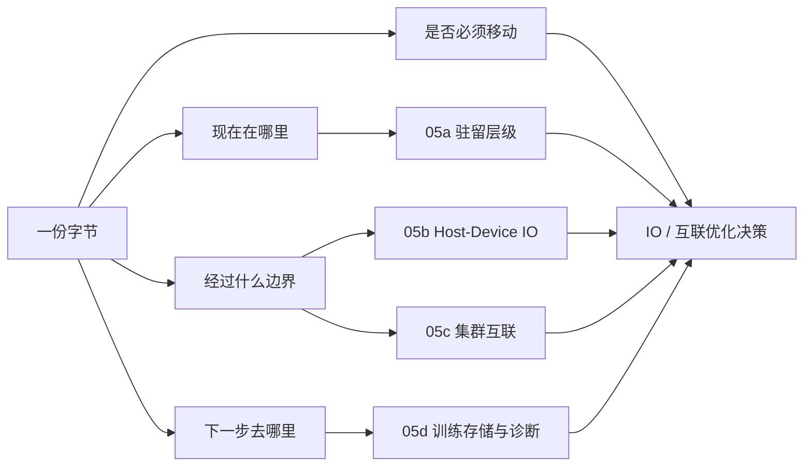

# 第5章：内存、互联与 IO 导览

> **本章已拆分为独立子章**：原来的第 5 章把内存层级、主机到设备 IO、RDMA 集群网络、并行文件系统、checkpoint 和 IO 排障放在同一个页面里，阅读路径过长，也容易把“数据驻留在哪里”和“数据怎样跨边界移动”混在一起。现在第 5 章保留为导览章，详细内容拆到 05a-05d。

## 1. 为什么要拆分第 5 章

AI 系统的很多性能问题表面上像“GPU 不够快”，实际是数据没有以正确方式进入正确位置。这个判断没错，但它覆盖了几类完全不同的问题：

- 训练样本、模型权重、checkpoint、KV Cache 和中间结果分别应该驻留在哪一层；
- HBM、DRAM、page cache、NVMe、并行文件系统、对象存储的语义和成本差异；
- H2D/D2H 拷贝为什么受 PCIe、NUMA、pinned memory、DataLoader 和 async copy 影响；
- 多节点训练为什么需要 RDMA、NCCL collective、rank placement 和拓扑感知调度；
- checkpoint 写入、对象存储归档、小文件读取和模型冷启动为什么会造成抖动；
- IO 问题应该看哪些指标，怎样从 GPU 利用率锯齿反推到存储、PCIe、NIC 或交换机。

这些问题共享“IO / 互联 / 搬运链路”这个主题，但工程动作不同。把它们拆开之后，每章都能回答一个更具体的问题。

## 2. 拆分后的阅读路径

| 子章 | 主题 | 你应该在什么时候读 |
|------|------|--------------------|
| [05a 内存与存储层级、数据驻留](./05a-memory-storage-hierarchy-and-data-residency.md) | HBM、DRAM、page cache、NVMe、并行文件系统、对象存储、热层/冷层、POSIX vs object 语义 | 你要判断数据、权重、缓存、checkpoint 应该放在哪里 |
| [05b Host-Device IO、PCIe、NUMA 与重叠](./05b-host-device-io-pcie-numa-and-overlap.md) | PCIe、NUMA、pinned memory、H2D/D2H、DataLoader、prefetch、async copy、模型加载 | 你看到 GPU 空转、DataLoader 忙、H2D 时间高或模型冷启动慢 |
| [05c RDMA、Collective 与集群拓扑](./05c-rdma-collectives-and-cluster-topology.md) | RDMA/RoCE/InfiniBand/TCP、NCCL、Fat-tree、rail、DragonFly+、rank placement、GPU-NIC locality | 你要扩到多节点、多机多卡训练，或排查 AllReduce/NCCL timeout |
| [05d 训练存储、Checkpoint 与 IO 诊断](./05d-training-storage-checkpoint-and-io-diagnostics.md) | 并行文件系统、checkpoint 写入/恢复、对象存储归档、小文件问题、IO 指标与排障链 | 你要治理训练热层、checkpoint 抖动、数据读取抖动或模型加载抖动 |

## 3. 总框架：每一份字节都要回答四个问题

1. **现在在哪里？**
   HBM、DRAM、NVMe、并行文件系统、对象存储还是远端服务。

2. **下一步去哪里？**
   进入 GPU 计算、跨 GPU 通信、跨节点同步、写 checkpoint，还是归档发布。

3. **经过什么边界？**
   PCIe、NUMA、NVLink、NIC、RDMA fabric、文件系统元数据层、对象存储 API。

4. **是否必须移动？**
   能不能缓存、分片、压缩、量化、预取、重叠、设备侧保留或异步归档。

## 4. 和相邻章节的关系

- 第 4 章讲 GPU 本身的执行、显存、互联和选型，第 5 章讲数据怎样进入、离开和穿过这些硬件边界。
- 第 6 章讲 CUDA runtime、stream、kernel 和 profiling，第 5b 会给它提供 H2D、prefetch、async copy 的系统背景。
- 第 8-10 章讲分布式训练和 checkpoint，第 5c/05d 会提供网络拓扑、文件系统热层和恢复 IO 的基础。
- 第 14-17 章讲推理，第 5a/05b/05d 会影响模型加载、KV Cache 驻留、冷启动和尾延迟。

第 5 章拆分后的目标是建立一个稳定的排查习惯：**不要先问“哪个组件慢”，先画出数据路径；不要只看平均吞吐，要看容量、延迟、带宽、语义和抖动。**

## 5. 快速自测

1. GPU 利用率周期性从 95% 掉到 40%，你会先画哪几段数据路径？
2. 一个训练任务小文件很多，DataLoader CPU 很忙，本地 NVMe 空闲，问题更可能属于 05a、05b、05c 还是 05d？
3. 64 卡训练扩展效率只有 55%，`t_sync / t_step` 超过 30%，为什么不能只看单卡 GPU 利用率？
4. checkpoint 每 30 分钟让所有作业同时抖动，应该从文件系统、对象存储归档、写入节奏还是网络拓扑开始拆？
5. 模型冷启动很慢，可能经过哪些层：对象存储、并行文件系统、NVMe、DRAM、PCIe、HBM？
