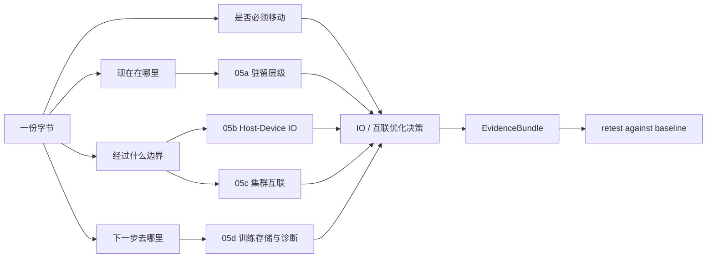

# 第5章：内存、互联与 IO 导览

> **本章已拆分为独立子章**：第 5 章只保留判断框架和证据地图，详细机制拆到 05a-05d。不要把它当成通用存储理论章；它服务的是 AI 训练和推理中“字节在哪里、怎样移动、移动是否挡住计算、怎样用证据复测”的工程判断。

## 1. 第一性原理拆解 + 学习大纲

AI 系统的性能问题经常被描述成“GPU 不够快”或“网络慢”。第一性原理上，GPU 只能计算已经到达设备侧、格式正确、依赖满足的字节；多节点训练只能在所有 rank 完成通信后推进；训练恢复只能从完整且可验证的 checkpoint 继续。因此第 5 章讨论的不可化简问题是：**每一份字节必须在正确时间驻留在正确层级，并且跨边界移动的代价不能超过计算、通信或恢复窗口。**

这句话可以拆成四个学习问题：

1. **驻留问题**：训练样本、模型权重、KV Cache、optimizer state、checkpoint shard、索引和临时文件分别应该留在 HBM、DRAM、page cache、本地 NVMe、Lustre/GPFS/BeeGFS/WekaFS 等并行文件系统，还是对象存储。
2. **跨界路径**：字节是否跨 PCIe、NUMA、NVLink/NVSwitch、NIC、RDMA fabric、文件系统客户端、元数据服务或对象存储 API。
3. **窗口问题**：读取、H2D、collective、checkpoint flush、归档和恢复是否能隐藏在 compute、prefetch 或异步后台窗口内。
4. **证据问题**：结论是否能被 `fio`、`iostat`、`ib_write_bw`、`nccl-tests`、`nvidia-smi topo -m`、`lspci -vv`、Lustre/文件系统命令和训练 profiler 复测。

本章的边界也要说清楚：05a 讲数据驻留和层级语义，不展开 PCIe 时序；05b 讲单机 host-device IO 和 overlap，不展开跨节点 collective；05c 讲 RDMA/NCCL/拓扑，不把 checkpoint 存储当主线；05d 只讲训练存储、checkpoint 和 IO 诊断，不写成泛化存储产品百科。

## 2. 拆分后的阅读路径

| 子章 | 主题 | 路径边界 | 你应该在什么时候读 |
|------|------|----------|--------------------|
| [05a 内存与存储层级、数据驻留](./05a-memory-storage-hierarchy-and-data-residency.md) | HBM、DRAM、page cache、NVMe、并行文件系统、对象存储、热层/冷层、POSIX vs object 语义 | 数据从冷层到热层再到主机内存；不展开 CUDA stream | 你要判断数据、权重、缓存、checkpoint 应该放在哪里 |
| [05b Host-Device IO、PCIe、NUMA 与重叠](./05b-host-device-io-pcie-numa-and-overlap.md) | PCIe、NUMA、pinned memory、H2D/D2H、DataLoader、prefetch、async copy、模型加载 | CPU/DRAM/NVMe 到 GPU HBM；不展开 RDMA fabric | 你看到 GPU 空转、DataLoader 忙、H2D 时间高或模型冷启动慢 |
| [05c RDMA、Collective 与集群拓扑](./05c-rdma-collectives-and-cluster-topology.md) | RDMA/RoCE/InfiniBand/TCP、NCCL、Fat-tree、rail、DragonFly+、rank placement、GPU-NIC locality | GPU buffer 到远端 GPU buffer；不展开数据湖治理 | 你要扩到多节点、多机多卡训练，或排查 AllReduce/NCCL timeout |
| [05d 训练存储、Checkpoint 与 IO 诊断](./05d-training-storage-checkpoint-and-io-diagnostics.md) | 并行文件系统、checkpoint 写入/恢复、对象存储归档、小文件问题、IO 指标与排障链 | 训练热层、checkpoint staging、归档和恢复；不做通用存储理论 | 你要治理训练热层、checkpoint 抖动、数据读取抖动或模型加载抖动 |

## 3. EvidenceBundle：先收证据，再下结论

每次排查第 5 章范围内的问题，先收一份 EvidenceBundle。它不是一次性全跑，而是按症状选择最短证据链。

| 证据类别 | 命令 / 数据源 | 能证明什么 | 触发后读哪章 |
|----------|---------------|------------|--------------|
| 数据驻留与热层 | dataset manifest、cache hit ratio、`df -h`、`du -sh`、文件系统配额、page cache 观测 | 工作集是否能放进热层，训练是否直接碰冷层 | 05a |
| 本地 IO 基线 | `fio` 顺序读写/随机读写、`iostat -x 1`、`pidstat -d` | NVMe 或文件系统客户端是否达到节点池 baseline，是否出现 await/util 尖刺 | 05a、05d |
| 主机设备路径 | `nvidia-smi topo -m`、`lspci -vv`、`numactl --hardware`、Nsight Systems、`torch.profiler` | H2D 是否被 PCIe/NUMA/pinned memory/同步点限制 | 05b |
| RDMA 基线 | `ib_write_bw`、`ib_read_bw`、`ibv_devinfo`、`rdma link`、交换机端口计数 | 单 rail、多 rail 和 RDMA 设备是否健康 | 05c |
| Collective 基线 | `nccl-tests` 的 `all_reduce_perf`、`all_gather_perf`、`reduce_scatter_perf`、训练 smoke test | NCCL bus bandwidth、方差、rank wait 是否符合节点池 baseline | 05c |
| Checkpoint IO | checkpoint 日志、manifest、`fio` 写入基线、`iostat`、Lustre `lfs df -h`/`lfs getstripe`/MDS 指标 | 写入峰值、元数据、flush、归档是否阻塞训练 | 05d |

最低要求：任何“慢”的结论都要至少包含一条用户体验指标和一条资源侧指标。例如 `step time P99 上升` 加 `DataLoader queue 为空`，或 `t_sync/t_step 上升` 加 `nccl-tests busbw 低于 baseline`，或 `checkpoint time 翻倍` 加 `iostat await 超过基线 2 倍`。

## 4. CapacityLedger：四个容量账本

第 5 章的容量不是只看“磁盘还有多少”。要分别算驻留容量、拷贝窗口、网络同步窗口和 checkpoint 窗口。

| 账本 | 核心公式 | 健康 threshold | 主要证据 |
|------|----------|----------------|----------|
| 数据驻留 CapacityLedger | `hot_bytes = active_dataset_shards + model_cache + dataloader_queue + checkpoint_staging + page_cache_reserve` | 热层可用容量至少为 `hot_bytes * 1.3`；本地 NVMe cache 命中率低于 80% 时要解释冷层访问是否进入关键路径 | manifest、cache 指标、`fio`、`iostat`、文件系统容量 |
| H2D overlap CapacityLedger | `t_h2d_min = batch_bytes / effective_pcie_bandwidth`，`visible_copy_gap <= max(0.1 * t_step, 0.2 * t_compute)` | H2D 可见空洞超过 step 的 10% 或 compute 的 20% 视为需要优化；pinned memory 预算不超过主机 DRAM 的 20% | profiler、`nvidia-smi topo -m`、`lspci -vv`、NUMA 命令 |
| RDMA collective CapacityLedger | `t_allreduce_lb ~= 2 * (ranks - 1) / ranks * message_bytes / effective_fabric_bw` | `ib_write_bw` 低于节点池 baseline 的 85%、`nccl-tests` busbw 低于 baseline 的 80%、重复运行 CV 高于 10% 都需要阻断入池或降级 | `ib_write_bw`、`nccl-tests`、NCCL 日志、交换机计数 |
| Checkpoint IO CapacityLedger | `required_ckpt_bw = checkpoint_bytes / allowed_pause_seconds`，`platform_peak = sum(concurrent_checkpoint_bytes / window)` | `fio` 聚合写入应不低于 `required_ckpt_bw * 1.3`；checkpoint pause 超过训练窗口预算或 `iostat await` 超过基线 2 倍要削峰 | checkpoint manifest、`fio`、`iostat`、Lustre/FS 指标、归档队列 |

这些 threshold 不是厂商参数，而是平台验收线：新硬件入池、驱动/固件升级、文件系统参数变更、调度规则变更、大作业启动前，都要用同一套 BenchmarkProtocol 复测并更新 baseline。

## 5. 总框架：每一份字节都要回答四个问题

1. **现在在哪里？**
   HBM、DRAM、page cache、NVMe、并行文件系统、对象存储还是远端服务。

2. **下一步去哪里？**
   进入 GPU 计算、跨 GPU 通信、跨节点同步、写 checkpoint，还是归档发布。

3. **经过什么边界？**
   PCIe、NUMA、NVLink、NIC、RDMA fabric、文件系统元数据层、对象存储 API。

4. **是否必须移动？**
   能不能缓存、分片、压缩、量化、预取、重叠、设备侧保留或异步归档。

## 6. Troubleshooting 总入口

| 症状 | EvidenceBundle 最小证据 | 可能根因 | 动作 | retest 标准 |
|------|--------------------------|----------|------|-------------|
| GPU 利用率每个 batch 前掉下去 | profiler 显示 H2D 或 batch wait；`iostat` 不一定高 | DataLoader CPU-bound、小文件、pinned memory 缺失、H2D 串行、NUMA 错配 | 先拆 `t_load/t_h2d/t_compute`，再按 05a/05b 治理格式、缓存、pinned queue 和 stream | 可见 H2D/batch wait 低于 step 的 10%，step P99 收敛 |
| 多节点扩卡效率低 | `t_sync/t_step` 上升；`nccl-tests` 低于 baseline；`ib_write_bw` 或 rail 利用异常 | rank placement、rail 不均、RDMA 端口错误、RoCE 拥塞、跨 pod/group 放置 | 按 05c 修正 topology-aware placement、HCA 暴露、QoS/ECN/PFC、坏端口隔离 | `nccl-tests` busbw 达 baseline 80% 以上，重复 CV 低于 10% |
| checkpoint 周期性拖慢全平台 | checkpoint time 与文件系统写入、MDS、`iostat await` 同步尖刺 | checkpoint storm、归档抢带宽、manifest/rename 元数据热点 | 按 05d 做分组写、jitter、限速、异步归档和热层保留窗口 | checkpoint pause 回到预算内，非 checkpoint 作业 step time 不再同步尖刺 |
| 模型冷启动或恢复慢 | 分段指标显示下载、读盘、反序列化、H2D、warmup 的耗时 | 权重未预热、CPU DRAM 峰值过高、H2D 串行、对象存储恢复进入主路径 | 节点缓存、分片流式加载、内容哈希、ready 前 warmup、恢复预取 | ready/restore P95 达 SLO，CPU RSS 和 H2D 时间在容量账本内 |

## 7. 和相邻章节的关系

- 第 4 章讲 GPU 本身的执行、显存、互联和选型，第 5 章讲数据怎样进入、离开和穿过这些硬件边界。
- 第 6 章讲 CUDA runtime、stream、kernel 和 profiling，第 5b 会给它提供 H2D、prefetch、async copy 的系统背景。
- 第 8-10 章讲分布式训练和 checkpoint，第 5c/05d 会提供网络拓扑、文件系统热层和恢复 IO 的基础。
- 第 14-17 章讲推理，第 5a/05b/05d 会影响模型加载、KV Cache 驻留、冷启动和尾延迟。

第 5 章拆分后的目标是建立一个稳定的排查习惯：**不要先问“哪个组件慢”，先画出数据路径；不要只看平均吞吐，要看容量、延迟、带宽、语义、抖动和复测证据。**

## 8. 快速自测

1. GPU 利用率周期性从 95% 掉到 40%，你会先画哪几段数据路径？每段会收集哪条 EvidenceBundle？
2. 一个训练任务小文件很多，DataLoader CPU 很忙，本地 NVMe 空闲，问题更可能属于 05a、05b、05c 还是 05d？
3. 64 卡训练扩展效率只有 55%，`t_sync / t_step` 超过 30%，为什么不能只看单卡 GPU 利用率？你会怎样用 `ib_write_bw` 和 `nccl-tests` 设 retest？
4. checkpoint 每 30 分钟让所有作业同时抖动，应该从文件系统、对象存储归档、写入节奏还是网络拓扑开始拆？`fio` 和 `iostat` 分别能证明什么？
5. 模型冷启动很慢，可能经过哪些层：对象存储、并行文件系统、NVMe、DRAM、PCIe、HBM？哪一层需要容量账本？
