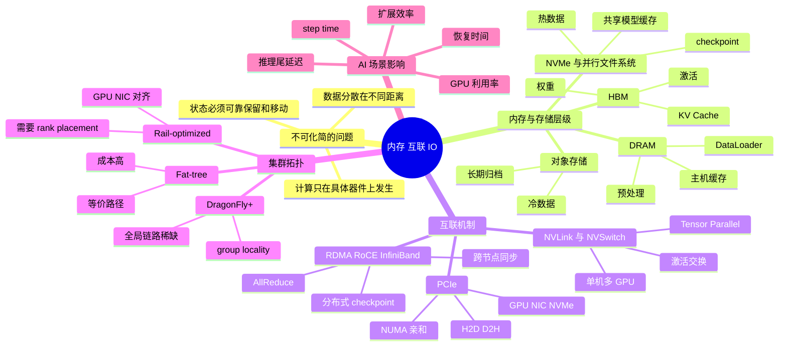
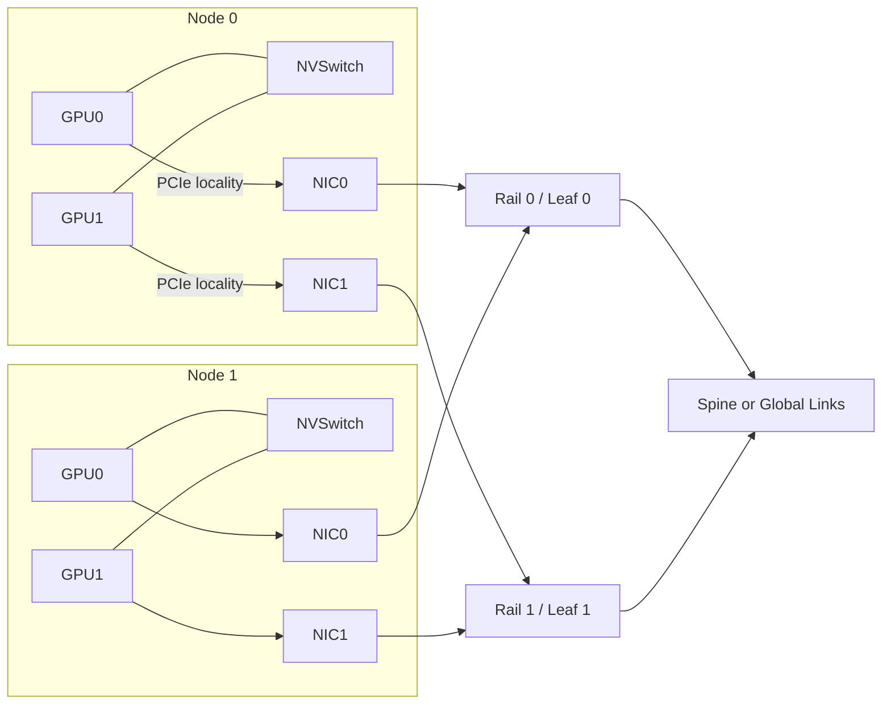
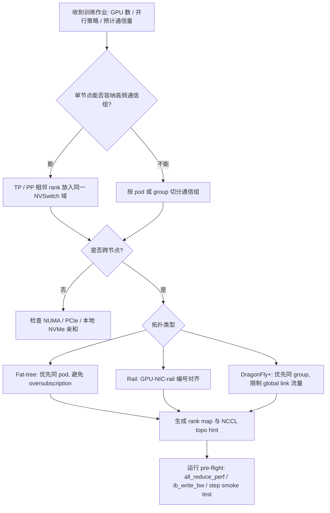

# 第5章：内存、互联与 IO

> AI 系统的很多性能问题，不是“算子不够快”，而是数据从来没有以正确的方式进入正确的地方。

> **关联章节**：本章内容与 [第4章](./04-gpu-and-accelerators.md) 的硬件选型、[第8章](../part3-training-infra/08-data-parallel.md) 的通信扩展效率密切相关。很多“GPU 不够快”的问题，最后都能追到搬运链路。

## 1. 第一性原理拆解 + 学习大纲

### 拆 — 不可化简的问题

把 HBM、DRAM、PCIe、NVLink、RDMA、NVMe、对象存储这些名字都拿掉，本章只剩下一个不可化简的问题：计算只能发生在某个具体器件上，而数据、状态和结果却分散在不同距离、容量、价格和一致性语义的介质里。AI 系统不是一台“会算的机器”，而是一条持续把数据推到计算单元、把中间状态留在合适位置、把结果可靠写回的搬运链路。单个矩阵乘法可以很快，但训练 step 要等待样本、权重、激活、梯度和 checkpoint；单个 token 的 decode 可以很快，但在线推理要等待权重加载、KV Cache 更新和远端检索。只要任何一段链路不能稳定供给，GPU 就会空转；只要任何一段链路被错误放大，扩卡就会把瓶颈复制成更大的瓶颈。

这个问题来自物理约束。离计算越近的存储通常越快、越贵、容量越小：HBM 带宽可到 TB/s 级，但单卡容量有限；DRAM 更大，但要经 PCIe 才能进入 GPU；NVMe 可以放训练样本，但访问延迟和并发模式不是内存语义；对象存储容量弹性最好，却不能假装成低延迟 POSIX 文件系统。互联也一样：单机 GPU-GPU 可以走 NVLink / NVSwitch，跨节点就要经过 NIC、交换机和网络协议；PCIe 代际、NUMA 亲和、网卡 rail、交换机 oversubscription 都会把“理论算力”改写成“实际 step time”。所以本章不是背介质名字，而是判断每一份字节在哪里、下一步去哪里、途中经过哪些共享瓶颈、是否真的必须搬。

### 推 — 从这个问题如何推导出每个机制

从“字节必须移动”出发，第一步必然得到内存层级。系统不可能同时拥有无限容量、无限带宽、零延迟和低成本，所以需要 HBM 放权重、激活和 KV Cache，DRAM 放 dataloader、预处理和主机缓存，NVMe / 并行文件系统放热数据与 checkpoint，对象存储放冷数据和长期制品。层级存在之后，就会出现缓存与预热：热点样本靠本地 NVMe 或共享热层减少远端读取，模型权重常驻显存或热加载，checkpoint 在恢复时间和写入抖动之间取平衡。层级也带来语义差异：`fsync`、page cache、对象存储列表一致性和分片上传，不是存储细节，而是训练恢复、数据可见性和成本边界。

第二步必然得到互联。HBM 内的数据只对本 GPU 便宜；一旦跨设备，就要选择 PCIe、NVLink、NVSwitch 或 RDMA。PCIe 连接 CPU、GPU、NIC、NVMe，但受 lane 数、代际、根复合体和 NUMA 影响；NVLink / NVSwitch 解决单机多 GPU 高频同步，支撑张量并行和大模型分片；RDMA / RoCE / InfiniBand 解决跨节点数据面，让 GPU 间通信尽量少经过 CPU 拷贝。互联存在之后，就会出现拓扑问题：8 卡节点内链路很快，不代表 64 节点 AllReduce 很快；单张 400G NIC 很快，不代表多 rail 会均匀使用；交换机端口够用，不代表 job placement 不会把流量压到同一条 spine 或同一个 Dragonfly global link。

第三步必然得到调度与边界。平台不能只调“几张 GPU”，还要调 GPU 离哪些 NIC 近、属于哪个 leaf、rail、pod、Dragonfly group、共享哪个文件系统热层。数据并行希望跨节点带宽稳定，张量并行更怕 GPU-GPU 延迟，pipeline parallelism 对相邻 stage 的放置敏感，checkpoint 会同时冲击文件系统和网络。工程优化通常落到三类动作：减少搬运次数，例如缓存、分片、压缩、设备侧保留；提高有效带宽，例如 pinned memory、NUMA 绑定、多 rail 均衡、RDMA；重叠搬运与计算，例如 async H2D、prefetch、分阶段 checkpoint。读本章时要不断把机制翻译成这三个动作。

### 绘 — 因果链路



### 导 — 读完本章你应该能回答

1. 给定一个训练 step，你能否把 `load -> H2D -> compute -> sync -> checkpoint` 拆成数据驻留位置和搬运路径？
2. 为什么 HBM、DRAM、NVMe、并行文件系统、对象存储不能只按“容量大小”排序，而必须同时看延迟、带宽和语义？
3. 什么时候 PCIe 是瓶颈，什么时候 NVLink / NVSwitch 是瓶颈，什么时候跨节点 RDMA fabric 才是瓶颈？
4. 为什么 8 卡单机跑得好，不代表 64 卡、256 卡训练一定线性扩展？
5. Fat-tree、Rail-optimized、DragonFly+ 三类拓扑分别把成本、带宽均匀性和调度复杂度放在了什么位置？
6. 对一个新作业，你会如何判断它应该优先做数据缓存、H2D 重叠、多 rail placement，还是 checkpoint 写入削峰？
7. 当 GPU 利用率锯齿化、NCCL timeout 或 checkpoint 抖动出现时，你能否提出一条从训练指标回溯到存储、PCIe、NIC、交换机的排查链？

## 学习目标

完成本章学习后，你将能够：

1. 理解 HBM、DRAM、SSD、对象存储在 AI 系统中的分工
2. 理解 PCIe、NVLink、RDMA 等互联为什么重要
3. 识别单机和多机场景中的典型 IO 与带宽瓶颈
4. 用“数据搬运链路”视角分析性能问题
5. 理解为什么很多优化本质上是在减少搬运次数
6. 理解集群拓扑与并行文件系统为什么会决定大规模训练上限

---

## 正文内容

### 5.1 AI 系统的真实问题通常是“数据怎么走”

以训练为例，数据通常会经历：

```text
对象存储 / 文件系统
  -> 本地磁盘缓存
  -> CPU 内存
  -> GPU 显存
  -> 计算
```

以 LLM 推理为例，状态通常会经历：

```text
模型权重
  -> 主机内存
  -> GPU 显存
  -> KV Cache 更新
  -> 输出 token
```

这意味着 AI 系统的性能，往往不是“一个阶段算得多快”，而是“整条搬运链路有没有形成稳定供给”。

### 5.2 一张最重要的层次图

可以把 AI 系统的数据驻留层级粗略理解成：

| 层级 | 典型介质 | 容量 | 延迟 | 带宽 | 典型用途 |
|------|----------|------|------|------|----------|
| 远端持久层 | 对象存储、冷数据仓 | 大 | 高 | 中 | 原始数据、长期归档、跨集群共享 |
| 共享热存储 | 并行文件系统、训练集群共享文件层 | 中大 | 中 | 中高 | 训练热数据、checkpoint 热层、集群共享模型缓存 |
| 本地磁盘 | NVMe / SSD | 中 | 中低 | 高 | 训练缓存、热点模型、shuffle 临时数据 |
| 主存 | DRAM | 中 | 低 | 很高 | dataloader、预处理、中间缓存 |
| 显存 | HBM / GDDR | 小 | 更低 | 极高 | 权重、激活、KV Cache |

理解这张表有两个工程意义：

1. 容量越大的层，往往越慢
2. 越靠近计算设备，容量越贵也越稀缺

所以平台设计经常是在“容量大但慢”和“容量小但快”之间做分层。

### 5.3 PCIe、NVLink、RDMA 到底在解决什么

#### PCIe

CPU 和 GPU 之间最常见的通道。它决定：

- 主机到设备（H2D）拷贝速度
- 多 GPU 通过主机转发时的带宽

#### NVLink / NVSwitch

主要用于 GPU 与 GPU 间高速通信。它对以下场景非常重要：

- 多卡训练
- 张量并行
- 大模型分片推理

#### RDMA / 高速网卡

多机训练或远端高速服务访问时常见。它能降低 CPU 参与和数据复制开销，对大规模训练集群尤为重要。

你可以把它们理解成不同层级的“高速公路”：

- PCIe：CPU 和设备之间
- NVLink：设备和设备之间
- RDMA：机器和机器之间

把抽象概念落到数字上，会更容易判断瓶颈位置：

| 互联 | 典型带宽 | 常见范围 | 更影响哪些场景 |
|------|----------|----------|----------------|
| PCIe 3.0 x16 | 16 GB/s | CPU <-> GPU | 旧机器 H2D / D2H、数据回传 |
| PCIe 4.0 x16 | 32 GB/s | CPU <-> GPU | 目前大量训练节点的基础链路 |
| PCIe 5.0 x16 | 64 GB/s | CPU <-> GPU | 新一代主机侧高带宽拷贝 |
| NVLink 3 | 600 GB/s | GPU <-> GPU | A100 代 8 卡训练、张量并行 |
| NVLink 4 | 900 GB/s | GPU <-> GPU | H100 / H200 代高频同步 |
| InfiniBand NDR | 400 Gb/s（约 50 GB/s） | 机器 <-> 机器 | 多机数据并行、分布式 checkpoint |

注：PCIe 以上数字常用 `x16` 单向口径，NVLink 常用单 GPU 聚合双向口径，InfiniBand 常用端口线速口径。口径不同，但足以帮助你建立数量级直觉。

> **参考数量级（仅供建立直觉，实际值因硬件和配置差异较大）**
>
> | 场景 | 典型值 | 说明 |
> |------|--------|------|
> | 1 GB H2D 拷贝走 PCIe 4.0 x16 | 理论下限约 31 ms | 实际还会受 pinned memory、NUMA 和调度影响 |
> | 1 GB GPU-GPU 传输走 NVLink 4 | 理论下限约 1-2 ms | 更适合频繁激活 / 梯度交换 |
> | 10 GB 数据跨机走 NDR 400G | 理论下限约 0.2 s | 真正训练中还会叠加协议和同步开销 |
> | 跨节点以太网未做 RDMA 优化 | 常见比 IB 慢一截 | 会直接体现在第8章的扩展效率上 |

### 5.4 一个简单的时间拆解

如果一个训练 step 的时间可以写成：

$$
t_{\text{step}} = t_{\text{load}} + t_{\text{h2d}} + t_{\text{compute}} + t_{\text{sync}}
$$

那么你会发现，优化往往有三种路径：

1. **减少数据量**：压缩、缓存、量化、更好的格式
2. **提高带宽**：更快互联、更高吞吐存储、更少中间复制
3. **重叠执行**：让数据准备和计算并行，而不是串行

这三种路径几乎覆盖了很多性能优化的本质。

### 5.5 为什么“减少搬运”经常比“优化计算”更划算

很多任务的痛点不是计算量太大，而是：

- 数据格式碎片化
- 小文件过多
- 频繁跨总线搬运
- 热点状态频繁回写
- 远端依赖调用过多

一个非常重要的工程直觉是：

> 任何不必要的数据复制、跨设备同步和远端访问，都会在规模化时被放大。

所以很多优秀系统设计都会优先考虑：

- 数据是否能预热到更近的层
- 状态是否能留在设备端
- 是否能批量搬运，减少小块传输
- 是否能减少往返次数

### 5.6 RDMA、RoCE 与 TCP 怎么选

对平台工程来说，三者不是“谁先进就用谁”，而是网络目标、预算和运维能力的平衡。

| 方案 | 带宽 / 延迟 | 成本 | 部署复杂度 | 适用场景 |
|------|-------------|------|------------|----------|
| InfiniBand RDMA | 最高 / 最低 | 高 | 中高 | 大规模多机训练、强同步集群 |
| RoCE v2 | 高 / 低 | 中 | 高 | 需要以太网承载 RDMA，但团队能调 PFC / ECN |
| TCP over Ethernet | 中 / 较高 | 低 | 低 | 小规模训练、控制面、对性能不极端敏感的业务 |

快速判断可以这么做：

- **先要极致训练效率**：优先看 InfiniBand RDMA
- **已有强以太网基础设施**：可评估 RoCE，但必须接受调参成本
- **规模不大、以稳为先**：TCP 仍然是最便宜的默认值

### 5.6a 集群网络拓扑与 Job Placement

到了 32、64、256 卡规模后，扩展上限不只由单块网卡决定，还由网络组织方式和 rank placement 决定。单机内 GPU 之间优先走 NVLink / NVSwitch；跨节点时，数据通常从 GPU 经 PCIe 到 NIC，再进入 InfiniBand 或 RoCE fabric。NCCL 会把 AllReduce 拆成单机内 reduce、跨节点 exchange、单机内 broadcast；跨节点阶段一旦走到慢 rail、跨 pod 或拥塞链路，整轮同步都会被最慢 rank 拖住。



常见训练网络可以粗略分成 Fat-tree / Clos、Rail-optimized、DragonFly+ 三类。它们不是“高级程度”的排序，而是对成本、等价带宽、布线复杂度和调度复杂度的不同取舍。

| 拓扑 | 典型组织方式 | 收益 | 代价 | 适合的 Job Placement | 主要失败模式 |
|------|--------------|------|------|----------------------|--------------|
| Fat-tree / Clos | Node 接 Leaf，Leaf 上联多层 Spine，目标是任意节点间多条等价路径 | bisection bandwidth 更均衡，多租户下调度简单，AllReduce、参数同步、checkpoint 流量更容易预测 | 交换机端口、光模块、布线和 spine 层成本高；大规模扩容需要提前规划 oversubscription | 尽量把一个作业放进同一 pod；跨 pod 时让 rank 均匀分布，避免 ECMP 哈希把大流压到少数 spine | oversubscription 过高、ECMP 哈希不均、spine 热点、某些 leaf 下混入慢速节点 |
| Rail-optimized | 每个 GPU 或 GPU 组绑定一张 NIC；同编号 NIC 进入同一条 rail | GPU-NIC 对应清晰，布线和交换层更可控，多 rail 可并行承载 NCCL 流量 | 调度器和 NCCL 拓扑文件必须理解 rail；错误 rank placement 会跨 rail 绕行 | 让 `rank i` 尽量靠近 `GPU i/NIC i/rail i`；同一 data-parallel group 横跨节点时保持 rail 对齐 | GPU 到 NIC NUMA 错配、某条 rail 拥塞、ring/tree 没均匀使用 rail、rail 故障导致性能非线性下降 |
| DragonFly+ | 多个 group 内部高带宽互联，group 之间用高 radix global links 连接 | 用较少全局链路支撑数千到上万卡规模，跨 group 跳数和成本可控 | 调度、故障隔离、拥塞控制和流量工程复杂；平台必须理解 group locality | 先在同 group 内满足作业；超出单 group 时让 pipeline stage 或 DP shard 按 group 边界切分 | 跨 group 流量比例过高、global link 热点、作业碎片化导致每个大作业都跨 group |

Job Placement 的核心不是“凑够 GPU 数”，而是把通信图映射到物理图。64 卡作业最保守的放法是先拿完整 8 卡节点，再拿同一 leaf 或 pod 下的节点；rail-optimized 集群还要让 GPU0/NIC0 对齐 rail0，GPU1/NIC1 对齐 rail1。张量并行（Tensor Parallelism）的相邻 rank 应优先放在同一 NVSwitch 域；数据并行（Data Parallelism）要保证跨节点 rail 均衡；pipeline parallelism 要避免相邻 stage 跨 DragonFly group 的 global link。



粗略判断：如果 `t_sync / t_step` 超过 20%-30%，或扩卡后吞吐低于理想线性的 70%，调度器就不能只看 GPU 空闲数；它需要把 leaf、rail、pod、DragonFly group、NIC 速率、PCIe locality 纳入资源模型。典型 pre-flight 包括 `nccl-tests all_reduce_perf`、`ib_write_bw`、`nvidia-smi topo -m` 和 50-200 step 训练 smoke test。上线后，还要把 NCCL timeout、rank wait time、端口丢包 / ECN mark、PFC pause、rail 利用率和 step time 放在同一张图里看。

**工程边界**：拓扑感知调度不能替代网络容量规划。如果 Fat-tree 本身是 3:1 oversubscription，大作业同时跨 pod 运行时不可能靠 rank map 变成无阻塞网络；如果 rail-optimized 集群缺少 GPU/NIC 亲和标注，调度器也无法猜出正确 rail；如果 DragonFly+ 的 global link 已经被多个大作业长期打满，再好的 locality 只能降低损害。平台侧应把拓扑信息作为一等资源，至少维护 `node -> GPU -> NIC -> PCIe root -> leaf/rail/group` 的映射，并在作业提交、预检和故障复盘中使用它。

### 5.6b 并行文件系统：训练热层，不是对象存储替代品

对象存储适合冷数据和长期保留，但训练现场经常需要一个更靠近计算层的“热层”。VFS、inode、dentry、page cache、journal、extent、`fsync` 会直接影响 checkpoint 写入和 dataset 读取；细节见 [§0c 文件系统与存储内核](../part0-foundations-of-systems/0c-filesystems-and-storage-internals.md)。本章只关心一个判断：训练主路径需要低抖动吞吐和可恢复语义，对象存储需要容量弹性和跨区域持久化，二者不能简单互相替代。

热层通常承接三类压力：

- dataloader 的并发随机读取
- 大批 checkpoint 的并发写入
- 多节点共享同一份热点数据

这时常见选择是并行文件系统或本地 NVMe 缓存。Lustre、GPFS / Spectrum Scale、BeeGFS、WekaFS 的设计差异很大，但在 AI 平台视角下，先比较吞吐、元数据能力、小文件表现、快照 / 一致性和运维成本即可。

| 系统 | 核心语义 | 优势 | 风险 | 更适合什么场景 |
|------|----------|------|------|----------------|
| Lustre | POSIX 并行文件系统，MDS + OSS/OST，常用 stripe | 大文件顺序吞吐强，HPC 生态成熟 | 小文件和元数据热点需要治理，stripe 参数要按 workload 调 | 大规模训练集读取、顺序 checkpoint 写入 |
| GPFS / Spectrum Scale | POSIX 并行文件系统，企业级集群管理 | 一致性和配额能力较强，企业运维工具完整 | 成本和管理复杂度较高 | 企业训练平台、共享数据湖热层 |
| BeeGFS | POSIX 并行文件系统，部署相对灵活 | 性价比和扩展性较好 | 超大规模治理依赖团队经验 | 中大型训练集群、研发集群共享热层 |
| WekaFS | 高性能分布式文件系统，偏低延迟和混合 IO | 随机 IO 与 checkpoint 热层体验好 | 商业成本、容量层联动需评估 | 混合训练、频繁 checkpoint、模型热加载 |
| 对象存储 | HTTP object API，非 POSIX 路径语义 | 容量弹性、归档、跨区域复制、成本优势 | 小文件随机读、rename、强一致目录语义和低延迟不匹配 | 冷数据、历史 checkpoint、模型发布包 |

更实用的做法通常不是二选一，而是分层：

| 层级 | 放什么 | 为什么 |
|------|--------|--------|
| 并行文件系统 / 本地 NVMe | 当前训练集、最近 checkpoint、热点样本 | 吞吐高、恢复快 |
| 对象存储 | 原始数据、历史 checkpoint、模型发布包 | 成本低、容量大、便于归档 |

如果把所有数据都直接从对象存储读，常见问题会是：

- 小文件和随机读取放大延迟
- checkpoint 高并发写入时吞吐不稳
- 训练和恢复都依赖远端网络
- POSIX rename / atomic commit 语义需要额外封装

常见模式是“对象存储为真源，文件系统为热副本”：数据准备任务把 shard 同步到并行文件系统或本地 NVMe，训练只读热层；checkpoint 先写热层并校验，再异步归档到对象存储。代价是管理副本一致性、生命周期、容量水位和失败重试。

**工程边界**：并行文件系统不是无限快的共享磁盘。单目录百万级小文件、所有 worker 同时 stat 同一目录、所有作业在整点写 checkpoint、把对象存储 fuse mount 当成本地盘用，都会把热层拖成新的瓶颈。平台应规定 shard 大小、目录分片、checkpoint 命名与提交协议、归档节奏和容量回收策略；具体文件系统内部机制与 `fsync` / page cache 陷阱应回到 [§0c](../part0-foundations-of-systems/0c-filesystems-and-storage-internals.md) 细读。这一点会直接影响 [第10章](../part3-training-infra/10-memory-checkpointing-and-recovery.md) 的 checkpoint 频率设计。

### 5.7 IO 瓶颈的典型表现

#### 训练场景

- GPU 利用率锯齿化
- dataloader worker 很忙
- step time 波动大
- checkpoint 写入时出现明显抖动

#### 推理场景

- 模型冷启动慢
- 请求延迟受模型加载和缓存未命中影响
- RAG 文档检索后还要远程拉取元数据，造成尾延迟

#### 多机场景

- 扩卡后吞吐提升远不如预期
- 跨节点同步比例升高
- 某一台机器成为“木桶短板”

### 5.8 常见误区

#### 误区一：显存不够就一定是模型太大

不一定。也可能是：

- batch 太大
- 激活保留太多
- KV Cache 回收策略差
- 数据在设备侧重复保留

#### 误区二：IO 问题只是数据读取慢

不对。主机到设备拷贝、checkpoint 回写、远端依赖访问也都属于 IO 链路。

#### 误区三：只要上更快硬件，搬运问题就会消失

不对。如果链路层级和访问模式不合理，再快硬件也会被错误使用方式浪费。

---

## 本章小结

| 主题 | 关键点 |
|------|--------|
| 内存层级 | 越靠近计算层越快，但容量越稀缺 |
| 互联 | PCIe、NVLink、RDMA 分别负责不同范围的数据搬运 |
| 集群拓扑 | 放置策略和网络分层会决定多机训练的扩展上限 |
| 存储热层 | 并行文件系统 / NVMe 更适合作为训练与 checkpoint 的热层 |
| 性能优化本质 | 很多优化不是减少计算，而是减少搬运或重叠搬运 |
| 瓶颈识别 | 训练抖动、扩卡失效、冷启动慢都可能是 IO / 互联问题 |

---

## 练习题

1. 为什么很多 AI 系统优化要从“数据怎么走”开始，而不是从“算子怎么写”开始？
2. PCIe、NVLink、RDMA 分别更影响哪些场景？
3. 如果你的集群要从单机 8 卡扩到 4 个节点，你会优先比较哪些互联数字？
4. 什么时候你会接受 TCP，而不是继续为 RoCE / RDMA 增加运维复杂度？
5. 为什么“并行文件系统做热层、对象存储做冷层”通常比只靠对象存储更适合训练集群？
