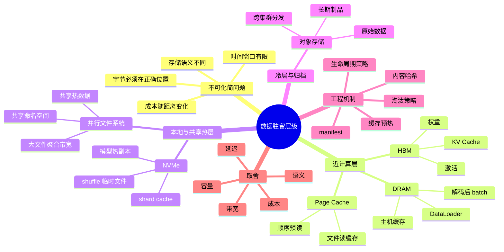
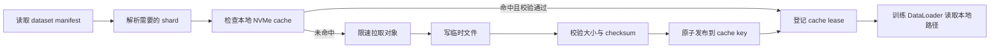
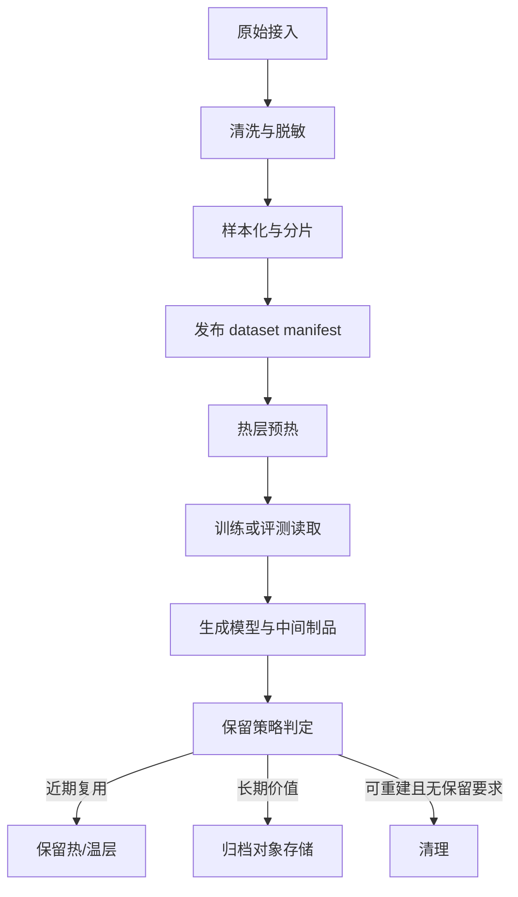

# 第5a章：数据驻留层级与内存/存储层级

> AI 系统里最贵的字节，不一定是最大的一份字节，而是下一毫秒就要被计算单元使用、却还停在错误层级里的字节。

> **关联章节**：本章是 [第5章](./05-memory-interconnect-io.md) 的存储层级拆分，专注 HBM、DRAM、Page Cache、NVMe、并行文件系统和对象存储之间的数据驻留、缓存和语义差异。PCIe 与 H2D 细节见 [第5b章](./05b-host-device-io-pcie-numa-and-overlap.md)，RDMA 与拓扑见 [第5c章](./05c-rdma-collectives-and-cluster-topology.md)，checkpoint 热层和 IO 诊断见 [第5d章](./05d-training-storage-checkpoint-and-io-diagnostics.md)。

## 1. 第一性原理拆解 + 学习大纲

### 拆 — 不可化简的问题

把 HBM、DRAM、NVMe、Lustre、S3、Page Cache 这些名字先拿掉，AI 系统里的存储层级要解决的不可化简问题只有一个：**计算只能消费已经驻留在合适位置、以合适格式、在合适时间可见的字节，而现实中的数据和状态分布在容量、延迟、带宽、成本和语义完全不同的介质里。**

这个问题有四个硬约束。第一是**位置约束**：GPU kernel 只能直接高效访问 HBM 中的 tensor；训练样本如果还在对象存储，就必须经过远端读取、本地缓存、主机内存、解码和 H2D 才能参与计算。第二是**时间约束**：训练 step 和在线推理都有稳定节拍，数据可以慢慢归档，但不能在 batch 需要时才开始跨层级搬运。第三是**语义约束**：POSIX 文件系统里的 `rename()`、`fsync()`、目录遍历、Page Cache，与对象存储里的 `PUT`、multipart upload、prefix listing、immutable key 不是同一套承诺；把对象存储当成本地文件系统，会在可见性、原子性和成本上制造隐患。第四是**经济约束**：越靠近计算，通常越快、越贵、容量越小；越远离计算，通常越便宜、越大、延迟越高。平台设计的本质，是把每一类字节放在它的价值密度能够匹配的层级里。

因此，数据驻留不是“存储选型”的附属问题，而是 AI 系统吞吐、尾延迟、恢复时间、成本和可复现性的共同底座。一个训练任务 GPU 利用率低，可能不是模型算得慢，而是样本还在冷层、小文件打满元数据服务、Page Cache 被错误污染、NVMe 缓存没有预热、对象存储被频繁 `LIST` 或随机读放大。一个推理服务冷启动慢，可能不是引擎差，而是权重从对象存储拉取、解压、校验、加载到 DRAM，再迁移到 HBM 的链路没有被显式管理。

### 推 — 从这个问题如何推导出每个机制

从“字节必须在正确位置”出发，首先得到**内存/存储层级**。HBM 放模型权重、激活、KV Cache 和 kernel workspace，因为这些字节马上要被 GPU 访问；DRAM 放 dataloader 队列、解码后的 batch、主机侧缓存和运行时元数据，因为它比存储快但容量仍有限；Page Cache 吸收文件读取的重复访问和顺序预读，但它不是应用级缓存，不能替代数据版本、淘汰策略和容量治理；本地 NVMe 放热数据 shard、模型热副本、shuffle 临时文件和中间制品，因为它能把远端抖动隔离在训练节点之外；并行文件系统放集群共享的热数据和大规模写入结果，因为它提供共享命名空间和聚合带宽；对象存储放冷数据、长期归档、跨集群分发和不可变制品，因为它容量弹性好、成本低、适合以对象为单位管理。

从“层级速度和容量不可能同时最好”出发，必然得到**热层和冷层**。热层不是一个具体产品，而是一组“近期会被高频读取或低延迟读取”的驻留策略：预热到本地 NVMe、保留在 Page Cache、pin 到 DRAM、常驻 HBM、复制到集群共享缓存。冷层保存长期价值更高但即时访问价值更低的数据：原始语料、旧 checkpoint、历史评测、过期模型包。冷热分层的关键不是按年龄机械划线，而是按未来访问概率、重建成本、合规保留要求和访问延迟预算共同决策。

从“远端读取不稳定”出发，得到**缓存预热和生命周期管理**。训练前预热常用 shard manifest 把本轮会读的数据拉到本地 NVMe；推理服务发布前把权重和 tokenizer 拉到节点镜像层或模型缓存；RAG 索引可以把热文档、向量块或倒排段缓存在本地 SSD。缓存不是复制一份文件这么简单，它必须回答：缓存 key 是路径还是内容哈希，失效由版本号还是 TTL 驱动，容量满时按 LRU、LFU 还是作业优先级淘汰，预热失败时是降级、阻塞还是换节点。

从“语义不同”出发，得到**存储协议边界**。POSIX 擅长目录、随机读写、原子 rename 和进程间共享路径；对象存储擅长大对象、不可变 key、多副本耐久和按请求计费。并行文件系统看起来像 POSIX，但元数据服务、stripe、锁和小文件仍可能成为瓶颈。Page Cache 看起来像免费加速，但它受全机内存压力、读写模式和内核回收影响。一个成熟平台不会假设所有后端都像本地磁盘，而会把“字节所在位置”和“该位置承诺的语义”同时写进系统设计。

### 概念先说清楚

数据驻留（data residency）指某份字节在某个时刻实际停在哪个层级，以及这个层级能以什么延迟、带宽、容量、成本和语义服务它。它不是“数据最终存在哪里”的静态问题，而是一个随训练 step、推理请求、缓存预热、checkpoint、归档不断变化的状态问题。AI 系统里同一份数据可能先在对象存储，随后进入本地 NVMe、Page Cache、DRAM、pinned memory，最后进入 HBM；每跨一层，都要付出搬运、排队和一致性成本。

内存/存储层级不是单纯快慢排序。HBM 最靠近 GPU 计算，适合权重、激活、KV Cache 和 workspace；DRAM 适合 DataLoader、解码后 batch、主机缓存和运行时元数据；Page Cache 是内核自动管理的文件页缓存，能加速重复读但不能作为可控版本管理；本地 NVMe 适合热数据 shard、模型热副本和临时文件；并行文件系统适合集群共享热层；对象存储适合冷数据、不可变制品和长期归档。每层的“快”都绑定特定访问形状和语义。

热层、冷层和缓存层是角色，不是固定产品。热层服务近期高频、低延迟访问；冷层保存长期价值更高但即时访问概率低的数据；缓存层用可丢弃副本减少重复远端读取。POSIX 文件系统、并行文件系统、对象存储和 Page Cache 的语义不同，尤其在 `rename()`、`fsync()`、目录遍历、原子可见性、请求计费和一致性上不能混用。数据驻留设计的本质，是让每类字节停在与它未来访问价值匹配的位置。

### 绘 — 因果链路



### 导 — 读完本章你应该能回答

1. 为什么 HBM、DRAM、Page Cache、NVMe、并行文件系统、对象存储不能只按“快慢”或“容量”排序？
2. 一个训练 batch 从对象存储到 GPU 计算之间，会经过哪些驻留点，每个驻留点的失败模式是什么？
3. 热层和冷层应该按年龄、访问频率、重建成本还是延迟预算来划分？为什么通常需要组合判断？
4. Page Cache 和应用级缓存有什么差别，为什么不能把前者当成可控的数据生命周期机制？
5. POSIX 文件系统和对象存储在 rename、fsync、目录遍历、原子可见性和计费模型上有哪些关键差异？
6. 缓存预热应该在什么时候做，如何避免预热把存储系统打崩或把错误版本缓存到计算节点？
7. 面对 GPU 利用率低、训练启动慢、推理冷启动慢或对象存储账单异常，如何从数据驻留层级回溯原因？

## 学习目标

完成本章学习后，你将能够：

1. 用数据驻留视角解释 AI 训练和推理中的内存/存储瓶颈
2. 区分 HBM、DRAM、Page Cache、NVMe、并行文件系统和对象存储的职责
3. 设计热层、冷层、缓存预热和数据生命周期策略
4. 判断 POSIX 与对象存储语义差异对工程可靠性的影响
5. 在容量、延迟、带宽和成本之间做可解释的工程取舍

---

## 正文内容

### 5a.1 数据驻留层级不是“越快越好”

很多初学者会把存储层级理解成一条简单的速度排序：

```text
HBM > DRAM > NVMe > 文件系统 > 对象存储
```

这个排序只能建立粗略直觉，不能指导工程设计。真正的设计问题至少有五个维度：

| 维度 | 需要回答的问题 | 常见误判 |
|------|----------------|----------|
| 容量 | 这一层能放多少数据，能否容纳峰值和副本 | 只看单盘或单卡容量，不算副本、临时文件和碎片 |
| 延迟 | 第一个字节多久能到，尾延迟是否稳定 | 只看平均吞吐，忽略小文件和冷启动 |
| 带宽 | 稳态每秒能供给多少字节，是否可并发扩展 | 把厂商理论值当作训练有效吞吐 |
| 成本 | 每 GB 存储、每 GB 读取、每次请求和运维成本是多少 | 只看容量单价，不看读放大和跨层级流量 |
| 语义 | 是否支持随机写、原子替换、目录遍历、权限和一致性 | 把对象存储 mount 成文件系统后假装语义相同 |

AI 系统经常要同时优化这些维度。比如训练数据放对象存储最便宜，但如果每个 epoch 都从远端随机读千万小文件，GPU 等待和请求成本会吞掉便宜容量带来的好处。把全部数据复制到每台机器的 NVMe 可以降低抖动，但会牺牲容量、预热时间和数据一致性。把权重常驻 HBM 能降低推理延迟，但会降低同卡可承载模型数和租户密度。

### 5a.2 六个层级的职责边界

下面这张表给出 AI 系统中常见驻留层级的工程画像。数字只用于建立数量级直觉，实际值会随硬件、文件大小、并发、压缩、内核参数和后端配置变化。

| 层级 | 典型介质 | 容量直觉 | 延迟直觉 | 带宽直觉 | 典型驻留数据 | 主要风险 |
|------|----------|----------|----------|----------|--------------|----------|
| HBM | GPU 显存 | 数十 GB 到百 GB 级/卡 | 极低 | TB/s 级 | 权重、激活、KV Cache、workspace | 容量稀缺、碎片、错误常驻导致并发下降 |
| DRAM | 主机内存 | 百 GB 到 TB 级/节点 | 低 | 数十到数百 GB/s | DataLoader 队列、解码后 batch、主机缓存 | NUMA、内存压力、被 Page Cache 挤压 |
| Page Cache | Linux 内核文件缓存 | 共享 DRAM 剩余空间 | 低到中 | 取决于命中率和底层存储 | 最近读过的文件页、顺序预读 | 不可精确控制、污染、回收抖动 |
| 本地 NVMe | 节点 SSD | TB 到数十 TB/节点 | 中低 | GB/s 级/盘，可并发 | 训练 shard、模型热副本、临时 shuffle | 容量治理、盘磨损、节点失效丢缓存 |
| 并行文件系统 | Lustre、GPFS、BeeGFS 等 | PB 级共享 | 中 | 聚合 GB/s 到 TB/s | 共享热数据、大 shard、大制品 staging | 元数据瓶颈、小文件、stripe 不匹配 |
| 对象存储 | S3、GCS、OSS、MinIO | 几乎弹性 | 高 | 高吞吐但请求语义不同 | 原始数据、冷层、长期制品、跨集群分发 | 非 POSIX、请求成本、LIST/小对象放大 |

这张表的重点不是背数值，而是看“职责边界”。HBM 不是用来放可重建冷数据的；对象存储不是用来承接训练内循环随机小读的；Page Cache 不是一个可审计缓存系统；并行文件系统不是无限吞吐的共享目录；NVMe 缓存不是长期真相源。

### 5a.3 一条训练数据的驻留路径

一个典型训练样本进入 GPU 前，可能经历如下路径：

```text
对象存储 raw/sample shards
  -> 并行文件系统或本地 NVMe 热层
  -> Linux Page Cache
  -> 用户态 DataLoader buffer
  -> 解码 / tokenize / augment 后的 DRAM batch
  -> pinned memory
  -> HBM tensor
  -> GPU kernel 消费
```

每一跳都有不同失败模式：

| 阶段 | 典型瓶颈 | 表面现象 | 常见动作 |
|------|----------|----------|----------|
| 对象存储到热层 | 小对象多、请求并发不足、跨区读取 | 训练启动慢、账单高、偶发 5xx | 合并 shard、manifest、限速预热、就近副本 |
| 热层到 Page Cache | 随机读、小文件、目录元数据压力 | dataloader 抖动、worker 空等 | 大 shard、顺序读、预取、目录分散 |
| Page Cache 到用户态 | 命中率低、缓存污染、内存压力 | 首轮慢、后续不稳定 | 固定数据顺序、控制并发、应用级缓存 |
| 用户态处理 | 解码/tokenize CPU 不够、格式低效 | CPU 高、GPU 低 | 预处理、二进制格式、worker 调整 |
| DRAM 到 HBM | batch 未准备好、拷贝未重叠 | GPU 利用率锯齿 | pinned memory、prefetch、异步 H2D |

注意，本章只把最后的 H2D 当作驻留路径的一环，不展开 PCIe 和互联细节。这里真正想强调的是：如果前面的层级没有稳定供给，后面的高速链路也无事可做。

### 5a.4 Page Cache：有用，但不是平台缓存

Page Cache 是 Linux 用 DRAM 缓存文件页的机制。它让重复读取和顺序读取更快，也能把很多“第一次慢、第二次快”的现象解释清楚。训练时，如果多个 epoch 重复读同一批 shard，或者同一节点上多个 worker 顺序扫文件，Page Cache 命中会显著降低底层存储压力。

但 Page Cache 不是一个平台级缓存系统：

| 能力 | Page Cache | 应用级缓存 |
|------|------------|------------|
| key | 文件 inode 和页 | 内容哈希、dataset version、模型版本 |
| 生命周期 | 内核按内存压力回收 | 业务可定义 TTL、pin、优先级 |
| 可观测性 | 需要系统工具间接观察 | 可记录命中率、版本、容量、租户 |
| 一致性 | 依赖文件系统语义 | 可绑定 manifest 和校验和 |
| 跨节点 | 不共享 | 可做分发、预热和复制 |

所以 Page Cache 可以作为性能红利，但不应该作为 correctness 的基础。比如一次训练要求使用 `dataset=v2026-05-01`，平台应该通过 manifest、内容哈希和路径隔离保证版本，而不是寄希望于 Page Cache “刚好缓存了正确文件”。同样，缓存预热应该明确写入本地 NVMe 或应用缓存目录，而不是只靠 `cat` 一遍文件期待内核永远保留这些页。

### 5a.5 热层与冷层：按未来访问价值分层

冷热分层不是简单地“最近 7 天是热，7 天以前是冷”。AI 系统里的数据价值由多个因素决定：

| 因素 | 热层倾向 | 冷层倾向 |
|------|----------|----------|
| 未来访问概率 | 最近训练、近期上线模型、热门索引 | 历史实验、过期中间结果 |
| 重建成本 | 重新清洗或 tokenize 很贵 | 可从原始数据快速重建 |
| 延迟预算 | 在线权重、RAG 热文档、训练首轮 shard | 合规归档、历史日志 |
| 共享范围 | 多作业会同时读 | 偶尔审计或回放 |
| 合规要求 | 需要快速删除或权限隔离 | 需要长期保留但少读 |

一个合理策略通常会分成三类：

1. **常驻热层**：正在服务的模型权重、热门 tokenizer、当前训练 dataset manifest、本周高频 RAG 索引段。
2. **可预热温层**：即将训练的数据 shard、候选模型包、近期 checkpoint、常用评测集。
3. **归档冷层**：原始语料、历史版本、长期审计制品、可重建中间层。

冷热迁移要避免两个极端：一是冷层读取完全不治理，导致训练启动时所有节点同时打远端存储；二是热层无限保留，最后本地 NVMe 被旧实验填满，真正需要的数据无法预热。

### 5a.6 缓存预热：把不确定性移出关键路径

缓存预热的目标不是“让缓存看起来满”，而是把关键路径上的远端读取、解压、校验和小文件遍历提前完成。一个训练作业预热通常需要四个输入：

```yaml
job_id: train-20260504-001
dataset_version: webtext-clean-v18
manifest: s3://datasets/webtext-clean-v18/manifest.json
target_cache: /local_nvme/dataset-cache/webtext-clean-v18
required_shards:
  - shard-00000.tar
  - shard-00001.tar
  - shard-00002.tar
```

预热流程可以画成：



这里有几个工程要点：

- **用 manifest 驱动**：不要靠递归 `ls` 或对象存储 `LIST` 作为训练开始条件。
- **用内容哈希或版本号做 key**：路径复用但内容变化，会产生最难排查的脏缓存。
- **限速和错峰**：100 个节点同时预热同一批对象，可能把对象存储、NAT 或共享文件层打满。
- **先写临时文件再发布**：避免训练读到半个 shard。
- **缓存 lease**：作业运行期间不要被清理进程删掉正在读的数据。
- **记录命中率和预热耗时**：否则无法区分训练慢是冷启动还是计算慢。

推理服务也有类似预热，只是对象从 dataset shard 换成权重、tokenizer、engine cache、LoRA adapter 或索引段。在线系统更关心尾延迟，所以经常要求实例进入 ready 前完成模型文件校验和 HBM/DRAM 加载。

### 5a.7 POSIX vs Object：同样是“存文件”，语义完全不同

POSIX 文件系统和对象存储的差异，常常被 mount 工具掩盖。把对象存储挂成路径后，应用可以 `open()`，但底层仍然不是本地文件系统。

| 语义 | POSIX / 并行文件系统 | 对象存储 |
|------|----------------------|----------|
| 基本单位 | 文件和目录 | object key |
| 写入方式 | 可随机写、覆盖、追加取决于 FS | 通常 PUT 整个对象或 multipart complete 后可见 |
| rename | 同一文件系统内通常可原子 rename | 通常是 copy + delete，不是原子 rename |
| fsync | 可要求文件和目录元数据持久化 | 没有本地 fsync 语义 |
| 目录 | 真实目录或元数据命名空间 | prefix 模拟目录 |
| list | 文件系统目录遍历 | `LIST prefix` 请求，可能分页且有成本 |
| 小文件 | 受元数据服务影响 | 受请求数、延迟和计费影响 |
| 并发读 | 取决于客户端、server、stripe | 适合大对象高并发读，但要控制请求形状 |
| 原子发布 | temp file + rename 常见 | immutable objects + manifest 更稳妥 |

因此，对象存储上的可靠发布模式通常不是“写目录然后改名”，而是：

```text
1. 写入不可变对象：shard-00001.<checksum>.tar
2. 校验每个对象大小和 checksum
3. 写入 manifest：列出所有对象、版本、schema、样本数
4. 发布一个小的版本指针：current -> manifest id
5. 读取端只信 manifest，不递归扫描目录
```

这和第12章的制品管理思路一致：对象存储保存字节，manifest 或 registry 才定义“这一组字节是不是一个完整版本”。

### 5a.8 数据生命周期：从原始数据到清理

数据生命周期要把性能、成本、复现和合规放在同一个流程里。一个常见 AI 数据生命周期如下：



生命周期策略至少应该明确：

| 对象 | 保留依据 | 热层策略 | 冷层策略 | 清理条件 |
|------|----------|----------|----------|----------|
| 原始数据 | 合规、可追溯 | 通常不常驻 | 长期归档 | 达到保留期限且允许删除 |
| 清洗后数据 | 复现实验、回放 | 近期版本保留 | 重要版本归档 | 可由原始层重建且无引用 |
| 训练 shard | 吞吐、复用 | 当前/近期任务预热 | manifest 归档 | 无运行 job lease 且低频 |
| 模型权重 | 服务与回滚 | production/staging 常驻 | 历史版本归档 | 非回滚候选且过期 |
| 临时文件 | 运行时中间态 | 本地短期 | 通常不归档 | job 完成或失败后清理 |

清理最危险的不是删得太少，而是删掉仍被 manifest、模型版本、评测报告或运行作业引用的数据。成熟平台会把清理做成引用计数或可达性分析，而不是简单 `find -mtime +30 -delete`。

### 5a.9 工程案例一：训练集群 GPU 利用率锯齿化

某团队在 64 卡训练中看到 GPU 利用率周期性从 90% 掉到 20%，但 profiler 显示主要 kernel 本身没有明显问题。初始判断是通信慢，后来发现每隔一段时间 dataloader worker 会同时等待远端对象存储。

排查链路如下：

| 观察 | 解释 |
|------|------|
| 第一个 epoch 很慢，第二个 epoch 部分变快 | Page Cache 和本地缓存有命中 |
| worker 日志里大量小文件读取 | 样本没有合并成 shard |
| 对象存储请求数很高，但字节吞吐不高 | 请求放大而非带宽不足 |
| GPU 空转发生在 batch 边界 | 数据供给不能稳定覆盖 compute |

修复动作：

1. 把千万级小样本合并为 256MB 到 1GB 级 shard。
2. 用 manifest 固定 dataset version 和 shard 列表。
3. 训练启动前按 rank 预热所需 shard 到本地 NVMe。
4. DataLoader 只读本地路径，远端失败不进入 step 关键路径。
5. 记录缓存命中率、预热耗时、每 rank 读取吞吐。

结果不是 GPU kernel 变快了，而是数据驻留从“训练时随机碰远端冷层”变成“训练前受控拉到本地热层”。

### 5a.10 工程案例二：推理冷启动慢

一个多模型推理平台在扩容时实例 ready 时间超过 8 分钟。模型权重放在对象存储中，每个实例启动时下载、解压、校验、加载到 DRAM，再初始化推理引擎。线上流量高峰时同时扩容 50 个实例，对象存储和镜像层都出现抖动。

可以把冷启动拆成：

```text
调度实例
  -> 拉取镜像
  -> 拉取模型对象
  -> 校验与解压
  -> 加载到 DRAM
  -> 加载到 HBM / 初始化 engine
  -> health check 通过
```

优化方向：

| 动作 | 解决的问题 | 代价 |
|------|------------|------|
| 节点级模型缓存 | 避免每个实例重复下载 | 占用 NVMe，需要淘汰策略 |
| 发布前预热 staging 节点 | 把下载和校验移出扩容路径 | 发布流程变长 |
| 使用内容哈希命名权重 | 避免脏缓存和重复副本 | 需要 registry/manifest 配合 |
| 小文件合并或打包 | 降低 open/list/请求放大 | 局部更新粒度变粗 |
| 常用模型常驻 HBM | 降低首请求延迟 | 降低模型密度和多租户弹性 |

这里的关键取舍是：为了降低冷启动和尾延迟，平台愿意在本地 NVMe、DRAM 或 HBM 中保留多少热副本。

### 5a.11 容量、延迟、带宽、成本的取舍方法

做存储层级设计时，可以先用一个简单公式估算关键路径压力：

```text
所需稳态带宽 ≈ 每 step 消费字节数 / 可用于读取的时间窗口
```

例如每个训练 step 需要 8GB 解码后样本，compute 时间 2 秒，如果希望数据读取完全隐藏在计算后面，那么数据管道到 DRAM 的有效供给至少要接近 4GB/s，还要留出解码、抖动和尾延迟余量。若数据还在对象存储且格式是大量小文件，理论带宽再高也可能无法达到这个有效供给。

做取舍时可以按以下顺序问：

1. **这份数据下次什么时候会被读？** 如果马上读，应该靠近计算；如果一年后审计，应该进冷层。
2. **读取形状是什么？** 大对象顺序读适合对象存储和并行文件系统；随机小读需要合并、索引或本地化。
3. **是否能重建？** 可重建中间结果不应长期占昂贵热层；不可重建原始数据要优先保留。
4. **是否需要原子版本语义？** 需要就用 manifest、内容哈希和发布指针，而不是目录扫描。
5. **是否有多租户冲突？** 热层容量被一个作业占满，会影响其他作业启动和服务扩容。
6. **成本来自哪里？** 容量、请求数、跨区流量、元数据服务、运维复杂度都可能是主成本。

#### 5a.11.1 Data Residency CapacityLedger

数据驻留的容量账本要把“真相源”“热副本”“可丢弃缓存”和“运行中临时状态”分开。一个训练作业提交前，至少填写下面这张表；没有数字就不能判断热层是否足够。

| 项 | 公式 / 填写方式 | 证据来源 | threshold |
|----|-----------------|----------|-----------|
| 活跃 dataset shard | `active_shards_per_rank * shard_bytes * ranks_on_node`，或按 manifest 汇总本节点会读的 shard | dataset manifest、作业 rank map、缓存目录 `du -sh` | 本地 NVMe 或共享热层可用容量 >= 活跃 shard 的 1.3 倍 |
| 模型与 tokenizer 热副本 | `sum(model_file_bytes + tokenizer/index/adapter_bytes)` | model manifest、registry、节点缓存清单 | 热副本不应挤占 checkpoint staging；生产模型至少保留一个已校验副本 |
| DataLoader 与 DRAM 队列 | `num_workers * prefetch_factor * batch_bytes * process_count` | DataLoader 参数、RSS、`pmap`/cgroup memory | DRAM 队列 + page cache reserve + pinned memory 不超过主机 DRAM 预算 |
| page cache reserve | `min(repeated_read_working_set, free_dram_after_processes)` | `/proc/meminfo`、cgroup memory、cache hit 指标 | 不能把 page cache 命中当 correctness；低于 50% 命中时训练仍应正确 |
| 本地 NVMe cache | `dataset_hot_bytes + model_hot_bytes + temp_bytes + eviction_headroom` | cache manager、`df -h`、`fio` baseline | 可用空间低于 20% 或命中率低于 80% 时要限流预热或换节点 |
| checkpoint staging | `checkpoint_bytes_per_save * concurrent_saves_on_node` | 训练配置、05d checkpoint manifest | staging 与 dataset cache 分目录、分配额；空间不足必须在训练前失败 |

可以把账本写成作业审查表：

```text
hot_bytes =
  active_dataset_shards
  + model_hot_replicas
  + dataloader_dram_queue
  + page_cache_reserve
  + checkpoint_staging
  + temp_decode_or_shuffle

required_hot_capacity = hot_bytes * 1.3
```

`1.3` 是最低工程余量，用来覆盖文件系统块对齐、临时文件、压缩展开、manifest 更新和并发清理滞后。多租户热层或历史上抖动明显的池子，建议把余量提高到 `1.5-2.0`。如果账本要求 12TB 本地热层，而节点只有 7TB 可用，正确动作不是“先跑看看”，而是减少 active shard、换节点池、改为共享热层预热，或降低并发。

#### 5a.11.2 BenchmarkProtocol：用证据校准驻留层级

驻留层级的判断需要 benchmark 绑定，不要只看介质名称。

| 目标 | 命令示例 | 看什么 | 不通过时的解释 |
|------|----------|--------|----------------|
| 本地 NVMe 顺序读 | `fio --name=read --rw=read --bs=1M --iodepth=32 --numjobs=4 --size=64G --filename=/local_nvme/fio.bin --direct=1` | GB/s 是否达到节点池 baseline 的 85% | 盘、PCIe、NUMA、文件系统或共享节点争用 |
| 本地 NVMe 随机读 | `fio --name=rand --rw=randread --bs=4k --iodepth=64 --numjobs=8 --size=16G --direct=1` | IOPS、P99 latency | 小文件或索引读会被放大 |
| 共享热层读 | 在目标挂载点用同样 `fio` 跑大块读，并用多客户端并发 | 客户端扩展效率、尾延迟 | Lustre/GPFS/BeeGFS/WekaFS 后端或网络瓶颈 |
| 运行中 IO | `iostat -x 1`、`pidstat -d 1` | `r/s,w/s,rMB/s,wMB/s,await,%util` 与 step time 对齐 | `await` 尖刺说明排队；`%util=100` 但吞吐低说明小 IO 或后端慢 |
| page cache 影响 | 冷 cache 与热 cache 各跑一次读取，记录 step time 和 cache hit | 首轮与后续差异 | 如果只靠热 cache 达标，需要显式预热或应用缓存 |

一个实用 threshold 是：`fio` 大块读写应达到同节点池基线的 85% 以上；低于 70% 时不要把结果解释成“训练代码慢”，先确认设备、挂载、NUMA 和共享负载。`iostat await` 持续超过空闲基线的 2 倍，并且和 DataLoader wait 或 checkpoint time 同步时，可以把 IO 排队列为根因候选。

#### 5a.11.3 Troubleshooting：数据驻留与缓存

| symptom | evidence | root cause | action | retest |
|---------|----------|------------|--------|--------|
| 第一个 epoch 很慢，第二个 epoch 明显变快但不稳定 | page cache 命中变化；`iostat` 首轮高、后续低；cache manager 无显式命中记录 | 依赖内核 page cache，而不是受控热层 | 用 manifest 预热到本地 NVMe 或应用缓存；记录 cache hit ratio 和 lease | 冷启动与热启动差距在预算内；cache hit ratio >= 80%；无 manifest 的版本不可读 |
| GPU 空洞发生在 batch 边界，远端对象存储请求数高但吞吐低 | 对象存储 GET/LIST QPS 高；小对象平均大小低；DataLoader queue 为空 | 小文件和 `LIST` 进入训练关键路径 | 合并 256MB-1GB shard；manifest 固定对象列表；训练前限速预热 | 对象存储 QPS 降低一个数量级；DataLoader wait 低于 step 的 10% |
| 本地 NVMe 经常满，新作业预热失败 | `df -h` 可用空间低；旧 job cache 无 lease；清理任务只按 mtime | 缓存生命周期没有引用计数和优先级 | 增加 job lease、内容哈希、优先级淘汰；checkpoint staging 与 dataset cache 分配额 | 预热失败率为 0；可用空间保持 20% 以上；运行中 lease 不被清理 |
| 推理冷启动时所有实例同时拉同一模型 | 对象存储 GET 峰值、节点缓存 miss、ready time P95 上升 | 权重热副本没有按节点或发布批次管理 | 发布前预热节点缓存；内容哈希命名；限制同节点并发启动 | ready P95 达 SLO；同模型扩容 cache hit >= 90% |
| 数据版本偶发不一致 | 路径相同但 checksum 不同；读取端递归扫描目录 | 把路径当版本，没有 manifest/内容哈希 | immutable object + checksum + manifest + current 指针 | retest 时故意发布半成品版本，读取端必须拒绝 |

### 5a.12 典型反模式

| 反模式 | 为什么危险 | 更稳妥做法 |
|--------|------------|------------|
| 训练直接递归读取对象存储目录 | `LIST`、小对象和远端尾延迟进入关键路径 | manifest + shard + 预热 |
| 把对象存储 mount 成 POSIX 后依赖 rename | rename 可能是 copy+delete，原子性不成立 | immutable object + manifest 发布 |
| 认为 Page Cache 命中率会自然稳定 | 内存压力和其他进程会改变缓存状态 | 应用级缓存和可观测指标 |
| 本地 NVMe 永不清理 | 热层被历史实验占满 | lease、引用计数、优先级淘汰 |
| 所有数据都进并行文件系统 | 元数据服务和小文件会成为共享瓶颈 | 大 shard、分层、冷数据进对象存储 |
| 权重每次实例启动都远端拉取 | 扩容尾延迟和远端抖动不可控 | 节点缓存、发布预热、内容哈希 |
| 只看存储容量单价 | 请求数、读放大和 GPU 空转成本被忽略 | 同时核算吞吐、延迟和计算浪费 |

## Checklist：设计数据驻留层级时检查什么

- [ ] 每类数据是否明确了真相源、热副本和可删除副本？
- [ ] dataset、模型权重和索引是否有 manifest 或内容哈希，而不是只靠路径？
- [ ] 训练关键路径是否避免远端随机小读和递归目录扫描？
- [ ] 本地 NVMe 缓存是否有容量上限、淘汰策略和运行中 lease？
- [ ] Page Cache 命中是否被当作性能优化，而不是 correctness 前提？
- [ ] 对象存储读取是否控制了请求数、并发、重试和跨区流量？
- [ ] 并行文件系统是否避免单目录海量小文件和不合适的 stripe？
- [ ] 推理服务是否区分下载、校验、DRAM 加载和 HBM 常驻时间？
- [ ] 清理任务是否检查 manifest、registry、运行 job 和回滚候选引用？
- [ ] 监控是否覆盖 cache hit ratio、预热耗时、读取吞吐、远端请求数和热层容量？

## 练习题

1. 画出一个 LLM SFT 任务从对象存储读取训练 shard 到 GPU 计算的驻留路径，标出每一层可能出现的瓶颈。
2. 某训练集由 2,000 万个 20KB 小文件组成，总量约 400GB。请设计一种 shard、manifest 和本地缓存方案，说明为什么它比直接随机读取对象存储更稳。
3. 一个推理平台要求新实例 90 秒内 ready，但模型包 80GB，当前从对象存储下载和加载需要 6 分钟。请给出至少三种降低冷启动的方案，并说明各自成本。
4. Page Cache 命中后第二个 epoch 明显变快。为什么这不能证明数据管道设计已经可靠？还需要补哪些指标？
5. 设计一个对象存储上的 dataset 发布协议，要求读取端不会看到半成品版本。请说明对象命名、checksum、manifest 和版本指针如何配合。
6. 某节点本地 NVMe 缓存经常被旧作业占满，导致新训练预热失败。请设计一套 lease、优先级和清理规则。
7. 对比 POSIX 文件系统和对象存储：如果一个作业依赖 `tmp -> final` 的 rename 发布结果，迁移到对象存储后会出现什么风险？如何改造？

## 本章小结

AI 系统中的内存/存储层级，本质上是在为不同价值密度的字节安排驻留位置。HBM、DRAM、Page Cache、NVMe、并行文件系统和对象存储各自解决不同问题：越靠近计算，越适合放即将被高频访问的状态；越远离计算，越适合放大容量、长期保留和跨集群分发的数据。

工程上最重要的不是记住某一层“快多少”，而是把容量、延迟、带宽、成本和语义一起看。热层、冷层、缓存预热、manifest、内容哈希、生命周期和清理策略，都是为了避免错误的字节在错误的时间停留在错误的位置。只要这个视角建立起来，很多 GPU 空转、冷启动慢、对象存储账单异常和数据版本事故，都可以沿着驻留层级被系统化排查。
