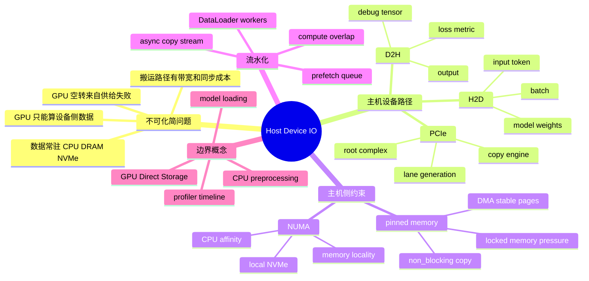
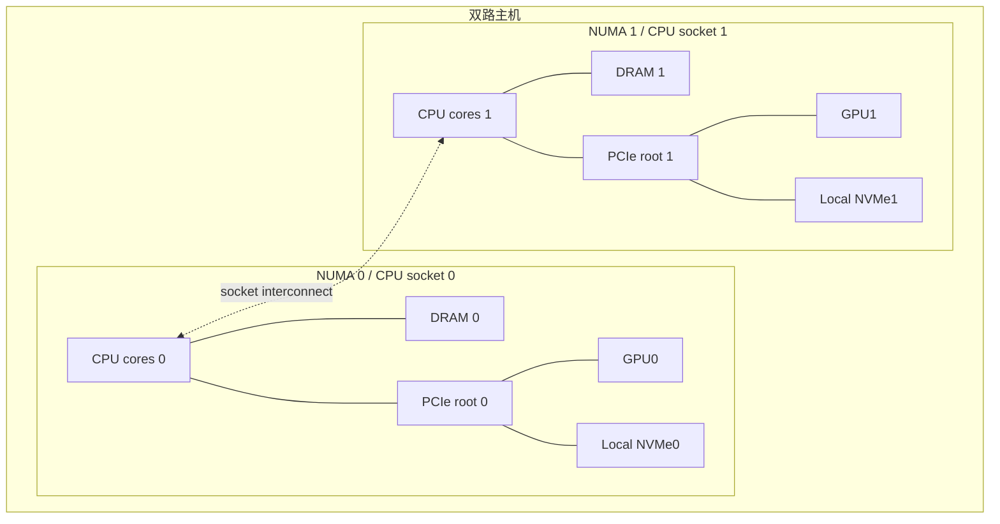
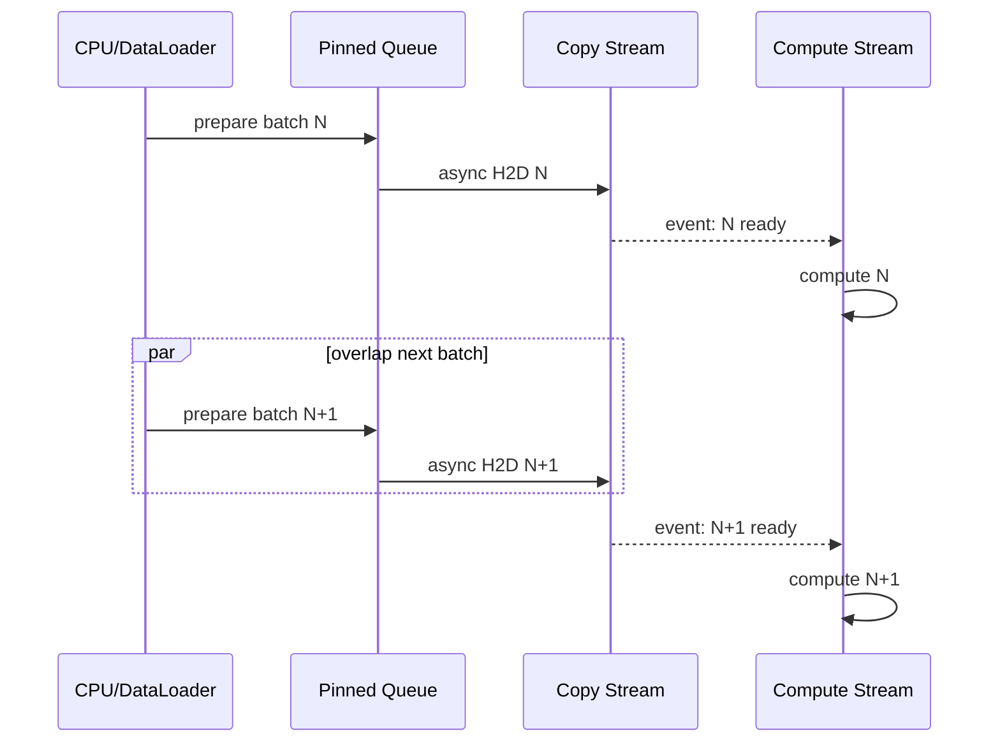
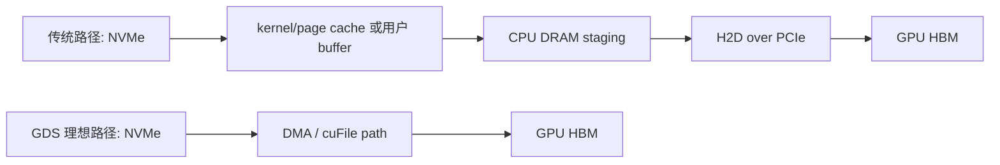

# 第5b章：主机到设备 IO、PCIe、NUMA 与重叠执行

> **关联章节**：本章是 [第5章](./05-memory-interconnect-io.md) 中主机到设备 IO 的独立展开。这里专注单机内 CPU、DRAM、PCIe、GPU、NVMe 与运行时之间的数据搬运；GPU-GPU 互联见 [第4c章](./04c-gpu-interconnect-and-systems.md)，CUDA runtime 和 kernel 时间线见 [第6章](./06-cuda-runtime-and-kernels.md)，并行文件系统、RDMA 集群拓扑和 checkpoint 热层只在边界处提及。

## 1. 第一性原理拆解 + 学习大纲

### 拆 — 不可化简的问题

把 PCIe、NUMA、pinned memory、DataLoader、prefetch、async copy 这些名字先拿掉，主机到设备 IO 要解决的不可化简问题只有一个：**GPU 只能计算已经进入设备侧地址空间的数据，但真实业务的数据、模型权重和预处理逻辑经常先停在 CPU、DRAM、NVMe 或远端存储里；如果这些字节不能按正确顺序、正确粒度、正确亲和性持续送到 GPU，GPU 就会空转。**

这句话里有三层硬约束。

第一是**路径约束**。训练样本通常从文件系统或对象存储进入主机内存，经过解码、增强、tokenize、collate，再通过 PCIe 做 H2D；推理权重可能从磁盘读到 page cache，再进入 CPU DRAM，最后加载到 HBM；推理请求的输入 token、embedding、检索结果和小型特征也可能在 CPU 与 GPU 之间来回移动。每跨一次边界，都有带宽、延迟、排队和同步成本。

第二是**内存语义约束**。CPU pageable memory 可以被操作系统换页和迁移，对普通程序很方便，但 GPU DMA 不适合直接从任意 pageable 地址稳定读取；pinned memory 把页锁住，便于 DMA 和异步 H2D/D2H，却会消耗宝贵的主机内存并影响操作系统调度。NUMA 也不是抽象标签：CPU socket、内存通道、PCIe root complex 和 GPU/NIC/NVMe 的物理位置会决定同样一段拷贝是否绕过跨 socket 链路。

第三是**流水约束**。即使 PCIe 带宽足够，如果程序写成“CPU 准备 batch -> 同步 H2D -> GPU 计算 -> 再准备下一个 batch”，GPU 时间线仍然会有空洞。高效系统不是把每段都单独做快，而是把 CPU 读取、预处理、H2D、GPU compute、D2H 回传和模型加载组织成流水线，让可以并行的阶段真的重叠。

### 推 — 从这个问题如何推导出每个机制

从“GPU 需要设备侧数据”出发，第一步得到 H2D/D2H。H2D 是 host to device，常见于训练 batch、推理输入、模型权重加载；D2H 是 device to host，常见于 loss/metric、生成结果、embedding 导出、debug tensor 和 checkpoint 前的状态处理。它们走的通常不是 HBM 带宽，而是主机设备通道，最常见就是 PCIe。于是 HBM 很快不代表 H2D 很快，Tensor Core 很强不代表 dataloader 能喂满。

从“PCIe 连接在主机拓扑上”出发，第二步得到 NUMA 和拓扑亲和。双路服务器里，GPU 可能挂在 socket 0 的 root complex 下，dataloader worker 却跑在 socket 1，batch 内存也分配在 socket 1 的 DRAM。此时 H2D 可能先跨 CPU socket 再到 GPU，吞吐下降、延迟上升，还和其他跨 socket 流量争带宽。工程上必须把 worker CPU 亲和、内存分配、GPU 选择、本地 NVMe 和 NIC 位置一起看。

从“DMA 需要稳定页”出发，第三步得到 pinned memory。pinned memory 让主机内存页不被换出，GPU copy engine 可以更稳定地做 DMA；在 PyTorch 里常见开关是 `pin_memory=True`，再配合 `tensor.to(device, non_blocking=True)`。但 pinned memory 不是越多越好：锁页过多会挤压系统 page cache 和其他进程，反而让数据读取、模型加载和系统稳定性变差。

从“单次拷贝无法消除”出发，第四步得到 prefetch 和 async copy。优化目标不只是缩短 `t_h2d`，还要让它与 `t_compute` 重叠。DataLoader 可以提前准备下几个 batch；prefetcher 可以把下一个 batch 提前搬到 GPU；CUDA stream 可以让 H2D copy 与当前 batch 的 kernel 并行；模型服务可以在旧模型仍然服务时预热新权重。关键条件是：数据必须在 pinned memory 中、拷贝使用非阻塞语义、计算和拷贝在合适 stream 上排队，并且代码里没有意外同步点。

最后，从“数据可能来自存储”会推导出 GPU Direct Storage 的概念边界。GDS 的目标是减少 NVMe/存储到 GPU 路径上的 CPU bounce buffer 和多余复制，让数据更直接进入 GPU 内存。它不是“所有 IO 自动变快”的开关：数据格式解析、压缩解码、tokenization、图片增强、shuffle、权限和文件系统语义仍可能在 CPU 或存储层成为主瓶颈。本章只解释 GDS 在单机数据路径中的位置，不展开并行文件系统和 RDMA fabric 的容量规划。

### 概念先说清楚

H2D（host to device）是从主机侧内存到 GPU 设备侧内存的数据搬运，D2H（device to host）是反方向搬运。它们通常走 PCIe 或平台提供的主机设备互联，不走 HBM 内部带宽。训练 batch、推理输入、模型权重加载常见于 H2D；loss、metric、生成结果、debug tensor 常见于 D2H。GPU kernel 只能高效消费已经在设备侧地址空间里的 tensor，所以 H2D 不是外围小事，而是 GPU 能不能连续工作的供给链。

PCIe 是 CPU、GPU、NIC、NVMe 等设备接入主机系统的总线；NUMA 描述 CPU socket、内存控制器和设备之间的距离不均匀。GPU 挂在 socket 0 的 root complex 下，不代表运行在 socket 1 的 DataLoader worker 也同样近。batch 如果分配在远端 DRAM，H2D 可能先跨 socket，再走 PCIe 到 GPU。NUMA 错配不会让程序报错，但会把吞吐、延迟和尾部抖动都变差。

Pinned memory 是被锁住、不能被操作系统换出或迁移的主机内存页。它让 GPU copy engine 可以稳定 DMA，配合 `non_blocking=True` 和独立 copy stream，才有机会让 H2D 与 GPU compute 重叠。Pinned memory 不是越多越好：锁页太多会挤压 Page Cache、普通进程和内核回收空间。Overlap 也不是写了 async 就自动发生，它要求数据在 pinned memory、拷贝和计算在正确 stream 上排队、依赖用 event/wait 表达，并且代码里没有 `.item()`、`.cpu()` 这类隐式同步切断流水。

### 绘 — 因果链路



### 导 — 读完本章你应该能回答

1. 一个 batch 从磁盘到 GPU 计算，会经过哪些缓冲区、线程、内存语义和硬件路径？
2. H2D、D2H、PCIe、copy engine、pinned memory 和 `non_blocking=True` 分别解决哪一段问题？
3. 为什么 NUMA 错配会让同一张 GPU、同一份 batch 在不同进程绑定下表现不同？
4. PyTorch `DataLoader(num_workers, pin_memory, prefetch_factor, persistent_workers)` 这些参数各自影响什么？
5. 为什么“CPU 利用率很高”不等于“GPU 被喂满”，CPU 预处理如何造成 GPU 空转？
6. async copy 和 prefetch 要满足哪些条件才能真正重叠，而不是看起来写了异步、实际仍然串行？
7. GPU Direct Storage 能减少什么复制，不能替代哪些数据处理和存储系统设计？
8. 模型冷启动慢时，如何拆成下载、读盘、反序列化、CPU 内存、H2D、初始化和 warmup？

## 正文内容

### 5b.1 先把一条训练输入链路画出来

一个常见训练 step 的输入路径可以简化为：

```text
dataset shard / local NVMe / shared filesystem
  -> OS page cache 或用户态 buffer
  -> DataLoader worker 读取与解码
  -> CPU 预处理 / tokenize / collate
  -> pinned host memory
  -> H2D copy over PCIe
  -> GPU HBM
  -> forward / backward kernels
```

这条链路里每一段都可能是瓶颈：

| 阶段 | 主要资源 | 典型失败表现 | 常见动作 |
|------|----------|--------------|----------|
| 读取 shard | NVMe、文件系统、page cache | worker 等 IO，小文件大量 `stat/open` | shard 化、顺序读、热缓存 |
| 解码与预处理 | CPU core、SIMD、内存带宽 | CPU 满、GPU 等 batch | 增加 worker、优化格式、离线预处理 |
| collate | Python、内存分配、拷贝 | batch 间抖动、GIL 开销 | 减少 Python 对象、固定 shape、批量化 |
| pinned staging | DRAM、locked page | `pin_memory` 后系统抖动 | 控制 queue 深度、监控锁页 |
| H2D | PCIe、copy engine | 时间线里 H2D 与 compute 串行 | `non_blocking`、copy stream、prefetch |
| GPU compute | SM、HBM、kernel | GPU kernel 连续或有空洞 | 回到第4b/第6章分析 |

第一性判断很简单：**GPU 利用率低时，先不要急着改模型，先问 GPU 上一个 kernel 结束后，它在等什么。** 如果等的是下一个 batch 到达 HBM，问题就在本章。

### 5b.2 H2D 与 D2H：方向不同，工程含义也不同

H2D 和 D2H 都是主机设备间拷贝，但它们在 AI 系统中的频率和风险不同。

| 方向 | 常见数据 | 频率 | 对性能的影响 | 典型优化 |
|------|----------|------|--------------|----------|
| H2D | 训练 batch、推理输入、模型权重 | 高频或启动期大块 | 喂不满 GPU、冷启动慢 | pinned memory、prefetch、批量拷贝 |
| D2H | loss、metric、生成 token、embedding、debug tensor | 低频到中频 | 隐式同步、尾延迟、CPU 后处理堵塞 | 减少 `.item()`、批量回传、设备侧保留 |
| D2D | GPU 间 tensor | 取决于并行策略 | TP/PP/collective 性能 | 见第4c章 |
| Storage -> HBM | 权重、样本、特征 | 启动或流式读取 | 加载慢、CPU bounce buffer | GDS、mmap/streaming、分片 |

训练代码里最常见的 D2H 陷阱不是大块回传，而是小同步：

```python
loss_value = loss.item()       # D2H + 同步
print(tensor.mean())           # 可能触发同步
assert torch.isfinite(loss)    # 如果转到 Python bool，也会同步
```

这些操作看起来很小，但它们会迫使 CPU 等 GPU 完成之前的工作，并把异步流水切断。正确做法通常是降低频率、批量记录、在设备侧先归约，或让日志线程处理已经安全回传的结果。

### 5b.3 PCIe：主机设备通道，不是 HBM 的延伸

PCIe 负责 CPU、GPU、NIC、NVMe 等设备接入主机系统。对本章而言，它最重要的作用是承载 H2D/D2H 和部分 storage/GPU 路径。

| PCIe 代际与宽度 | 理论单向带宽数量级 | 直觉 |
|------------------|--------------------|------|
| PCIe 3.0 x16 | ~16 GB/s | 旧训练节点常见，H2D 更容易显眼 |
| PCIe 4.0 x16 | ~32 GB/s | 大量 A100/H100 PCIe 节点基础配置 |
| PCIe 5.0 x16 | ~64 GB/s | 新一代主机设备通道，仍低于 HBM 数量级 |
| PCIe 4.0 x8 | ~16 GB/s | lane 降级后可能接近上一代 x16 |

这些数字和 HBM 的 TB/s 级带宽不是一个数量级。所以不要把“GPU 算得很快”自动外推成“主机数据随便搬”。一个粗略公式是：

```text
t_h2d_lower_bound ≈ batch_bytes / effective_pcie_bandwidth
```

如果每 step 需要搬 1 GB 输入，PCIe 4.0 x16 理论下限约 31 ms；实际还会受到 pageable memory、NUMA、拷贝粒度、copy engine 并发和同步点影响。若 step compute 只有 40 ms，而 H2D 串行 30 ms，GPU 利用率自然上不去。

#### 5b.3.1 PCIe 拓扑为什么会影响同一份代码

双路服务器的路径大致像这样：



如果进程使用 GPU0，但 DataLoader worker 主要跑在 NUMA 1，内存也分配在 DRAM 1，那么 H2D 到 GPU0 前可能先跨 socket。表现可能是：

- 单卡 benchmark 正常，训练实际吞吐偏低；
- 两个进程分别用 GPU0/GPU1 时互相干扰；
- `pin_memory=True` 后收益不稳定；
- 本地 NVMe 读速正常，但端到端 batch 到达时间抖动。

常用检查工具：

| 目标 | 命令 / 工具 | 看什么 |
|------|-------------|--------|
| GPU/PCIe/NIC 拓扑 | `nvidia-smi topo -m` | GPU 到 CPU affinity、PIX/PXB/PHB/SYS |
| NUMA 结构 | `numactl --hardware`、`lscpu` | socket、core、memory node |
| PCIe 协商速率 | `nvidia-smi -q`、`lspci -vv` | generation、width 是否降级 |
| CPU 绑定 | `taskset`、`numactl --cpunodebind` | worker 是否跑在近端 socket |
| 内存绑定 | `numactl --membind`、`numastat` | page 是否落在近端 DRAM |

### 5b.4 Pinned memory：为什么它能让 H2D 更稳

普通 CPU tensor 默认在 pageable memory 中。操作系统可以把这些页移动、换出或延迟实际分配；这对通用程序很有价值，但对 GPU DMA 不友好。做 H2D 时，运行时可能需要先把 pageable 数据复制到一个内部 pinned staging buffer，再由 DMA 拷到 GPU。这样会多一次主机侧复制，也更难真正异步。

Pinned memory，也叫 page-locked memory，把主机页固定住，使 GPU copy engine 可以直接从稳定地址做 DMA。PyTorch 中最常见写法是：

```python
loader = DataLoader(
    dataset,
    batch_size=32,
    num_workers=8,
    pin_memory=True,
    prefetch_factor=2,
    persistent_workers=True,
)

for batch in loader:
    batch = batch.to("cuda", non_blocking=True)
    loss = model(batch)
```

注意这里有两个条件：

1. DataLoader 输出的 tensor 要在 pinned memory 中；
2. H2D 调用要使用非阻塞语义，且后续计算在正确依赖关系下排队。

如果只有 `pin_memory=True`，但拷贝时没有 `non_blocking=True`，CPU 侧仍可能等待拷贝完成；如果使用 `non_blocking=True`，但源数据不是 pinned memory，运行时也可能退化成同步或内部 staging。

Pinned memory 的收益与代价：

| 维度 | 收益 | 代价 |
|------|------|------|
| H2D/D2H 吞吐 | 减少 pageable staging，提高 DMA 稳定性 | 小 batch 时收益可能被 Python 开销掩盖 |
| 异步拷贝 | 更容易与 compute 重叠 | 需要 stream 和同步语义正确 |
| CPU 内存 | 减少额外复制 | 锁页过多会挤压 page cache |
| 系统稳定性 | 拷贝延迟更可预测 | 多任务环境下可能让主机内存紧张 |

工程经验：pinned memory 适合高频 H2D 的训练和推理输入，但不要无限加大 prefetch 队列。一个 8 GPU 训练进程如果每 GPU 预取 4 个 2 GB batch，光 pinned staging 就可能锁住数十 GB DRAM，再叠加 page cache、worker buffer 和模型加载，很容易把主机侧拖慢。

### 5b.5 DataLoader：不是“把 num_workers 调大”这么简单

PyTorch DataLoader 通常承担四件事：

```text
索引样本 -> 读取数据 -> CPU 处理 -> 组装 batch
```

常见参数的第一性含义如下：

| 参数 | 控制什么 | 太小的问题 | 太大的问题 |
|------|----------|------------|------------|
| `num_workers` | 并行读取/预处理进程数 | CPU 喂不满 GPU | 进程切换、内存放大、IO 争抢 |
| `pin_memory` | 输出 batch 是否进入 pinned memory | H2D 异步和吞吐受限 | 锁页压力、主机内存紧张 |
| `prefetch_factor` | 每个 worker 预取 batch 数 | GPU 等 worker | 内存和 pinned queue 放大 |
| `persistent_workers` | epoch 间是否保留 worker | 每个 epoch 重启慢 | dataset 状态需要正确管理 |
| `batch_size` | 单次搬运粒度 | 小拷贝过多、launch/调度开销高 | 显存、激活和尾延迟压力 |
| `collate_fn` | 样本如何组成 batch | 默认逻辑不适合复杂结构 | Python 对象和拷贝容易失控 |

调参要看时间线，而不是凭感觉。一个实用顺序是：

1. 先固定模型和 batch，测没有数据增强时的上限。
2. 开启真实 dataset，观察 GPU 是否有周期性空洞。
3. 增加 `num_workers`，直到 GPU 空洞缩小或 CPU/IO 开始饱和。
4. 开启 `pin_memory=True` 和 `non_blocking=True`，看 H2D 是否缩短或重叠。
5. 调 `prefetch_factor`，只保留能平滑抖动的最小队列。
6. 检查 NUMA 绑定，确保 worker、内存和 GPU 尽量近。

#### 5b.5.1 CPU 预处理如何制造 GPU 空转

CPU 预处理的瓶颈常常被误判成“磁盘慢”。典型例子包括：

- JPEG/PNG 解码占满 CPU，NVMe 实际很空；
- tokenizer 单线程或 Python 对象过多；
- 随机 crop、resize、augment 没有向量化；
- collate 时对大量变长样本做 Python list 操作；
- 每个样本都打开小文件和解析 JSON；
- 数据增强用到了全局锁或不可并发库。

判断方法：

| 观察 | 可能原因 | 下一步 |
|------|----------|--------|
| GPU 空洞稳定出现在每 step 开头 | H2D 或 batch 准备串行 | 看 nsys 时间线 |
| CPU 全核高，但磁盘不高 | 解码/预处理 CPU-bound | profile worker、离线处理 |
| 磁盘高、CPU 中等 | IO-bound | shard、顺序读、本地缓存 |
| worker 内存持续涨 | prefetch 或对象泄漏 | 降 queue、查 dataset 状态 |
| epoch 边界卡很久 | worker 重启、shuffle、重新扫描 | `persistent_workers`、索引缓存 |

一个平台侧改进常常比模型侧优化更有效：把原始小文件转换成合适大小的 shard，把昂贵 tokenizer 结果离线缓存，把图片预处理转成更高效的数据格式，让训练进程读“已经接近 tensor 的数据”。

### 5b.6 Prefetch 与 async copy：把串行链路改成流水线

串行训练 step 可以写成：

```text
CPU prepare batch N
  -> H2D batch N
  -> GPU compute batch N
  -> CPU prepare batch N+1
```

健康的流水线更像：

```text
CPU prepare batch N+1   overlaps   GPU compute batch N
H2D batch N+1           overlaps   late compute batch N
GPU compute batch N+1   starts after copy event
```

用 Mermaid 画成时间线：



一个简化的 PyTorch prefetcher 思路如下：

```python
class CUDAPrefetcher:
    def __init__(self, loader, device):
        self.loader = iter(loader)
        self.device = device
        self.stream = torch.cuda.Stream()
        self.next_batch = None
        self.preload()

    def preload(self):
        try:
            batch = next(self.loader)
        except StopIteration:
            self.next_batch = None
            return

        with torch.cuda.stream(self.stream):
            self.next_batch = batch.to(self.device, non_blocking=True)

    def next(self):
        torch.cuda.current_stream().wait_stream(self.stream)
        batch = self.next_batch
        self.preload()
        return batch
```

这段代码只表达机制，不是生产级模板。真实系统还要处理 nested batch、多个 tensor、labels、异常、epoch 边界、device placement、CUDA graph 静态 buffer 和多 GPU rank。

async copy 真正生效的条件：

| 条件 | 为什么重要 |
|------|------------|
| 源 tensor 在 pinned memory | pageable memory 难以稳定异步 DMA |
| 使用 `non_blocking=True` | 允许 CPU 不等待拷贝完成 |
| H2D 与 compute 在不同 stream 或合理排队 | 否则仍然串行 |
| 后续 compute 等待 copy event | 避免读到未完成的数据 |
| 没有 `.item()`、`torch.cuda.synchronize()` 等同步点 | 同步点会切断重叠 |
| batch 足够大且粒度合适 | 太碎的小拷贝调度成本高 |

#### 5b.6.1 H2D Overlap CapacityLedger

H2D 优化不要只看 `pin_memory=True` 有没有打开，要算 visible copy gap。每个训练或推理加载路径至少填写下面这张账本：

| 项 | 公式 / 填写方式 | 证据来源 | threshold |
|----|-----------------|----------|-----------|
| 单 step 输入字节 | `batch_bytes = sum(tensor.numel * element_size)`，包含 labels、mask、features | batch 采样、profiler、框架日志 | 必须区分解码前文件大小和 H2D tensor 大小 |
| PCIe 理论下限 | `t_h2d_min = batch_bytes / effective_pcie_bandwidth` | `lspci -vv`、`nvidia-smi -q`、节点池 H2D microbench | 实测 H2D 超过理论下限 2 倍时要查 pageable、NUMA、粒度和同步 |
| 可见拷贝空洞 | `visible_copy_gap = max(0, t_h2d_on_critical_path - overlapped_h2d)` | Nsight Systems、`torch.profiler` | `visible_copy_gap <= max(0.1 * t_step, 0.2 * t_compute)` |
| CPU prepare 窗口 | `t_prepare = read + decode + tokenize + collate` | profiler、DataLoader metric | `t_prepare` 必须被 prefetch 覆盖；P99 超过 compute 窗口会造成 GPU wait |
| pinned memory 预算 | `pinned_bytes = ranks_per_node * workers * prefetch_factor * batch_bytes` | DataLoader 参数、RSS、locked memory | pinned memory 建议不超过主机 DRAM 的 20%，且不能挤掉必要 page cache |
| NUMA 距离 | `GPU -> CPU/memory/NVMe` affinity | `nvidia-smi topo -m`、`numactl --hardware`、`numastat` | 远端 NUMA H2D 吞吐低于近端 85% 时要绑定或重排 |

如果 `t_compute=80ms`、`batch_bytes=1.6GB`、有效 PCIe 带宽按 28GB/s 计，`t_h2d_min≈57ms`。如果 profiler 看到 H2D 完全串行，那么单靠模型 kernel 优化无法让 step 低于 `80+57=137ms`。只有当 H2D 被 prefetch 和 copy stream 隐藏到 compute 后面，step 才可能接近 `max(t_compute, t_prepare, t_h2d)`。

#### 5b.6.2 BenchmarkProtocol：验证 PCIe、NUMA 与 overlap

| 目标 | 命令 / 方法 | 看什么 | 不通过时的处理 |
|------|-------------|--------|----------------|
| 拓扑路径 | `nvidia-smi topo -m`、`numactl --hardware`、`lspci -tv` | GPU、CPU、NVMe、NIC 是否跨 `SYS` 或远端 socket | 绑定 rank/worker/memory，或换 GPU/NVMe placement |
| PCIe 协商 | `lspci -vv`、`nvidia-smi -q` | link speed/width 是否符合 x16/目标代际 | 降级时 drain 节点、查 riser/BIOS/固件 |
| H2D 时间线 | `nsys profile python train.py` 或 `torch.profiler` | Memcpy HtoD 是否与 kernel 重叠；是否有同步点 | 加 pinned memory、`non_blocking=True`、copy stream、移除 `.item()` |
| 本地读盘干扰 | `iostat -x 1` 与 profiler 时间线对齐 | H2D 空洞是否其实来自 read/decode 等待 | 回到 05a/05d 治理 shard、cache、CPU decode |
| pinned memory 压力 | `/proc/meminfo`、cgroup memory、RSS、训练日志 | Locked/Page cache 是否互相挤压 | 降低 `prefetch_factor`、batch、workers 或拆进程 |

一个简单通过标准：在目标 batch size 下，H2D 的可见空洞低于 step time 的 10%；重复 200 step 后 step P99/P50 小于 1.3；`iostat await` 没有和 H2D 空洞同步尖刺；近端 NUMA 绑定比默认绑定没有低于 85% 的吞吐差距。

#### 5b.6.3 Troubleshooting：H2D、pinned memory 与 NUMA

| symptom | evidence | root cause | action | retest |
|---------|----------|------------|--------|--------|
| GPU 每 step 开头空 30-100ms | profiler 中 H2D Memcpy 在 compute 前串行；DataLoader queue 有数据 | 没有真正 async overlap，或源 tensor 不是 pinned memory | 开 `pin_memory=True`、`non_blocking=True`，用独立 copy stream 和 event/wait | H2D 与上一 batch compute 重叠；visible gap 低于 step 的 10% |
| `pin_memory=True` 后吞吐没提升，系统开始抖 | RSS/Locked memory 上升；page cache 下降；`iostat` 读延迟上升 | pinned queue 过大挤压 DRAM 和 page cache | 降 `prefetch_factor`/workers；按账本限制 pinned memory；把 shard 预热到 NVMe | step P99 收敛；Locked memory 低于 DRAM 20%；page cache miss 不再放大 |
| 同代码在 GPU0 慢、GPU1 快 | `nvidia-smi topo -m` 显示 GPU0 到 worker/内存/NVMe 跨 socket；`numastat` 远端页高 | NUMA 和 PCIe root 错配 | `numactl --cpunodebind --membind`，按 GPU 绑定 worker 和本地 NVMe | 近端绑定吞吐达到节点 baseline 85% 以上；P99 不再分 GPU 分化 |
| H2D 时间小但 GPU 仍空转 | DataLoader queue 为空；CPU profile 显示 decode/tokenize/collate 热点；`iostat` 不高 | CPU 预处理或 Python collate 是瓶颈 | 离线 tokenize/decode、shard 化、减少 Python 对象、固定 shape | `t_prepare` P99 小于 compute 窗口；queue depth 稳定大于 1 |
| 模型加载 H2D 阶段很长且 CPU RSS 接近上限 | 分段加载指标显示全模型先展开到 DRAM；H2D 串行；page cache 被挤掉 | 权重加载没有分片流水，CPU 临时副本过多 | 分片流式读、校验一片搬一片；限制同节点并发；预生成 dtype/layout | ready P95 达标；CPU RSS 峰值低于预算；H2D 与读/校验部分重叠 |

### 5b.7 模型加载：冷启动不是一个动作

在线推理和训练恢复里，模型加载经常被一句“load checkpoint 慢”概括，但它其实包含多段：

```text
远端下载 / 本地缓存命中
  -> 读文件 / page cache
  -> 反序列化和安全校验
  -> CPU DRAM 中形成 tensor
  -> dtype/shape/layout 转换
  -> H2D 到 GPU HBM
  -> runtime 初始化 / kernel autotune / CUDA graph capture
  -> warmup 请求
```

不同阶段的瓶颈和动作完全不同：

| 阶段 | 慢的原因 | 优化方向 |
|------|----------|----------|
| 下载 | 对象存储、网络、鉴权、限速 | 节点本地缓存、分层发布、并发下载 |
| 读盘 | 小文件多、page cache 冷、本地盘争抢 | safetensors 分片、顺序读、预热 |
| 反序列化 | Python pickle、CPU copy、校验 | 使用安全高效格式、减少中间对象 |
| dtype/layout 转换 | CPU 转换、临时内存放大 | 预转换制品、设备侧转换、分块 |
| H2D | PCIe 带宽、pinned staging | 分片加载、非阻塞拷贝、近端 NUMA |
| 初始化 | kernel autotune、allocator、CUDA context | 预热、固定 shape、保留热实例 |
| warmup | 首次请求触发编译或 cache | 启动前 warmup、灰度切流 |

模型加载的一个重要工程边界：**不要把所有权重同时展开到 CPU DRAM 再搬到 GPU，除非主机内存预算明确足够。** 大模型服务在多副本滚动升级时，CPU DRAM 可能同时承载旧模型、新模型、page cache、pinned staging 和服务运行时对象。更稳妥的做法是分片流式加载、控制并发、复用本地缓存，并在上线前测峰值 RSS 和 H2D 时间。

### 5b.8 GPU Direct Storage：概念边界要清楚

GPU Direct Storage 可以粗略理解为：让 NVMe 或支持路径上的存储数据更直接地进入 GPU 内存，减少 CPU bounce buffer 和多余内存复制。简化路径如下：



GDS 能帮助的，是“数据已经是 GPU 可以消费的块，并且路径支持直接搬运”的场景，例如大 tensor、特征块、部分 checkpoint shard、预处理后的训练样本。它不能自动解决：

- JPEG/PNG/文本/JSON 的解析和解码；
- tokenizer、数据增强、随机采样和复杂 collate；
- 小文件元数据风暴；
- 对象存储的延迟、列表语义、鉴权和重试；
- 并行文件系统的容量规划、stripe、元数据热点；
- 模型格式不适合流式读取或需要大量 CPU 反序列化。

所以 GDS 的判断方式不是“能不能打开”，而是：

| 问题 | 如果答案是“否” |
|------|----------------|
| 数据是否已经接近 tensor/block 格式？ | 先做数据格式治理 |
| 访问粒度是否足够大且顺序性较好？ | 先合并小文件和 shard |
| GPU 是否真的在等 storage -> HBM？ | 先用 profiler 确认瓶颈 |
| 文件系统、驱动、设备路径是否支持？ | 先做兼容性和回退设计 |
| CPU 预处理是否已经不是主瓶颈？ | GDS 收益会被 CPU 阶段吞掉 |

本章不展开 RDMA、多节点并行文件系统和跨机房对象存储设计。对平台工程来说，GDS 是主机设备 IO 工具箱的一件工具，不是替代数据治理、缓存层和训练热层的总方案。

### 5b.9 工程案例一：GPU 利用率锯齿化的训练作业

现象：

- 8×H100 单机训练，模型 compute 本身不重；
- `nvidia-smi dmon` 显示 GPU 利用率在 20%-95% 间周期性跳动；
- step time P50 180 ms，P99 420 ms；
- CPU 利用率高，NVMe 利用率中等；
- 开启更多 DataLoader worker 后吞吐提升有限。

拆解：

| 观察 | 推断 |
|------|------|
| GPU 时间线每 step 前有 80-150 ms 空洞 | GPU 在等下一个 batch |
| H2D 拷贝与 compute 串行 | 没有有效重叠 |
| worker CPU 高但 NVMe 不满 | 预处理或 collate 是瓶颈 |
| `pin_memory=False` | H2D 可能经过 pageable staging |
| worker 分布在两个 socket | 部分 batch 跨 NUMA 到近端 GPU |

处理顺序：

1. 把 dataset 小文件转换为每个 128 MB 到 1 GB 的 shard，减少 open/stat 和 Python 对象。
2. 把 tokenizer 和固定增强离线处理，训练时只做轻量随机操作。
3. 设置 `pin_memory=True`、`persistent_workers=True`，从小的 `prefetch_factor` 开始。
4. 使用 `non_blocking=True` 和 prefetcher，让 H2D 与上一 batch compute 重叠。
5. 按 GPU 拓扑绑定进程、worker 和内存，避免 GPU0 的数据主要来自远端 NUMA。
6. 用 Nsight Systems 复测，确认 CUDA HW row 空洞减少。

结果预期不是“GPU 利用率永远 100%”，而是 step time 抖动收敛、H2D 不再阻塞主路径、CPU 预处理不再成为周期性长尾。

### 5b.10 工程案例二：模型服务冷启动慢

现象：

- 70B 级模型服务滚动升级，单副本从启动到可接流量需要 12 分钟；
- 权重已在本地 NVMe 缓存，远端下载不是主因；
- GPU 显存加载阶段 `nvidia-smi` 显示显存逐步上升；
- CPU RSS 峰值接近机器内存上限，偶发 OOM killer；
- warmup 前几个请求 P99 很高。

拆解冷启动时间：

| 阶段 | 时间 | 问题 |
|------|------|------|
| 读本地权重 | 90 s | 分片较多，但不是主瓶颈 |
| 反序列化 | 260 s | CPU 单进程处理、临时对象多 |
| dtype/layout 转换 | 120 s | CPU 临时内存放大 |
| H2D | 160 s | 串行搬运，没有分片流水 |
| runtime warmup | 90 s | 首请求触发 autotune/graph |

改进方案：

- 把权重格式切到更适合顺序读取和安全反序列化的格式；
- 发布前预生成目标 dtype/layout，减少启动时 CPU 转换；
- 分片流式加载：读一片、校验一片、搬一片，不在 CPU DRAM 同时展开全模型；
- 限制同节点同时启动副本数，避免 page cache、pinned memory 和 H2D 争用；
- 在接流量前做固定 shape warmup，并把 CUDA context、allocator 和 graph capture 时间纳入启动预算；
- 将模型缓存、加载进度、H2D 时间、warmup 时间拆成独立指标。

这里的关键不是单纯“读盘更快”，而是把冷启动拆成可观测的多段，并控制 CPU 内存峰值与 H2D 串行时间。

### 5b.11 常见误区

#### 误区一：`num_workers` 越大越好

不对。`num_workers` 增大只是在读和预处理阶段增加并行度。如果瓶颈是 H2D 串行、NUMA 错配、锁页压力或文件系统元数据，继续加 worker 只会放大内存和 IO 争抢。

#### 误区二：`pin_memory=True` 一定提升性能

不一定。它需要和 `non_blocking=True`、合适的 batch 粒度、正确 stream 和足够主机内存配合。小模型、小 batch、CPU 预处理瓶颈明显或主机内存紧张时，收益可能很小甚至变差。

#### 误区三：GPU Direct Storage 可以替代 DataLoader 优化

不对。GDS 减少的是部分 storage 到 GPU 路径上的 CPU staging。数据解码、tokenization、随机增强、shuffle、小文件治理和 dataset 格式仍然需要单独设计。

#### 误区四：D2H 很小，可以随便做

不对。很多 D2H 问题不是字节数大，而是同步语义强。频繁 `.item()`、打印 GPU tensor、把判断转成 Python bool，会让 CPU/GPU 流水被切断。

#### 误区五：模型加载慢就是磁盘慢

不一定。冷启动慢可能来自反序列化、CPU 内存峰值、dtype/layout 转换、H2D 串行、CUDA context 初始化、kernel autotune 或 warmup。必须分段测量。

### 5b.12 排障 Checklist

#### 训练输入链路

- [ ] GPU 时间线是否存在每 step 开头的空洞？
- [ ] `t_load`、`t_h2d`、`t_compute` 是否分别测量，而不是只看总 step time？
- [ ] DataLoader worker 是否 CPU-bound、IO-bound，还是被锁/队列阻塞？
- [ ] `pin_memory=True` 是否开启，H2D 是否使用 `non_blocking=True`？
- [ ] H2D copy 是否与 compute 重叠，还是在同一 stream 上严格串行？
- [ ] 是否存在 `.item()`、`torch.cuda.synchronize()`、打印 GPU tensor 等隐式同步？
- [ ] `num_workers` 和 `prefetch_factor` 是否导致主机内存或 pinned memory 过高？
- [ ] dataset 是否存在大量小文件、重复 JSON 解析、低效 tokenizer 或重 CPU 增强？

#### NUMA 与 PCIe

- [ ] `nvidia-smi topo -m` 是否显示 GPU 与 CPU/NIC/NVMe 的距离？
- [ ] 训练进程、DataLoader worker、内存分配是否绑定到靠近目标 GPU 的 NUMA node？
- [ ] PCIe generation 和 lane width 是否符合预期，是否发生 x16 -> x8 或降代？
- [ ] 多 GPU 并发 H2D 是否共享同一个 PCIe switch 上行并互相争抢？
- [ ] 本地 NVMe 是否与使用它的 GPU 在相同或相近 root complex 下？

#### 模型加载与推理

- [ ] 冷启动是否拆成下载、读盘、反序列化、转换、H2D、初始化、warmup？
- [ ] CPU DRAM 峰值是否被监控，是否同时展开多份模型？
- [ ] 权重格式是否支持顺序读取、分片加载和低开销校验？
- [ ] H2D 权重加载是否可分片流水，而不是全量 CPU 展开后串行搬运？
- [ ] warmup 是否在接流量前完成，首请求是否还触发编译、autotune 或 graph capture？

#### GDS 边界

- [ ] 当前瓶颈是否真的是 storage -> GPU 数据路径？
- [ ] 数据是否已经是大块 tensor/block，而不是需要大量 CPU 解码的原始格式？
- [ ] 文件系统、驱动、GPU、NVMe 路径是否支持目标 GDS 模式？
- [ ] 是否有无 GDS 回退路径和可对比 benchmark？
- [ ] 小文件、shuffle、metadata 和远端对象存储语义是否已经单独治理？

### 5b.13 本章涉及的常见工具

| 目标 | 工具 / 命令 | 用法 |
|------|-------------|------|
| GPU 时间线 | `nsys profile python train.py` | 看 H2D、kernel、同步点是否重叠 |
| PyTorch 数据链路 | `torch.profiler` | 看 DataLoader、CPU op、CUDA copy |
| GPU 状态 | `nvidia-smi dmon`、DCGM | 利用率、PCIe rx/tx、显存、功耗 |
| 拓扑 | `nvidia-smi topo -m` | GPU、CPU、NIC、NUMA 距离 |
| PCIe 详情 | `nvidia-smi -q`、`lspci -vv` | 协商速率、lane width、错误 |
| NUMA | `numactl --hardware`、`numastat`、`lscpu` | socket、内存分布、远端访问 |
| CPU profile | `py-spy`、`perf`、`cProfile` | tokenizer、decode、collate 热点 |
| IO 观察 | `iostat`、`pidstat -d`、`strace -c` | 读盘吞吐、小文件 syscall、抖动 |
| PyTorch 内存 | `torch.cuda.memory_summary()` | 显存池、峰值、fragmentation |
| GDS 验证 | `gdscheck`、`cuFile` sample | 检查驱动、文件系统和设备支持 |

## 本章小结

| 主题 | 关键结论 |
|------|----------|
| 主机到设备链路 | GPU 空转常常来自 batch 没有及时进入 HBM，而不是算子慢 |
| PCIe | H2D/D2H 走主机设备通道，带宽数量级远低于 HBM |
| NUMA | CPU worker、DRAM、GPU、NVMe 的物理距离会影响同一份代码的吞吐 |
| pinned memory | 让 DMA 和异步拷贝更稳定，但锁页过多会伤害主机系统 |
| DataLoader | `num_workers`、`pin_memory`、`prefetch_factor` 要按瓶颈调，不是越大越好 |
| prefetch/async copy | 目标是让 CPU prepare、H2D 和 GPU compute 重叠，并避免隐式同步 |
| GDS | 减少部分 storage -> GPU 路径复制，但不替代数据格式、解码和存储热层设计 |
| 模型加载 | 冷启动要拆成下载、读盘、反序列化、转换、H2D、初始化和 warmup |

---

## 练习题

### 基础题

1. 用自己的话解释 H2D 和 D2H 的区别，并各举三个 AI 系统中的例子。
2. 为什么 PCIe 4.0 x16 的带宽不能和 HBM 带宽混为一谈？
3. `pin_memory=True` 和 `non_blocking=True` 分别解决什么问题？缺少其中一个会怎样？
4. DataLoader 的 `num_workers`、`prefetch_factor`、`persistent_workers` 分别影响哪一段链路？
5. 列出 5 种会触发 CPU/GPU 同步、破坏异步流水的代码写法。

### 进阶题

6. 某训练任务每 step compute 45 ms，H2D 串行 28 ms，CPU 预处理 35 ms。请画出串行时间和理想重叠后的时间下限，并说明还需要满足哪些条件。
7. 一台双路服务器中 GPU0 靠近 NUMA 0，本地 NVMe 在 NUMA 1。训练进程使用 GPU0，DataLoader 读 NVMe1。请分析可能的路径和优化方案。
8. 开启 `pin_memory=True` 后，训练吞吐没有提升，主机内存反而紧张。请列出至少 5 个排查点。
9. 一个模型服务冷启动慢，你如何设计指标，把“加载慢”拆成可定位的阶段？
10. 什么时候 GPU Direct Storage 可能带来收益？什么时候即使开启也不会改善端到端性能？

### 开放题

11. 设计一个训练输入 pipeline 的 profiling SOP，要求新同事能判断瓶颈在存储、CPU 预处理、H2D、同步点还是 GPU compute。
12. 你的团队要把一个图像训练任务从“读取原始 JPEG + 在线增强”改成更高吞吐的数据格式。请设计数据格式、shard 大小、缓存策略和回退方案。
13. 线上推理平台要支持 10 个大模型滚动升级。请从模型缓存、CPU DRAM 峰值、H2D、warmup、灰度切流和失败回滚角度设计加载流程。
14. 某同事建议“直接上 GDS，DataLoader 就不用管了”。请用本章的边界概念写一段技术评审意见。
